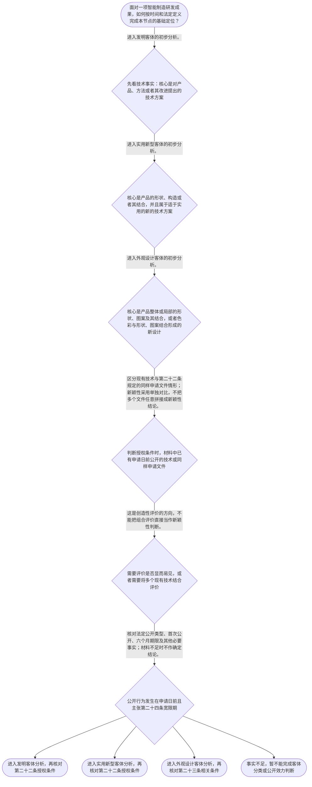

# 整合后的课程完整内容与习题

## 教学模块选择清单

- 当前教学节点：`patent-law-foundation`
- 板块预算：自适应 5/6，总计 9/9

| # | 模块 (block_type) | 类型 | 触发原因 (trigger) | 对应正文段 | 归属 |
|---:|---|:--:|---|---|:--:|
| 1 | `anchor_scenario` | 自适应 | perception=sensing(0.87) / cold_start | 智能制造研发立项场景｜某智能制造企业的研发组完成了两项成果：第一项是根据机器人关节的振动传感数据动态修正焊接路径的… | [A+B融合] |
| 2 | `legal_anchor` | 必选 | mandatory | 法条锚定：客体、制度目的与授权入口｜《专利法》第二条 | [A+B融合] |
| 3 | `worked_example` | 自适应 | cold_start(low_confidence) | 案例演示：从技术事实到专利客体与授权入口｜某智能制造企业研发了两项成果：甲方案根据机器人振动传感数据实时调整焊接路径，核心是控制步骤和… | [A+B融合] |
| 4 | `decision_flow` | 自适应 | input=visual(0.82) | 专利基础定位决策流程｜面对一项智能制造研发成果，如何按时间和法定定义完成本节点的基础定位？ | [A+B融合] |
| 5 | `mnemonic` | 自适应 | understanding=sequential(0.78) | 客体与授权条件双层记忆表｜两张核对表：第一张“发—实—外”用于客体分类；第二张“三性—单独/组合”用于授权判断。发：产… | [A+B融合] |
| 6 | `predict_activate` | 自适应 | processing=active(0.72) | 先预测：公开行为应如何定位｜某企业准备把机器人关节模组带到展会上展示，并在之后提交申请。提交申请前，请先预测：判断该展示… | [B] |
| 7 | `assessment` | 必选 | mandatory | 三类测评闭环｜复习专利法上的三类发明创造客体。 | [A+B融合] |
| 8 | `knowledge_synthesis` | 必选 | mandatory | 专利法律制度基础知识框架｜专利制度基本概念与特征：独占性、时间性、地域性是理解专利权制度边界的分析维度；本轮检索上下文… | [A+B融合] |
| 9 | `summary_card` | 自适应 | len(knowledge_sub_nodes)=3>=3 | 专利制度基础速查卡｜智能制造成果先按第二条完成客体定位，再按时间基准和相应授权规则判断能否获得专利权。 | [A+B融合] |

## 教学正文

## I — 问题定位：先确定“保护什么”

智能制造研发成果进入专利分析时，第一步不是直接问“有没有新颖性”或“会不会侵权”，而是先把技术事实放入专利法的客体框架。比如，依据传感数据调整机器人焊接路径，重点可能是控制步骤和方法；末端执行器的特殊内部支撑结构，重点可能是产品构造；产品外壳的形状、图案或色彩组合，则可能涉及外观设计。

这里要建立一个顺序意识：客体分类解决“先按哪一类专利分析”，授权条件解决“能否获得授权”，专利权保护和侵权判定则属于后续节点。不能因为一项成果听起来先进，或应用在智能制造领域，就直接得出“已经具备新颖性”或“不会侵权”的结论。

## R — 法律规则

### 1. 三类专利客体

〔RAG: 中华人民共和国专利法.txt — 第二条：本法所称的发明创造是指发明、实用新型和外观设计。发明，是指对产品、方法或者其改进所提出的新的技术方案；实用新型，是指对产品的形状、构造或者其结合所提出的适于实用的新的技术方案；外观设计，是指对产品的整体或者局部的形状、图案或者其结合以及色彩与形状、图案的结合所作出的富有美感并适于工业应用的新设计〕

用人话说：

- 发明的法定定义可以覆盖产品、方法或者其改进提出的新的技术方案。机器人控制算法与焊接路径调整步骤，若其核心确实是方法技术方案，应先进入发明客体分析。
- 实用新型聚焦产品的形状、构造或者其结合，并要求该技术方案适于实用。末端执行器的内部支撑结构，若核心是产品构造，应先进入实用新型客体分析。
- 外观设计关注产品整体或局部的形状、图案及其结合，或者色彩与形状、图案的结合所形成的富有美感并适于工业应用的新设计。它关注的是产品外观设计，不是设备内部控制逻辑。

因此，“用于机器人”“属于智能制造”“技术很复杂”都不是客体分类的直接标准。真正的分类判据是：技术方案的核心事实究竟落在方法、产品构造，还是产品外观。

### 2. 专利制度的目的与规范体系

〔RAG: 中华人民共和国专利法.txt — 第一条：为了保护专利权人的合法权益，鼓励发明创造，推动发明创造的应用，提高创新能力，促进科学技术进步和经济社会发展，制定本法〕

专利制度把技术成果的公开、申请、审查和权利保护连接起来，制度目的包括鼓励发明创造、推动发明创造应用、提高创新能力以及促进科技进步和经济社会发展。关于专利权的独占性、时间性和地域性，可以把它们作为理解权利边界的基础分析维度，但本次检索上下文未提供一组完整条文来展开其具体效力、期限和地域规则。

中国专利制度的主要规范材料包括《专利法》《专利法实施细则》和《专利审查指南》。〔RAG: 中华人民共和国专利法实施细则.txt — 第一条：根据《中华人民共和国专利法》，制定本细则〕〔RAG: 中华人民共和国专利法实施细则.txt — 第一百四十八条：国务院专利行政部门根据专利法和本细则制定专利审查指南〕 实施细则和审查指南用于承接和细化专利法中的申请、手续与审查事项；具体问题仍应核对对应条文，不能只凭概括性口号判断。

### 3. 授权条件的入口与边界

〔RAG: 中华人民共和国专利法.txt — 第二十二条：授予专利权的发明和实用新型，应当具备新颖性、创造性和实用性；新颖性，是指该发明或者实用新型不属于现有技术；创造性，是指与现有技术相比，该发明具有突出的实质性特点和显著的进步，该实用新型具有实质性特点和进步；实用性，是指该发明或者实用新型能够制造或者使用，并且能够产生积极效果〕

第二十二条建立了发明和实用新型的“三性”门槛：新颖性、创造性和实用性缺一不可。现有技术以申请日以前在国内外为公众所知的技术为时间基准。这里先掌握框架即可：新颖性、创造性和抵触申请的专项判断属于后续节点，本节只强调规则边界。

新颖性与创造性不能混用。新颖性原则上问一个对比对象是否已经公开了同样的技术内容，不能为了凑齐全部特征而任意拼接多份文件；创造性则进一步评价相对于现有技术是否显而易见，必要时才进入组合评价。抵触申请应按照第二十二条关于申请日前提出、申请日以后公布的同样发明或者实用新型申请文件的规则定位，不能简单称为普通现有技术，也不能直接当作创造性组合材料。

### 4. 公开时间、审查流程与特殊事项

申请日前公开是否影响新颖性，不能只看“是否在展会展示”。〔RAG: 中华人民共和国专利法.txt — 第二十四条：申请专利的发明创造在申请日以前六个月内，在中国政府主办或者承认的国际展览会上首次展出的等法定情形，不丧失新颖性〕 还要核对公开类型、是否首次公开、申请日与公开日的距离以及其他适用事实。宽限期是特定法定公开情形的时间规则，不是对所有公开行为的一般豁免。

〔RAG: 中华人民共和国专利法.txt — 第三十四条：发明专利申请经初步审查认为符合本法要求的，自申请日起满十八个月，即行公布；第三十五条：发明专利申请自申请日起三年内，国务院专利行政部门可以根据申请人随时提出的请求，对其申请进行实质审查〕 由此可以看出，发明专利申请存在初步审查、申请公布和实质审查等程序线索。〔RAG: 中华人民共和国专利法实施细则.txt — 第五十条：初步审查是指审查专利申请是否具备规定的文件和其他必要文件、文件格式是否符合规定，并审查列举的明显不符合事项〕 初步审查与实质审查的程序功能不同，不能把申请已经公布或已经通过初步审查理解为已经完成三性判断。

对于特殊事项，〔RAG: 中华人民共和国专利法.txt — 第四条：申请专利的发明创造涉及国家安全或者重大利益需要保密的，按照国家有关规定办理〕 因此涉及国家安全或重大利益时，应先核对保密程序。〔RAG: 中华人民共和国专利法.txt — 第六条：执行本单位的任务或者主要是利用本单位的物质技术条件所完成的发明创造为职务发明创造；职务发明创造申请专利的权利属于该单位〕 职务发明的权利归属也应依条文和事实核对，不能只因研发人员个人提出技术设想，就当然认定申请权归个人。

## A — 规则适用：智能制造场景

对“根据振动数据动态调整机器人焊接路径”的方案，先抽取数据输入、处理步骤和控制结果等技术事实。其核心若是方法步骤，而不是特定产品形状或构造，应先按发明客体分析。对“末端执行器内部特殊支撑构造”的方案，先抽取结构连接、位置关系和产品构造等事实，应先按实用新型客体分析。若研发成果核心仅是产品外观的形状、图案或色彩组合，则转入外观设计客体分析。

完成客体定位后，才进入授权条件判断。对于发明和实用新型，要依第二十二条核对新颖性、创造性和实用性；对于展会展示，要以申请日为基准核对第二十四条及具体公开事实；对于申请公布和实质审查，要区分程序阶段与实体授权条件。至于侵权判定，本节点只作边界提示：侵权问题需要进一步分析有效专利权、权利要求或外观设计保护范围以及被诉行为，不能仅凭“属于发明”或“属于实用新型”得出侵权结论。

## C — 结论与易错提醒

本节点的主线是“先定客体，再看授权条件，最后进入后续保护专题”。智能制造控制方法通常先按发明客体分析，产品形状或构造技术方案通常先按实用新型客体分析，产品整体或局部外观的新设计则先按外观设计客体分析。发明和实用新型的授权还须满足第二十二条规定的新颖性、创造性和实用性。

常见误区一：把“应用于智能制造设备”直接等同于实用新型。正解是回到技术事实，看核心限定是方法步骤、产品构造还是产品外观；区分判据是方案的主要技术特征，而不是所属行业。

常见误区二：把“属于发明客体”当成“已经具备新颖性”。正解是客体分类只确定分析入口，之后仍要依第二十二条审查三性；区分判据是前者回答“是什么”，后者回答“是否满足授权门槛”。

常见误区三：把新颖性和创造性都当成“把所有资料拼起来看”。正解是新颖性原则上进行单独对比，创造性才评价相对于现有技术是否显而易见；区分判据是是否允许组合多个现有技术，以及所适用的法定评价问题不同。

常见误区四：把抵触申请当作普通现有技术或创造性组合材料。正解是抵触申请应依第二十二条关于申请日前提出、申请日以后公布的同样申请文件的规则评价新颖性；区分判据是其特殊的申请与公布时间关系以及评价范围。

常见误区五：认为展会展示一律不影响新颖性，或一律必然破坏新颖性。正解是核对第二十四条的法定公开类型、首次公开和六个月期限等事实；区分判据是具体公开行为是否满足法定宽限期条件。

本节设有测评，请到【习题】区作答。

### 智能制造研发立项场景（anchor_scenario）

> 某智能制造企业的研发组完成了两项成果：第一项是根据机器人关节的振动传感数据动态修正焊接路径的控制方案；第二项是末端执行器内部的特殊支撑构造。项目负责人准备申请专利，但销售部门又计划在行业展会上展示样机。团队因此同时面对三个基础问题：成果究竟属于哪一类专利客体，申请和审查由哪些规范文件共同支撑，以及公开、授权后的权利边界应如何理解。检索上下文未提供可核验的具体裁判案例，因此以下以该智能制造研发场景作教学演示，不将其表述为真实裁判结论。

**锚定**：用智能制造中的方法方案、产品构造和展会公开事实，锚定专利客体分类、制度体系与后续授权判断的先后关系。

**先想一想**：看到“振动数据调整焊接路径”和“末端执行器内部支撑构造”时，应先根据哪一项技术事实区分可能的专利客体？

### 法条锚定：客体、制度目的与授权入口（legal_anchor）

- **《专利法》第二条**：第二条把专利法上的发明创造分为发明、实用新型和外观设计，并分别给出三类客体的法定定义：发明重在产品、方法或其改进的技术方案，实用新型重在产品形状、构造或其结合，外观设计重在产品整体或局部的外观新设计。
- **《专利法》第一条**：第一条说明专利制度旨在保护专利权人的合法权益、鼓励发明创造、推动应用、提高创新能力并促进科技进步和经济社会发展。
- **《专利法》第二十二条**：第二十二条规定发明和实用新型授权应具备新颖性、创造性和实用性，并规定现有技术是申请日以前在国内外为公众所知的技术；同条还规定了申请日前提出、申请日后公布的同样申请文件所涉及的新颖性规则。
- **《专利法》第三十四条、第三十五条**：第三十四条、第三十五条分别提供发明专利申请公布和实质审查的制度线索：符合要求的申请通常自申请日起满十八个月公布，申请人可在申请日起三年内请求实质审查。
- **《专利法》第四条、第五条、第六条**：第四条规定涉及国家安全或者重大利益需要保密的申请按国家有关规定办理；第五条规定违法、违背公德或妨害公共利益的发明创造不授予专利权；第六条规定职务发明创造申请专利的权利属于单位，申请批准后单位为专利权人。

**为何重要**：这些条文分别回答“保护什么”“制度为什么存在”“授权要过哪些门槛”“申请如何进入审查”以及“特殊事项和职务成果如何处理”。掌握其边界，才能避免把客体分类、新颖性、创造性和侵权判定混成一个问题。

### 案例演示：从技术事实到专利客体与授权入口（worked_example）

**案情/例题**：某智能制造企业研发了两项成果：甲方案根据机器人振动传感数据实时调整焊接路径，核心是控制步骤和数据处理逻辑；乙方案改进了末端执行器内部的支撑结构，核心是产品构造。企业拟在申请日前的展会上展示样机，并希望判断两项成果分别应从哪一类专利客体开始分析，以及展会公开能否当然认定为不影响新颖性。
**适用规则**：《专利法》第二条关于发明、实用新型和外观设计的定义；《专利法》第二十二条关于发明和实用新型的新颖性、创造性、实用性的授权条件；《专利法》第二十四条关于特定公开行为不丧失新颖性的规定。检索上下文未提供该场景的真实裁判材料，以下仅作教学演示。
**分步推演**：
1. 先把技术事实拆开：甲方案的关键限定是传感数据输入、计算处理和路径调整步骤，题干没有给出特定产品形状或构造作为核心限定；乙方案的关键限定是末端执行器内部支撑结构，属于产品构造事实。 → *先识别技术对象，不以行业名称或技术复杂程度分类。*
2. 第二条将对产品、方法或者其改进提出的新的技术方案规定为发明；将产品的形状、构造或者其结合所提出的适于实用的新的技术方案规定为实用新型。因此甲先按发明入口分析，乙先按实用新型入口分析。 → *方法技术方案与产品构造技术方案进入不同客体入口。*
3. 客体分类只回答“先按什么类型分析”，不等于已经具备新颖性、创造性和实用性，也不等于当然能够获得授权。对甲、乙仍需根据各自申请文本和对比材料继续审查。 → *客体判断与授权条件是相邻但不同的步骤。*
4. 展会公开发生在申请日前时，须继续核对第二十四条的具体条件：是否为中国政府主办或者承认的国际展览会上首次展出，或属于该条列举的其他情形；还要核对是否在申请日前六个月内。事实不足时只能标记为待核验，不能直接断言展出安全或必然破坏新颖性。 → *时间点和法定公开类型决定宽限期能否适用。*
**结论**：第一项成果的核心是利用传感数据调整焊接路径的控制方法，应先进入发明客体分析；第二项成果的核心是末端执行器的产品内部构造，应先进入实用新型客体分析。展会展示是否影响新颖性，不能仅凭“展会”二字下结论，还要核对是否属于第二十四条列举的情形、是否为首次公开以及六个月期限等事实。客体定位完成后，仍须分别审查第二十二条的授权条件。
**本题要点**：用“先定对象、再对法条、后查时间和授权条件”的顺序处理智能制造研发成果。

### 专利基础定位决策流程（decision_flow）

**决策问题**：面对一项智能制造研发成果，如何按时间和法定定义完成本节点的基础定位？



### 客体与授权条件双层记忆表（mnemonic）

**记忆锚**：两张核对表：第一张“发—实—外”用于客体分类；第二张“三性—单独/组合”用于授权判断。发：产品、方法或改进的技术方案；实：产品形状、构造或其结合；外：产品整体或局部外观新设计；新：单独对比是否已被公开或被同样申请文件涉及；创：结合现有技术评价是否显而易见；实：能否制造或使用并产生积极效果。该记忆表只帮助定位规则，不替代逐项法条审查。
**映射**：
- 发
- 实
- 外
- 新
- 创
- 实
**何时用**：收到研发交底书时先用“发实外”确定分析入口；看到授权条件或对比文件时再用“三性”核对，并特别检查新颖性单独对比、创造性组合评价和抵触申请的边界。

### 先预测：公开行为应如何定位（predict_activate）

**预测/激活**：某企业准备把机器人关节模组带到展会上展示，并在之后提交申请。提交申请前，请先预测：判断该展示的法律影响时，最先需要核对哪些事实？

**激活旧知**：已学的技术方案事实拆分、专利客体三分类，以及申请日以前公开技术与申请日以后公布同样申请文件的基本时间关系。

**揭晓方向**：先记录展示日和申请日，再核对展示是否属于法定特定情形、是否首次公开及是否处于六个月期间；不要只因“展会”二字就直接作出结论。

### 专利法律制度基础知识框架（knowledge_synthesis）

**知识框架**：
- 专利制度基本概念与特征：独占性、时间性、地域性是理解专利权制度边界的分析维度；本轮检索上下文未提供其完整法条定义，不能据此展开具体期限或地域效力结论。
- 中国专利制度体系：专利法提供基本规则，专利法实施细则根据专利法制定并规定具体手续和审查事项，专利审查指南由国务院专利行政部门依照专利法和实施细则制定；具体适用仍应回到相应文本。
- 三类专利保护客体：第二条将发明、实用新型和外观设计分别置于产品、方法或改进的技术方案，产品形状或构造，以及产品外观新设计的定义框架。
- 专利制度的作用：第一条明确保护专利权人的合法权益、鼓励发明创造、推动发明创造应用、提高创新能力并促进科技进步和经济社会发展。
- 中国专利制度发展与运行特点：检索到的规则显示，发明申请存在初步审查后公布、申请日起三年内请求实质审查的运行安排；实施细则还具体说明初步审查内容。早期公开、延迟审查以及初步审查与实质审查并存应理解为程序线索，不能据此替代实体授权判断。
**概念关系**：先根据技术事实完成客体定位，再进入对应客体的授权条件和申请审查程序。；第二十二条中的新颖性、创造性和实用性是发明和实用新型的授权条件；新颖性强调单独对比，创造性才进入显而易见性及必要的组合评价。；申请日是判断现有技术时间范围的重要基准；抵触申请与现有技术的法律定位不能混同，相关专项判断留待后续节点。；专利制度的公开与保护功能相互联系，但具体公开行为是否触发新颖性风险，还必须核对第二十四条等规则及完整事实。
**必记**：发明、实用新型和外观设计是第二条规定的三类发明创造，分类要看技术事实而不是行业名称。；客体属于可分析范围不等于当然授权；发明和实用新型还要满足新颖性、创造性和实用性。；新颖性采用单独对比，创造性评价不得与新颖性规则混用；抵触申请只能按其对应的新颖性规则定位。；涉及国家安全或重大利益需要保密的申请，应按国家有关规定办理；职务发明创造申请专利的权利属于单位。

### 专利制度基础速查卡（summary_card）

**要点卡**：
- **制度边界**：独占性、时间性、地域性帮助理解专利权不是无限期、无限地域的技术控制权，具体规则须查对应节点。
- **规范体系**：专利法定基本框架，实施细则规定具体手续和审查事项，审查指南由国务院专利行政部门依照相关规范制定。
- **三类客体**：发明看产品、方法或改进的技术方案；实用新型看产品形状、构造或其结合；外观设计看产品整体或局部外观新设计。
- **授权三性**：发明和实用新型还要核对新颖性、创造性和实用性，客体分类不能替代三性判断。
- **审查线索**：发明申请通常先经初步审查后公布，并可在申请日起三年内请求实质审查。
- **易混边界**：新颖性重单独对比，创造性重显而易见性及组合评价，抵触申请不能直接等同于现有技术。
**必背**：《专利法》第二条规定，发明创造是指发明、实用新型和外观设计。；《专利法》第二十二条规定，发明和实用新型授权应具备新颖性、创造性和实用性。；分类先看技术事实的对象，不能以智能制造行业名称替代法定定义。；新颖性与创造性不能混用：前者不得任意组合对比，后者才评价是否显而易见。
**一句话总结**：智能制造成果先按第二条完成客体定位，再按时间基准和相应授权规则判断能否获得专利权。

### 三类测评闭环（assessment）

**三类覆盖**：backward_review、forward_probe、weakness_probe
**题目**：
- q-foundation-001：复习专利法上的三类发明创造客体。
- q-foundation-002：前向探测客体分类时应先识别技术事实对象。
- q-foundation-003：辨析新颖性单独对比、创造性组合评价与抵触申请边界。
- q-foundation-004：复习发明专利申请公布与实质审查的制度线索。


## 结构化数据

## expert

```json
"A+B融合"
```

## style

```json
"fused"
```

## knowledge_points

```json
[
  {
    "node_id": "patent-law-foundation",
    "kc_name": "专利制度的基本概念与特征：独占性、时间性、地域性"
  },
  {
    "node_id": "patent-law-foundation",
    "kc_name": "中国专利制度体系：专利法、专利法实施细则、专利审查指南"
  },
  {
    "node_id": "patent-law-foundation",
    "kc_name": "专利保护的三种客体：发明、实用新型、外观设计（专利法第2条）"
  },
  {
    "node_id": "patent-law-foundation",
    "kc_name": "专利制度的作用：激励发明创造、促进技术公开、推动技术应用和经济发展"
  },
  {
    "node_id": "patent-law-foundation",
    "kc_name": "中国专利制度发展历程与特点：早期公开延迟审查、初步审查制与实质审查制并存"
  }
]
```

## legal_basis

```json
[
  {
    "article": "《专利法》第一条：为了保护专利权人的合法权益，鼓励发明创造，推动发明创造的应用，提高创新能力，促进科学技术进步和经济社会发展，制定本法。",
    "source": "中华人民共和国专利法.txt"
  },
  {
    "article": "《专利法》第二条：发明创造是指发明、实用新型和外观设计，并分别规定三类客体的法定定义。",
    "source": "中华人民共和国专利法.txt"
  },
  {
    "article": "《专利法》第二十二条：发明和实用新型授权应具备新颖性、创造性和实用性；现有技术是申请日以前在国内外为公众所知的技术。",
    "source": "中华人民共和国专利法.txt"
  },
  {
    "article": "《专利法》第二十四条：申请日前六个月内，在中国政府主办或者承认的国际展览会上首次展出等法定情形不丧失新颖性。",
    "source": "中华人民共和国专利法.txt"
  },
  {
    "article": "《专利法》第三十四条、第三十五条：发明申请经初步审查符合要求后通常自申请日起满十八个月公布，并可在申请日起三年内请求实质审查。",
    "source": "中华人民共和国专利法.txt"
  },
  {
    "article": "《专利法》第四条、第五条、第六条：涉及国家安全或重大利益需要保密的申请依规定办理；违法、违背公德或妨害公共利益的发明创造不授予专利权；职务发明创造申请专利的权利属于单位。",
    "source": "中华人民共和国专利法.txt"
  },
  {
    "article": "《专利法实施细则》第一条、第十三条、第五十条、第一百四十八条：实施细则根据专利法制定，规定申请日、职务发明、初步审查及审查指南制定等具体制度事项。",
    "source": "中华人民共和国专利法实施细则.txt"
  }
]
```

## risks

```json
[
  {
    "risk": "把专利客体分类直接等同于已经满足新颖性、创造性和实用性，未完成授权条件审查就作出可以授权的结论。",
    "related_node_id": "patent-law-foundation"
  },
  {
    "risk": "仅因成果用于机器人或智能制造设备，就当然归入实用新型；正确判据是技术方案核心究竟是方法、产品构造还是产品外观。",
    "related_node_id": "patent-law-foundation"
  },
  {
    "risk": "将新颖性单独对比与创造性组合评价混用，或把抵触申请直接等同于普通现有技术。",
    "related_node_id": "patent-law-foundation"
  },
  {
    "risk": "仅凭“展会展示”或公开日期作出新颖性结论，忽略第二十四条的公开类型、首次公开、六个月期间及其他事实条件。",
    "related_node_id": "patent-law-foundation"
  },
  {
    "risk": "把检索到的程序线索、教学场景或非裁判材料误称为真实案例和确定裁判结论；本节未检索到智能制造领域具体真实裁判案例。",
    "related_node_id": "patent-law-foundation"
  }
]
```

## draft_stage

```json
"integration"
```

## irac

```json
{
  "issue": "智能制造研发成果进入专利制度时，如何先确定其属于发明、实用新型或外观设计，并正确区分客体定位、授权三性、公开时间和后续侵权判定？",
  "rule": "《专利法》第二条规定发明创造包括发明、实用新型和外观设计，并分别规定其法定定义。第二十二条规定，授予发明和实用新型专利权应当具备新颖性、创造性和实用性，并规定现有技术及申请日前提出、申请日后公布的同样申请文件所涉及的新颖性规则。第二十四条规定特定申请日前六个月内的公开情形不丧失新颖性。",
  "application": "对智能制造研发成果，先拆分技术事实：以传感数据调整机器人动作的控制步骤，先进入发明客体分析；以末端执行器内部支撑结构为核心的方案，先进入实用新型客体分析；以产品整体或局部形状、图案及其结合为核心的方案，先进入外观设计客体分析。完成客体定位后，发明和实用新型还要依第二十二条核对新颖性、创造性和实用性。判断展会公开影响时，应以申请日为时间基准，并核对第二十四条的具体条件；不能仅凭“展会”或“国外公开”作结论。新颖性、创造性和抵触申请的规则应分别适用，不能跨规则混用。",
  "conclusion": "本节点的可执行结论是：先依《专利法》第二条确定三类专利客体，再依第二十二条等规则进入授权条件和审查程序判断。专利客体定位不等于已经具备新颖性，也不等于完成侵权判定；后者须留待后续节点依据有效专利权和保护范围专项分析。"
}
```

## interactive_questions

```json
[
  {
    "qid": "q-foundation-001",
    "category": "understand",
    "difficulty": "L1",
    "source_tag": "backward_review",
    "kc_node_id": "patent-law-foundation",
    "question": "根据《专利法》第二条，下列哪一组属于我国专利法所称的发明创造？",
    "answer": "B",
    "options": [
      "A. 发明、商标、著作权",
      "B. 发明、实用新型、外观设计",
      "C. 发明、商业秘密、集成电路布图设计",
      "D. 方法、商标、外观设计"
    ]
  },
  {
    "qid": "q-foundation-002",
    "category": "understand",
    "difficulty": "L1",
    "source_tag": "forward_probe",
    "kc_node_id": "patent-rights-protection",
    "question": "某智能制造企业准备为一项“依据传感数据调整机器人焊接路径”的成果申请专利。仅就客体定位而言，第一步最适当的做法是什么？",
    "answer": "A",
    "options": [
      "A. 先拆分技术事实，识别核心是方法、产品构造还是产品外观",
      "B. 先认定已经具备新颖性",
      "C. 先判断是否侵犯他人专利权",
      "D. 仅依据所属行业直接确定申请类型"
    ]
  },
  {
    "qid": "q-foundation-003",
    "category": "analyze",
    "difficulty": "L3",
    "source_tag": "weakness_probe",
    "kc_node_id": "patent-law-foundation",
    "question": "关于新颖性、创造性与抵触申请，下列说法正确的是：",
    "answer": "C",
    "options": [
      "A. 新颖性判断可以把多份对比文件组合后认定不成立，抵触申请就是普通现有技术",
      "B. 创造性只需确认一个文件是否公开全部技术特征，抵触申请可以用于组合评价",
      "C. 新颖性原则上进行单独对比，创造性才评价是否显而易见；抵触申请应按第二十二条的新颖性规则定位",
      "D. 新颖性、创造性和抵触申请都只看技术名称是否相同"
    ]
  },
  {
    "qid": "q-foundation-004",
    "category": "understand",
    "difficulty": "L1",
    "source_tag": "backward_review",
    "kc_node_id": "patent-law-foundation",
    "question": "根据检索到的专利法规定，下列哪项正确描述发明专利申请的审查运行线索？",
    "answer": "B",
    "options": [
      "A. 发明申请只能进行实质审查，不存在初步审查",
      "B. 发明申请通常先经初步审查后公布，申请人可在申请日起三年内请求实质审查",
      "C. 实用新型和外观设计申请都必须经过与发明相同的实质审查程序",
      "D. 申请日满三年仍未公布的发明申请自动获得专利权"
    ]
  }
]
```

## knowledge_synthesis

```json
{
  "node": "patent-law-foundation",
  "coverage": [
    {
      "node_id": "patent-law-foundation#kc1"
    },
    {
      "node_id": "patent-law-foundation#kc2"
    },
    {
      "node_id": "patent-law-foundation#kc3"
    },
    {
      "node_id": "patent-law-foundation#kc4"
    },
    {
      "node_id": "patent-law-foundation#kc5"
    }
  ],
  "confusable_pairs": [
    {
      "pair": "专利客体分类与授权条件：客体分类回答成果属于哪一类法定对象，授权条件回答发明或实用新型是否满足新颖性、创造性和实用性，前者不能替代后者。"
    },
    {
      "pair": "新颖性与创造性：新颖性原则上进行单独对比，创造性评价是否显而易见，不能把多份材料的组合直接作为新颖性结论。"
    },
    {
      "pair": "抵触申请与现有技术：二者不能简单等同；抵触申请按照第二十二条关于同样发明或实用新型在先申请、后公布的规则定位，不能直接套用创造性组合评价。"
    },
    {
      "pair": "教学场景与真实案例：检索上下文没有提供智能制造领域的具体裁判案例，本节场景仅用于演示，不得当作真实裁判事实或结论。"
    }
  ]
}
```
