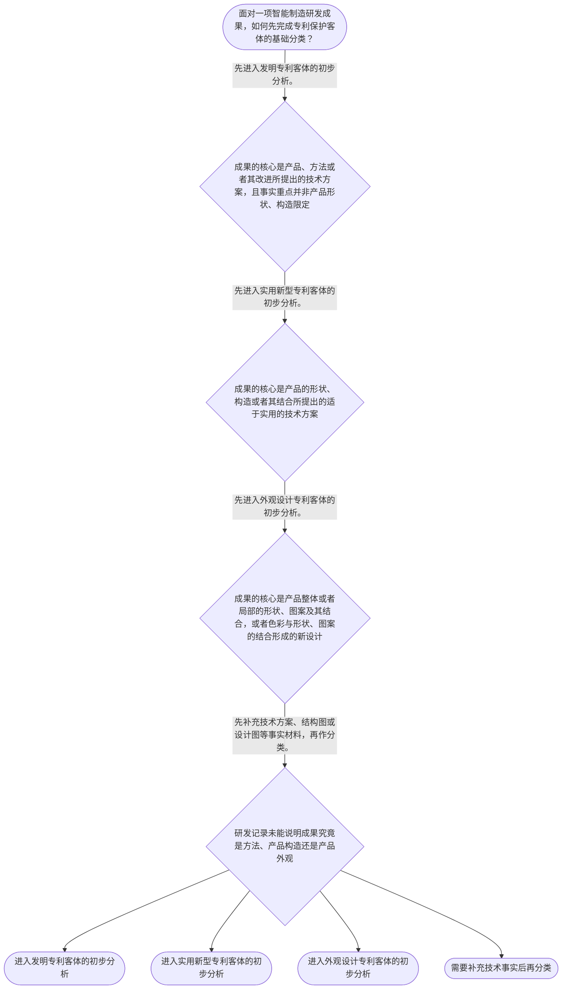

# 专家 A 教学草稿

> 专家：expert_a ｜ 风格：conservative

## 教学模块选择清单

- 当前教学节点：`patent-law-foundation`
- 板块预算：自适应 6/6，总计 9/9

| # | 模块 (block_type) | 类型 | 触发原因 (trigger) | 对应正文段 | 归属 |
|---:|---|:--:|---|---|:--:|
| 1 | `anchor_scenario` | 自适应 | perception=sensing(0.87) / cold_start | 智能制造研发立项场景｜某智能制造企业的研发组完成了两项成果：一是用于协作机器人的振动补偿控制方法；二是一种具有特殊… | [A] |
| 2 | `legal_anchor` | 必选 | mandatory | 法条锚定：客体与授权条件｜《专利法》第二条 | [A] |
| 3 | `worked_example` | 自适应 | cold_start(low_confidence) | 案例演示：控制方法与设备构造｜这是一个教学化研发场景，并非真实裁判案例：某工厂为协作机器人开发了“根据振动传感数据调整焊接… | [A] |
| 4 | `decision_flow` | 自适应 | input=visual(0.82) | 客体分类决策流程｜面对一项智能制造研发成果，如何先完成专利保护客体的基础分类？ | [A] |
| 5 | `mnemonic` | 自适应 | understanding=sequential(0.78) | 三类专利客体核对表｜三类客体核对表：发看“产品、方法、改进的技术方案”；实看“产品形状、构造或其结合”；外看“产… | [A] |
| 6 | `predict_activate` | 自适应 | processing=active(0.72) | 先预测：技术成果应如何分类｜在查看法条定义前，请先预测：一项以传感数据驱动设备动作调整的方案，与一项改变夹具内部支撑构造… | [A] |
| 7 | `assessment` | 必选 | mandatory | 三类测评｜复习专利法上发明创造的三类客体。 | [A] |
| 8 | `knowledge_synthesis` | 必选 | mandatory | 本节点知识框架｜专利权基本特征：专利制度中的权利具有独占性、时间性和地域性；其具体权利效力与期限规则留待后续… | [A] |
| 9 | `summary_card` | 自适应 | len(knowledge_sub_nodes)=3>=3 | 基础制度速查卡｜智能制造成果的专利分析先完成制度定位和客体分类，再进入授权条件与权利保护的后续判断。 | [A] |

## 教学正文

## I — 法律问题

智能制造团队拿到一份研发交底书时，首先需要回答的不是“该方案会不会侵权”或“它是否具有新颖性”，而是：该成果是否落入专利法上的发明、实用新型或外观设计这一法定客体框架；在完成该定位后，新颖性等授权条件与专利权保护问题分别处于什么位置。

## R — 适用规则

《专利法》第二条规定，发明创造包括发明、实用新型和外观设计。发明是对产品、方法或者其改进所提出的新的技术方案；实用新型是对产品的形状、构造或者其结合所提出的适于实用的新的技术方案；外观设计是对产品整体或者局部的形状、图案或者其结合，以及色彩与形状、图案的结合所作出的富有美感并适于工业应用的新设计。〔RAG: 中华人民共和国专利法.txt — 第二条：本法所称的发明创造是指发明、实用新型和外观设计〕

因此，客体分类应当围绕技术事实进行：核心是控制步骤、制造方法或其改进的，先依“方法技术方案”审视发明；核心是设备、工装或零部件的形状、构造或其结合的，先依“产品构造技术方案”审视实用新型；核心是产品整体或局部外观形成的新设计的，先依外观设计审视。技术名称、所属行业和技术复杂程度都不能替代第二条的法定定义。

《专利法》第二十二条规定，授予专利权的发明和实用新型应当具备新颖性、创造性和实用性；现有技术是申请日以前在国内外为公众所知的技术。〔RAG: 中华人民共和国专利法.txt — 第二十二条：授予专利权的发明和实用新型，应当具备新颖性、创造性和实用性；现有技术是指申请日以前在国内外为公众所知的技术〕 这说明新颖性属于发明、实用新型的后续授权条件框架，而非跳过客体判断的起点。本节仅建立该框架，具体的新颖性单独对比、创造性评价及抵触申请边界，应在后续对应节点依据完整材料专项判断。

中国专利制度的主要规范层次包括专利法、专利法实施细则和专利审查指南；这是本节点要求掌握的制度框架。检索上下文未提供三者关系的直接原文依据，故本节不对其效力层级和具体适用细节作超出材料的断言。

专利制度可从权利边界与运行目的两个角度理解：独占性、时间性、地域性提示专利权不是无限制的技术控制权；激励发明创造、促进技术公开、推动技术应用和经济发展说明制度为何要求研发成果进入公开、申请和审查的规范程序。关于这些制度作用以及早期公开、延迟审查、初步审查制与实质审查制并存的具体制度沿革，检索上下文未提供直接依据，本节仅作框架定位，后续须以对应规范材料核验。

## A — 规则适用

以智能制造研发中的两项成果为例。第一项是“依据设备振动数据动态调整机器人焊接路径”的控制方案。应先抽取其关键事实：它描述的是基于数据输入执行控制步骤的方法，而非某个产品的形状或构造。按照第二条，应先进入发明客体的分析入口。〔RAG: 中华人民共和国专利法.txt — 发明，是指对产品、方法或者其改进所提出的新的技术方案〕

第二项是末端执行器内部的特殊支撑构造。其关键事实是产品内部构造，而不是仅仅使用场景属于智能制造。按照第二条，应先进入实用新型客体的分析入口。〔RAG: 中华人民共和国专利法.txt — 实用新型，是指对产品的形状、构造或者其结合所提出的适于实用的新的技术方案〕

完成上述分类后，不能直接写出“可以授权”或“不会侵权”的结论。对于发明和实用新型，授权仍须依第二十二条进入新颖性、创造性、实用性的后续核对。〔RAG: 中华人民共和国专利法.txt — 授予专利权的发明和实用新型，应当具备新颖性、创造性和实用性〕 对于已经获得授权的专利，权利保护和侵权判定则属于下一节点的独立问题；本节不将其提前作为已掌握的规则。

可按以下顺序处理研发交底材料：第一，识别成果的核心对象是方法、产品构造还是产品外观；第二，逐项对照第二条的法定定义；第三，记录仍待补充的技术事实；第四，在客体定位完成后，分别进入授权条件、申请程序或权利保护的后续专题。该顺序能够避免将“技术方案看起来新”误当成已经具备法定客体或已经满足新颖性的结论。

## C — 结论

本节点的结论是：专利法律制度基础的第一道门槛是客体定位。智能制造中的控制方法通常应先按发明的定义分析，设备或工装的形状、构造技术方案通常应先按实用新型的定义分析，产品视觉外观的新设计则应先按外观设计的定义分析。发明和实用新型的授权还要进入第二十二条规定的新颖性、创造性和实用性框架。〔RAG: 中华人民共和国专利法.txt — 第二十二条：授予专利权的发明和实用新型，应当具备新颖性、创造性和实用性〕

> 常见误区 / 易混淆点
>
> 1. “用于机器人或生产线”不是法定客体分类标准；必须看技术方案的实际内容。
> 2. “属于发明客体”不等于“已经具备新颖性”或“必然授权”；客体判断与授权条件是前后相接、但不能混同的步骤。
> 3. 本节未展开侵权判定。侵权判断需要以有效专利权和具体保护范围等后续规则为基础，不能仅据成果分类作结论。
> 4. 对于制度沿革和审查程序的细节，当前检索上下文未提供直接依据，应在后续专题中核验。

本节设有测评，请到【习题】区作答。

### 智能制造研发立项场景（anchor_scenario）

> 某智能制造企业的研发组完成了两项成果：一是用于协作机器人的振动补偿控制方法；二是一种具有特殊壳体构造的末端执行器。项目负责人准备申请专利，同时销售部门希望马上在行业展会上展示样机。研发组争论的焦点是：两项成果是否属于同一类专利客体，以及在提交申请前公开技术资料会对后续权利取得产生何种影响。

在这个场景中，先不要急于判断某项技术是否“新”。应先把技术事实放入专利制度的基础框架：专利制度保护哪些类型的发明创造、由哪些规范文件共同运行，以及获得专利权后为何会产生时间和地域边界。

**锚定**：该场景锚定专利客体分类、制度规范体系以及专利权基本特征这三个基础问题。

**先想一想**：面对“控制方法”和“设备壳体构造”两项成果，第一步应当依据什么标准区分其可能对应的专利客体？

### 法条锚定：客体与授权条件（legal_anchor）

- **《专利法》第二条**：专利法上的发明创造分为发明、实用新型和外观设计；三类客体的法定定义不同。
- **《专利法》第二十二条**：发明和实用新型取得授权须具备新颖性、创造性和实用性；其中现有技术以申请日前在国内外为公众所知的技术为界。

**为何重要**：第二条解决“技术成果属于什么受保护客体”的入口问题。第二十二条说明后续新颖性判断所在的授权条件框架；本节仅建立该框架，不替代后续节点的专项审查训练。

### 案例演示：控制方法与设备构造（worked_example）

**案情/例题**：这是一个教学化研发场景，并非真实裁判案例：某工厂为协作机器人开发了“根据振动传感数据调整焊接路径”的控制方案，并同步设计了具有特殊内部支撑构造的末端执行器。研发组需要先为两项成果确定可能对应的专利保护客体。
**适用规则**：《专利法》第二条：发明是对产品、方法或者其改进所提出的新的技术方案；实用新型是对产品的形状、构造或者其结合所提出的适于实用的新的技术方案。
**分步推演**：
1. 先抽取第一项成果的技术对象。其核心是依据传感数据调整焊接路径的控制步骤，事实重点在方法而非产品形状或构造。 → *先区分技术方案的对象是方法还是产品构造。*
2. 《专利法》第二条将对产品、方法或者其改进提出的新的技术方案界定为发明，因此该控制方案应先纳入发明客体的分析入口。 → *方法技术方案对应发明客体的法定定义。*
3. 第二项成果的事实重点是末端执行器的内部支撑构造，属于产品的构造特征；第二条对实用新型的定义正是产品形状、构造或者其结合的适于实用的新的技术方案。 → *产品构造技术方案对应实用新型客体的分析入口。*
4. 客体分类只是制度的第一层判断。是否可以获得授权，还须在后续程序和实体条件中继续核对。 → *“属于可分析的客体”不等于“当然授权”。*
**结论**：振动补偿控制方案在所给事实下应先按“方法技术方案”进入发明专利客体分析；具有特殊壳体构造的末端执行器可先按“产品形状、构造或者其结合”进入实用新型客体分析。仅完成客体定位并不意味着必然能够授权，后续仍须依授权条件审查。
**本题要点**：研发成果先按技术对象完成客体定位，再进入相应的申请、审查和权利保护环节。

### 客体分类决策流程（decision_flow）

**决策问题**：面对一项智能制造研发成果，如何先完成专利保护客体的基础分类？



### 三类专利客体核对表（mnemonic）

**记忆锚**：三类客体核对表：发看“产品、方法、改进的技术方案”；实看“产品形状、构造或其结合”；外看“产品外观的新设计”。
**映射**：
- 发
- 实
- 外
**何时用**：收到研发交底书、准备确定申请类型时，先按“发、实、外”逐项核对技术事实。

### 先预测：技术成果应如何分类（predict_activate）

**预测/激活**：在查看法条定义前，请先预测：一项以传感数据驱动设备动作调整的方案，与一项改变夹具内部支撑构造的方案，分类时最关键的事实差异是什么？

**激活旧知**：已具备的专利制度基础认识，以及对技术成果事实特征的工程化拆分能力。

**揭晓方向**：不要先看技术是否复杂；先看方案主要落在方法、产品构造还是产品外观。

### 本节点知识框架（knowledge_synthesis）

**知识框架**：
- 专利权基本特征：专利制度中的权利具有独占性、时间性和地域性；其具体权利效力与期限规则留待后续子节点展开。
- 制度规范体系：专利法、专利法实施细则和专利审查指南共同构成中国专利制度运行中的主要规范层次；检索上下文未提供这三者关系的直接原文依据。
- 保护客体：专利法第二条将发明创造分为发明、实用新型和外观设计，并分别以技术方案、产品构造和产品外观设计为定义重心。
- 制度作用：专利制度通过依法授予和保护专利权，服务于对发明创造的激励、技术公开、技术应用与经济发展；检索上下文未提供该作用表述的直接原文依据。
- 制度运行特点：申请公布前有关人员负有保密责任；本节所列早期公开、延迟审查以及初步审查与实质审查并存的制度概述，检索上下文未提供直接依据，后续应以对应规范材料核验。
**概念关系**：先识别专利制度的权利边界和规范体系，再按第二条完成技术成果的客体分类。；客体分类解决“申请什么”的入口问题；第二十二条中的授权条件解决发明、实用新型“能否授权”的后续问题。；专利制度的激励与公开功能，解释了为何研发交底、申请和公开行为需要依规则安排。
**必记**：发明、实用新型和外观设计是专利法上的三类发明创造，分类必须回到第二条的法定定义。；发明和实用新型的授权条件包括新颖性、创造性和实用性；本节只建立入口框架。；独占性、时间性、地域性用于理解专利权的制度边界，具体保护规则需要在后续节点继续核验。

### 基础制度速查卡（summary_card）

**要点卡**：
- **专利权的基本边界**：独占性、时间性、地域性帮助理解专利权并非无限制的技术控制权。
- **制度规范体系**：专利法、实施细则与审查指南构成理解和适用制度规则的主要规范层次。
- **三类保护客体**：发明看产品、方法或改进的技术方案；实用新型看产品构造；外观设计看产品外观的新设计。
- **制度功能**：专利制度将技术公开与权利激励连接到技术应用和经济发展。
- **制度运行线索**：申请公布前存在保密要求，申请、公布和审查的具体程序规则须查对应规范。
**必背**：《专利法》第二条规定，发明创造包括发明、实用新型和外观设计。；发明和实用新型授权须具备新颖性、创造性和实用性。；客体分类先看技术事实的对象，不能以技术名称或复杂程度替代法定定义。
**一句话总结**：智能制造成果的专利分析先完成制度定位和客体分类，再进入授权条件与权利保护的后续判断。

### 三类测评（assessment）

**三类覆盖**：backward_review、forward_probe、weakness_probe
**题目**：
- q-a-001：复习专利法上发明创造的三类客体。
- q-a-002：仅探测下一节点中专利权保护的基本对象。
- q-a-003：辨析智能制造控制方法与产品构造的客体分类。


## 结构化字段

## knowledge_points

```json
[
  {
    "node_id": "patent-law-foundation",
    "kc_name": "专利制度的基本概念与特征：独占性、时间性、地域性"
  },
  {
    "node_id": "patent-law-foundation",
    "kc_name": "中国专利制度体系：专利法、专利法实施细则、专利审查指南"
  },
  {
    "node_id": "patent-law-foundation",
    "kc_name": "专利保护的三种客体：发明、实用新型、外观设计"
  },
  {
    "node_id": "patent-law-foundation",
    "kc_name": "专利制度的作用：激励发明创造、促进技术公开、推动技术应用和经济发展"
  },
  {
    "node_id": "patent-law-foundation",
    "kc_name": "中国专利制度发展历程与特点：早期公开延迟审查、初步审查制与实质审查制并存"
  }
]
```

## legal_basis

```json
[
  {
    "article": "《专利法》第二条：发明创造包括发明、实用新型和外观设计，并分别规定其法定定义。",
    "source": "中华人民共和国专利法.txt"
  },
  {
    "article": "《专利法》第二十二条：发明和实用新型授权应具备新颖性、创造性和实用性，并规定现有技术的含义。",
    "source": "中华人民共和国专利法.txt"
  },
  {
    "article": "《专利法》第十一条：发明和实用新型授权后，未经许可不得为生产经营目的实施其专利。",
    "source": "教学上下文：专利权保护节点知识点"
  }
]
```

## risks

```json
[
  {
    "risk": "将技术方案的客体分类与新颖性、创造性、实用性等授权条件混为同一判断步骤，导致未完成法定定义比对就作授权结论。",
    "related_node_id": "patent-law-foundation"
  },
  {
    "risk": "仅因成果应用于智能制造设备，就当然认定为实用新型；应回到成果的核心事实，区分方法、产品构造和产品外观。",
    "related_node_id": "patent-law-foundation"
  },
  {
    "risk": "将本节制度框架误当作已完成新颖性判断或侵权判定；这两项均需在后续节点依相应规则和证据另行分析。",
    "related_node_id": "patent-law-foundation"
  },
  {
    "risk": "对早期公开、延迟审查、初步审查与实质审查并存作出超出检索材料的细节性断言；当前检索上下文未提供直接依据。",
    "related_node_id": "patent-law-foundation"
  }
]
```

## draft_stage

```json
"debate"
```

## irac

```json
{
  "issue": "智能制造研发成果进入专利制度时，如何先确定其是否落入发明、实用新型或外观设计的法定客体，并正确定位后续新颖性与专利权保护问题？",
  "rule": "《专利法》第二条规定，发明创造包括发明、实用新型和外观设计，并分别规定其定义。第二十二条规定，授予专利权的发明和实用新型应当具备新颖性、创造性和实用性；现有技术是申请日以前在国内外为公众所知的技术。",
  "application": "对智能制造研发成果，应先将事实拆为控制方法、产品形状或构造、产品外观设计等对象，再与第二条的定义逐项比对。振动补偿控制方案若核心在控制步骤，应先进入发明客体分析；末端执行器的内部支撑构造若核心在产品构造，应先进入实用新型客体分析。第二十二条所列新颖性、创造性和实用性属于发明、实用新型在完成客体定位后的授权条件框架，不能以“尚未判断新颖性”代替客体分类。",
  "conclusion": "本节的可执行结论是：先以《专利法》第二条完成三类专利客体的事实分类，再将发明和实用新型置入第二十二条的授权条件框架；专利权具体保护、侵权判定和新颖性专项规则均留待后续节点展开。"
}
```

## interactive_questions

```json
[
  {
    "qid": "q-a-001",
    "category": "understand",
    "difficulty": "L1",
    "source_tag": "backward_review",
    "kc_node_id": "patent-law-foundation",
    "question": "根据《专利法》第二条，下列哪一组属于我国专利法所称的发明创造？",
    "answer": "B",
    "options": [
      "A. 发明、商标、著作权、外观设计",
      "B. 发明、实用新型、外观设计",
      "C. 发明、实用新型、商业秘密、外观设计",
      "D. 方法、产品、商标、外观设计"
    ]
  },
  {
    "qid": "q-a-002",
    "category": "remember",
    "difficulty": "L1",
    "source_tag": "forward_probe",
    "kc_node_id": "patent-rights-protection",
    "question": "仅作为下一节点的探测：发明或者实用新型专利获得授权后，未经专利权人许可，为生产经营目的实施该专利的行为，通常首先涉及下列哪一项制度？",
    "answer": "A",
    "options": [
      "A. 专利权保护制度",
      "B. 商标注册审查制度",
      "C. 著作权自动产生制度",
      "D. 技术秘密登记制度"
    ]
  },
  {
    "qid": "q-a-003",
    "category": "analyze",
    "difficulty": "L3",
    "source_tag": "weakness_probe",
    "kc_node_id": "patent-law-foundation",
    "question": "某智能制造团队提出一种“依据设备振动数据动态调整机器人焊接路径”的控制方法，未主张任何特定产品形状或构造。仅按《专利法》第二条对客体的定义判断，最恰当的分类是：",
    "answer": "C",
    "options": [
      "A. 外观设计，因为方案最终用于机器人产品",
      "B. 实用新型，因为控制方法会使机器人发生动作",
      "C. 发明，因为方案核心是对方法提出的技术方案",
      "D. 不能归入任何专利客体，因为其中使用了振动数据"
    ]
  }
]
```

## knowledge_synthesis

```json
{
  "node": "patent-law-foundation",
  "coverage": [
    {
      "node_id": "patent-law-foundation"
    }
  ],
  "confusable_pairs": [
    {
      "pair": "专利客体分类与授权条件：前者回答成果属于何种法定客体，后者回答发明、实用新型是否满足授权门槛，二者不能互相替代。"
    },
    {
      "pair": "发明与实用新型：发明可覆盖产品、方法或改进的技术方案；实用新型聚焦产品形状、构造或其结合的适于实用技术方案。"
    },
    {
      "pair": "本节的制度框架与后续的新颖性、侵权判定：本节仅作定位，不应把后续专项规则当作本节已完成的结论。"
    }
  ]
}
```
