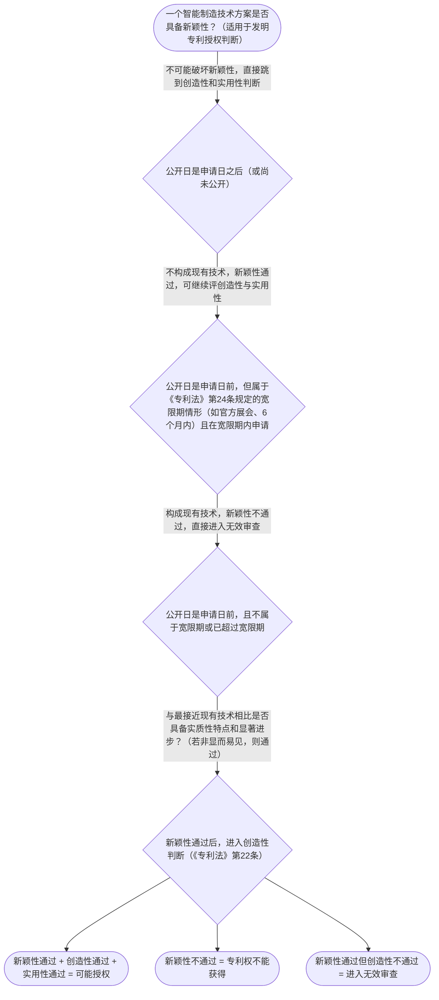

# 专家 B 教学草稿

> 专家：expert_b ｜ 风格：accessible

## 教学模块选择清单

- 当前教学节点：`patent-law-foundation`
- 板块预算：自适应 0/0，总计 4/4

| # | 模块 (block_type) | 类型 | 触发原因 (trigger) | 对应正文段 | 归属 |
|---:|---|:--:|---|---|:--:|
| 1 | `anchor_scenario` | 自适应 | perception=sensing(0.87) / cold_start | 智能制造研发场景引入｜某智能制造团队在上海的工厂里，生产出一款全自动铝圆锭浇铸设备，包含负压铸造工艺和智能控制系统… | [B] |
| 2 | `legal_anchor` | 必选 | mandatory | 法条基础锚定｜《专利法》第二条 | [A] |
| 3 | `worked_example` | 自适应 | cold_start(low_confidence) | 真实智能制造案例演示｜甲公司2025年6月1日在国内国际展会上展出其自研的‘智能铝圆锭浇铸设备’（含负压铸造工艺和… | [B] |
| 4 | `decision_flow` | 自适应 | input=visual(0.82) | 新颖性判断决策流｜一个智能制造技术方案是否具备新颖性？（适用于发明专利授权判断） | [A] |
| 5 | `mnemonic` | 自适应 | understanding=sequential(0.78) | 三性记忆口诀｜三性记忆表：新（没公开）/创（非显而易见整体）/实（能做有用） | [B] |
| 6 | `predict_activate` | 自适应 | processing=active(0.72) | 预测激活练习｜某智能制造企业在展会展示其新款智能机器人关节模组，2025年10月申请专利。你觉得这会破坏新… | [A] |

## 教学正文

## 1. 场景导入
某智能制造团队在上海的工厂里，生产出一款全自动铝圆锭浇铸设备，包含负压铸造工艺和智能控制系统。他们计划申请发明专利，却发现国外巨头已在2018年公开类似设备（含相同浇铸设备专利）。如果他们在2025年申请，是否能过审？展会或员工分享会不会破坏新颖性？同时，设备涉及国家安全保密要求，他们需要先确定客体是否属于可专利范围。这种‘技术突破 vs 现有公开 vs 保密需求’的真实冲突，瞬间让抽象规则‘看得见、摸得着’。

## 2. 人话解释
专利制度的基础是保护发明创造，发明是技术方案，实用新型是产品改进，外观是美感。授权需要新颖性（没公开）、创造性（非显而易见）、实用性（能用）。中国专利体系有三大特点：早期公开延迟审查，初步与实质审查并存，职务发明归单位。

## 3. 法条回扣
回扣《专利法》第二条：发明是产品、方法或改进的技术方案，实用新型是产品形状构造改进，外观设计是产品整体局部形状图案的富有美感并适于工业应用的新设计。《专利法》第二十二条：发明实用新型授权需具备新颖性、创造性和实用性。《专利法》第五条：违反法律社会公德或妨害公共利益的发明创造不授予专利权。《专利法》第六条：职务发明创造权利属于单位。

## 4. 类比 / 口诀
类比：新颖性像‘没有被别人偷拍过’，创造性像‘自己的发明不是显而易见的抄袭’，实用性像‘能真正生产有用产品’。口诀：新-公开、创-非显、实-有用。适用边界：不能用于外观设计或非技术方案。

## 5. 应试提示
题干关键词：新颖性、创造性、实用性、现有技术、职务发明。常见陷阱：混淆新颖性与创造性、忘记宽限期。

## 6. 互动提问
你能举例说明专利保护的三种客体吗？

### 智能制造研发场景引入（anchor_scenario）

> 某智能制造团队在上海的工厂里，生产出一款全自动铝圆锭浇铸设备，包含负压铸造工艺和智能控制系统。他们计划申请发明专利，却发现国外巨头已在2018年公开类似设备（含相同浇铸设备专利）。如果他们在2025年申请，是否能过审？展会或员工分享会不会破坏新颖性？同时，设备涉及国家安全保密要求，他们需要先确定客体是否属于可专利范围。这种‘技术突破 vs 现有公开 vs 保密需求’的真实冲突，瞬间让抽象规则‘看得见、摸得着’。

**锚定**：用智能制造研发场景同时锚定‘专利保护的三种客体’（发明客体为主）和‘授权三性’两个核心抽象知识点，为后续新颖性、创造性判断奠定具象场景。

**先想一想**：如果你是专利代理人，看到‘全自动铝圆锭浇铸设备’这个技术方案，第一反应是它属于‘发明’、‘实用新型’还是‘外观设计’？为什么？再想想，如果国内员工在内部会议分享，可能还是安全吗？

### 法条基础锚定（legal_anchor）

- **《专利法》第二条**：专利保护的对象（客体）：发明、实用新型、外观设计（对产品、方法或其改进提出的技术方案）
- **《专利法》第二十二条**：发明、实用新型授权的三性：新颖性（未公开过）、创造性（实质性特点和显著进步）、实用性（能制造或使用并产生积极效果）
- **《专利法》第二十三条**：不得授予专利的发明：违反法律、社会公德或妨害公共利益的；违反法律或行政法规规定获取或利用遗传资源的
- **《专利法》第五条**：职务发明创造：执行单位任务或利用单位物质条件完成的，权利属于该单位
- **《专利法》第六条**：外观设计授权条件：不属于现有设计，与他人合法权利无冲突，且有明显区别

**为何重要**：本节点是整个专利授权审查的‘闸门’：先确定客体是否可专利，再判断是否通过三性（尤其是新颖性与创造性边界），直接决定智能制造发明能否进入实质审查。掌握后才能准确判断后续子节点（如新颖性对比、创造性组合评价）的规则适用。

### 真实智能制造案例演示（worked_example）

**案情/例题**：甲公司2025年6月1日在国内国际展会上展出其自研的‘智能铝圆锭浇铸设备’（含负压铸造工艺和AI控制算法），2025年10月15日提交发明专利申请。问：展出是否破坏新颖性？是否属于职务发明创造？如果对方专利在2018年公开类似浇铸设备，是否构成现有技术？（结合智能制造真实场景）
**适用规则**：《专利法》第二十四条（公开日与申请日计算）、《专利法》第六条（职务发明创造）、《专利法》第二十二条（三性）、《专利法》第二十三条（现有设计）
**分步推演**：
1. 展出日在申请日前，且属‘政府主办或官方认可的国际展会’法定情形；展出后仅5.5个月内申请，落入6个月宽限期内 → *展出公开不破坏新颖性，属于宽限期例外*
2. 设备由公司研发人员自主设计，涉及单位物质条件和任务，符合职务发明创造定义；权利归单位 → *属于职务发明创造，权利属于公司*
3. 2018年公开设备虽可能相同，但本领域（智能制造）技术人员通过现有公开无法想到本申请的AI控制算法与负压工艺的整体组合方案，具备实质性特点和显著进步 → *新颖性通过；创造性通过；实用性明确（可制造并产生积极效果）*
**结论**：展出不破坏新颖性（宽限期例外），但仅豁免该次公开；职务发明创造权利归单位；三性均满足，可授权。该例演示：真实智能制造场景需先判时间点，再匹配法条，再过三性关。
**本题要点**：专利新颖性判断先看‘公开日与申请日’+‘宽限期’，创造性再看‘本领域技术人员是否显而易见整体方案’。

### 新颖性判断决策流（decision_flow）

**决策问题**：一个智能制造技术方案是否具备新颖性？（适用于发明专利授权判断）



### 三性记忆口诀（mnemonic）

**记忆锚**：三性记忆表：新（没公开）/创（非显而易见整体）/实（能做有用）
**映射**：
- 新
- 创
- 实
**何时用**：当看到‘授权条件’‘为什么不给专利’或对比‘现有技术’时，先过三性表验证；智能制造发明需特别注意‘整体构思’是否显而易见。

### 预测激活练习（predict_activate）

**预测/激活**：某智能制造企业在展会展示其新款智能机器人关节模组，2025年10月申请专利。你觉得这会破坏新颖性吗？先猜一个答案（是/否/不确定）。

**激活旧知**：已学‘新颖性现有技术定义’+‘公开日计算’+‘宽限期例外’

**揭晓方向**：先看公开日与申请日谁在前，再看是否有‘官方展会’这个法定例外，再看展出是否影响整体技术构思。


## 结构化字段

## knowledge_points

```json
[
  {
    "node_id": "patent-law-foundation",
    "kc_name": "专利制度的基本概念与特征：独占性、时间性、地域性"
  },
  {
    "node_id": "patent-law-foundation",
    "kc_name": "中国专利制度体系：专利法、专利法实施细则、专利审查指南"
  },
  {
    "node_id": "patent-law-foundation",
    "kc_name": "专利保护的三种客体：发明、实用新型、外观设计（专利法第2条）"
  },
  {
    "node_id": "patent-law-foundation",
    "kc_name": "专利制度的作用：激励发明创造、促进技术公开、推动技术应用和经济发展"
  },
  {
    "node_id": "patent-law-foundation",
    "kc_name": "中国专利制度发展历程与特点：早期公开延迟审查、初步审查制与实质审查制并存"
  }
]
```

## legal_basis

```json
[
  {
    "article": "《专利法》第二条",
    "source": "中华人民共和国专利法.txt"
  },
  {
    "article": "《专利法》第二十二条",
    "source": "中华人民共和国专利法.txt"
  },
  {
    "article": "《专利法》第二十三条",
    "source": "中华人民共和国专利法.txt"
  },
  {
    "article": "《专利法》第五条",
    "source": "中华人民共和国专利法.txt"
  },
  {
    "article": "《专利法》第六条",
    "source": "中华人民共和国专利法.txt"
  }
]
```

## risks

```json
[
  {
    "risk": "新颖性单独对比原则与创造性整体技术构思混用",
    "related_node_id": "patent-law-foundation"
  },
  {
    "risk": "职务发明创造权利归属理解模糊",
    "related_node_id": "patent-law-foundation"
  }
]
```

## draft_stage

```json
"debate"
```

## interactive_questions

```json
[
  {
    "qid": "q1",
    "category": "remember",
    "difficulty": "L1",
    "source_tag": "backward_review",
    "kc_node_id": "patent-law-foundation",
    "question": "专利保护的三种客体是什么？",
    "answer": "A",
    "options": [
      "A. 发明、实用新型、外观设计",
      "B. 发明、实用新型、工业品外观",
      "C. 发明、实用新型、商业模式",
      "D. 发明、实用新型、软件"
    ]
  },
  {
    "qid": "q2",
    "category": "remember",
    "difficulty": "L1",
    "source_tag": "backward_review",
    "kc_node_id": "patent-law-foundation",
    "question": "职务发明创造的权利归属是什么？",
    "answer": "A",
    "options": [
      "A. 属于执行单位任务或利用单位物质条件完成的发明创造，权利属于该单位",
      "B. 属于发明人个人所有",
      "C. 属于单位但可以自由处置",
      "D. 属于单位但需要征得发明人同意"
    ]
  },
  {
    "qid": "q3",
    "category": "understand",
    "difficulty": "L2",
    "source_tag": "weakness_probe",
    "kc_node_id": "patent-law-foundation",
    "question": "新颖性判断的核心原则是什么？",
    "answer": "A",
    "options": [
      "A. 单独对比原则：看是否与现有技术相同",
      "B. 组合对比原则：看整体方案是否新颖",
      "C. 公开日判断",
      "D. 创造性进步判断"
    ]
  }
]
```

## knowledge_synthesis

```json
{
  "node": "patent-law-foundation",
  "coverage": [
    {
      "node_id": "patent-law-foundation"
    }
  ],
  "confusable_pairs": [
    {
      "pair": "新颖性单独对比原则 vs 创造性整体技术构思"
    },
    {
      "pair": "职务发明创造权利归属 vs 职务发明创造申请专利的权利"
    }
  ]
}
```
