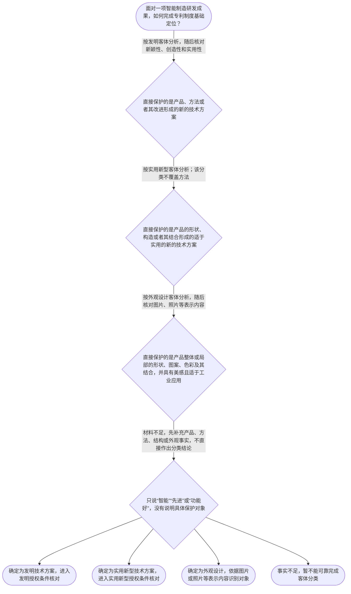

# 整合后的课程完整内容与习题

## 教学模块选择清单

- 当前教学节点：`patent-law-foundation`
- 板块预算：自适应 5/6，总计 9/9

| # | 模块 (block_type) | 类型 | 触发原因 (trigger) | 对应正文段 | 归属 |
|---:|---|:--:|---|---|:--:|
| 1 | `anchor_scenario` | 自适应 | perception=sensing(0.87) / cold_start | 智能制造模组的专利入门边界｜某智能制造装备企业研发出一套“自适应夹具加视觉纠偏”模组：其中有夹具部件连接结构，有根据图像… | [A+B融合] |
| 2 | `legal_anchor` | 必选 | mandatory | 基础法条与制度边界｜《专利法》第二条：本法所称的发明创造是指发明、实用新型和外观设计；发明是对产品、方法或者其改… | [A+B融合] |
| 3 | `worked_example` | 自适应 | cold_start(low_confidence) | 自动质检产线的四步定位｜某智能制造企业开发自动质检产线，形成三项成果：一是相机采集图像并由控制程序计算缺陷位置、输出… | [A+B融合] |
| 4 | `decision_flow` | 自适应 | input=visual(0.82) | 专利客体识别决策流｜面对一项智能制造研发成果，如何完成专利制度基础定位？ | [A+B融合] |
| 5 | `mnemonic` | 自适应 | understanding=sequential(0.78) | 专利基础四问与三边界｜专利基础四问：保什么？过几关？哪一天？看哪份文本？再加三边界：独、时、地。 | [A+B融合] |
| 6 | `predict_activate` | 自适应 | processing=active(0.72) | 先分对象，再看法律｜在揭示法条之前，先判断：视觉伺服控制方法能否单独按实用新型保护？同一设备的夹具结构和外壳造型… | [B] |
| 7 | `assessment` | 必选 | mandatory | 三类基础测评｜识别《专利法》规定的三类专利保护客体 | [A+B融合] |
| 8 | `knowledge_synthesis` | 必选 | mandatory | 专利制度基础关系网｜基本概念与特征：专利权具有独占性、时间性和地域性，分别回答“他人能否实施、权利能持续多久、权… | [A+B融合] |
| 9 | `summary_card` | 自适应 | len(knowledge_sub_nodes)=3>=3 | 专利制度基础速查卡｜先问保什么，再问过几关、哪一天、看哪份文本，最后检查独占、时间和地域三条边界。 | [A+B融合] |

## 教学正文

## I — 法律问题

在智能制造研发成果进入新颖性判断或侵权判定前，先解决四个基础问题：直接保护的是哪一种专利客体，适用哪些授权条件，时间判断以哪一天为基准，保护范围应从哪份法律文本开始读取。还要把专利权的独占性、时间性和地域性放在正确位置。

本轮检索上下文提供了《专利法》条文、专利审查教材和新颖性判断规则，但未提供可核验的具体智能制造司法裁判、专利无效决定、案号或裁判文书原文。因此，不能把某个未经检索核验的案件写成真实案例。下面保留智能制造综合场景，并明确区分其与真实裁判案例的性质；其中涉及真实案件的检索与裁判结论，应在取得具体案号和文书后另行补充。

## R — 适用规则

### 1. 三类专利保护客体

《专利法》第二条规定，发明创造包括发明、实用新型和外观设计。发明是对产品、方法或者其改进提出的新的技术方案；实用新型是对产品的形状、构造或者其结合提出的适于实用的新的技术方案；外观设计是对产品整体或局部的形状、图案、色彩及其结合所作出的富有美感并适于工业应用的新设计。〔RAG: 中华人民共和国专利法.txt — 第二条：本法所称的发明创造是指发明、实用新型和外观设计；发明，是指对产品、方法或者其改进所提出的新的技术方案；实用新型，是指对产品的形状、构造或者其结合所提出的适于实用的新的技术方案；外观设计，是指对产品的整体或者局部的形状、图案或者其结合以及色彩与形状、图案的结合所作出的富有美感并适于工业应用的新设计〕

“智能制造”是应用领域，不是第四种专利客体。控制步骤、控制方法和数据处理流程，应先观察是否形成方法技术方案；设备部件的形状、构造和连接关系，应先按产品结构观察；设备外壳的线条、图案和色彩等视觉特征，应按外观设计观察。同一条产线可以同时包含多层成果，但不能仅因共同服务于智能制造，就把它们归为同一种客体。

### 2. 授权实质条件总览

《专利法》第二十二条规定，授予专利权的发明和实用新型应当具备新颖性、创造性和实用性；现有技术是申请日以前在国内外为公众所知的技术。〔RAG: 中华人民共和国专利法.txt — 第二十二条：授予专利权的发明和实用新型，应当具备新颖性、创造性和实用性；本法所称现有技术，是指申请日以前在国内外为公众所知的技术〕

三性是并列的授权条件。新颖性判断强调单独对比：申请的各项权利要求应分别与每一项现有技术单独比较，不得把多份现有技术拼接起来否定新颖性。〔RAG: 专利法专题讲座.txt — 判断新颖性时，应当将发明或者实用新型专利申请的各项权利要求分别与每一项现有技术单独地进行比较，不得将其与几项现有技术内容的组合进行对比〕创造性则是后续专项判断，不能用创造性的组合分析替代新颖性的单独对比。本节只建立总览，不提前展开全部判断步骤。

### 3. 申请日与时间基准

《专利法》第二十八条规定，国务院专利行政部门收到专利申请文件之日为申请日；申请文件邮寄的，以寄出的邮戳日为申请日。〔RAG: 中华人民共和国专利法.txt — 第二十八条：国务院专利行政部门收到专利申请文件之日为申请日；申请文件是邮寄的，以寄出的邮戳日为申请日〕

因此，研发完成日、内部立项日、首次试生产日、展会演示日和法定申请日不能未经核对就相互替代。后续分析现有技术时，必须先锁定法律上有效的日期。检索材料还显示，申请日前六个月内在中国政府主办或者承认的国际展览会上首次展出等特定情形，可能涉及不丧失新颖性的规则，但适用条件应依《专利法》第二十四条及相关实施细则、审查指南核对，不得把普通展会展示当然视为免责。

### 4. 保护范围的文本入口

《专利法》第二十六条规定，权利要求书应当以说明书为依据，清楚、简要地限定要求专利保护的范围。〔RAG: 中华人民共和国专利法.txt — 第二十六条：权利要求书应当以说明书为依据，清楚、简要地限定要求专利保护的范围〕

所以，发明和实用新型后续保护范围分析应从权利要求记载的技术特征开始，并结合说明书理解其含义；外观设计则应回到图片、照片等表示内容。产品名称、宣传用语或“功能相似”不能替代权利要求或外观设计表示内容。权利要求解释与等同原则的具体顺序属于后续侵权专项内容，本节只确定入口。

### 5. 专利权属性、制度体系与审查特点

检索材料将专利权概括为具有排他性、时间性和地域性。排他性也称独占性，但法律另有规定的除外；时间性意味着权利受法定期限限制；地域性意味着一国或地区授予的专利权原则上只在该国或地区有效。〔RAG: 专利法律知识详细解读.txt — 专利权具有排他性、时间性和地域性的特征；排他性也称独占性，除专利法另有规定以外，未经专利权人许可不得实施其专利〕〔RAG: 专利法律知识详细解读.txt — 时间性：专利权是具有时间限制的权利，超过法律规定的保护期限，即进入公有领域〕

中国专利制度的主要规范层次包括《专利法》、专利法实施细则和专利审查指南。本节检索上下文没有提供实施细则和审查指南的完整具体条文，因此只作层次定位，不编造具体操作规则。程序上，发明申请通常经历初步审查和实质审查，实用新型和外观设计通常以初步审查为主。〔RAG: 专利法律知识同步训练.txt — 实用新型和外观设计专利申请经过初步审查，没有发现驳回理由即授予专利权；发明专利申请经过初步审查、实质审查均没有发现驳回理由的，授予专利权〕

专利制度的功能可以作有边界的概括：通过一定期限和地域范围内的排他性权利换取技术公开，从而激励发明创造、促进技术应用和经济发展。该概括不替代具体授权条件，也不意味着提交申请即取得专利权。

## A — 规则适用

### 智能制造场景分析

回到自动质检产线这一教学用综合场景：相机采集图像、程序计算缺陷位置并输出分拣指令，首先按方法技术方案定位；检测设备的特定部件连接关系，首先按产品结构定位；外壳的整体视觉设计，首先按外观设计对象定位。三者可分别进行专利布局，但不能用一个实用新型把控制方法和外观设计一并覆盖。

若要进行新颖性分析，应先确认具体权利要求、法定申请日和申请日前公众可获得的技术，再将每一项权利要求与单一现有技术逐项比较，不能把不同文献中的技术特征拼成一份“假想对比文件”。〔RAG: 专利法律知识详细解读.txt — 单独对比原则要求将发明或实用新型专利申请的每项权利要求的每个技术方案分别与一份对比文件中记载的单个技术方案对比，不允许组合几项现有技术〕

若要进行侵权分析，应先确认专利权是否已经授权且仍在有效期内，再确认专利类型和权利要求或外观设计表示内容，最后将被诉实施行为与保护范围逐项比对。仅凭“设备功能相同”“产品名称相似”或“都用于自动质检”，不能直接得出侵权结论。

## 专利客体识别决策流

面对一项智能制造研发成果，按以下顺序处理：

1. 如果直接保护的是产品、方法或者其改进形成的新的技术方案，按发明客体分析，随后核对新颖性、创造性和实用性。
2. 如果直接保护的是产品的形状、构造或者其结合形成的适于实用的新的技术方案，按实用新型客体分析；该分类不覆盖方法。
3. 如果直接保护的是产品整体或局部的形状、图案、色彩及其结合，并且具有美感且适于工业应用，按外观设计客体分析，随后核对图片、照片等表示内容。
4. 如果材料只说“智能”“先进”或“功能好”，没有说明具体保护对象，事实不足，应先补充产品、方法、结构或外观事实，不能直接作出分类结论。

这条决策流的结果分别是：确定发明技术方案并进入发明授权条件核对；确定实用新型技术方案并进入实用新型授权条件核对；确定外观设计并依据图片或照片等表示内容识别对象；或者认定事实不足、暂不能可靠完成客体分类。

## 知识综合

### 框架

- 基本概念与特征：专利权具有独占性、时间性和地域性，分别回答“他人能否实施、权利能持续多久、权利在哪些地域有效”。
- 中国专利制度体系：主要规范层次包括《专利法》、专利法实施细则和专利审查指南；具体问题要回到相应文本。
- 三类保护客体：发明保护产品、方法或者其改进形成的新的技术方案；实用新型保护产品形状、构造或者其结合形成的技术方案；外观设计保护产品整体或局部的形状、图案、色彩及其结合形成的设计。
- 制度作用：通过授予一定期限和地域范围内的排他性权利，换取技术公开，进而激励发明创造、促进技术应用和经济发展。
- 制度发展与审查特点：发明申请通常经历初步审查和实质审查，实用新型和外观设计通常以初步审查为主；这是程序路径对比，不是客体定义或授权必然结论。

### 必知要点

- 专利制度的三种基本权利属性是独占性、时间性和地域性。
- 中国专利法规定的三类发明创造是发明、实用新型和外观设计，分类取决于直接保护对象。
- 发明和实用新型的授权实质条件包括新颖性、创造性和实用性。
- 中国专利制度的主要规范层次包括专利法、专利法实施细则和专利审查指南。
- 发明通常经过初步审查和实质审查，实用新型和外观设计通常以初步审查为主；不能将流程特点当作具体授权结论。

### 关键关系

- 先识别直接保护对象，再确定适用的授权条件和申请文件要求。
- 新颖性、创造性和实用性是发明和实用新型的并列授权实质条件；新颖性采用单独对比，不能与创造性的组合判断混淆。
- 申请日是后续现有技术和期限分析的重要时间入口，但不能被研发完成日、展会日期或首次销售日期当然替代。
- 权利要求是发明和实用新型保护范围分析的核心文本，外观设计则应回到图片、照片等表示内容；二者不能混用。
- 独占性、时间性和地域性分别约束权利行使的对象、期限和地域；独占性存在法律规定的例外，地域性不等于全球自动生效。

## C — 结论

专利制度基础的判断顺序是：先确定保护客体，再核对适用授权条件；涉及时间先确定法定申请日；涉及范围先锁定权利要求或外观设计表示内容；同时检查独占性、法定期限和地域边界。

口诀可以记为：“独时地，三客体；法细指，四步走。”其中“独时地”表示独占性、时间性、地域性；“三客体”表示发明、实用新型、外观设计；“法细指”表示专利法、实施细则、审查指南；“四步走”表示保什么、过几关、哪一天、看哪份文本。口诀只用于记忆，不能替代法条和案件事实核对。

本节设有测评，请到【习题】区作答。

### 智能制造模组的专利入门边界（anchor_scenario）

> 某智能制造装备企业研发出一套“自适应夹具加视觉纠偏”模组：其中有夹具部件连接结构，有根据图像调整机械臂轨迹的控制方法，还有控制柜门板的线条与配色设计。企业准备申请中国专利，并计划把样机带到行业展会演示。检索上下文未提供可核验的具体智能制造司法裁判或专利无效案件，因此本节将该事实作为教学用综合场景，不将其表述为真实裁判案例。

**锚定**：用一个综合研发场景同时承载五个基础知识点，帮助学习者先建立“保护对象—制度规则—时间基准—权利边界”的主线。

**先想一想**：面对同一套智能制造设备，先分别圈出直接要保护的是方法、产品结构还是产品外观；再思考应查哪类法条、以哪一天作为时间判断入口，以及中国专利的效力边界在哪里。

### 基础法条与制度边界（legal_anchor）

- **《专利法》第二条：本法所称的发明创造是指发明、实用新型和外观设计；发明是对产品、方法或者其改进所提出的新的技术方案；实用新型是对产品的形状、构造或者其结合所提出的适于实用的新的技术方案；外观设计是对产品的整体或者局部的形状、图案或者其结合以及色彩与形状、图案的结合所作出的富有美感并适于工业应用的新设计。**：先根据直接保护对象区分发明、实用新型和外观设计，智能制造只是应用领域，不是第四种专利客体。
- **《专利法》第二十二条：授予专利权的发明和实用新型，应当具备新颖性、创造性和实用性；现有技术是申请日以前在国内外为公众所知的技术。**：发明和实用新型的授权实质条件包括新颖性、创造性和实用性；新颖性采用单独对比，不能与创造性的组合分析混淆。
- **《专利法》第二十六条：权利要求书应当以说明书为依据，清楚、简要地限定要求专利保护的范围。**：涉及时间时，先核对法定申请日，不能未经核对就用研发完成日或展会日期替代。
- **《专利法》第二十八条：国务院专利行政部门收到专利申请文件之日为申请日；申请文件是邮寄的，以寄出的邮戳日为申请日。**：发明和实用新型后续保护范围分析先看权利要求，并以说明书理解其含义；外观设计先看图片、照片等表示内容。
- **判断新颖性时，各项权利要求应当分别与每一项现有技术单独比较，不得将几项现有技术组合进行对比。**：专利权具有独占性、时间性和地域性；独占性不是排除一切法定例外，地域性也不意味着中国专利自动在境外生效。
- **专利权具有排他性、时间性和地域性；排他性也称独占性，但法律另有规定的除外。**：程序上，发明通常经历初步审查和实质审查；实用新型、外观设计通常以初步审查为主。
- **发明专利申请经过初步审查、实质审查均没有发现驳回理由的，授予专利权；实用新型和外观设计专利申请经过初步审查，没有发现驳回理由即授予专利权。**：

**为何重要**：新颖性判断需要准确的申请日、现有技术和单独对比入口，侵权判定需要准确的客体与保护范围入口。先把基础骨架立稳，才能避免把方法、结构、外观混为一谈。

### 自动质检产线的四步定位（worked_example）

**案情/例题**：某智能制造企业开发自动质检产线，形成三项成果：一是相机采集图像并由控制程序计算缺陷位置、输出分拣指令的方法；二是检测设备中特定部件的连接结构；三是设备外壳的整体线条和色彩设计。企业准备在中国申请专利。
**适用规则**：以《专利法》第二条进行客体分类，以第二十二条识别发明和实用新型的三项授权实质条件，以第二十八条确定申请日，并以第二十六条确定权利要求的文本入口。
**分步推演**：
1. 先看直接保护对象。第一项的核心是产品或过程的控制方法，属于方法技术方案的分类问题；第二项的核心是产品的形状、构造或其结合；第三项的核心是产品整体或局部的形状、图案、色彩及其结合。 → *先把方法、产品结构和产品外观拆开。*
2. 根据第二条，方法技术方案应优先按发明客体分析；产品形状、构造或其结合可以按实用新型客体分析；符合美感和工业应用要求的产品外观可以按外观设计客体分析。分类并不等于已经满足授权条件。 → *分类结论分别对应发明、实用新型和外观设计。*
3. 对发明和实用新型，还要按照第二十二条核对新颖性、创造性和实用性；其中新颖性比较时应采用单独对比，不能把多份现有技术拼接。 → *客体确定后，再进入相应授权门槛。*
4. 如果后续要分析时间问题，应先按第二十八条锁定申请日；如果后续要分析保护范围，应先阅读权利要求，并结合说明书理解其含义。展会演示、研发完成和内部立项日期不能自动替代法定申请日。 → *最后锁定时间基准和保护范围文本。*
**结论**：控制方法、夹具结构和设备外观应分别进行客体分析；方法不能因为用于智能制造就归入实用新型，外观也不能仅凭内部结构判断。后续新颖性或侵权结论仍须另行核对完整申请文件、权利要求、现有技术和相关事实。
**本题要点**：智能制造成果先按“方法、结构、外观”分层，再按“授权条件、申请日、保护文本”依次核对；这是进入新颖性和侵权专项分析前的基础定位链。

### 专利客体识别决策流（decision_flow）

**决策问题**：面对一项智能制造研发成果，如何完成专利制度基础定位？



### 专利基础四问与三边界（mnemonic）

**记忆锚**：专利基础四问：保什么？过几关？哪一天？看哪份文本？再加三边界：独、时、地。
**映射**：
- 保什么
- 过几关
- 哪一天
- 看哪份文本
- 独
- 时
- 地
**何时用**：准备判断智能制造研发成果能否申请、应核对什么材料，或准备进入新颖性与侵权专项学习时，依次问四个基础问题，再检查独占性、时间性和地域性。口诀只用于记忆，不替代具体法条和案件事实核对。

### 先分对象，再看法律（predict_activate）

**预测/激活**：在揭示法条之前，先判断：视觉伺服控制方法能否单独按实用新型保护？同一设备的夹具结构和外壳造型是否应当分别观察？

**激活旧知**：激活你对智能制造系统中“控制方法、设备结构、外观设计”三类事实的已有区分经验。

**揭晓方向**：回看实用新型定义是否包含“方法”，再比较发明、实用新型和外观设计的直接保护对象；判断时不要用“都服务于同一产线”替代客体分类。

### 专利制度基础关系网（knowledge_synthesis）

**知识框架**：
- 基本概念与特征：专利权具有独占性、时间性和地域性，分别回答“他人能否实施、权利能持续多久、权利在哪些地域有效”。
- 中国专利制度体系：主要规范层次包括《专利法》、专利法实施细则和专利审查指南；本节未检索到完整细则和指南原文，不展开具体操作规则。
- 三类保护客体：发明保护产品、方法或者其改进形成的新的技术方案；实用新型保护产品形状、构造或者其结合形成的技术方案；外观设计保护产品整体或局部的形状、图案、色彩及其结合形成的设计。
- 制度作用：通过授予一定期限和地域范围内的排他性权利，换取技术公开，进而激励发明创造、促进技术应用和经济发展。
- 制度发展与审查特点：发明申请通常经历初步审查和实质审查，实用新型和外观设计通常以初步审查为主；这是程序路径对比，不是客体定义或授权必然结论。
**概念关系**：先识别直接保护对象，再确定适用的授权条件和申请文件要求。；新颖性、创造性和实用性是发明和实用新型的并列授权实质条件；不得以创造性的组合分析替代新颖性的单独对比。；申请日是后续现有技术和期限分析的重要时间入口，但不能被研发完成日、展会日期或首次销售日期当然替代。；权利要求是发明和实用新型保护范围分析的核心文本，外观设计则应回到图片、照片等表示内容。；独占性、时间性和地域性分别约束权利行使的对象、期限和地域；独占性存在法律规定的例外，地域性不等于全球自动生效。
**必记**：专利制度的三种基本权利属性是独占性、时间性和地域性。；中国专利法规定的三类发明创造是发明、实用新型和外观设计，分类取决于直接保护对象。；发明和实用新型的授权实质条件包括新颖性、创造性和实用性；新颖性判断采用单独对比。；中国专利制度的主要规范层次包括专利法、专利法实施细则和专利审查指南。；基础流程可记为发明初步审查加实质审查，实用新型和外观设计通常以初步审查为主。

### 专利制度基础速查卡（summary_card）

**要点卡**：
- **专利权三特征**：独占性关注排他效力但有法定例外，时间性关注法定期限，地域性关注授权国家或地区。
- **三类保护客体**：发明看产品、方法或其改进的技术方案；实用新型看产品形状和构造；外观设计看产品外观。
- **制度规范体系**：专利法规定基本权利义务，实施细则规定操作事项，审查指南提供审查口径；具体问题要回到相应文本。
- **授权三性**：发明和实用新型要核对新颖性、创造性和实用性；新颖性单独对比，创造性另行判断。
- **时间与保护范围入口**：时间问题先锁定法定申请日，范围问题先看权利要求或外观设计图片、照片等表示内容。
- **审查程序特点**：发明通常经过初步审查和实质审查，实用新型和外观设计通常以初步审查为主。
**必背**：《专利法》第二条的三类保护客体及其区分标准；《专利法》第二十二条规定的发明和实用新型三性；新颖性判断的单独对比原则；《专利法》第二十六条关于权利要求书的基本要求；《专利法》第二十八条关于申请日的基本规则；独占性、时间性和地域性的含义及边界
**一句话总结**：先问保什么，再问过几关、哪一天、看哪份文本，最后检查独占、时间和地域三条边界。

### 三类基础测评（assessment）

**三类覆盖**：backward_review、forward_probe、weakness_probe
**题目**：
- q-backward-1：识别《专利法》规定的三类专利保护客体
- q-forward-1：仅作向前探测，识别发明和实用新型授权后的基础保护方向
- q-weakness-1：在智能制造复合成果中区分方法、产品结构和产品外观


## 结构化数据

## expert

```json
"A+B融合"
```

## style

```json
"fused"
```

## knowledge_points

```json
[
  {
    "node_id": "patent-law-foundation",
    "kc_name": "专利制度的基本概念与特征：独占性、时间性、地域性（详见子节点 patent-rights-nature）"
  },
  {
    "node_id": "patent-law-foundation",
    "kc_name": "中国专利制度体系：专利法、专利法实施细则、专利审查指南（详见子节点 patent-law-framework）"
  },
  {
    "node_id": "patent-law-foundation",
    "kc_name": "专利保护的三种客体：发明、实用新型、外观设计（专利法第2条）"
  },
  {
    "node_id": "patent-law-foundation",
    "kc_name": "专利制度的作用：激励发明创造、促进技术公开、推动技术应用和经济发展（详见子节点 patent-system-overview）"
  },
  {
    "node_id": "patent-law-foundation",
    "kc_name": "中国专利制度发展历程与特点：早期公开延迟审查、初步审查制与实质审查制并存（详见子节点 patent-system-overview）"
  }
]
```

## legal_basis

```json
[
  {
    "article": "《专利法》第二条：本法所称的发明创造是指发明、实用新型和外观设计；发明，是指对产品、方法或者其改进所提出的新的技术方案；实用新型，是指对产品的形状、构造或者其结合所提出的适于实用的新的技术方案；外观设计，是指对产品的整体或者局部的形状、图案或者其结合以及色彩与形状、图案的结合所作出的富有美感并适于工业应用的新设计。",
    "source": "中华人民共和国专利法.txt"
  },
  {
    "article": "《专利法》第二十二条：授予专利权的发明和实用新型，应当具备新颖性、创造性和实用性；现有技术是申请日以前在国内外为公众所知的技术。",
    "source": "中华人民共和国专利法.txt"
  },
  {
    "article": "《专利法》第二十六条：权利要求书应当以说明书为依据，清楚、简要地限定要求专利保护的范围。",
    "source": "中华人民共和国专利法.txt"
  },
  {
    "article": "《专利法》第二十八条：国务院专利行政部门收到专利申请文件之日为申请日；申请文件是邮寄的，以寄出的邮戳日为申请日。",
    "source": "中华人民共和国专利法.txt"
  },
  {
    "article": "专利权具有排他性、时间性和地域性；排他性也称独占性，但法律另有规定的除外。",
    "source": "专利法律知识详细解读.txt"
  },
  {
    "article": "发明专利申请经过初步审查、实质审查均没有发现驳回理由的，授予专利权；实用新型和外观设计专利申请经过初步审查，没有发现驳回理由即授予专利权。",
    "source": "专利法律知识同步训练.txt"
  },
  {
    "article": "判断新颖性时，应当将各项权利要求分别与每一项现有技术单独进行比较，不得将几项现有技术的内容组合进行对比。",
    "source": "专利法专题讲座.txt"
  }
]
```

## risks

```json
[
  {
    "risk": "检索上下文未提供可核验的具体智能制造司法裁判、专利无效决定、案号或裁判文书原文，不能编造真实案例事实或裁判结论；当前场景明确标注为教学用综合场景。",
    "related_node_id": "patent-law-foundation"
  },
  {
    "risk": "检索材料未提供完整的专利法实施细则和专利审查指南原文，本节只说明制度规范层次，不虚构具体条文或审查细节。",
    "related_node_id": "patent-law-framework"
  },
  {
    "risk": "新颖性判断中的单独对比与创造性判断中的组合分析容易混淆；本节仅作边界说明。",
    "related_node_id": "novelty"
  },
  {
    "risk": "侵权构成、权利要求解释和等同原则属于后续节点，本节仅确定侵权分析的客体和文本入口，不作具体侵权认定。",
    "related_node_id": "direct-infringement"
  },
  {
    "risk": "专利权独占性存在法律规定的例外；中国专利的地域效力和具体权利状态需要结合适用法条核对，不能理解为全球自动生效或永久有效。",
    "related_node_id": "patent-rights-nature"
  }
]
```

## draft_stage

```json
"integration"
```

## irac

```json
{
  "issue": "在智能制造研发场景下，如何识别专利制度的基本概念、三类保护客体、规范体系、授权条件、申请日和保护范围入口，并理解专利权的三种基本属性？",
  "rule": "《专利法》第二条规定发明创造包括发明、实用新型和外观设计并分别界定其对象；第二十二条规定发明和实用新型应具备新颖性、创造性和实用性，并界定现有技术；新颖性判断采用单独对比原则；第二十六条规定权利要求书应以说明书为依据，清楚、简要地限定保护范围；第二十八条规定申请日的基本确定规则。检索材料同时表明专利权具有独占性、时间性和地域性，发明通常经过初步审查和实质审查，实用新型和外观设计通常以初步审查为主。",
  "application": "在智能制造场景中，应先依据直接保护对象分类：控制算法或控制步骤形成的方法技术方案，优先按发明客体分析；具有特定部件形状、构造或连接关系的设备，按产品结构分析；设备外壳的线条、图案和色彩等视觉特征，按外观设计分析。之后，对发明和实用新型核对三性；涉及新颖性时以法定申请日和单一现有技术为比较入口；涉及保护范围时回到权利要求或外观设计图片、照片等表示内容。",
  "conclusion": "专利基础分析应遵循“先定客体，再核对授权条件和申请日，最后锁定保护文本”的顺序，并同时检查独占性、时间性和地域性。新颖性和侵权判定依赖这一基础定位；本节点不提前替代后续专项规则。"
}
```

## interactive_questions

```json
[
  {
    "qid": "q-backward-1",
    "category": "understand",
    "difficulty": "L1",
    "source_tag": "backward_review",
    "kc_node_id": "patent-law-foundation",
    "question": "根据《专利法》第二条，下列哪一项属于专利保护客体的完整分类？",
    "answer": "B",
    "options": [
      "A.发明、实用新型、植物新品种",
      "B.发明、实用新型、外观设计",
      "C.发明、商标、外观设计",
      "D.实用新型、商标、著作权"
    ]
  },
  {
    "qid": "q-forward-1",
    "category": "remember",
    "difficulty": "L1",
    "source_tag": "forward_probe",
    "kc_node_id": "patent-rights-protection",
    "question": "（向前探测，不据此判定下一节点完成）关于专利权保护的基础方向，下列哪项最准确？",
    "answer": "C",
    "options": [
      "A.专利权一旦授权，任何研究使用都必然构成侵权",
      "B.发明、实用新型与外观设计的保护范围都以说明书文字为准",
      "C.发明和实用新型授权后，原则上未经许可不得为生产经营目的实施其专利",
      "D.专利权没有法定期限，可随缴纳年费无限续展"
    ]
  },
  {
    "qid": "q-weakness-1",
    "category": "analyze",
    "difficulty": "L3",
    "source_tag": "weakness_probe",
    "kc_node_id": "patent-law-foundation",
    "question": "某智能制造企业完成“视觉伺服控制方法、夹具结构改进和设备外壳造型”三项成果。下列判断哪项最准确？",
    "answer": "A",
    "options": [
      "A.控制方法通常应考虑发明路径；夹具形状构造可考虑实用新型；外壳造型可考虑外观设计，三者保护重点不同",
      "B.三者必须合并成一件实用新型申请，否则无法保护",
      "C.因为具有独占性，授权后在任何国家都自动生效",
      "D.实用新型与外观设计也必须先通过实质审查才能授权，与发明完全相同"
    ]
  }
]
```

## knowledge_synthesis

```json
{
  "node": "patent-law-foundation",
  "coverage": [
    {
      "node_id": "patent-law-foundation"
    },
    {
      "node_id": "patent-law-foundation"
    },
    {
      "node_id": "patent-law-foundation"
    },
    {
      "node_id": "patent-law-foundation"
    },
    {
      "node_id": "patent-law-foundation"
    }
  ],
  "confusable_pairs": [
    {
      "pair": "新颖性判断的单独对比与创造性判断的组合分析属于不同规则；本节只说明二者都是发明和实用新型授权条件，不能混为一谈。"
    },
    {
      "pair": "权利要求解释与等同原则的适用顺序属于后续侵权专项内容；本节仅确定权利要求是保护范围分析的文本入口。"
    },
    {
      "pair": "复审程序与无效宣告程序的主体、对象和救济路径未在本节检索材料中完整提供，不能用审查程序特点替代二者的程序规则。"
    },
    {
      "pair": "发明、实用新型和外观设计是三类不同保护客体；发明的程序审查特点与实用新型、外观设计的程序审查特点，不等于三类客体定义。"
    }
  ]
}
```
