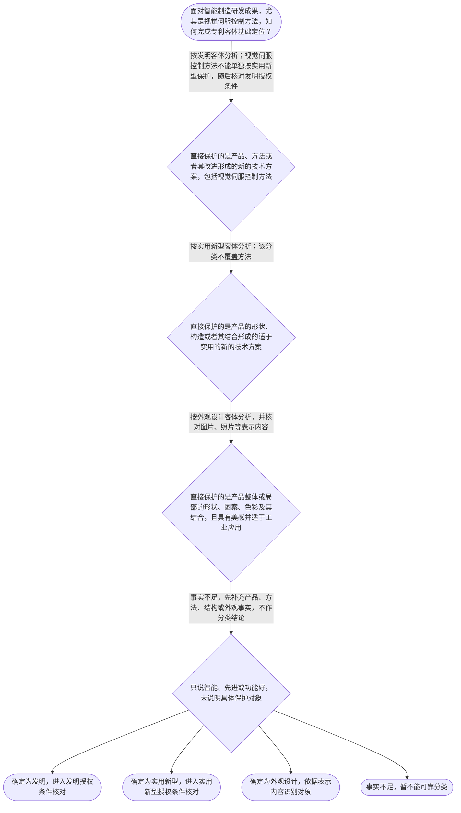

# 整合后的课程完整内容与习题

## 教学模块选择清单

- 当前教学节点：`patent-law-foundation`
- 板块预算：自适应 5/6，总计 9/9

| # | 模块 (block_type) | 类型 | 触发原因 (trigger) | 对应正文段 | 归属 |
|---:|---|:--:|---|---|:--:|
| 1 | `anchor_scenario` | 自适应 | perception=sensing(0.87) / cold_start | 智能制造模组的专利入门边界｜某装备企业研发自适应夹具加视觉纠偏模组，包括夹具连接结构、图像控制方法和控制柜外观设计，并拟… | [A+B融合] |
| 2 | `legal_anchor` | 必选 | mandatory | 基础法条与制度边界｜《专利法》第二条：发明创造包括发明、实用新型和外观设计。 | [A+B融合] |
| 3 | `worked_example` | 自适应 | cold_start(low_confidence) | 自动质检产线的四步定位｜某企业形成图像控制分拣方法、检测设备部件连接结构和设备外壳造型，并拟申请中国专利。 | [A+B融合] |
| 4 | `decision_flow` | 自适应 | input=visual(0.82) | 专利客体识别决策流｜面对智能制造研发成果，尤其是视觉伺服控制方法，如何完成专利客体基础定位？ | [A+B融合] |
| 5 | `mnemonic` | 自适应 | understanding=sequential(0.78) | 专利基础四问与三边界｜保什么、过几关、哪一天、看哪份文本；再查独、时、地。 | [A+B融合] |
| 6 | `predict_activate` | 自适应 | processing=active(0.72) | 先分对象，再看法律｜视觉伺服控制方法能否单独按实用新型保护？同一设备的夹具结构和外壳造型是否应分别观察？ | [B] |
| 7 | `assessment` | 必选 | mandatory | 三类基础测评｜识别专利法规定的三类保护客体 | [A+B融合] |
| 8 | `knowledge_synthesis` | 必选 | mandatory | 专利制度基础关系网｜专利权具有独占性、时间性和地域性。 | [A+B融合] |
| 9 | `summary_card` | 自适应 | len(knowledge_sub_nodes)=3>=3 | 专利制度基础速查卡｜先定保护对象，再定授权条件、申请日和保护文本，最后检查独时地。 | [A+B融合] |

## 教学正文

## I — 法律问题

学习智能制造领域的新颖性判断和侵权判定前，必须先完成基础定位：成果保护的是方法、产品结构还是产品外观；发明和实用新型须经过哪些授权条件；时间判断以什么日期为入口；侵权分析从哪一份文本开始。专利权还受到独占性、时间性和地域性的共同限制。

本轮检索上下文提供了法条和学习材料，但没有提供可核验的智能制造领域裁判文书、无效决定、案号或裁判全文。因而不能把未经核验的企业纠纷、案件名称或裁判结果写成真实案例。本节保留智能制造教学综合场景；真实案例的客体、申请日、权利要求和侵权结论，须在补充公开裁判文书或无效决定原文后才能作出可核验教学展示。

## R — 适用规则

《专利法》第二条将发明创造分为发明、实用新型和外观设计。发明可以是产品、方法或者其改进的新的技术方案；实用新型限于产品形状、构造或者其结合的适于实用的新的技术方案；外观设计针对产品整体或局部的形状、图案、色彩及其结合形成的、富有美感且适于工业应用的新设计。〔RAG: 中华人民共和国专利法.txt — 第二条：发明创造是指发明、实用新型和外观设计〕智能制造只是应用领域，并非第四种专利客体。

发明和实用新型的授权实质条件包括新颖性、创造性和实用性。〔RAG: 中华人民共和国专利法.txt — 第二十二条：授予专利权的发明和实用新型，应当具备新颖性、创造性和实用性〕新颖性判断应将每一项权利要求与单一现有技术或申请在先、公布在后的相关技术内容分别比较，不得把多项技术内容拼接。〔RAG: 专利法专题讲座.txt — 单独对比，不得将其与几项现有技术或者多项技术方案的组合进行对比〕创造性不能替代新颖性的单独对比。

申请日是判断现有技术时间边界的重要入口。〔RAG: 中华人民共和国专利法.txt — 第二十八条：国务院专利行政部门收到专利申请文件之日为申请日〕研发完成、内部立项、试生产、展会演示等日期均不能当然替代法定申请日。

发明和实用新型的后续保护范围分析，应从权利要求开始，并结合说明书理解技术特征；权利要求书须以说明书为依据，清楚、简要地限定保护范围。〔RAG: 中华人民共和国专利法.txt — 第二十六条：权利要求书应当以说明书为依据，清楚、简要地限定要求专利保护的范围〕外观设计则应回到图片、照片等表示内容。产品名称、功能相似或市场宣传不能替代保护范围文本。

专利权具有独占性、时间性和地域性。独占性并非绝对禁止一切实施行为；发明和实用新型授权后，除法律另有规定外，未经许可不得为生产经营目的实施。〔RAG: 专利法律知识详细解读.txt — 除本法另有规定的以外，任何单位或者个人未经专利权人许可，都不得为生产经营目的实施其专利〕中国专利制度的规范层次包括专利法、实施细则和审查指南。发明通常经历初步审查和实质审查，实用新型和外观设计通常以初步审查为主。

## A — 规则适用

以自动质检产线为教学用综合场景：相机采集图像、程序计算缺陷位置并输出分拣指令，核心是控制方法，应优先按发明客体分析；检测设备中特定部件的连接关系，核心是产品结构，可按实用新型客体分析；设备外壳的线条、图案和配色，核心是产品外观，可按外观设计客体分析。三种成果可以分层布局，但不能因为服务同一条产线而混为一个客体。

若分析新颖性，应先取得具体权利要求和法定申请日，再确定申请日前公众可获得的技术，并逐项以单一技术内容比较。若分析侵权，应先确认专利是否授权且仍有效，再读取权利要求或外观设计表示内容，并将被诉方案与保护范围进行比对；仅凭功能相同、产品名称相似或都用于自动质检，不能直接得出侵权结论。

## 专利客体识别决策流

目标问题：智能制造中的视觉伺服控制方法，能否单独按实用新型保护？结论是不能。实用新型的法定对象是产品的形状、构造或者其结合，不包含方法；控制方法应先按发明客体分析。〔RAG: 中华人民共和国专利法.txt — 第二条：实用新型是对产品的形状、构造或者其结合所提出的适于实用的新的技术方案〕

1. 直接保护的是产品、方法或者其改进形成的新的技术方案，包括视觉伺服控制步骤：按发明客体分析；方法不能单独按实用新型保护，随后对发明核对相应授权条件。
2. 直接保护的是产品的形状、构造或者其结合形成的适于实用的新的技术方案：按实用新型客体分析；该分类不覆盖控制方法。
3. 直接保护的是产品整体或局部的形状、图案、色彩及其结合，且具有美感并适于工业应用：按外观设计客体分析，并回到图片、照片等表示内容识别对象。
4. 材料只说“智能”“先进”或“功能好”，没有说明产品、方法、结构或外观事实：事实不足，先补充材料，不直接作出客体结论。

相应结果是：确定发明后进入发明授权条件核对；确定实用新型后进入实用新型授权条件核对；确定外观设计后依据其表示内容识别对象；事实不足时暂不能可靠分类。

## 知识综合

### 框架

- 专利权的独占性、时间性、地域性，分别回答他人能否实施、权利持续多久、权利在哪些地域有效。
- 中国专利制度的规范层次包括专利法、专利法实施细则和专利审查指南；具体问题须回到相应规范。
- 三类保护客体是发明、实用新型和外观设计，分类取决于直接保护对象。
- 专利制度通过一定期限和地域内的排他性权利交换技术公开，以激励创造、促进技术应用和经济发展。
- 程序上，发明通常经历初步审查和实质审查，实用新型和外观设计通常以初步审查为主。

### 必知要点

- 发明和实用新型的授权实质条件包括新颖性、创造性和实用性。
- 新颖性采用单独对比，不能用多份现有技术组合否定新颖性。
- 方法不属于实用新型的直接保护对象。
- 时间问题先锁定申请日，范围问题先锁定权利要求或外观设计表示内容。
- 独占性有法定例外，地域性不等于全球自动生效。

### 关键关系

- 先识别直接保护对象，再确定授权条件、申请文件和保护范围入口。
- 新颖性与创造性均属授权条件，但判断方式不同：前者强调单独对比，后者不能被本节提前替代。
- 权利要求是发明和实用新型保护范围分析的核心文本；外观设计应回到图片、照片等表示内容。
- 专利基础定位是后续新颖性和侵权判定的前提，不构成对具体案件侵权与否的结论。

## C — 结论

专利制度基础的顺序是：先定客体，再核对授权条件；涉及时间先确定申请日；涉及范围先锁定权利要求或外观设计表示内容；最后检查独占性、时间性和地域性。口诀是“独时地，三客体；法细指，四步走”。口诀只用于记忆，不能替代法条、申请文件和案件事实核对。

本节设有测评，请到【习题】区作答。

### 智能制造模组的专利入门边界（anchor_scenario）

> 某装备企业研发自适应夹具加视觉纠偏模组，包括夹具连接结构、图像控制方法和控制柜外观设计，并拟参加行业展会。该场景用于教学；检索上下文未提供可核验的相关真实裁判文书或无效决定，不将其表述为真实案件。

**锚定**：同一场景可观察方法、产品结构和外观三类不同保护对象，并连接时间和保护范围问题。

**先想一想**：先区分直接保护的是方法、结构还是外观，再思考申请日和保护范围应从何处核对。

### 基础法条与制度边界（legal_anchor）

- **《专利法》第二条：发明创造包括发明、实用新型和外观设计。**：智能制造不是第四种专利客体，应按方法、产品结构或产品外观分类。
- **《专利法》第二十二条：发明和实用新型应具备新颖性、创造性和实用性。**：发明和实用新型须核对新颖性、创造性和实用性；新颖性不能组合对比。
- **《专利法》第二十六条：权利要求书应以说明书为依据，清楚、简要地限定保护范围。**：时间问题先核对申请日，范围问题先核对权利要求或外观设计表示内容。
- **《专利法》第二十八条：国务院专利行政部门收到申请文件之日为申请日。**：专利权具独占性、时间性和地域性，独占性存在法定例外。
- **新颖性判断实行单独对比，不得组合多项技术内容。**：

**为何重要**：客体、时间和保护文本定位错误，会使后续新颖性或侵权分析失去正确入口。

### 自动质检产线的四步定位（worked_example）

**案情/例题**：某企业形成图像控制分拣方法、检测设备部件连接结构和设备外壳造型，并拟申请中国专利。
**适用规则**：依据《专利法》第二条识别客体，依据第二十二条识别发明和实用新型的授权条件，依据第二十八条和第二十六条确定时间与文本入口。
**分步推演**：
1. 先拆分直接保护对象：控制步骤、产品结构和产品外观分别观察。 → *先拆方法、结构、外观。*
2. 控制方法优先按发明分析；产品形状、构造或其结合可按实用新型分析；产品外观可按外观设计分析。 → *方法、结构、外观对应不同客体。*
3. 视觉伺服控制方法不能单独按实用新型保护，因为实用新型定义不包括方法。 → *方法不进入实用新型。*
4. 后续新颖性先锁定申请日和单一对比内容，后续侵权先锁定权利要求或外观设计表示内容。 → *再确定时间与保护文本。*
**结论**：应分层识别三项成果；单一实用新型不能覆盖控制方法和外观设计。
**本题要点**：先按方法、结构、外观分类，再进入授权条件、申请日和保护范围核对。

### 专利客体识别决策流（decision_flow）

**决策问题**：面对智能制造研发成果，尤其是视觉伺服控制方法，如何完成专利客体基础定位？



### 专利基础四问与三边界（mnemonic）

**记忆锚**：保什么、过几关、哪一天、看哪份文本；再查独、时、地。
**映射**：
- 保什么
- 过几关
- 哪一天
- 看哪份文本
- 独时地
**何时用**：进入新颖性或侵权专项学习前，用此顺序检查基础定位；口诀不替代法条和事实核对。

### 先分对象，再看法律（predict_activate）

**预测/激活**：视觉伺服控制方法能否单独按实用新型保护？同一设备的夹具结构和外壳造型是否应分别观察？

**激活旧知**：激活对控制方法、设备结构和产品外观的工程事实区分。

**揭晓方向**：查看实用新型定义是否包含方法，再比较三类客体的直接保护对象。

### 专利制度基础关系网（knowledge_synthesis）

**知识框架**：
- 专利权具有独占性、时间性和地域性。
- 规范层次包括专利法、实施细则和审查指南。
- 三类客体是发明、实用新型和外观设计。
- 制度以有限排他性换取技术公开，激励创造和应用。
- 发明通常经历初步审查和实质审查，实用新型和外观设计通常以初步审查为主。
**概念关系**：先识别直接保护对象，再确定授权条件和保护范围入口。；新颖性单独对比与创造性判断不得混同。；权利要求对应发明和实用新型的范围入口，外观设计回到图片、照片等表示内容。；独占性、时间性、地域性共同限定权利边界。
**必记**：发明和实用新型的授权条件包括新颖性、创造性和实用性。；新颖性采用单独对比，不能拼接多份技术内容。；方法不属于实用新型的直接保护对象。；时间先看申请日，范围先看权利要求或外观设计表示内容。

### 专利制度基础速查卡（summary_card）

**要点卡**：
- **专利权三特征**：独占性有法定例外，时间性受期限限制，地域性限于授权国家或地区。
- **三类保护客体**：发明看产品或方法技术方案，实用新型看产品结构，外观设计看产品外观。
- **授权与新颖性**：发明和实用新型核对三性；新颖性采用单独对比。
- **时间与范围入口**：时间先看申请日，范围先看权利要求或外观设计表示内容。
- **审查特点**：发明通常有初步审查和实质审查，实用新型和外观设计通常以初步审查为主。
**必背**：三类保护客体及区分标准；发明和实用新型的三性；新颖性的单独对比原则；申请日和权利要求的基础作用；独占性、时间性和地域性
**一句话总结**：先定保护对象，再定授权条件、申请日和保护文本，最后检查独时地。

### 三类基础测评（assessment）

**三类覆盖**：backward_review、forward_probe、weakness_probe
**题目**：
- q-backward-1：识别专利法规定的三类保护客体
- q-forward-1：仅作向前探测，识别专利权保护的基础方向
- q-weakness-1：在复合智能制造成果中区分方法、结构和外观


## 结构化数据

## expert

```json
"A+B融合"
```

## style

```json
"fused"
```

## knowledge_points

```json
[
  {
    "node_id": "patent-law-foundation",
    "kc_name": "专利制度的基本概念与特征：独占性、时间性、地域性（详见子节点 patent-rights-nature）"
  },
  {
    "node_id": "patent-law-foundation",
    "kc_name": "中国专利制度体系：专利法、专利法实施细则、专利审查指南（详见子节点 patent-law-framework）"
  },
  {
    "node_id": "patent-law-foundation",
    "kc_name": "专利保护的三种客体：发明、实用新型、外观设计（专利法第2条）"
  },
  {
    "node_id": "patent-law-foundation",
    "kc_name": "专利制度的作用：激励发明创造、促进技术公开、推动技术应用和经济发展（详见子节点 patent-system-overview）"
  },
  {
    "node_id": "patent-law-foundation",
    "kc_name": "中国专利制度发展历程与特点：早期公开延迟审查、初步审查制与实质审查制并存（详见子节点 patent-system-overview）"
  }
]
```

## legal_basis

```json
[
  {
    "article": "《专利法》第二条：本法所称的发明创造是指发明、实用新型和外观设计；发明是对产品、方法或者其改进所提出的新的技术方案；实用新型是对产品的形状、构造或者其结合所提出的适于实用的新的技术方案；外观设计是对产品整体或者局部的形状、图案或者其结合以及色彩与形状、图案的结合所作出的富有美感并适于工业应用的新设计。",
    "source": "中华人民共和国专利法.txt"
  },
  {
    "article": "《专利法》第二十二条：授予专利权的发明和实用新型，应当具备新颖性、创造性和实用性；现有技术是申请日以前在国内外为公众所知的技术。",
    "source": "中华人民共和国专利法.txt"
  },
  {
    "article": "《专利法》第二十六条：权利要求书应当以说明书为依据，清楚、简要地限定要求专利保护的范围。",
    "source": "中华人民共和国专利法.txt"
  },
  {
    "article": "《专利法》第二十八条：国务院专利行政部门收到专利申请文件之日为申请日；申请文件是邮寄的，以寄出的邮戳日为申请日。",
    "source": "中华人民共和国专利法.txt"
  },
  {
    "article": "判断新颖性时，应将各项权利要求分别与每一项现有技术或者申请在先公布或公告在后的相关技术内容单独比较，不得与几项技术内容组合比较。",
    "source": "专利法专题讲座.txt"
  },
  {
    "article": "发明和实用新型专利权被授予后，除本法另有规定外，任何单位或者个人未经专利权人许可，不得为生产经营目的实施其专利。",
    "source": "专利法律知识详细解读.txt"
  },
  {
    "article": "专利权具有排他性、时间性和地域性；发明通常经过初步审查和实质审查，实用新型和外观设计通常以初步审查为主。",
    "source": "专利法律知识详细解读.txt；专利法律知识同步训练.txt"
  }
]
```

## risks

```json
[
  {
    "risk": "检索上下文未提供可核验的智能制造领域司法裁判、无效决定、案号或裁判文书原文；不能编造真实案例事实、申请日、权利要求或裁判结论。",
    "related_node_id": "patent-law-foundation"
  },
  {
    "risk": "新颖性单独对比容易与创造性组合判断混淆。",
    "related_node_id": "novelty"
  },
  {
    "risk": "将智能制造控制方法误归为实用新型，会导致客体定位错误。",
    "related_node_id": "patent-law-foundation"
  },
  {
    "risk": "侵权构成、权利要求解释和等同原则属于后续节点；本节仅确定文本入口。",
    "related_node_id": "direct-infringement"
  },
  {
    "risk": "独占性存在法定例外，地域性不表示中国专利当然在境外生效。",
    "related_node_id": "patent-rights-nature"
  }
]
```

## draft_stage

```json
"integration"
```

## irac

```json
{
  "issue": "在智能制造研发场景下，如何识别专利制度的三类保护客体、权利属性、授权条件、申请日和保护范围入口？",
  "rule": "《专利法》第二条界定发明、实用新型和外观设计；第二十二条规定发明和实用新型应具备新颖性、创造性和实用性；第二十六条规定权利要求书限定保护范围；第二十八条规定申请日的基本确定规则。新颖性采取单独对比。",
  "application": "视觉伺服控制方法按发明客体分析，夹具结构按实用新型客体分析，外壳造型按外观设计客体分析。后续新颖性分析以申请日和单一技术内容为入口，侵权分析以有效权利及权利要求或外观设计表示内容为入口。",
  "conclusion": "先定客体，再确定授权条件、申请日和保护文本，并检查独占性、时间性、地域性，方能进入后续新颖性和侵权专项判断。"
}
```

## interactive_questions

```json
[
  {
    "qid": "q-backward-1",
    "category": "understand",
    "difficulty": "L1",
    "source_tag": "backward_review",
    "kc_node_id": "patent-law-foundation",
    "question": "根据《专利法》第二条，下列哪一项属于专利保护客体的完整分类？",
    "answer": "B",
    "options": [
      "A. 发明、实用新型、植物新品种",
      "B. 发明、实用新型、外观设计",
      "C. 发明、商标、外观设计",
      "D. 实用新型、商标、著作权"
    ]
  },
  {
    "qid": "q-forward-1",
    "category": "remember",
    "difficulty": "L1",
    "source_tag": "forward_probe",
    "kc_node_id": "patent-rights-protection",
    "question": "（向前探测，不据此判定下一节点完成）关于专利权保护的基础方向，下列哪项最准确？",
    "answer": "C",
    "options": [
      "A. 专利权一旦授权，任何研究使用都必然构成侵权",
      "B. 发明、实用新型与外观设计的保护范围都以说明书文字为准",
      "C. 发明和实用新型授权后，原则上未经许可不得为生产经营目的实施其专利",
      "D. 专利权没有法定期限，可随缴纳年费无限续展"
    ]
  },
  {
    "qid": "q-weakness-1",
    "category": "analyze",
    "difficulty": "L3",
    "source_tag": "weakness_probe",
    "kc_node_id": "patent-law-foundation",
    "question": "某企业形成视觉伺服控制方法、夹具结构改进和设备外壳造型三项成果。下列判断哪项最准确？",
    "answer": "A",
    "options": [
      "A. 控制方法通常应考虑发明；夹具形状构造可考虑实用新型；外壳造型可考虑外观设计",
      "B. 三者必须合并成一件实用新型申请",
      "C. 授权后在任何国家都自动生效",
      "D. 实用新型和外观设计均必须与发明一样经过实质审查"
    ]
  }
]
```

## knowledge_synthesis

```json
{
  "node": "patent-law-foundation",
  "coverage": [
    {
      "node_id": "patent-law-foundation"
    },
    {
      "node_id": "patent-law-foundation"
    },
    {
      "node_id": "patent-law-foundation"
    },
    {
      "node_id": "patent-law-foundation"
    },
    {
      "node_id": "patent-law-foundation"
    }
  ],
  "confusable_pairs": [
    {
      "pair": "新颖性采用单独对比，不能以创造性可能涉及的组合判断替代。"
    },
    {
      "pair": "视觉伺服控制方法属于发明客体分析入口，不属于实用新型的直接保护对象。"
    },
    {
      "pair": "权利要求解释与等同原则属于后续侵权专项；本节仅确定权利要求是范围分析入口。"
    },
    {
      "pair": "发明、实用新型和外观设计的客体定义，与其审查程序特点不能混同。"
    }
  ]
}
```
