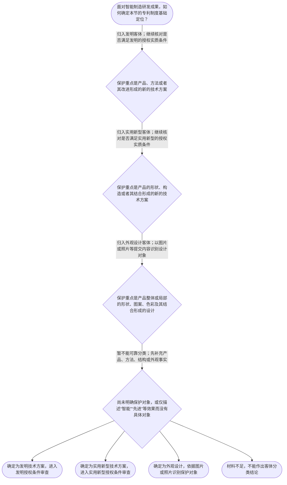

# 专家 A 教学草稿

> 专家：expert_a ｜ 风格：conservative

## 教学模块选择清单

- 当前教学节点：`patent-law-foundation`
- 板块预算：自适应 None/None，总计 9/9

| # | 模块 (block_type) | 类型 | 触发原因 (trigger) | 对应正文段 | 归属 |
|---:|---|:--:|---|---|:--:|
| 1 | `anchor_scenario` | 自适应 | perception=sensing(0.87) / cold_start | 智能制造装配单元的专利边界｜某智能制造企业研发了一套机器人装配单元：视觉传感器识别工件位置，控制器根据识别结果调整机械臂… | [A] |
| 2 | `legal_anchor` | 必选 | mandatory | 基础法条锚定｜《专利法》第二条 | [A] |
| 3 | `worked_example` | 自适应 | cold_start(low_confidence) | 自动质检产线的四步定位｜某智能制造企业开发一条自动质检产线。方案一是利用相机采集工件图像、由控制程序计算缺陷位置并输… | [A] |
| 4 | `decision_flow` | 自适应 | input=visual(0.82) | 专利客体识别流程｜面对智能制造研发成果，如何确定本节的专利制度基础定位？ | [A] |
| 5 | `mnemonic` | 自适应 | understanding=sequential(0.78) | 专利基础四问表｜基础四问表：保什么？过几关？哪一天？看哪份文本？ | [A] |
| 6 | `predict_activate` | 自适应 | processing=active(0.72) | 先分对象再看法律｜面对同一条智能制造产线，若企业同时描述控制算法、设备部件连接关系和外壳外观，你会先把它们视为… | [A] |
| 7 | `assessment` | 必选 | mandatory | 三类基础测评｜识别专利保护客体的三种法定类型 | [A] |
| 8 | `knowledge_synthesis` | 必选 | mandatory | 专利制度基础关系网｜专利客体：发明是对产品、方法或者其改进提出的新的技术方案；实用新型针对产品的形状、构造或者其… | [A] |
| 9 | `summary_card` | 自适应 | len(knowledge_sub_nodes)=3>=3 | 专利制度基础速查卡｜先分清保护什么，再核对三性和申请日，最后锁定权利要求或外观设计表示的保护对象。 | [A] |

## 教学正文

## I — 法律问题

在智能制造研发成果进入新颖性判断或侵权判定前，首先要解决四个基础问题：成果属于哪一种专利保护客体；发明和实用新型需要经过哪些授权门槛；时间判断应以哪一天为基准；后续保护范围应从哪一份法律文本开始读取。基础定位错误，后续结论就可能把方法、设备结构和外观设计混为一谈。

## R — 适用规则

### 1. 三类专利保护客体

《专利法》第二条规定：“本法所称的发明创造是指发明、实用新型和外观设计。”其中，发明是对产品、方法或者其改进所提出的新的技术方案；实用新型是对产品的形状、构造或者其结合所提出的适于实用的新的技术方案；外观设计则针对产品的整体或局部外观及其结合形成的、富有美感并适于工业应用的新设计。〔RAG: 中华人民共和国专利法.txt — 第二条：发明创造是指发明、实用新型和外观设计；发明、实用新型和外观设计的定义〕

因此，“智能制造”只是技术应用领域，不是专利客体类型。控制步骤、数据处理流程等应先观察其是否形成方法技术方案；设备的部件连接关系和结构组合应先观察其是否属于产品结构技术方案；设备外壳的形状、图案和色彩等视觉特征则应先观察其是否属于外观设计对象。

### 2. 发明和实用新型的授权实质条件

《专利法》第二十二条规定，授予专利权的发明和实用新型应当具备新颖性、创造性和实用性；该条同时规定，现有技术是申请日以前在国内外为公众所知的技术。〔RAG: 中华人民共和国专利法.txt — 第二十二条：发明和实用新型应当具备新颖性、创造性和实用性；现有技术是申请日以前在国内外为公众所知的技术〕

这三个概念不能互换：新颖性关注申请日前是否已有相同技术内容进入现有技术范围；创造性关注相对于现有技术是否达到法定的非显而易见程度；实用性关注能否制造或使用并产生积极效果。本节点只建立三性总览，具体的新颖性单独对比、创造性判断和实用性判断应在相应专项节点中分别学习。

### 3. 申请日是重要时间基准

《专利法》第二十八条规定，国务院专利行政部门收到专利申请文件之日为申请日；申请文件是邮寄的，以寄出的邮戳日为申请日。〔RAG: 中华人民共和国专利法.txt — 第二十八条：国务院专利行政部门收到专利申请文件之日为申请日；邮寄的以寄出的邮戳日为申请日〕

所以，研发完成日、内部立项日、第一次试生产日和法定申请日不能未经核对就相互替代。后续进行公开时间、优先权或现有技术分析时，应先锁定法律上有效的时间基准。检索材料还显示，第二十九条分别规定了发明和实用新型、外观设计在外国或中国首次申请后的优先权期限，但具体主张优先权仍需核对相同主题、声明和文件提交等条件。〔RAG: 中华人民共和国专利法.txt — 第二十九条：发明或者实用新型外国优先权十二个月，外观设计外国优先权六个月；中国首次申请的相应期限〕

### 4. 保护范围的文本入口

《专利法》第二十六条要求权利要求书以说明书为依据，清楚、简要地限定要求专利保护的范围。〔RAG: 中华人民共和国专利法.txt — 第二十六条：权利要求书应当以说明书为依据，清楚、简要地限定要求专利保护的范围〕

因此，发明或实用新型的后续保护范围分析，应从权利要求记载的技术特征开始，并结合说明书理解其含义；外观设计则应从提交的图片或照片及相关表示内容识别保护对象。产品名称、宣传用语或“功能相似”本身不能替代权利要求或外观设计表示内容。

## A — 规则适用

以智能制造自动质检产线为例：相机采集图像、控制程序计算缺陷位置并输出分拣指令，首先应按方法技术方案进行客体定位；设备中特定部件的连接关系，首先应按产品结构技术方案进行定位；设备外壳的整体视觉设计，则应按外观设计的对象进行定位。三者可能服务于同一产线，但不能仅因共同使用于智能制造领域，就自动归为同一种专利客体。

完成客体定位后，对发明和实用新型应分别进入新颖性、创造性和实用性的授权条件核对；完成时间分析前应先确定法定申请日；需要判断保护范围时，应回到相应的权利要求，或回到外观设计的图片、照片等表示内容。这样的顺序能够避免把“已经完成研发”误当成“已经取得专利权”，也避免把“产品功能相近”直接等同于“落入权利要求保护范围”。

本节点涉及专利制度的独占性、时间性和地域性时，证据边界必须明确：检索上下文未提供这些特征的完整直接法条原文，因此这里只作基础概念提示，不据此编造具体保护期限或域外效力结论。对于中国专利制度由专利法、实施细则和审查指南共同构成的制度层次，检索上下文未提供实施细则和审查指南的具体原文，故本稿不扩写其未检索条文。

## C — 结论

专利法律分析的基础顺序是：先确定保护客体，再核对适用的授权条件；涉及时间时先确定法定申请日；涉及保护范围时先锁定权利要求或外观设计的表示内容。发明、实用新型和外观设计不能混淆，发明和实用新型的三性也不能相互替代。新颖性与侵权判定将在后续节点中分别展开，本节点只建立其共同依赖的制度主干和判断入口。

> 常见误区 / 易混淆点
>
> 1. “智能”不是独立的专利客体类型；必须看直接保护的是方法、产品结构还是外观设计。
> 2. 能制造或能够使用不等于当然具备全部三性；实用性只是三性之一。
> 3. 研发完成日不当然等于申请日；应按第二十八条核对法定申请日。
> 4. 产品名称、宣传效果或功能相似不能替代权利要求和外观设计表示内容。
>
> 本节设有测评，请到【习题】区作答。

### 智能制造装配单元的专利边界（anchor_scenario）

> 某智能制造企业研发了一套机器人装配单元：视觉传感器识别工件位置，控制器根据识别结果调整机械臂轨迹，末端执行器完成装配。研发负责人同时提出三个问题：这套控制方法和设备分别属于哪类专利保护客体？申请专利后，企业获得的保护是否在所有国家自动有效？如果竞争企业在另一国家销售类似设备，能否仅凭中国专利直接制止？这些事实把“保护什么、保护到哪里、保护多久以及如何进入侵权判断”连接到同一研发场景。

**锚定**：用智能制造研发场景锚定专利客体、专利权的独占性与地域性，并为后续权利要求保护范围判断建立入口。

**先想一想**：在适用任何具体侵权规则前，先区分这项成果保护的是技术方案、产品形状构造，还是产品外观，并判断权利的地域边界。

### 基础法条锚定（legal_anchor）

- **《专利法》第二条**：专利法把发明、实用新型和外观设计列为三类发明创造；其中发明和实用新型强调新的技术方案，外观设计强调产品外观的新设计。
- **《专利法》第二十二条**：发明和实用新型授权通常要同时满足新颖性、创造性和实用性；现有技术原则上是申请日前在国内外为公众所知的技术。
- **《专利法》第二十八条**：国务院专利行政部门收到专利申请文件之日通常是申请日，邮寄申请以寄出邮戳日为申请日。
- **《专利法》第二十九条**：发明、实用新型可以在规定期限内基于外国或中国的首次申请主张优先权，外观设计的期限规则不同。
- **《专利法》第二十六条**：权利要求书必须以说明书为依据，并清楚、简要地限定要求保护的范围；这为后续权利要求解释提供文本基础。

**为何重要**：本节点的主线不是直接完成新颖性或侵权案件判断，而是先建立“保护客体—授权门槛—申请日—保护范围文本”的法律骨架。后续学习新颖性和侵权判定时，均须回到这些基础概念和法条入口。

### 自动质检产线的四步定位（worked_example）

**案情/例题**：某智能制造企业开发一条自动质检产线。方案一是利用相机采集工件图像、由控制程序计算缺陷位置并输出分拣指令的方法；方案二是具有特定部件连接关系的检测设备；方案三是设备外壳的整体视觉设计。企业拟在中国申请专利。需要演示：如何先完成专利客体识别，再确定应查阅的授权基础和保护范围入口。
**适用规则**：以《专利法》第二条区分保护客体，以《专利法》第二十二条识别发明和实用新型的授权实质条件，并以《专利法》第二十八条确定申请日；权利要求范围还须结合《专利法》第二十六条理解。
**分步推演**：
1. 先看方案所要保护的对象。方案一的核心是对产品或过程的控制方法，属于对产品、方法或其改进提出的新的技术方案；方案二的核心是产品的形状、构造或其结合；方案三的核心是产品整体或局部的形状、图案及色彩等外观。 → *方法、结构性设备和产品外观分别对应不同保护客体。*
2. 对于方案一和方案二，不能因其属于技术方案就当然获得授权，还要检查新颖性、创造性和实用性三个条件；其中新颖性和创造性的具体判断应在后续相应节点中展开。 → *发明和实用新型要经过三性门槛，基础节点只建立总览。*
3. 申请日是时间判断的重要基准。根据检索到的法条，国务院专利行政部门收到申请文件之日通常为申请日；因此检索现有技术、判断优先权以及安排程序时，不能只使用研发完成日或内部立项日。 → *先锁定法定申请日，再进行时间相关判断。*
4. 如果企业进一步主张设备或方法的保护范围，应阅读权利要求，并以说明书为依据检查其是否清楚、简要地限定保护范围；外观设计则应核对提交的图片或照片所显示的设计。 → *后续侵权判断的入口是明确的权利要求或外观设计表示，而不是产品名称。*
**结论**：该案例首先应分别识别方法和设备的保护客体，再以申请日为时间基准审查授权条件，最后根据权利要求文字确定后续保护范围。仅凭“设备能够运行”或“功能先进”不能直接推出已经获得专利权，也不能直接推出构成侵权。
**本题要点**：面对智能制造成果，先做“客体分类—授权门槛—申请日—保护文本”四步定位，再进入新颖性或侵权的专项判断。

### 专利客体识别流程（decision_flow）

**决策问题**：面对智能制造研发成果，如何确定本节的专利制度基础定位？



### 专利基础四问表（mnemonic）

**记忆锚**：基础四问表：保什么？过几关？哪一天？看哪份文本？
**映射**：
- 保什么
- 过几关
- 哪一天
- 看哪份文本
**何时用**：准备判断一个研发成果能否申请、应查什么材料，或准备进入新颖性与侵权专项分析时，按四问顺序逐项核对。

### 先分对象再看法律（predict_activate）

**预测/激活**：面对同一条智能制造产线，若企业同时描述控制算法、设备部件连接关系和外壳外观，你会先把它们视为一个专利客体，还是分别核对不同客体？

**激活旧知**：已有的研发流程与产品分类知识，尤其是方法、设备结构和外观设计的事实区分。

**揭晓方向**：先圈出每项成果直接要保护的对象，再回看《专利法》第二条的三种定义；不要先从“技术先进”或“是否侵权”下结论。

### 专利制度基础关系网（knowledge_synthesis）

**知识框架**：
- 专利客体：发明是对产品、方法或者其改进提出的新的技术方案；实用新型针对产品的形状、构造或者其结合；外观设计针对产品的整体或局部外观设计。
- 专利制度体系：中国专利制度的主要规范层次包括《专利法》、专利法实施细则和专利审查指南；本节以检索到的《专利法》条文建立主干。
- 授权实质条件：发明和实用新型应当具备新颖性、创造性和实用性；这些是后续专项判断的基础门槛。
- 申请日与时间基准：申请日原则上以国务院专利行政部门收到申请文件之日确定，时间相关判断必须先锁定法定日期。
- 保护范围入口：发明和实用新型以权利要求内容为核心，并以说明书为依据；外观设计以图片或照片等表示内容识别。
**概念关系**：先识别保护客体，再确定适用的授权条件和申请文件要求。；确定申请日是进行新颖性等时间判断的前提，但本节不展开新颖性专项规则。；权利要求或外观设计表示确定保护对象，是进入侵权判定的前提，但本节不展开侵权类型和抗辩。
**必记**：发明、实用新型和外观设计是专利法规定的三类发明创造，分类取决于直接保护的对象。；发明和实用新型的授权实质条件包括新颖性、创造性和实用性，三者不能用一个概念相互替代。；时间判断应先确定法定申请日；保护范围判断应先找到权利要求或外观设计图片、照片等法律文本。

### 专利制度基础速查卡（summary_card）

**要点卡**：
- **三类保护客体**：发明看产品、方法或其改进的技术方案；实用新型看产品形状、构造或其结合；外观设计看产品外观。
- **专利授权三性**：发明和实用新型的基础门槛是新颖性、创造性和实用性。
- **申请日**：通常以国务院专利行政部门收到申请文件之日为申请日，邮寄申请以寄出邮戳日为申请日。
- **保护范围入口**：发明和实用新型先看权利要求，说明书及附图用于解释；外观设计先看图片或照片等表示内容。
**必背**：《专利法》第二条的三类保护客体及其区分标准；《专利法》第二十二条规定的发明和实用新型三性；《专利法》第二十八条关于申请日的基本规则；权利要求是发明和实用新型保护范围的核心文本
**一句话总结**：先分清保护什么，再核对三性和申请日，最后锁定权利要求或外观设计表示的保护对象。

### 三类基础测评（assessment）

**三类覆盖**：backward_review、forward_probe、weakness_probe
**题目**：
- q-backward-1：识别专利保护客体的三种法定类型
- q-forward-1：探测发明和实用新型授权三性要求
- q-weakness-1：在智能制造复合研发场景中区分方法、设备结构和外观设计


## 结构化字段

## knowledge_points

```json
[
  {
    "node_id": "patent-law-foundation",
    "kc_name": "专利制度的基本概念与特征：独占性、时间性、地域性（详见子节点 patent-rights-nature）"
  },
  {
    "node_id": "patent-law-foundation",
    "kc_name": "中国专利制度体系：专利法、专利法实施细则、专利审查指南（详见子节点 patent-law-framework）"
  },
  {
    "node_id": "patent-law-foundation",
    "kc_name": "专利保护的三种客体：发明、实用新型、外观设计（专利法第2条）"
  },
  {
    "node_id": "patent-law-foundation",
    "kc_name": "专利制度的作用：激励发明创造、促进技术公开、推动技术应用和经济发展（详见子节点 patent-system-overview）"
  },
  {
    "node_id": "patent-law-foundation",
    "kc_name": "中国专利制度发展历程与特点：早期公开延迟审查、初步审查制与实质审查制并存（详见子节点 patent-system-overview）"
  }
]
```

## legal_basis

```json
[
  {
    "article": "《专利法》第二条",
    "source": "中华人民共和国专利法.txt"
  },
  {
    "article": "《专利法》第二十二条",
    "source": "中华人民共和国专利法.txt"
  },
  {
    "article": "《专利法》第二十六条",
    "source": "中华人民共和国专利法.txt"
  },
  {
    "article": "《专利法》第二十八条",
    "source": "中华人民共和国专利法.txt"
  },
  {
    "article": "《专利法》第二十九条",
    "source": "中华人民共和国专利法.txt"
  }
]
```

## risks

```json
[
  {
    "risk": "检索上下文未提供专利权独占性、时间性和地域性的完整直接法条依据；本稿仅作制度定位说明，不编造具体期限或地域效力规则。",
    "related_node_id": "patent-rights-nature"
  },
  {
    "risk": "检索上下文未提供专利法实施细则和专利审查指南的具体条文原文；本稿仅列出其制度层次，不扩写未检索内容。",
    "related_node_id": "patent-law-framework"
  },
  {
    "risk": "检索上下文未提供中国专利制度发展历程的直接原文依据；本稿不对历史年份或程序演变作具体断言。",
    "related_node_id": "patent-system-overview"
  },
  {
    "risk": "新颖性与创造性的专项判断尚未在本节点展开；尤其不能把单独对比或组合判断规则提前当作本节结论。",
    "related_node_id": "novelty"
  },
  {
    "risk": "检索上下文虽涉及保护范围解释材料，但未提供完整侵权构成和等同原则法条依据；本稿只说明侵权分析入口，不作具体侵权认定。",
    "related_node_id": "direct-infringement"
  }
]
```

## draft_stage

```json
"debate"
```

## irac

```json
{
  "issue": "智能制造研发成果在进入新颖性判断或侵权判定前，如何确定其专利保护客体、授权条件、时间基准和保护范围入口？",
  "rule": "《专利法》第二条规定发明创造包括发明、实用新型和外观设计，并分别界定其对象；第二十二条规定发明和实用新型应当具备新颖性、创造性和实用性，并定义了现有技术；第二十八条规定申请日通常为国务院专利行政部门收到专利申请文件之日；第二十六条要求权利要求书以说明书为依据，清楚、简要地限定保护范围。",
  "application": "在智能制造场景中，应先依据成果直接保护的对象进行分类：控制算法或控制步骤属于方法技术方案，具有特定部件连接关系的设备属于产品结构技术方案，设备外壳的视觉设计属于产品外观设计。随后，对发明和实用新型核对新颖性、创造性和实用性；对涉及时间的判断先按照第二十八条确定申请日；涉及保护范围时，先审查权利要求或外观设计图片、照片等表示内容。不能因为成果具有“智能”属性、已经完成研发或能够运行，就直接推导出已获授权或构成侵权。",
  "conclusion": "专利法律分析的基础顺序是先确定保护客体，再识别适用的授权条件和申请日，最后锁定权利要求或外观设计表示的保护对象。新颖性判断和侵权判定都以这一基础定位为前提，本节点仅完成制度基础和判断入口的建立。"
}
```

## interactive_questions

```json
[
  {
    "qid": "q-backward-1",
    "category": "remember",
    "difficulty": "L1",
    "source_tag": "backward_review",
    "kc_node_id": "patent-law-foundation",
    "question": "根据《专利法》第二条，下列哪一项属于专利保护客体的完整分类？",
    "answer": "B",
    "options": [
      "A.发明、实用新型、植物新品种",
      "B.发明、实用新型、外观设计",
      "C.发明、商标、外观设计",
      "D.实用新型、商标、著作权"
    ]
  },
  {
    "qid": "q-forward-1",
    "category": "understand",
    "difficulty": "L1",
    "source_tag": "forward_probe",
    "kc_node_id": "patent-rights-protection",
    "question": "关于发明和实用新型的授权条件，下列哪项表述正确？",
    "answer": "C",
    "options": [
      "A.只有新颖性，不需要创造性和实用性",
      "B.只要能够在工厂实际使用，就当然满足全部授权条件",
      "C.应当具备新颖性、创造性和实用性",
      "D.只要申请文件提交成功，就当然满足授权条件"
    ]
  },
  {
    "qid": "q-weakness-1",
    "category": "analyze",
    "difficulty": "L3",
    "source_tag": "weakness_probe",
    "kc_node_id": "patent-law-foundation",
    "question": "某智能制造企业拟保护一套用于工件分拣的控制方法及其专用设备外形。若分别申请专利，下列判断最准确的是？",
    "answer": "D",
    "options": [
      "A.三项成果均只能申请发明专利，因为都使用了计算机控制",
      "B.控制方法属于外观设计，设备外壳属于实用新型",
      "C.设备结构和设备外观属于同一法律客体，只需按一种客体判断",
      "D.控制方法可按发明技术方案分析，设备特定部件连接关系可按实用新型客体分析，外壳视觉设计可按外观设计客体分析"
    ]
  }
]
```

## knowledge_synthesis

```json
{
  "node": "patent-law-foundation",
  "coverage": [
    {
      "node_id": "patent-law-foundation"
    },
    {
      "node_id": "patent-law-foundation"
    },
    {
      "node_id": "patent-law-foundation"
    },
    {
      "node_id": "patent-law-foundation"
    },
    {
      "node_id": "patent-law-foundation"
    }
  ],
  "confusable_pairs": []
}
```
