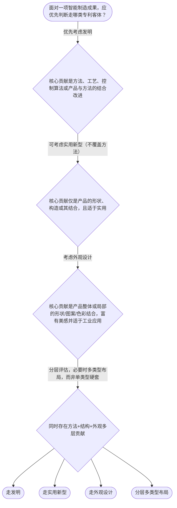

# 专家 B 教学草稿

> 专家：expert_b ｜ 风格：accessible

## 教学模块选择清单

- 当前教学节点：`patent-law-foundation`
- 板块预算：自适应 6/6，总计 9/12

| # | 模块 (block_type) | 类型 | 触发原因 (trigger) | 对应正文段 | 归属 |
|---:|---|:--:|---|---|:--:|
| 1 | `anchor_scenario` | 自适应 | perception=sensing(0.87) / cold_start | 智能制造夹具模组的专利入门冲突｜某智能制造装备公司的研发组做出“自适应夹具+视觉纠偏”模组：既有结构改进，也有控制方法，还有… | [B] |
| 2 | `predict_activate` | 自适应 | processing=active(0.72) | 先猜：方法能不能走实用新型？｜在揭晓法条前先判断：智能制造里的“视觉伺服控制方法”，能不能单独用实用新型保护？先选是或否，… | [B] |
| 3 | `legal_anchor` | 必选 | mandatory | 法条锚定：第二条与三特征｜《专利法》第二条（发明、实用新型、外观设计定义） | [B] |
| 4 | `worked_example` | 自适应 | cold_start(low_confidence) | 案例演示：夹具模组如何拆客体｜事实：团队完成（1）视觉伺服控制方法；（2）夹具手臂的形状与铰接构造改进；（3）控制柜门板的… | [B] |
| 5 | `decision_flow` | 自适应 | input=visual(0.82) | 决策流：技术方案怎么选专利类型｜面对一项智能制造成果，应优先判断走哪类专利客体？ | [B] |
| 6 | `mnemonic` | 自适应 | understanding=sequential(0.78) | 口诀：独时地·三客体·审两轨｜独时地｜三客体｜法细指｜审两轨 | [B] |
| 7 | `knowledge_synthesis` | 必选 | mandatory | 知识综合：基础节点框架｜权利特征：独占性、时间性、地域性——划定专利权能干什么、干多久、在哪干 | [B] |
| 8 | `summary_card` | 自适应 | len(knowledge_sub_nodes)=3>=3 | 速查卡：专利法律制度基础｜先认客体与三特征，再认法源与双轨审查，专利基础就立住了。 | [B] |
| 9 | `assessment` | 必选 | mandatory | 三类测评入口｜中国专利含义与三种保护客体辨认 | [B] |

## 教学正文

## 1. 场景导入

智能制造产线里，研发团队刚做出一套“自适应夹具+视觉纠偏”模组：机械结构有改进，控制方法也有算法，外壳造型还做了工业美学设计。老板拍板要“赶紧申请专利防抄袭”，工程师立刻卡壳——到底申请发明、实用新型还是外观设计？三者能一起报吗？专利到底能管多久、管到哪些国家？如果下周就要把样机拉到国内展会演示，会不会把“新颖性”提前毁掉？这些都不是边缘问题，而是进入专利制度大门的第一课：先搞清楚专利是什么、保护什么、有哪些硬边界。

## 2. 人话解释

把专利想成国家对“技术方案/设计”发的一张有期限、有地盘的“独占通行证”。

- **三种保护客体**：发明=产品或方法的新技术方案；实用新型=产品形状/构造的实用新方案（不做方法）；外观设计=产品外观的富有美感且适于工业应用的新设计。智能制造里，控制算法与工艺流程常走发明，减速器壳体结构可走实用新型，机器人外壳造型可走外观设计。〔RAG: 中华人民共和国专利法.txt — 第二条：发明，是指对产品、方法或者其改进所提出的新的技术方案。实用新型，是指对产品的形状、构造或者其结合所提出的适于实用的新的技术方案。外观设计，是指对产品的整体或者局部的形状、图案或者其结合以及色彩与形状、图案的结合所作出的富有美感并适于工业应用的新设计。〕
- **三大特征**：独占性（排他性）——别人未经许可不得为生产经营目的实施，但法律另有规定（如先用权）时并非绝对禁止一切人；时间性——期限一到进入公有领域；地域性——中国授权只在中国有效。〔RAG: 专利法律知识详细解读.txt — 专利权具有排他性、时间性和地域性的特征。（1）排他性。排他性也称独占性……（2）时间性……〕〔RAG: 专利法专题讲座.txt — 地域性是指，一个国家或地区所授予的专利权仅在该国或地区的范围内有效〕
- **制度体系三件套**：《专利法》定权利义务，《实施细则》定操作细节，《专利审查指南》定审查口径。考试和实务都按这三层往下找依据。
- **制度作用**：用短期独占换技术公开，激励研发、加速扩散、服务产业发展。
- **中国制度特点**：发明走“早期公开+延迟审查/实质审查”，实用新型与外观设计主要走初步审查；先申请制。〔RAG: 专利法律知识同步训练.txt — 实用新型和外观设计专利申请经过初步审查……发明专利申请经过初步审查、实质审查均没有发现驳回理由的，授予专利权。〕

注意：中国法语境下的“专利”含三种类型；TRIPs语境常仅指发明专利，别混。〔RAG: 专利法律知识详细解读.txt — “专利”一词在《与贸易有关的知识产权协定》……仅代表“发明专利”，而在《中华人民共和国专利法》中所称“专利”表示发明、实用新型、外观设计三种专利类型。〕

## 3. 法条回扣

核心锚点就是《专利法》第二条对三种客体的定义，以及贯穿教材的“独占性、时间性、地域性”特征表述。审查路径则落在“发明需实质审查、实用新型/外观设计以初步审查为主”的制度安排。后续新颖性、侵权判定都建立在：先确认客体类型与权利边界，再谈是否公开、是否落入权利要求。

## 4. 类比 / 口诀

类比（有边界）：把三种专利想成智能工厂的三道门禁——发明是“核心工艺+方法”的重门禁（审查严、保护深）；实用新型是“结构件”的快门禁（审得快、不护方法）；外观设计是“外观皮肤”的颜值门禁（看形状图案色彩美感）。类比只帮助分类，不代替法条要件：方法只能冲发明门，不能硬塞实用新型。

口诀：**“独时地，三客体；法细指，审两轨。”** 独=独占，时=时间，地=地域；三客体=发明/实新/外观；法细指=法、细则、指南；审两轨=发明实审 + 实新/外观初审。

## 5. 应试提示

题干关键词扫描顺序建议：
1）问的是“中国专利还是TRIPs专利含义”？
2）考特征时，独占性是否写死成“绝对禁止任何人”——若忽略先用权等例外，常选错。
3）客体归类：出现“方法/工艺/控制算法”→发明；仅“形状构造”→可实用新型；“美感外观工业应用”→外观设计。
4）审查制度：实用新型/外观设计≠发明的实质审查路径。
常见陷阱：把外观设计保护期限记成旧法10年；把地域性理解成“国际专利一张搞定”；把独占性等同于“自己实施也绝对安全”（忽视可能踩他人在先权）。

## 6. 互动提问

本节设有测评（覆盖向后复习/向前探测/薄弱点），请到【习题】区作答。先用场景里的夹具模组在脑子里过一遍：客体怎么拆、权利边界有哪三条、审查走哪条轨。

### 智能制造夹具模组的专利入门冲突（anchor_scenario）

> 某智能制造装备公司的研发组做出“自适应夹具+视觉纠偏”模组：既有结构改进，也有控制方法，还有工业风外壳。市场部下周要拉样机去国内行业展会拉订单，法务却说“先别展，可能影响后面申请”。项目经理急问：我们到底能申请哪些类型的专利？专利能不能管住国外代工厂？展会演示是不是等于提前公开？现场出现三个冲突点——客体选择、权利边界、公开风险——正好把专利制度基础问题摊在台面上。

**锚定**：用同一智能制造事实同时锚定三种保护客体、专利权三特征与中国专利制度入口，降低抽象概念的冷启动门槛。

**先想一想**：如果此刻你是研发负责人，你最想先搞清楚的是“能不能申请什么”，还是“展会会不会把权利葬送”？为什么？

### 先猜：方法能不能走实用新型？（predict_activate）

**预测/激活**：在揭晓法条前先判断：智能制造里的“视觉伺服控制方法”，能不能单独用实用新型保护？先选是或否，并想一句理由。

**激活旧知**：激活学员已有的“结构/产品 vs 方法”常识，以及对中国专利类型的模糊印象。

**揭晓方向**：回想实用新型定义里有没有“方法”二字；再对比发明定义是否明确包含产品或方法。

### 法条锚定：第二条与三特征（legal_anchor）

- **《专利法》第二条（发明、实用新型、外观设计定义）**：第二条用人话划清三道门：发明护产品/方法技术方案，实用新型只护产品形状构造，外观设计护有美感且能工业应用的外观。
- **专利权的排他性（独占性）、时间性、地域性**：独占性不是“绝对封死所有人”，而是“除法律另有规定外，未经许可不得为生产经营目的实施”；还有期限和国境两条硬边。
- **发明经初步审查与实质审查；实用新型、外观设计以初步审查为主**：中国审查是双轨：发明多一道实质审查，实用新型与外观设计更快走初步审查。

**为何重要**：本节点是后续新颖性判断与侵权判定的底座：客体认错、特征记死、体系找错层，后面所有案例分析都会跑偏。

### 案例演示：夹具模组如何拆客体（worked_example）

**案情/例题**：事实：团队完成（1）视觉伺服控制方法；（2）夹具手臂的形状与铰接构造改进；（3）控制柜门板的线条与配色外观。问题：分别最适合考虑哪类专利客体？能否用“一个实用新型”包打全部？
**适用规则**：《专利法》第二条关于发明、实用新型、外观设计的定义
**分步推演**：
1. 控制方法属于“方法技术方案”，第二条明确发明包含产品、方法或其改进，故方法应优先对应发明路径。 → *方法→发明*
2. 夹具手臂的形状、构造改进属于产品结构方案，落入实用新型定义；但实用新型定义不含方法，不能把控制算法塞进实用新型。 → *结构→实用新型（可选）*
3. 柜门板线条配色若富有美感并适于工业应用，对应外观设计；它保护外观而非内部控制逻辑。 → *外观→外观设计*
4. 三类保护重点不同，一件实用新型无法同时覆盖方法与外观；实务上常按层次分别布局，而不是强行单件打包。 → *不能一笼统用实用新型包打*
**结论**：应按技术层次拆分客体：方法走发明，结构可走实用新型，外观走外观设计；不可用单一实用新型覆盖全部。
**本题要点**：先用法条定义做客体归类，再谈申请策略；归类错误会直接导致保护落空。

### 决策流：技术方案怎么选专利类型（decision_flow）

**决策问题**：面对一项智能制造成果，应优先判断走哪类专利客体？



### 口诀：独时地·三客体·审两轨（mnemonic）

**记忆锚**：独时地｜三客体｜法细指｜审两轨
**映射**：
- 独
- 时
- 地
- 三客体
- 法细指
- 审两轨
**何时用**：遇到“专利是什么/有何特征/中国怎么审”的选择或简答入口时，先默念这十六字再展开。

### 知识综合：基础节点框架（knowledge_synthesis）

**知识框架**：
- 权利特征：独占性、时间性、地域性——划定专利权能干什么、干多久、在哪干
- 规范体系：专利法 / 实施细则 / 审查指南——从权利规则到操作口径
- 保护客体：发明（产品/方法）·实用新型（形状构造）·外观设计（美感工业外观）
- 制度功能：激励创造、换取公开、促进应用与经济发展
- 审查特点：早期公开与延迟/实质审查（发明）+ 初步审查制（实用新型、外观设计）并存
**概念关系**：先确认客体类型，再讨论授权条件与保护范围；三特征约束后续侵权与权利行使的边界讨论；规范三层是查找依据的顺序：法律→细则→指南
**必记**：中国法“专利”含三种类型，不可与TRIPs仅指发明的口径混用；实用新型不保护方法；外观设计要同时满足美感与工业应用；独占性有法定例外空间，不能写成绝对禁止任何人

### 速查卡：专利法律制度基础（summary_card）

**要点卡**：
- **三特征**：独占（有例外）、有期限、认地盘
- **三客体**：发明护方法/产品，实新护结构，外观护颜值工业设计
- **三层法源**：专利法定规矩，细则定手续，指南定审查口径
- **审查双轨**：发明要实审，实新/外观主走初审
- **制度作用**：用独占换公开，推动创造落地与产业进步
**必背**：《专利法》第二条三种发明创造定义；独占性、时间性、地域性；发明与实用新型/外观设计的审查路径差异
**一句话总结**：先认客体与三特征，再认法源与双轨审查，专利基础就立住了。

### 三类测评入口（assessment）

**三类覆盖**：backward_review、forward_probe、weakness_probe
**题目**：
- q_br_1：中国专利含义与三种保护客体辨认
- q_fp_1：向前探测专利权保护效力的基本印象
- q_wp_1：智能制造成果的客体拆分与制度易混点挑战


## 结构化字段

## knowledge_points

```json
[
  {
    "node_id": "patent-law-foundation",
    "kc_name": "专利制度的基本概念与特征：独占性、时间性、地域性"
  },
  {
    "node_id": "patent-law-foundation",
    "kc_name": "中国专利制度体系：专利法、专利法实施细则、专利审查指南"
  },
  {
    "node_id": "patent-law-foundation",
    "kc_name": "专利保护的三种客体：发明、实用新型、外观设计（专利法第2条）"
  },
  {
    "node_id": "patent-law-foundation",
    "kc_name": "专利制度的作用：激励发明创造、促进技术公开、推动技术应用和经济发展"
  },
  {
    "node_id": "patent-law-foundation",
    "kc_name": "中国专利制度发展历程与特点：早期公开延迟审查、初步审查制与实质审查制并存"
  }
]
```

## legal_basis

```json
[
  {
    "article": "《专利法》第二条：本法所称的发明创造是指发明、实用新型和外观设计。发明，是指对产品、方法或者其改进所提出的新的技术方案。实用新型，是指对产品的形状、构造或者其结合所提出的适于实用的新的技术方案。外观设计，是指对产品的整体或者局部的形状、图案或者其结合以及色彩与形状、图案的结合所作出的富有美感并适于工业应用的新设计。",
    "source": "中华人民共和国专利法.txt"
  },
  {
    "article": "专利权具有排他性、时间性和地域性的特征。排他性也称独占性，是指除专利法另有规定的以外，任何单位或者个人未经专利权人许可，都不得实施其专利。",
    "source": "专利法律知识详细解读.txt"
  },
  {
    "article": "实用新型和外观设计专利申请经过初步审查，没有发现驳回理由即授予专利权；发明专利申请经过初步审查、实质审查均没有发现驳回理由的，授予专利权。",
    "source": "专利法律知识同步训练.txt"
  },
  {
    "article": "“专利”一词在TRIPs中仅代表发明专利，而在《中华人民共和国专利法》中所称“专利”表示发明、实用新型、外观设计三种专利类型。",
    "source": "专利法律知识详细解读.txt"
  }
]
```

## risks

```json
[
  {
    "risk": "把独占性理解成绝对禁止任何人实施，忽略专利法另有规定（如先用权）导致判断过宽。",
    "related_node_id": "patent-rights-nature"
  },
  {
    "risk": "混淆中国法“专利”含三种类型与TRIPs仅指发明专利的语境差异。",
    "related_node_id": "patent-law-foundation"
  },
  {
    "risk": "将方法类智能制造方案误归入实用新型保护客体。",
    "related_node_id": "patent-law-foundation"
  },
  {
    "risk": "误以为实用新型、外观设计也必须通过与发明相同的实质审查才能授权。",
    "related_node_id": "patent-system-overview"
  },
  {
    "risk": "把地域性理解成一次申请全球生效， downstream 影响海外布局判断。",
    "related_node_id": "patent-rights-nature"
  }
]
```

## draft_stage

```json
"debate"
```

## irac

```json
{
  "issue": "在智能制造研发场景下，如何识别专利法律制度的基础骨架：保护客体、权利特征、规范体系与审查路径？",
  "rule": "《专利法》第二条界定发明、实用新型、外观设计；专利权具有独占性（排他性）、时间性、地域性；中国专利规范由专利法、实施细则、审查指南构成；发明经初步审查与实质审查，实用新型与外观设计主要经初步审查授权。",
  "application": "将自适应夹具拆成方法/结构/外观三层，分别对应三种客体；用“独时地”检验权利边界；用“法—细则—指南”找依据层级；用“两轨审查”预判授权节奏，为后续新颖性与侵权学习铺路，但不提前展开三性与等同细则。",
  "conclusion": "掌握基础节点的关键是：先定客体与权利三特征，再认清制度体系与审查双轨，避免概念混用。"
}
```

## interactive_questions

```json
[
  {
    "qid": "q_br_1",
    "category": "understand",
    "difficulty": "L1",
    "source_tag": "backward_review",
    "kc_node_id": "patent-law-foundation",
    "question": "关于中国专利法所称“专利”及保护客体，下列说法正确的是？",
    "answer": "B",
    "options": [
      "A. 与TRIPs一致，中国专利法中的“专利”仅指发明专利",
      "B. 中国专利法中的发明创造包括发明、实用新型和外观设计三种",
      "C. 实用新型可以保护产品方法类技术方案",
      "D. 外观设计只需具备美感，不必考虑是否适于工业应用"
    ]
  },
  {
    "qid": "q_fp_1",
    "category": "remember",
    "difficulty": "L1",
    "source_tag": "forward_probe",
    "kc_node_id": "patent-rights-protection",
    "question": "（向前探测，不要求已学完）关于专利权保护的初步印象，下列哪项最接近法律规定的方向？",
    "answer": "C",
    "options": [
      "A. 专利权一旦授权，任何研究使用都必然构成侵权",
      "B. 发明、实用新型与外观设计的保护范围都以说明书文字为准",
      "C. 发明和实用新型授权后，原则上未经许可不得为生产经营目的实施其专利",
      "D. 专利权没有法定期限，可随缴纳年费无限续展"
    ]
  },
  {
    "qid": "q_wp_1",
    "category": "analyze",
    "difficulty": "L3",
    "source_tag": "weakness_probe",
    "kc_node_id": "patent-law-foundation",
    "question": "智能工厂团队完成一项“视觉伺服控制方法+夹具结构+外壳造型”。下列判断哪一项最准确？",
    "answer": "A",
    "options": [
      "A. 控制方法通常应考虑发明路径；夹具形状构造可考虑实用新型；外壳造型可考虑外观设计，三者保护重点不同",
      "B. 三者必须合并成一件实用新型申请，否则无法保护",
      "C. 因为具有独占性，授权后在任何国家都自动生效",
      "D. 实用新型与外观设计也必须先通过实质审查才能授权，与发明完全相同"
    ]
  }
]
```

## knowledge_synthesis

```json
{
  "node": "patent-law-foundation",
  "coverage": [
    {
      "node_id": "patent-rights-nature"
    },
    {
      "node_id": "patent-law-framework"
    },
    {
      "node_id": "patent-law-foundation"
    },
    {
      "node_id": "patent-system-overview"
    }
  ],
  "confusable_pairs": [
    {
      "pair": "中国专利法“专利”（发明+实用新型+外观设计） vs TRIPs语境“专利”（常仅发明）"
    },
    {
      "pair": "独占性（有法定例外） vs 绝对禁止任何人实施"
    },
    {
      "pair": "实用新型（产品形状构造） vs 发明（可含方法）"
    },
    {
      "pair": "初步审查制（实用新型/外观设计） vs 实质审查制（发明）"
    }
  ]
}
```

## exercises

```json
[
  {
    "question": "关于中国专利法所称“专利”及保护客体，下列说法正确的是？",
    "answer": "B",
    "options": [
      "A. 与TRIPs一致，中国专利法中的“专利”仅指发明专利",
      "B. 中国专利法中的发明创造包括发明、实用新型和外观设计三种",
      "C. 实用新型可以保护产品方法类技术方案",
      "D. 外观设计只需具备美感，不必考虑是否适于工业应用"
    ]
  },
  {
    "question": "（向前探测）关于专利权保护的初步印象，下列哪项最接近法律规定的方向？",
    "answer": "C",
    "options": [
      "A. 专利权一旦授权，任何研究使用都必然构成侵权",
      "B. 发明、实用新型与外观设计的保护范围都以说明书文字为准",
      "C. 发明和实用新型授权后，原则上未经许可不得为生产经营目的实施其专利",
      "D. 专利权没有法定期限，可随缴纳年费无限续展"
    ]
  },
  {
    "question": "智能工厂团队完成“视觉伺服控制方法+夹具结构+外壳造型”。下列判断哪一项最准确？",
    "answer": "A",
    "options": [
      "A. 控制方法通常应考虑发明路径；夹具形状构造可考虑实用新型；外壳造型可考虑外观设计，三者保护重点不同",
      "B. 三者必须合并成一件实用新型申请，否则无法保护",
      "C. 因为具有独占性，授权后在任何国家都自动生效",
      "D. 实用新型与外观设计也必须先通过实质审查才能授权，与发明完全相同"
    ]
  }
]
```
