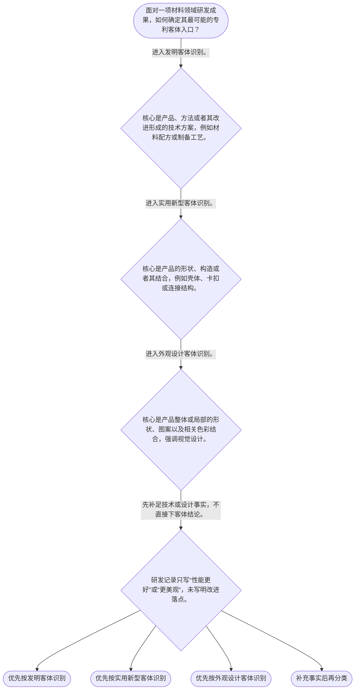

# 整合后的课程完整内容与习题

## 教学模块选择清单

- 当前教学节点：`patent-law-foundation`
- 板块预算：自适应 5/6，总计 9/9

| # | 模块 (block_type) | 类型 | 触发原因 (trigger) | 对应正文段 | 归属 |
|---:|---|:--:|---|---|:--:|
| 1 | `global_framework` | 自适应 | understanding=global(0.73) | 材料成果进入专利制度的全景图｜材料领域专利学习可沿“制度基础—授权实质条件—申请与审查程序—权利保护”展开。本节点先回答专… | [A+B融合] |
| 2 | `anchor_scenario` | 自适应 | perception=sensing(0.86) / P(L)=0.15<0.3 / cold_start | 一个电池项目，三个制度入口｜某电池团队同时完成了正极材料制备路线、电池壳体内部卡扣构造和外壳局部纹理配色。三项成果都与电… | [B] |
| 3 | `legal_anchor` | 必选 | mandatory | 法条锚点：客体分类与发明申请程序轮廓｜《专利法》第二条 | [A] |
| 4 | `worked_example` | 自适应 | cognition.apply=0.18<0.4 / cognition.analyze=0.12<0.3 / cold_start | 给材料研发成果找准客体入口｜某团队拟保护三项成果：改变烧结工艺的材料制备路线、提高装配稳定性的壳体内部卡扣构造、外壳局部… | [A+B融合] |
| 5 | `decision_flow` | 自适应 | input=visual(0.81) | 三类客体的基础分流｜面对一项材料领域研发成果，如何确定其最可能的专利客体入口？ | [A+B融合] |
| 6 | `reflect_prompt` | 自适应 | processing=reflective(0.68) | 把分类框架带回研发记录｜回看一项熟悉的材料研发项目：哪些记录能够证明创新落在工艺方法、产品构造或视觉设计中的哪一处？ | [B] |
| 7 | `assessment` | 必选 | mandatory | 本节三类测评｜识别《专利法》第二条规定的三类发明创造。 | [A+B融合] |
| 8 | `knowledge_synthesis` | 必选 | mandatory | 专利法律制度基础知识网络｜权利性质：专利权具有独占性、时间性和地域性；它是在法定边界内的排他性权利，不是永久、全球自动… | [A+B融合] |
| 9 | `summary_card` | 自适应 | len(knowledge_sub_nodes)=3>=3 | 专利制度基础速查卡｜材料专利入门先定权利边界、法源和保护客体，再进入新颖性、创造性等具体授权条件审查。 | [A+B融合] |

## 教学正文

## 专利法律制度基础：先找对入口，再谈新颖性与创造性

材料领域的专利审查，不能一开始就只问“是否新颖”或“是否有创造性”。更稳妥的顺序是先建立制度坐标：专利权是什么、它保护什么、应依据什么规范，以及材料研发成果应进入哪一种专利客体。只有入口正确，后续的新颖性和创造性判断才有对象和程序前提。

### 一、专利权的基本边界

专利权可以理解为法律在特定范围内赋予权利人的排他性权利。它具有独占性、时间性和地域性：独占性说明权利人在法定范围内可以排除他人未经许可实施；时间性说明权利并非永久有效；地域性说明保护效力原则上限于授予该权利的国家或地区。

这意味着，专利不是对技术事实的永久占有，也不是一项技术在全球自动获得同样保护。材料研发中即使某一配方、工艺或结构具有商业价值，也仍须依照法定客体、申请程序和授权条件接受判断。

### 二、规范地图：先分清依据的功能

中国专利制度的主要规范依据包括《专利法》《专利法实施细则》和《专利审查指南》。《专利法》规定制度的基本规则；实施细则对具体实施和程序要求作进一步规定；审查指南用于说明审查操作中的判断口径。学习和实务中应先回到法律规则，再结合实施细则与审查指南处理具体问题，不能把审查指南中的表述直接写成法律条文。

专利制度以技术公开与依法保护相结合：申请人通过申请文件公开技术信息，制度在符合法定条件时授予一定范围内的专利权，由此激励发明创造、促进技术公开、技术应用和经济发展。这个制度功能解释了为什么材料专利既要关注研发成果，也要关注对成果的清楚表达、程序事实和后续审查。

### 三、三类保护客体：材料成果先做分类

《专利法》第二条规定，发明创造是指发明、实用新型和外观设计；发明是对产品、方法或者其改进所提出的新的技术方案，实用新型是对产品的形状、构造或者其结合所提出的适于实用的新的技术方案，外观设计是对产品整体或者局部的形状、图案或者其结合以及色彩与形状、图案的结合所作出的富有美感并适于工业应用的新设计。〔RAG: 中华人民共和国专利法.txt — 第二条：本法所称的发明创造是指发明、实用新型和外观设计；发明，是指对产品、方法或者其改进所提出的新的技术方案；实用新型，是指对产品的形状、构造或者其结合所提出的适于实用的新的技术方案；外观设计，是指对产品的整体或者局部的形状、图案或者其结合以及色彩与形状、图案的结合所作出的富有美感并适于工业应用的新设计〕

可以用“法构外”帮助初步记忆：法看技术方案，构看产品构造，外看视觉外观。它只是分类提示，不能替代法条定义和具体事实核对。

材料领域常见的材料组成、制备工艺、使用方法或技术改进，通常先沿发明客体观察；电池壳体、连接件、卡扣等产品形状或构造方案，通常先沿实用新型客体观察；产品外壳的局部纹理、图案、色彩搭配等视觉设计，则先沿外观设计客体观察。实用新型只保护产品，一切方法不属于实用新型的保护客体。〔RAG: 专利法专题讲座.txt — 实用新型专利只保护产品；一切方法不属于实用新型的保护客体〕

例如，改变正极材料烧结步骤以获得性能改善，核心是制备方法这一技术方案，应先按发明方向识别；改变电池壳体内部卡扣的形状和连接构造，核心是产品构造，应先按实用新型方向识别；仅改变外壳局部纹理和配色，核心是视觉设计，应先按外观设计方向识别。同一电池项目可以包含多项不同类型的成果，不能因它们都服务于同一产品就采用同一分类。

### 四、制度作用与审查结构

专利制度并不因技术名称中出现“新”“先进”或“性能提升”就当然授予权利。先完成客体分类，才能进入相应的申请、审查和授权条件判断。客体分类回答“成果是什么类型”；新颖性、创造性、实用性则回答发明或实用新型是否满足后续授权条件，两类问题不能混为一步。

初步审查与实质审查在制度中承担不同任务。对于发明专利申请，经过初步审查认为符合要求的，自申请日起满十八个月即行公布；申请人可以请求早日公布。〔RAG: 专家B草稿援引中华人民共和国专利法.txt — 第三十四条：发明专利申请经初步审查认为符合本法要求的，自申请日起满十八个月即行公布；国务院专利行政部门可以根据申请人的请求早日公布其申请〕

发明申请的实质审查不是因公布而当然自动启动；申请人应在申请日起三年内提出实质审查请求。〔RAG: 专家B草稿援引中华人民共和国专利法.txt — 第三十五条：发明专利申请自申请日起三年内，国务院专利行政部门可以根据申请人随时提出的请求，对其申请进行实质审查〕因此，面对材料申请时，应分别记录技术内容、申请日、公布和审查请求等事实，避免把不同时间事实及其法律功能混同。

关于制度发展历程，本节只建立“公开与审查安排、初步审查与实质审查并存”的结构认识；检索上下文未提供完整历史沿革的直接依据，故不补写具体年份或改革节点。

### 五、进入新颖性与创造性学习前的工作顺序

处理一项材料领域申请时，可依次完成四步：第一，定位成果的核心贡献，是技术方案、产品构造还是视觉设计；第二，依据《专利法》第二条确定最可能的保护客体；第三，区分《专利法》、实施细则和审查指南的不同规范功能；第四，分别记录申请、公开和审查请求等相关事实。完成这些基础工作后，才进入下一节点，分别学习发明和实用新型的新颖性、创造性、实用性等授权实质条件。

本节设有测评，请到【习题】区作答。

### 材料成果进入专利制度的全景图（global_framework）

**位置**：本节点是专利审查课程的共同起点，先建立权利性质、法源、客体分类和程序轮廓。

**后继**：patentability-substantive（专利授权实质条件）；patent-application-process（专利申请程序）；patent-rights-protection（专利权保护）

**大局观**：材料领域专利学习可沿“制度基础—授权实质条件—申请与审查程序—权利保护”展开。本节点先回答专利权有什么边界、成果属于什么客体、应查什么规范；下一节点才分别学习新颖性、创造性和实用性。

### 一个电池项目，三个制度入口（anchor_scenario）

> 某电池团队同时完成了正极材料制备路线、电池壳体内部卡扣构造和外壳局部纹理配色。三项成果都与电池有关，却不必进入同一种专利类型。专利工程师首先不讨论新颖性或创造性，而是分别确认技术贡献落在方法或技术方案、产品构造，还是视觉设计。

**锚定**：该场景将抽象的三类保护客体对应到材料研发中可见的工艺、结构和外观记录。

**先想一想**：面对同一项目的三项成果，为什么应先定位改进落点，再讨论后续审查？

### 法条锚点：客体分类与发明申请程序轮廓（legal_anchor）

- **《专利法》第二条**：发明创造包括发明、实用新型和外观设计。发明针对产品、方法或者其改进的新的技术方案；实用新型针对产品形状、构造或者其结合的适于实用的新的技术方案；外观设计针对产品整体或者局部的视觉设计。
- **《专利法》第三十四条、第三十五条**：发明专利申请经初步审查符合要求后，自申请日起满十八个月公布；实质审查请求须在申请日起三年内提出。公布与实质审查请求是不同程序环节。

**为何重要**：客体分类确定申请和审查的入口；区分公布与实质审查请求，可避免把技术公开、程序公开和实质审查混为一件事。

### 给材料研发成果找准客体入口（worked_example）

**案情/例题**：某团队拟保护三项成果：改变烧结工艺的材料制备路线、提高装配稳定性的壳体内部卡扣构造、外壳局部纹理与配色。进入后续审查前应如何分类？
**适用规则**：《专利法》第二条：发明涉及产品、方法或者其改进的新的技术方案；实用新型涉及产品形状、构造或者其结合；外观设计涉及产品整体或者局部的形状、图案及相关色彩结合所作出的视觉设计。
**分步推演**：
1. 制备路线的核心贡献是工艺步骤，即对方法提出的技术方案。 → *先按发明客体识别。*
2. 卡扣方案的核心贡献是产品内部的形状和构造，而非工艺步骤或单纯视觉效果。 → *先按实用新型客体识别。*
3. 纹理和配色的核心贡献是产品局部可见的视觉设计。 → *先按外观设计客体识别。*
4. 分类之后仍需依相应规则审查；技术效果好或名称中含“创新”都不能替代法定判断。 → *客体分类是入口，不是授权结论。*
**结论**：材料制备路线优先按发明客体识别，壳体卡扣构造优先按实用新型客体识别，外壳纹理配色优先按外观设计客体识别。该结论只确定制度入口，不表示已满足授权条件。
**本题要点**：材料案件先问改进落在方法、产品构造还是视觉设计，再确定后续审查路径。

### 三类客体的基础分流（decision_flow）

**决策问题**：面对一项材料领域研发成果，如何确定其最可能的专利客体入口？



### 把分类框架带回研发记录（reflect_prompt）

**反思问题**：回看一项熟悉的材料研发项目：哪些记录能够证明创新落在工艺方法、产品构造或视觉设计中的哪一处？

**关注要点**：不要以“性能提升”直接判断专利类型，应定位产生提升的具体技术或设计特征。；同一项目可以包含多项不同类型的成果，应逐项识别。；发明申请涉及公布与实质审查时，应分别记录申请日、公布和审查请求等程序事实。

**连接**：把法律分类框架连接到实验记录、工艺参数、结构图纸、外观稿以及项目时间线。

### 专利法律制度基础知识网络（knowledge_synthesis）

**知识框架**：
- 权利性质：专利权具有独占性、时间性和地域性；它是在法定边界内的排他性权利，不是永久、全球自动有效的技术所有权。
- 规则体系：专利法提供基本法律规则，实施细则补充具体实施和程序要求，审查指南提供审查操作中的判断口径。
- 保护客体：发明对应产品、方法或者其改进的技术方案；实用新型对应产品形状、构造或者其结合的技术方案；外观设计对应产品整体或者局部的视觉设计。
- 制度作用：专利制度以依法授予的专利权激励发明创造，并通过技术公开促进技术应用和经济发展。
- 程序轮廓：发明申请的公布与实质审查请求是不同环节；初步审查制与实质审查制并存，具体程序规则在后续节点展开。
**概念关系**：先确定成果客体，再进入相应申请、审查和授权条件判断。；客体分类回答“是什么类型”，新颖性、创造性和实用性回答“是否满足授权条件”，二者不能互相替代。；发明申请公布不等于实质审查自动启动；二者具有不同的法定程序功能。
**必记**：专利权具有独占性、时间性和地域性。；《专利法》第二条规定的发明创造包括发明、实用新型和外观设计。；实用新型只保护产品；一切方法不属于实用新型的保护客体。；发明申请经初步审查符合要求后通常自申请日起满十八个月公布；实质审查请求须在申请日起三年内提出。

### 专利制度基础速查卡（summary_card）

**要点卡**：
- **专利权三特征**：独占性说明排他效力，时间性和地域性说明权利边界。
- **规范体系**：专利法定基本规则，实施细则细化实施，审查指南说明审查口径。
- **三类客体**：发明看技术方案，实用新型看产品形状构造，外观设计看产品视觉设计。
- **制度作用**：以依法授予的权利激励创新，并促进技术公开、应用和经济发展。
- **程序轮廓**：发明申请公布与实质审查请求不是同一环节，不能相互替代。
**必背**：专利权具有独占性、时间性和地域性。；发明创造包括发明、实用新型和外观设计。；实用新型只保护产品，方法不属于实用新型的保护客体。；先定保护客体，再进入后续授权条件与程序判断。；发明申请公布不等于实质审查自动启动。
**一句话总结**：材料专利入门先定权利边界、法源和保护客体，再进入新颖性、创造性等具体授权条件审查。

### 本节三类测评（assessment）

**三类覆盖**：backward_review、forward_probe、weakness_probe
**题目**：
- q-backward-1：识别《专利法》第二条规定的三类发明创造。
- q-forward-1：探测下一节点对发明和实用新型“三性”的初步识别。
- q-weakness-1：在材料项目情境中辨析发明、实用新型与外观设计。


## 结构化数据

## expert

```json
"A+B融合"
```

## style

```json
"fused"
```

## knowledge_points

```json
[
  {
    "node_id": "patent-law-foundation",
    "kc_name": "专利制度的基本概念与特征：独占性、时间性、地域性"
  },
  {
    "node_id": "patent-law-foundation",
    "kc_name": "中国专利制度体系：专利法、专利法实施细则、专利审查指南"
  },
  {
    "node_id": "patent-law-foundation",
    "kc_name": "专利保护的三种客体：发明、实用新型、外观设计"
  },
  {
    "node_id": "patent-law-foundation",
    "kc_name": "专利制度的作用：激励发明创造、促进技术公开、推动技术应用和经济发展"
  },
  {
    "node_id": "patent-law-foundation",
    "kc_name": "中国专利制度发展历程与特点：早期公开延迟审查、初步审查制与实质审查制并存"
  }
]
```

## legal_basis

```json
[
  {
    "article": "《专利法》第二条：本法所称的发明创造是指发明、实用新型和外观设计；并分别规定三者定义。",
    "source": "中华人民共和国专利法.txt：第二条"
  },
  {
    "article": "《专利法》第三十四条：发明专利申请经初步审查认为符合本法要求的，自申请日起满十八个月即行公布；可以根据申请人的请求早日公布。",
    "source": "专家B草稿援引：中华人民共和国专利法.txt：第三十四条"
  },
  {
    "article": "《专利法》第三十五条：发明专利申请自申请日起三年内，国务院专利行政部门可以根据申请人随时提出的请求，对其申请进行实质审查。",
    "source": "专家B草稿援引：中华人民共和国专利法.txt：第三十五条"
  },
  {
    "article": "实用新型专利只保护产品；一切方法不属于实用新型的保护客体。",
    "source": "专利法专题讲座.txt"
  }
]
```

## risks

```json
[
  {
    "risk": "易将材料性能提升或技术先进直接视为已满足授权条件。客体分类仅确定制度入口，不能替代后续新颖性、创造性和实用性判断。",
    "related_node_id": "patent-law-foundation"
  },
  {
    "risk": "易把发明申请公布误解为实质审查自动启动。应区分公布与实质审查请求，并注意二者不同的法定程序功能。",
    "related_node_id": "patent-law-foundation"
  },
  {
    "risk": "易把实用新型与发明混同。实用新型只保护产品，方法不属于实用新型的保护客体。",
    "related_node_id": "patent-law-foundation"
  },
  {
    "risk": "检索上下文未提供专利制度完整发展史的直接原文，未对具体历史年份或改革节点作扩展说明。",
    "related_node_id": "patent-law-foundation"
  }
]
```

## draft_stage

```json
"integration"
```

## irac

```json
{
  "issue": "材料领域研发成果在讨论新颖性和创造性前，应如何确定其保护客体、适用规范和基本程序入口？",
  "rule": "《专利法》第二条规定发明创造包括发明、实用新型和外观设计，并分别定义三类客体。专利权具有独占性、时间性和地域性。发明申请经初步审查符合要求后，自申请日起满十八个月公布；实质审查请求须在申请日起三年内提出。",
  "application": "对材料领域成果，应先依据具体贡献落点分类：材料组成、制备方法及其改进通常先按发明客体分析；产品壳体、卡扣等形状构造方案先按实用新型客体分析；产品局部纹理、图案和色彩等视觉设计先按外观设计客体分析。发明申请还应区分公布与实质审查请求的程序功能。",
  "conclusion": "完成权利性质、规范层次、客体分类和基础程序事实识别，才建立了进入后续新颖性、创造性等审查的可靠前提；技术先进本身不等于当然获得专利权。"
}
```

## interactive_questions

```json
[
  {
    "qid": "q-backward-1",
    "category": "remember",
    "difficulty": "L1",
    "source_tag": "backward_review",
    "kc_node_id": "patent-law-foundation",
    "question": "下列哪一项完整列出了《专利法》第二条所称的发明创造？",
    "answer": "B",
    "options": [
      "A. 发明、商标、著作权",
      "B. 发明、实用新型、外观设计",
      "C. 发明、商业秘密、集成电路布图设计",
      "D. 实用新型、植物新品种、外观设计"
    ]
  },
  {
    "qid": "q-forward-1",
    "category": "understand",
    "difficulty": "L1",
    "source_tag": "forward_probe",
    "kc_node_id": "patentability-substantive",
    "question": "作为下一节点的概念探测，下列哪组是发明和实用新型授权时应具备的“三性”？",
    "answer": "A",
    "options": [
      "A. 新颖性、创造性、实用性",
      "B. 独占性、时间性、地域性",
      "C. 公开性、保密性、排他性",
      "D. 形状、构造、图案"
    ]
  },
  {
    "qid": "q-weakness-1",
    "category": "analyze",
    "difficulty": "L3",
    "source_tag": "weakness_probe",
    "kc_node_id": "patent-law-foundation",
    "question": "某团队形成三项成果：正极材料制备方法、仅改变电池壳体内部卡扣构造的方案、仅改变外壳局部图案和色彩搭配的设计。按《专利法》第二条，三项成果依次最可能对应哪三类客体？",
    "answer": "C",
    "options": [
      "A. 依次为实用新型、发明、外观设计",
      "B. 依次为外观设计、实用新型、发明",
      "C. 依次为发明、实用新型、外观设计",
      "D. 三项均只能作为发明理解"
    ]
  }
]
```

## knowledge_synthesis

```json
{
  "node": "patent-law-foundation",
  "coverage": [
    {
      "node_id": "patent-law-foundation"
    },
    {
      "node_id": "patent-rights-nature"
    },
    {
      "node_id": "patent-law-framework"
    },
    {
      "node_id": "patent-system-overview"
    }
  ],
  "confusable_pairs": [
    {
      "pair": "发明与实用新型：发明可涉及产品、方法或者其改进的技术方案；实用新型聚焦产品形状、构造或者其结合，方法不属于实用新型客体。"
    },
    {
      "pair": "实用新型与外观设计：前者看产品构造形成的技术方案，后者看产品整体或局部的视觉设计。"
    },
    {
      "pair": "客体分类与授权实质条件：分类决定制度入口；新颖性、创造性、实用性属于后续授权条件判断。"
    },
    {
      "pair": "发明申请公布与实质审查请求：公布是公开程序，实质审查请求是另一程序环节；公布不等于实质审查自动启动。"
    }
  ]
}
```
