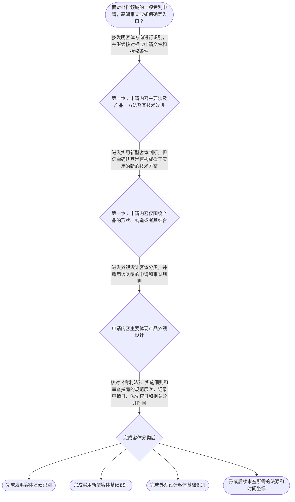

# 专家 A 教学草稿

> 专家：expert_a ｜ 风格：conservative

## 教学模块选择清单

- 当前教学节点：`patent-law-foundation`
- 板块预算：自适应 7/7，总计 9/9

| # | 模块 (block_type) | 类型 | 触发原因 (trigger) | 对应正文段 | 归属 |
|---:|---|:--:|---|---|:--:|
| 1 | `global_framework` | 自适应 | understanding=global(0.73) | 专利法律制度基础在整门课程中的位置｜整门课程可以看作一条连续的专利工作链：先理解专利制度为何存在以及保护什么，再确认申请对象和时… | [A+B融合] |
| 2 | `anchor_scenario` | 自适应 | perception=sensing(0.86) / P(L)=0.15<0.3 / cold_start | 从电池材料研发案看专利制度入口｜某电池材料研发团队完成了一种新型正极材料，并同时设计了配套电池壳体结构。团队准备提交专利申请… | [A+B融合] |
| 3 | `legal_anchor` | 必选 | mandatory | 基础法条与规范入口｜《专利法》第二条 | [A] |
| 4 | `worked_example` | 自适应 | cognition.apply=0.18<0.4 / cognition.analyze=0.12<0.3 / cold_start | 材料组成与壳体结构的客体分类演示｜某研发团队同时提出两个方案：方案甲是改变电池正极材料的化学组成及制备步骤；方案乙是改变电池壳… | [A] |
| 5 | `decision_flow` | 自适应 | input=visual(0.81) | 专利基础判断流程｜面对材料领域的一项专利申请，基础审查应如何确定入口？ | [A+B融合] |
| 6 | `reflect_prompt` | 自适应 | processing=reflective(0.68) | 把制度框架迁移到材料研发经验｜回想一个你熟悉的材料研发项目：如果要把它转化为专利工作任务，你会如何区分技术方案、保护客体和… | [A+B融合] |
| 7 | `assessment` | 必选 | mandatory | 本节点三类测评｜识别专利权独占性、时间性和地域性三项基本特征 | [A] |
| 8 | `knowledge_synthesis` | 必选 | mandatory | 专利法律制度基础知识网络｜专利权性质：专利权具有独占性、时间性和地域性，排他效力受到法定期限、地域和权利要求范围限制。 | [A] |
| 9 | `summary_card` | 自适应 | len(knowledge_sub_nodes)=3>=3 | 专利法律制度基础速查卡｜先识别权利性质和保护客体，再固定法源与时间坐标，最后进入具体授权条件判断。 | [A+B融合] |

## 教学正文

## I — 法律问题

学习材料领域专利审查规则，首先要明确专利法律制度的基本坐标：什么是专利权、专利权保护什么客体、权利具有哪些边界，以及申请、审查和授权制度如何衔接。本节只讲“专利法律制度基础”，不提前展开新颖性和创造性的具体判断方法。

## R — 适用规则

### 1. 专利权的基本特征

专利权是一种依法确认和保护的知识产权。其基本特征可以概括为独占性、时间性和地域性：独占性是指在权利有效范围内，权利人原则上可以排除他人未经许可实施受保护的发明创造；时间性是指权利并非永久存在，而是在法定保护期限内有效；地域性是指保护效力原则上限于授予该权利的国家或地区。上述特征共同说明，专利权不是对技术事实本身的永久占有，而是法律在特定期间和地域内赋予的排他性权利。

### 2. 中国专利制度的法源层次

中国专利制度的主要规范依据包括《专利法》《专利法实施细则》和《专利审查指南》。其中，《专利法》规定制度基本原则、权利客体、申请与授权、保护和救济等核心问题；《专利法实施细则》对法定程序和具体操作作进一步规定；《专利审查指南》用于说明专利审查中的具体判断标准和审查方法。三者在学习和实务中应当区分使用，不能把审查指南中的审查口径误写成法律条文本身。

### 3. 专利保护客体

根据检索材料对《专利法》第二条的讲解，发明专利保护的对象是利用技术手段解决技术问题、获得符合自然规律技术效果的技术方案；实用新型是对产品的形状、构造或者其结合提出的适于实用的新的技术方案。〔RAG: 专利法专题讲座.txt — 发明专利的保护对象范围最广，包括新产品、新方法、老产品新改进、老方法新改进而形成的技术方案；《专利法》第2条第3款规定实用新型是对产品的形状、构造或者其结合所提出的适于实用的新的技术方案〕

在制度分类上，专利保护客体包括发明、实用新型和外观设计。三者并非同一类技术方案：发明可以涉及产品、方法及其改进；实用新型限于产品的形状、构造或者其结合；外观设计主要针对产品的外观设计。材料领域中，电池正极材料的组成或制备方法通常需要先按发明客体分析；如果权利要求只围绕产品的形状、构造及其结合，则还需要判断是否符合实用新型的客体边界。

检索上下文直接提供了发明和实用新型客体的相关讲解，但未提供《专利法》第二条关于外观设计的完整原文。因此，关于外观设计的进一步细节，本节只作分类性说明，不扩展具体法条解释。

### 4. 专利申请制度的时间坐标

《专利法》第二十八条规定，国务院专利行政部门收到专利申请文件之日为申请日；申请文件通过邮寄提交的，以寄出的邮戳日为申请日。〔RAG: 中华人民共和国专利法.txt — 第二十八条：国务院专利行政部门收到专利申请文件之日为申请日；申请文件是邮寄的，以寄出的邮戳日为申请日〕

《专利法》第二十九条规定，发明或者实用新型在外国第一次提出专利申请后十二个月内，或者外观设计在外国第一次提出专利申请后六个月内，就相同主题在中国提出申请的，可以依协议、国际条约或互惠原则享有优先权；在中国第一次提出发明或者实用新型申请后十二个月内，或者外观设计申请后六个月内，就相同主题再次向国务院专利行政部门提出申请的，可以享有优先权。〔RAG: 中华人民共和国专利法.txt — 第二十九条：发明或者实用新型外国优先权期限为十二个月，外观设计外国优先权期限为六个月；相同主题国内优先权期限分别为十二个月和六个月〕

申请日和优先权日是后续判断公开时间、现有技术以及权利要求范围的重要时间坐标。它们不能与公开日、授权日混同。

### 5. 专利制度的功能与审查结构

专利制度通过授予一定期限和地域内的排他性权利，交换申请人对技术方案的公开，从而发挥激励发明创造、促进技术公开、推动技术应用和经济发展的作用。专利权的排他性因此受到法定时间、地域、权利要求范围和授权条件的共同限制。

中国专利审查制度体现为初步审查与实质审查并存的结构。初步审查主要处理申请文件和形式、程序等方面的问题；实质审查则进一步评价发明专利是否满足授权的实质条件。关于中国专利制度发展历程以及“早期公开、延迟审查”的具体历史沿革，本次检索上下文未提供直接依据，不能据此补写具体年份、改革节点或制度来源。这里仅保留制度结构层面的学习提示。

## A — 规则适用

面对材料领域的一项申请，应按以下顺序建立基础判断链：第一，识别申请对象属于发明、实用新型还是外观设计；第二，确认适用的规范层次，先找《专利法》的基本规定，再结合实施细则和审查指南；第三，记录申请日、可能的优先权日以及相关公开时间；第四，再进入相应客体和授权条件的专门审查。不能因为某项材料具有技术价值，就直接推断其必然获得专利保护；也不能因为技术属于材料领域，就跳过客体分类和时间坐标确认。

例如，某研发团队提出一种新型电池材料及其制备方法。若申请内容是材料组成或制备步骤，应先作为发明客体进行分类；若另有一个仅描述电池壳体结构的方案，则应单独判断其是否属于实用新型可能保护的产品形状、构造或其结合。随后，代理人应记录申请文件的提交时间，并核对是否存在相同主题的优先权主张。只有完成这些基础识别，后续的新颖性、创造性和其他授权条件判断才有稳定的前提。

## C — 结论

专利法律制度基础的核心不是背诵孤立名词，而是建立“权利性质—保护客体—法源层次—时间坐标—审查结构”的共同框架。发明、实用新型和外观设计的分类决定后续审查入口；申请日和优先权日构成后续时间判断的基础；《专利法》、实施细则和审查指南分别承担不同规范功能。

> 常见误区 / 易混淆点
>
> - 把技术先进等同于必然能够获得专利权。技术价值不能替代客体和授权条件审查。
> - 把《专利法》、实施细则和审查指南视为同一层级的法条。它们的规范功能和法律性质不同。
> - 把申请日、优先权日、公开日和授权日混为一谈。后续审查必须先固定具体时间事实。
> - 把发明与实用新型混同。实用新型只保护产品的形状、构造或者其结合，方法本身不属于实用新型的产品客体。〔RAG: 专利法专题讲座.txt — 实用新型专利只保护产品；一切方法不属于实用新型的保护客体〕

本节设有测评，请到【习题】区作答。

### 专利法律制度基础在整门课程中的位置（global_framework）

**位置**：位于专利审查学习主线的起点：先建立权利性质、保护客体、法源和时间坐标，再进入授权实质条件、申请程序和权利保护。

**后继**：patentability-substantive（专利授权实质条件）；patent-application-process（专利申请程序）；patent-rights-protection（专利权保护）

**大局观**：整门课程可以看作一条连续的专利工作链：先理解专利制度为何存在以及保护什么，再确认申请对象和时间坐标，随后学习新颖性、创造性、实用性等授权条件，之后进入申请程序、审查意见答复、权利保护和无效、侵权救济。本节点提供共同语言和判断入口，后续每个具体审查结论都依赖这里建立的客体分类、法源层次和时间意识。

### 从电池材料研发案看专利制度入口（anchor_scenario）

> 某电池材料研发团队完成了一种新型正极材料，并同时设计了配套电池壳体结构。团队准备提交专利申请，但成员对申请对象、申请日和后续审查顺序存在分歧：有人认为只要技术先进就可以直接申请，有人认为材料组成和壳体结构应当按同一种专利处理，还有人忽略了首次提交日期对后续相同主题申请的影响。专利代理人需要先把这些问题拆开，确定保护客体、适用法源和时间坐标，再进入新颖性与创造性判断。

**锚定**：该情境锚定专利权基本特征、三类保护客体、法源层次以及申请日和优先权的基础关系。

**先想一想**：如果你是代理人，面对“新型材料组成”和“电池壳体结构”两个方案，你会先区分什么，再决定后续审查路径？

### 基础法条与规范入口（legal_anchor）

- **《专利法》第二条**：第二条用于区分发明、实用新型和外观设计等专利保护客体；检索材料直接展开了发明和实用新型的客体边界。
- **《专利法》第二十八条**：第二十八条确定申请日的基本规则：通常以国务院专利行政部门收到申请文件之日为申请日，邮寄申请则看寄出邮戳日。
- **《专利法》第二十九条**：第二十九条规定相同主题申请的优先权期限：发明和实用新型通常为十二个月，外观设计通常为六个月。

**为何重要**：这些规定分别确定“保护什么”和“从什么时候起算”等基础问题。后续新颖性、创造性以及申请程序判断，都必须建立在客体分类和时间坐标准确的基础上。

### 材料组成与壳体结构的客体分类演示（worked_example）

**案情/例题**：某研发团队同时提出两个方案：方案甲是改变电池正极材料的化学组成及制备步骤；方案乙是改变电池壳体的几何形状和内部连接构造。团队拟将两者都按实用新型申请。请演示在进入新颖性和创造性判断前，如何完成基础客体分类。
**适用规则**：《专利法》第二条；检索材料关于发明保护技术方案以及实用新型只保护产品形状、构造或其结合的说明。
**分步推演**：
1. 先看方案甲的技术特征。方案甲涉及材料组成和制备步骤，解决技术问题所采用的是产品技术方案及方法技术手段，不能仅因其最终形成材料产品就直接归入实用新型。 → *方案甲应先按发明客体方向识别，不能把制备方法当作实用新型客体。*
2. 再看方案乙的技术特征。方案乙针对电池壳体这一有确定形状和构造的产品，并通过形状、构造及其结合形成技术方案，符合实用新型客体分析的入口。 → *方案乙具有实用新型客体判断的基础。*
3. 最后分别记录两项方案的申请类型和后续审查入口。客体分类完成后，还要分别核对申请文件、申请日、可能的优先权以及各自适用的授权条件。 → *先分类、再核对时间和授权条件，不能直接从技术先进性跳到授权结论。*
**结论**：方案甲和方案乙不能仅凭同属电池技术就采用同一客体结论；方案甲应先按发明方向分析，方案乙具有实用新型客体判断基础。两者均仍需经过后续法定审查。
**本题要点**：材料领域案件的第一步是按技术特征分类保护客体，而不是按技术价值直接判断能否授权。

### 专利基础判断流程（decision_flow）

**决策问题**：面对材料领域的一项专利申请，基础审查应如何确定入口？



### 把制度框架迁移到材料研发经验（reflect_prompt）

**反思问题**：回想一个你熟悉的材料研发项目：如果要把它转化为专利工作任务，你会如何区分技术方案、保护客体和时间节点？

**关注要点**：技术内容是材料组成、制备方法、产品结构，还是外观设计；不同客体是否需要采用不同的申请类型和审查入口；首次提交日、后续提交日和技术公开日是否被分别记录

**连接**：连接到已有的材料研发流程、实验记录和项目时间线，并为后续新颖性和创造性判断建立时间与技术特征意识。

### 专利法律制度基础知识网络（knowledge_synthesis）

**知识框架**：
- 专利权性质：专利权具有独占性、时间性和地域性，排他效力受到法定期限、地域和权利要求范围限制。
- 法源体系：专利法规定制度基本规则，实施细则具体化程序要求，审查指南说明审查中的具体判断口径。
- 保护客体：专利保护客体分为发明、实用新型和外观设计，材料组成、制备方法与产品结构应按技术特征分别识别。
- 制度功能：专利制度以一定期限和地域内的排他性换取技术公开，服务于激励创新、促进技术应用和经济发展。
- 审查结构：初步审查与实质审查承担不同任务，申请人需要先完成申请类型和程序基础识别，再进入具体授权条件判断。
**概念关系**：先识别专利权性质，再理解其排他性为何受到时间和地域限制。；先按技术特征完成保护客体分类，再选择相应的申请与审查路径。；先确定适用法源和申请日、优先权日，再进入新颖性、创造性等具体授权条件判断。
**必记**：专利权的基本特征是独占性、时间性和地域性。；《专利法》、实施细则和审查指南具有不同规范功能，不能混称为同一层级法条。；发明、实用新型和外观设计是不同保护客体类型，客体分类是后续审查的入口。；申请日和优先权日是后续时间判断的重要坐标，不能与公开日、授权日混同。

### 专利法律制度基础速查卡（summary_card）

**要点卡**：
- **专利权三性**：独占性说明排他效力，时间性和地域性说明排他效力的边界。
- **法源层次**：专利法定基本规则，实施细则细化程序，审查指南说明审查口径。
- **保护客体**：发明、实用新型和外观设计是三类不同的专利保护客体。
- **时间坐标**：申请日、优先权日、公开日和授权日承担不同法律功能，必须分别记录。
**必背**：专利权具有独占性、时间性和地域性。；实用新型主要针对产品的形状、构造或者其结合，方法本身不属于实用新型的产品客体。；发明或者实用新型国内优先权期限为十二个月，外观设计国内优先权期限为六个月。；技术先进不等于当然能够获得专利保护，必须先完成客体和授权条件审查。
**一句话总结**：先识别权利性质和保护客体，再固定法源与时间坐标，最后进入具体授权条件判断。

### 本节点三类测评（assessment）

**三类覆盖**：backward_review、forward_probe、weakness_probe
**题目**：
- q-backward-1：识别专利权独占性、时间性和地域性三项基本特征
- q-forward-1：辨析发明、实用新型和外观设计作为不同保护客体类型
- q-weakness-1：结合日期判断发明或者实用新型国内优先权的期限规则


## 结构化字段

## knowledge_points

```json
[
  {
    "node_id": "patent-law-foundation",
    "kc_name": "专利制度的基本概念与特征：独占性、时间性、地域性"
  },
  {
    "node_id": "patent-law-foundation",
    "kc_name": "中国专利制度体系：专利法、专利法实施细则、专利审查指南"
  },
  {
    "node_id": "patent-law-foundation",
    "kc_name": "专利保护的三种客体：发明、实用新型、外观设计"
  },
  {
    "node_id": "patent-law-foundation",
    "kc_name": "专利制度的作用：激励发明创造、促进技术公开、推动技术应用和经济发展"
  },
  {
    "node_id": "patent-law-foundation",
    "kc_name": "中国专利制度发展历程与特点：早期公开延迟审查、初步审查制与实质审查制并存"
  }
]
```

## legal_basis

```json
[
  {
    "article": "《专利法》第二条",
    "source": "专利法专题讲座.txt"
  },
  {
    "article": "《专利法》第二十八条",
    "source": "中华人民共和国专利法.txt"
  },
  {
    "article": "《专利法》第二十九条",
    "source": "中华人民共和国专利法.txt"
  }
]
```

## risks

```json
[
  {
    "risk": "检索上下文未提供《专利法》第二条关于外观设计的完整原文，外观设计部分只能作分类性概述，不能扩展具体法条解释。",
    "related_node_id": "patent-law-foundation"
  },
  {
    "risk": "“早期公开、延迟审查”的历史沿革缺少直接检索依据，不能补写具体年份或改革节点。",
    "related_node_id": "patent-law-foundation"
  },
  {
    "risk": "学习者可能将专利制度基础与新颖性、创造性具体判断混同，应先区分制度入口、客体分类和授权条件。",
    "related_node_id": "patent-law-foundation"
  }
]
```

## draft_stage

```json
"debate"
```

## irac

```json
{
  "issue": "材料领域技术方案进入专利审查前，应如何识别其权利性质、保护客体、适用法源和时间坐标？",
  "rule": "专利权具有独占性、时间性和地域性；中国专利制度的主要规范依据包括《专利法》《专利法实施细则》和《专利审查指南》；《专利法》第二条区分发明、实用新型和外观设计；第二十八条规定申请日，第二十九条规定相同主题申请的优先权期限。",
  "application": "对材料领域申请，先根据技术内容区分发明、实用新型或外观设计，再按法源层次核对规范，并记录申请日、优先权日和相关公开时间。材料组成或制备方法通常先按发明客体分析，产品形状、构造或其结合则需进一步判断实用新型客体边界。",
  "conclusion": "只有完成权利性质、保护客体、法源层次和时间坐标的基础识别，才能为后续新颖性、创造性及其他授权条件审查建立可靠前提；技术先进本身不等于当然获得专利保护。"
}
```

## interactive_questions

```json
[
  {
    "qid": "q-backward-1",
    "category": "remember",
    "difficulty": "L1",
    "source_tag": "backward_review",
    "kc_node_id": "patent-law-foundation",
    "question": "下列哪一组最准确地概括了专利权的基本特征？",
    "answer": "A",
    "options": [
      "A. 独占性、时间性、地域性",
      "B. 永久性、无偿性、全球性",
      "C. 公开性、刑罚性、无期限性",
      "D. 任意性、秘密性、无地域限制"
    ]
  },
  {
    "qid": "q-forward-1",
    "category": "remember",
    "difficulty": "L1",
    "source_tag": "forward_probe",
    "kc_node_id": "patentability-substantive",
    "question": "关于发明、实用新型和外观设计的关系，下列说法正确的是：",
    "answer": "B",
    "options": [
      "A. 三者都只能保护产品的形状",
      "B. 三者是专利保护客体的不同类型，后续审查条件和判断重点可能不同",
      "C. 实用新型只保护方法，发明只保护外观",
      "D. 只要属于材料领域，就只能申请实用新型"
    ]
  },
  {
    "qid": "q-weakness-1",
    "category": "analyze",
    "difficulty": "L3",
    "source_tag": "weakness_probe",
    "kc_node_id": "patent-law-foundation",
    "question": "某公司于2025年3月1日首次在中国提交了一项发明专利申请，后于2025年12月1日就相同主题再次在中国提出申请。根据已给出的优先权期限规则，以下判断最准确的是：",
    "answer": "C",
    "options": [
      "A. 第二次申请当然享有外观设计六个月优先权",
      "B. 第二次申请当然享有发明专利二十四个月优先权",
      "C. 发明或者实用新型的国内优先权期限为十二个月，按日期看仍需结合其他法定条件判断",
      "D. 只要两次申请主题相同，优先权没有时间限制"
    ]
  }
]
```

## knowledge_synthesis

```json
{
  "node": "patent-law-foundation",
  "coverage": [
    {
      "node_id": "patent-law-foundation"
    },
    {
      "node_id": "patent-rights-nature"
    },
    {
      "node_id": "patent-law-framework"
    },
    {
      "node_id": "patent-system-overview"
    }
  ],
  "confusable_pairs": [
    {
      "pair": "申请日与公开日：申请日是申请文件被收到或依邮戳确定的日期，公开日是技术内容向公众公开的日期，二者法律功能不同。"
    },
    {
      "pair": "专利法与专利审查指南：前者规定基本法律规则，后者提供审查判断口径，不能将指南内容直接当作法条引用。"
    },
    {
      "pair": "发明与实用新型：发明可以涉及产品、方法及其改进，实用新型主要保护产品的形状、构造或者其结合。"
    }
  ]
}
```
