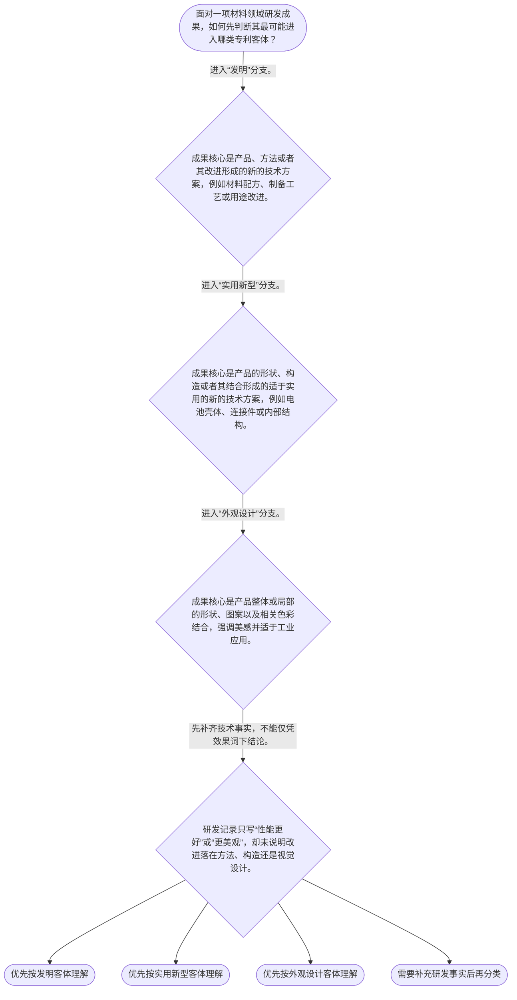

# 专家 B 教学草稿

> 专家：expert_b ｜ 风格：accessible

## 教学模块选择清单

- 当前教学节点：`patent-law-foundation`
- 板块预算：自适应 6/6，总计 9/9

| # | 模块 (block_type) | 类型 | 触发原因 (trigger) | 对应正文段 | 归属 |
|---:|---|:--:|---|---|:--:|
| 1 | `global_framework` | 自适应 | understanding=global(0.73) | 从材料成果到专利规则的全景图｜材料研发中的一项成果能否进入专利体系，先要回答“它属于什么保护客体、适用什么规则、制度为何要… | [B] |
| 2 | `anchor_scenario` | 自适应 | perception=sensing(0.86) / P(L)=0.15<0.3 / cold_start | 一个电池项目，三种可能的专利客体｜某电池材料团队完成了三项工作：研发人员配出了新的正极材料制备路线；结构工程师为电芯设计了新的… | [B] |
| 3 | `legal_anchor` | 必选 | mandatory | 法条锚点：三类发明创造｜《专利法》第二条 | [B] |
| 4 | `worked_example` | 自适应 | cognition.apply=0.18<0.4 / cognition.analyze=0.12<0.3 / cold_start | 演示：给电池研发成果找对专利入口｜教学示例：某团队拟保护三项电池相关成果：通过改变烧结工艺获得材料性能改善的制备路线、可提高装… | [B] |
| 5 | `decision_flow` | 自适应 | input=visual(0.81) | 三类客体的分流判断｜面对一项材料领域研发成果，如何先判断其最可能进入哪类专利客体？ | [B] |
| 6 | `reflect_prompt` | 自适应 | processing=reflective(0.68) | 把分类框架带回研发记录｜回看自己熟悉的一项材料研发项目，哪些记录最能说明创新落在工艺方法、产品构造或视觉设计中的哪一… | [B] |
| 7 | `assessment` | 必选 | mandatory | 三类测评闭环｜复习三类发明创造的法定范围。 | [B] |
| 8 | `knowledge_synthesis` | 必选 | mandatory | 制度基础的知识关系网｜专利制度的基本特征：专利权具有独占性、时间性和地域性；可把它理解为法律在特定期限和地域内赋予… | [B] |
| 9 | `summary_card` | 自适应 | len(knowledge_sub_nodes)=3>=3 | 专利制度基础速查卡｜材料专利入门的第一步不是直接判新颖性或创造性，而是先按法定定义找准成果所属的保护客体和制度入… | [B] |

## 教学正文

## 1. 场景导入

先从一个材料研发项目看起：团队既做出了新的正极材料制备路线，又改进了电池壳体内部卡扣，还设计了外壳局部纹理和配色。它们都和“电池创新”有关，却不一定进入同一种专利类型。

入门时先别急着问“够不够新”“有没有创造性”。第一步是给成果找准法律入口：创新主要落在**方法或技术方案**、**产品构造**，还是**产品的视觉外观**。入口找错，后续准备的材料、审查路径和判断重点都会跑偏。

## 2. 人话解释

把专利制度想成一套“公开技术信息，换取依法保护”的规则：研发者把技术方案写清楚并向社会公开；法律在满足条件时，给予权利人一定范围内、一定期限内、一定地域内的排他性权利。这里的三个特征可以先记成：独占性不是人人都能随意实施，时间性不是永久有效，地域性不是自动覆盖全世界。

材料领域常见成果可先这样拆：材料配方、制备工艺、用途改进这类“怎么做、怎么用、怎么改”的技术方案，通常先从发明的定义观察；器件壳体、连接结构、封装卡扣这类“产品怎么构成”的技术方案，通常先从实用新型的定义观察；产品表面的局部纹理、图案、色彩搭配等“看起来怎样”的设计，则先从外观设计的定义观察。

中国专利制度不是只有一部法律：专利法给出基础规则，专利法实施细则补充实施事项，专利审查指南帮助理解审查操作。现在只需建立这张规则地图；新颖性、创造性和实用性会在下一站作为授权实质条件分别展开。

## 3. 法条回扣

《专利法》第二条规定，发明创造包括发明、实用新型和外观设计；其中，发明是对产品、方法或者其改进提出的新的技术方案，实用新型是对产品形状、构造或者其结合提出的适于实用的新的技术方案，外观设计则是对产品整体或者局部的形状、图案及相关色彩结合所作出的富有美感并适于工业应用的新设计。〔RAG: 中华人民共和国专利法.txt — 第二条：本法所称的发明创造是指发明、实用新型和外观设计；并分别规定三者定义〕

因此，材料团队不能只写“我们做出了新材料”就结束分类：要继续定位贡献是材料本身或制备方法的技术方案、产品的形状构造，还是产品的视觉设计。第二条解决的是“它是什么类型的发明创造”；它本身不直接替代后续授权条件的判断。

作为后续学习的预告，《专利法》第二十二条规定，授予专利权的发明和实用新型应具备新颖性、创造性和实用性。〔RAG: 中华人民共和国专利法.txt — 第二十二条：授予专利权的发明和实用新型，应当具备新颖性、创造性和实用性〕本节只建立制度入口，不提前展开三性的具体判定。

## 4. 类比 / 口诀

可以用“先分柜、再安检”记忆：

- **分柜**：方法或技术方案看发明，产品构造看实用新型，视觉外观看外观设计。
- **安检**：进入相应制度入口后，才处理后续的授权条件与审查问题。

口诀是：**“法构外：法看方案，构看结构，外看外观。”**

这个类比的边界是：现实案件不能只凭名称、部门归属或“技术含量高低”分类，仍要核对具体技术事实和法定定义；同一项目也可能包含多项不同类型的成果。

## 5. 应试提示

看到题干中的“制备方法、工艺步骤、材料改进、产品用途”等表述，先沿发明定义核对；看到“壳体、卡扣、连接件、层状结构、形状构造”等表述，先沿实用新型定义核对；看到“局部图案、纹理、色彩、外观美感”等表述，先沿外观设计定义核对。

最常见的陷阱是把“技术方案”和“外观效果”混成一类，或把“属于哪种专利客体”误当成“已经具备新颖性和创造性”。答题时先圈出成果的核心改进落点，再回扣第二条的定义；不要跳步。

制度发展和程序轮廓在本节只建立框架：专利制度包含公开与审查安排，且不同专利类型的审查路径并不完全相同。具体程序规则将在后续节点依据相应法条和审查材料展开。

## 6. 互动提问

本节设有测评，请到【习题】区作答。

### 从材料成果到专利规则的全景图（global_framework）

**位置**：位于专利课程的起点：先认识制度、法源和三类保护客体，再进入三性判断、申请审查与权利保护。

**前置**：无；可直接从材料研发经验切入。

**后继**：patentability-substantive（专利授权实质条件）；patent-application-process（专利申请程序）；patent-examination（专利审查）；patent-rights-protection（专利权保护）

**大局观**：材料研发中的一项成果能否进入专利体系，先要回答“它属于什么保护客体、适用什么规则、制度为何要求公开换保护”三个基础问题。本节点是后续学习授权实质条件、申请程序、审查程序和权利保护的共同起点；新颖性和创造性会在下一节点作为独立的授权条件展开。

### 一个电池项目，三种可能的专利客体（anchor_scenario）

> 某电池材料团队完成了三项工作：研发人员配出了新的正极材料制备路线；结构工程师为电芯设计了新的壳体卡扣构造；工业设计师调整了电池外壳局部的纹理、图案与色彩搭配。团队准备把成果交给专利工程师，却发现三份研发记录看起来都在说“电池创新”，但它们需要进入的专利类型并不相同。
专利工程师此时不急着讨论新颖性和创造性，而是先把成果按技术方案、产品构造和视觉设计拆开：先确定法律保护的客体，才能知道后续应沿着哪条申请与审查轨道准备材料。

**锚定**：该场景锚定“材料研发成果不是天然同一种专利客体”，先建立发明、实用新型与外观设计的分类意识。

**先想一想**：面对同一电池项目中的不同成果，先识别“技术方案、产品构造、视觉设计”会如何减少后续申请准备的偏差？

### 法条锚点：三类发明创造（legal_anchor）

- **《专利法》第二条**：法律把可称为“发明创造”的成果分为发明、实用新型和外观设计：发明着眼于产品、方法或改进的新的技术方案；实用新型着眼于产品形状、构造或其结合的新的实用技术方案；外观设计着眼于产品整体或局部的形状、图案、色彩等视觉设计。

**为何重要**：材料领域的配方、制备方法、器件结构和产品外观常同时出现。先按第二条确定成果的法律类型，才能为后续授权条件与审查程序建立正确入口。

### 演示：给电池研发成果找对专利入口（worked_example）

**案情/例题**：教学示例：某团队拟保护三项电池相关成果：通过改变烧结工艺获得材料性能改善的制备路线、可提高装配稳定性的电池壳体内部卡扣构造、以及外壳局部纹理和配色。应如何先进行专利客体分类？
**适用规则**：《专利法》第二条：发明是对产品、方法或者其改进提出的新的技术方案；实用新型是对产品形状、构造或者其结合提出的适于实用的新的技术方案；外观设计是对产品整体或者局部的形状、图案及相关色彩结合所作出的富有美感并适于工业应用的新设计。
**分步推演**：
1. 先看第一项的贡献落点：它描述的是获得材料的工艺路线，属于对“方法或者其改进”提出的技术方案。 → *制备方法优先识别为发明。*
2. 再看第二项的贡献落点：它突出产品内部卡扣的形状、构造及其组合，而不是工艺步骤或视觉效果。 → *产品构造优先识别为实用新型。*
3. 最后看第三项的贡献落点：它针对产品局部的纹理、图案和色彩搭配，核心是可见的视觉设计。 → *视觉设计优先识别为外观设计。*
4. 完成类型识别后，才分别进入对应申请与审查规则；不能把“有技术含量”直接等同于某一类型已经可以授权。 → *类型判断是后续审查的入口，不是授权结论。*
**结论**：示例中的制备路线应先按“发明”路径理解；壳体卡扣构造应先按“实用新型”路径理解；外壳纹理与色彩搭配应先按“外观设计”路径理解。该分类只是确定保护客体入口，不等于已经满足授权条件。
**本题要点**：处理材料研发成果时，先问创新落在方法、产品构造还是视觉设计上，再进入后续规则。

### 三类客体的分流判断（decision_flow）

**决策问题**：面对一项材料领域研发成果，如何先判断其最可能进入哪类专利客体？



### 把分类框架带回研发记录（reflect_prompt）

**反思问题**：回看自己熟悉的一项材料研发项目，哪些记录最能说明创新落在工艺方法、产品构造或视觉设计中的哪一处？

**关注要点**：不要只用“性能提升”判断专利类型，应定位提升来自何种技术或设计特征。；同一项目可以有多项不同性质的成果，分类时应按每项成果的核心贡献分别观察。；确定客体类型后，仍需另行面对后续的授权条件与审查规则。

**连接**：连接到学习者已有的材料研发经验：实验记录、工艺参数、结构图纸和产品外观稿分别保存了不同类型的创新事实。

### 制度基础的知识关系网（knowledge_synthesis）

**知识框架**：
- 专利制度的基本特征：专利权具有独占性、时间性和地域性；可把它理解为法律在特定期限和地域内赋予权利人的排他性权利。
- 中国专利制度的规则层级：专利法提供基础法律规则，专利法实施细则补充实施规则，专利审查指南提供审查操作层面的指引；处理具体问题应回到相应依据核对。
- 三类保护客体：发明对应产品、方法或改进的技术方案；实用新型对应产品形状、构造或其结合的技术方案；外观设计对应产品整体或局部的视觉设计。
- 制度交换逻辑：申请人公开技术信息，制度以依法授予的专利权激励创新，并促进技术应用和经济发展。
- 程序轮廓：制度具有公开与审查环节；发明申请通常涉及公开后再进行实质审查的安排，实用新型和外观设计适用不同的审查路径，具体程序将在后续节点展开。
**概念关系**：先识别成果属于何种保护客体，再进入对应的授权条件与审查程序。；专利法是基础规范，实施细则和审查指南服务于具体制度实施与审查操作。；公开与权利保护构成制度交换：公开技术信息不是附带动作，而是制度目标的重要部分。；新颖性、创造性等属于下一节点的授权实质条件，不能与本节点的客体分类混为同一判断。
**必记**：《专利法》第二条列举的发明创造包括发明、实用新型和外观设计。；材料配方、制备工艺和用途改进通常先从发明定义观察；产品形状构造与产品视觉设计分别对应不同客体入口。；本节点先解决“是什么、适用何种制度”，后续才解决“能否满足授权条件”。

### 专利制度基础速查卡（summary_card）

**要点卡**：
- **独占性、时间性、地域性**：专利权不是无限、全球自动有效的技术所有权，而是在法定条件下受期限和地域限制的排他性权利。
- **规则体系**：专利法定基础规则，实施细则补充实施事项，审查指南帮助理解审查操作。
- **发明**：对产品、方法或者其改进提出的新的技术方案。
- **实用新型**：对产品形状、构造或者其结合提出的适于实用的新的技术方案。
- **外观设计**：对产品整体或局部视觉外观作出的富有美感并适于工业应用的新设计。
- **制度作用**：用依法授予的权利激励创新，同时促进技术公开、应用和经济发展。
- **公开与审查轮廓**：专利制度包含公开和审查安排，不同专利类型的审查路径并不完全相同。
**必背**：发明创造包括发明、实用新型和外观设计。；先定保护客体，再看后续授权条件和程序。；发明看产品、方法或改进的技术方案；实用新型看产品形状构造；外观设计看产品视觉设计。
**一句话总结**：材料专利入门的第一步不是直接判新颖性或创造性，而是先按法定定义找准成果所属的保护客体和制度入口。

### 三类测评闭环（assessment）

**三类覆盖**：backward_review、forward_probe、weakness_probe
**题目**：
- q1：复习三类发明创造的法定范围。
- q2：探测下一节点对发明和实用新型“三性”的初步识别。
- q3：在材料项目情境中辨析三类保护客体。


## 结构化字段

## knowledge_points

```json
[
  {
    "node_id": "patent-law-foundation",
    "kc_name": "专利制度的基本概念与特征：独占性、时间性、地域性"
  },
  {
    "node_id": "patent-law-foundation",
    "kc_name": "中国专利制度体系：专利法、专利法实施细则、专利审查指南"
  },
  {
    "node_id": "patent-law-foundation",
    "kc_name": "专利保护的三种客体：发明、实用新型、外观设计"
  },
  {
    "node_id": "patent-law-foundation",
    "kc_name": "专利制度的作用：激励发明创造、促进技术公开、推动技术应用和经济发展"
  },
  {
    "node_id": "patent-law-foundation",
    "kc_name": "中国专利制度发展历程与特点：公开与审查安排、初步审查制与实质审查制并存"
  }
]
```

## legal_basis

```json
[
  {
    "article": "《专利法》第二条：本法所称的发明创造是指发明、实用新型和外观设计；并分别规定三者的定义。",
    "source": "中华人民共和国专利法.txt：第二条"
  },
  {
    "article": "《专利法》第二十二条：授予专利权的发明和实用新型，应当具备新颖性、创造性和实用性。",
    "source": "中华人民共和国专利法.txt：第二十二条"
  }
]
```

## risks

```json
[
  {
    "risk": "易将“材料性能提升”直接当作专利类型判断依据。应回到创新实际落点，区分方法或产品技术方案、产品构造与视觉设计。",
    "related_node_id": "patent-law-foundation"
  },
  {
    "risk": "易把三类客体分类与新颖性、创造性判断混为一步。客体分类只是制度入口，授权实质条件将在下一节点独立学习。",
    "related_node_id": "patent-law-foundation"
  },
  {
    "risk": "关于专利法、实施细则和审查指南的具体适用边界，本节仅建立规则层级意识；未提供检索原文的细节不作延伸结论。",
    "related_node_id": "patent-law-foundation"
  }
]
```

## draft_stage

```json
"debate"
```

## interactive_questions

```json
[
  {
    "qid": "q1",
    "category": "remember",
    "difficulty": "L1",
    "source_tag": "backward_review",
    "kc_node_id": "patent-law-foundation",
    "question": "下列哪一项完整列出了我国《专利法》第二条所称的发明创造？",
    "answer": "B",
    "options": [
      "A. 发明、商标、著作权",
      "B. 发明、实用新型、外观设计",
      "C. 发明、商业秘密、集成电路布图设计",
      "D. 实用新型、植物新品种、外观设计"
    ]
  },
  {
    "qid": "q2",
    "category": "understand",
    "difficulty": "L1",
    "source_tag": "forward_probe",
    "kc_node_id": "patentability-substantive",
    "question": "作为下一节点的概念探测，下列哪组是发明和实用新型授权时应具备的“三性”？",
    "answer": "A",
    "options": [
      "A. 新颖性、创造性、实用性",
      "B. 独占性、时间性、地域性",
      "C. 公开性、保密性、排他性",
      "D. 形状、构造、图案"
    ]
  },
  {
    "qid": "q3",
    "category": "analyze",
    "difficulty": "L3",
    "source_tag": "weakness_probe",
    "kc_node_id": "patent-law-foundation",
    "question": "某材料团队同时形成三项成果：一种锂电池正极材料制备方法、一种仅改变电池壳体内部卡扣构造的结构方案、以及一款仅改变电池外壳局部图案和色彩搭配的设计方案。按《专利法》第二条的定义，三项成果依次最可能对应哪三类专利客体？",
    "answer": "C",
    "options": [
      "A. 依次为实用新型、发明、外观设计",
      "B. 依次为外观设计、实用新型、发明",
      "C. 依次为发明、实用新型、外观设计",
      "D. 三项均只能作为发明理解"
    ]
  }
]
```

## knowledge_synthesis

```json
{
  "node": "patent-law-foundation",
  "coverage": [
    {
      "node_id": "patent-law-foundation"
    }
  ],
  "confusable_pairs": [
    {
      "pair": "发明与实用新型：前者可覆盖产品、方法或改进的技术方案；后者聚焦产品形状、构造或其结合，不能仅因技术效果好就混同。"
    },
    {
      "pair": "实用新型与外观设计：前者看产品构造形成的技术方案；后者看产品整体或局部的视觉设计。"
    },
    {
      "pair": "专利客体分类与授权实质条件：分类回答成果走哪类制度入口；新颖性、创造性、实用性回答发明或实用新型是否满足授权条件，二者不能互相替代。"
    }
  ]
}
```
