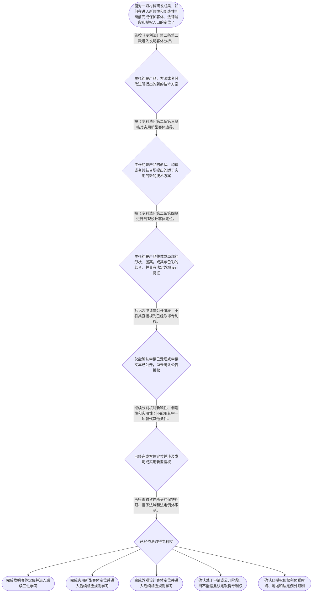

# 整合后的课程完整内容与习题

## 教学模块选择清单

- 当前教学节点：`patent-law-foundation`
- 板块预算：自适应 5/6，总计 9/9

| # | 模块 (block_type) | 类型 | 触发原因 (trigger) | 对应正文段 | 归属 |
|---:|---|:--:|---|---|:--:|
| 1 | `global_framework` | 自适应 | understanding=global(0.73) | 专利制度基础在学习路径中的位置｜材料专利审查像一条有先后顺序的流水线：先把材料成果放入正确的保护客体，再区分申请、公开、审查… | [A+B融合] |
| 2 | `anchor_scenario` | 自适应 | perception=sensing(0.86) / cold_start | 从耐高温电池隔膜研发说起｜某材料研发团队开发一种耐高温电池隔膜，创新内容同时包括聚合物配方、无机填料比例、微孔结构和制… | [A+B融合] |
| 3 | `legal_anchor` | 必选 | mandatory | 专利客体、三性与审查制度的法条锚定｜《中华人民共和国专利法》第二条 | [A+B融合] |
| 4 | `worked_example` | 自适应 | cognition.apply=0.28<0.4 / cognition.analyze=0.22<0.3 / cold_start | 材料隔膜方案的客体、条件与阶段判定｜甲公司研发耐高温电池隔膜，技术交底书记载聚合物配方、无机填料比例、微孔形成工艺和耐热性能改进… | [A+B融合] |
| 5 | `decision_flow` | 自适应 | input=visual(0.81) | 材料成果进入专利审查的定位流程｜面对一项材料研发成果，如何在进入新颖性和创造性判断前完成保护客体、法律阶段和授权入口的定位？ | [A+B融合] |
| 6 | `reflect_prompt` | 自适应 | processing=reflective(0.68) | 把制度框架映射到材料研发经验｜回看你熟悉的一项材料研发成果：其核心贡献更接近材料组成、制备方法、产品形状构造，还是视觉外观… | [B] |
| 7 | `assessment` | 必选 | mandatory | 本节三类测评｜复习三类专利客体中实用新型的法定定义。 | [A+B融合] |
| 8 | `knowledge_synthesis` | 必选 | mandatory | 五个基础知识点连成一张网｜专利权基本特征：独占性提供一定范围的排他保护，时间性和地域性共同限制其效力边界。 | [A+B融合] |
| 9 | `summary_card` | 自适应 | len(knowledge_sub_nodes)=3>=3 | 专利法律制度基础速查卡｜材料专利审查先定位保护客体和法律阶段，再进入新颖性、创造性等具体授权判断。 | [A+B融合] |

## 教学正文

## I——法律问题

材料领域的专利学习，不能一开始就直接比较实验数据、讨论新颖性或创造性。面对一项新型电池隔膜、合金配方、涂层结构或制备工艺，第一步应先回答三个基础问题：它在法律上属于哪一种专利保护客体？相关成果目前处于研发、申请、公开、审查还是授权阶段？即使最终取得专利权，其排他效力又受到哪些边界限制？

本节围绕唯一主节点“专利法律制度基础”建立上述底层框架，为后续学习申请程序、授权实质条件以及新颖性、创造性判断准备入口，但不提前展开后续节点的具体判定方法。

## R——适用规则

### 1. 专利权的三个基本特征

专利权通常概括为独占性、时间性和地域性。

**独占性**是指在法律规定范围内，专利权人可以排除他人未经许可实施其专利；但独占性并不是绝对禁止一切行为，法定例外可能限制排他效力。〔RAG: 专利法律知识详细解读.txt — 专利权具有排他性；除专利法另有规定外，未经专利权人许可不得实施其专利〕

**时间性**是指专利权并非永久存在，保护期限届满后，相关技术进入公有领域。〔RAG: 专利法律知识详细解读.txt — 专利权具有时间性；超过法律规定的保护期限即进入公有领域〕

**地域性**是指专利权原则上以授予该权利的国家或地区为效力范围。中国取得的专利权不能仅凭授权事实自动扩展为全球范围的权利。

因此，“专利权具有独占性”不能被改写成“永久、全球且没有例外的绝对垄断”。正确表述应是：专利权在授权范围内提供排他保护，同时受法定期限、地域范围和法律规定的例外限制。

### 2. 中国专利制度的规范体系

中国专利制度可以按规范层次理解：

第一层是《中华人民共和国专利法》，主要确立专利保护客体、授权条件、申请程序和权利边界等基本制度。第二层是《中华人民共和国专利法实施细则》，对申请文件、程序操作以及相关实施事项作进一步细化。例如，实施细则第二十条规定了说明书应包括的主要内容。第三层是《专利审查指南》，用于解释审查机关在不同审查事项中的具体判断口径。

这三者不是相互替代的关系：遇到基础法律问题，应先找专利法；遇到程序和文件的具体实施问题，再结合实施细则；遇到审查判断方法和审查口径问题，还要核对审查指南。引用审查指南时，应以具体条文和检索依据为准，不能把概括性学习材料当作无条件适用的法条。

### 3. 三种专利保护客体

《专利法》第二条首先规定，发明创造包括发明、实用新型和外观设计。〔RAG: 中华人民共和国专利法.txt — 第二条：本法所称的发明创造是指发明、实用新型和外观设计〕

- **发明**：对产品、方法或者其改进所提出的新的技术方案。〔RAG: 中华人民共和国专利法.txt — 第二条：发明，是指对产品、方法或者其改进所提出的新的技术方案〕
- **实用新型**：对产品的形状、构造或者其结合所提出的适于实用的新的技术方案。〔RAG: 中华人民共和国专利法.txt — 第二条：实用新型，是指对产品的形状、构造或者其结合所提出的适于实用的新的技术方案〕
- **外观设计**：对产品整体或者局部的形状、图案或者其结合，以及色彩与形状、图案的结合所作出的富有美感并适于工业应用的新设计。〔RAG: 中华人民共和国专利法.txt — 第二条：外观设计针对产品整体或者局部的形状、图案或者其结合以及色彩与形状、图案的结合〕

在材料领域，材料组成、合金配方、化学制备方法、涂层工艺或性能改进，通常应先从“产品、方法或者其改进的技术方案”角度进行发明客体定位。不能因为成果最终表现为一个产品，就当然归入实用新型；实用新型的法定范围强调产品的形状、构造或者其结合。若主张的是产品外部的视觉表达，则应从外观设计客体角度分析。

客体定位只是“能否进入哪一类专利规则”的入口，不等于已经满足授权条件。根据《专利法》第二十二条，发明和实用新型还应当具备新颖性、创造性和实用性。〔RAG: 中华人民共和国专利法.txt — 第二十二条：授予专利权的发明和实用新型，应当具备新颖性、创造性和实用性〕 能够制造或者使用并产生积极效果，属于实用性要求，不能替代新颖性和创造性判断。

### 4. 专利制度的作用

《专利法》第一条体现了专利制度的基本目标，包括保护专利权人的合法权益、鼓励发明创造、推动发明创造的应用、提高创新能力，以及促进科学技术进步和经济社会发展。〔RAG: 专利法律知识详细解读.txt — 第一条：保护专利权人的合法权益，鼓励发明创造，推动发明创造的应用，提高创新能力，促进科学技术进步和经济社会发展〕

可以把专利制度理解为“以一定期限和范围的保护换取技术公开”的制度安排：申请人通过公开技术方案争取法律保护，社会则能够在公开信息的基础上学习、改进和应用技术。这个制度功能有助于理解专利制度为何同时重视创新激励和技术公开，但制度功能不能代替法定客体、程序或授权条件。

### 5. 中国专利制度的发展特点与审查阶段

检索材料明确提供的制度沿革信息包括：现行专利法自1985年4月1日起施行。〔RAG: 专利法律知识详细解读.txt — 《专利法》第八十二条：本法自1985年4月1日起施行〕 对本节应掌握的制度运行特点，可概括为早期公开、延迟审查，以及初步审查制与实质审查制并存。

对于发明专利申请，材料记载其通常经历：受理后初步审查，审查合格后自申请日或者优先权日起满十八个月首次公开，申请人还需在法定期间内提出实质审查请求，经过实质审查合格后才可能公告授权。〔RAG: 专利法专题讲座.txt — 发明专利受理后先经初步审查，审查合格后自申请日或优先权日起满18个月首次公开，申请人需在申请日或优先权日起3年内提出实质审查请求，实质审查合格后才能公告授权〕

因此，**申请受理、申请公布、实质审查和授权是不同法律阶段**。申请进入程序，不代表已经获得专利权；申请文本公开，也不代表已经公告授权。实用新型和外观设计具有不同的审查安排，具体规则应在后续相应节点中继续核对。

## A——规则适用

以耐高温电池隔膜为例，研发团队同时提出聚合物配方、微孔形成工艺和产品外观设计。正确的分析顺序是：

1. 先看技术方案所针对的对象。配方和制备工艺属于产品、方法或其改进的技术方案，应先按发明客体定位；如果另有产品形状、构造及其结合的技术方案，再单独核对实用新型的客体边界；如果主张的是视觉外观，则核对外观设计客体。
2. 再看法律阶段。收到受理通知只能说明申请已进入专利程序；申请文本首次公开只能说明其内容已经向社会公开。二者均不能单独推出已经取得专利权。
3. 最后看授权和权利边界。即使方案属于可讨论的专利客体，发明或实用新型仍需继续核对新颖性、创造性和实用性；即使依法授权，权利仍受时间、地域和法定例外限制。

这也解释了为什么后续学习新颖性和创造性时，必须先把“分析对象”“申请日或其他时间节点”“法律阶段”定位清楚。基础定位错误，后续实体判断就可能从一开始就比较错对象或用错时间轴。

## C——结论

材料领域专利审查的基础主线可以压缩为：**先定客体，再辨阶段，后核条件，最后确认权利边界**。发明覆盖产品、方法及其改进的技术方案；实用新型限于产品的形状、构造或者其结合；外观设计保护产品整体或局部的视觉设计。专利权具有独占性，但同时受到时间性、地域性和法定例外限制。申请受理或文本公开不等于取得专利权；属于专利客体也不等于已经满足新颖性、创造性和实用性。

## 常见误区与区分判据

### 误区一：原话“只要是新材料，就当然应当申请实用新型。”

**正解推理**：法律分类不看“新材料”这一名称，而看权利要求所主张的技术方案内容。材料组成、配方、制备方法或性能改进，应先按发明的产品、方法或者其改进进行定位；实用新型的客体限于产品的形状、构造或者其结合。

**区分判据**：问自己“创新点主要是组成或工艺，还是产品形状、构造及其结合？”前者通常进入发明客体分析，后者才可能进入实用新型客体分析。

### 误区二：原话“申请已经公开，所以企业已经取得专利权。”

**正解推理**：公开只是申请程序中的一个阶段。发明申请还要经历相应审查，并在符合条件后公告授权；受理、公开、实质审查和授权具有不同法律意义。

**区分判据**：题干出现“受理通知”“首次公开”时，只能先确认程序状态；只有出现“依法公告授权”等事实，才可进一步讨论专利权是否产生及其边界。

### 误区三：原话“专利权的独占性就是永久、全球、没有例外的排他权。”

**正解推理**：独占性只是专利权的一项特征，必须与时间性和地域性一起理解，而且法律规定的例外可能限制排他效力。

**区分判据**：遇到“永久”“全球”“任何情况下都不得实施”等绝对化表述，应检查其是否忽略保护期限、授予法域或法定例外。

### 误区四：原话“材料技术能够制造，就已经满足全部授权条件。”

**正解推理**：能够制造或者使用并产生积极效果，属于实用性判断的一部分；发明和实用新型仍需分别核对新颖性和创造性。〔RAG: 中华人民共和国专利法.txt — 第二十二条：实用性是指该发明或者实用新型能够制造或者使用，并且能够产生积极效果〕

**区分判据**：把“属于保护客体”“具备实用性”“具备新颖性和创造性”分成三个不同问题，任何一个问题的肯定答案都不能自动替代其他问题。

本节设有测评，请到【习题】区作答。

### 专利制度基础在学习路径中的位置（global_framework）

**位置**：位于专利审查学习主线的基础入口：承接零前置知识，向下连接专利申请程序、授权实质条件、新颖性和创造性判断。

**后继**：patent-application-process（专利申请程序）；patentability-substantive（授权实质条件）；novelty（新颖性）；inventive-step（创造性）

**大局观**：材料专利审查像一条有先后顺序的流水线：先把材料成果放入正确的保护客体，再区分申请、公开、审查和授权等法律阶段，随后才核对新颖性、创造性和实用性，最后确认专利权的时间、地域及法定例外边界。本节点提供整条学习主线的底层地图。

### 从耐高温电池隔膜研发说起（anchor_scenario）

> 某材料研发团队开发一种耐高温电池隔膜，创新内容同时包括聚合物配方、无机填料比例、微孔结构和制备工艺。团队准备提交专利申请，负责人认为“只要材料能做出来就一定能授权”，另一名成员则认为“申请一公开就等于取得了专利权”，还有人担心中国专利授权后是否能在所有国家永久排他。代理人需要先解决这些冲突：技术方案属于哪类保护客体，项目处于什么法律阶段，专利权的排他效力又有哪些边界。

**锚定**：用材料研发中的配方、结构、工艺和公开计划，锚定三类保护客体、专利权三种特征、授权条件与审查阶段的区分。

**先想一想**：如果你是代理人，面对“新材料、能制造、已公开”这三个说法，你会先核对技术对象、授权条件，还是法律阶段？

### 专利客体、三性与审查制度的法条锚定（legal_anchor）

- **《中华人民共和国专利法》第二条**：第二条把发明创造分为发明、实用新型和外观设计：发明看产品、方法或改进的技术方案，实用新型看产品形状、构造或其结合，外观设计看产品整体或局部的视觉设计。
- **《中华人民共和国专利法》第三条**：第三条说明国务院专利行政部门负责全国专利工作，统一受理、审查申请并依法授予专利权。
- **《中华人民共和国专利法》第二十二条**：第二十二条是发明和实用新型的授权三性入口：新颖性、创造性和实用性必须分别核对；能制造或使用并产生积极效果只是实用性要求。
- **《中华人民共和国专利法》第一条**：第一条说明专利制度通过保护合法权益、鼓励创造、推动应用和促进科技进步与经济社会发展发挥作用。
- **《中华人民共和国专利法》第三十九条、第四十条**：发明申请采用早期公开、延迟审查的实质审查路径；受理、公开、实质审查和授权不是同一阶段。

**为何重要**：第二条决定材料方案应进入哪类专利规则，第二十二条把后续新颖性和创造性学习连接起来，第一条解释制度目标，第三条及第三十九条、第四十条帮助区分审查主体和程序阶段。

### 材料隔膜方案的客体、条件与阶段判定（worked_example）

**案情/例题**：甲公司研发耐高温电池隔膜，技术交底书记载聚合物配方、无机填料比例、微孔形成工艺和耐热性能改进。甲公司提交发明专利申请并收到受理通知，申请文本随后首次公开，但尚未完成实质审查。甲公司据此主张：该成果已经取得不受期限和地域限制的完整专利独占权。请按照专利制度基础的顺序分析这一主张。
**适用规则**：《专利法》第二条关于发明、实用新型和外观设计的定义；《专利法》第二十二条关于发明和实用新型的新颖性、创造性和实用性；《专利法》第三十九条及专利法专题讲座关于发明申请早期公开、延迟审查的实质审查制度；检索材料关于专利权独占性、时间性和地域性的说明。
**分步推演**：
1. 先观察技术事实。聚合物配方、填料比例、制备工艺和性能改进都在描述产品、方法或者其改进形成的技术方案，并非仅描述产品视觉外观。 → *材料配方和制备方法应首先进入发明客体定位。*
2. 再核对客体边界。实用新型限于产品的形状、构造或者其结合，不能因为成果最终形成一个材料产品，就把配方和工艺当然归为实用新型。 → *成果名称和产品形态不能替代客体分类标准。*
3. 再区分程序阶段。受理通知说明申请进入程序；首次公开说明申请文本向社会公开；发明申请仍需依法提出实质审查请求并经审查，公开本身不等于公告授权。 → *受理和公开不等于取得专利权。*
4. 即使后续依法授权，专利权也只在授予法域和保护期限内提供排他保护，并受专利法规定的例外限制。 → *不能主张永久、全球且绝对的独占权。*
5. 最后区分客体与授权条件。属于发明客体只解决能否进入发明规则的入口问题，发明仍需分别核对新颖性、创造性和实用性。 → *客体合格、能够制造或已经公开，都不能单独推出最终授权。*
**结论**：甲公司的技术方案可先按发明的产品、方法或者其改进进行客体定位；但受理和首次公开不等于已经公告授权，且即使依法授权，专利权也受时间、地域及法定例外限制。后续仍需分别审查新颖性、创造性和实用性。
**本题要点**：材料专利基础判断应固定执行“先定客体，再辨阶段，后核条件，最后看权利边界”。

### 材料成果进入专利审查的定位流程（decision_flow）

**决策问题**：面对一项材料研发成果，如何在进入新颖性和创造性判断前完成保护客体、法律阶段和授权入口的定位？



### 把制度框架映射到材料研发经验（reflect_prompt）

**反思问题**：回看你熟悉的一项材料研发成果：其核心贡献更接近材料组成、制备方法、产品形状构造，还是视觉外观？如果项目已经提交申请或公开，你还需要如何判断它与最终取得专利权之间的距离？

**关注要点**：项目名称或商业名称不能替代对技术方案对象的识别。；材料组成、配方、工艺和性能改进与产品形状构造属于不同的客体判断线索。；申请受理、首次公开、实质审查和公告授权具有不同法律意义。；能够制造或者使用并产生积极效果只是实用性相关要求，不能替代新颖性和创造性。；专利权的排他效力同时受时间性、地域性和法定例外限制。

**连接**：连接到学习者已有的材料研发经验，并为下一节点patent-application-process及后续novelty、inventive-step节点建立对象和阶段识别基础。

### 五个基础知识点连成一张网（knowledge_synthesis）

**知识框架**：
- 专利权基本特征：独占性提供一定范围的排他保护，时间性和地域性共同限制其效力边界。
- 中国专利制度体系：专利法确立基本规则，实施细则细化程序与文件要求，专利审查指南提供审查适用口径。
- 三类保护客体：发明保护产品、方法及其改进的新的技术方案；实用新型保护产品形状、构造或其结合；外观设计保护产品整体或局部的视觉设计。
- 专利制度作用：通过保护专利权人合法权益、鼓励发明创造、推动技术应用和公开技术方案，促进科技进步与经济社会发展。
- 制度运行特点：检索材料明确体现早期公开、延迟审查，以及初步审查制与实质审查制并存；发明申请的受理、公开、实质审查和授权应分阶段理解。
**概念关系**：先确定保护客体，才能选择后续适用的专利规则和正确的审查对象。；先区分申请、公开、实质审查和授权阶段，才能判断是否已经产生专利权。；确认客体后，发明和实用新型还要分别进入新颖性、创造性和实用性判断。；专利制度的功能解释保护与公开为何并存，但不能替代法定客体、程序和授权条件。
**必记**：材料配方、制备方法和性能改进应先按发明的产品、方法或者其改进的技术方案定位，不能仅因成果是产品就当然归入实用新型。；专利权具有独占性、时间性和地域性，独占性不是永久、全球且无例外的绝对排他。；申请受理或申请文本公开不等于已经取得专利权。；发明和实用新型还需分别核对新颖性、创造性和实用性；能够制造或者使用并产生积极效果不能替代其他条件。；本节只使用检索材料能够直接支持的制度历史信息，不对未提供直接依据的历史细节作扩展断言。

### 专利法律制度基础速查卡（summary_card）

**要点卡**：
- **专利权三种特征**：独占性提供排他保护，但同时受时间性、地域性和法定例外限制。
- **中国专利制度体系**：专利法定基本制度，实施细则细化实施规则，审查指南辅助理解审查口径。
- **三类保护客体**：发明看产品、方法或改进的技术方案；实用新型看产品形状构造；外观设计看产品视觉设计。
- **授权条件入口**：发明和实用新型需要分别核对新颖性、创造性和实用性，客体合格不等于已经授权。
- **发明审查阶段**：受理、初步审查、公开、实质审查和授权相互区分，公开不等于授权。
- **制度作用与发展特点**：专利制度以一定期限和范围的保护促进技术公开、创新激励和技术应用。
**必背**：《专利法》第二条规定发明、实用新型和外观设计的基本定义。；《专利法》第二十二条规定发明和实用新型应具备新颖性、创造性和实用性。；专利权具有独占性、时间性和地域性。；发明申请的受理、公开、实质审查和授权不是同一法律阶段。；先定客体，再辨阶段，后核条件，最后确认权利边界。
**一句话总结**：材料专利审查先定位保护客体和法律阶段，再进入新颖性、创造性等具体授权判断。

### 本节三类测评（assessment）

**三类覆盖**：backward_review、forward_probe、weakness_probe
**题目**：
- q-foundation-review-01：复习三类专利客体中实用新型的法定定义。
- q-application-forward-01：探测下一节点中发明或者实用新型申请文件的构成。
- q-foundation-weakness-01：辨析材料方案的发明客体定位、申请公开阶段与专利授权状态。


## 结构化数据

## expert

```json
"A+B融合"
```

## style

```json
"fused"
```

## knowledge_points

```json
[
  {
    "node_id": "patent-law-foundation",
    "kc_name": "专利制度的基本概念与特征：独占性、时间性、地域性"
  },
  {
    "node_id": "patent-law-foundation",
    "kc_name": "中国专利制度体系：专利法、专利法实施细则、专利审查指南"
  },
  {
    "node_id": "patent-law-foundation",
    "kc_name": "专利保护的三种客体：发明、实用新型、外观设计（《专利法》第二条）"
  },
  {
    "node_id": "patent-law-foundation",
    "kc_name": "专利制度的作用：激励发明创造、促进技术公开、推动技术应用和经济发展"
  },
  {
    "node_id": "patent-law-foundation",
    "kc_name": "中国专利制度发展历程与特点：早期公开、延迟审查、初步审查制与实质审查制并存"
  }
]
```

## legal_basis

```json
[
  {
    "article": "《中华人民共和国专利法》第二条",
    "source": "中华人民共和国专利法.txt：第二条规定发明创造包括发明、实用新型和外观设计，并分别规定三类客体的定义"
  },
  {
    "article": "《中华人民共和国专利法》第三条",
    "source": "中华人民共和国专利法.txt：第三条规定国务院专利行政部门负责管理全国专利工作，统一受理和审查专利申请，依法授予专利权"
  },
  {
    "article": "《中华人民共和国专利法》第一条",
    "source": "专利法律知识详细解读.txt：第一条关于保护专利权人合法权益、鼓励发明创造、推动应用和促进科技进步、经济社会发展的立法宗旨"
  },
  {
    "article": "《中华人民共和国专利法》第二十二条",
    "source": "中华人民共和国专利法.txt：第二十二条规定发明和实用新型应具备新颖性、创造性和实用性，并规定现有技术和三性的基本含义"
  },
  {
    "article": "《中华人民共和国专利法》第三十九条、第四十条",
    "source": "专利法专题讲座.txt：发明专利实行早期公开、延迟审查的实质审查制；实用新型和外观设计适用相应审查路径"
  },
  {
    "article": "《中华人民共和国专利法》第八十二条",
    "source": "专利法律知识详细解读.txt：第八十二条记载专利法自1985年4月1日起施行"
  }
]
```

## risks

```json
[
  {
    "risk": "把材料组成、化学配方或制备方法当然归入实用新型，忽略《专利法》第二条对实用新型客体的形状、构造限制。",
    "related_node_id": "patent-law-foundation"
  },
  {
    "risk": "把申请受理、申请公布、实质审查和公告授权混同为同一法律阶段。",
    "related_node_id": "patent-law-foundation"
  },
  {
    "risk": "把独占性理解为永久、全球且没有例外的绝对排他权，忽略时间性、地域性和法定例外。",
    "related_node_id": "patent-law-foundation"
  },
  {
    "risk": "把能够制造或者使用并产生积极效果的实用性要求，误认为可以替代新颖性和创造性。",
    "related_node_id": "patent-law-foundation"
  },
  {
    "risk": "检索上下文未提供更完整的专利制度历史沿革材料时，不编造年份、改革阶段或未经核验的程序细节。",
    "related_node_id": "patent-law-foundation"
  }
]
```

## draft_stage

```json
"integration"
```

## irac

```json
{
  "issue": "材料领域技术成果进入中国专利制度时，如何确定其保护客体、理解专利权边界并区分申请审查阶段，从而为后续新颖性和创造性判断建立正确前提？",
  "rule": "《专利法》第二条规定发明、实用新型和外观设计的法定定义；第三条规定国务院专利行政部门统一受理和审查专利申请并依法授予专利权；第二十二条规定发明和实用新型应具备新颖性、创造性和实用性。检索材料还表明，专利权具有独占性、时间性和地域性，发明申请采用早期公开、延迟审查的实质审查路径。",
  "application": "对材料配方、制备方法和性能改进，应先按发明的产品、方法或者其改进的技术方案定位；仅涉及产品形状、构造或者其结合时，才进入实用新型客体判断；涉及产品视觉外观时，核对外观设计客体。随后区分受理、公开、实质审查和授权阶段，并将客体判断、实用性判断、新颖性判断和创造性判断分别处理。",
  "conclusion": "材料领域专利审查应遵循“先定客体，再辨阶段，后核条件，最后确认权利边界”的基础顺序。完成该定位后，才能准确进入后续新颖性和创造性判断。"
}
```

## interactive_questions

```json
[
  {
    "qid": "q-foundation-review-01",
    "category": "remember",
    "difficulty": "L1",
    "source_tag": "backward_review",
    "kc_node_id": "patent-law-foundation",
    "question": "根据《专利法》第二条，以下哪一项最符合实用新型的法定客体？",
    "answer": "B",
    "options": [
      "A. 一种用于制备涂层的化学反应方法",
      "B. 一种对产品形状、构造及其结合提出的适于实用的新技术方案",
      "C. 一种产品整体视觉外观的美感设计",
      "D. 一种未体现任何技术方案的科学发现"
    ]
  },
  {
    "qid": "q-application-forward-01",
    "category": "remember",
    "difficulty": "L1",
    "source_tag": "forward_probe",
    "kc_node_id": "patent-application-process",
    "question": "关于发明或者实用新型专利申请文件，下列哪一项属于申请文件构成内容的正确表述？",
    "answer": "A",
    "options": [
      "A. 可以包括请求书、说明书及其摘要、权利要求书等文件",
      "B. 只能提交权利要求书，不需要说明书",
      "C. 只能提交产品实物，不能提交书面文件",
      "D. 申请文件只包括授权决定书"
    ]
  },
  {
    "qid": "q-foundation-weakness-01",
    "category": "analyze",
    "difficulty": "L3",
    "source_tag": "weakness_probe",
    "kc_node_id": "patent-law-foundation",
    "question": "某企业就一种新型电池隔膜的材料配方和制备方法提出发明专利申请。申请经受理并首次公开，但尚未完成实质审查。下列判断正确的是？",
    "answer": "C",
    "options": [
      "A. 因已公开，企业当然已经取得完整且无地域限制的专利权",
      "B. 因涉及材料，方案当然只能作为实用新型申请",
      "C. 材料配方和制备方法可先按发明的技术方案定位，但受理、公开不等于已公告授权",
      "D. 只要具有产业价值，即无须再经过后续审查即可取得专利权"
    ]
  }
]
```

## knowledge_synthesis

```json
{
  "node": "patent-law-foundation",
  "coverage": [
    {
      "node_id": "patent-law-foundation"
    },
    {
      "node_id": "patent-rights-nature"
    },
    {
      "node_id": "patent-law-framework"
    },
    {
      "node_id": "patent-system-overview"
    }
  ],
  "confusable_pairs": [
    {
      "pair": "“属于发明客体”与“已经满足授权条件”：前者只是保护客体入口，后者还必须继续核对新颖性、创造性和实用性。"
    },
    {
      "pair": "“发明”与“实用新型”：发明覆盖产品、方法及其改进的技术方案；实用新型限于产品的形状、构造或者其结合。"
    },
    {
      "pair": "“申请受理或首次公开”与“公告授权取得专利权”：前者属于申请程序阶段，后者才涉及依法授予专利权。"
    },
    {
      "pair": "“专利权独占性”与“绝对排他”：独占性同时受保护期限、授予法域和专利法规定的例外限制。"
    },
    {
      "pair": "“能够制造或者使用”与“已经可授权”：实用性只是三性之一，不能替代新颖性和创造性。"
    }
  ]
}
```
