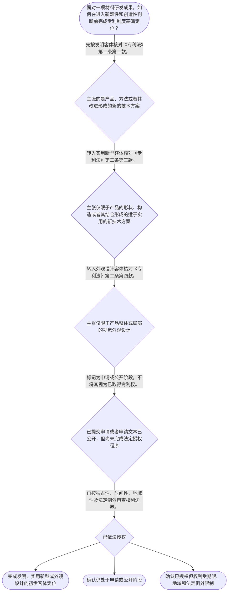

# 专家 A 教学草稿

> 专家：expert_a ｜ 风格：conservative

## 教学模块选择清单

- 当前教学节点：`patent-law-foundation`
- 板块预算：自适应 6/6，总计 9/9

| # | 模块 (block_type) | 类型 | 触发原因 (trigger) | 对应正文段 | 归属 |
|---:|---|:--:|---|---|:--:|
| 1 | `global_framework` | 自适应 | understanding=global(0.73) | 专利制度基础在学习路径中的位置｜材料研发成果要进入专利审查，不能一开始只问“新不新、有没有创造性”。审查分析先要识别该成果是… | [A] |
| 2 | `anchor_scenario` | 自适应 | perception=sensing(0.86) / cold_start | 耐高温隔膜技术的制度定位｜某材料研发团队开发出一种耐高温电池隔膜：其创新包括聚合物配方、微孔结构设计和制备工艺。团队计… | [A] |
| 3 | `legal_anchor` | 必选 | mandatory | 专利客体与审查制度的法源锚定｜《中华人民共和国专利法》第二条第二款、第三款、第四款 | [A] |
| 4 | `worked_example` | 自适应 | cognition.apply=0.28<0.4 / cognition.analyze=0.22<0.3 / cold_start | 材料隔膜方案的客体与阶段判定示范｜甲公司研发耐高温电池隔膜，技术交底书记载聚合物配方、微孔形成工艺和隔膜耐热性能。甲公司提交发… | [A] |
| 5 | `decision_flow` | 自适应 | input=visual(0.81) | 材料成果进入专利制度的定位流程｜面对一项材料研发成果，如何在进入新颖性和创造性判断前完成专利制度基础定位？ | [A] |
| 6 | `reflect_prompt` | 自适应 | processing=reflective(0.68) | 反思材料成果的权利边界｜回看已有材料研发项目时，哪些技术特征属于技术方案本身，哪些只是产品视觉外观；项目目前又处于研… | [A] |
| 7 | `assessment` | 必选 | mandatory | 本节三类测评｜复习三类专利客体中实用新型的法定定义。 | [A] |
| 8 | `knowledge_synthesis` | 必选 | mandatory | 专利法律制度基础的结构化综合｜专利权特征：独占性、时间性和地域性共同限定权利效力边界。 | [A] |
| 9 | `summary_card` | 自适应 | len(knowledge_sub_nodes)=3>=3 | 专利法律制度基础速查卡｜材料专利审查先定客体和阶段，再进入新颖性与创造性的实体判断。 | [A] |

## 教学正文

## I — 法律问题

材料研发形成一项技术成果后，首先需要判断其在中国专利制度中的法律位置：专利权具有什么边界；中国制度由哪些规范构成；材料成果应当落入发明、实用新型还是外观设计；以及不同专利类型为何对应不同审查路径。本节只建立制度基础，不提前判断具体材料方案的新颖性或创造性。

## R — 适用规则

### 1. 专利权的基本特征

专利权具有独占性、时间性和地域性。独占性并非无限制排他：检索材料明确指出，除专利法另有规定外，未经专利权人许可而以生产经营目的实施专利，原则上属于侵权；同时，法定例外可能限制该排他效力。时间性意味着保护期限届满后，相关技术进入公有领域。地域性意味着专利权的效力以授予该权利的国家或地区为边界。〔RAG: 专利法律知识详细解读.txt — 专利权具有排他性、时间性和地域性；期限届满后进入公有领域〕

### 2. 中国专利制度的规范层次

处理专利问题时，应按规范层次定位依据：先以《专利法》确定基本制度和授权客体，再以《专利法实施细则》处理实施层面的具体规则，并参照《专利审查指南》理解审查中的适用口径。本节不对细则和指南中未由检索上下文提供原文的具体条款作进一步断言。

### 3. 三类保护客体

《专利法》第二条第二款规定，发明是对产品、方法或者其改进所提出的新的技术方案；第三款规定，实用新型是对产品的形状、构造或者其结合所提出的适于实用的新的技术方案；第四款规定，外观设计是对产品整体或者局部的形状、图案或者其结合，以及色彩与形状、图案的结合所作出的富有美感并适于工业应用的新设计。〔RAG: 专利法律知识详细解读.txt — 《专利法》第二条第二款、第三款、第四款的定义〕

材料领域中，新的合金成分、涂层配方、制备工艺或性能改进，通常应先从“产品、方法或者其改进的技术方案”角度审视；仅涉及产品形状、构造或者其结合的技术方案，才进入实用新型的客体范围；仅主张产品视觉外观的设计，则进入外观设计范围。客体分类是后续新颖性、创造性等实体判断的前置定位，而不是实体判断本身。

### 4. 制度功能与审查制度概貌

专利法的立法宗旨包括保护专利权人的合法权益、鼓励发明创造、推动发明创造的应用、提高创新能力，并促进科学技术进步和经济社会发展。〔RAG: 专利法律知识详细解读.txt — 现行《专利法》第一条的立法宗旨〕 制度以公开换取法定期间内的排他保护，从而同时服务技术公开与创新激励。

检索材料记载，发明专利申请采取早期公开、延迟审查的实质审查制：发明申请受理后先经初步审查，审查合格后自申请日或优先权日起满十八个月首次公开；提出实质审查请求并经审查合格后，方可公告授权。〔RAG: 专利法专题讲座.txt — 发明专利实行早期公开、延迟审查的实质审查制〕 该制度说明“提交申请”“公开”“实质审查”“授权”是不同阶段，不能将它们混为同一法律状态。实用新型和外观设计的具体审查范围及程序细节将在后续节点按检索依据学习。

## A — 规则适用

面对一项耐高温电池隔膜技术，应依次完成以下定位。第一，识别主张的对象：若主张的是隔膜材料配方、微孔结构与性能之间的技术方案，重点检视其是否属于发明定义中的产品或改进；若仅主张产品形状、构造或者其结合，才考虑实用新型的法定边界；若主张的是产品可视外观，则转向外观设计。

第二，区分权利边界与申请阶段。即使技术方案可能属于专利保护客体，也不能直接推出已经取得排他权；权利的独占性以依法取得并在有效保护期、有效地域内行使为前提。对发明申请，还应将初步审查、公开、实质审查和授权分开观察。〔RAG: 专利法专题讲座.txt — 发明申请先初步审查，满十八个月首次公开，实审合格后公告授权〕

第三，将制度目的作为解释背景，而非替代法定要件。材料技术的产业价值可以说明申请动机，但不能代替对保护客体和后续实体授权条件的逐项审查。

## C — 结论

材料领域专利审查的起点不是直接比较现有技术，而是先完成制度定位：确认技术成果属于何种法定保护客体，理解专利权的独占性、时间性和地域性边界，识别专利法、实施细则与审查指南的规范层次，并把发明申请中的公开、实质审查与授权区分开。完成这一基础框架后，下一阶段才可严谨进入新颖性和创造性判断。

> 常见误区 / 易混淆点
>
> 误区一：将“提出专利申请”视为“已经取得专利权”。申请、公开、审查和授权是不同法律阶段。〔RAG: 专利法专题讲座.txt — 发明申请经初步审查、首次公开、实质审查合格后公告授权〕
>
> 误区二：认为所有材料创新都可用实用新型保护。实用新型的法定客体限于产品的形状、构造或者其结合；材料配方、制备方法等应先按发明定义分析。〔RAG: 专利法律知识详细解读.txt — 实用新型是对产品形状、构造或者其结合所提出的技术方案〕
>
> 误区三：把独占性理解为绝对禁止他人实施。检索材料明确保留“专利法另有规定”的例外空间，不能脱离法定例外作绝对化表述。〔RAG: 专利法律知识详细解读.txt — 除专利法另有规定外，未经许可不得实施〕

本节设有测评，请到【习题】区作答。

### 专利制度基础在学习路径中的位置（global_framework）

**位置**：位于专利审查学习主线的起点：先确定专利权的基本边界、三类保护客体与审查制度概貌，再进入专利申请程序、授权实质条件、新颖性和创造性。

**后继**：patent-application-process（专利申请程序）；patentability-substantive（授权实质条件）；novelty（新颖性）；inventive-step（创造性）

**大局观**：材料研发成果要进入专利审查，不能一开始只问“新不新、有没有创造性”。审查分析先要识别该成果是否属于法定保护客体，再分清申请、公开、审查和授权等阶段，并理解专利权仅在法定期限和法域内具有排他效力。这个基础框架决定后续新颖性、创造性分析的对象和起点。

### 耐高温隔膜技术的制度定位（anchor_scenario）

> 某材料研发团队开发出一种耐高温电池隔膜：其创新包括聚合物配方、微孔结构设计和制备工艺。团队计划先提交专利申请，后续再向客户展示样品。负责人认为“材料有创新就一定能拿到专利”，并把提交申请、公开文本和取得专利权视为同一件事。此时需要先判断该成果在三类专利客体中的位置，并区分申请、公开、审查与授权的法律阶段。

**锚定**：该情境锚定材料技术的客体分类、专利权边界以及发明申请审查阶段三个基础概念。

**先想一想**：面对同一项材料成果，应先核对技术方案主张的对象，还是先判断其市场价值？

### 专利客体与审查制度的法源锚定（legal_anchor）

- **《中华人民共和国专利法》第二条第二款、第三款、第四款**：发明覆盖产品、方法及其改进的技术方案；实用新型限于产品形状、构造或者其结合；外观设计保护产品的视觉设计。
- **《中华人民共和国专利法》第三十九条、第四十条**：发明申请适用早期公开、延迟审查的实质审查路径；公开和授权并不是同一法律状态。

**为何重要**：材料领域成果常同时涉及配方、结构和外观，必须先依第二条准确定位。理解发明申请的审查阶段，才能避免将受理或公开误认作取得专利权。

### 材料隔膜方案的客体与阶段判定示范（worked_example）

**案情/例题**：甲公司研发耐高温电池隔膜，技术交底书记载聚合物配方、微孔形成工艺和隔膜耐热性能。甲公司提交发明专利申请后，收到受理通知；满十八个月后，该申请文本首次公开。甲公司主张其已在全国范围内取得不受期限限制的专利独占权。需要判断该主张在制度基础层面是否成立。
**适用规则**：《专利法》第二条第二款关于发明的定义；检索材料记载的专利权独占性、时间性、地域性特征，以及发明申请早期公开、延迟审查的实质审查制度。
**分步推演**：
1. 先识别技术交底书所主张的核心：聚合物配方、微孔形成工艺和性能改进，均指向产品、方法或者其改进形成的技术方案。 → *该方案应首先按发明客体进行法律定位。*
2. 再区分程序状态：受理通知仅表明申请进入程序；首次公开表明申请文本向社会公开。检索材料说明，发明申请还需经实质审查合格后才能公告授权。 → *受理和公开均不当然等于取得授权专利权。*
3. 即使依法获得专利权，其效力仍受时间性和地域性限制，且独占性以法定例外为边界。 → *不能主张全国范围内不受期限限制的绝对独占权。*
**结论**：该隔膜方案可先作为发明技术方案定位；但仅有受理和首次公开不足以证明已获得专利权，且任何依法取得的专利权均受期限、地域及法定例外限制。
**本题要点**：先做客体定位，再核对程序阶段，最后审查权利边界，是材料专利基础判断的固定顺序。

### 材料成果进入专利制度的定位流程（decision_flow）

**决策问题**：面对一项材料研发成果，如何在进入新颖性和创造性判断前完成专利制度基础定位？



### 反思材料成果的权利边界（reflect_prompt）

**反思问题**：回看已有材料研发项目时，哪些技术特征属于技术方案本身，哪些只是产品视觉外观；项目目前又处于研发、申请、公开还是授权阶段？

**关注要点**：配方、工艺和性能改进通常应先从发明技术方案角度定位。；产品形状构造与产品视觉外观对应不同法定客体。；申请受理、首次公开、实质审查和授权具有不同法律意义。；专利权的独占性并不消除时间性、地域性和法定例外。

**连接**：连接到学习者已有的材料研发经验，并为下一节点 patent-application-process 的申请文件与申请日规则建立情境基础。

### 专利法律制度基础的结构化综合（knowledge_synthesis）

**知识框架**：
- 专利权特征：独占性、时间性和地域性共同限定权利效力边界。
- 制度规范：以专利法确立基本制度，实施细则和审查指南在各自层面细化实施与审查口径。
- 保护客体：发明保护产品、方法或改进的技术方案；实用新型保护产品形状、构造或其结合；外观设计保护产品视觉设计。
- 制度功能：通过保护合法权益、鼓励创造和推动应用，服务科技进步与经济社会发展。
- 审查制度概貌：发明申请依次经历初步审查、首次公开、实质审查与授权等不同阶段。
**概念关系**：先确定保护客体，才能正确识别后续实体审查的对象。；先区分申请、公开、审查和授权阶段，才能正确判断是否已产生专利权。；制度功能解释专利法的政策目标，但不替代法定客体和程序要件。
**必记**：材料配方、制备方法和性能改进应先按发明的技术方案定义定位，不能当然归入实用新型。；申请受理或文本公开不等于取得专利权。；专利权具有独占性，但同时受时间性、地域性和法定例外限制。

### 专利法律制度基础速查卡（summary_card）

**要点卡**：
- **独占性、时间性、地域性**：专利权不是无限权利：其效力受法定例外、保护期限和法域边界限制。
- **三类保护客体**：发明看产品、方法或改进的技术方案；实用新型看产品形状构造；外观设计看产品视觉设计。
- **规范层次**：先以专利法确定基本规则，再结合实施细则和审查指南处理具体实施与审查问题。
- **发明审查阶段**：受理、公开、实质审查和授权相互区分，公开不等于授权。
- **制度功能**：专利制度以保护、公开、激励和应用的联动促进技术进步与经济发展。
**必背**：《专利法》第二条第二款至第四款分别界定发明、实用新型和外观设计。；专利权具有独占性、时间性和地域性。；发明申请的首次公开不等于已获得专利授权。
**一句话总结**：材料专利审查先定客体和阶段，再进入新颖性与创造性的实体判断。

### 本节三类测评（assessment）

**三类覆盖**：backward_review、forward_probe、weakness_probe
**题目**：
- q-foundation-review-01：复习三类专利客体中实用新型的法定定义。
- q-application-forward-01：探测下一节点中申请文件构成的基础认识。
- q-foundation-weakness-01：辨析材料发明申请的客体定位、公开阶段与授权状态。


## 结构化字段

## knowledge_points

```json
[
  {
    "node_id": "patent-law-foundation",
    "kc_name": "专利法律制度基础：权利特征、制度规范、三类保护客体、制度功能与审查制度概貌"
  }
]
```

## legal_basis

```json
[
  {
    "article": "《中华人民共和国专利法》第二条第二款、第三款、第四款",
    "source": "专利法律知识详细解读.txt：引用《专利法》第二条对发明、实用新型、外观设计的定义"
  },
  {
    "article": "《中华人民共和国专利法》第三十九条、第四十条",
    "source": "专利法专题讲座.txt：两种审查制度，发明适用早期公开、延迟审查的实质审查制"
  },
  {
    "article": "《中华人民共和国专利法》第一条",
    "source": "专利法律知识详细解读.txt：立法宗旨为保护专利权人合法权益，鼓励发明创造，推动应用，提高创新能力，促进科技进步和经济社会发展"
  }
]
```

## risks

```json
[
  {
    "risk": "不得将材料配方、化学组成或制备方法当然归入实用新型；应先按《专利法》第二条的客体定义定位。",
    "related_node_id": "patent-law-foundation"
  },
  {
    "risk": "不得将申请受理、公开、实质审查和授权混同为已取得专利权。",
    "related_node_id": "patent-law-foundation"
  },
  {
    "risk": "关于实施细则和审查指南的具体审查口径，检索上下文未提供直接原文依据时，不应编造条款或结论。",
    "related_node_id": "patent-law-foundation"
  }
]
```

## draft_stage

```json
"debate"
```

## irac

```json
{
  "issue": "材料技术成果进入中国专利制度时，如何先确定其法定保护客体、专利权边界与所处审查阶段，以为后续新颖性和创造性判断建立前提？",
  "rule": "《专利法》第二条第二款至第四款分别界定发明、实用新型和外观设计。检索材料表明专利权具有独占性、时间性和地域性；发明专利申请采用先初步审查、后首次公开、再经实质审查合格后公告授权的制度路径。",
  "application": "对材料配方、制备方法或技术性能改进，应先从发明的产品、方法或改进的技术方案定义进行定位；仅涉及产品形状、构造或者其结合时才考虑实用新型；仅涉及视觉外观时才考虑外观设计。随后应将申请、公开、实质审查与授权分开，避免以提交申请或公开替代授权状态。",
  "conclusion": "材料领域的实体审查学习应先完成客体、权利边界和程序阶段的基础定位；在此基础上，才能进入后续节点对新颖性和创造性的具体判断。"
}
```

## interactive_questions

```json
[
  {
    "qid": "q-foundation-review-01",
    "category": "remember",
    "difficulty": "L1",
    "source_tag": "backward_review",
    "kc_node_id": "patent-law-foundation",
    "question": "根据《专利法》第二条，以下哪一项最符合实用新型的法定客体？",
    "answer": "B",
    "options": [
      "A. 一种用于制备涂层的化学反应方法",
      "B. 一种对产品形状、构造及其结合提出的适于实用的新技术方案",
      "C. 一种产品整体视觉外观的美感设计",
      "D. 一种未体现任何技术方案的科学发现"
    ]
  },
  {
    "qid": "q-application-forward-01",
    "category": "remember",
    "difficulty": "L1",
    "source_tag": "forward_probe",
    "kc_node_id": "patent-application-process",
    "question": "关于发明或者实用新型专利申请文件，下列哪一项属于申请文件构成内容的正确表述？",
    "answer": "A",
    "options": [
      "A. 可以包括请求书、说明书及其摘要、权利要求书等文件",
      "B. 只能提交权利要求书，不需要说明书",
      "C. 只能提交产品实物，不能提交书面文件",
      "D. 申请文件只包括授权决定书"
    ]
  },
  {
    "qid": "q-foundation-weakness-01",
    "category": "analyze",
    "difficulty": "L3",
    "source_tag": "weakness_probe",
    "kc_node_id": "patent-law-foundation",
    "question": "某企业就一种新型电池隔膜的材料配方和制备方法提出发明专利申请。申请经受理并首次公开，但尚未完成实质审查。下列判断正确的是？",
    "answer": "C",
    "options": [
      "A. 因已公开，企业当然已经取得完整且无地域限制的专利权",
      "B. 因涉及材料，方案当然只能作为实用新型申请",
      "C. 材料配方和制备方法可先按发明的技术方案定位，但受理、公开不等于已公告授权",
      "D. 只要具有产业价值，即无须再经过后续审查即可取得专利权"
    ]
  }
]
```

## knowledge_synthesis

```json
{
  "node": "patent-law-foundation",
  "coverage": [
    {
      "node_id": "patent-law-foundation"
    }
  ],
  "confusable_pairs": [
    {
      "pair": "“提交申请或首次公开”与“公告授权取得专利权”：前者属于申请程序阶段，后者才可能产生依法授予的专利权。"
    },
    {
      "pair": "“发明”与“实用新型”：发明覆盖产品、方法及其改进的技术方案；实用新型限于产品形状、构造或者其结合。"
    },
    {
      "pair": "“专利权独占性”与“绝对排他”：独占性受时间性、地域性及专利法另有规定的法定例外限制。"
    }
  ]
}
```
