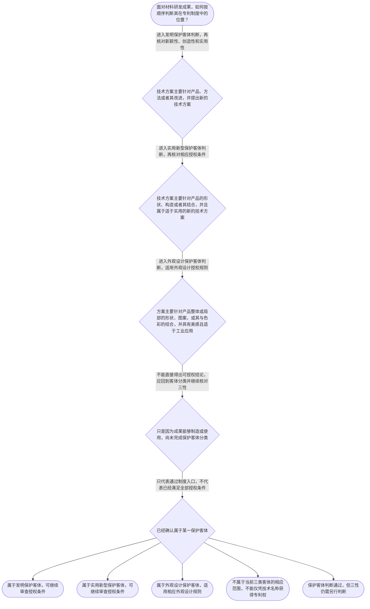

# 专家 B 教学草稿

> 专家：expert_b ｜ 风格：accessible

## 教学模块选择清单

- 当前教学节点：`patent-law-foundation`
- 板块预算：自适应 None/None，总计 9/9

| # | 模块 (block_type) | 类型 | 触发原因 (trigger) | 对应正文段 | 归属 |
|---:|---|:--:|---|---|:--:|
| 1 | `global_framework` | 自适应 | understanding=global(0.73) | 先看专利审查地图｜材料领域专利审查并不是一上来就比较实验数据，而是先把技术方案放进专利制度的整体框架：先确认保… | [B] |
| 2 | `anchor_scenario` | 自适应 | perception=sensing(0.86) / cold_start | 从一项复合材料研发说起｜某材料研发团队正在开发一种用于电池隔膜的复合材料：工程师通过调整聚合物基体、无机填料和涂层结… | [B] |
| 3 | `legal_anchor` | 必选 | mandatory | 把制度概念钉回法条｜《专利法》第二条 | [B] |
| 4 | `worked_example` | 自适应 | cognition.apply=0.28<0.4 / cognition.analyze=0.22<0.3 / cold_start | 材料方案如何进入专利审查｜某研发团队提出一种用于电池隔膜的复合材料，并同时设计了制备该材料的混合与涂覆方法。团队想知道… | [B] |
| 5 | `decision_flow` | 自适应 | input=visual(0.81) | 材料专利基础判断流程｜面对材料研发成果，如何按顺序判断其在专利制度中的位置？ | [B] |
| 6 | `reflect_prompt` | 自适应 | processing=reflective(0.68) | 把制度框架映射到研发经验｜回看你熟悉的一项材料研发成果：它的核心贡献更接近材料产品、制备方法，还是产品外观？如果把“能… | [B] |
| 7 | `assessment` | 必选 | mandatory | 三类测评入口｜复习专利法规定的三种专利保护客体 | [B] |
| 8 | `knowledge_synthesis` | 必选 | mandatory | 五个基础概念连成一张网｜专利制度基本特征：专利权可提供一定范围的排他保护，但同时受时间和地域边界约束。 | [B] |
| 9 | `summary_card` | 自适应 | len(knowledge_sub_nodes)=3>=3 | 基础节点速查卡｜先定位材料成果属于哪类保护客体，再沿专利法、实施细则和审查指南进入具体授权条件判断。 | [B] |

## 教学正文

## 1. 场景导入

想象一个材料研发团队正在开发电池隔膜复合材料：工程师通过调整聚合物基体、无机填料和涂层结构，得到耐热性更好的产品。团队准备申请专利，但有人认为“能生产出来就能授权”，也有人担心专利权是不是一旦取得就能在所有国家永久排他。要解决这些疑问，第一步不是马上做新颖性或创造性比较，而是先确认技术成果属于哪类保护客体，以及专利制度怎样划定权利边界。

## 2. 人话解释

可以把专利制度看成“用公开换保护”的制度安排：研发者把技术方案讲清楚，法律在一定条件下给予一定范围的排他保护；社会则因为技术被公开而更容易学习、改进和应用。专利权的排他性、时间性和地域性要一起理解：它可能排除他人在授权范围内实施，但不是永久有效，也不是自动覆盖全世界。

材料领域最先要做的是“对象定位”。如果核心是材料产品、制备方法或它们的改进，通常应从发明的技术方案角度分析；如果核心是产品的形状、构造或者其结合，才进入实用新型的分类视角；如果核心是产品整体或局部的形状、图案及相关色彩组合，则要考虑外观设计。名称叫“新材料”并不能替代这个分类动作。

还要把两个问题分开：一项成果是否属于可以讨论的保护客体，与它最终能否获得专利权，不是同一个问题。即使材料方案能够制造，也只触及实用性相关的一部分判断，仍需继续核对新颖性、创造性等授权条件。

## 3. 法条回扣

《专利法》第二条规定，发明是“对产品、方法或者其改进所提出的新的技术方案”；实用新型是“对产品的形状、构造或者其结合所提出的适于实用的新的技术方案”；外观设计则针对产品整体或局部的形状、图案及相关色彩组合。〔RAG: 中华人民共和国专利法.txt — 第二条：发明、实用新型和外观设计的定义〕

《专利法》第三条规定，国务院专利行政部门负责管理全国的专利工作，统一受理和审查专利申请，并依法授予专利权。〔RAG: 中华人民共和国专利法.txt — 第三条：国务院专利行政部门负责管理全国专利工作；统一受理和审查专利申请，依法授予专利权〕

《专利法》第二十二条规定，授予专利权的发明和实用新型应当具备新颖性、创造性和实用性；其中，实用性要求发明或者实用新型能够制造或者使用，并且能够产生积极效果。〔RAG: 中华人民共和国专利法.txt — 第二十二条：应当具备新颖性、创造性和实用性；能够制造或者使用，并且能够产生积极效果〕

关于本节点中的制度历史概括，当前检索上下文没有提供足以直接核验的完整历史材料。因此，本节只保留“不同客体对应不同审查规则”这一结构性认识，具体沿革和程序安排放到后续节点核验。

## 4. 类比 / 口诀

可以记成：“先认对象，再过三关；保护有界，公开有价。”

“先认对象”指先判断是发明、实用新型还是外观设计；“再过三关”主要对应发明和实用新型的新颖性、创造性、实用性；“保护有界”提醒你注意专利权的时间和地域边界；“公开有价”帮助记住专利制度以技术公开换取法律保护的基本逻辑。

这个口诀只用于安排思路，不能代替逐条适用法条。特别是“再过三关”不是说所有三类专利都完全适用同一套判断，而是提醒学习者进入相应客体的具体授权规则后继续核对条件。

## 5. 应试提示

看到材料题干，先圈出技术方案的对象：是材料组成或制备方法，是产品形状构造，还是外观表现。第二步检查题目问的是“属于哪类保护客体”，还是“是否具备授权条件”，不要把两个层次混在一起。第三步如进入发明或实用新型的授权判断，再按新颖性、创造性、实用性分别处理。

常见陷阱有三个：第一，把“新材料”这个名称直接当成发明结论；第二，把“可以制造”直接当成已经满足全部授权条件；第三，把专利权的排他性理解成无限期、无地域限制的权利。遇到这些表述，应回到对象、边界和法条三个检查点。

## 6. 互动提问

请先在【习题】区完成本节选择题，再回看你的材料研发经验，观察自己是否能够把“对象定位”和“授权条件判断”分成两个步骤。

### 先看专利审查地图（global_framework）

**位置**：位于专利法学习的基础入口，承接专利制度总览，向下连接申请程序、保护客体和授权实质条件。

**后继**：patent-application-process（专利申请程序）；patentability-substantive（专利授权实质条件）；novelty（新颖性）；inventive-step（创造性）

**大局观**：材料领域专利审查并不是一上来就比较实验数据，而是先把技术方案放进专利制度的整体框架：先确认保护对象属于哪一类专利，再理解专利权具有何种边界，随后才进入申请程序和授权条件判断。本节点是后续学习申请文件、新颖性、创造性和审查流程的总入口。

### 从一项复合材料研发说起（anchor_scenario）

> 某材料研发团队正在开发一种用于电池隔膜的复合材料：工程师通过调整聚合物基体、无机填料和涂层结构，获得了更好的耐热性。团队准备申请专利，但成员意见不一：有人认为这是“新材料”，应当申请发明专利；有人认为只要产品能生产就可以获得专利；还有人担心专利授权后是否能在所有国家、永久地排他使用。此时，代理人需要先回答三个基础问题：专利保护的对象是什么，专利权有哪些基本边界，制度为什么要求技术公开并设置审查门槛。

**锚定**：用材料研发中的“新材料方案”锚定保护客体、专利权基本特征、制度作用以及后续三性审查的入口。

**先想一想**：面对这个复合材料方案，你会先判断它属于哪一种保护客体，还是先判断它是否具有新颖性和创造性？

### 把制度概念钉回法条（legal_anchor）

- **《专利法》第二条**：专利法把发明创造分为发明、实用新型和外观设计：发明针对产品、方法或其改进提出新的技术方案；实用新型针对产品的形状、构造或其结合；外观设计针对产品整体或局部的形状、图案及相关色彩组合。
- **《专利法》第三条**：国务院专利行政部门负责管理全国专利工作，统一受理和审查专利申请，并依法授予专利权。
- **《专利法》第二十二条**：发明和实用新型获得专利权通常要同时具备新颖性、创造性和实用性；其中，新颖性关注是否属于现有技术，创造性关注相对于现有技术是否显而易见，实用性关注能否制造或使用并产生积极效果。

**为何重要**：第二条决定材料技术方案首先应当放入哪一种专利客体，第三条帮助理解谁负责受理、审查和授权，第二十二条则把后续新颖性、创造性和实用性学习串成一条主线。

### 材料方案如何进入专利审查（worked_example）

**案情/例题**：某研发团队提出一种用于电池隔膜的复合材料，并同时设计了制备该材料的混合与涂覆方法。团队想知道：这项成果在专利制度中首先应如何定位，是否仅凭“能够生产”就可以获得专利权？
**适用规则**：《专利法》第二条、第三条和第二十二条；其中第二条区分三种保护客体，第二十二条规定发明和实用新型的授权实质条件。
**分步推演**：
1. 先观察技术方案的对象。案情同时涉及一种材料产品和制造该材料的方法，二者都属于对产品或方法提出的技术方案，而不是仅描述产品外观。 → *先定位保护客体：产品方案和方法方案可进入发明客体判断。*
2. 再将案情与第二条的分类标准对照。发明覆盖产品、方法或者其改进提出的新的技术方案；实用新型则限定在产品的形状、构造或者其结合。材料组成及制备方法不应仅因“是一个产品”就自动归入实用新型。 → *分类要看技术方案内容，不能只看成果名称。*
3. 最后区分“能申请讨论”与“能获得授权”。第二十二条要求发明和实用新型具备新颖性、创造性和实用性；因此能够制造只是实用性相关的一部分判断，不能替代其他条件。 → *保护客体合格不等于三性已经合格。*
**结论**：该复合材料及其制备方法原则上属于可以讨论的发明专利保护客体；但“属于发明”只解决保护对象入口问题，不能直接推出能够授权，仍需分别核对新颖性、创造性和实用性。
**本题要点**：材料案件先做“对象定位”，再做“三性审查”；不要把可制造性直接等同于可授权性。

### 材料专利基础判断流程（decision_flow）

**决策问题**：面对材料研发成果，如何按顺序判断其在专利制度中的位置？



### 把制度框架映射到研发经验（reflect_prompt）

**反思问题**：回看你熟悉的一项材料研发成果：它的核心贡献更接近材料产品、制备方法，还是产品外观？如果把“能做出来”与“能获得专利权”分开，你会分别检查什么？

**关注要点**：技术方案的保护对象，而不是项目名称或宣传名称；产品、方法、形状构造和外观设计之间的边界；可制造或可使用只是实用性相关判断，不能代替新颖性和创造性；判断结论必须能回到相应法条文字

**连接**：连接到学习者已有的材料研发经验，以及“产品性能改进”和“制备工艺改进”的技术方案区分。

### 五个基础概念连成一张网（knowledge_synthesis）

**知识框架**：
- 专利制度基本特征：专利权可提供一定范围的排他保护，但同时受时间和地域边界约束。
- 中国专利制度体系：专利法提供基本规则，专利法实施细则细化程序和文件要求，专利审查指南帮助理解审查判断。
- 三种保护客体：发明是产品、方法或其改进的新的技术方案；实用新型针对产品形状、构造或其结合；外观设计针对产品整体或局部的形状、图案及相关色彩组合。
- 专利制度作用：通过授予一定保护换取技术公开，促进发明创造、技术应用和经济发展。
- 审查制度特点：专利申请需要经过受理和审查，发明、实用新型和外观设计因客体与授权规则不同而适用相应审查路径；具体历史沿革和程序细节需结合后续专门节点学习。
**概念关系**：先用专利法确定保护客体，再用实施细则和审查指南理解申请与审查操作。；保护客体是制度入口；确认客体后，发明和实用新型还要进入新颖性、创造性和实用性判断。；专利权的独占性、时间性和地域性共同限定权利边界，制度作用则解释了为什么保护与公开需要同时存在。
**必记**：发明、实用新型和外观设计是专利法规定的三类发明创造。；材料产品或制备方法属于发明客体的讨论范围，不等于已经满足授权条件。；发明和实用新型的授权条件包括新颖性、创造性和实用性，三者不能互相替代。；本节涉及的制度历史细节，检索上下文未提供完整直接法源，应在后续节点中进一步核验。

### 基础节点速查卡（summary_card）

**要点卡**：
- **专利权基本特征**：排他保护不是永久或全球有效，而是受时间和地域等边界限制。
- **制度体系**：专利法定基本规则，实施细则细化程序，审查指南辅助理解审查。
- **三类保护客体**：发明看产品、方法或改进；实用新型看产品形状构造；外观设计看产品外观表达。
- **专利制度作用**：以一定期限和范围的保护换取技术公开，促进创新和应用。
- **授权三性**：发明和实用新型要分别通过新颖性、创造性和实用性判断。
**必背**：《专利法》第二条规定发明、实用新型和外观设计的基本定义。；《专利法》第二十二条规定发明和实用新型应具备新颖性、创造性和实用性。；确认保护客体不等于确认可以授权。；专利制度的基本边界可概括为独占性、时间性和地域性。
**一句话总结**：先定位材料成果属于哪类保护客体，再沿专利法、实施细则和审查指南进入具体授权条件判断。

### 三类测评入口（assessment）

**三类覆盖**：backward_review、forward_probe、weakness_probe
**题目**：
- q-foundation-1：复习专利法规定的三种专利保护客体
- q-process-1：探测发明专利申请所需的基本申请文件
- q-foundation-2：辨析保护客体、实用性与完整授权条件之间的关系


## 结构化字段

## knowledge_points

```json
[
  {
    "node_id": "patent-law-foundation",
    "kc_name": "专利制度的基本概念与特征：独占性、时间性、地域性"
  },
  {
    "node_id": "patent-law-foundation",
    "kc_name": "中国专利制度体系：专利法、专利法实施细则、专利审查指南"
  },
  {
    "node_id": "patent-law-foundation",
    "kc_name": "专利保护的三种客体：发明、实用新型、外观设计"
  },
  {
    "node_id": "patent-law-foundation",
    "kc_name": "专利制度的作用：激励发明创造、促进技术公开、推动技术应用和经济发展"
  },
  {
    "node_id": "patent-law-foundation",
    "kc_name": "中国专利制度发展历程与特点：早期公开延迟审查、初步审查制与实质审查制并存"
  }
]
```

## legal_basis

```json
[
  {
    "article": "《专利法》第二条：发明、实用新型和外观设计的定义",
    "source": "中华人民共和国专利法.txt：第二条"
  },
  {
    "article": "《专利法》第三条：国务院专利行政部门负责管理全国专利工作，统一受理和审查专利申请",
    "source": "中华人民共和国专利法.txt：第三条"
  },
  {
    "article": "《专利法》第二十二条：发明和实用新型应具备新颖性、创造性和实用性",
    "source": "中华人民共和国专利法.txt：第二十二条"
  }
]
```

## risks

```json
[
  {
    "risk": "把专利权的独占性误解为永久、全球范围的绝对垄断，忽略时间和地域边界。",
    "related_node_id": "patent-rights-nature"
  },
  {
    "risk": "把材料产品的技术名称、商业名称或研发成果名称直接等同于专利保护客体。",
    "related_node_id": "patent-law-foundation"
  },
  {
    "risk": "把“能够制造或者使用并产生积极效果”的实用性要求误认为只要能生产就必然获得授权。",
    "related_node_id": "patent-law-foundation"
  },
  {
    "risk": "当前检索上下文未提供中国专利制度历史沿革的完整直接法源，不能把知识清单中的历史概括扩写成未经核验的具体年份或程序细节。",
    "related_node_id": "patent-system-overview"
  }
]
```

## draft_stage

```json
"debate"
```

## interactive_questions

```json
[
  {
    "qid": "q-foundation-1",
    "category": "remember",
    "difficulty": "L1",
    "source_tag": "backward_review",
    "kc_node_id": "patent-law-foundation",
    "question": "根据《专利法》第二条，下列哪一组属于专利法所称的三种发明创造？",
    "answer": "B",
    "options": [
      "A. 发明、实用新型和商业秘密",
      "B. 发明、实用新型和外观设计",
      "C. 发明、集成电路布图设计和商业秘密",
      "D. 实用新型、植物新品种和外观设计"
    ]
  },
  {
    "qid": "q-process-1",
    "category": "remember",
    "difficulty": "L1",
    "source_tag": "forward_probe",
    "kc_node_id": "patent-application-process",
    "question": "根据《专利法》第二十六条，申请发明或者实用新型专利通常应提交下列哪类文件？",
    "answer": "A",
    "options": [
      "A. 请求书、说明书及其摘要、权利要求书等文件",
      "B. 只有产品销售合同和财务报表",
      "C. 只有实验室原始记录，不需要申请文件",
      "D. 只有外观照片，不需要说明技术方案"
    ]
  },
  {
    "qid": "q-foundation-2",
    "category": "analyze",
    "difficulty": "L3",
    "source_tag": "weakness_probe",
    "kc_node_id": "patent-law-foundation",
    "question": "关于材料产品、制备方法与专利授权条件的关系，下列说法最准确的是？",
    "answer": "C",
    "options": [
      "A. 只要材料能够制造，就当然获得发明专利权",
      "B. 只要属于发明客体，就不需要再判断新颖性和创造性",
      "C. 材料产品或制备方法可以进入发明客体判断，但仍需继续核对新颖性、创造性和实用性",
      "D. 只要技术方案具有实用性，就不必判断其是否属于专利法保护客体"
    ]
  }
]
```

## knowledge_synthesis

```json
{
  "node": "patent-law-foundation",
  "coverage": [
    {
      "node_id": "patent-rights-nature"
    },
    {
      "node_id": "patent-law-framework"
    },
    {
      "node_id": "patent-law-foundation"
    },
    {
      "node_id": "patent-system-overview"
    }
  ],
  "confusable_pairs": []
}
```
