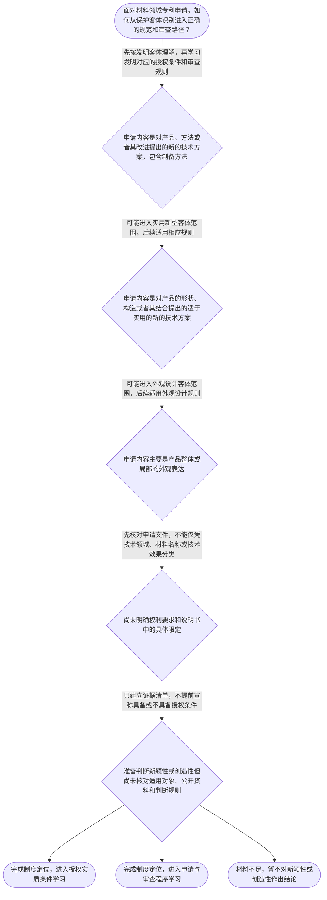

# 整合后的课程完整内容与习题

## 教学模块选择清单

- 当前教学节点：`patent-law-foundation`
- 板块预算：自适应 5/6，总计 9/9

| # | 模块 (block_type) | 类型 | 触发原因 (trigger) | 对应正文段 | 归属 |
|---:|---|:--:|---|---|:--:|
| 1 | `global_framework` | 自适应 | understanding=global(0.73) | 先看整张专利制度地图｜本节点是专利学习的总入口：先确定专利制度保护什么、由哪些规范共同运行以及不同申请类型如何进入… | [A+B融合] |
| 2 | `anchor_scenario` | 自适应 | perception=sensing(0.86) / cold_start | 一项材料成果，先过哪道制度入口？｜某材料研发团队开发耐高温复合涂层，方案同时包含材料组成、固化制备方法，以及涂覆于电池壳体后的… | [A+B融合] |
| 3 | `legal_anchor` | 必选 | mandatory | 法条与规范层级锚点｜《专利法》第一条 | [A+B融合] |
| 4 | `worked_example` | 自适应 | cognition.apply=0.34<0.4 / cognition.analyze=0.28<0.3 / cold_start | 从材料研发事实走一遍客体识别｜某公司研发用于电池壳体的耐腐蚀复合层，研发记录同时记载材料组成、制备步骤和壳体表面的颜色纹理… | [A+B融合] |
| 5 | `decision_flow` | 自适应 | input=visual(0.81) | 专利制度基础入口决策图｜面对材料领域专利申请，如何从保护客体识别进入正确的规范和审查路径？ | [A+B融合] |
| 6 | `reflect_prompt` | 自适应 | processing=reflective(0.68) | 把制度入口带回研发现场｜回想一个材料研发方案：如果成果同时涉及制备方法、产品形状构造和产品外观，你会依据哪些具体事实… | [A+B融合] |
| 7 | `assessment` | 必选 | mandatory | 复习、探测与边界辨析｜识别《专利法》第二条规定的发明保护客体。 | [A+B融合] |
| 8 | `knowledge_synthesis` | 必选 | mandatory | 五个知识点的一张制度网｜patent-rights-nature：专利权具有独占性、时间性和地域性，分别提示排他保护… | [A+B融合] |
| 9 | `summary_card` | 自适应 | len(knowledge_sub_nodes)=3>=3 | 专利法律制度基础速查卡｜先认清保护客体和规范入口；记住已核实的不同审查安排，并把技术公开机制和具体历史细节留给有直接… | [A+B融合] |

## 教学正文

## I：制度定位

材料领域的专利申请进入新颖性和创造性判断前，必须先完成制度定位：明确保护对象、规范来源和审查路径。本节只建立基础坐标，不用客体分类或程序安排替代后续的具体授权判断。

专利制度的功能不是单纯保护既有市场份额，而是以一定范围和期限的权利保护为制度工具，保护专利权人合法权益、鼓励发明创造、推动发明创造应用并促进科学技术进步和经济社会发展。〔RAG: 中华人民共和国专利法.txt — 第一条：为了保护专利权人的合法权益，鼓励发明创造，推动发明创造的应用，提高创新能力，促进科学技术进步和经济社会发展〕

学习路径还把“促进技术公开”列为制度作用的一部分。就本轮可定位材料而言，第一条没有直接规定技术公开的具体机制、条件或法律效果；因此可以把它作为理解专利制度运行功能的导航，但不能据此自行推定申请公开、保密、期限或权利交换的具体规则。有关技术公开的具体制度安排，应在取得直接规范或审查材料后再核验。

专利权的基本特征可作为理解权利边界的三把尺：独占性提示授权范围内原则上可以排除他人未经许可实施；时间性提示保护期限并非永久；地域性提示保护原则上受授权法域限制。当前检索上下文未提供这三项特征的完整专门法条原文，因此这里只作制度框架说明，具体期限、范围和例外应在后续节点核对现行规范。

## R：客体与规范规则

第一，识别保护客体。根据《专利法》第二条，发明是对产品、方法或者其改进所提出的新的技术方案；实用新型是对产品的形状、构造或者其结合所提出的适于实用的新的技术方案；外观设计是对产品整体或者局部的形状、图案或者其结合以及色彩与形状、图案的结合所作出的富有美感并适于工业应用的新设计。〔RAG: 中华人民共和国专利法.txt — 第二条：发明、实用新型和外观设计的客体定义〕

因此，制备工艺属于方法技术方案，应先按发明客体理解，不能因为它用于制造产品就归入实用新型。材料组成也不能仅因出现“材料”二字就当然分类为实用新型，仍须看权利要求是否具体限定产品的形状、构造或者其结合。产品的颜色、图案和纹理如果作为产品外观来保护，则应与技术方案分开识别。最终分类应以申请文件和权利要求的实际限定为准。

第二，识别规范层级。专利法提供基本制度、保护客体和授权标准；专利法实施细则承接法律实施中的具体事项；专利审查指南依据专利法和实施细则提供具体审查操作指引。〔RAG: 中华人民共和国专利法实施细则.txt — 第一百四十八条：国务院专利行政部门根据专利法和本细则制定专利审查指南〕稳定的学习顺序是：先用专利法确认基本规则，再用实施细则和审查指南理解程序与操作。下位规范不能脱离上位法独立扩张适用范围。

第三，理解后续授权条件的入口。《专利法》第二十二条规定，授予专利权的发明和实用新型应当具备新颖性、创造性和实用性。〔RAG: 中华人民共和国专利法.txt — 第二十二条第一款：授予专利权的发明和实用新型，应当具备新颖性、创造性和实用性〕这只说明三性在制度地图中的位置，并不表示本节已经对某一材料方案完成新颖性或创造性判断。具体判断还要分别学习现有技术、抵触申请、单独对比以及创造性分析方法。

## A：审查路径与判断边界

检索讲义概括：发明专利通常采用早期公开、延迟审查的实质审查制，实用新型和外观设计通常采用初步审查制。〔RAG: 专利法专题讲座.txt — 发明专利采取早期公开、延迟审查的实质审查制，实用新型和外观设计采取初步审查制〕这就是本轮材料能够支持的中国专利制度发展与运行特点：不同申请类型在审查安排上并存，发明通常走公开后再进入实质审查的路径，实用新型和外观设计通常走初步审查路径。它描述的是程序制度特点，不是授权结论；制度起始年代、历次改革、具体程序期限和例外，当前检索材料未提供可定位依据，不能写成确定的历史事实。

申请被受理、进入审查或适用某种审查制度，都不能直接推出已经具备新颖性、创造性或其他授权条件。关于具体程序期限、例外和完整历史沿革，应在专利申请程序和专利审查节点继续核验。

可以把材料领域成果按三条线分流：产品或方法及其改进的技术方案，先进入发明客体分析；产品形状、构造或者其结合的技术方案，才可能进入实用新型客体分析；产品整体或局部的外观表达，则进入外观设计客体分析。客体线确定后，再沿相应的规范和审查程序推进，最后才分别进入授权条件判断。

本节设有测评，请到【习题】区作答。

## C：小结与易混淆边界

- 不要把“材料领域”当成专利客体；应看具体保护内容。
- 不要把制备方法误放进实用新型；方法与产品形状、构造是不同的客体入口。
- 不要把制度目的当成授权标准；鼓励创新不意味着任何方案当然能够授权。
- 不要把“促进技术公开”误写成未经核验的具体制度机制；本轮仅确认其为课程中的制度功能理解点，具体规则须有直接依据。
- 不要把审查路径当成审查结论；早期公开、延迟审查、初步审查和实质审查的并存是讲义概括的制度特点，不等于具体申请能够授权。
- 不要倒置规范层级；先核对专利法，再结合实施细则和审查指南理解操作。

本节的核心顺序是：先识别保护客体，再确定规范层级和审查路径，最后进入新颖性与创造性等具体授权判断。

### 先看整张专利制度地图（global_framework）

**位置**：位于专利法律制度知识地图起点，承接专利制度基本概念，向授权条件、申请程序和审查程序展开。

**后继**：patentability-substantive（专利授权实质条件）；patent-application-process（专利申请程序）；patent-examination（专利审查）

**大局观**：本节点是专利学习的总入口：先确定专利制度保护什么、由哪些规范共同运行以及不同申请类型如何进入审查，再学习新颖性、创造性等授权实质条件。新颖性与创造性不是孤立术语，而是后续授权条件判断中的不同问题；本节只建立制度坐标，不提前完成具体三性判断。

### 一项材料成果，先过哪道制度入口？（anchor_scenario）

> 某材料研发团队开发耐高温复合涂层，方案同时包含材料组成、固化制备方法，以及涂覆于电池壳体后的颜色和纹理。团队准备申请专利，但成员将制备方法、产品形状构造和外观表达混在一起。代理人需要先识别不同内容对应的保护客体，再确定规范和后续审查入口。

**锚定**：材料研发成果常同时包含产品组成、制备工艺和外观事实，可具体锚定保护客体、规范层级、审查路径与后续授权条件之间的边界。

**先想一想**：面对混合材料成果，应先按技术内容识别产品、方法、形状构造和外观，再查相应规范；不要先把技术效果或所属行业直接当作授权结论。

### 法条与规范层级锚点（legal_anchor）

- **《专利法》第一条**：《专利法》第一条规定保护专利权人合法权益、鼓励发明创造、推动发明创造应用并促进科学技术进步和经济社会发展。
- **《专利法》第二条**：《专利法》第二条规定发明、实用新型和外观设计三类保护客体及其基本范围。
- **《专利法》第二十二条**：《专利法》第二十二条规定，发明和实用新型应具备新颖性、创造性和实用性；本节仅定位其制度入口。
- **《专利法实施细则》第一百四十八条**：《专利法实施细则》第一百四十八条规定，国务院专利行政部门根据专利法和本细则制定专利审查指南。

**为何重要**：法条首先确定制度目的、保护客体和基本授权条件；实施细则承接具体实施事项，审查指南依据法律与细则提供审查操作指引。后续学习新颖性和创造性时，应先确定适用客体与法律依据，再区分实体判断和程序路径。

### 从材料研发事实走一遍客体识别（worked_example）

**案情/例题**：某公司研发用于电池壳体的耐腐蚀复合层，研发记录同时记载材料组成、制备步骤和壳体表面的颜色纹理。面对这些混合事实，代理人应如何建立基础判断顺序？
**适用规则**：《专利法》第二条；《专利法》第二十二条；《专利法实施细则》第一百四十八条。本例只演示制度定位，不替代具体授权条件审查。
**分步推演**：
1. 先读取申请文件实际要保护的内容。制备步骤属于方法技术方案，应按发明客体理解，不能因为该方法用于制造产品而归入实用新型。 → *先识别方法与产品技术内容。*
2. 再看材料组成在权利要求中如何被限定。仅出现材料组成不能自动得出实用新型结论；只有主张产品形状、构造或者其结合形成的技术方案时，才可能进一步考虑实用新型。 → *材料名称不能替代具体限定。*
3. 颜色纹理如果作为产品外观来保护，则与外观设计客体有关；这不会改变制备方法属于发明客体的性质。 → *把外观表达与技术方案分开。*
4. 确定可能客体后，依据专利法确认基本规则，再结合实施细则和审查指南理解程序与操作；最后才进入相应授权条件学习。 → *先定客体和规范入口，再作实体判断。*
**结论**：该材料成果应按具体保护内容分别识别：制备方法属于发明客体；产品形状、构造或者其结合形成的技术方案才可能涉及实用新型；产品外观的形状、图案、色彩及其结合可能涉及外观设计。完成客体识别后，再进入相应审查路径和后续授权条件判断。
**本题要点**：材料专利先问“具体保护什么”，再问“依据哪一层规范”，最后才进入新颖性、创造性等专门判断。

### 专利制度基础入口决策图（decision_flow）

**决策问题**：面对材料领域专利申请，如何从保护客体识别进入正确的规范和审查路径？



### 把制度入口带回研发现场（reflect_prompt）

**反思问题**：回想一个材料研发方案：如果成果同时涉及制备方法、产品形状构造和产品外观，你会依据哪些具体事实把它们映射到不同保护客体？

**关注要点**：判断对象是产品、方法、产品形状构造还是外观，而不是只看所属技术领域；方法与产品形状构造的客体边界不能混淆；外观表达与技术方案应分别识别；制度定位、审查程序、新颖性判断和创造性判断属于不同层次

**连接**：连接材料研发中产品组成、制备工艺和外观表现可能同时出现的经验，并为后续授权实质条件、申请程序和审查程序学习建立入口。

### 五个知识点的一张制度网（knowledge_synthesis）

**知识框架**：
- patent-rights-nature：专利权具有独占性、时间性和地域性，分别提示排他保护、期限限制和授权法域限制；三者共同限定权利边界。
- patent-law-framework：中国专利制度以专利法为基本法律依据，实施细则承接具体实施事项，审查指南依据专利法和实施细则提供审查操作指引。
- patent-law-foundation：《专利法》第二条规定发明、实用新型和外观设计三类保护客体，三者的客体边界不同。
- patent-system-overview：《专利法》第一条明确保护合法权益、鼓励发明创造、推动发明创造应用和促进科学技术进步、经济社会发展的制度目的；“促进技术公开”是本节点的制度功能理解点，但本轮可定位法条原文未直接表述其具体实现机制，应在有直接材料的后续专题核验。
- patent-system-overview：当前检索讲义能够支持的制度发展与运行特点，是发明专利通常采用早期公开、延迟审查的实质审查路径，实用新型和外观设计通常采用初步审查路径；这体现不同专利类型在审查安排上并存的特点。具体制度起始年代、历次改革及程序期限，检索上下文未提供直接依据，不能作确定断言。
**概念关系**：先识别技术方案和保护客体，再确定适用的规范层级与审查路径。；方法属于发明客体；实用新型关注产品的形状、构造或者其结合；外观设计关注产品外观，不能把三者混用。；专利制度目的说明制度为何保护、鼓励创造并推动应用；技术公开的具体制度机制需要以具有直接依据的材料为准，不能由立法目的自行推定。；检索讲义所概括的早期公开、延迟审查、初步审查和实质审查并存，说明制度运行中不同申请类型的审查安排不同；这种程序特点不等于对具体申请的新颖性或创造性结论。；《专利法》第二十二条把新颖性、创造性和实用性列为发明和实用新型的授权条件；本节点只完成入口定位，具体判断留待后续专题。
**必记**：专利制度的基本特征是独占性、时间性和地域性，分别对应排他保护、保护期限有限和原则上受授权法域限制。；专利法、专利法实施细则和专利审查指南承担不同功能，应先依据上位法确认基本规则。；发明、实用新型和外观设计是《专利法》第二条规定的三类保护客体。；制备方法不能因用于制造产品而归入实用新型；材料组成是否涉及实用新型必须结合具体产品形状、构造或者其结合的限定判断。；《专利法》第一条已直接列明保护合法权益、鼓励发明创造、推动应用及促进科技和经济社会发展的目的；“促进技术公开”的具体法律机制，本轮检索材料未提供可直接定位的原文，不应扩展为未经核验的具体规则。；中国专利制度的当前可核实运行特点是：检索讲义概括发明通常早期公开、延迟审查并进入实质审查，实用新型和外观设计通常采用初步审查；这构成不同审查安排并存的制度特点。完整发展历程和历史细节仍待专门材料核验。；新颖性和创造性属于后续授权实质条件学习内容，不能用制度目的、客体分类或审查路径替代具体判断。

### 专利法律制度基础速查卡（summary_card）

**要点卡**：
- **专利权三特征**：独占性、时间性、地域性：在法定范围内排他保护，但不是永久、全球且无边界的权利。
- **规范层级**：专利法定基本规则，实施细则承接实施事项，审查指南依据前两者提供具体审查指引。
- **三类保护客体**：发明看产品、方法或其改进的技术方案；实用新型看产品形状、构造或其结合；外观设计看产品外观。
- **制度作用与技术公开**：第一条直接列明保护权益、鼓励创造、推动应用和促进科技经济发展；促进技术公开是制度功能理解点，但其具体实现机制须以有直接依据的材料核验。
- **制度发展与审查特点**：检索讲义概括发明通常早期公开、延迟审查并进入实质审查，实用新型和外观设计通常初步审查；具体历史年代和改革细节未获直接依据。
- **后续授权条件**：发明和实用新型的授权实质条件包括新颖性、创造性和实用性，具体判断留待后续专题。
**必背**：专利权具有独占性、时间性和地域性，三者共同限定保护边界。；《专利法》第二条规定发明、实用新型和外观设计及其基本客体范围。；专利法、实施细则和审查指南的功能不同，应先确认法条标准，再理解具体操作。；《专利法》第一条明确保护权益、鼓励创造、推动应用和促进科技经济发展；技术公开的具体制度机制不能在无直接依据时自行补充。；检索讲义支持的制度特点是：发明通常早期公开、延迟审查并进入实质审查，实用新型和外观设计通常初步审查；完整历史沿革仍须核验。；判断顺序是先识别保护客体，再确定规范和程序入口，最后进入新颖性、创造性等专门判断。
**一句话总结**：先认清保护客体和规范入口；记住已核实的不同审查安排，并把技术公开机制和具体历史细节留给有直接依据的后续专题。

### 复习、探测与边界辨析（assessment）

**三类覆盖**：backward_review、forward_probe、weakness_probe
**题目**：
- q-foundation-1：识别《专利法》第二条规定的发明保护客体。
- q-foundation-2：理解专利制度保护合法权益、鼓励创新并推动应用发展的作用。
- q-foundation-3：区分发明、实用新型和外观设计的一般审查路径。
- q-foundation-4：以L1难度探测发明和实用新型授权条件中的三性。


## 结构化数据

## expert

```json
"A+B融合"
```

## style

```json
"fused"
```

## knowledge_points

```json
[
  {
    "node_id": "patent-law-foundation",
    "kc_name": "专利制度的基本概念与特征：独占性、时间性、地域性（详见子节点 patent-rights-nature）"
  },
  {
    "node_id": "patent-law-foundation",
    "kc_name": "中国专利制度体系：专利法、专利法实施细则、专利审查指南（详见子节点 patent-law-framework）"
  },
  {
    "node_id": "patent-law-foundation",
    "kc_name": "专利保护的三种客体：发明、实用新型、外观设计（专利法第2条）"
  },
  {
    "node_id": "patent-law-foundation",
    "kc_name": "专利制度的作用：激励发明创造、促进技术公开、推动技术应用和经济发展（详见子节点 patent-system-overview）"
  },
  {
    "node_id": "patent-law-foundation",
    "kc_name": "中国专利制度发展历程与特点：早期公开延迟审查、初步审查制与实质审查制并存（详见子节点 patent-system-overview）"
  }
]
```

## legal_basis

```json
[
  {
    "article": "《专利法》第一条",
    "source": "中华人民共和国专利法.txt"
  },
  {
    "article": "《专利法》第二条",
    "source": "中华人民共和国专利法.txt"
  },
  {
    "article": "《专利法》第二十二条第一款至第四款",
    "source": "中华人民共和国专利法.txt"
  },
  {
    "article": "《专利法实施细则》第一百四十八条",
    "source": "中华人民共和国专利法实施细则.txt"
  },
  {
    "article": "发明通常早期公开、延迟审查并采用实质审查，实用新型和外观设计通常采用初步审查的讲义概括",
    "source": "专利法专题讲座.txt"
  }
]
```

## risks

```json
[
  {
    "risk": "检索上下文列出独占性、时间性和地域性及其教学含义，但未提供三者完整的专门法条原文；具体保护期限、权利范围和地域例外应在后续节点结合现行规范核验。",
    "related_node_id": "patent-rights-nature"
  },
  {
    "risk": "《专利法》第二十二条明确发明和实用新型的三性授权条件，但本节仅作入口说明；不得由技术能够实施、制度目的或客体分类直接推出新颖性或创造性结论。",
    "related_node_id": "patentability-substantive"
  },
  {
    "risk": "实施细则第一百四十八条提供审查指南制定依据，但审查指南具体条款及其适用范围仍应结合现行版本核验，不能用讲义概括替代完整规范。",
    "related_node_id": "patent-law-framework"
  },
  {
    "risk": "《专利法》第一条未直接列明“促进技术公开”的具体机制；本轮材料仅可将其作为课程计划中的制度功能理解点并保留证据边界，不能编造交换机制、程序要求或法律效果。",
    "related_node_id": "patent-system-overview"
  },
  {
    "risk": "检索讲义提供发明早期公开、延迟审查及实质审查、实用新型和外观设计初步审查的概括；中国专利制度的起始年代、历次改革、完整历史沿革和具体程序期限未在本轮材料中完整定位。",
    "related_node_id": "patent-examination"
  }
]
```

## draft_stage

```json
"integration"
```

## irac

```json
{
  "issue": "材料领域的专利申请在进入新颖性和创造性判断前，应如何确定保护客体、规范依据和基本审查路径？",
  "rule": "《专利法》第一条规定保护专利权人合法权益、鼓励发明创造、推动发明创造应用和促进科学技术进步及经济社会发展等立法目的；第二条规定发明、实用新型和外观设计三类保护客体；第二十二条规定发明和实用新型授权应具备新颖性、创造性和实用性。《专利法实施细则》第一百四十八条规定，国务院专利行政部门根据专利法和本细则制定专利审查指南。检索讲义概括发明专利通常采用早期公开、延迟审查的实质审查制，实用新型和外观设计通常采用初步审查制。",
  "application": "以材料研发成果为例，应先依据申请文件和权利要求的具体限定，区分产品或方法技术方案、产品形状构造以及产品外观，再依据《专利法》第二条确定可能的保护客体。随后区分规范层级和一般审查路径。即使方案能够实施或属于材料领域，也不能据此直接认定其新颖性、创造性或已经获得专利权。",
  "conclusion": "材料领域专利申请的基础判断应建立三层坐标：专利制度的目的与权利边界、三类保护客体、不同申请类型的规范和审查路径。完成制度定位后，才能进入新颖性、创造性等授权实质条件的具体判断。"
}
```

## interactive_questions

```json
[
  {
    "qid": "q-foundation-1",
    "category": "remember",
    "difficulty": "L1",
    "source_tag": "backward_review",
    "kc_node_id": "patent-law-foundation",
    "question": "根据《专利法》第二条，下列哪一项属于发明专利保护的客体？",
    "answer": "B",
    "options": [
      "A.仅涉及自然规律本身的发现",
      "B.对产品、方法或者其改进提出的新的技术方案",
      "C.仅涉及产品局部图案的设计",
      "D.仅涉及产品销售方式的商业安排"
    ]
  },
  {
    "qid": "q-foundation-2",
    "category": "understand",
    "difficulty": "L1",
    "source_tag": "backward_review",
    "kc_node_id": "patent-law-foundation",
    "question": "专利制度通过授予具有期限和法域边界的专有权，主要实现下列哪项制度功能？",
    "answer": "C",
    "options": [
      "A.只保护专利权人的既有市场份额",
      "B.只用于限制技术公开",
      "C.保护合法权益、鼓励发明创造并推动技术应用和科学技术发展",
      "D.只用于确定民事诉讼管辖法院"
    ]
  },
  {
    "qid": "q-foundation-3",
    "category": "analyze",
    "difficulty": "L3",
    "source_tag": "weakness_probe",
    "kc_node_id": "patent-law-foundation",
    "question": "某材料公司提交一项发明专利申请。根据检索讲义关于一般审查制度的概括，下列判断哪一项正确？",
    "answer": "A",
    "options": [
      "A.发明专利通常经历初步审查、早期公开、延迟审查和实质审查；实用新型及外观设计通常适用初步审查制",
      "B.三类专利申请均必须先经过三年实质审查才能授权",
      "C.实用新型和外观设计只能提交申请，不能接受任何审查",
      "D.发明专利一经受理即当然获得专利权，无须后续审查"
    ]
  },
  {
    "qid": "q-foundation-4",
    "category": "remember",
    "difficulty": "L1",
    "source_tag": "forward_probe",
    "kc_node_id": "patentability-substantive",
    "question": "仅用于探测下一节点：关于发明和实用新型授权实质条件的说法，哪一项正确？",
    "answer": "B",
    "options": [
      "A.只要制度目标是鼓励创新，任何技术方案都当然满足授权条件",
      "B.发明和实用新型的授权实质条件包括新颖性、创造性和实用性",
      "C.发明和实用新型只需具备实用性，不需要考虑其他条件",
      "D.外观设计与发明、实用新型完全适用相同的授权实质条件"
    ]
  }
]
```

## knowledge_synthesis

```json
{
  "node": "patent-law-foundation",
  "coverage": [
    {
      "node_id": "patent-rights-nature"
    },
    {
      "node_id": "patent-law-framework"
    },
    {
      "node_id": "patent-law-foundation"
    },
    {
      "node_id": "patent-system-overview"
    }
  ],
  "confusable_pairs": [
    {
      "pair": "新颖性与创造性：二者都是后续授权实质条件，不能在本节点用制度目的、客体分类或审查路径替代具体判断。"
    },
    {
      "pair": "发明与实用新型：方法属于发明客体；实用新型针对产品的形状、构造或者其结合。"
    },
    {
      "pair": "材料组成与实用新型：出现材料组成不等于当然属于实用新型，必须结合权利要求对产品形状、构造或者其结合的具体限定判断。"
    },
    {
      "pair": "制度定位与授权结论：识别客体和审查路径只是确定规则入口，不等于申请已经具备新颖性、创造性或其他授权条件。"
    },
    {
      "pair": "审查特点与历史沿革：早期公开、延迟审查、初步审查和实质审查并存是检索讲义概括的运行特点；不能据此自行补充制度起始年代、改革节点或程序期限。"
    }
  ]
}
```
