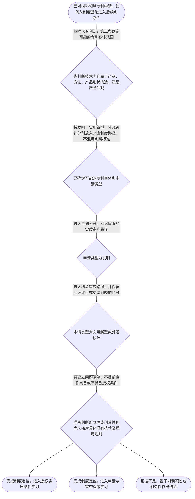

# 专家 A 教学草稿

> 专家：expert_a ｜ 风格：conservative

## 教学模块选择清单

- 当前教学节点：`patent-law-foundation`
- 板块预算：自适应 7/7，总计 9/9

| # | 模块 (block_type) | 类型 | 触发原因 (trigger) | 对应正文段 | 归属 |
|---:|---|:--:|---|---|:--:|
| 1 | `global_framework` | 自适应 | understanding=global(0.73) | 本节点在整门课中的位置｜本节点位于专利学习主线的起点，先回答专利制度保护什么、为什么保护以及由哪些规范共同运行，再为… | [A] |
| 2 | `anchor_scenario` | 自适应 | perception=sensing(0.86) / cold_start | 材料研发团队的申请决策｜某材料研发团队开发出一种耐高温复合涂层，方案既包含材料配方，也包含制备方法。团队准备申请专利… | [A] |
| 3 | `legal_anchor` | 必选 | mandatory | 专利制度的法条与规范锚点｜《专利法》第一条 | [A] |
| 4 | `worked_example` | 自适应 | cognition.apply=0.34<0.4 / cognition.analyze=0.28<0.3 / cold_start | 耐磨复合材料申请的基础判断链｜甲公司研发一种耐磨陶瓷复合材料，研发记录显示其核心内容包括新的材料组成和制备方法。公司拟提交… | [A] |
| 5 | `decision_flow` | 自适应 | input=visual(0.81) | 从申请对象到审查路径｜面对材料领域专利申请，如何从制度基础进入后续判断？ | [A] |
| 6 | `reflect_prompt` | 自适应 | processing=reflective(0.68) | 把制度框架迁移到研发项目｜在你熟悉的材料研发项目中，如果同一项目同时产出材料组成、制备方法和表面外观改进，你会怎样把技… | [A] |
| 7 | `assessment` | 必选 | mandatory | 本节三类测评｜识别《专利法》第二条规定的发明保护客体。 | [A] |
| 8 | `knowledge_synthesis` | 必选 | mandatory | 专利制度基础的知识结构｜patent-rights-nature：专利制度权利具有独占性、时间性和地域性，保护范围不… | [A] |
| 9 | `summary_card` | 自适应 | len(knowledge_sub_nodes)=3>=3 | 专利制度基础速查卡｜先认清专利制度保护什么、由什么规范运行，再进入新颖性和创造性的授权判断。 | [A] |

## 教学正文

## I — 法律问题

材料领域的专利申请进入新颖性和创造性判断前，首先要解决三个基础问题：专利制度保护什么、三类专利客体如何区分、不同申请类型沿什么审查路径运行。本节只完成制度定位，不提前替代后续新颖性和创造性专题的具体判断。

## R — 适用规则

1. **制度目的。**《专利法》第一条规定，制定专利法是为了保护专利权人的合法权益，鼓励发明创造，推动发明创造的应用，提高创新能力，促进科学技术进步和经济社会发展。〔RAG: 中华人民共和国专利法.txt — 第一条：为了保护专利权人的合法权益，鼓励发明创造，推动发明创造的应用，提高创新能力，促进科学技术进步和经济社会发展〕

2. **保护客体。**《专利法》第二条将发明创造分为发明、实用新型和外观设计。发明针对产品、方法或者其改进提出新的技术方案；实用新型针对产品的形状、构造或者其结合提出适于实用的新的技术方案；外观设计针对产品整体或者局部的形状、图案或者其结合以及色彩与形状、图案的结合提出富有美感并适于工业应用的新设计。〔RAG: 中华人民共和国专利法.txt — 第二条：发明、实用新型和外观设计及其产品、方法、形状、构造、外观设计客体定义〕

3. **规范体系。**《专利法》提供基本制度和法律标准；《专利法实施细则》对法律实施中的程序和具体事项作补充；《专利法实施细则》第一百四十八条规定，国务院专利行政部门根据专利法和本细则制定专利审查指南。〔RAG: 中华人民共和国专利法实施细则.txt — 第一百四十八条：国务院专利行政部门根据专利法和本细则制定专利审查指南〕因此，学习新颖性和创造性时，应先找法条依据，再用审查指南理解判断步骤和边界。

4. **审查路径。**检索材料说明，发明专利申请通常采用早期公开、延迟审查的实质审查制；实用新型和外观设计专利申请通常采用初步审查制。〔RAG: 专利法专题讲座.txt — 两种审查制度：发明专利采取早期公开、延迟审查的实质审查制，实用新型和外观设计采取初步审查制〕这属于程序路径判断，不等于已经作出新颖性或创造性结论。

## A — 规则适用

以材料研发为例，一项耐高温复合涂层可能同时包含材料组成和制备方法。第一步应读取技术方案本身，判断其是产品技术方案、方法技术方案，还是外观设计方案，而不能仅凭“材料领域”四个字确定申请类型。

第二步将事实放回《专利法》第二条的客体边界：产品或方法及其改进，原则上对应发明客体的分析入口；如果讨论的是产品形状、构造或者其结合，则需要进一步考虑实用新型客体；如果核心是产品整体或局部的形状、图案及其色彩结合，则进入外观设计客体分析。具体是否符合授权条件，仍需分别依据后续规则判断。

第三步确定申请类型后，再沿相应审查路径推进。发明申请通常进入初步审查、公开和实质审查衔接的路径；实用新型和外观设计通常进入初步审查路径。此时不能把“已进入审查”理解为“已经满足三性”。

第四步才进入实体授权条件。新颖性关注申请日前相关技术是否已经公开，创造性关注相对于现有技术是否显而易见；这两项规则的具体法条拆解、现有技术证据和判断步骤属于后续节点。本节只确定它们在制度地图中的位置，不凭当前材料编造具体审查结论。

本节设有测评，请到【习题】区作答。

> 常见误区 / 易混淆点

- **把技术领域当成保护客体。**“材料领域”只是技术领域，不能代替对产品、方法、形状构造或外观的客体识别。
- **把专利制度目标当成授权标准。**鼓励创新和促进公开是制度目的，不代表任何创新构想当然具备新颖性或创造性。
- **把审查路径当成授权结论。**实质审查制或初步审查制描述的是程序安排，不等于申请已经通过实体授权条件审查。
- **混淆专利法、实施细则和审查指南。**法条提供基本法律依据，实施细则补充实施事项，审查指南提供具体审查操作；引用时应核对来源和现行版本。

### 本节点在整门课中的位置（global_framework）

**位置**：位于知识地图起点，承接专利法律制度基础，向授权条件、申请程序和审查程序展开。

**后继**：patentability-substantive（专利授权实质条件）；patent-application-process（专利申请程序）；patent-examination（专利审查）

**大局观**：本节点位于专利学习主线的起点，先回答专利制度保护什么、为什么保护以及由哪些规范共同运行，再为后续的授权实质条件、申请程序和审查程序建立坐标。学习新颖性和创造性时，必须先知道它们属于授权条件判断，而不是脱离制度层级单独记忆的术语；后续还要把法条标准与审查指南中的操作方法对应起来。

### 材料研发团队的申请决策（anchor_scenario）

> 某材料研发团队开发出一种耐高温复合涂层，方案既包含材料配方，也包含制备方法。团队准备申请专利，但成员对申请对象、审查程序和授权条件存在不同理解：有人认为只要技术方案能实施就可以获得专利，有人认为公开技术方案后就当然没有保护空间。代理人需要先判断该方案属于哪类专利客体，再确定适用的制度规范，并区分后续的新颖性、创造性判断与申请、审查程序。

**锚定**：用材料研发中的申请决策，锚定保护客体、专利制度功能、规范层级及授权条件之间的关系。

**先想一想**：面对这项材料技术方案，你会先确认保护客体、制度功能，还是直接比较现有技术？请说明你选择的第一步。

### 专利制度的法条与规范锚点（legal_anchor）

- **《专利法》第一条**：第一条说明立法目的，包括保护专利权人的合法权益、鼓励发明创造、推动发明创造应用和促进科技进步及经济社会发展。
- **《专利法》第二条**：第二条界定发明、实用新型和外观设计三类发明创造及其基本客体范围。
- **《专利法》第三十九条、第四十条**：检索材料将发明专利概括为早期公开、延迟审查的实质审查制，将实用新型和外观设计概括为初步审查制。
- **《专利法实施细则》第一百四十八条**：实施细则第一百四十八条表明，国务院专利行政部门根据专利法和实施细则制定专利审查指南。

**为何重要**：本节点先建立专利制度的法源和结构，后续学习新颖性、创造性时，才能明确法条是授权标准的依据，审查指南是具体审查操作的重要规范材料；同时要区分实体判断与程序路径。

### 耐磨复合材料申请的基础判断链（worked_example）

**案情/例题**：甲公司研发一种耐磨陶瓷复合材料，研发记录显示其核心内容包括新的材料组成和制备方法。公司拟提交专利申请。问：在进入新颖性和创造性具体判断前，代理人应如何建立基础判断顺序？
**适用规则**：《专利法》第二条；《专利法》第一条；《专利法实施细则》第一百四十八条；检索材料关于发明实质审查制、实用新型和外观设计初步审查制的说明。
**分步推演**：
1. 先读取技术方案的客体内容：材料组成属于产品技术方案，制备方法属于方法技术方案；不能仅因技术属于材料领域就直接确定专利类型。 → *先识别技术方案及其可能对应的保护客体。*
2. 再将方案放入专利法第二条的三类客体框架，确认发明可以覆盖产品、方法或者其改进；实用新型的客体范围则更窄，外观设计针对产品外观。 → *用法条客体边界筛选申请类型。*
3. 确定申请类型后，再区分审查路径。检索材料说明发明适用早期公开、延迟审查的实质审查制，而实用新型和外观设计适用初步审查制。 → *把客体判断与相应审查制度衔接。*
4. 最后才进入授权条件判断。新颖性与创造性属于后续实质判断问题，不能以‘能够实施’或‘属于材料技术’替代对具体授权条件的审查。 → *将制度基础、程序路径和实体标准分层处理。*
**结论**：该材料方案首先应按其技术内容确认适当的专利客体和申请类型；制度功能是鼓励创新并推动公开和应用。至于其新颖性、创造性是否成立，必须在进入相应授权实质条件学习后，依据具体现有技术和审查规则另行判断，本例不提前作出结论。
**本题要点**：面对材料专利申请，先识别客体和规范层级，再确定审查路径，最后分别进入新颖性和创造性判断。

### 从申请对象到审查路径（decision_flow）

**决策问题**：面对材料领域专利申请，如何从制度基础进入后续判断？



### 把制度框架迁移到研发项目（reflect_prompt）

**反思问题**：在你熟悉的材料研发项目中，如果同一项目同时产出材料组成、制备方法和表面外观改进，你会怎样把技术事实分别映射到专利制度中的保护客体和审查路径？

**关注要点**：技术事实是产品、方法还是外观，而不是仅看所属行业名称；不同专利客体对应的授权和审查制度是否相同；在没有核对公开资料和具体审查规则前，不把制度定位误写成新颖性或创造性结论

**连接**：连接到学习者已有的材料研发经验，以及后续的专利授权实质条件和专利审查节点。

### 专利制度基础的知识结构（knowledge_synthesis）

**知识框架**：
- patent-rights-nature：专利制度权利具有独占性、时间性和地域性，保护范围不能脱离授权的时间与法域。
- patent-law-framework：中国专利制度由专利法、专利法实施细则及专利审查指南等规范材料共同构成，学习时应区分法源层级和操作规则。
- patent-system-overview：专利制度以保护合法权益、鼓励发明创造、推动技术应用和促进科技进步与经济社会发展为基本制度目标。
- patent-law-foundation：专利法第二条将发明创造分为发明、实用新型和外观设计，三者的保护客体边界不同。
**概念关系**：先用专利法第二条识别保护客体，再确定适用的申请和审查路径。；专利制度目标解释为什么要保护和公开技术，但不能替代具体授权条件判断。；规范层级为后续学习提供顺序：先掌握专利法的基本标准，再结合实施细则和审查指南理解程序与操作。；发明的实质审查路径与实用新型、外观设计的初步审查路径不同，不能混用。
**必记**：专利制度的三个基本特征是独占性、时间性和地域性。；发明、实用新型、外观设计是《专利法》第二条规定的三类保护客体。；专利法规定基本制度和授权标准，实施细则及审查指南用于补充程序和具体审查操作；引用时必须核对具体来源。；新颖性和创造性属于后续授权实质条件学习内容，本节点先完成制度定位，不把客体判断等同于三性结论。

### 专利制度基础速查卡（summary_card）

**要点卡**：
- **制度特征**：专利权具有独占性、时间性和地域性，三者共同限定保护边界。
- **三类客体**：发明、实用新型和外观设计是《专利法》第二条规定的三类发明创造。
- **规范体系**：专利法定基本框架，实施细则和审查指南帮助落实制度与审查操作。
- **审查路径**：发明通常进入早期公开、延迟审查的实质审查路径，实用新型和外观设计通常适用初步审查路径。
**必背**：专利权的独占性、时间性、地域性；《专利法》第二条规定的发明、实用新型、外观设计及其基本客体边界；先确定保护客体和规范依据，再区分申请及审查路径；客体定位、审查程序、新颖性判断和创造性判断是不同层次的问题
**一句话总结**：先认清专利制度保护什么、由什么规范运行，再进入新颖性和创造性的授权判断。

### 本节三类测评（assessment）

**三类覆盖**：backward_review、forward_probe、weakness_probe
**题目**：
- q-foundation-1：识别《专利法》第二条规定的发明保护客体。
- q-foundation-2：理解专利制度保护创新、促进公开和应用的基本作用。
- q-foundation-3：区分发明、实用新型和外观设计的基本审查路径。


## 结构化字段

## knowledge_points

```json
[
  {
    "node_id": "patent-law-foundation",
    "kc_name": "专利制度的基本概念与特征：独占性、时间性、地域性（详见子节点 patent-rights-nature）"
  },
  {
    "node_id": "patent-law-foundation",
    "kc_name": "中国专利制度体系：专利法、专利法实施细则、专利审查指南（详见子节点 patent-law-framework）"
  },
  {
    "node_id": "patent-law-foundation",
    "kc_name": "专利保护的三种客体：发明、实用新型、外观设计（专利法第2条）"
  },
  {
    "node_id": "patent-law-foundation",
    "kc_name": "专利制度的作用：激励发明创造、促进技术公开、推动技术应用和经济发展（详见子节点 patent-system-overview）"
  },
  {
    "node_id": "patent-law-foundation",
    "kc_name": "中国专利制度发展历程与特点：早期公开延迟审查、初步审查制与实质审查制并存（详见子节点 patent-system-overview）"
  }
]
```

## legal_basis

```json
[
  {
    "article": "《专利法》第一条",
    "source": "中华人民共和国专利法.txt"
  },
  {
    "article": "《专利法》第二条",
    "source": "中华人民共和国专利法.txt"
  },
  {
    "article": "《专利法》第三十九条、第四十条",
    "source": "专利法专题讲座.txt"
  },
  {
    "article": "《专利法实施细则》第一百四十八条",
    "source": "中华人民共和国专利法实施细则.txt"
  }
]
```

## risks

```json
[
  {
    "risk": "当前检索上下文未提供独占性、时间性、地域性的完整法条原文，正文仅作制度框架说明，具体期限和地域边界需后续检索核对。",
    "related_node_id": "patent-rights-nature"
  },
  {
    "risk": "当前节点不是新颖性或创造性专题；不得把保护客体、制度目标或审查路径直接推导为具体三性结论。",
    "related_node_id": "patentability-substantive"
  },
  {
    "risk": "实施细则和审查指南的具体条款层级及适用范围需要结合后续专题材料核验，不能以讲义概括替代完整规范依据。",
    "related_node_id": "patent-law-framework"
  },
  {
    "risk": "检索上下文对审查路径提供的是讲义概括，具体程序期限和例外情形应以现行法条、实施细则及审查指南为准。",
    "related_node_id": "patent-examination"
  }
]
```

## draft_stage

```json
"debate"
```

## irac

```json
{
  "issue": "材料领域的专利申请在进入新颖性和创造性判断前，应如何确定其制度位置、保护客体和基本审查路径？",
  "rule": "《专利法》第一条确立保护专利权人合法权益、鼓励发明创造、推动应用和促进科技进步等立法目的；第二条规定发明、实用新型和外观设计三类发明创造及其客体范围。检索材料说明，发明专利通常采用早期公开、延迟审查的实质审查制，实用新型和外观设计通常采用初步审查制；《专利法实施细则》第一百四十八条规定国务院专利行政部门根据专利法和本细则制定专利审查指南。",
  "application": "以材料领域申请为例，应先根据技术内容识别其属于产品、方法、产品形状构造或产品外观，再依据《专利法》第二条确定可能的保护客体。随后依据申请类型区分审查路径：检索材料说明发明专利通常适用早期公开、延迟审查的实质审查制，实用新型和外观设计通常适用初步审查制。新颖性和创造性应在核对具体现有技术及对应审查规则后分别判断，不能由技术所属领域或能够实施这一事实直接推出结论。",
  "conclusion": "专利法律制度基础的核心是建立三层坐标：专利制度的目标与权利特征、三类专利保护客体、以及不同申请类型的审查路径。完成该定位后，才能准确进入新颖性和创造性等授权实质条件的学习。"
}
```

## interactive_questions

```json
[
  {
    "qid": "q-foundation-1",
    "category": "remember",
    "difficulty": "L1",
    "source_tag": "backward_review",
    "kc_node_id": "patent-law-foundation",
    "question": "根据《专利法》第二条，下列哪一项属于发明专利保护的客体？",
    "answer": "B",
    "options": [
      "A.仅涉及自然规律本身的发现",
      "B.对产品、方法或者其改进提出的新的技术方案",
      "C.仅涉及产品局部图案的设计",
      "D.仅涉及产品销售方式的商业安排"
    ]
  },
  {
    "qid": "q-foundation-2",
    "category": "understand",
    "difficulty": "L1",
    "source_tag": "backward_review",
    "kc_node_id": "patent-law-foundation",
    "question": "专利制度通过授予一定期限和地域范围内的专有权，主要实现下列哪项制度功能？",
    "answer": "C",
    "options": [
      "A.只保护专利权人的既有市场份额",
      "B.只用于限制技术公开",
      "C.保护合法权益、鼓励发明创造并推动技术应用和发展",
      "D.只用于确定民事诉讼管辖法院"
    ]
  },
  {
    "qid": "q-foundation-3",
    "category": "analyze",
    "difficulty": "L3",
    "source_tag": "weakness_probe",
    "kc_node_id": "patent-law-foundation",
    "question": "某材料公司提交一项发明专利申请。下列关于其一般审查路径的判断，哪一项正确？",
    "answer": "A",
    "options": [
      "A.发明专利通常经历初步审查、早期公开、延迟审查和实质审查；实用新型及外观设计通常适用初步审查制",
      "B.三类专利申请均必须先经过三年实质审查才能授权",
      "C.实用新型和外观设计只能提交申请，不能接受任何审查",
      "D.发明专利一经受理即当然获得专利权，无须后续审查"
    ]
  }
]
```

## knowledge_synthesis

```json
{
  "node": "patent-law-foundation",
  "coverage": [
    {
      "node_id": "patent-rights-nature"
    },
    {
      "node_id": "patent-law-framework"
    },
    {
      "node_id": "patent-system-overview"
    },
    {
      "node_id": "patent-law-foundation"
    }
  ],
  "confusable_pairs": []
}
```
