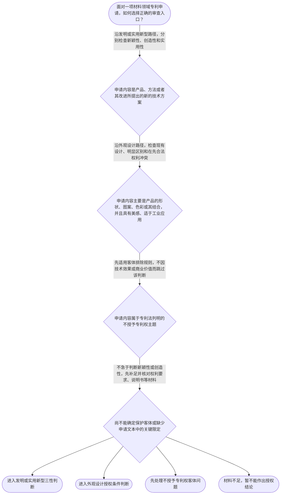

# 专家 B 教学草稿

> 专家：expert_b ｜ 风格：accessible

## 教学模块选择清单

- 当前教学节点：`patent-law-foundation`
- 板块预算：自适应 None/None，总计 None/None

| # | 模块 (block_type) | 类型 | 触发原因 (trigger) | 对应正文段 | 归属 |
|---:|---|:--:|---|---|:--:|
| 1 | `global_framework` | 自适应 | understanding=global(0.73) | 先看整张专利审查地图｜学习专利审查不能一上来只背新颖性或创造性。整门课先从专利制度的保护对象和法律层级入手，再进入… | [B] |
| 2 | `anchor_scenario` | 自适应 | perception=sensing(0.86) / cold_start | 一项材料技术，先过哪道门？｜某材料研发团队开发出一种耐高温复合涂层：方案包括特定树脂、陶瓷颗粒和固化工艺。团队准备申请专… | [B] |
| 3 | `legal_anchor` | 必选 | mandatory | 四个法条，搭起审查入口｜《专利法》第二条 | [B] |
| 4 | `worked_example` | 自适应 | cognition.apply=0.34<0.4 / cognition.analyze=0.28<0.3 / cold_start | 从材料研发事实走一遍审查链｜某公司研发一种用于电池壳体的耐腐蚀复合层，研发记录中既写有复合层的材料组成，也写有制备步骤和… | [B] |
| 5 | `decision_flow` | 自适应 | input=visual(0.81) | 专利审查入口决策图｜面对一项材料领域专利申请，如何选择正确的审查入口？ | [B] |
| 6 | `reflect_prompt` | 自适应 | processing=reflective(0.68) | 把审查入口带回研发现场｜回想一个材料研发方案：如果你把同一研发成果分别写成材料组成、制备方法和产品外观，你会先比较哪… | [B] |
| 7 | `assessment` | 必选 | mandatory | 三类检查：复习、探测与辨析｜复习专利法规定的三种专利保护客体 | [B] |
| 8 | `knowledge_synthesis` | 必选 | mandatory | 把五个知识点连成一张网｜专利制度基本特征：专利权具有独占性、时间性和地域性，权利人在法定范围和期限内享有排他保护。 | [B] |
| 9 | `summary_card` | 自适应 | len(knowledge_sub_nodes)=3>=3 | 专利法律制度基础速查卡｜专利审查先定保护客体和法律入口，再按对应规则逐项判断授权条件。 | [B] |

## 教学正文

## 1. 场景导入

想象一个材料研发团队完成了耐高温复合涂层：它既有树脂和陶瓷颗粒的组成，还包含制备工艺，最终涂在电池壳体上并呈现特定颜色纹理。团队准备申请专利时，最先遇到的不是“效果好不好”，而是三个入口问题：保护的究竟是技术方案还是外观表达？应当查哪一套规则？之后的新颖性和创造性是不是同一件事？

## 2. 人话解释

可以把专利审查想成“先分流、再安检”。第一步是确认要保护的对象：发明主要对应产品、方法或者其改进形成的新的技术方案；实用新型聚焦产品的形状、构造或者其结合；外观设计则聚焦产品外观的形状、图案、色彩及其结合。不同对象不能共用一套判断标准。

第二步是找到规则的层级。专利法像总规则，规定保护客体、授权门槛和基本权利；实施细则承接具体程序；审查指南则帮助审查和申请实践具体化。人话说就是：先看“法律允许什么、要求什么”，再看“程序上怎么做”，最后用指南辅助操作，不能倒过来。

第三步才进入授权条件。发明和实用新型要分别看新颖性、创造性和实用性。新颖性关注申请日前是否已有公众知晓的技术；创造性不是“新颖性更强”的同义词，而是要进一步讨论相对于现有技术是否具有相应的实质性特点和进步；实用性则关注能否制造或者使用并产生积极效果。三性缺一不可，不能用“效果明显”一次性替代全部判断。

专利权本身也有边界：它具有独占性、时间性和地域性。也就是说，权利人在法定范围和期限内享有排他保护，但专利权不是无限期、全球范围、没有边界的绝对权。

## 3. 法条回扣

《专利法》第二条明确，发明是对产品、方法或者其改进所提出的新的技术方案；实用新型是对产品的形状、构造或者其结合所提出的适于实用的新的技术方案；外观设计是对产品外观要素所作出的富有美感并适于工业应用的新设计。〔RAG: 中华人民共和国专利法.txt — 第二条：发明、实用新型和外观设计的定义〕

《专利法》第二十二条规定，授予专利权的发明和实用新型应当具备新颖性、创造性和实用性；其中，现有技术是申请日以前在国内外为公众所知的技术。〔RAG: 中华人民共和国专利法.txt — 第二十二条：新颖性、创造性、实用性及现有技术的规定〕

《专利法》第二十三条为外观设计设置了不同的授权条件，包括不属于现有设计、与现有设计或者现有设计特征的组合相比具有明显区别，并且不得与在先合法权利相冲突。〔RAG: 中华人民共和国专利法.txt — 第二十三条：外观设计授权条件〕

《专利法》第二十五条列举了不授予专利权的主题，例如科学发现、智力活动的规则和方法、疾病的诊断和治疗方法等。〔RAG: 中华人民共和国专利法.txt — 第二十五条：不授予专利权的主题〕

本轮检索材料能够直接支持上述法条和制度入口；关于早期公开、延迟审查以及初步审查与实质审查并存的具体历史沿革，当前片段没有提供完整依据，因此这里只作后续程序学习提示，不展开具体年代或细节。

## 4. 类比 / 口诀

记忆口诀是：“先看保护啥，再找哪条法；发明实用新颖创实，外观另走明显区别。”这里的“分流—安检”类比只用于记忆顺序：它不能替代对权利要求文字、申请文件和现有技术证据的正式分析。

还可以把新颖性和创造性记成“有没有被单独说过”和“是不是顺手就能想到”。前者帮助记住新颖性的入口，后者帮助记住创造性要进行更深入的比较；但这只是学习提示，不能把复杂审查规则简化成机械口号。

## 5. 应试提示

看到材料领域题干，建议按四步扫描：第一，圈出要保护的是组成、结构、方法，还是外观；第二，排查是否属于法定不授予专利权主题；第三，选择发明、实用新型或外观设计对应的授权条件；第四，再把新颖性、创造性、实用性分开判断。

高频陷阱有三个：把“没有完全相同的文献”直接写成“创造性成立”；把外观设计的“一般消费者”与技术方案判断中的技术人员混用；把专利法、实施细则和审查指南的作用及层级颠倒。遇到题目时，先问适用对象，再问证据和规则来源，最后才下结论。

## 6. 互动提问

本节设有测评，请到【习题】区作答。

### 先看整张专利审查地图（global_framework）

**位置**：位于专利法学习地图的起点，承接专利制度基本概念，向授权实质条件、申请程序和审查程序展开。

**后继**：patentability-substantive（专利授权实质条件）；patent-application-process（专利申请程序）；patent-examination（专利审查）

**大局观**：学习专利审查不能一上来只背新颖性或创造性。整门课先从专利制度的保护对象和法律层级入手，再进入发明、实用新型的三性判断，随后学习申请文件、审查程序和权利保护。本节点是总入口：先知道制度保护什么、依据什么、最终要解决什么问题，后面才不会把新颖性、创造性、抵触申请或程序救济混在一起。

### 一项材料技术，先过哪道门？（anchor_scenario）

> 某材料研发团队开发出一种耐高温复合涂层：方案包括特定树脂、陶瓷颗粒和固化工艺。团队准备申请专利，但成员意见不一：有人认为只要技术效果好就能获得专利；有人认为只要没有完全相同的公开内容就一定具备创造性；还有人把发明、实用新型和外观设计混作一类。代理人需要先回答：这项技术属于哪种保护客体？应当依据哪些规范？之后才谈新颖性、创造性和实用性。

**锚定**：用材料研发场景锚定“保护客体—法律依据—三性条件”的制度基础，并为后续新颖性与创造性判断建立入口。

**先想一想**：如果你是代理人，面对这项材料技术方案，为什么不能只凭“效果好”或“没有完全相同公开”就直接判断能否授权？

### 四个法条，搭起审查入口（legal_anchor）

- **《专利法》第二条**：专利法把发明创造分为发明、实用新型和外观设计：材料产品或方法通常首先要判断其属于哪类客体。
- **《专利法》第二十二条**：发明和实用新型要同时具备新颖性、创造性和实用性；现有技术是申请日前在国内外为公众所知的技术。
- **《专利法》第二十三条**：外观设计有自己的授权条件，包括不属于现有设计、与现有设计或其特征组合相比具有明显区别，并且不能冲突于在先合法权利。
- **《专利法》第二十五条**：科学发现、智力活动规则和方法、疾病诊断和治疗方法等列入不授予专利权的范围；因此“有技术含义”不等于当然属于可授权客体。

**为何重要**：这些条文构成后续审查的入口和主线：先识别保护客体及排除事项，再根据客体选择相应授权条件。新颖性关注申请日前是否已有公众可知技术，创造性则是另一项独立判断，不能因为新颖性成立就自动推出创造性成立。

### 从材料研发事实走一遍审查链（worked_example）

**案情/例题**：某公司研发一种用于电池壳体的耐腐蚀复合层，研发记录中既写有复合层的材料组成，也写有制备步骤和壳体表面的颜色纹理。公司准备提交一件申请，并主张“该产品效果明显，所以三性都满足”。现在需要演示：面对混合事实，审查分析的第一步和后续顺序应如何安排？
**适用规则**：《专利法》第二条、第二十二条、第二十三条和第二十五条；本例只演示“先识别客体、再选择授权条件”的制度判断链，不替代对具体申请的新颖性或创造性审查。
**分步推演**：
1. 先看申请要保护的内容是新的技术方案，还是产品外观的形状、图案、色彩及其结合。材料组成和制备步骤具有技术方案属性；颜色纹理如果独立作为外观表达，则可能涉及另一种客体。 → *第一步是识别保护客体，不能先凭技术效果下结论。*
2. 如果保护的是材料组成、结构或制备方法，应进入发明或实用新型的授权条件框架；如果保护的是产品外观，则应查看外观设计的专门条件。 → *第二步是按客体选择适用的法条路径。*
3. 对发明或实用新型，不能把“效果明显”直接等同于三性。应分别核对新颖性、创造性和实用性；对外观设计，则核对现有设计、明显区别及在先合法权利冲突等条件。 → *第三步是把不同授权条件逐项拆开。*
4. 如果申请内容落入专利法列明的不授予专利权主题，即使申请人认为其有价值，也不能跳过客体排除规则直接进入三性判断。 → *第四步是检查是否存在法定排除事项。*
**结论**：该材料方案若以产品结构或制造方法为技术方案，通常应先沿发明或实用新型方向识别其客体，再进入新颖性、创造性和实用性判断；若申请内容实际只是外观装饰，则应转入外观设计的判断框架。具体能否授权，仍需结合权利要求和现有技术作进一步审查。
**本题要点**：处理材料专利问题时，先问“保护的到底是什么”，再问“适用哪组授权条件”，最后才分别判断新颖性、创造性和实用性。

### 专利审查入口决策图（decision_flow）

**决策问题**：面对一项材料领域专利申请，如何选择正确的审查入口？



### 把审查入口带回研发现场（reflect_prompt）

**反思问题**：回想一个材料研发方案：如果你把同一研发成果分别写成材料组成、制备方法和产品外观，你会先比较哪些事实，再决定分别适用哪条审查路径？

**关注要点**：保护对象是技术方案还是外观表达；发明和实用新型的三性与外观设计授权条件并不相同；“效果好”“未见相同方案”等直觉不能替代法条要求

**连接**：连接到材料研发中“产品组成、制备工艺、外观表现”经常同时出现的经验，并连接到后续“新颖性与创造性”的分开判断。

### 把五个知识点连成一张网（knowledge_synthesis）

**知识框架**：
- 专利制度基本特征：专利权具有独占性、时间性和地域性，权利人在法定范围和期限内享有排他保护。
- 中国专利制度体系：专利法提供基本规则，专利法实施细则承接程序和操作要求，专利审查指南进一步提供审查中的具体判断指引。
- 专利保护客体：发明是新的技术方案，实用新型聚焦产品形状、构造或其结合的新的技术方案，外观设计聚焦产品外观的形状、图案、色彩及其结合。
- 专利制度作用：通过授予一定期限和地域范围的专有权，换取技术公开，从而激励发明创造、促进技术应用和经济发展。
- 制度发展与审查程序特点：中国专利制度通过持续修法不断完善；学习程序时还要注意初步审查与实质审查在不同申请和审查阶段中的分工。
**概念关系**：先识别保护客体，再选择发明、实用新型或外观设计的授权条件。；发明和实用新型进入三性判断；外观设计适用现有设计、明显区别和在先合法权利等条件。；法律条文确定基本门槛，实施细则和审查指南用于补充程序及具体操作；具体审查结论不能脱离上位法。
**必记**：专利权不是无限期、无地域边界的绝对权，而是具有独占性、时间性和地域性的法定权利。；发明、实用新型、外观设计是三种不同保护客体，不能用同一套判断标准混用。；发明和实用新型的三性是新颖性、创造性和实用性；三者是分别判断的授权条件。；新颖性主要围绕申请日前公众可知技术展开，创造性不是新颖性的同义表达；后续学习必须把二者分开。

### 专利法律制度基础速查卡（summary_card）

**要点卡**：
- **专利权三特征**：独占性、时间性、地域性：有排他范围，但不是无限期、全球和无边界的权利。
- **法律规范层级**：专利法定基本门槛，实施细则接程序，审查指南补具体操作；下位规则不能脱离上位法。
- **三种保护客体**：发明看新的技术方案，实用新型看产品形状构造及其结合，外观设计看产品外观表达。
- **授权判断入口**：先识别客体和排除事项，再选择对应的授权条件。
- **三性主线**：发明和实用新型要分别检查新颖性、创造性、实用性；三性不是一个概念。
**必背**：专利法第二条规定发明创造包括发明、实用新型和外观设计。；发明和实用新型应当具备新颖性、创造性和实用性。；外观设计不能直接套用发明、实用新型的三性判断框架。；判断顺序口诀：先看保护什么，再找适用法条，最后逐项过授权条件。
**一句话总结**：专利审查先定保护客体和法律入口，再按对应规则逐项判断授权条件。

### 三类检查：复习、探测与辨析（assessment）

**三类覆盖**：backward_review、forward_probe、weakness_probe
**题目**：
- q_backward_1：复习专利法规定的三种专利保护客体
- q_forward_1：探测发明和实用新型三性授权条件
- q_weakness_1：挑战保护客体、法律层级与授权判断顺序的区分


## 结构化字段

## knowledge_points

```json
[
  {
    "node_id": "patent-law-foundation",
    "kc_name": "专利制度的基本概念与特征：独占性、时间性、地域性"
  },
  {
    "node_id": "patent-law-foundation",
    "kc_name": "中国专利制度体系：专利法、专利法实施细则、专利审查指南"
  },
  {
    "node_id": "patent-law-foundation",
    "kc_name": "专利保护的三种客体：发明、实用新型、外观设计（专利法第2条）"
  },
  {
    "node_id": "patent-law-foundation",
    "kc_name": "专利制度的作用：激励发明创造、促进技术公开、推动技术应用和经济发展"
  },
  {
    "node_id": "patent-law-foundation",
    "kc_name": "中国专利制度发展历程与特点：早期公开延迟审查、初步审查制与实质审查制并存"
  }
]
```

## legal_basis

```json
[
  {
    "article": "《专利法》第二条：规定发明、实用新型和外观设计的定义。",
    "source": "中华人民共和国专利法.txt"
  },
  {
    "article": "《专利法》第二十二条：规定发明和实用新型应当具备新颖性、创造性和实用性，并规定现有技术。",
    "source": "中华人民共和国专利法.txt"
  },
  {
    "article": "《专利法》第二十三条：规定外观设计的授权条件。",
    "source": "中华人民共和国专利法.txt"
  },
  {
    "article": "《专利法》第二十五条：规定不授予专利权的主题。",
    "source": "中华人民共和国专利法.txt"
  },
  {
    "article": "《专利法》第二十六条：规定发明或者实用新型申请应提交的主要文件及说明书的清楚、完整要求。",
    "source": "中华人民共和国专利法.txt"
  },
  {
    "article": "关于中国专利法历次修改和制度完善的说明。",
    "source": "专利法律知识详细解读.txt"
  }
]
```

## risks

```json
[
  {
    "risk": "本轮检索片段未提供早期公开、延迟审查以及初步审查与实质审查并存的完整历史和程序依据，具体年代、适用范围和程序细节需在后续程序节点结合专门材料核验。",
    "related_node_id": "patent-law-foundation"
  },
  {
    "risk": "不能把“没有发现相同公开”直接等同于创造性成立；新颖性和创造性需要分别依据各自规则判断。",
    "related_node_id": "patent-law-foundation"
  },
  {
    "risk": "材料研发成果可能同时包含组成、方法和外观事实，若未先明确权利要求保护客体，容易误用授权条件。",
    "related_node_id": "patent-law-foundation"
  }
]
```

## draft_stage

```json
"debate"
```

## interactive_questions

```json
[
  {
    "qid": "q_backward_1",
    "category": "remember",
    "difficulty": "L1",
    "source_tag": "backward_review",
    "kc_node_id": "patent-law-foundation",
    "question": "根据《专利法》第二条，下列哪项属于我国专利法所称的发明创造客体？",
    "answer": "B",
    "options": [
      "A.只有发明和实用新型",
      "B.发明、实用新型和外观设计",
      "C.只有材料产品和制造方法",
      "D.所有具有商业价值的技术成果"
    ]
  },
  {
    "qid": "q_forward_1",
    "category": "understand",
    "difficulty": "L1",
    "source_tag": "forward_probe",
    "kc_node_id": "patentability-substantive",
    "question": "关于发明和实用新型的授权实质条件，下列哪项表述正确？",
    "answer": "A",
    "options": [
      "A.新颖性、创造性和实用性",
      "B.新颖性、独占性和地域性",
      "C.创造性、保密性和商业价值",
      "D.实用性、外观美感和市场份额"
    ]
  },
  {
    "qid": "q_weakness_1",
    "category": "analyze",
    "difficulty": "L3",
    "source_tag": "weakness_probe",
    "kc_node_id": "patent-law-foundation",
    "question": "某材料研发团队拟申请专利，代理人直接援引审查指南中的一条操作性表述，认定该方案必然具备创造性，但尚未确认其属于何种专利客体，也未核对专利法规定。下列处理最稳妥的是？",
    "answer": "C",
    "options": [
      "A.审查指南属于上位法，可以推翻专利法中的客体和授权条件",
      "B.只要材料方案技术效果好，就无需先识别保护客体或核对法条",
      "C.应先识别保护客体并核对专利法基本门槛，再结合实施细则和审查指南作具体判断",
      "D.只要没有检索到完全相同的方案，就可以直接认定创造性成立"
    ]
  }
]
```

## knowledge_synthesis

```json
{
  "node": "patent-law-foundation",
  "coverage": [
    {
      "node_id": "patent-law-foundation"
    },
    {
      "node_id": "patent-law-foundation"
    },
    {
      "node_id": "patent-law-foundation"
    },
    {
      "node_id": "patent-law-foundation"
    },
    {
      "node_id": "patent-law-foundation"
    }
  ],
  "confusable_pairs": []
}
```
