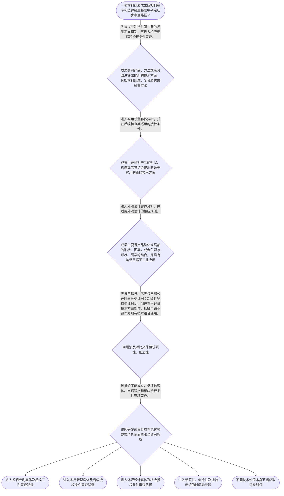

# 整合后的课程完整内容与习题

## 教学模块选择清单

- 当前教学节点：`patent-law-foundation`
- 板块预算：自适应 5/6，总计 9/9

| # | 模块 (block_type) | 类型 | 触发原因 (trigger) | 对应正文段 | 归属 |
|---:|---|:--:|---|---|:--:|
| 1 | `global_framework` | 自适应 | understanding=global(0.73) | 专利制度的全局位置｜本节点建立材料专利学习的总地图：先确认专利制度保护什么、专利权具有什么边界、规则由哪些规范构… | [A+B融合] |
| 2 | `anchor_scenario` | 自适应 | perception=sensing(0.86) / cold_start | 材料研发成果如何进入专利制度｜某材料团队制得一种用于锂离子电池正极的复合涂层：涂层包含特定无机颗粒和聚合物粘结体系，并声称… | [A+B融合] |
| 3 | `legal_anchor` | 必选 | mandatory | 专利客体与授权条件的法条锚点｜《中华人民共和国专利法》第二条 | [A+B融合] |
| 4 | `worked_example` | 自适应 | cognition.apply=0.34<0.4 / cognition.analyze=0.28<0.3 / cold_start | 复合涂层成果的制度定位｜某团队形成三组材料成果：第一组是具有特定层状结构的复合涂层；第二组是该涂层的烧结制备工艺；第… | [A+B融合] |
| 5 | `decision_flow` | 自适应 | input=visual(0.81) | 材料成果的初步分类流程｜一项材料研发成果应如何在专利法律制度基础中确定初步审查路径？ | [A+B融合] |
| 6 | `reflect_prompt` | 自适应 | processing=reflective(0.69) | 从研发成果反观制度分类｜回看自己熟悉的一项材料研发成果：哪些内容是在解决技术问题，哪些内容主要呈现为产品视觉设计？如… | [A+B融合] |
| 7 | `assessment` | 必选 | mandatory | 本节三类测评｜复习专利法规定的发明、实用新型和外观设计三类保护客体。 | [A+B融合] |
| 8 | `knowledge_synthesis` | 必选 | mandatory | 专利法律制度基础关系网｜patent-rights-nature：专利权具有独占性、时间性和地域性，分别说明排他效果… | [A+B融合] |
| 9 | `summary_card` | 自适应 | len(knowledge_sub_nodes)=3>=3 | 制度基础与审查入口速查卡｜材料专利学习的起点是：先按法定客体定位研发成果，再按时间和证据性质进入新颖性、创造性及其他授… | [A+B融合] |

## 教学正文

## I——本节要解决的问题

材料领域的专利学习，不能从“性能是否先进”直接跳到“能否授权”。正确顺序是：先识别成果属于什么专利保护客体，再明确中国专利制度由哪些规范共同构成，最后把问题放入申请程序或授权条件审查的正确入口。本节建立制度基础地图，并为后续新颖性、创造性判断搭好坐标。

## R——适用规则

### 1. 专利权的三个基本边界

专利权通常从三个维度理解：

- **独占性**：在法律授予的范围内，权利人对专利技术享有排他性权利，未经许可，他人不得实施法律禁止的行为。
- **时间性**：专利权不是永久权利，只在法定保护期限内存在。
- **地域性**：专利权的效力原则上受授予该权利的国家或地区法律边界限制，不会因为在一个国家取得专利就自动覆盖全球。

因此，“具有独占性”不能推出“永久有效”，也不能推出“全球自动有效”。具体保护范围还取决于授权文本及其权利要求。

### 2. 中国专利制度的规则层级

可以用“主干—程序—审查口径”理解中国专利制度：

1. 《专利法》确立专利保护客体、授权条件和基本权利义务；
2. 《专利法实施细则》对申请、审查及相关程序作进一步细化；
3. 《专利审查指南》为审查实践提供具体判断口径。

三者不是彼此替代的关系。遇到材料申请问题，应先判断它属于客体、申请程序还是授权实质条件问题，再查找相应层级的规范。

### 3. 三种专利保护客体

《专利法》第二条规定，本法所称的发明创造包括发明、实用新型和外观设计。〔RAG: 中华人民共和国专利法.txt — 第二条：本法所称的发明创造是指发明、实用新型和外观设计〕

- **发明**：对产品、方法或者其改进所提出的新的技术方案。材料配方、复合材料组成、制备工艺以及材料结构改进，通常首先从这一技术方案入口分析。〔RAG: 中华人民共和国专利法.txt — 第二条：发明，是指对产品、方法或者其改进所提出的新的技术方案〕
- **实用新型**：对产品的形状、构造或者其结合所提出的适于实用的新的技术方案。它的法定对象重点落在产品的形状、构造或其结合。〔RAG: 中华人民共和国专利法.txt — 第二条：实用新型，是指对产品的形状、构造或者其结合所提出的适于实用的新的技术方案〕
- **外观设计**：对产品整体或局部的形状、图案或者其结合，以及色彩与形状、图案的结合所作出的富有美感并适于工业应用的新设计。〔RAG: 中华人民共和国专利法.txt — 第二条：外观设计，是指对产品的整体或者局部的形状、图案或者其结合以及色彩与形状、图案的结合所作出的富有美感并适于工业应用的新设计〕

例如，复合涂层的材料组成、层状结构或制备方法，重点是技术方案；电池壳体表面的图案、色彩和视觉组合，则应另行考察外观设计客体。一个研发项目可以同时产生不同类型的成果，不能仅按“材料项目”这一名称一概归类。

### 4. 客体识别不等于当然授权

《专利法》第二十二条规定，授予专利权的发明和实用新型应当具备新颖性、创造性和实用性。〔RAG: 中华人民共和国专利法.txt — 第二十二条：授予专利权的发明和实用新型，应当具备新颖性、创造性和实用性〕

所以，客体判断只是第一道门：

**研发成果 → 专利客体定位 → 申请文件与程序 → 新颖性、创造性、实用性等授权条件。**

循环寿命提高、导电率改善、耐热性能突出或市场价值较高，都不能替代上述法律判断。

### 5. 制度作用与制度运行特点

专利制度的核心机制，是在技术公开与期限性排他保护之间建立交换：申请人通过申请文件公开技术方案，在满足法定条件后获得一定范围、一定期限和一定地域内的专利权。该制度旨在激励发明创造、促进技术公开、推动技术应用和经济发展。

中国专利制度中，发明专利申请存在公开、实质审查等制度环节，实用新型和外观设计申请与发明申请的审查方式并不完全相同。早期公开、延迟审查，以及初步审查制与发明专利实质审查制并存，是理解制度运行的背景性特点；本节不据检索上下文不足的部分展开具体期限或程序结论，具体规则应以正式法条、实施细则和审查指南核验。

### 6. 后续新颖性、创造性判断的入口预告

后续学习材料领域新颖性和创造性时，先固定三条边界：

- 新颖性原则上实行**单独对比**，不能把两份对比文件拼接后否定新颖性。〔RAG: 专利法专题讲座.txt — 判断新颖性时应当与每一项现有技术单独进行比较，不得将几项现有技术组合进行对比〕
- 创造性评价针对权利要求限定的技术方案整体；是否能够组合对比，应进入创造性判断框架，而不是直接用于新颖性判断。〔RAG: 专利法专题讲座.txt — 创造性的判断，应当针对权利要求限定的技术方案整体进行评价〕
- 申请日前已为公众所知的技术属于现有技术；申请在先、公开在后的特定中国专利文件属于抵触申请的判断范围，不等同于现有技术，只能单独评价新颖性，不能用于创造性组合评价。〔RAG: 中华人民共和国专利法.txt — 第二十二条关于现有技术及申请在先、公开在后文件的规定；专利法专题讲座.txt — 抵触申请的使用条件〕

申请日和优先权日会影响后续判断的时间边界，但其具体时间轴和适用条件将在相应节点系统学习。

## A——规则适用

假设某团队研发出一种用于锂离子电池的复合电极涂层，同时形成了涂层组成、烧结制备方法和电池壳体外观三个成果。第一步，应分别识别每项成果的法律对象；第二步，确定拟申请的专利类型；第三步，再依据该类型的申请要求和授权条件审查。不能因为三项成果来自同一个研发项目，就把它们视为同一种专利客体。

如果团队进一步拿出两份技术文献判断新颖性，应先问：每份文件分别属于什么时间和法律性质？在新颖性判断中，不能将两份文件的特征拼成一个“新方案”。如果涉及申请在先、公开在后的中国专利文件，还必须与通常的现有技术区分，并遵守其只能单独评价新颖性的边界。

## C——结论

材料领域专利分析的基础主线是：**先识别保护客体，再定位规则层级，最后进入申请程序或授权条件审查**。专利权具有独占性、时间性和地域性；发明、实用新型和外观设计具有不同法定定义；发明和实用新型还必须满足新颖性、创造性和实用性。后续判断新颖性和创造性时，应牢记“新颖性单独对比、创造性整体评价、抵触申请不等同于现有技术”的证据边界。

本节设有测评，请到【习题】区作答。

### 专利制度的全局位置（global_framework）

**位置**：本节点是专利法律制度学习的起点；无前置节点，向后衔接申请程序、授权实质条件以及新颖性、创造性判断。

**前置**：无需前置专利法节点；可运用已有材料研发中关于技术方案、性能和公开的基本经验。

**后继**：patent-application-process（专利申请程序）；patentability-substantive（专利授权实质条件）；novelty（新颖性）；inventive-step（创造性）

**大局观**：本节点建立材料专利学习的总地图：先确认专利制度保护什么、专利权具有什么边界、规则由哪些规范构成，再进入申请程序和发明、实用新型的授权条件审查。后续新颖性和创造性判断都必须回到客体、时间与证据边界上定位。

### 材料研发成果如何进入专利制度（anchor_scenario）

> 某材料团队制得一种用于锂离子电池正极的复合涂层：涂层包含特定无机颗粒和聚合物粘结体系，并声称可改善循环稳定性。团队计划同时保护涂层材料、制备工艺以及电池产品的外观方案。负责人认为“技术先进就应当都能申请专利”，代理人则要求先区分各项成果是否属于法定专利保护客体，再判断适用的规则和审查路径。

**锚定**：该场景把材料研发事实连接到三类专利客体、专利权三项边界以及后续新颖性和创造性判断的制度入口。

**先想一想**：面对涂层材料、制备方法和电池外观三个成果，先分别问：保护对象是什么、权利边界是什么、后续应进入哪一种审查规则？

### 专利客体与授权条件的法条锚点（legal_anchor）

- **《中华人民共和国专利法》第二条**：第二条规定发明、实用新型和外观设计三类基本保护客体，并分别界定其法律对象。
- **《中华人民共和国专利法》第二十二条**：第二十二条规定发明和实用新型获得专利权须具备新颖性、创造性和实用性，并界定现有技术及申请在先、公开在后的相关情形。
- **《中华人民共和国专利法》第二十六条第一款**：第二十六条第一款规定，申请发明或者实用新型专利应提交请求书、说明书及其摘要和权利要求书等文件。

**为何重要**：第二条解决“成果属于哪类专利对象”，第二十二条解决“发明和实用新型还要满足哪些授权条件”，第二十六条第一款提示申请文件是将技术方案转化为法律保护请求的基本载体。

### 复合涂层成果的制度定位（worked_example）

**案情/例题**：某团队形成三组材料成果：第一组是具有特定层状结构的复合涂层；第二组是该涂层的烧结制备工艺；第三组是电池壳体表面的图案与颜色组合。现需演示如何完成制度基础定位，并说明为什么不能因材料性能优良而直接认定可以授权。
**适用规则**：《专利法》第二条规定发明、实用新型和外观设计的法定对象；第二十二条规定发明和实用新型还须具备新颖性、创造性和实用性。
**分步推演**：
1. 先看复合涂层的保护内容。如果权利要求围绕材料组成、层状结构或其改进形成技术方案，应先进入发明客体分析；如果具体主张仅属于产品形状、构造或其结合，还需进一步判断是否符合实用新型的对象范围。 → *第一步：按技术内容识别产品技术方案及其可能的专利类型。*
2. 再看烧结制备工艺。它属于方法技术方案，应从发明的产品、方法或者其改进入口分析，而不能仅因最终产品是材料就忽略方法本身。 → *第二步：将制备工艺作为方法技术方案单独定位。*
3. 最后看电池壳体表面的图案与颜色组合。其判断重点是产品整体或局部的视觉设计和工业应用，而不是涂层的电化学性能。 → *第三步：视觉呈现进入外观设计客体分析。*
4. 完成客体定位后，仍需分别检查适用的申请要求和授权条件。性能改善可以作为技术效果事实，但不能直接替代客体、新颖性、创造性和实用性判断。 → *第四步：明确客体适格不等于当然授权。*
**结论**：复合涂层和制备工艺应分别按技术方案定位其发明或其他适用客体路径；电池壳体的图案与颜色组合应按外观设计客体分析。三项成果即使来自同一研发项目，也不能合并为一个法律对象，更不能因性能优良直接推出已经满足授权条件。
**本题要点**：材料专利分析先做“成果类型识别”，再进入相应申请程序和授权条件审查。

### 材料成果的初步分类流程（decision_flow）

**决策问题**：一项材料研发成果应如何在专利法律制度基础中确定初步审查路径？



### 从研发成果反观制度分类（reflect_prompt）

**反思问题**：回看自己熟悉的一项材料研发成果：哪些内容是在解决技术问题，哪些内容主要呈现为产品视觉设计？如果拿到一份在先文献，你还会先检查哪些时间和法律性质？

**关注要点**：不要把实验效果良好直接替代法定客体判断。；同一研发项目可能包含产品、方法、结构与外观等不同成果，应分别识别。；遇到对比文件时，先检查其是否为申请日前公众所知的现有技术，或是否属于申请在先、公开在后的抵触申请。；新颖性不能把多份文件拼接比较；创造性与新颖性具有不同的证据使用边界。

**连接**：将材料研发经验与专利法律流程连接起来：先区分成果类型，再区分权利边界、规则层级和对比文件性质，为后续新颖性和创造性专项学习建立时间轴意识。

### 专利法律制度基础关系网（knowledge_synthesis）

**知识框架**：
- patent-rights-nature：专利权具有独占性、时间性和地域性，分别说明排他效果、存续期限和效力地域边界。
- patent-law-framework：中国专利制度以专利法为基本法律，由专利法实施细则细化程序，并由专利审查指南提供具体审查操作口径。
- patent-system-overview：专利制度通过在一定期限和地域内授予排他权，换取技术公开，服务于发明创造激励、技术应用和经济发展。
- 专利保护客体：专利法第二条规定发明、实用新型和外观设计三类基本对象；材料配方、结构、工艺和外观应按具体内容分别定位。
- 审查制度结构：专利申请存在程序审查与授权实质条件审查等不同层次；新颖性、创造性问题不能与单纯文件形式问题混同。
**概念关系**：先识别成果属于发明、实用新型或外观设计，再适用相应申请和授权条件。；客体适格不等于当然授权；发明和实用新型仍须满足新颖性、创造性和实用性。；新颖性原则上采用单独对比；创造性针对权利要求限定的技术方案整体评价。；申请在先、公开在后的中国专利文件可能构成抵触申请，不属于现有技术，且只能单独评价新颖性，不能与其他文件组合评价创造性。；专利制度基础建立的是概念、规则和证据入口；申请程序、新颖性和创造性的完整判断留待后续节点。
**必记**：专利权不是永久、全球且无限范围的权利，而是具有独占性、时间性和地域性。；专利法第二条是三类专利保护客体的分类依据，第二十二条是发明和实用新型三性要求的法定入口。；专利法、实施细则和专利审查指南共同构成学习中国专利审查规则的主要制度框架。；材料领域后续判断新颖性和创造性时，应先识别申请日、优先权日、公开时间以及对比文件的法律性质。

### 制度基础与审查入口速查卡（summary_card）

**要点卡**：
- **专利权三特征**：独占性说明排他效果，时间性说明保护有期限，地域性说明效力受法域限制。
- **三类保护客体**：发明、实用新型、外观设计是专利法第二条规定的三类基本保护对象。
- **规则层级**：专利法定基本制度，实施细则细化程序，专利审查指南提供审查操作口径。
- **授权条件**：发明和实用新型不能因技术先进就当然授权，还要审查新颖性、创造性和实用性。
- **对比文件边界**：新颖性单独对比；创造性评价技术方案整体；抵触申请不等同于现有技术，不能用于创造性组合。
**必背**：《专利法》第二条规定发明、实用新型和外观设计三类专利保护客体。；《专利法》第二十二条规定发明和实用新型应具备新颖性、创造性和实用性。；新颖性不能组合多份文件进行对比，抵触申请只能单独评价新颖性。；先识别成果客体，再进入申请程序和相应授权条件审查。
**一句话总结**：材料专利学习的起点是：先按法定客体定位研发成果，再按时间和证据性质进入新颖性、创造性及其他授权条件判断。

### 本节三类测评（assessment）

**三类覆盖**：backward_review、forward_probe、weakness_probe
**题目**：
- q1：复习专利法规定的发明、实用新型和外观设计三类保护客体。
- q2：探测下一节点中邮寄提交专利申请时申请日的确定规则。
- q3：挑战现有技术、抵触申请以及新颖性单独对比和创造性组合边界。


## 结构化数据

## expert

```json
"A+B融合"
```

## style

```json
"fused"
```

## knowledge_points

```json
[
  {
    "node_id": "patent-law-foundation",
    "kc_name": "专利制度的基本概念与特征：独占性、时间性、地域性"
  },
  {
    "node_id": "patent-law-foundation",
    "kc_name": "中国专利制度体系：专利法、专利法实施细则、专利审查指南"
  },
  {
    "node_id": "patent-law-foundation",
    "kc_name": "专利保护的三种客体：发明、实用新型、外观设计"
  },
  {
    "node_id": "patent-law-foundation",
    "kc_name": "专利制度的作用：激励发明创造、促进技术公开、推动技术应用和经济发展"
  },
  {
    "node_id": "patent-law-foundation",
    "kc_name": "中国专利制度发展历程与特点：早期公开延迟审查、初步审查制与实质审查制并存"
  }
]
```

## legal_basis

```json
[
  {
    "article": "《中华人民共和国专利法》第二条：发明，是指对产品、方法或者其改进所提出的新的技术方案；实用新型，是指对产品的形状、构造或者其结合所提出的适于实用的新的技术方案；外观设计，是指对产品的整体或者局部的形状、图案或者其结合以及色彩与形状、图案的结合所作出的富有美感并适于工业应用的新设计。",
    "source": "中华人民共和国专利法.txt"
  },
  {
    "article": "《中华人民共和国专利法》第二十二条：授予专利权的发明和实用新型，应当具备新颖性、创造性和实用性；现有技术是指申请日以前在国内外为公众所知的技术。",
    "source": "中华人民共和国专利法.txt"
  },
  {
    "article": "《中华人民共和国专利法》第二十六条第一款：申请发明或者实用新型专利的，应当提交请求书、说明书及其摘要和权利要求书等文件。",
    "source": "中华人民共和国专利法.txt"
  },
  {
    "article": "判断新颖性时，应当将各项权利要求分别与每一项现有技术或申请在先公布、公告在后的相关技术内容单独进行比较，不得将几项现有技术或者一份对比文件中的多项技术方案组合进行对比。",
    "source": "专利法专题讲座.txt"
  },
  {
    "article": "申请在先、公开在后的中国专利申请文件不属于现有技术，只能单独用于评价权利要求的新颖性，不可以与公知常识或其他对比文件结合评价创造性。",
    "source": "专利法专题讲座.txt"
  }
]
```

## risks

```json
[
  {
    "risk": "把材料性能优势、研发成功或市场价值直接等同于专利客体适格或当然可授权，遗漏客体定位与授权条件之间的层次区别。",
    "related_node_id": "patent-law-foundation"
  },
  {
    "risk": "混淆发明、实用新型和外观设计的法定对象，将材料技术方案、产品构造和产品视觉设计错误地适用同一审查路径。",
    "related_node_id": "patent-law-foundation"
  },
  {
    "risk": "把两份对比文件组合后用于否定新颖性；新颖性原则上要求与单一对比文件进行比较。",
    "related_node_id": "novelty"
  },
  {
    "risk": "把申请在先、公开在后的中国专利文件直接当作现有技术，或将其与其他文件结合评价创造性。",
    "related_node_id": "conflicting-application"
  },
  {
    "risk": "未区分申请日与优先权日对后续判断时间边界的影响；具体时间轴应在申请程序、新颖性和抵触申请节点进一步核验。",
    "related_node_id": "novelty"
  }
]
```

## draft_stage

```json
"integration"
```

## irac

```json
{
  "issue": "材料领域研发成果如何完成专利客体定位，并为后续新颖性、创造性判断建立正确的制度、时间和证据边界？",
  "rule": "《专利法》第二条规定发明、实用新型和外观设计的法定定义；第二十二条规定发明和实用新型应具备新颖性、创造性和实用性，并界定现有技术及申请在先、公开在后的判断情形。审查指南和相关材料进一步明确，新颖性采用单独对比，创造性针对权利要求限定的技术方案整体评价，抵触申请只能单独用于新颖性评价。",
  "application": "复合涂层的组成、结构和制备方法应先按产品、方法或其改进的技术方案进行客体定位；产品表面的图案、色彩及其组合则进入外观设计客体分析。客体定位完成后，发明和实用新型仍须接受新颖性、创造性和实用性审查。后续比较文献时，应先按申请日、优先权日和公开时间分类，再决定能否单独对比或进入创造性组合分析。",
  "conclusion": "材料技术成果不能因性能突出而当然取得专利权。正确路径是先完成法定客体分类，再适用相应申请和授权规则；后续新颖性判断坚持单独对比，创造性评价技术方案整体，并将抵触申请与现有技术严格区分。"
}
```

## interactive_questions

```json
[
  {
    "qid": "q1",
    "category": "remember",
    "difficulty": "L1",
    "source_tag": "backward_review",
    "kc_node_id": "patent-law-foundation",
    "question": "根据《专利法》第二条，下列哪一组属于专利法规定的三种基本保护客体？",
    "answer": "B",
    "options": [
      "A.发明、方法、商业模式",
      "B.发明、实用新型、外观设计",
      "C.产品、方法、技术秘密",
      "D.技术秘密、商标、外观设计"
    ]
  },
  {
    "qid": "q2",
    "category": "remember",
    "difficulty": "L1",
    "source_tag": "forward_probe",
    "kc_node_id": "patent-application-process",
    "question": "按照《专利法》第二十八条，专利申请文件以邮寄方式提交时，申请日通常如何确定？",
    "answer": "A",
    "options": [
      "A.以寄出的邮戳日为申请日",
      "B.以研发完成日为申请日",
      "C.以申请人内部立项日为申请日",
      "D.以专利申请公开日为申请日"
    ]
  },
  {
    "qid": "q3",
    "category": "analyze",
    "difficulty": "L3",
    "source_tag": "weakness_probe",
    "kc_node_id": "patent-law-foundation",
    "question": "涉案材料发明的申请日为2025年6月1日。甲文献在2024年公开，乙为中国专利申请，申请日在涉案申请日前但于2025年8月公开。下列判断最准确的是？",
    "answer": "C",
    "options": [
      "A.甲、乙都属于现有技术，且可以组合用于否定新颖性",
      "B.甲不属于现有技术，乙属于现有技术，二者可以组合评价创造性",
      "C.甲可作为现有技术单独评价新颖性；乙可能属于抵触申请，只能单独评价新颖性，不能与其他文件组合评价创造性",
      "D.乙只能用于评价创造性，不能用于评价新颖性"
    ]
  }
]
```

## knowledge_synthesis

```json
{
  "node": "patent-law-foundation",
  "coverage": [
    {
      "node_id": "patent-rights-nature"
    },
    {
      "node_id": "patent-law-framework"
    },
    {
      "node_id": "patent-law-foundation"
    },
    {
      "node_id": "patent-system-overview"
    },
    {
      "node_id": "patent-application-process"
    }
  ],
  "confusable_pairs": [
    {
      "pair": "专利权的独占性、时间性和地域性分别解决排他效果、存续期限和效力地域问题，不能把独占性理解为永久或全球有效。"
    },
    {
      "pair": "专利客体识别与授权条件审查是不同层次；属于发明或实用新型客体不等于已经具备新颖性、创造性和实用性。"
    },
    {
      "pair": "新颖性采用单独对比，不能将两份对比文件组合；创造性评价权利要求限定的技术方案整体，组合判断应遵守其专门规则。"
    },
    {
      "pair": "申请日前公众所知的技术属于现有技术；申请在先、公开在后的中国专利文件可能属于抵触申请，二者不能混同。"
    },
    {
      "pair": "申请日、优先权日和公开日分别承担不同时间功能，不能用研发完成日或公开日替代申请日。"
    }
  ]
}
```
