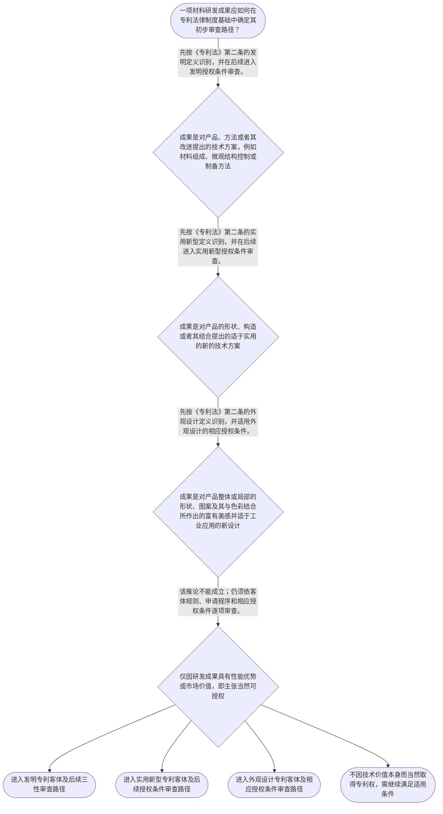

# 专家 A 教学草稿

> 专家：expert_a ｜ 风格：conservative

## 教学模块选择清单

- 当前教学节点：`patent-law-foundation`
- 板块预算：自适应 6/6，总计 9/9

| # | 模块 (block_type) | 类型 | 触发原因 (trigger) | 对应正文段 | 归属 |
|---:|---|:--:|---|---|:--:|
| 1 | `global_framework` | 自适应 | understanding=global(0.73) | 专利制度的全局位置｜本节点位于专利学习主线的起点：先确认专利制度保护什么、依据什么规范运行、为何要求公开与授权，… | [A] |
| 2 | `anchor_scenario` | 自适应 | perception=sensing(0.86) / cold_start | 材料研发成果如何进入专利制度｜某材料团队制得一种用于锂离子电池正极的复合涂层：涂层包含特定无机颗粒和聚合物粘结体系，并声称… | [A] |
| 3 | `legal_anchor` | 必选 | mandatory | 专利客体与授权条件的法条锚点｜《专利法》第二条 | [A] |
| 4 | `worked_example` | 自适应 | cognition.apply=0.34<0.4 / cognition.analyze=0.28<0.3 / cold_start | 复合涂层成果的制度定位｜某团队提交三组材料成果：第一组为具有特定层状结构的复合涂层材料；第二组为该涂层的烧结制备工艺… | [A] |
| 5 | `decision_flow` | 自适应 | input=visual(0.81) | 材料成果的初步分类流程｜一项材料研发成果应如何在专利法律制度基础中确定其初步审查路径？ | [A] |
| 6 | `reflect_prompt` | 自适应 | processing=reflective(0.69) | 从研发成果反观制度分类｜回看自己熟悉的一项材料研发成果：其中哪些内容是在解决技术问题，哪些内容主要呈现为产品视觉设计… | [A] |
| 7 | `assessment` | 必选 | mandatory | 本节三类测评｜复习三类专利保护客体的法定分类。 | [A] |
| 8 | `knowledge_synthesis` | 必选 | mandatory | 专利法律制度基础关系网｜专利权的基本特征：专利制度以法律授予的排他性权利为核心，但权利受期限和地域边界约束；本节点只… | [A] |
| 9 | `summary_card` | 自适应 | len(knowledge_sub_nodes)=3>=3 | 制度基础速查卡｜材料专利学习的起点是：按法定客体给研发成果定位，并以规范体系和授权条件建立后续审查坐标。 | [A] |

## 教学正文

## I — 法律问题

材料研发中的涂层、配方、结构改进、制备工艺和产品视觉设计，并不会因为具有性能优势而当然取得专利保护。本节首先解决的争点是：这些成果在中国专利法律制度中应如何定位，制度依据由哪些规范构成，以及为何后续还必须进入相应的授权条件审查。

## R — 适用规则

### 1. 专利制度的基本概念与特征

专利制度以国家依法授予的排他性权利为核心。理解该制度时，应同时把握三项边界：独占性说明权利具有排他效力；时间性说明权利并非永久存在；地域性说明权利的效力受授予国或地区法律边界限制。本节仅建立这三项概念框架，具体权利性质将在后续节点展开。

### 2. 中国专利制度的规范体系

中国专利制度以《专利法》确立基本规则和权利授予条件；《专利法实施细则》与《专利审查指南》在相应范围内细化申请、审查和操作标准。材料申请的分析应先回到法律规定的客体与条件，再以细则和指南核验程序及审查细节。

### 3. 三种专利保护客体

《专利法》第二条规定：发明，是指对产品、方法或者其改进所提出的新的技术方案；实用新型，是指对产品的形状、构造或者其结合所提出的适于实用的新的技术方案；外观设计，是指对产品整体或者局部的形状、图案或者其结合以及色彩与形状、图案的结合所作出的富有美感并适于工业应用的新设计。〔RAG: 中华人民共和国专利法.txt — 第二条：发明、实用新型、外观设计的法定定义〕

因此，材料组成、复合结构、制备方法等成果，应先从其是否为产品、方法或其改进的技术方案出发进行识别；产品壳体的图案、色彩等视觉呈现，则应按外观设计的定义另行分析。一个研发项目可以同时产生不同类型成果，不能以项目名称替代法定分类。

### 4. 制度作用与审查链条

专利制度通过对符合法定条件的发明创造提供保护，形成激励发明创造、促进技术公开、推动技术应用和经济发展的制度机制。对于材料研发团队，这意味着申请文件既是主张保护的载体，也是向社会公开技术信息的法律文件；研发成功只是起点，而非授权结论。

关于早期公开、延迟审查、初步审查制与实质审查制并存的具体历史和程序规则，检索上下文未提供直接依据。本节仅将其作为“公开、审查、授权”的制度链条理解，不据此作具体程序性判断。

### 5. 后续新颖性、创造性学习的法定入口

《专利法》第二十二条规定，授予专利权的发明和实用新型应当具备新颖性、创造性和实用性；其中，新颖性要求不属于现有技术且不存在法定的申请在先、公开在后情形，创造性则以与现有技术相比的法定标准判断。〔RAG: 中华人民共和国专利法.txt — 第二十二条：授予专利权的发明和实用新型，应当具备新颖性、创造性和实用性〕

本节只确立顺序：先识别成果属于何种法定客体，再进入申请程序和相应授权条件。新颖性、创造性、现有技术、抵触申请以及申请日和优先权日的具体判断规则，属于后续节点的主教学内容，不在本节展开。

## A — 规则适用

以复合电极涂层为例：若申请人主张的是涂层的材料组成、层状结构或烧结制备步骤，应先审查该主张是否体现了产品、方法或者其改进所提出的技术方案；这通常对应发明专利客体的分析入口。若主张的是电池外壳表面的图案和颜色搭配，则应转入外观设计的法定定义，而不能因该产品同时使用了新材料就当然按发明处理。

完成客体分类后，仍不得把循环寿命提高、导电率改善或市场前景良好直接当作授权结论。对发明和实用新型，第二十二条另行要求新颖性、创造性和实用性；材料领域后续的审查工作将围绕权利要求限定的技术方案进行。检索材料强调，创造性的判断应针对权利要求限定的技术方案整体进行评价，而不是仅评价某一个技术特征。〔RAG: 专利法专题讲座.txt — 创造性的判断应当针对权利要求限定的技术方案整体进行评价〕

## C — 结论

材料研发成果进入专利制度的第一步，不是直接判断“技术是否先进”，而是依法完成客体定位：产品、方法及其改进的技术方案与产品视觉设计适用不同定义。随后，发明和实用新型还须依据《专利法》第二十二条接受新颖性、创造性和实用性审查。掌握这一分层顺序，是后续学习材料领域新颖性和创造性判断的前提。

> 常见误区 / 易混淆点
>
> 1. “实验结果好，所以必然能授权”错误。技术效果可能具有事实意义，但不能取代法定客体识别和授权条件审查。
> 2. “属于发明客体，所以已具备新颖性和创造性”错误。客体判断与授权条件判断是不同层次。
> 3. “材料项目只能对应一种专利类型”错误。同一项目中的材料、工艺和产品视觉设计可能需要分别识别。
> 4. 对公开、审查制度的具体程序细节，应以对应法条、实施细则和审查指南核验；本节未取得直接检索依据的细节不作延伸结论。

本节设有测评，请到【习题】区作答。

### 专利制度的全局位置（global_framework）

**位置**：本节点是专利法律制度学习的起点；无前置节点，向后衔接申请程序、授权实质条件以及新颖性、创造性判断。

**前置**：无需前置专利法节点；可运用已有材料研发中“技术方案、效果、公开”的基本经验。

**后继**：patent-application-process（专利申请程序）；patentability-substantive（专利授权实质条件）；novelty（新颖性）；inventive-step（创造性）

**大局观**：本节点位于专利学习主线的起点：先确认专利制度保护什么、依据什么规范运行、为何要求公开与授权，再进入申请程序和发明、实用新型的实质授权条件。材料研发中的配方、结构、制备方法或器件改进，只有先放入正确的制度框架，后续才可严谨讨论新颖性、创造性及申请策略。

### 材料研发成果如何进入专利制度（anchor_scenario）

> 某材料团队制得一种用于锂离子电池正极的复合涂层：涂层包含特定无机颗粒和聚合物粘结体系，并声称可改善循环稳定性。团队计划同时保护涂层材料、制备工艺以及电池产品的外观方案。研发负责人认为“技术先进就应当都能申请专利”，但代理人首先要求区分：各项成果是否属于法定专利保护客体，以及后续应依据哪些规范、经过何种审查。

该场景中的材料性能数据说明技术研发价值，却不能替代专利法上的客体识别和授权条件审查；申请前还须防范公开行为对后续新颖性判断造成的影响。

**锚定**：该情境锚定“技术成果不当然等于专利权客体”，并引出三类专利客体与制度规则层级。

**先想一想**：面对涂层材料、制备方法和电池外观三个成果，应当先按照什么法律分类，再讨论是否可能获得专利保护？

### 专利客体与授权条件的法条锚点（legal_anchor）

- **《专利法》第二条**：第二条将可受专利制度保护的成果分为发明、实用新型和外观设计，并分别给出三者的法定定义。
- **《专利法》第二十二条**：第二十二条规定发明和实用新型获得专利权须具备新颖性、创造性和实用性，并界定现有技术。

**为何重要**：材料领域申请首先要把成果放入正确的保护客体类别；对于发明和实用新型，第二十二条是后续学习新颖性、创造性和实用性的法定入口。

### 复合涂层成果的制度定位（worked_example）

**案情/例题**：某团队提交三组材料成果：第一组为具有特定层状结构的复合涂层材料；第二组为该涂层的烧结制备工艺；第三组为电池壳体表面的图案与颜色组合。现仅需在制度基础层面识别每组成果应进入的法定客体分析路径，并说明为什么不能因材料性能优良而直接认定可授权。
**适用规则**：《专利法》第二条：发明是对产品、方法或者其改进所提出的新的技术方案；实用新型是对产品的形状、构造或者其结合所提出的适于实用的新的技术方案；外观设计是对产品整体或者局部的形状、图案或者其结合以及色彩与形状、图案的结合所作出的富有美感并适于工业应用的新设计。
**分步推演**：
1. 先将复合涂层材料和烧结制备工艺分别识别为产品技术方案与方法技术方案；第二条对发明的定义覆盖产品、方法及其改进。 → *材料和工艺首先进入发明专利客体分析。*
2. 再考察电池壳体表面的图案与颜色组合，其判断重点是产品整体或局部的视觉设计及工业应用，而不是材料电化学性能。 → *视觉设计应进入外观设计客体分析。*
3. 客体分类只回答成果处于何种专利保护类型；对发明和实用新型，第二十二条另设新颖性、创造性、实用性授权条件。 → *客体适格不等于当然授权。*
**结论**：该复合涂层及其制备工艺可先按“产品、方法或者其改进所提出的技术方案”审视其发明专利客体属性；电池壳体的视觉设计则应按外观设计的法定定义另行判断。仅完成客体分类并不等于已经满足新颖性、创造性和实用性等授权条件。
**本题要点**：材料专利分析先做“成果类型识别”，再进入相应的授权条件与审查程序。

### 材料成果的初步分类流程（decision_flow）

**决策问题**：一项材料研发成果应如何在专利法律制度基础中确定其初步审查路径？



### 从研发成果反观制度分类（reflect_prompt）

**反思问题**：回看自己熟悉的一项材料研发成果：其中哪些内容是在解决技术问题，哪些内容主要呈现为产品视觉设计；这一划分为什么会影响后续适用的专利规则？

**关注要点**：不要把“实验效果良好”直接替代法定客体判断。；同一研发项目可能包含产品、方法与外观等不同成果，应分别识别。；发明和实用新型的授权条件包括新颖性、创造性和实用性；其具体判断将在后续节点展开。

**连接**：连接学习者已有的材料研发经验：区分材料组成、制备工艺、器件结构和外观呈现分别对应的技术信息。

### 专利法律制度基础关系网（knowledge_synthesis）

**知识框架**：
- 专利权的基本特征：专利制度以法律授予的排他性权利为核心，但权利受期限和地域边界约束；本节点只建立概念框架，具体权利性质留待后续节点。
- 中国专利制度规范体系：专利法提供基本制度与授权条件，专利法实施细则和专利审查指南分别承担细化程序、审查标准的功能。
- 三种保护客体：第二条规定发明、实用新型、外观设计三类客体；材料配方、结构和制备工艺通常须先按其具体技术方案分析。
- 制度作用：专利制度通过授权激励、技术公开和技术应用服务创新与经济发展；这一功能解释了申请公开与审查制度的制度基础。
- 审查制度特点：本节点将“公开、审查、授权”理解为制度链条；有关早期公开、延迟审查、初步审查与实质审查的具体规则，检索上下文未提供直接依据，后续应以相应规范核验。
**概念关系**：先识别成果属于发明、实用新型或外观设计，再适用该类客体的授权条件与审查规则。；对于发明和实用新型，第二十二条中的新颖性、创造性、实用性是后续实质审查学习的法定入口。；专利法确立基本规则，实施细则与审查指南在法定授权范围内细化申请和审查操作。
**必记**：技术成果有价值，不等于当然属于可授权的专利客体，更不等于当然具备授权条件。；《专利法》第二条是三类专利客体的分类依据；《专利法》第二十二条是发明和实用新型三性要求的依据。；材料领域讨论新颖性和创造性前，应先明确所保护的是何种技术方案及其申请路径。

### 制度基础速查卡（summary_card）

**要点卡**：
- **专利权的基本特征**：专利权以法律授予的排他性为核心，并受到期限和地域的边界约束。
- **规范体系**：专利法定基本规则，实施细则与审查指南细化程序和审查操作。
- **三种保护客体**：发明、实用新型、外观设计是第二条规定的三类专利保护客体。
- **制度作用**：专利制度通过激励创造、技术公开和技术应用服务创新发展。
- **后续审查入口**：发明和实用新型能否授权，后续须依第二十二条审查新颖性、创造性和实用性。
**必背**：《专利法》第二条规定发明、实用新型和外观设计三类专利保护客体。；《专利法》第二十二条规定发明和实用新型应具备新颖性、创造性和实用性。；先识别客体，再进入申请程序和相应授权条件审查。
**一句话总结**：材料专利学习的起点是：按法定客体给研发成果定位，并以规范体系和授权条件建立后续审查坐标。

### 本节三类测评（assessment）

**三类覆盖**：backward_review、forward_probe、weakness_probe
**题目**：
- q1：复习三类专利保护客体的法定分类。
- q2：探测下一节点中发明专利申请文件的基础要求。
- q3：辨析材料技术价值、客体分类与授权条件之间的顺序。


## 结构化字段

## knowledge_points

```json
[
  {
    "node_id": "patent-law-foundation",
    "kc_name": "专利制度的基本概念与特征：独占性、时间性、地域性"
  },
  {
    "node_id": "patent-law-foundation",
    "kc_name": "中国专利制度体系：专利法、专利法实施细则、专利审查指南"
  },
  {
    "node_id": "patent-law-foundation",
    "kc_name": "专利保护的三种客体：发明、实用新型、外观设计"
  },
  {
    "node_id": "patent-law-foundation",
    "kc_name": "专利制度的作用：激励发明创造、促进技术公开、推动技术应用和经济发展"
  },
  {
    "node_id": "patent-law-foundation",
    "kc_name": "中国专利制度发展历程与特点：早期公开延迟审查、初步审查制与实质审查制并存"
  }
]
```

## legal_basis

```json
[
  {
    "article": "《专利法》第二条：发明、实用新型和外观设计的法定定义。",
    "source": "中华人民共和国专利法.txt"
  },
  {
    "article": "《专利法》第二十二条：发明和实用新型的授权条件，包括新颖性、创造性和实用性。",
    "source": "中华人民共和国专利法.txt"
  },
  {
    "article": "《专利法》第二十六条第一款：发明或者实用新型专利申请的文件要求。",
    "source": "中华人民共和国专利法.txt"
  }
]
```

## risks

```json
[
  {
    "risk": "将材料技术的性能优势、市场价值或实验成功直接等同于专利客体适格或当然可授权，遗漏客体分类与授权条件的分层判断。",
    "related_node_id": "patent-law-foundation"
  },
  {
    "risk": "混淆发明、实用新型和外观设计的法定客体边界，导致对材料、工艺和产品视觉设计适用错误的审查路径。",
    "related_node_id": "patent-law-foundation"
  },
  {
    "risk": "关于早期公开、延迟审查、初步审查制与实质审查制并存的具体历史与程序细节，检索上下文未提供直接依据，本节仅作制度链条定位，不作细则性结论。",
    "related_node_id": "patent-law-foundation"
  }
]
```

## draft_stage

```json
"debate"
```

## irac

```json
{
  "issue": "材料领域的涂层、配方、结构、制备工艺及产品视觉设计，如何在中国专利法律制度中完成初步客体定位，并建立进入后续新颖性、创造性审查的正确顺序？",
  "rule": "《专利法》第二条规定发明、实用新型和外观设计的定义。第二十二条规定授予发明和实用新型专利权应具备新颖性、创造性和实用性，并规定现有技术是申请日以前在国内外为公众所知的技术。",
  "application": "对于复合涂层、材料组成、微观结构改进和制备工艺，应先依据第二条判断其是否构成产品、方法或者其改进所提出的技术方案；对于产品表面的图案、色彩等视觉设计，应另循外观设计定义判断。完成客体定位后，发明和实用新型仍须进入第二十二条规定的新颖性、创造性和实用性审查，不能将性能优势直接推定为可授权。",
  "conclusion": "材料技术成果应先完成法定专利客体分类，再依相应规范和授权条件进入申请、审查路径；本节点不以材料性能或研发价值替代法律判断。"
}
```

## interactive_questions

```json
[
  {
    "qid": "q1",
    "category": "understand",
    "difficulty": "L1",
    "source_tag": "backward_review",
    "kc_node_id": "patent-law-foundation",
    "question": "关于中国专利保护客体的表述，正确的是哪一项？",
    "answer": "B",
    "options": [
      "A. 专利保护客体仅包括发明和实用新型，不包括外观设计。",
      "B. 专利保护客体包括发明、实用新型和外观设计。",
      "C. 任何具有经济价值的研发成果都当然属于专利保护客体。",
      "D. 材料技术成果只能申请实用新型专利。"
    ]
  },
  {
    "qid": "q2",
    "category": "remember",
    "difficulty": "L1",
    "source_tag": "forward_probe",
    "kc_node_id": "patent-application-process",
    "question": "某研发团队拟提交一件发明专利申请。下列文件中，依法属于应提交文件的是哪一项？",
    "answer": "A",
    "options": [
      "A. 请求书、说明书及其摘要、权利要求书等文件。",
      "B. 仅提交产品样品和性能检测报告。",
      "C. 仅提交发明人身份证明和产品照片。",
      "D. 仅提交权利要求书，不需要说明书。"
    ]
  },
  {
    "qid": "q3",
    "category": "analyze",
    "difficulty": "L3",
    "source_tag": "weakness_probe",
    "kc_node_id": "patent-law-foundation",
    "question": "材料企业就一种电极涂层提出申请。下列审查思路中，最符合专利法律制度基础框架的是哪一项？",
    "answer": "C",
    "options": [
      "A. 只要涂层循环性能明显优于现有产品，即可直接认定获得发明专利权。",
      "B. 只要技术方案属于发明客体，即可跳过新颖性、创造性和实用性审查。",
      "C. 应先识别涂层材料和制备工艺是否属于产品、方法或其改进的技术方案，再对发明专利申请适用相应授权条件审查。",
      "D. 电池壳体图案与颜色组合必然应按发明专利规则审查。"
    ]
  }
]
```

## knowledge_synthesis

```json
{
  "node": "patent-law-foundation",
  "coverage": [
    {
      "node_id": "patent-law-foundation"
    }
  ],
  "confusable_pairs": [
    {
      "pair": "技术成果具有性能优势，与该成果当然属于可授权专利客体，二者不可混同。"
    },
    {
      "pair": "发明专利客体识别，与发明专利授权三性审查，属于先后不同的判断层次。"
    },
    {
      "pair": "发明、实用新型与外观设计的法定定义不同，不能仅按研发项目名称归类。"
    }
  ]
}
```
