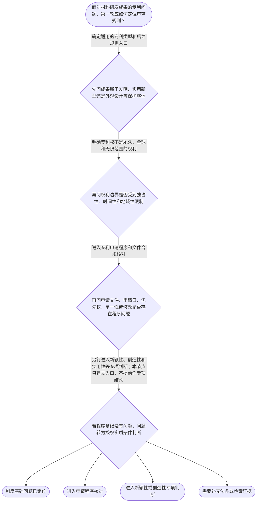

# 专家 B 教学草稿

> 专家：expert_b ｜ 风格：accessible

## 教学模块选择清单

- 当前教学节点：`patent-law-foundation`
- 板块预算：自适应 6/6，总计 9/9

| # | 模块 (block_type) | 类型 | 触发原因 (trigger) | 对应正文段 | 归属 |
|---:|---|:--:|---|---|:--:|
| 1 | `global_framework` | 自适应 | understanding=global(0.73) | 先看专利审查全地图｜专利法学习可以看成一条从制度到审查、再到权利保护的链条。本节点先建立总地图：专利制度为什么存… | — |
| 2 | `anchor_scenario` | 自适应 | perception=sensing(0.86) / cold_start | 从一项材料成果开始｜某材料公司的研发工程师开发出一种耐高温复合涂层，并准备把配方、制备方法和产品外观分别整理成申… | — |
| 3 | `legal_anchor` | 必选 | mandatory | 法条锚点：把制度落到规则｜《专利法》第二十八条 | — |
| 4 | `worked_example` | 自适应 | cognition.apply=0.34<0.4 / cognition.analyze=0.28<0.3 / cold_start | 材料申请案：四步整理法｜某公司完成一种耐热复合涂层及其制备方法，先在境外提交了相同主题的申请，后准备在中国提交。研发… | — |
| 5 | `decision_flow` | 自适应 | input=visual(0.81) | 把问题放进正确入口｜面对材料研发成果的专利问题，第一轮应如何定位审查规则？ | — |
| 6 | `reflect_prompt` | 自适应 | processing=reflective(0.69) | 把研发流程和法律流程对上号｜在材料研发中，你会把“做出了技术成果”“提交了专利申请”“获得了专利权”看成同一件事吗？复盘… | — |
| 7 | `assessment` | 必选 | mandatory | 三类测评｜识别专利法保护的三种客体 | — |
| 8 | `knowledge_synthesis` | 必选 | mandatory | 基础知识关系网｜patent-rights-nature：专利权具有独占性、时间性和地域性，分别说明权利排他… | — |
| 9 | `summary_card` | 自适应 | len(knowledge_sub_nodes)=3>=3 | 专利制度基础速查卡｜先认清专利保护什么、权利边界在哪里、规则由谁规定，再进入新颖性和创造性判断。 | — |

## 教学正文

## 1. 场景导入

某材料公司的研发工程师开发出一种耐热复合涂层，并准备把配方、制备方法和产品外观分别整理成申请文件。团队讨论时出现了三个不同问题：这种成果在专利法上属于哪类保护客体？即使申请成功，权利是否会永久有效、覆盖所有国家？后续审查又会依据哪些规则判断能否授权？这些问题都很重要，但要先分清制度基础、申请程序和后续实质审查的层次。

## 2. 人话解释

可以把专利制度想成一种“有限边界的技术交换”：申请人把技术方案写进申请文件并向社会公开，法律在一定条件下给予一段时间、一定地域和一定范围内的排他权。独占性回答“别人能不能未经许可实施”；时间性回答“这种排他权能持续多久”；地域性回答“在哪个法域内有效”。因此，专利权不是永久、全球、无限范围的权利。

材料研发成果进入专利制度时，先要识别保护客体。基础分类包括发明、实用新型和外观设计。三者不是材料成果的三个研发阶段，而是法律上的不同保护类型；具体适用哪一类，要看成果的技术内容和申请文件表达。关于三类客体的法条原文，本轮检索上下文没有直接提供，正式使用时应核对《专利法》第二条。

中国专利规则也不是只有一部法律。可以按“主干—程序—操作”理解：专利法提供基本制度，专利法实施细则细化申请和审查程序，专利审查指南为审查实践提供更具体的判断口径。初步审查、公布、实质审查等环节承担的任务不同，不能把“文件是否符合程序要求”和“技术是否具备新颖性、创造性”混成一个问题。

专利制度的作用，是在激励发明创造与促进技术公开之间建立平衡，并推动技术应用和经济发展。中国制度中还形成了早期公开、延迟审查，以及初步审查制和发明专利实质审查制并存等制度特点；这些内容是后续理解申请程序和审查节奏的背景，不等于本节已经完成新颖性或创造性判断。

## 3. 法条回扣

《专利法》第二十八条规定，国务院专利行政部门收到专利申请文件之日为申请日；申请文件邮寄的，以寄出的邮戳日为申请日。〔RAG: 中华人民共和国专利法.txt — 第二十八条：国务院专利行政部门收到专利申请文件之日为申请日；如果申请文件是邮寄的，以寄出的邮戳日为申请日〕

《专利法》第二十九条规定，发明或者实用新型在外国或中国第一次提出申请后，就相同主题在法定期限内提出后续申请的，可以依规定享有优先权。〔RAG: 中华人民共和国专利法.txt — 第二十九条：发明或者实用新型在外国第一次提出申请之日起十二个月内，或在中国第一次提出申请之日起十二个月内，就相同主题提出申请，可以享有优先权〕

《专利法》第三十一条确立申请单一性，并允许属于一个总的发明构思的多项发明或实用新型作为一件申请提出。〔RAG: 中华人民共和国专利法.txt — 第三十一条：一件发明或者实用新型专利申请应当限于一项发明或者实用新型；属于一个总的发明构思的两项以上可以作为一件申请提出〕

《专利法》第三十三条规定，发明和实用新型申请文件的修改不得超出原说明书和权利要求书记载的范围。〔RAG: 中华人民共和国专利法.txt — 第三十三条：对发明和实用新型专利申请文件的修改不得超出原说明书和权利要求书记载的范围〕

检索到的实施细则材料还显示，发明专利申请经初步审查后，除予以驳回的外，应当立即公布；申请人可以提出延迟审查请求，并可在规定阶段主动修改。〔RAG: 中华人民共和国专利法实施细则.txt — 第五十二条至第五十七条相关内容：申请公布、延迟审查请求及发明申请主动修改〕

## 4. 类比 / 口诀

可以记作“独时地，法细指；先客体，后程序，再三性”：独占性、时间性、地域性是专利权的三条边界；专利法、实施细则、审查指南是规则的三个层次；先识别保护客体，再核对申请程序，之后才进入新颖性、创造性和实用性等实质判断。

这个口诀只用于建立学习顺序，不能替代具体法条。尤其是“再三性”不表示三性在所有程序中机械地按同一顺序审查，也不表示本节已经给出新颖性或创造性的具体判断标准。

## 5. 应试提示

遇到材料领域专利题，先做三次定位：第一，看题目讨论的是发明、实用新型还是外观设计；第二，看它问的是权利边界、申请程序，还是授权实质条件；第三，再寻找对应法条和审查指南。看到“永久有效”“全球自动保护”“研发完成日就是申请日”等绝对化表述，要警惕其可能忽略时间性、地域性或法定申请日规则。遇到优先权、单一性和修改问题，则分别核对相同主题与期限、总的发明构思、原始记载范围。新颖性和创造性将在后续专项节点中学习，本节只建立正确入口。

## 6. 互动提问

请先在脑中把一项材料研发成果分别放入“保护客体”“权利边界”“申请程序”“实质审查”四个框，再到【习题】区完成选择题测评。

### 先看专利审查全地图（global_framework）

**位置**：位于专利学习主线的基础站，承接专利制度的入门认识，向申请程序、专利性、新颖性和创造性判断展开。

**后继**：patent-application-process（专利申请程序）；patentability-substantive（专利性实质条件）；novelty（新颖性）；inventive-step（创造性）

**大局观**：专利法学习可以看成一条从制度到审查、再到权利保护的链条。本节点先建立总地图：专利制度为什么存在、保护什么、权利具有什么边界，以及中国专利法、实施细则和审查指南如何共同构成规则体系。后续学习申请程序、实质审查、新颖性和创造性时，都会回到这张地图上定位问题。

### 从一项材料成果开始（anchor_scenario）

> 某材料公司的研发工程师开发出一种耐高温复合涂层，并准备把配方、制备方法和产品外观分别整理成申请文件。团队讨论时出现了三个不同问题：这种成果在专利法上属于哪类保护客体？即使申请成功，权利是否会永久有效、覆盖所有国家？后续审查又会依据哪些规则判断能否授权？这些问题看似都在问“能不能申请”，其实对应制度基础中的不同层次。

**锚定**：用材料研发成果锚定保护客体、专利权的独占性时间性地域性、中国专利制度体系及制度作用。

**先想一想**：面对一个材料研发成果，先不要判断新颖性或创造性，试着按“保护什么、权利有多大、规则从哪里来”三个角度整理问题。

### 法条锚点：把制度落到规则（legal_anchor）

- **《专利法》第二十八条**：申请日是判断许多法律期限和审查边界的重要时间基准；邮寄申请以寄出邮戳日确定。
- **《专利法》第二十九条**：优先权允许相同主题在法定期限内以更早的首次申请时间作为权利主张基础，但须依规定提出声明并提交文件副本。
- **《专利法》第三十一条**：一件申请通常围绕一项发明或实用新型，只有属于一个总的发明构思时，多个项目才可能合并。
- **《专利法》第三十三条**：申请文件可以修改，但不能把原始说明书和权利要求书没有记载的内容后来补进去。
- **《专利法实施细则》第五十四条至第五十七条**：发明申请经初步审查后通常予以公布，申请人可以依法提出延迟审查请求并在规定阶段主动修改。

**为何重要**：这些条文把专利制度从抽象理念落到申请日、申请范围、修改边界和审查程序上。关于专利客体、制度特征及新颖性和创造性的具体法条内容，本轮检索上下文没有提供直接原文，相关说明应以正式法条和审查指南进一步核验。

### 材料申请案：四步整理法（worked_example）

**案情/例题**：某公司完成一种耐热复合涂层及其制备方法，先在境外提交了相同主题的申请，后准备在中国提交。研发团队还想把涂层配方、制备方法和完全不同的包装外观写进同一份申请，并计划在审查意见答复时补入实验数据中原申请没有记载的新技术特征。需要演示如何按制度基础规则整理这些问题。
**适用规则**：《专利法》第二十八条、第二十九条、第三十一条和第三十三条；具体条文依据见检索来源中华人民共和国专利法.txt。
**分步推演**：
1. 先确认时间基准。中国申请的申请日原则上看国务院专利行政部门收到申请文件之日；如果邮寄，则看寄出邮戳日。这个日期会影响期限计算，但不能单凭研发完成日替代申请日。 → *第一步：先锁定申请日。*
2. 再核对优先权条件。境外首次申请与中国申请应当是相同主题，并且属于发明或实用新型的法定期限范围；还要按规定提出书面声明并提交首次申请文件副本。 → *第二步：再核对优先权的主题、期限和手续。*
3. 接着检查单一性。涂层配方和制备方法是否能够围绕一个总的发明构思，需要具体判断；完全不同的包装外观通常不能仅因同属一个项目就当然并入。 → *第三步：区分一个总的发明构思与简单拼接。*
4. 最后检查修改边界。答复审查意见时可以修改，但发明和实用新型申请文件的修改不得超出原说明书和权利要求书记载的范围；原申请没有记载的新技术特征不能靠后续修改直接补入。 → *第四步：修改必须留在原始记载范围内。*
**结论**：该材料成果可以先按技术主题拆分并核对申请文件边界：申请日由提交方式确定；若主张优先权，应核对首次申请、相同主题、期限及程序要求；若多个方案属于一个总的发明构思，才考虑合并申请；后续修改不得超出原始记载范围。新颖性和创造性是否成立，需进入相应实质审查规则后另行判断。
**本题要点**：处理材料专利申请基础问题时，按“申请日—优先权—单一性—修改边界”的顺序整理事实，再进入新颖性和创造性判断。

### 把问题放进正确入口（decision_flow）

**决策问题**：面对材料研发成果的专利问题，第一轮应如何定位审查规则？



### 把研发流程和法律流程对上号（reflect_prompt）

**反思问题**：在材料研发中，你会把“做出了技术成果”“提交了专利申请”“获得了专利权”看成同一件事吗？复盘时请分别想想每一步需要满足什么条件。

**关注要点**：研发完成、公开或提交申请的时间并不自动等同于法律上的申请日；专利权的独占性、时间性和地域性分别回答不同边界问题；申请文件程序合规与新颖性、创造性等实质条件属于不同审查层次

**连接**：连接到学习者已有的材料研发经验，以及后续将学习的申请程序、新颖性和创造性判断。

### 基础知识关系网（knowledge_synthesis）

**知识框架**：
- patent-rights-nature：专利权具有独占性、时间性和地域性，分别说明权利排他效果、存续期限和效力地域边界。
- patent-law-framework：中国专利制度以专利法为基本法律，并由专利法实施细则和专利审查指南等规则共同支撑。
- patent-system-overview：专利制度通过授予一定范围和期限的权利换取技术公开，服务于发明创造激励、技术应用和经济发展。
- 专利保护客体：专利法第二条所列发明、实用新型和外观设计是三类基本保护对象；本轮检索未提供该条原文，具体表述应以正式法条核验。
- 审查制度结构：中国专利审查包含初步审查和发明专利实质审查等不同环节；实施细则检索内容显示，发明申请经初步审查后通常予以公布，并存在延迟审查和主动修改安排。
**概念关系**：先确定保护客体，再理解权利的独占性、时间性和地域性边界。；制度目标解释为什么要公开技术并给予期限性、地域性的排他权。；专利法提供基本规则，实施细则细化程序，审查指南进一步提供审查操作标准。；制度基础建立的是审查入口和概念地图；新颖性与创造性属于后续专项节点，不能在本节点中混为一谈。
**必记**：专利权不是永久、全球且不受范围限制的权利，而是具有独占性、时间性和地域性。；专利制度的三类基本保护客体是发明、实用新型和外观设计，具体法条表述应以正式《专利法》第二条核验。；专利法、实施细则和审查指南共同构成学习中国专利审查规则时的主要制度框架。；申请程序问题与新颖性、创造性等实质审查问题应先分类，再分别适用规则。

### 专利制度基础速查卡（summary_card）

**要点卡**：
- **专利权三特征**：独占性说明排他使用，时间性说明有期限，地域性说明只在法定地域内有效。
- **三类保护客体**：发明、实用新型、外观设计是专利法基础分类，具体法条文字需核对正式文本。
- **制度规则层级**：专利法定基本框架，实施细则补程序，审查指南提供操作口径。
- **制度功能**：以有限期限和地域的权利换取技术公开，促进发明创造和技术应用。
- **审查环节**：初步审查与发明实质审查承担不同任务，不能把程序审查和实质判断混成一关。
**必背**：专利权具有独占性、时间性、地域性；专利保护客体包括发明、实用新型、外观设计；专利法、实施细则、专利审查指南构成制度规则框架；申请程序问题与新颖性、创造性问题要先分类处理
**一句话总结**：先认清专利保护什么、权利边界在哪里、规则由谁规定，再进入新颖性和创造性判断。

### 三类测评（assessment）

**三类覆盖**：backward_review、forward_probe、weakness_probe
**题目**：
- q_backward_01：识别专利法保护的三种客体
- q_forward_01：探测邮寄提交时申请日的确定规则
- q_weakness_01：辨析专利权独占性、时间性和地域性边界


## 结构化字段

## knowledge_points

```json
[
  {
    "node_id": "patent-law-foundation",
    "kc_name": "专利制度的基本概念与特征：独占性、时间性、地域性"
  },
  {
    "node_id": "patent-law-foundation",
    "kc_name": "中国专利制度体系：专利法、专利法实施细则、专利审查指南"
  },
  {
    "node_id": "patent-law-foundation",
    "kc_name": "专利保护的三种客体：发明、实用新型、外观设计"
  },
  {
    "node_id": "patent-law-foundation",
    "kc_name": "专利制度的作用：激励发明创造、促进技术公开、推动技术应用和经济发展"
  },
  {
    "node_id": "patent-law-foundation",
    "kc_name": "中国专利制度发展历程与特点：早期公开延迟审查、初步审查制与实质审查制并存"
  }
]
```

## legal_basis

```json
[
  {
    "article": "《专利法》第二十八条",
    "source": "中华人民共和国专利法.txt：收到专利申请文件之日为申请日；邮寄的以寄出邮戳日为申请日"
  },
  {
    "article": "《专利法》第二十九条",
    "source": "中华人民共和国专利法.txt：相同主题申请在法定期限内可依规定享有优先权"
  },
  {
    "article": "《专利法》第三十一条",
    "source": "中华人民共和国专利法.txt：一件发明或实用新型申请的单一性及总的发明构思规则"
  },
  {
    "article": "《专利法》第三十三条",
    "source": "中华人民共和国专利法.txt：申请文件修改不得超出原说明书和权利要求书记载范围"
  },
  {
    "article": "《专利法实施细则》第五十四条至第五十七条",
    "source": "中华人民共和国专利法实施细则.txt：申请公布、公众意见、延迟审查和主动修改程序"
  }
]
```

## risks

```json
[
  {
    "risk": "检索上下文未提供《专利法》第二条、第二十二条以及新颖性和创造性审查指南的直接原文，不能将本轮教学当作这些专项规则的完整法条讲解。",
    "related_node_id": "patent-law-foundation"
  },
  {
    "risk": "学习者可能把本节点的制度基础与新颖性判断混同；后续必须补充申请日、现有技术和抵触申请的时间轴及单独对比规则。",
    "related_node_id": "novelty"
  },
  {
    "risk": "学习者可能提前把多份材料文献的组合用于新颖性判断；创造性三步法应在后续节点依据正式审查指南单独讲授。",
    "related_node_id": "inventive-step"
  }
]
```

## draft_stage

```json
"debate"
```

## irac

```json
{
  "issue": "学习材料领域专利审查前，需要先明确专利制度保护的对象、专利权边界、规则来源及审查环节。",
  "rule": "检索材料明确提供《专利法》第二十八条至第三十三条及《专利法实施细则》第五十四条至第五十七条的申请日、优先权、单一性、修改、公布和审查程序规则；其他基础结论以当前知识图为教学框架，并标明证据边界。",
  "application": "本轮依据检索到的专利法和实施细则材料，建立申请程序、制度层级和审查环节的基础认识；对于专利法第二条以及新颖性、创造性的具体判断，本轮检索上下文未提供直接原文，暂不作超出证据的具体法条断言。",
  "conclusion": "本节点的结论是建立专利制度基础地图，而不是完成新颖性或创造性判断。后续应在取得相应法条和审查指南依据后学习单独对比、组合对比及时间轴规则。"
}
```

## interactive_questions

```json
[
  {
    "qid": "q_backward_01",
    "category": "remember",
    "difficulty": "L1",
    "source_tag": "backward_review",
    "kc_node_id": "patent-law-foundation",
    "question": "根据专利法律制度基础，下列哪一组属于专利法所称的三种保护客体？",
    "answer": "B",
    "options": [
      "A.发明、方法、商业模式",
      "B.发明、实用新型、外观设计",
      "C.产品、方法、合同",
      "D.技术秘密、商标、外观设计"
    ]
  },
  {
    "qid": "q_forward_01",
    "category": "remember",
    "difficulty": "L1",
    "source_tag": "forward_probe",
    "kc_node_id": "patent-application-process",
    "question": "按照《专利法》第二十八条，专利申请文件以邮寄方式提交时，申请日通常如何确定？",
    "answer": "A",
    "options": [
      "A.以寄出的邮戳日为申请日",
      "B.以研发完成日为申请日",
      "C.以申请人内部立项日为申请日",
      "D.以公开日为申请日"
    ]
  },
  {
    "qid": "q_weakness_01",
    "category": "analyze",
    "difficulty": "L3",
    "source_tag": "weakness_probe",
    "kc_node_id": "patent-law-foundation",
    "question": "某材料研发团队认为，只要技术方案具有独占性，就当然可以获得永久且全球有效的专利权。下列判断最准确的是？",
    "answer": "C",
    "options": [
      "A.专利权一经授予就永久有效，并自动覆盖全球",
      "B.专利权只有独占性，没有时间性和地域性",
      "C.专利权具有独占性、时间性和地域性，具体效力受授权范围、期限和地域限制",
      "D.专利权只要来自材料研发成果，就不受申请文件和法律制度限制"
    ]
  }
]
```

## knowledge_synthesis

```json
{
  "node": "patent-law-foundation",
  "coverage": [
    {
      "node_id": "patent-rights-nature"
    },
    {
      "node_id": "patent-law-framework"
    },
    {
      "node_id": "patent-law-foundation"
    },
    {
      "node_id": "patent-system-overview"
    }
  ],
  "confusable_pairs": []
}
```

## exercises

```json
[
  {
    "question": null,
    "answer": null,
    "options": null
  }
]
```
