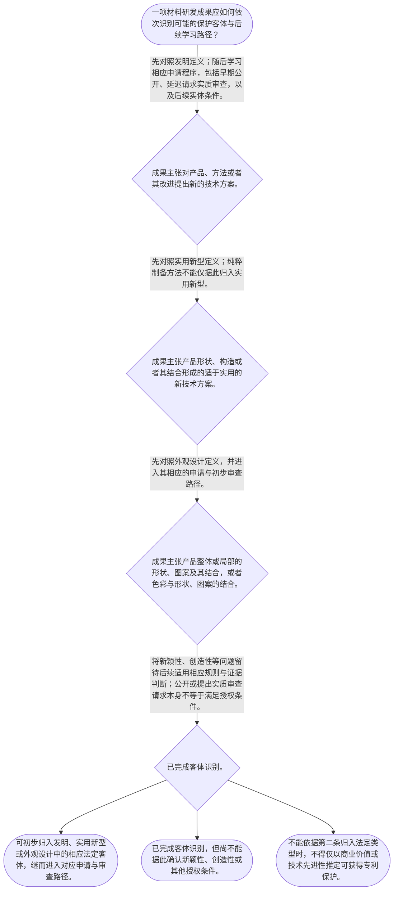

# 整合后的课程完整内容与习题

## 教学模块选择清单

- 当前教学节点：`patent-law-foundation`
- 板块预算：自适应 5/6，总计 9/9

| # | 模块 (block_type) | 类型 | 触发原因 (trigger) | 对应正文段 | 归属 |
|---:|---|:--:|---|---|:--:|
| 1 | `global_framework` | 自适应 | understanding=global(0.73) | 专利审查学习地图｜学习路线是：制度目的与权利边界→法定保护客体→中国专利制度的发展与审查路径→后续授权条件。当… | [A+B融合] |
| 2 | `anchor_scenario` | 自适应 | perception=sensing(0.86) / cold_start | 一套材料成果，先识别保护对象｜某团队开发耐高温复合涂层，准备保护材料配方、制备工艺、产品结构和包装图案。团队希望直接讨论该… | [B] |
| 3 | `legal_anchor` | 必选 | mandatory | 制度基础的法条锚点｜《中华人民共和国专利法》第一条 | [A+B融合] |
| 4 | `worked_example` | 自适应 | cognition.apply=0.35<0.4 / cognition.analyze=0.26<0.3 / cold_start | 从材料成果到法定保护客体｜团队拟保护电极涂层的特定组成与性能、分段升温烧结工艺以及电池包装表面的装饰图案。应先如何定位… | [A+B融合] |
| 5 | `decision_flow` | 自适应 | input=visual(0.81) | 保护客体识别流程｜一项材料研发成果应如何依次识别可能的保护客体与后续学习路径？ | [A+B融合] |
| 6 | `reflect_prompt` | 自适应 | processing=reflective(0.69) | 把制度框架映射到研发记录｜回看一项熟悉的材料研发项目，尝试在研发记录中区分技术方案事实、产品结构事实、视觉设计事实、申… | [B] |
| 7 | `assessment` | 必选 | mandatory | 本节三类测评索引｜复习《专利法》第二条规定的三种发明创造类型。 | [A+B融合] |
| 8 | `knowledge_synthesis` | 必选 | mandatory | 制度基础的五层框架｜制度目的：保护合法权益、鼓励发明创造、推动应用、提高创新能力，并促进科学技术进步和经济社会发… | [A+B融合] |
| 9 | `summary_card` | 自适应 | len(knowledge_sub_nodes)=3>=3 | 专利制度基础速查卡｜材料专利审查学习的第一步，是依法识别拟保护对象和对应制度路径，再进入申请程序与后续授权条件判… | [A+B融合] |

## 教学正文

## 专利审查学习地图

材料领域的专利申请，后续确实要重点学习新颖性和创造性；但在进入比较现有技术之前，必须先确定拟保护的对象和它所在的审查路径。本节点的主线是：**制度目的与权利边界 → 法定保护客体 → 中国专利制度的形成与审查路径 → 后续授权条件**。

专利制度的立法宗旨包括保护专利权人的合法权益、鼓励发明创造、推动发明创造的应用、提高创新能力，并促进科学技术进步和经济社会发展。〔RAG: 专利法律知识详细解读.txt — 现行《专利法》的第一条明确了制定专利法的立法宗旨，即保护专利权人的合法权益，鼓励发明创造，推动发明创造的应用，提高创新能力，促进科学技术进步和经济社会发展〕制度可以概括为“以公开换保护”：技术内容公开后，权利人在法定范围内获得保护，公众则可以据此减少重复投入并继续创新。〔RAG: 专利法律知识详细解读.txt — 专利权的取得的本质是“以公开换保护”〕

这里的保护并不是对技术思想的全球、永久占有。学习时先记住三项边界：**独占性、时间性、地域性**。独占性表示保护具有排他效果；时间性和地域性表示这一效果受法定期限和地域范围限制。具体权利范围留待 patent-rights-nature 节点展开。

## 法定保护客体

中国专利制度以《专利法》为基本法律依据，实施细则和审查指南承担细化功能。检索上下文未提供后二者原文，因此本节不对其具体条款作展开。国务院专利行政部门负责管理全国专利工作，统一受理和审查专利申请，并依法授予专利权。〔RAG: 中华人民共和国专利法.txt — 第三条：国务院专利行政部门负责管理全国的专利工作；统一受理和审查专利申请，依法授予专利权〕

《专利法》第二条规定，发明创造包括发明、实用新型和外观设计。〔RAG: 中华人民共和国专利法.txt — 第二条：本法所称的发明创造是指发明、实用新型和外观设计〕三类对象必须分开识别：

- **发明**：对产品、方法或者其改进所提出的新的技术方案。材料组成、材料产品、制备工艺及其改进，应先按这一定义核对。〔RAG: 中华人民共和国专利法.txt — 发明，是指对产品、方法或者其改进所提出的新的技术方案〕
- **实用新型**：对产品的形状、构造或者其结合所提出的适于实用的新的技术方案。纯粹制备方法不能仅因具有技术效果就直接归入实用新型。〔RAG: 中华人民共和国专利法.txt — 实用新型，是指对产品的形状、构造或者其结合所提出的适于实用的新的技术方案〕
- **外观设计**：对产品整体或者局部的形状、图案或者其结合，以及色彩与形状、图案的结合所作出的富有美感并适于工业应用的新设计。〔RAG: 中华人民共和国专利法.txt — 外观设计，是指对产品的整体或者局部的形状、图案或者其结合以及色彩与形状、图案的结合所作出的富有美感并适于工业应用的新设计〕

对于材料研发，最稳妥的做法是先拆分成果：材料产品本身、材料制备方法、产品结构改进、产品外观设计分别记录。不要用“这是一项材料技术”代替法律对象识别。一个研发项目中可以同时出现不同对象，它们未必适用同一类型或同一路径。

## 中国专利制度的发展与审查路径

中国专利制度并非一开始就具有今天的完整结构。检索材料记载，我国于1984年制定第一部专利法，并自1985年4月1日起施行；该法在同一部法律中规定了发明、实用新型和外观设计三种专利类型，并确立了先申请制。〔RAG: 专利法律知识详细解读.txt — 1984年3月12日制定专利法，自1985年4月1日起施行；首部专利法具有同一部法律包含三种专利类型、专利申请制度确立为先申请制的特点〕此后，专利法经过多次修改，逐步扩大保护范围、完善审查和确权程序，并加强与国际条约的衔接。〔RAG: 专利法律知识详细解读.txt — 1984年制定后我国对《专利法》进行了四次修改，逐步深化与国际条约规定的一致性〕

制度发展中的一个重要特点，是不同专利类型并存而审查深度不同：发明专利采用初步审查与实质审查相结合的制度；实用新型和外观设计主要采用初步审查制。〔RAG: 专利法律知识详细解读.txt — 发明专利的授权需要经过初步审查、实质审查两个阶段；实用新型和外观设计专利申请经过初步审查没有发现驳回理由的，即可以授予专利权〕

发明专利还体现出“早期公开、延迟审查”的程序特点。符合要求的发明专利申请通常自申请日起满十八个月公布，申请人可以请求早日公布；申请人可以在申请日起三年内请求实质审查。〔RAG: 中华人民共和国专利法.txt — 第三十四条：符合要求的发明专利申请自申请日起满十八个月即行公布，国务院专利行政部门可以根据申请人的请求早日公布其申请；第三十五条：发明专利申请自申请日起三年内可以请求实质审查〕因此，“早期公开”是相对于授权而言先公开申请内容，“延迟审查”是实质审查请求和实际审查时间不必与申请、公布同时发生；二者共同形成发明专利的公开与实质审查安排。早期公开不等于已经授权，提出实质审查请求也不等于已经满足新颖性、创造性等授权条件。

这一制度特点与初步审查制、实质审查制并不是互相排斥的概念：初步审查和实质审查回答审查深度与阶段问题；早期公开和延迟审查回答发明申请何时向公众公开、何时进入实质审查的问题。实用新型和外观设计主要经过初步审查，并不因此当然适用发明专利的全部程序安排。

## 审查路径与后续判断

检索材料记载，发明专利的授权需要经过初步审查与实质审查两个阶段；实用新型和外观设计专利申请经初步审查没有发现驳回理由的，可以授予专利权。发明申请通常先公开，再在申请人请求后进入实质审查，但公开和实质审查都不能替代对法定授权条件的判断。

可以按以下顺序处理材料成果：

1. **先问对象**：拟保护的是产品或方法技术方案、产品结构，还是产品视觉设计。
2. **再问路径**：分别对照发明、实用新型、外观设计的法定定义，确定可能的申请与审查路径，并识别发明申请的早期公开、延迟实质审查特点。
3. **最后看门槛**：在对象和路径明确后，再进入申请程序以及适用于相应对象的授权条件判断。

这可以用一句口诀辅助记忆：**先认东西，再走程序，公开在前、审查可延，最后看对应门槛。**口诀只帮助记住制度层次，不能替代对权利要求、实际拟保护内容和法定条件的具体比对。

例如，耐高温复合涂层的特定组成和性能、该涂层的烧结工艺，以及产品包装的装饰图案，应当先拆开。涂层组成和烧结工艺如构成产品或方法的技术方案，先对照发明定义；包装图案如主张视觉设计，先对照外观设计定义；若主张的是产品形状、构造的技术改进，再对照实用新型定义。仅凭“材料性能好”不能直接得出新颖性或创造性结论，也不能因为发明申请已经公开或已经提出实质审查请求，就直接认定其必然授权。

新颖性、创造性学习将从这一步继续展开。检索材料载明，现有技术是申请日以前在国内外为公众所知的技术；申请日当天公开的技术不属于该申请的现有技术时间界限。〔RAG: 专利法律知识详细解读.txt — 本法所称现有技术，是指申请日以前在国内外为公众所知的技术；申请日以前公开的技术内容构成现有技术，申请日当天公开的技术内容不属于现有技术〕本节只建立其制度位置，不提前作具体事实判断。

## 本节结论

材料领域专利审查的基础不是先判断技术“先进不先进”，而是先完成制度目的、权利边界、法定保护客体、中国专利制度发展特点和审查路径的定位。中国专利制度自1984年制定、1985年施行以来逐步发展完善；现行制度下，发明专利具有早期公开、延迟实质审查的特点，并与实用新型、外观设计的初步审查制并存。发明、实用新型和外观设计的定义不同；材料产品、制备方法、结构改进和视觉设计不得混同。完成客体识别后，才进入申请程序以及新颖性、创造性等后续授权条件的具体学习。

本节设有测评，请到【习题】区作答。

### 专利审查学习地图（global_framework）

**位置**：本节点是专利审查学习的起点，先解决“保护什么、由谁审查、审查制度如何分层”。

**后继**：patent-application-process（专利申请程序）；patentability-substantive（专利授权实质条件）；novelty（新颖性）；inventive-step（创造性）

**大局观**：学习路线是：制度目的与权利边界→法定保护客体→中国专利制度的发展与审查路径→后续授权条件。当前节点只建立入口框架；新颖性、创造性的具体判断留在后续节点。中国制度自1984年制定、1985年施行，形成发明实质审查与实用新型、外观设计初步审查并存的特点，发明申请还具有早期公开、延迟实质审查的程序安排。

### 一套材料成果，先识别保护对象（anchor_scenario）

> 某团队开发耐高温复合涂层，准备保护材料配方、制备工艺、产品结构和包装图案。团队希望直接讨论该方案是否具有新颖性、创造性，但首先必须拆开确认：每一项拟保护内容究竟是产品或方法技术方案、产品结构，还是产品视觉设计；如果申请发明专利，还要理解早期公开与延迟进入实质审查的制度安排。

**锚定**：材料研发中的同一项目往往同时含有不同法律对象；该场景突出“先识别对象，再进入程序和授权条件”的顺序，并把发明申请的早期公开、延迟实质审查放入制度背景。

**先想一想**：把一项材料成果拆成配方、工艺、结构、外观后，为什么不能只因“技术先进”就直接确定专利类型或授权结论？发明申请的公开与实质审查又分别处于什么位置？

### 制度基础的法条锚点（legal_anchor）

- **《中华人民共和国专利法》第一条**：专利制度旨在保护专利权人的合法权益、鼓励发明创造、推动应用、提高创新能力，并促进科学技术进步和经济社会发展。
- **《中华人民共和国专利法》第二条**：发明创造包括发明、实用新型和外观设计，三类客体具有不同法定定义。
- **《中华人民共和国专利法》第三条**：对发明和实用新型而言，第二十二条规定其应具备新颖性、创造性和实用性；外观设计适用相应的法定授权条件。
- **《中华人民共和国专利法》第二十二条**：发明申请通常自申请日起满十八个月公布，申请人可以请求早日公布，并可在申请日起三年内请求实质审查，体现早期公开、延迟审查的程序特点。
- **《中华人民共和国专利法》第三十四条、第三十五条**：中国专利制度自1984年制定、1985年施行，形成发明实质审查与实用新型、外观设计初步审查并存的制度结构。

**为何重要**：材料领域后续的新颖性、创造性学习以确定的申请对象为前提。检索上下文未提供《专利法实施细则》与《专利审查指南》原文，本节只说明其在制度体系中的细化作用，不对具体条款作断言；发明申请的公开和实质审查也不能被误认为已经满足授权条件。

### 从材料成果到法定保护客体（worked_example）

**案情/例题**：团队拟保护电极涂层的特定组成与性能、分段升温烧结工艺以及电池包装表面的装饰图案。应先如何定位这些成果？
**适用规则**：《中华人民共和国专利法》第二条：发明面向产品、方法或者其改进的新的技术方案；实用新型面向产品形状、构造或者其结合的适于实用的新的技术方案；外观设计面向产品整体或局部的视觉设计。发明申请还具有早期公开、延迟请求实质审查的程序特点。
**分步推演**：
1. 先按拟保护内容拆分材料产品、制备方法和视觉设计，不能把整套研发成果笼统看作一个法律对象。 → *先拆成果。*
2. 材料产品组成与烧结工艺分别可能属于产品或方法的技术方案，应先对照发明定义。 → *技术方案先对照发明。*
3. 包装装饰图案若主张视觉呈现，应对照外观设计定义；若主张产品形状、构造的技术改进，则另行对照实用新型定义。 → *视觉设计与结构改进分别判断。*
4. 确定可能客体后才进入申请程序与相应授权条件；发明申请的公开、实质审查请求属于程序安排，不能以此替代新颖性或创造性判断。 → *对象识别先于后续审查。*
**结论**：材料配方和制备方法如构成产品、方法或其改进的技术方案，应先按发明定义识别；仅涉及产品形状、构造或其结合的方案，才对照实用新型；仅涉及产品视觉设计的方案，才对照外观设计。客体识别以及发明申请已经公开或请求实质审查，都不能单独得出新颖性、创造性结论。
**本题要点**：口诀是“先问对象，再问路径”：技术方案、结构、视觉分别对应不同的法定客体；发明申请还要记住“先公开、后可请求实审”的程序特点。口诀只帮助记忆，不能替代权利要求与法条的具体比对。

### 保护客体识别流程（decision_flow）

**决策问题**：一项材料研发成果应如何依次识别可能的保护客体与后续学习路径？



### 把制度框架映射到研发记录（reflect_prompt）

**反思问题**：回看一项熟悉的材料研发项目，尝试在研发记录中区分技术方案事实、产品结构事实、视觉设计事实、申请公开与实质审查程序事实，以及后续授权条件所需的证据事实。

**关注要点**：技术效果不当然决定专利类型。；产品、方法、结构和视觉设计可能对应不同法律对象。；客体识别回答“保护什么”，新颖性、创造性回答“是否满足后续授权条件”。；发明申请公开和请求实质审查属于程序安排，不等于已经授权。；“公开换保护”是制度逻辑，不等于公开后当然授权。

**连接**：连接学习者熟悉的材料配方、制备工艺、产品结构和产品外观记录，并为后续申请程序、新颖性、创造性节点建立分类基础。

### 制度基础的五层框架（knowledge_synthesis）

**知识框架**：
- 制度目的：保护合法权益、鼓励发明创造、推动应用、提高创新能力，并促进科学技术进步和经济社会发展。
- 权利特征：专利保护具有独占性、时间性和地域性；“以公开换保护”说明制度的基本交换逻辑。
- 规范体系：专利法是基本法律依据，实施细则与审查指南承担细化功能；本节未取得后二者原文。
- 三类客体：发明面向产品、方法或其改进的技术方案；实用新型面向产品形状、构造或其结合；外观设计面向产品整体或局部的视觉设计。
- 制度发展与审查特点：中国于1984年制定专利法、1985年施行，首部专利法即规定三种专利类型并确立先申请制；现行制度形成发明实质审查与实用新型、外观设计初步审查并存的结构。发明申请通常自申请日起满十八个月公布，申请人可以请求早日公布，并可在申请日起三年内请求实质审查，体现早期公开、延迟审查的特点。
**概念关系**：先识别制度功能和权利边界，再按第二条识别客体，随后进入申请程序与后续授权条件。；保护客体判断回答申请对象是什么；新颖性、创造性判断回答相应对象是否满足后续授权条件。；发明申请的早期公开、延迟实质审查与发明实质审查制相互衔接；实用新型和外观设计主要采用初步审查，体现不同专利类型审查深度并存。；中国专利制度的发展历程说明现行三类客体和不同审查路径具有制度演进背景，但历史概括不能替代对现行法条、实施细则和审查指南的核对。
**必记**：《专利法》第二条所称发明创造包括发明、实用新型和外观设计。；材料产品、制备方法、产品结构改进和产品外观不得混同。；专利权具有独占性、时间性、地域性；公开换保护不是公开即授权。；中国专利制度自1984年制定、1985年施行，形成三种专利类型并存以及发明实质审查、实用新型和外观设计初步审查并存的特点。；发明申请通常早期公开，申请人可以在法定期间内请求实质审查；公开或请求实质审查不等于已经满足授权条件。；识别顺序是“先问对象，再问路径”，然后才进入后续授权条件。

### 专利制度基础速查卡（summary_card）

**要点卡**：
- **制度目的**：保护合法权益、鼓励创造、推动应用，并促进科技进步和经济社会发展。
- **权利边界**：专利保护具有独占性、时间性和地域性，不是全球永久权利。
- **规范体系**：专利法提供基本法律依据，实施细则和审查指南承担细化规则功能。
- **三类客体**：发明、实用新型、外观设计的法定定义不同，必须逐项识别。
- **制度发展**：中国专利法1984年制定、1985年施行，形成三种专利类型和不同审查制度并存的格局。
- **审查路径**：发明申请通常早期公开、延迟请求实质审查；实用新型和外观设计主要实行初步审查。
- **记忆线索**：先问对象：技术方案、结构还是视觉；再问路径：对应哪一类客体；最后看授权门槛。
**必背**：发明创造包括发明、实用新型和外观设计。；发明对应产品、方法或其改进的技术方案；实用新型对应产品形状、构造或其结合；外观设计对应产品视觉设计。；中国专利制度自1984年制定、1985年施行，发明申请通常具有早期公开、延迟实质审查特点，与实用新型、外观设计的初步审查制并存。；客体识别不等于新颖性、创造性判断。；公开换保护不等于公开即授权，排他保护也受时间和地域限制。
**一句话总结**：材料专利审查学习的第一步，是依法识别拟保护对象和对应制度路径，再进入申请程序与后续授权条件判断。

### 本节三类测评索引（assessment）

**三类覆盖**：backward_review、forward_probe、weakness_probe
**题目**：
- foundation-backward-l1-1：复习《专利法》第二条规定的三种发明创造类型。
- application-forward-l1-1：仅探测下一节点中申请日的基本确定规则。
- foundation-weakness-l3-1：辨析保护客体识别、审查路径与后续授权条件的关系。


## 结构化数据

## expert

```json
"A+B融合"
```

## style

```json
"fused"
```

## knowledge_points

```json
[
  {
    "node_id": "patent-law-foundation",
    "kc_name": "专利制度的基本概念与特征：独占性、时间性、地域性"
  },
  {
    "node_id": "patent-law-foundation",
    "kc_name": "中国专利制度体系：专利法、专利法实施细则、专利审查指南"
  },
  {
    "node_id": "patent-law-foundation",
    "kc_name": "专利保护的三种客体：发明、实用新型、外观设计"
  },
  {
    "node_id": "patent-law-foundation",
    "kc_name": "专利制度的作用：激励发明创造、促进技术公开、推动技术应用和经济发展"
  },
  {
    "node_id": "patent-law-foundation",
    "kc_name": "中国专利制度发展历程与特点：早期公开延迟审查、初步审查制与实质审查制并存"
  }
]
```

## legal_basis

```json
[
  {
    "article": "《中华人民共和国专利法》第一条",
    "source": "专利法律知识详细解读.txt：现行《专利法》第一条立法宗旨的转述"
  },
  {
    "article": "《中华人民共和国专利法》第二条",
    "source": "中华人民共和国专利法.txt：第二条原文"
  },
  {
    "article": "《中华人民共和国专利法》第三条",
    "source": "中华人民共和国专利法.txt：第三条原文"
  },
  {
    "article": "《中华人民共和国专利法》第二十二条",
    "source": "专利法律知识详细解读.txt：第二十二条关于发明和实用新型新颖性、创造性及现有技术的说明"
  },
  {
    "article": "《中华人民共和国专利法》第三十四条、第三十五条",
    "source": "中华人民共和国专利法.txt及专利法专题讲座.txt：发明申请公开与实质审查请求的说明"
  },
  {
    "article": "中国专利制度制定与修改历程",
    "source": "专利法律知识详细解读.txt：1984年制定、1985年施行及后续修改的制度说明"
  },
  {
    "article": "发明专利实质审查制、实用新型和外观设计初步审查制的制度说明",
    "source": "专利法律知识详细解读.txt：1936、1938"
  }
]
```

## risks

```json
[
  {
    "risk": "将材料技术成果的保护客体识别误认为新颖性或创造性判断；应先依第二条确定法律对象，再在后续节点审查授权实质条件。",
    "related_node_id": "patent-law-foundation"
  },
  {
    "risk": "将材料配方、制备方法、产品结构改进和产品外观混为同一类型，导致申请类型与审查路径定位失准。",
    "related_node_id": "patent-law-foundation"
  },
  {
    "risk": "将“以公开换保护”误解为公开后当然授权，或将排他性误解为全球、永久的无限权利。",
    "related_node_id": "patent-law-foundation"
  },
  {
    "risk": "将早期公开、提出实质审查请求误解为已经完成实质审查或已经满足新颖性、创造性条件。",
    "related_node_id": "patent-law-foundation"
  },
  {
    "risk": "将中国专利制度的历史特点与现行具体程序规则混同；制度发展历程只能依据检索材料概括，具体程序仍应核对现行法条、实施细则和审查指南。",
    "related_node_id": "patent-law-framework"
  }
]
```

## draft_stage

```json
"integration"
```

## irac

```json
{
  "issue": "材料领域研发成果进入中国专利制度时，应如何先识别法定保护客体和审查制度，并与后续新颖性、创造性判断衔接？",
  "rule": "《中华人民共和国专利法》第二条规定，发明创造是指发明、实用新型和外观设计；三者分别以产品、方法或其改进的技术方案，产品形状、构造或其结合的技术方案，以及产品整体或局部的视觉设计为法定对象。〔RAG: 中华人民共和国专利法.txt — 第二条：本法所称的发明创造是指发明、实用新型和外观设计〕《中华人民共和国专利法》第三条规定，国务院专利行政部门统一受理和审查专利申请，依法授予专利权。〔RAG: 中华人民共和国专利法.txt — 第三条：统一受理和审查专利申请，依法授予专利权〕第三十四条、第三十五条体现发明专利申请早期公开、延迟请求实质审查的程序安排。〔RAG: 中华人民共和国专利法.txt — 第三十四条规定申请日起满十八个月公布，第三十五条规定申请日起三年内可以请求实质审查〕",
  "application": "对于材料研发成果，应先将材料产品、制备方法、产品结构和产品外观拆分。构成产品、方法或其改进的技术方案者先对照发明定义；涉及产品形状、构造或其结合者先对照实用新型定义；涉及产品整体或局部视觉设计者先对照外观设计定义。对象识别后，才进入申请程序以及后续授权实质条件的判断。中国专利制度自1984年制定、1985年施行，并形成发明实质审查与实用新型、外观设计初步审查并存的制度特点；发明申请通常先公开，之后可在法定期间内请求实质审查。",
  "conclusion": "材料领域专利审查学习应先建立制度目的、权利边界、法定客体、制度发展和审查路径框架。客体识别、申请公开及实质审查程序，与后续新颖性、创造性判断是前后衔接但不能互相替代的环节。"
}
```

## interactive_questions

```json
[
  {
    "qid": "foundation-backward-l1-1",
    "category": "remember",
    "difficulty": "L1",
    "source_tag": "backward_review",
    "kc_node_id": "patent-law-foundation",
    "question": "根据《中华人民共和国专利法》第二条，本法所称“发明创造”包括哪三类？",
    "answer": "A",
    "options": [
      "A. 发明、实用新型和外观设计",
      "B. 发明、科学发现和商业秘密",
      "C. 发明、实用新型和著作权",
      "D. 技术方案、商业模式和注册商标"
    ]
  },
  {
    "qid": "application-forward-l1-1",
    "category": "remember",
    "difficulty": "L1",
    "source_tag": "forward_probe",
    "kc_node_id": "patent-application-process",
    "question": "仅就中国专利申请的一般申请日确定规则而言，下列哪项表述正确？",
    "answer": "B",
    "options": [
      "A. 以申请人完成技术方案之日为申请日",
      "B. 以国务院专利行政部门收到专利申请文件之日为申请日；邮寄的以寄出邮戳日为申请日",
      "C. 以申请人缴纳申请费之日为申请日",
      "D. 以专利申请公开之日为申请日"
    ]
  },
  {
    "qid": "foundation-weakness-l3-1",
    "category": "analyze",
    "difficulty": "L3",
    "source_tag": "weakness_probe",
    "kc_node_id": "patent-law-foundation",
    "question": "某团队同时拟保护一种材料产品、该材料的制备方法和产品包装图案。关于制度基础与后续审查的关系，下列哪项判断最准确？",
    "answer": "C",
    "options": [
      "A. 只要材料产品具有优异性能，即可直接认定其具备新颖性和创造性",
      "B. 材料制备方法属于实用新型，因此无需再区分技术方案与产品结构",
      "C. 应先依据第二条识别材料产品、制备方法或产品外观可能对应的法定保护客体，再分别进入相应程序及后续授权条件判断",
      "D. 专利行政部门统一受理申请，因此发明、实用新型和外观设计的审查阶段必然完全相同"
    ]
  }
]
```

## knowledge_synthesis

```json
{
  "node": "patent-law-foundation",
  "coverage": [
    {
      "node_id": "patent-law-foundation"
    },
    {
      "node_id": "patent-law-foundation"
    },
    {
      "node_id": "patent-law-foundation"
    },
    {
      "node_id": "patent-law-foundation"
    },
    {
      "node_id": "patent-law-foundation"
    }
  ],
  "confusable_pairs": [
    {
      "pair": "保护客体识别与新颖性、创造性判断：前者确定申请对象是否属于法定发明创造类型，后者判断相应对象是否满足后续授权条件，二者不能互相替代。"
    },
    {
      "pair": "发明申请早期公开与实质审查：公开是向公众披露申请内容的程序安排，实质审查是对授权条件进行审查的程序阶段；公开或提出实质审查请求都不等于已经授权。"
    },
    {
      "pair": "初步审查制与实质审查制：前者与后者代表不同审查深度；发明专利通常经过二者，实用新型和外观设计主要经过初步审查。"
    },
    {
      "pair": "发明与实用新型：发明可针对产品、方法或其改进的技术方案；实用新型限于产品形状、构造或其结合的适于实用的新技术方案。"
    },
    {
      "pair": "实用新型与外观设计：实用新型保护产品的技术性形状、构造改进；外观设计保护产品整体或局部的视觉设计。"
    }
  ]
}
```
