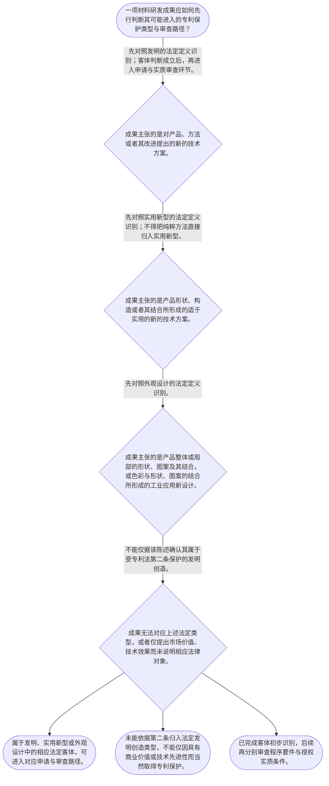

# 专家 A 教学草稿

> 专家：expert_a ｜ 风格：conservative

## 教学模块选择清单

- 当前教学节点：`patent-law-foundation`
- 板块预算：自适应 6/6，总计 9/9

| # | 模块 (block_type) | 类型 | 触发原因 (trigger) | 对应正文段 | 归属 |
|---:|---|:--:|---|---|:--:|
| 1 | `global_framework` | 自适应 | understanding=global(0.73) | 本节点在审查学习中的位置｜本节点是材料领域专利审查学习的制度入口：先明确专利制度以公开换取一定期限、一定地域内的专有保… | [A] |
| 2 | `anchor_scenario` | 自适应 | perception=sensing(0.86) / cold_start | 材料研发成果进入专利制度的起点｜某材料研发团队制得一种用于锂电池电极的复合涂层：其配方可作为具体产品销售，也可以通过特定烧结… | [A] |
| 3 | `legal_anchor` | 必选 | mandatory | 制度基础的法条锚点｜《中华人民共和国专利法》第一条 | [A] |
| 4 | `worked_example` | 自适应 | cognition.apply=0.35<0.4 / cognition.analyze=0.26<0.3 / cold_start | 从材料成果到法定保护客体｜材料团队拟保护三项成果：一是具有特定组成和性能的电极涂层；二是使该涂层形成的分段升温烧结工艺… | [A] |
| 5 | `decision_flow` | 自适应 | input=visual(0.81) | 保护客体识别流程｜一项材料研发成果应如何先行判断其可能进入的专利保护类型与审查路径？ | [A] |
| 6 | `reflect_prompt` | 自适应 | processing=reflective(0.69) | 把制度框架映射到研发记录｜回看一项熟悉的材料研发项目：研发记录中哪些内容是在说明技术方案，哪些内容只是在描述产品外观或… | [A] |
| 7 | `assessment` | 必选 | mandatory | 本节三类测评索引｜复习专利法第二条规定的发明创造类型。 | [A] |
| 8 | `knowledge_synthesis` | 必选 | mandatory | 制度基础的五层框架｜专利权的基本特征：专利制度以公开换取保护，权利保护具有独占性、时间性和地域性；具体权利边界将… | [A] |
| 9 | `summary_card` | 自适应 | len(knowledge_sub_nodes)=3>=3 | 专利制度基础速查卡｜材料专利审查的第一步，是先依据法定定义确定技术成果属于何种保护客体，再进入程序与实质条件判断… | [A] |

## 教学正文

## I — 法律问题

材料领域的研发成果进入中国专利制度时，首先应解决的不是“是否具备新颖性、创造性”，而是三个基础问题：专利制度为何提供保护；成果属于何种法定保护客体；以及由谁依何种审查机制处理申请。只有先完成这一层识别，后续关于新颖性和创造性的判断才有明确对象。

## R — 适用规则

### 1. 专利制度的目的与基本结构

检索材料转述，现行《专利法》第一条的立法宗旨包括保护专利权人的合法权益、鼓励发明创造、推动发明创造的应用、提高创新能力，并促进科学技术进步和经济社会发展。〔RAG: 专利法律知识详细解读.txt — 现行《专利法》的第一条明确了制定专利法的立法宗旨，即保护专利权人的合法权益，鼓励发明创造，推动发明创造的应用，提高创新能力，促进科学技术进步和经济社会发展〕

专利制度可用“以公开换保护”概括：技术方案向社会公开后，权利人在法定条件和期限内获得保护；公开使公众能够在既有技术基础上继续创新。〔RAG: 专利法律知识详细解读.txt — 专利权的取得的本质是“以公开换保护”〕

专利权的基本特征可概括为独占性、时间性和地域性：权利并非对技术思想的无限、全球性占有，而是在法定期限和法定地域内依法律确定的范围受保护。本节只建立该基础框架，具体权利性质和边界留待 patent-rights-nature 节点展开。

### 2. 中国专利制度的规范与审查机关

中国专利制度以《专利法》为基本法律依据，配合《专利法实施细则》和《专利审查指南》形成规范体系。检索上下文未提供实施细则和审查指南原文，因此本节只说明其在制度体系中的细化功能，不对其具体条款作展开。

国务院专利行政部门负责管理全国专利工作，统一受理和审查专利申请，并依法授予专利权。〔RAG: 中华人民共和国专利法.txt — 第三条：国务院专利行政部门负责管理全国的专利工作；统一受理和审查专利申请，依法授予专利权〕

### 3. 三种法定保护客体

《专利法》第二条将“发明创造”限定为发明、实用新型和外观设计。〔RAG: 中华人民共和国专利法.txt — 第二条：本法所称的发明创造是指发明、实用新型和外观设计〕

- 发明：对产品、方法或者其改进所提出的新的技术方案。材料配方、材料产品、制备工艺及其改进，通常首先应按此定义核对。〔RAG: 中华人民共和国专利法.txt — 发明，是指对产品、方法或者其改进所提出的新的技术方案〕
- 实用新型：对产品的形状、构造或者其结合所提出的适于实用的新的技术方案。它强调产品的形状、构造或其结合，不应把纯粹制备方法直接等同于实用新型。〔RAG: 中华人民共和国专利法.txt — 实用新型，是指对产品的形状、构造或者其结合所提出的适于实用的新的技术方案〕
- 外观设计：对产品整体或者局部的形状、图案或者其结合，以及色彩与形状、图案的结合所作出的富有美感并适于工业应用的新设计。〔RAG: 中华人民共和国专利法.txt — 外观设计，是指对产品的整体或者局部的形状、图案或者其结合以及色彩与形状、图案的结合所作出的富有美感并适于工业应用的新设计〕

### 4. 审查制度的基础差异

检索材料记载，发明专利采用实质审查制，申请须经初步审查、实质审查两个阶段；实用新型和外观设计申请经初步审查未发现驳回理由的，可以授予专利权。〔RAG: 专利法律知识详细解读.txt — 发明专利为实质审查制，实用新型和外观设计为初步审查制〕

这解释了为什么材料领域的新颖性、创造性判断通常会在后续发明专利实质审查学习中成为重点，但它们不应取代本节的客体识别。制度发展史上，我国早期专利制度已采用三种专利类型并存、发明实质审查与实用新型和外观设计初步审查并存的基本安排。〔RAG: 专利法律知识详细解读.txt — 同一部法律，包含三种专利类型；发明专利为实质审查制，实用新型和外观设计为初步审查制〕

## A — 规则适用

以材料研发为例，应采用以下顺序：

1. 先拆分成果。将“材料产品本身”“材料的制备方法”“产品结构改进”“产品表面或包装视觉设计”分开记录，避免以一个笼统名称覆盖不同法律对象。
2. 对照第二条定性。材料组成、产品性能及其制备工艺，如构成产品、方法或其改进的技术方案，先按发明定义识别；产品形状、构造或其结合的实用技术改进，才进入实用新型的对象判断；产品视觉呈现，才进入外观设计的对象判断。
3. 再进入程序与实体审查。客体初步识别完成后，才讨论申请文件、申请日、审查阶段，以及后续新颖性、创造性和其他授权条件。下一节点 patent-application-process 将处理申请程序；novelty 与 inventive-step 节点将分别处理新颖性、创造性判断。

专利制度的功能也由此呈现：通过保护合法权益激励投入，通过公开减少重复研发并支持后续技术应用，进而服务科技进步和经济社会发展。〔RAG: 专利法律知识详细解读.txt — 专利权的获得是以公开发明人的发明创造内容为前提；让公众不再进行资源的重复性投入，而可以以该发明创造为起点，进一步创新〕

## C — 结论

本节的核心结论是：材料领域专利审查必须先完成“制度目的—法定保护客体—审查路径”的基础定位。发明、实用新型和外观设计的法定定义不同；材料产品、制备方法、结构改进和视觉设计不得混同。新颖性和创造性是后续授权实质条件的核心，但必须在明确申请对象后再依法判断。

> 常见误区 / 易混淆点
>
> 1. “技术效果显著”不等于当然属于某一专利类型。首先仍须按第二条识别是产品或方法技术方案、产品结构改进，还是产品视觉设计。
> 2. “能申请专利”不等于已经具备新颖性和创造性。保护客体识别与授权实质条件审查是前后衔接、但彼此不同的环节。
> 3. 不能把发明、实用新型和外观设计的审查机制简单视为完全相同。检索材料记载，发明采用初步审查与实质审查两个阶段，实用新型和外观设计采用初步审查。
>
> 本节设有测评，请到【习题】区作答。

### 本节点在审查学习中的位置（global_framework）

**位置**：位于专利学习路径的起点；本节点先建立制度、保护客体和审查机制的共同语言，后续节点分别展开申请程序与授权条件。

**前置**：无正式前置节点；建议能够区分材料、产品、制备方法等基本技术对象。

**后继**：patent-application-process（专利申请程序）；patentability-substantive（授权实质条件）；novelty（新颖性）；inventive-step（创造性）

**大局观**：本节点是材料领域专利审查学习的制度入口：先明确专利制度以公开换取一定期限、一定地域内的专有保护，再识别三类保护客体与审查机关。后续才进入申请程序、授权实质条件、新颖性和创造性等具体判断；不能把后续的“三性”判断提前混同为本节点的客体识别。

### 材料研发成果进入专利制度的起点（anchor_scenario）

> 某材料研发团队制得一种用于锂电池电极的复合涂层：其配方可作为具体产品销售，也可以通过特定烧结工艺制备。团队拟将“涂层配方、涂层产品和制备工艺”一并申请专利，并希望日后据此阻止竞争者未经许可实施。

在提交申请前，团队首先要确认：这些技术成果是否属于专利法承认的发明创造类型；不同类型的申请在审查程序上有何差异；取得专利权究竟意味着何种范围和期限内的保护。这里的首要任务不是直接判断新颖性或创造性，而是先建立审查制度的入口框架。

**锚定**：该情境锚定专利保护客体、制度功能与审查路径之间的先后关系。

**先想一想**：面对同一项材料研发成果，为什么需要先区分产品技术方案、方法技术方案与产品外观，而不能仅以“技术先进”作为申请专利的依据？

### 制度基础的法条锚点（legal_anchor）

- **《中华人民共和国专利法》第一条**：专利制度的立法目的包括保护专利权人的合法权益、鼓励发明创造、推动应用、提高创新能力，并促进科学技术进步和经济社会发展。
- **《中华人民共和国专利法》第二条**：专利法所称发明创造只有发明、实用新型和外观设计三类，三类各有法定定义。
- **《中华人民共和国专利法》第三条**：国务院专利行政部门统一受理和审查专利申请，并依法授予专利权。

**为何重要**：材料领域的新颖性和创造性审查属于专利授权审查的一部分；在进入具体实质条件前，必须先锁定法定保护客体及审查机关。本检索上下文未提供《专利法实施细则》和《专利审查指南》原文，故本节不对其具体条款作展开。

### 从材料成果到法定保护客体（worked_example）

**案情/例题**：材料团队拟保护三项成果：一是具有特定组成和性能的电极涂层；二是使该涂层形成的分段升温烧结工艺；三是电池包装表面的装饰图案。需要先识别三项成果分别可能落入哪一类法定发明创造，以确定后续审查路径。
**适用规则**：《中华人民共和国专利法》第二条：发明包括对产品、方法或者其改进所提出的新的技术方案；实用新型针对产品的形状、构造或者其结合；外观设计针对产品整体或局部的形状、图案及其结合等。
**分步推演**：
1. 先从第二条的对象区分出发：技术方案可以针对产品、方法或者其改进；形状、构造及其结合是实用新型的专门对象；产品视觉设计属于外观设计的法定对象。 → *第一步不是评价技术高低，而是识别成果的法律对象。*
2. 电极涂层的组成与性能对应材料产品的技术方案；分段升温烧结体现实现该材料的技术方法。因此二者均应先按发明的法定定义进入判断。 → *材料产品与制备方法通常应先对照发明的定义。*
3. 包装表面的装饰图案若讨论的是视觉设计而非材料组成或制造方法，应对照外观设计的法定定义；若主张的是产品形状、构造的实用改进，则需另行核对实用新型的对象限制。 → *外观效果、结构改进和技术方案不能混为一类。*
4. 确定可能的保护客体后，才可进入由专利行政部门受理、审查并依法授予权利的程序；发明、实用新型和外观设计的审查安排并不相同。 → *客体识别是后续程序与实质判断的前置步骤。*
**结论**：该团队应先按技术成果的法定属性分别识别可能的保护客体：具有技术方案的材料产品或制备方法可进入发明类型的判断；仅涉及产品形状、构造或其结合的方案才可能进入实用新型类型；仅涉及产品视觉设计的方案才可能进入外观设计类型。仅凭“材料性能好”尚不足以直接确定类型，后续仍须进入相应申请和实质审查。
**本题要点**：训练先按法定定义给材料成果定性，再进入申请程序和新颖性、创造性等后续审查。

### 保护客体识别流程（decision_flow）

**决策问题**：一项材料研发成果应如何先行判断其可能进入的专利保护类型与审查路径？



### 把制度框架映射到研发记录（reflect_prompt）

**反思问题**：回看一项熟悉的材料研发项目：研发记录中哪些内容是在说明技术方案，哪些内容只是在描述产品外观或商业用途？这种区分会如何影响后续专利申请文件的组织？

**关注要点**：先判断成果是产品技术方案、方法技术方案、结构改进还是视觉设计。；注意“具有技术效果”不等于当然属于任何一种法定保护客体。；将客体识别与后续新颖性、创造性判断分开：前者回答保护对象，后者回答授权条件。

**连接**：连接已有材料研发经验中的“材料配方、制备工艺、产品结构和产品外观”四类成果记录。

### 制度基础的五层框架（knowledge_synthesis）

**知识框架**：
- 专利权的基本特征：专利制度以公开换取保护，权利保护具有独占性、时间性和地域性；具体权利边界将在 patent-rights-nature 节点展开。
- 制度规范体系：专利法是基本法律依据；实施细则与审查指南承担细化规则功能。本检索上下文未提供后二者原文，不对其具体内容作断言。
- 三类保护客体：第二条将发明创造限定为发明、实用新型和外观设计，并分别以技术方案、产品形状构造、产品视觉设计界定对象。
- 制度作用：立法目的包括保护合法权益、鼓励发明创造、推动应用、提高创新能力以及促进科技进步和经济社会发展。
- 审查制度与发展特点：检索材料记载，发明专利采用初步审查与实质审查两个阶段；实用新型和外观设计采用初步审查。该历史与制度特点为后续程序节点提供背景。
**概念关系**：先识别专利制度的功能和权利特征，再依据第二条识别保护客体，随后进入申请程序与授权实质条件。；保护客体判断回答“申请的对象是什么”；新颖性、创造性判断回答“该对象能否满足后续授权条件”，两者不可混同。；审查机关统一受理和审查申请，但不同专利类型的审查阶段安排存在差异。
**必记**：《专利法》第二条所称发明创造包括且仅包括发明、实用新型和外观设计三类。；发明面向产品、方法或其改进的技术方案；实用新型聚焦产品形状、构造或其结合；外观设计聚焦产品视觉设计。；材料领域的技术方案进入新颖性和创造性判断前，应先完成保护客体与申请路径的初步识别。

### 专利制度基础速查卡（summary_card）

**要点卡**：
- **专利权基本特征**：专利保护具有独占性、时间性和地域性，制度基础是以公开换取保护。
- **规范体系**：专利法提供基本法律依据，实施细则和审查指南承担细化规则功能。
- **发明创造三类型**：法定类型是发明、实用新型和外观设计，必须先按第二条完成对象识别。
- **制度作用**：制度通过保护合法权益、鼓励创造与推动应用，服务科技进步和经济社会发展。
- **审查路径**：先识别客体，再进入申请程序与授权条件审查；不同类型的审查阶段存在差异。
**必背**：《专利法》第二条：发明创造是指发明、实用新型和外观设计。；发明对应产品、方法或其改进的技术方案；实用新型对应产品形状、构造或其结合；外观设计对应产品视觉设计。；保护客体识别不等同于新颖性、创造性判断，后者属于后续授权实质条件审查。
**一句话总结**：材料专利审查的第一步，是先依据法定定义确定技术成果属于何种保护客体，再进入程序与实质条件判断。

### 本节三类测评索引（assessment）

**三类覆盖**：backward_review、forward_probe、weakness_probe
**题目**：
- foundation-backward-l1-1：复习专利法第二条规定的发明创造类型。
- application-forward-l1-1：仅探测下一节点中申请日的基本确定规则。
- foundation-weakness-l3-1：辨析保护客体、审查机制与后续实质条件的关系。


## 结构化字段

## knowledge_points

```json
[
  {
    "node_id": "patent-law-foundation",
    "kc_name": "专利制度的基本概念与特征：独占性、时间性、地域性"
  },
  {
    "node_id": "patent-law-foundation",
    "kc_name": "中国专利制度体系：专利法、专利法实施细则、专利审查指南"
  },
  {
    "node_id": "patent-law-foundation",
    "kc_name": "专利保护的三种客体：发明、实用新型、外观设计"
  },
  {
    "node_id": "patent-law-foundation",
    "kc_name": "专利制度的作用：激励发明创造、促进技术公开、推动技术应用和经济发展"
  },
  {
    "node_id": "patent-law-foundation",
    "kc_name": "中国专利制度发展历程与特点：早期公开延迟审查、初步审查制与实质审查制并存"
  }
]
```

## legal_basis

```json
[
  {
    "article": "《中华人民共和国专利法》第一条",
    "source": "专利法律知识详细解读.txt：现行《专利法》第一条立法宗旨的转述"
  },
  {
    "article": "《中华人民共和国专利法》第二条",
    "source": "中华人民共和国专利法.txt：第二条原文"
  },
  {
    "article": "《中华人民共和国专利法》第三条",
    "source": "中华人民共和国专利法.txt：第三条原文"
  },
  {
    "article": "发明专利实质审查制、实用新型和外观设计初步审查制的制度说明",
    "source": "专利法律知识详细解读.txt：1984年专利法特点及“实质审查制”段落"
  }
]
```

## risks

```json
[
  {
    "risk": "将材料技术成果的保护客体识别误认为新颖性或创造性判断；应先按第二条确定法律对象，再在后续节点审查授权实质条件。",
    "related_node_id": "patent-law-foundation"
  },
  {
    "risk": "将产品外观设计、产品结构改进、材料配方和制备方法混为同一类型，导致申请类型与审查路径判断失准。",
    "related_node_id": "patent-law-foundation"
  },
  {
    "risk": "将检索材料中的制度历史说明当作现行全部程序规则。本节未取得实施细则和审查指南原文，不对其具体条款作超出检索依据的断言。",
    "related_node_id": "patent-law-foundation"
  }
]
```

## draft_stage

```json
"debate"
```

## irac

```json
{
  "issue": "材料领域研发成果进入中国专利制度时，应如何先行识别专利制度的功能、法定保护客体和审查机制，并与后续的新颖性、创造性判断相衔接？",
  "rule": "《中华人民共和国专利法》第二条规定，发明创造是指发明、实用新型和外观设计；发明是对产品、方法或者其改进所提出的新的技术方案，实用新型是对产品的形状、构造或者其结合所提出的适于实用的新的技术方案，外观设计是对产品整体或局部的形状、图案等所作出的富有美感并适于工业应用的新设计。〔RAG: 中华人民共和国专利法.txt — 第二条：本法所称的发明创造是指发明、实用新型和外观设计〕《中华人民共和国专利法》第三条规定，国务院专利行政部门统一受理和审查专利申请，依法授予专利权。〔RAG: 中华人民共和国专利法.txt — 第三条：统一受理和审查专利申请，依法授予专利权〕",
  "application": "对于材料研发成果，应先依据第二条区分：材料产品或制备方法若构成产品、方法或其改进的技术方案，应先按发明定义识别；产品形状、构造或其结合的适用技术方案，应对照实用新型定义；仅涉及产品整体或局部视觉设计的，应对照外观设计定义。完成对象识别后，才由国务院专利行政部门统一受理和审查，并进入申请程序及后续授权实质条件的具体判断。检索材料记载，发明专利需经初步审查与实质审查，实用新型和外观设计经初步审查。〔RAG: 专利法律知识详细解读.txt — 发明专利为实质审查制，实用新型和外观设计为初步审查制〕",
  "conclusion": "本节点的结论是：材料领域专利审查学习应先建立制度与法定客体框架，不能将保护客体识别与后续新颖性、创造性判断混同。材料产品、制备方法、结构改进和产品外观须分别依第二条定性；新颖性和创造性将在后续节点按照相应法律规则具体审查。"
}
```

## interactive_questions

```json
[
  {
    "qid": "foundation-backward-l1-1",
    "category": "remember",
    "difficulty": "L1",
    "source_tag": "backward_review",
    "kc_node_id": "patent-law-foundation",
    "question": "根据《中华人民共和国专利法》第二条，本法所称“发明创造”包括哪三类？",
    "answer": "A",
    "options": [
      "A. 发明、实用新型和外观设计",
      "B. 发明、科学发现和商业秘密",
      "C. 发明、实用新型和著作权",
      "D. 技术方案、商业模式和注册商标"
    ]
  },
  {
    "qid": "application-forward-l1-1",
    "category": "remember",
    "difficulty": "L1",
    "source_tag": "forward_probe",
    "kc_node_id": "patent-application-process",
    "question": "仅就中国专利申请的一般申请日确定规则而言，下列哪项表述正确？",
    "answer": "B",
    "options": [
      "A. 以申请人完成技术方案之日为申请日",
      "B. 以国务院专利行政部门收到专利申请文件之日为申请日；邮寄的以寄出邮戳日为申请日",
      "C. 以申请人缴纳申请费之日为申请日",
      "D. 以专利申请公开之日为申请日"
    ]
  },
  {
    "qid": "foundation-weakness-l3-1",
    "category": "analyze",
    "difficulty": "L3",
    "source_tag": "weakness_probe",
    "kc_node_id": "patent-law-foundation",
    "question": "某团队同时拟保护一种材料产品、该材料的制备方法和产品包装图案。关于制度基础与后续审查的关系，下列哪项判断最准确？",
    "answer": "C",
    "options": [
      "A. 只要材料产品具有优异性能，即可直接认定其具备新颖性和创造性",
      "B. 材料制备方法属于实用新型，因此无需再区分技术方案与产品结构",
      "C. 应先依据第二条识别材料产品、制备方法或产品外观可能对应的法定保护客体，再分别进入相应程序及后续授权条件判断",
      "D. 专利行政部门统一受理申请，因此发明、实用新型和外观设计的审查阶段必然完全相同"
    ]
  }
]
```

## knowledge_synthesis

```json
{
  "node": "patent-law-foundation",
  "coverage": [
    {
      "node_id": "patent-law-foundation"
    },
    {
      "node_id": "patent-law-foundation"
    },
    {
      "node_id": "patent-law-foundation"
    },
    {
      "node_id": "patent-law-foundation"
    },
    {
      "node_id": "patent-law-foundation"
    }
  ],
  "confusable_pairs": [
    {
      "pair": "保护客体识别与新颖性、创造性判断：前者确定申请对象是否属于法定发明创造类型，后者属于后续授权实质条件判断，不能互相替代。"
    },
    {
      "pair": "发明与实用新型：发明可针对产品、方法或其改进的技术方案；实用新型限于产品形状、构造或其结合的适于实用的新技术方案。"
    },
    {
      "pair": "实用新型与外观设计：实用新型保护产品的技术性形状、构造改进；外观设计保护产品整体或局部的视觉设计。"
    }
  ]
}
```
