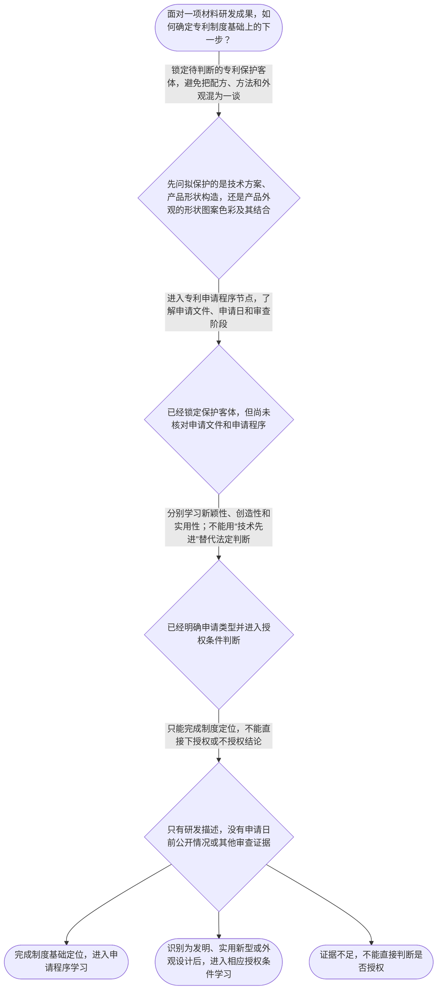

# 专家 B 教学草稿

> 专家：expert_b ｜ 风格：accessible

## 教学模块选择清单

- 当前教学节点：`patent-law-foundation`
- 板块预算：自适应 None/None，总计 9/9

| # | 模块 (block_type) | 类型 | 触发原因 (trigger) | 对应正文段 | 归属 |
|---:|---|:--:|---|---|:--:|
| 1 | `global_framework` | 自适应 | understanding=global(0.73) | 先画地图：专利制度基础在整门课中的位置｜整门专利审查课程可以看成一条由“制度定位—申请程序—授权条件—具体判断方法”组成的路线。本节… | [B] |
| 2 | `anchor_scenario` | 自适应 | perception=sensing(0.86) / cold_start | 一套材料方案，先问它要保护什么｜某材料研发团队开发出一种耐高温复合涂层，准备将配方、制备工艺和样品外观分别提交专利申请。团队… | [B] |
| 3 | `legal_anchor` | 必选 | mandatory | 法条锚点：客体、三性与审查程序｜《专利法》第二条 | [B] |
| 4 | `worked_example` | 自适应 | cognition.apply=0.35<0.4 / cognition.analyze=0.26<0.3 / cold_start | 案例演示：从材料研发事实找到制度入口｜某团队研发了一种耐高温复合涂层：其一是由树脂、陶瓷颗粒和助剂组成的材料配方；其二是将各组分混… | [B] |
| 5 | `decision_flow` | 自适应 | input=visual(0.81) | 判断流程：材料成果先走哪条制度路线｜面对一项材料研发成果，如何确定专利制度基础上的下一步？ | [B] |
| 6 | `reflect_prompt` | 自适应 | processing=reflective(0.69) | 把制度框架映射回你的材料研发经验｜回想你熟悉的一项材料研发成果：如果要申请专利，你会把哪些事实分别归入保护客体、申请程序事实和… | [B] |
| 7 | `assessment` | 必选 | mandatory | 三类测评：复习、前探与边界辨析｜识别我国专利保护的三种客体 | [B] |
| 8 | `knowledge_synthesis` | 必选 | mandatory | 知识关系网：从制度目的到审查入口｜专利权基本特征：权利具有排他性，但受地域和法定期限限制，不是全球永久权利。 | [B] |
| 9 | `summary_card` | 自适应 | len(knowledge_sub_nodes)=3>=3 | 一页速查：专利制度基础｜材料专利学习先定客体和制度边界，再沿申请程序进入新颖性、创造性等具体审查。 | [B] |

## 教学正文

## 1. 场景导入

想象一个材料研发团队完成了耐高温复合涂层：配方、制备工艺和样品外观都很有特色。团队准备申请专利时，真正的第一问不是“技术先进不先进”，而是“准备保护的到底是什么”。配方和工艺属于技术方案，样品的纹理和色彩又可能涉及外观；即使获得专利权，权利也不是全球永久有效。先把这些制度边界看清，后面才有稳定的路径学习新颖性和创造性。

## 2. 人话解释

可以把专利制度看成“公开换保护”：研发者把技术方案公开出来，法律在一定范围和一定期限内给予排他性保护；公众则可以从公开内容中学习并继续创新。专利权的排他性，意思是权利人在法定保护范围内可以排除他人未经许可的实施，但它同时受地域和时间限制，不等于拿到全球永久的技术垄断。

材料领域先要拆开看：配方、材料组成或制备方法，通常要围绕技术方案识别保护客体；产品的形状、构造及其结合，可能对应实用新型的客体；产品外观的形状、图案、色彩及其结合，则要放在外观设计的边界内判断。这里的“通常”很重要，具体分类仍要回到权利要求、说明书和实际拟保护内容，不能只看行业名称。

## 3. 法条回扣

《专利法》第二条规定了发明、实用新型和外观设计三类专利保护客体。〔RAG: 专利法专题讲座.txt — 发明包括产品、方法或者其改进；实用新型涵盖产品的形状、构造或者其结合；外观设计涉及产品的外观〕

《专利法》第二十二条规定，发明和实用新型应当具备新颖性、创造性和实用性；该条还规定，现有技术是“申请日以前在国内外为公众所知的技术”。〔RAG: 中华人民共和国专利法.txt — 第二十二条：授予专利权的发明和实用新型，应当具备新颖性、创造性和实用性；现有技术是申请日以前在国内外为公众所知的技术〕

《专利法》第三十四条、第三十五条把发明申请放进具体程序：符合要求的申请通常自申请日起满十八个月公布，申请人可以在申请日起三年内请求实质审查。〔RAG: 中华人民共和国专利法.txt — 第三十四条：自申请日起满十八个月即行公布；第三十五条：发明专利申请自申请日起三年内可以请求实质审查〕

因此，本节只负责建立三层定位：第一层是保护客体，第二层是申请与审查程序，第三层才是新颖性、创造性和实用性等授权条件。不要把“进入实质审查”误认为“已经具备三性”。

## 4. 类比 / 口诀

可以记成“先认东西，再走程序，最后过三关”。“认东西”对应发明、实用新型、外观设计；“走程序”对应不同专利类型的审查路径；“三关”对应新颖性、创造性、实用性。

另一个口诀是“排他有边，公开换保”：排他性不是无限权力，地域和期限是边界；公开技术内容，换取法定期间和范围内的保护。这个类比只用于记忆制度结构，不能替代对具体权利要求、法条条件和审查证据的判断。

## 5. 应试提示

看到材料领域题干，建议按四步读题：一看拟保护的是配方、方法、产品结构还是外观；二看题目问的是客体、程序还是授权条件；三看是否出现“申请日前”“公众可知”“实质审查”等程序或证据关键词；四看题干是否有足够事实支持结论。常见陷阱是把“材料技术”直接等同于某一种专利，把“公开换保护”误读为公开即授权，或者把专利权的排他性扩大成全球永久效力。

关于新颖性和创造性，本节先记住它们属于后续的授权条件判断，不在制度基础节点提前展开具体判定方法。完成本节后再进入相应节点，逐步学习如何识别现有技术、比较技术特征以及适用创造性判断步骤。

## 6. 互动提问

请在脑中选一项你熟悉的材料研发成果，尝试把“拟保护对象”“申请程序事实”和“授权条件证据”分成三栏；重点观察，同一个研发项目中的配方、工艺和外观，是否必然属于同一种保护客体。本节设有测评，请到【习题】区作答。

### 先画地图：专利制度基础在整门课中的位置（global_framework）

**位置**：位于专利审查知识地图的起点，是从专利制度概览进入申请程序和授权实质判断的基础节点。

**后继**：patent-application-process（专利申请程序）；patentability-substantive（专利授权实质条件）

**大局观**：整门专利审查课程可以看成一条由“制度定位—申请程序—授权条件—具体判断方法”组成的路线。本节先建立专利法律制度基础：认识专利权的边界、三类保护客体、制度体系和制度目的；随后才能理解申请如何进入审查，以及在后续节点中分别判断新颖性、创造性和其他授权条件。

### 一套材料方案，先问它要保护什么（anchor_scenario）

> 某材料研发团队开发出一种耐高温复合涂层，准备将配方、制备工艺和样品外观分别提交专利申请。团队成员争论：配方和工艺是否都属于同一种专利客体？样品的颜色和纹理能否单独决定保护类型？即使获得授权，权利是否能覆盖全球、永久有效？这些问题都发生在正式讨论新颖性和创造性之前。

**锚定**：用材料研发中的配方、工艺和外观选择，锚定专利客体、专利权边界及制度入口。

**先想一想**：先不急着判断新颖性或创造性：面对这个材料技术方案，你会先确认保护的对象、权利的边界，还是直接比较已有技术？

### 法条锚点：客体、三性与审查程序（legal_anchor）

- **《专利法》第二条**：专利法把专利保护客体分为发明、实用新型和外观设计；材料配方、制备方法通常要先看其具体技术内容属于哪类客体。
- **《专利法》第二十二条**：发明和实用新型要具备新颖性、创造性和实用性；现有技术是申请日前在国内外为公众所知的技术。创造性判断属于后续实质判断，不能与本节的制度概览混为一谈。
- **《专利法》第三十四条、第三十五条**：发明申请通过初步审查后通常满十八个月公布，并可在申请日起三年内请求实质审查；实质审查阶段会审查新颖性、创造性和实用性。

**为何重要**：这些条文分别确定“保护什么”“授权要过哪些门槛”以及“何时、通过什么程序审查”。先把制度入口和审查位置放准确，后续学习新颖性、创造性时才不会把客体判断、程序判断和三性判断混在一起。

### 案例演示：从材料研发事实找到制度入口（worked_example）

**案情/例题**：某团队研发了一种耐高温复合涂层：其一是由树脂、陶瓷颗粒和助剂组成的材料配方；其二是将各组分混合、喷涂并热处理的制备方法；其三是涂层样品呈现特定纹理和色彩。团队希望判断应先关注哪些专利制度基础问题。
**适用规则**：《专利法》第二条、第二十二条、第三十四条和第三十五条；本例为自拟材料技术教学场景，不是真实案例。
**分步推演**：
1. 先把技术事实拆成配方、方法和外观三个对象，而不是把整套研发成果笼统称为“一个专利”。 → *第一步：识别拟保护的具体客体。*
2. 配方和制备方法体现技术方案，通常应结合其具体内容判断是否属于发明等保护客体；产品形状、图案、色彩及其结合则要按外观设计的法律边界判断。不能仅凭“都是材料”决定类型。 → *第二步：用客体定义匹配保护类型。*
3. 确定客体后，还要区分制度层次：授权条件包括新颖性、创造性和实用性；发明申请还要经历初步审查和实质审查。 → *第三步：把客体、三性和程序分层。*
4. 本节只完成制度定位，不凭场景事实直接宣布授权或不授权；后续需进一步核对申请日前公众可知的技术，并分别学习新颖性和创造性判断。 → *第四步：保留证据边界，进入后续判断。*
**结论**：该团队应先分别识别配方、制备方法和外观所对应的保护客体，再根据申请类型进入相应审查程序；是否具备新颖性、创造性和实用性，需在后续实质条件节点中依据申请日前现有技术进一步判断。
**本题要点**：遇到材料专利题，先拆客体、再分审查层次，最后才进入申请日前现有技术与三性判断。

### 判断流程：材料成果先走哪条制度路线（decision_flow）

**决策问题**：面对一项材料研发成果，如何确定专利制度基础上的下一步？



### 把制度框架映射回你的材料研发经验（reflect_prompt）

**反思问题**：回想你熟悉的一项材料研发成果：如果要申请专利，你会把哪些事实分别归入保护客体、申请程序事实和三性判断证据？

**关注要点**：配方、制备方法、产品结构和外观是否承担不同的保护功能；哪些事实只是说明申请流程，哪些事实才可能影响新颖性或创造性；在证据不足时是否把技术效果或研发难度误当成已经满足授权条件

**连接**：连接到学习者已有的材料研发经验，以及后续“专利申请程序”“新颖性”“创造性”节点。

### 知识关系网：从制度目的到审查入口（knowledge_synthesis）

**知识框架**：
- 专利权基本特征：权利具有排他性，但受地域和法定期限限制，不是全球永久权利。
- 中国专利制度体系：以专利法为核心，并结合专利法实施细则和专利审查指南理解申请与审查。
- 三类保护客体：发明、实用新型和外观设计，材料领域应先按拟保护的技术内容或外观特征识别客体。
- 专利制度作用：通过公开换保护，激励发明创造、促进技术公开、推动技术应用和经济发展。
- 审查制度特点：发明专利实行早期公开、延迟审查的实质审查制；实用新型和外观设计主要实行初步审查制。
**概念关系**：先识别保护客体，再确定适用的申请与审查路径。；制度目的“公开换保护”解释了专利权的时间性、地域性与排他性边界。；发明申请的程序定位连接到后续新颖性、创造性和实用性判断，但本节点不提前展开具体判断方法。
**必记**：专利权的核心边界可记为：排他，但有地域和期限。；三类专利客体是发明、实用新型和外观设计。；发明申请要经历初步审查和实质审查；实质审查涉及新颖性、创造性和实用性。；专利制度的基本逻辑是以公开换保护。

### 一页速查：专利制度基础（summary_card）

**要点卡**：
- **专利权边界**：专利权具有排他性，但只在法定地域和期限内有效。
- **保护客体**：先区分发明、实用新型和外观设计，再谈申请与授权。
- **制度目的**：专利制度以公开换保护，兼顾创新激励与技术传播。
- **审查制度**：发明申请实行初步审查加实质审查，实用新型和外观设计主要实行初步审查。
**必背**：专利权的三项边界：排他性、地域性、时间性。；三种专利保护客体：发明、实用新型、外观设计。；发明申请的审查链条：初步审查—公布—实质审查—符合条件后授权。；授权条件中的新颖性、创造性和实用性需要分别判断。
**一句话总结**：材料专利学习先定客体和制度边界，再沿申请程序进入新颖性、创造性等具体审查。

### 三类测评：复习、前探与边界辨析（assessment）

**三类覆盖**：backward_review、forward_probe、weakness_probe
**题目**：
- q_backward_01：识别我国专利保护的三种客体
- q_forward_01：探测发明专利的公布与实质审查程序
- q_weakness_01：辨析专利权的地域性、时间性与排他性边界


## 结构化字段

## knowledge_points

```json
[
  {
    "node_id": "patent-law-foundation",
    "kc_name": "专利制度的基本概念与特征：独占性、时间性、地域性"
  },
  {
    "node_id": "patent-law-foundation",
    "kc_name": "中国专利制度体系：专利法、专利法实施细则、专利审查指南"
  },
  {
    "node_id": "patent-law-foundation",
    "kc_name": "专利保护的三种客体：发明、实用新型、外观设计"
  },
  {
    "node_id": "patent-law-foundation",
    "kc_name": "专利制度的作用：激励发明创造、促进技术公开、推动技术应用和经济发展"
  },
  {
    "node_id": "patent-law-foundation",
    "kc_name": "中国专利制度发展历程与特点：早期公开延迟审查、初步审查制与实质审查制并存"
  }
]
```

## legal_basis

```json
[
  {
    "article": "《专利法》第二条",
    "source": "《中华人民共和国专利法》"
  },
  {
    "article": "《专利法》第二十二条",
    "source": "《中华人民共和国专利法》"
  },
  {
    "article": "《专利法》第三十四条",
    "source": "《中华人民共和国专利法》"
  },
  {
    "article": "《专利法》第三十五条",
    "source": "《中华人民共和国专利法》"
  }
]
```

## risks

```json
[
  {
    "risk": "容易把专利权的排他性误解为全球有效或永久有效，忽略地域性和时间性。",
    "related_node_id": "patent-rights-nature"
  },
  {
    "risk": "容易把专利法、实施细则和审查指南混为同一层级，导致程序规则与实体规则定位不清。",
    "related_node_id": "patent-law-framework"
  },
  {
    "risk": "容易仅凭“属于材料技术”确定专利类型，忽略应根据拟保护的具体技术内容或外观特征识别客体。",
    "related_node_id": "patent-law-foundation"
  },
  {
    "risk": "容易把“公开换保护”理解成公开后必然获得专利，忽略仍需通过法定审查条件。",
    "related_node_id": "patent-system-overview"
  }
]
```

## draft_stage

```json
"debate"
```

## irac

```json
{
  "issue": "材料研发成果进入专利制度时，首先需要识别哪些客体和审查层次？",
  "rule": "依据《专利法》第二条、第二十二条、第三十四条和第三十五条，专利客体包括发明、实用新型和外观设计，发明申请需经过初步审查和实质审查，授权需满足法定条件。",
  "application": "本节以自拟材料涂层场景演示先识别保护客体、再定位申请与审查制度；新颖性和创造性的具体事实判断留待后续节点。",
  "conclusion": "当前节点的核心是建立专利制度基础，不对具体材料方案作出最终授权结论。"
}
```

## interactive_questions

```json
[
  {
    "qid": "q_backward_01",
    "category": "remember",
    "difficulty": "L1",
    "source_tag": "backward_review",
    "kc_node_id": "patent-law-foundation",
    "question": "根据专利制度基础，下列哪一组属于我国专利保护的三种客体？",
    "answer": "B",
    "options": [
      "A.发明、商标、著作权",
      "B.发明、实用新型、外观设计",
      "C.实用新型、商业秘密、集成电路布图设计",
      "D.外观设计、植物新品种、商号"
    ]
  },
  {
    "qid": "q_forward_01",
    "category": "remember",
    "difficulty": "L1",
    "source_tag": "forward_probe",
    "kc_node_id": "patent-application-process",
    "question": "关于发明专利申请审查程序，下列哪项表述正确？",
    "answer": "C",
    "options": [
      "A.发明申请只需初步审查即可授权",
      "B.发明申请自提交之日起立即授权且不公布",
      "C.发明申请通常先经初步审查，申请日起三年内可请求实质审查",
      "D.发明申请必须先获得实用新型授权才能请求实质审查"
    ]
  },
  {
    "qid": "q_weakness_01",
    "category": "analyze",
    "difficulty": "L3",
    "source_tag": "weakness_probe",
    "kc_node_id": "patent-law-foundation",
    "question": "某材料企业认为，只要技术被授予专利权，就可以在全球范围内永久排除他人实施。下列判断最准确的是？",
    "answer": "D",
    "options": [
      "A.专利权一经授权就在全球永久有效",
      "B.专利权只有时间性，没有排他性和地域性",
      "C.专利权可以排除任何人在任何情况下使用相关技术",
      "D.专利权具有排他性，但其效力受地域和法定期限限制"
    ]
  }
]
```

## knowledge_synthesis

```json
{
  "node": "patent-law-foundation",
  "coverage": [
    {
      "node_id": "patent-law-foundation"
    },
    {
      "node_id": "patent-rights-nature"
    },
    {
      "node_id": "patent-law-framework"
    },
    {
      "node_id": "patent-system-overview"
    }
  ],
  "confusable_pairs": []
}
```
