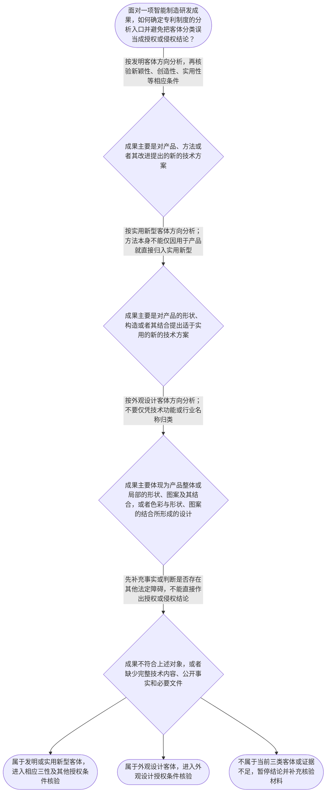

# 整合后的课程完整内容与习题

## 教学模块选择清单

- 当前教学节点：`patent-law-foundation`
- 板块预算：自适应 5/6，总计 9/9

| # | 模块 (block_type) | 类型 | 触发原因 (trigger) | 对应正文段 | 归属 |
|---:|---|:--:|---|---|:--:|
| 1 | `anchor_scenario` | 自适应 | perception=sensing(0.78) / P(L)=0.15<0.3 / cold_start | 从智能制造研发现场识别专利问题｜某智能制造企业正在建设一条汽车零部件机器人装配线。研发工程师小林设计了三项成果：第一项是通过… | [A+B融合] |
| 2 | `legal_anchor` | 必选 | mandatory | 专利制度基础法条锚定｜《专利法》第二条 | [A+B融合] |
| 3 | `worked_example` | 自适应 | cognition.apply=0.34<0.4 / cognition.analyze=0.26<0.3 / cold_start | 智能制造研发成果的逐项归类与审查入口｜某智能制造企业形成三项研发成果：一是利用视觉传感器识别零件并调整机械臂抓取路径的控制方法；二… | [A+B融合] |
| 4 | `decision_flow` | 自适应 | input=visual(0.74) | 专利基础判断流程图｜面对一项智能制造研发成果，如何确定专利制度的分析入口并避免把客体分类误当成授权或侵权结论？ | [A+B融合] |
| 5 | `mnemonic` | 自适应 | remember=0.72>=0.6 & apply<0.4 / understanding=sequential(0.66) | 专利基础四问与对比对象检查表｜专利基础四问表：一问“客体是什么”，二问“三性过几关”，三问“制度谁来管”，四问“权利有边界… | [A+B融合] |
| 6 | `reflect_prompt` | 自适应 | processing=reflective(0.61) | 把法条判断接回研发流程｜回想一项自动化或智能制造成果：你会怎样把它拆成“核心对象—对应客体—需要核验的授权条件”三栏… | [A+B融合] |
| 7 | `assessment` | 必选 | mandatory | 三类选择题测评入口｜复习《专利法》第二条规定的三类发明创造客体。 | [A+B融合] |
| 8 | `knowledge_synthesis` | 必选 | mandatory | 专利法律制度基础知识关系网｜专利制度基本概念与特征：专利权通常体现独占性、时间性和地域性；这些是制度层面的概括，具体期限… | [A+B融合] |
| 9 | `summary_card` | 自适应 | len(knowledge_sub_nodes)=3>=3 | 专利法律制度基础一页速查卡｜先认清保护客体和可核验依据，再分别核验授权条件；未经直接材料支持的制度功能与审查历史，不作为… | [A+B融合] |

## 教学正文

## 一、本节定位：先搭专利制度总地图

[A+B融合] 你可以把本节当作智能制造专利学习的入口，而不是直接完成某一项专利的新颖性或侵权结论。面对机器人装配线、视觉分拣系统或自动化夹具，先沿四个问题定位：保护什么？依据什么？是否具备进入后续授权审查的基础？后续分别要核验什么？

[A+B融合] 当前检索上下文没有提供可核验的智能制造领域真实裁判案例、专利号、完整权利要求书或对比文件。因此，本文中的机器人装配线、视觉分拣系统和夹具均为教学拟制场景，不冒充真实案例；后续若要分析真实案件，应补充裁判文书、申请文件、权利要求、公开日期和对比资料。

## 二、专利制度保护什么：三类客体

[A+B融合] 《专利法》第二条首先回答“保护什么”。发明，是对产品、方法或者其改进所提出的新的技术方案；实用新型，是对产品的形状、构造或者其结合所提出的适于实用的新的技术方案；外观设计，是对产品整体或者局部的形状、图案或者其结合，以及色彩与形状、图案的结合所作出的富有美感并适于工业应用的新设计。〔RAG: 中华人民共和国专利法.txt — 第二条：发明、实用新型和外观设计的定义〕

[A+B融合] 把这条规则放回智能制造现场：控制机器人动作的算法和方法，通常先沿发明的技术方案方向观察；机器人末端夹具的形状或机械构造改进，先沿实用新型客体方向观察；控制柜面板的形状、图案和色彩组合，先沿外观设计方向观察。这里的“通常”只是分析入口，不是脱离具体权利要求后的最终授权结论。不能因为成果属于“智能制造”行业，就把它自动归入一种专利类型。

[A+B融合] 实用新型的边界尤其要注意：检索材料指出，实用新型只保护产品，产品应当是经过产业方法制造、有确定形状和构造并占据一定空间的实体；制造方法、使用方法、通讯方法、处理方法、计算机程序以及将产品用于特定用途等方法，不因与产品有关就当然成为实用新型客体。〔RAG: 专利法专题讲座.txt — 实用新型专利只保护产品；方法不属于实用新型的保护客体〕

## 三、依据什么：法律材料、制度主体与审查入口

[A+B融合] 本轮检索材料能够直接确认：一件专利申请必须属于专利法规定的可以授权的对象和主题，才有可能获得专利授权；在新颖性和创造性审查之前，应先判断该申请是否符合这些前提。检索材料同时列举《专利法》第五条、第二十五条，《专利法实施细则》第十一条，以及《专利审查指南》第二部分第九章、第二部分第十一章第二节作为有关授权主题、诚实信用或特定保护客体判断的材料。〔RAG: 专利法专题讲座.txt — “一件专利申请必须属于专利法规定的可以授权的对象和主题，才有可能获得专利授权”及所列《专利法》《细则》《审查指南》条目〕

[A+B融合] 因此，本节可把《专利法》、实施细则和审查指南视为需要共同查阅的规范材料；但本轮材料未提供足以全面核验三者一般性“基本制度、程序规则、审查指引”分工的直接原文，不能把该概括作为无保留的确定事实。具体问题应回到相应条文或者审查指南章节核验。

[A+B融合] 《专利法》第三条规定，国务院专利行政部门负责管理全国专利工作，统一受理和审查专利申请，依法授予专利权。〔RAG: 中华人民共和国专利法.txt — 第三条：国务院专利行政部门负责管理全国专利工作，统一受理和审查专利申请并依法授予专利权〕 因此，“提交申请”“申请被公开”“经过审查”和“取得专利权”是不同环节，不能把申请动作直接等同于已获得专利权。

[A+B融合] 《专利法》第二十条第一款要求申请专利和行使专利权遵循诚实信用原则；检索材料还指出，《专利法实施细则》第十一条对此作出具体规定。〔RAG: 专利法专题讲座.txt — 《专利法》第20条第1款规定诚实信用原则，《细则》第11条对其作出具体规定〕

## 四、授权实质条件：三性要分别定位

[A+B融合] 《专利法》第二十二条规定，授予专利权的发明和实用新型应当具备新颖性、创造性和实用性；该条还规定，现有技术是申请日前在国内外为公众所知的技术。〔RAG: 中华人民共和国专利法.txt — 第二十二条：发明和实用新型应具备新颖性、创造性和实用性，现有技术是申请日前在国内外为公众所知的技术〕 三性是三个不同的判断问题，不能把“技术先进”“能使用”或“属于智能制造”当成三性已经全部满足。

[A+B融合] 新颖性先问：一项现有技术或申请在先公布、公告的相关技术内容，是否已经公开了申请方案所要求的全部技术内容。检索材料明确要求，判断新颖性时，应将各项权利要求分别与每一项现有技术或相关在先申请内容单独比较，不得把几项现有技术、几项在先申请内容，或者一份文件中的多项技术方案简单组合后进行对比。〔RAG: 专利法专题讲座.txt — 新颖性判断应单独对比，不得将几项现有技术或多项技术方案组合进行对比〕

[A+B融合] 创造性是另一道门。法条对发明使用“突出的实质性特点和显著的进步”，对实用新型使用“实质性特点和进步”的表述。相对于新颖性，创造性评价才可能进一步讨论现有技术之间是否存在技术启示、组合是否使本领域技术人员容易想到。但“容易想到”只是帮助理解的概括，不能替代法条标准，也不能把创造性的组合评价反向套用到新颖性。

[A+B融合] 实用性关注方案能否制造或者使用并产生积极效果。〔RAG: 中华人民共和国专利法.txt — 第二十二条第四款：实用性是指该发明或者实用新型能够制造或者使用，并且能够产生积极效果〕 因而，“能制造、能使用、有积极效果”主要对应实用性；它不能自动证明方案没有被现有技术公开，也不能自动证明方案具有创造性。

## 五、制度特征、作用与证据边界

[A+B融合] 专利权的基本特征通常概括为独占性、时间性和地域性：独占性说明权利在法定范围内具有排他效力；时间性说明这种效力不是永久存在；地域性说明效力原则上要放在相应法域中判断。本轮检索上下文未提供该概括的直接法条出处，也未提供具体期限或地域规则，因此这里只讲制度定位，不编造具体年限或跨境结论。

[A+B融合] “以有限保护换取技术公开，并激励发明创造、促进技术应用和经济发展”是对专利制度功能的常见概括，但本轮检索上下文未提供与这一功能概括相对应的直接材料。故本节不将其作为已获检索证实的法律事实，也不能据此推导任何具体申请当然应获授权；具体制度功能应在补充可核验来源后再作展开。

[A+B融合] 当前节点列有“中国专利制度发展历程与特点：早期公开、延迟审查、初步审查制与实质审查制并存”。但本轮检索上下文没有提供这些术语的直接定义、适用对象、程序边界、历史沿革或者时间依据。为避免把未经核验的制度史概括当作规则，本节仅确认申请、公开、审查和授权是不同环节；“早期公开、延迟审查、初步审查制与实质审查制并存”这一细粒度知识点在本轮未获直接材料支撑，标记为未完成覆盖，待补充《专利法》、实施细则或审查指南的相应直接依据后讲解。

## 六、智能制造场景中的分析顺序

[A+B融合] 面对机器人装配线，先把成果拆成控制方法、产品结构和产品外观三个对象，再分别对应发明、实用新型和外观设计的客体方向；不要先用行业名称作结论。之后整理研发、试运行、展会展示、客户交付和公开发布的时间与对象，并保存图纸、说明、照片和申请文件。

[A+B融合] 当资料进入授权分析时，先确认成果属于可以授权的对象和主题，再分别定位新颖性、创造性和实用性。若题目出现多份对比资料，先问是在判断新颖性还是创造性：新颖性原则上单独对比，创造性才可能讨论组合和技术启示。若资料不足以确定完整技术特征、公开时间或对比内容，只能列为待核验事项，不能用“研发完成”或“产品试运行”直接替代法律结论。

[A+B融合] 本节点不提前完成专利权保护范围和侵权判定。后续遇到侵权问题，还要回到有效专利权、权利要求或外观设计图片照片等法律载体，并结合被诉方案和具体实施行为逐项判断；不能把客体分类直接等同于侵权成立。

## 七、常见误区与区分判据

[A+B融合] 误解一：“只要属于智能制造技术，就自动属于一种专利。”正解推理是先看成果的法律对象：方法或技术方案、产品形状构造、产品外观分别进入不同客体分析。区分判据是成果的核心保护内容，而不是所属行业名称。

[A+B融合] 误解二：“能够制造、能够使用并产生积极效果，就同时证明了新颖性和创造性。”正解推理是这些事实主要对应实用性；新颖性还要核验申请日前是否已有相关公开，创造性还要依照法定标准评价相对于现有技术的特点和进步。

[A+B融合] 误解三：“把甲文件的部分特征和乙文件的部分特征拼起来，就能直接否定新颖性。”正解推理是新颖性原则上要求单独对比一项现有技术或相关在先申请内容；多份资料的组合评价属于创造性分析可能涉及的路径。

[A+B融合] 误解四：“提交申请就已经获得专利权，竞争对手使用相似技术就当然侵权。”正解推理是申请、公开、审查和授权是不同环节，侵权还要结合有效权利、保护范围、被诉技术方案和具体行为。

## 八、收束

[A+B融合] 处理智能制造专利问题，可以用“客体—依据—三性—边界”四栏收口：先认清保护客体，再回到相应规范材料定位依据；随后把新颖性、创造性、实用性分别核验；最后记住专利权受时间、地域和授权文件边界限制。新颖性与创造性尤其不能混用比较方法。本轮未直接覆盖制度功能和制度发展审查特点的具体内容，不能把它们作为已掌握结论。

本节设有测评，请到【习题】区作答。

### 从智能制造研发现场识别专利问题（anchor_scenario）

> 某智能制造企业正在建设一条汽车零部件机器人装配线。研发工程师小林设计了三项成果：第一项是通过视觉传感器识别零件并自动调整机械臂抓取路径的控制方法；第二项是机器人末端夹具的机械结构改进；第三项是控制柜面板的形状、图案和色彩组合设计。企业希望把三项成果统称为“智能制造专利”，但代理人提醒：不同成果可能对应不同保护客体，申请、公开、审查、授权和后续侵权判断也不是同一个问题。

**锚定**：用同一研发场景锚定专利客体、制度材料、授权三性及后续保护边界之间的分析顺序。

**先想一想**：如果你负责整理交给专利代理人的第一份材料，会先记录成果的具体内容、公开时间与对象，还是先凭“智能制造”这个行业名称确定专利类型？

### 专利制度基础法条锚定（legal_anchor）

- **《专利法》第二条**：第二条先回答“保护什么”：发明针对产品、方法或其改进的新的技术方案，实用新型针对产品形状、构造或其结合，外观设计针对产品整体或局部的形状、图案及其结合，以及色彩与形状、图案的结合所形成的设计。
- **《专利法》第二十二条**：第二十二条建立发明和实用新型授权的三性总框架：新颖性、创造性和实用性必须分别核验；能制造或使用并产生积极效果，只能说明实用性，不能替代另外两项。
- **《专利法》第三条**：第三条说明制度运行主体：国务院专利行政部门负责管理全国专利工作，统一受理和审查申请并依法授予专利权。
- **《专利法》第二十条第一款及《专利法实施细则》第十一条**：检索材料能够确认专利法、实施细则和审查指南在特定问题上均被援引，但未提供三者一般性分工的完整直接依据；具体问题应回到相应条文或章节核验。
- **《专利审查指南》第二部分第九章、第二部分第十一章第二节**：检索材料未提供专利制度功能、早期公开、延迟审查或初步审查制与实质审查制并存的直接规则，本节不把这些内容作为已获证实的法条结论。
- **《专利法》第二十二条第四款**：

**为何重要**：本节点的主线是先确定法律保护客体和制度入口，再定位授权条件。已检索到的材料足以支持三类客体、三性和制度主体的基础判断；法源一般分工、制度功能和制度发展审查特点需要补充直接材料后再作确定讲解。

### 智能制造研发成果的逐项归类与审查入口（worked_example）

**案情/例题**：某智能制造企业形成三项研发成果：一是利用视觉传感器识别零件并调整机械臂抓取路径的控制方法；二是机器人末端夹具的机械结构改进；三是控制柜面板的形状、图案和色彩组合设计。企业希望提交一份“智能制造专利”统一保护。请演示在申请前应如何从事实记录进入保护客体和授权条件分析。
**适用规则**：《专利法》第二条用于区分发明、实用新型和外观设计客体；《专利法》第二十二条用于确认发明和实用新型的三性授权框架；检索材料还指出，在新颖性和创造性审查之前，应先判断申请是否属于可以授权的对象和主题。
**分步推演**：
1. 先记录可核验事实：每项成果的具体技术内容、研发和试运行时间、展会或客户展示情况、公开对象，以及现有图纸、说明、照片和其他材料。事实记录是后续客体与授权判断的基础，不能以“研发完成”替代法律事实。 → *第一步：整理成果内容、时间、对象和证据。*
2. 再看法律保护对象而不是行业标签。控制方法解决的是机器人运行中的技术问题；夹具改进主要改变产品机械结构；面板改进主要体现产品外观要素。 → *第二步：识别成果的核心对象。*
3. 将事实逐项对应第二条：控制方法属于产品、方法或其改进的技术方案方向；夹具结构对应产品形状、构造或其结合的实用新型方向；面板外观对应整体或局部形状、图案、色彩及其结合的外观设计方向。 → *第三步：把成果对照三类客体定义。*
4. 完成客体定位后，再进入第二十二条所列三性等后续授权条件。新颖性、创造性和实用性是不同判断问题；其中新颖性不能用多份资料简单拼接替代，能制造或使用并产生积极效果也不能自动证明新颖性或创造性。 → *第四步：分别核验授权条件，不用一个结论替代三性。*
**结论**：该企业的三项成果不能因为都属于智能制造而统一归类：控制方法先按发明客体分析，夹具机械结构先按实用新型客体分析，控制柜外观先按外观设计客体分析。分类后还要分别核验相应授权条件；现有事实不足以直接得出任何一项最终能够授权的结论。
**本题要点**：处理智能制造专利事项时，应沿“记录事实—识别对象—对应客体—分别核验条件”的判定链推进。

### 专利基础判断流程图（decision_flow）

**决策问题**：面对一项智能制造研发成果，如何确定专利制度的分析入口并避免把客体分类误当成授权或侵权结论？



### 专利基础四问与对比对象检查表（mnemonic）

**记忆锚**：专利基础四问表：一问“客体是什么”，二问“三性过几关”，三问“制度谁来管”，四问“权利有边界”；遇到新颖性与创造性题目，再加做“单独对比还是组合评价”的检查。
**映射**：
- 客体是什么
- 三性过几关
- 制度谁来管
- 权利有边界
- 单独对比
- 组合评价
**何时用**：阅读智能制造研发方案、判断申请前问题或开始新颖性分析时，依次检查“客体—三性—制度—边界”；看到多份对比资料时先问当前判断的是新颖性还是创造性。

### 把法条判断接回研发流程（reflect_prompt）

**反思问题**：回想一项自动化或智能制造成果：你会怎样把它拆成“核心对象—对应客体—需要核验的授权条件”三栏，而不把“能用”直接写成“已经具备全部三性”？

**关注要点**：核心成果是方法或技术方案、产品形状构造，还是产品整体或局部外观；研发、试运行、展示、交付和申请的时间及公开对象是否有证据；新颖性、创造性和实用性分别对应什么判断问题；判断新颖性时是否误把多份资料简单拼接，或把创造性标准提前套用

**连接**：连接到学习者已有的智能制造研发经验，以及项目立项、试运行、展会展示、客户交付和专利申请之间的时间记录。

### 专利法律制度基础知识关系网（knowledge_synthesis）

**知识框架**：
- 专利制度基本概念与特征：专利权通常体现独占性、时间性和地域性；这些是制度层面的概括，具体期限、地域效力和权利边界仍须以法律规定及授权文件为准。
- 中国专利制度的材料入口：检索材料列举《专利法》、实施细则和审查指南中的特定条文或章节，用于授权主题、诚实信用或特定保护客体判断；本轮材料未提供三者一般性分工的完整直接依据，具体问题须回到相应规范核验。
- 三类保护客体：《专利法》第二条将发明、实用新型和外观设计分别定位为技术方案、产品形状构造及其结合、产品整体或局部的形状图案色彩等设计。
- 专利制度的作用：激励发明创造、促进技术公开、推动技术应用和经济发展属于常见制度功能概括，但检索上下文未提供直接依据；本轮不将其作为已核验内容。
- 中国专利制度发展与审查特点：检索上下文未提供早期公开、延迟审查、初步审查制与实质审查制并存的直接定义、适用边界或制度史材料；本轮仅区分申请、公开、审查和授权等环节，前述细粒度知识点未覆盖。
**概念关系**：先识别成果对象，再按《专利法》第二条确定保护客体，不能按“智能制造”等行业名称机械归类。；确定客体后，再定位可核验的相应条文或审查材料；申请、公开、审查、授权与侵权不是同一时点或同一法律问题。；发明和实用新型的三性应分别判断：新颖性关注是否属于现有技术及相关在先申请内容，创造性关注相对于现有技术的法定评价，实用性关注能否制造或使用并产生积极效果。；新颖性原则上实行单独对比，不能将多份资料简单拼接；创造性评价可能涉及组合和技术启示，但不能反过来代替新颖性判断。；制度功能和审查发展史必须以直接材料为依据；本轮材料不足时，应保留为待核验问题而非确定结论。
**必记**：《专利法》第二条是区分发明、实用新型和外观设计保护客体的基础条文。；专利权的制度特征可概括为独占性、时间性和地域性，不能理解为永久、全球且不受授权文件限制的权利。；发明和实用新型授权需要分别核验新颖性、创造性和实用性；能制造或使用并产生积极效果不能替代另外两项。；新颖性判断原则上要求单独对比，不能把多份对比资料简单拼接来否定新颖性。；本节点已覆盖三类客体、制度主体、三性和比较边界；制度功能的直接依据以及早期公开、延迟审查、初步审查制与实质审查制并存尚待补充来源，不能视为已掌握。

### 专利法律制度基础一页速查卡（summary_card）

**要点卡**：
- **专利权三特征**：独占性表示法定范围内的排他效力，时间性和地域性表示这种效力受期限与法域限制。
- **法律材料入口**：检索材料列举专利法、实施细则和审查指南的具体条文或章节；一般分工须按具体规范进一步核验。
- **三类保护客体**：发明看产品、方法或其改进的技术方案；实用新型看产品形状、构造或其结合；外观设计看产品整体或局部的形状、图案、色彩及其结合形成的设计。
- **授权三性**：发明和实用新型要分别核验新颖性、创造性和实用性，实用性不能代替另外两性。
- **新颖性与创造性边界**：新颖性原则上单独对比，创造性才可能评价现有技术组合和技术启示，二者不能混用。
- **待补充的制度史**：本轮未取得早期公开、延迟审查及两类审查并存的直接材料，不能将其视为已完成学习内容。
**必背**：《专利法》第二条对发明、实用新型和外观设计的基本定义；专利权具有独占性、时间性和地域性；发明和实用新型的三性必须分别核验；新颖性原则上单独对比，不能用多份资料简单拼接代替；申请、公开、审查、授权和侵权判断不能混为同一问题；制度功能和制度发展审查特点必须补充直接来源后再作确定结论
**一句话总结**：先认清保护客体和可核验依据，再分别核验授权条件；未经直接材料支持的制度功能与审查历史，不作为确定结论。

### 三类选择题测评入口（assessment）

**三类覆盖**：backward_review、forward_probe、weakness_probe
**题目**：
- q-foundation-01：复习《专利法》第二条规定的三类发明创造客体。
- q-protection-01：仅作前置探测：识别专利保护范围所依托的法律载体。
- q-confusion-01：辨析新颖性单独对比与创造性组合评价的边界。
- q-weakness-01：辨析实用性不能替代新颖性和创造性。


## 结构化数据

## expert

```json
"A+B融合"
```

## style

```json
"fused"
```

## knowledge_points

```json
[
  {
    "node_id": "patent-law-foundation",
    "kc_name": "专利制度的基本概念与特征：独占性、时间性、地域性"
  },
  {
    "node_id": "patent-law-foundation",
    "kc_name": "中国专利制度体系：专利法、专利法实施细则、专利审查指南"
  },
  {
    "node_id": "patent-law-foundation",
    "kc_name": "专利保护的三种客体：发明、实用新型、外观设计（专利法第2条）"
  },
  {
    "node_id": "patent-law-foundation",
    "kc_name": "专利制度的作用：激励发明创造、促进技术公开、推动技术应用和经济发展"
  },
  {
    "node_id": "patent-law-foundation",
    "kc_name": "中国专利制度发展历程与特点：早期公开、延迟审查、初步审查制与实质审查制并存；本轮检索材料未提供该项的直接依据，不能作为已完成讲解内容"
  }
]
```

## legal_basis

```json
[
  {
    "article": "《专利法》第二条",
    "source": "中华人民共和国专利法.txt：发明、实用新型和外观设计的定义"
  },
  {
    "article": "《专利法》第二十二条",
    "source": "中华人民共和国专利法.txt：发明和实用新型应具备新颖性、创造性和实用性；现有技术是申请日前在国内外为公众所知的技术"
  },
  {
    "article": "《专利法》第三条",
    "source": "中华人民共和国专利法.txt：国务院专利行政部门负责管理全国专利工作，统一受理和审查专利申请并依法授予专利权"
  },
  {
    "article": "《专利法》第二十条第一款",
    "source": "专利法专题讲座.txt：申请专利和行使专利权应当遵循诚实信用原则"
  },
  {
    "article": "《专利法实施细则》第十一条",
    "source": "专利法专题讲座.txt：该条对诚实信用原则作出具体规定"
  },
  {
    "article": "《专利审查指南》第二部分第九章、第二部分第十一章第二节",
    "source": "专利法专题讲座.txt：分别规定涉及计算机程序的发明专利保护客体及中药发明专利保护客体判断"
  },
  {
    "article": "《专利法》第二十二条第四款",
    "source": "专利法律知识详细解读.txt：实用性是指该发明或者实用新型能够制造或者使用，并且能够产生积极效果"
  },
  {
    "article": "专利制度独占性、时间性和地域性",
    "source": "检索上下文未提供直接依据；本节仅作制度层面的谨慎概括，具体期限和地域效力须另行核验"
  },
  {
    "article": "专利制度功能及发展历程、早期公开、延迟审查、初步审查制与实质审查制并存",
    "source": "检索上下文未提供足以核验该等制度功能、历史沿革及审查特点的直接材料；本节不将其作为确定事实讲授"
  }
]
```

## risks

```json
[
  {
    "risk": "检索上下文未提供完整的专利制度历史沿革，以及早期公开、延迟审查、初步审查制与实质审查制并存的直接定义和边界；该知识点本轮未覆盖，不编造年份、程序或制度变迁细节。",
    "related_node_id": "patent-law-foundation"
  },
  {
    "risk": "检索上下文未提供法源一般分工和专利制度功能概括的直接依据；课程仅列明已检索到的具体条文、细则和审查指南章节，不将一般概括作为确定事实。",
    "related_node_id": "patent-law-framework"
  },
  {
    "risk": "检索上下文虽提供第二十二条及新颖性单独对比材料，但本节不以总框架替代具体权利要求、公开日期和对比文件审查。",
    "related_node_id": "patent-law-foundation"
  },
  {
    "risk": "学习者可能把多份对比资料简单拼接来否定新颖性；必须先确认判断对象是新颖性还是创造性。",
    "related_node_id": "novelty"
  },
  {
    "risk": "学习者可能把专利客体分类或申请行为直接等同于侵权成立；侵权仍需结合有效权利、保护范围、被诉方案和具体实施行为判断。",
    "related_node_id": "patent-rights-protection"
  },
  {
    "risk": "检索上下文未提供可核验的智能制造领域真实裁判案例、专利号、完整权利要求书或裁判结论，本节的机器人产线情境均明确为教学拟制场景。",
    "related_node_id": null
  }
]
```

## draft_stage

```json
"integration"
```

## irac

```json
{
  "issue": "智能制造研发成果如何进入中国专利制度的基础分析；三类保护客体、已检索到的法律材料、制度功能与发展审查特点的证据边界，以及授权三性在分析链条中分别处于什么位置？",
  "rule": "《专利法》第二条规定发明、实用新型和外观设计的保护客体；《专利法》第二十二条规定授予发明和实用新型专利权应具备新颖性、创造性和实用性，并规定现有技术及三性的基本含义；《专利法》第三条规定国务院专利行政部门统一受理和审查专利申请并依法授予专利权。检索材料还明确指出，专利申请必须属于可以授权的对象和主题，并应在新颖性和创造性审查之前先判断该问题；《专利法》第二十条第一款及《专利法实施细则》第十一条涉及诚实信用原则。检索上下文未提供制度功能、早期公开、延迟审查以及两类审查并存特点的直接规则，不能将其作为已证实规则。",
  "application": "以智能制造研发成果为例，先记录技术内容、公开时间、公开对象及图纸、说明、照片等证据，再根据《专利法》第二条区分控制方法、机械结构和产品外观的客体方向。之后依《专利法》第二十二条分别核验新颖性、创造性和实用性；新颖性原则上单独对比，不能用多份资料简单拼接，实用性也不能替代新颖性和创造性。当前检索上下文没有提供具体企业的完整权利要求、公开日期、对比文件、真实裁判文书，也没有提供制度功能和审查历史特点的直接材料，因此不能作出个案授权、侵权或相关制度史结论。",
  "conclusion": "专利制度基础分析应遵循“先识别保护客体，再定位已检索到的法律材料和制度主体，随后分别核验授权条件，最后确认时间、地域及权利文件边界”的顺序。本轮材料足以建立三类客体、三性总框架和新颖性单独对比边界；制度功能及中国制度发展、审查特点中的细粒度内容尚未获得直接材料支持，不作为已完成学习结论。"
}
```

## interactive_questions

```json
[
  {
    "qid": "q-foundation-01",
    "category": "remember",
    "difficulty": "L1",
    "source_tag": "backward_review",
    "kc_node_id": "patent-law-foundation",
    "question": "根据《专利法》第二条，下列哪一项正确列出了专利法所称的发明创造类型？",
    "answer": "B",
    "options": [
      "A. 只有发明",
      "B. 发明、实用新型和外观设计",
      "C. 只有实用新型和外观设计",
      "D. 任何商业经营方案都属于发明创造"
    ]
  },
  {
    "qid": "q-protection-01",
    "category": "remember",
    "difficulty": "L1",
    "source_tag": "forward_probe",
    "kc_node_id": "patent-rights-protection",
    "question": "关于专利保护范围的前置认识，下列哪一项最准确？",
    "answer": "C",
    "options": [
      "A. 只要产品使用了相似技术就必然侵权",
      "B. 保护范围只由研发人员口头介绍决定",
      "C. 后续判断通常需要回到权利要求或外观设计图片、照片等法律载体",
      "D. 保护范围与授权文件无关"
    ]
  },
  {
    "qid": "q-confusion-01",
    "category": "analyze",
    "difficulty": "L2",
    "source_tag": "weakness_probe",
    "kc_node_id": "patent-law-foundation",
    "question": "关于新颖性与创造性判断边界，下列哪一项表述正确？",
    "answer": "A",
    "options": [
      "A. 判断新颖性时原则上应围绕单一对比资料是否公开了权利要求的全部技术特征，不能把多份资料简单拼接代替新颖性判断",
      "B. 只要多份对比资料分别出现部分特征，就必然可以直接否定新颖性",
      "C. 新颖性与创造性完全采用同一比较方法，因此无需区分二者",
      "D. 只要技术方案属于智能制造领域，就当然具备新颖性和创造性"
    ]
  },
  {
    "qid": "q-weakness-01",
    "category": "analyze",
    "difficulty": "L2",
    "source_tag": "weakness_probe",
    "kc_node_id": "patent-law-foundation",
    "question": "某研发人员认为，只要一项智能制造技术能够制造、使用并产生积极效果，就当然同时具备新颖性、创造性和实用性。下列判断最准确的是？",
    "answer": "A",
    "options": [
      "A. 实用性只是三性之一，能制造或使用并产生积极效果不能替代新颖性和创造性",
      "B. 只要具有实用性，就当然具有新颖性和创造性",
      "C. 只要属于智能制造领域，就当然具备三性",
      "D. 新颖性、创造性和实用性是同一个判断标准的不同叫法"
    ]
  }
]
```

## knowledge_synthesis

```json
{
  "node": "patent-law-foundation",
  "coverage": [
    {
      "node_id": "patent-rights-nature"
    },
    {
      "node_id": "patent-law-framework"
    },
    {
      "node_id": "patent-law-foundation"
    }
  ],
  "confusable_pairs": [
    {
      "pair": "新颖性与创造性：新颖性原则上将权利要求与单一对比资料单独比较，不能把多份资料简单拼接；创造性才可能进一步讨论现有技术组合和技术启示。"
    },
    {
      "pair": "实用性与新颖性、创造性：能够制造或使用并产生积极效果，只能对应实用性，不能推出方案没有被公开或具有法定创造性。"
    },
    {
      "pair": "现有技术与抵触申请：本节点只建立现有技术和后续比较的入口，检索上下文未提供抵触申请的完整直接规则，不在本节展开或混同。"
    },
    {
      "pair": "申请、公开、审查、授权与侵权：这些是不同环节或问题，不能把提交申请自动等同于获得专利权，也不能把客体分类自动等同于侵权成立。"
    },
    {
      "pair": "制度材料与制度功能、审查历史：本轮可核验的是具体条文和审查指南章节；制度功能、早期公开、延迟审查及两类审查并存缺少直接材料，未纳入已覆盖节点。"
    }
  ]
}
```
