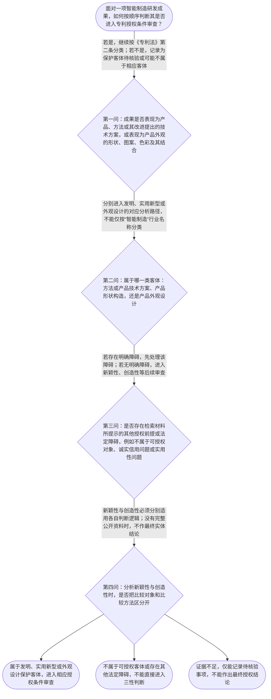

# 专家 A 教学草稿

> 专家：expert_a ｜ 风格：conservative

## 教学模块选择清单

- 当前教学节点：`patent-law-foundation`
- 板块预算：自适应 None/None，总计 None/None

| # | 模块 (block_type) | 类型 | 触发原因 (trigger) | 对应正文段 | 归属 |
|---:|---|:--:|---|---|:--:|
| 1 | `anchor_scenario` | 自适应 | perception=sensing(0.78) / P(L)=0.15<0.3 / cold_start | 从智能制造研发现场识别专利问题｜某智能制造企业研发一条机器人装配线：方案一是改进机器人控制方法，方案二是改变设备的机械构造，… | [A] |
| 2 | `legal_anchor` | 必选 | mandatory | 专利制度基础法条锚定｜《专利法》第二条 | [A] |
| 3 | `worked_example` | 自适应 | cognition.apply=0.34<0.4 / cognition.analyze=0.26<0.3 / cold_start | 智能制造研发成果的逐项归类与审查入口｜某智能制造企业形成三项成果：第一项是用于协调机械臂动作的控制方法；第二项是机器人末端夹具的结… | [A] |
| 4 | `decision_flow` | 自适应 | input=visual(0.74) | 专利基础判断流程图｜面对一项智能制造研发成果，如何按顺序判断其是否进入专利授权条件审查？ | [A] |
| 5 | `mnemonic` | 自适应 | remember=0.72>=0.6 & apply<0.4 / understanding=sequential(0.66) | 专利基础四步记忆表｜专利基础四步表：先“客体”，再“前提”，后“三性”，最后“范围”。其中“三性”内部按“新—创… | [A] |
| 6 | `reflect_prompt` | 自适应 | processing=reflective(0.61) | 把法条判断接回研发流程｜回想一个你接触过的智能制造技术成果：如果把它交给专利代理人，你会先提供哪些事实，才能让代理人… | [A] |
| 7 | `assessment` | 必选 | mandatory | 三类选择题测评入口｜复习专利制度基础及三类保护客体的对应关系 | [A] |
| 8 | `knowledge_synthesis` | 必选 | mandatory | 专利法律制度基础知识关系网｜专利制度基本特征：专利权具有独占性、时间性和地域性；这些是制度层面的定位，具体期限和地域效力… | [A] |
| 9 | `summary_card` | 自适应 | len(knowledge_sub_nodes)=3>=3 | 专利基础一页速查卡｜专利基础判断的主线是先定保护客体和法源，再按不同授权条件分别审查。 | [A] |

## 教学正文

## I — 法律问题

本节的争点不是立即判断某一项智能制造技术“能否授权”或“是否侵权”，而是建立正确的专利法分析入口：第一，研发成果属于哪一种专利保护客体；第二，专利制度的法律文件如何分工；第三，授权条件中的新颖性、创造性和实用性应如何区分并按顺序进入判断。

检索上下文未提供可核验的智能制造领域真实裁判案例、专利号、权利要求书或对比文件，因此本节不虚构“真实案例结论”。下文的智能制造情境仅用于演示分析框架。

## R — 适用规则

### 1. 先确定保护客体

《专利法》第二条规定，发明是“对产品、方法或者其改进所提出的新的技术方案”；实用新型是“对产品的形状、构造或者其结合所提出的适于实用的新的技术方案”；外观设计是对产品的整体或者局部形状、图案、色彩及其结合所作出的富有美感并适于工业应用的新设计。〔RAG: 中华人民共和国专利法.txt — 第二条：发明、实用新型和外观设计的定义〕

因此，智能制造领域的“技术”不是一个可以直接套用的法律分类。机器人控制方法首先要看是否属于发明技术方案；夹具、传感器外壳等产品结构改进要看其形状、构造及结合；控制柜面板的形状、图案、色彩组合则应先按外观设计客体分析。

### 2. 再确定法源和授权审查入口

中国专利制度的基本法源层级可以先作如下定位：专利法规定基本权利和制度框架，专利法实施细则补充实施规则，专利审查指南提供审查中的具体判断指引。检索材料明确指出，一件专利申请必须属于专利法规定的可以授权的对象和主题，才有可能获得专利授权。〔RAG: 专利法专题讲座.txt — “一件专利申请必须属于专利法规定的可以授权的对象和主题，才有可能获得专利授权”〕

检索材料还载明，申请专利和行使专利权应当遵循诚实信用原则，且《专利法》第二十二条第四款规定获得授权的专利应当具有实用性。〔RAG: 专利法专题讲座.txt — “申请专利和行使专利权应当遵循诚实信用原则”及“获得授权的专利应当具有实用性”〕

### 3. 区分三性，不用一个结论代替全部判断

新颖性、创造性和实用性是不同的授权判断问题。新颖性关注申请方案与相关公开资料之间的对应关系；创造性关注本领域技术人员面对相关技术时是否显而易见；实用性关注方案是否具有可实施的实际价值。检索上下文明确支持“实用性”要求以及在新颖性、创造性审查前先判断保护客体和其他前提，但未提供完整的第二十二条原文及全部审查细则。因此，本节只建立边界，不补写未核验的条文号或具体数值。

尤其要避免以下混淆：新颖性判断不能因为多份资料分别出现部分特征，就简单把资料拼接成一个结论；创造性与新颖性虽然都涉及现有技术比较，但判断对象和推理任务不同。现有技术、抵触申请、优先权效力和宽限期属于后续节点，当前不展开为主教学内容。

## A — 规则适用

以智能制造企业的三项研发成果为例：用于协调机械臂动作的控制方法、机器人末端夹具的结构改进、控制柜面板的形状图案色彩组合设计。

第一步，按成果事实识别对象。控制方法的核心是方法技术方案；夹具改进的核心是产品结构；面板的核心是产品外观。行业名称只能帮助理解技术背景，不能替代法律上的客体分类。

第二步，将事实逐项对应《专利法》第二条。控制方法应沿发明客体路径分析；夹具结构可以沿实用新型客体路径分析，同时仍需结合具体方案判断是否适合发明路径；面板外观应沿外观设计客体路径分析。分类结论不能仅凭研发人员称呼或产品宣传语作出。

第三步，核验授权审查入口。若成果不属于可授权客体，或者存在检索材料所提示的其他法定障碍，就不能直接进入新颖性和创造性比较。若客体和前提没有明显障碍，才进入相应授权条件的逐项审查。

第四步，分别组织三性分析。对于新颖性，应明确申请方案的技术特征、相关公开资料及其时间和内容对应关系；对于创造性，应另行分析本领域技术人员和显而易见性；对于实用性，应核验方案能否实施并产生相应实际效果。缺少完整权利要求、公开日期和对比资料时，只能指出待核验事项，不能把“研发完成”“产品试运行”自动等同于某一法律结论。

本节所建立的是授权分析入口，不是侵权判定结论。侵权判定还需要进入专利权已经有效存在、保护范围如何确定以及被诉产品或方法如何与权利要求逐项比对等后续节点。

## C — 结论

处理智能制造专利问题，应遵循“先保护客体，后法源与授权前提，再分别判断新颖性、创造性和实用性，最后进入权利保护范围或侵权比对”的顺序。专利制度以一定期限和地域内的独占性权利换取技术公开，并服务于技术应用和经济发展；但申请或研发成果本身不等于当然获得专利权。

> 常见误区 / 易混淆点
>
> - 把“智能制造技术”当成一种独立专利类型；正确做法是按发明、实用新型、外观设计的法律定义分类。
> - 把“技术很新”直接等同于具备新颖性、创造性和实用性；三性必须分别判断。
> - 用多个对比文件简单拼接来否定新颖性；应先明确新颖性与创造性的判断边界。
> - 把申请、公开、授权和侵权混为同一时点；本节只建立制度基础，具体时间效力和侵权判定留待后续节点。
>
> 本节设有测评，请到【习题】区作答。

### 从智能制造研发现场识别专利问题（anchor_scenario）

> 某智能制造企业研发一条机器人装配线：方案一是改进机器人控制方法，方案二是改变设备的机械构造，方案三是重新设计控制柜的外观。研发负责人希望把三项成果都申请专利，同时担心技术已经在客户工厂试运行、产品照片已经对外展示后，是否还具备申请和授权条件。此时需要先区分保护客体，再判断专利授权的实质条件；不能因为技术“很新”就直接认定一定能够获得专利。

**锚定**：用智能制造研发场景锚定保护客体、专利制度功能和授权实质条件之间的先后关系。

**先想一想**：面对这三个研发成果，你会先判断它们分别属于哪一种专利保护客体，还是先判断是否已经公开？你的判断顺序是什么？

### 专利制度基础法条锚定（legal_anchor）

- **《专利法》第二条**：专利法保护的客体分为发明、实用新型和外观设计：发明覆盖产品、方法或其改进提出的技术方案；实用新型针对产品的形状、构造或其结合；外观设计针对产品的形状、图案、色彩或其结合形成的设计。
- **《专利法》第二十二条第四款**：实用性是授权条件之一，技术方案应当能够制造或使用并产生相应的实际效果；检索原文仅直接提供了“应当具有实用性”的表述，本节不对未提供的完整条文内容作扩展。
- **《专利法》第二十条第一款**：申请专利和行使专利权都应遵循诚实信用原则，不能通过不当方式取得或行使权利。

**为何重要**：本节点先解决“专利制度保护什么、怎样进入授权审查”的基础问题。只有先锁定客体和审查入口，后续的新颖性、创造性、实用性以及侵权保护范围判断才不会混淆。

### 智能制造研发成果的逐项归类与审查入口（worked_example）

**案情/例题**：某智能制造企业形成三项成果：第一项是用于协调机械臂动作的控制方法；第二项是机器人末端夹具的结构改进；第三项是控制柜面板的形状、图案和色彩组合设计。企业希望直接用一份“智能制造专利”统一保护。教学任务是演示如何从保护客体进入授权条件判断，而不是直接评价其最终能否授权。
**适用规则**：适用《专利法》第二条区分发明、实用新型和外观设计；依据检索上下文，实质审查中应先判断保护客体及其他授权前提，再进行新颖性、创造性等审查；《专利法》第二十二条第四款要求获得授权的专利具有实用性。
**分步推演**：
1. 先看成果的法律对象，而不是先看行业名称。控制方法具有方法技术方案特征；夹具改进涉及产品结构；面板的形状、图案和色彩组合属于产品外观设计的描述范围。 → *第一步：按技术成果的对象和特征分类。*
2. 将分类结果与《专利法》第二条对应：发明可以是产品、方法或其改进提出的新的技术方案；实用新型针对产品的形状、构造或其结合；外观设计针对产品外观要素及其结合。 → *第二步：把事实逐项对照保护客体定义。*
3. 进入授权审查前提。检索材料指出，一件专利申请必须属于可以授权的对象和主题，才有可能获得授权；还要注意检索材料明确提到的诚实信用原则和实用性要求。 → *第三步：先审客体和其他前提，再进入三性等实质判断。*
4. 对于新颖性，比较对象应围绕申请方案的全部技术特征与相关公开资料展开；对于创造性，不能把新颖性中的单独对比规则直接替代创造性分析。当前没有完整对比文件，因此只建立方法，不作实体结论。 → *第四步：区分新颖性与创造性的比较逻辑，避免混用。*
**结论**：该研发组合不能仅以“都是智能制造技术”为理由统一处理。控制方法通常应先按发明客体分析，机械结构改进应先按实用新型或发明客体分析，控制柜外观改进应先按外观设计客体分析；之后还要分别核验授权条件。由于检索上下文没有提供该企业的公开日期、完整技术特征和测试资料，不能据此认定任何一项已经具备新颖性或最终能够授权。
**本题要点**：处理智能制造专利问题时，先分类保护客体，再按授权条件逐层判断，不能用“技术先进”替代法定分析。

### 专利基础判断流程图（decision_flow）

**决策问题**：面对一项智能制造研发成果，如何按顺序判断其是否进入专利授权条件审查？



### 专利基础四步记忆表（mnemonic）

**记忆锚**：专利基础四步表：先“客体”，再“前提”，后“三性”，最后“范围”。其中“三性”内部按“新—创—实”分别记录判断对象，禁止把三者合并成一个“技术先进”结论。
**映射**：
- 客体
- 前提
- 三性
- 范围
- 新
- 创
- 实
**何时用**：看到“这项技术能不能申请”“为什么可能不授权”或需要处理多个对比资料时，按“客体—前提—三性—范围”逐格核对；涉及新颖性和创造性时单独检查比较方法。

### 把法条判断接回研发流程（reflect_prompt）

**反思问题**：回想一个你接触过的智能制造技术成果：如果把它交给专利代理人，你会先提供哪些事实，才能让代理人判断保护客体和后续授权条件？

**关注要点**：成果究竟是方法、产品结构，还是外观设计；研发、试运行、展会、客户交付和公开发布的时间及对象；哪些结论有法条或正式资料依据，哪些只是工程人员的直觉判断；新颖性与创造性是否被使用了不同的比较对象和判断方法

**连接**：连接到学习者已有的智能制造研发经验，以及项目立项、试运行、发布和申请之间的时间记录。

### 专利法律制度基础知识关系网（knowledge_synthesis）

**知识框架**：
- 专利制度基本特征：专利权具有独占性、时间性和地域性；这些是制度层面的定位，具体期限和地域效力需结合后续规则。
- 中国专利制度体系：专利法规定基本制度，专利法实施细则补充程序和实施规则，专利审查指南提供审查判断的操作规范。
- 三类保护客体：发明是对产品、方法或其改进提出的新的技术方案；实用新型针对产品形状、构造或其结合；外观设计针对产品外观要素及其结合。
- 专利制度作用：通过授予一定期限和地域内的排他性权利，换取技术公开，并促进技术应用和经济发展。
- 中国制度审查特点：检索材料显示，专利实质审查中应先判断保护客体及其他授权前提，再进行新颖性、创造性等审查；检索材料未提供完整历史沿革依据，因此不扩展具体年份或制度变迁事实。
**概念关系**：先以专利制度基本概念确定权利的性质，再用法律体系定位法源层级。；先判断成果属于哪一种保护客体，再判断是否满足相应授权条件。；在授权条件中，应把新颖性、创造性和实用性作为不同判断问题；新颖性不得用多个对比文件简单拼接的方式替代，创造性也不能与新颖性混为一谈。；技术公开、权利保护和技术应用共同构成专利制度的功能链条。
**必记**：专利法第二条是区分发明、实用新型和外观设计保护客体的基础条文。；专利制度的基本特征是独占性、时间性和地域性，专利权不是没有期限、没有地域限制的永久权利。；专利申请不能只看技术是否新，还要先确认保护客体和其他授权前提。；新颖性、创造性、实用性是不同的判断问题；至少要先记住新颖性与创造性不能使用同一套比较逻辑。

### 专利基础一页速查卡（summary_card）

**要点卡**：
- **专利权三特征**：独占性说明权利具有排他效果，时间性和地域性说明排他效果受期限与法域限制。
- **法源体系**：专利法定基本规则，实施细则补充实施程序，审查指南细化审查判断。
- **三类保护客体**：发明看产品、方法或其改进的技术方案，实用新型看产品形状构造，外观设计看产品外观要素及其结合。
- **授权判断顺序**：先判断保护客体和其他授权前提，再进入新颖性、创造性等实质条件分析。
- **新颖性与创造性边界**：新颖性和创造性必须区分判断对象与比较方法，不能只背“技术先进”这一笼统结论。
**必背**：《专利法》第二条对发明、实用新型、外观设计的定义；专利权具有独占性、时间性和地域性；专利法、实施细则、审查指南在制度体系中的基本分工；授权判断先客体和前提、后新颖性与创造性等实质条件；新颖性与创造性不能混用比较方法
**一句话总结**：专利基础判断的主线是先定保护客体和法源，再按不同授权条件分别审查。

### 三类选择题测评入口（assessment）

**三类覆盖**：backward_review、forward_probe、weakness_probe
**题目**：
- q-foundation-01：复习专利制度基础及三类保护客体的对应关系
- q-protection-01：仅探测专利权保护的基本对象和生效前提
- q-confusion-01：辨析新颖性单独对比与创造性组合判断的边界


## 结构化字段

## knowledge_points

```json
[
  {
    "node_id": "patent-law-foundation",
    "kc_name": "专利制度的基本概念与特征：独占性、时间性、地域性"
  },
  {
    "node_id": "patent-law-foundation",
    "kc_name": "中国专利制度体系：专利法、专利法实施细则、专利审查指南"
  },
  {
    "node_id": "patent-law-foundation",
    "kc_name": "专利保护的三种客体：发明、实用新型、外观设计"
  },
  {
    "node_id": "patent-law-foundation",
    "kc_name": "专利制度的作用：激励发明创造、促进技术公开、推动技术应用和经济发展"
  },
  {
    "node_id": "patent-law-foundation",
    "kc_name": "中国专利制度发展历程与特点：早期公开延迟审查、初步审查制与实质审查制并存"
  }
]
```

## legal_basis

```json
[
  {
    "article": "《专利法》第二条",
    "source": "中华人民共和国专利法.txt：发明、实用新型和外观设计的定义"
  },
  {
    "article": "《专利法》第二十二条第四款",
    "source": "专利法专题讲座.txt：获得授权的专利应当具有实用性"
  },
  {
    "article": "《专利法》第二十条第一款",
    "source": "专利法专题讲座.txt：申请专利和行使专利权应当遵循诚实信用原则"
  }
]
```

## risks

```json
[
  {
    "risk": "检索上下文未提供完整的《专利法》第二十二条关于新颖性、创造性、实用性的全部原文，正文不应补写未核验的条文措辞或具体审查细则。",
    "related_node_id": "patent-law-foundation"
  },
  {
    "risk": "检索上下文未提供可核验的智能制造真实案例及其裁判文书，当前仅使用明确标注的教学场景，不将其表述为真实案例。",
    "related_node_id": "patent-law-foundation"
  },
  {
    "risk": "当前节点是专利法律制度基础，侵权判定、新颖性具体比对、抵触申请和宽限期不作为本节主教学章节展开。",
    "related_node_id": "patent-law-foundation"
  }
]
```

## draft_stage

```json
"debate"
```

## irac

```json
{
  "issue": "智能制造研发成果能否进入专利保护与授权分析，以及新颖性、创造性和实用性在基础判断中的位置和边界是什么？",
  "rule": "《专利法》第二条规定发明、实用新型和外观设计的保护客体。检索材料指出，专利申请必须属于可以授权的对象和主题；《专利法》第二十条第一款要求申请专利和行使专利权遵循诚实信用原则；《专利法》第二十二条第四款规定获得授权的专利应当具有实用性。检索材料还指出，实质审查中应先判断上述前提，再进行新颖性和创造性审查。",
  "application": "将智能制造成果分类时，控制方法、设备结构改进和产品外观设计应分别对照《专利法》第二条的客体定义；之后再按相应路径核验授权前提和实质条件。对于新颖性与创造性的比较，必须分别确定判断对象和比较方法。当前检索上下文没有提供完整对比文件、公开日期或具体权利要求，因而只能建立判断框架，不能对用户所称真实案件作出个案结论。",
  "conclusion": "专利基础分析应遵循“先保护客体和法源定位，再审授权前提，后分别判断新颖性、创造性和实用性”的顺序。当前资料足以说明三类客体和审查入口，但不足以支持具体智能制造真实案例的最终新颖性或侵权结论。"
}
```

## interactive_questions

```json
[
  {
    "qid": "q-foundation-01",
    "category": "remember",
    "difficulty": "L1",
    "source_tag": "backward_review",
    "kc_node_id": "patent-law-foundation",
    "question": "下列哪一项正确概括专利制度中专利权的基本特征？",
    "answer": "B",
    "options": [
      "A.专利权具有永久性、全球性和当然排他性",
      "B.专利制度通常具有独占性、时间性和地域性",
      "C.专利权只具有合同效力，不具有排他效力",
      "D.专利权一经申请即自动产生且没有期限"
    ]
  },
  {
    "qid": "q-protection-01",
    "category": "remember",
    "difficulty": "L1",
    "source_tag": "forward_probe",
    "kc_node_id": "patent-rights-protection",
    "question": "下列哪一项最符合专利权保护的基础理解？",
    "answer": "C",
    "options": [
      "A.申请文件提交后即可对所有产品主张侵权责任",
      "B.任何技术构思都自动属于专利权保护范围",
      "C.专利权保护需要以依法获得专利权及相应保护范围为前提",
      "D.专利权的保护范围完全由产品销售数量决定"
    ]
  },
  {
    "qid": "q-confusion-01",
    "category": "analyze",
    "difficulty": "L2",
    "source_tag": "weakness_probe",
    "kc_node_id": "patent-law-foundation",
    "question": "关于新颖性与创造性判断边界，下列哪一项表述正确？",
    "answer": "A",
    "options": [
      "A.判断新颖性时原则上应围绕单一对比资料是否公开了权利要求的全部技术特征，不能把多份资料简单拼接代替新颖性判断",
      "B.只要多份对比资料分别出现部分特征，就必然可以直接否定新颖性",
      "C.新颖性与创造性完全采用同一比较方法，因此无需区分二者",
      "D.只要技术方案属于智能制造领域，就当然具备新颖性和创造性"
    ]
  }
]
```

## knowledge_synthesis

```json
{
  "node": "patent-law-foundation",
  "coverage": [
    {
      "node_id": "patent-law-foundation"
    },
    {
      "node_id": "patent-law-framework"
    },
    {
      "node_id": "patent-rights-nature"
    }
  ],
  "confusable_pairs": [
    {
      "pair": "新颖性与创造性：本节先区分判断对象和比较方法；不能以多份资料简单拼接直接替代新颖性判断。"
    },
    {
      "pair": "现有技术与抵触申请：当前检索上下文未提供二者的直接法条或审查规则，不能在本节擅自展开或混同。"
    }
  ]
}
```
