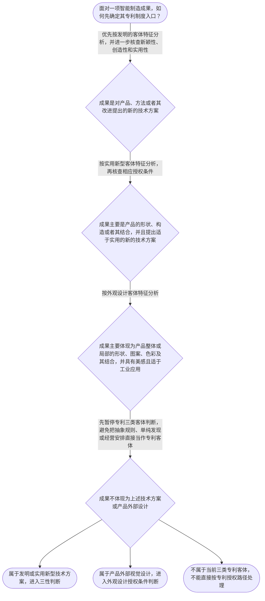

# 专家 B 教学草稿

> 专家：expert_b ｜ 风格：accessible

## 教学模块选择清单

- 当前教学节点：`patent-law-foundation`
- 板块预算：自适应 6/6，总计 9/9

| # | 模块 (block_type) | 类型 | 触发原因 (trigger) | 对应正文段 | 归属 |
|---:|---|:--:|---|---|:--:|
| 1 | `anchor_scenario` | 自适应 | perception=sensing(0.78) / P(L)=0.15<0.3 / cold_start | 从机器人产线看专利制度总地图｜某智能制造企业正在研发一条用于汽车零部件装配的机器人产线。研发工程师小林提出：让机器人通过视… | [B] |
| 2 | `legal_anchor` | 必选 | mandatory | 法条锚定：先确定保护客体，再理解授权门槛｜《专利法》第二条 | — |
| 3 | `worked_example` | 自适应 | cognition.apply=0.34<0.4 / cognition.analyze=0.26<0.3 / cold_start | 演示：机器人分拣系统如何进入专利判断｜某智能工厂设计了一套机器人分拣系统：系统包括视觉识别模块、机械臂和控制方法，能够根据零件颜色… | [B] |
| 4 | `decision_flow` | 自适应 | input=visual(0.74) | 专利客体识别决策流｜面对一项智能制造成果，如何先确定其专利制度入口？ | [B] |
| 5 | `mnemonic` | 自适应 | remember=0.72>=0.6 & apply<0.4 / understanding=sequential(0.66) | 四问表：把专利基础记成可执行步骤｜专利基础四问表：‘客体是什么、三性过几关、制度谁来管、权利有边界’；其中三性用‘新—创—实’… | [B] |
| 6 | `reflect_prompt` | 自适应 | processing=reflective(0.61) | 把专利基础迁移到你的研发项目｜回想你接触过的一项自动化或智能制造技术：如果要为它设计专利分析清单，你会先记录技术方案、产品… | [B] |
| 7 | `assessment` | 必选 | mandatory | 三类测评入口｜识别专利法规定的三类发明创造客体。 | — |
| 8 | `knowledge_synthesis` | 必选 | mandatory | 专利法律制度基础知识网｜专利制度的基本概念与特征：专利权通常体现独占性、时间性和地域性，具体边界仍以法律规定和授权文… | — |
| 9 | `summary_card` | 自适应 | len(knowledge_sub_nodes)=3>=3 | 专利法律制度基础速查卡｜先认清保护客体，再按三性分关判断，并始终记住专利权的时间与地域边界。 | [B] |

## 教学正文

## 1. 场景导入

想象你是智能制造企业的研发工程师：团队做出一套机器人分拣系统，利用视觉传感器识别零件，再由控制系统调整机械臂的抓取路径。申请专利前，大家可能会连续问三类问题：这究竟属于发明、实用新型还是外观设计？能不能获得专利？未来竞争对手做出相似设备，判断侵权时又该看什么？本节先搭好专利法律制度的“总地图”，新颖性和侵权的具体判断会在后续节点展开。

先说明证据边界：当前检索材料提供了专利法条文和专利法律知识解读，没有提供可核验的智能制造领域真实裁判案例。因此，以上机器人产线是教学拟制场景，不是真实案例；法条回扣以检索到的法律文本为准。

## 2. 人话解释

专利制度可以先用四个问题理解：第一，法律保护的“东西”是什么；第二，申请由谁受理、审查和授权；第三，授权要过哪些门槛；第四，获得的权利边界在哪里。

“保护客体”就是法律允许申请哪一类专利的对象。发明通常是产品、方法或者其改进提出的技术方案；实用新型主要看产品的形状、构造或者二者结合；外观设计主要看产品整体或局部的形状、图案、色彩及其结合所形成的设计。机器人控制方法和分拣系统的技术方案，不能因为都属于智能制造，就自动归入同一种专利。

“授权三性”是三道不同的门：新颖性关注技术是否已经属于现有技术；创造性关注相对于现有技术是否达到法律要求的非显而易见程度；实用性关注能否制造或使用并产生积极效果。能用，不等于没公开；没公开，也不等于一定具有创造性。三性必须分别判断。

专利权的基本特征可以这样理解：独占性意味着权利人在法定范围内具有排他效力；时间性意味着保护不是永久的；地域性意味着原则上要按相应法域判断。专利制度用有限范围的独占保护换取技术公开，从而鼓励创新并促进技术传播和应用。

## 3. 法条回扣

《专利法》第二条规定：“本法所称的发明创造是指发明、实用新型和外观设计。发明，是指对产品、方法或者其改进所提出的新的技术方案。实用新型，是指对产品的形状、构造或者其结合所提出的适于实用的新的技术方案。外观设计，是指对产品的整体或者局部的形状、图案或者其结合以及色彩与形状、图案的结合所作出的富有美感并适于工业应用的新设计。”〔RAG: 中华人民共和国专利法.txt — 第二条：发明创造包括发明、实用新型和外观设计，并分别界定三类客体〕

《专利法》第二十二条规定，授予专利权的发明和实用新型应当具备新颖性、创造性和实用性；该条还分别规定了三性的含义，并指出现有技术是申请日前在国内外为公众所知的技术。〔RAG: 中华人民共和国专利法.txt — 第二十二条：发明和实用新型应具备新颖性、创造性和实用性，现有技术是申请日前在国内外为公众所知的技术〕

《专利法》第三条规定，国务院专利行政部门负责管理全国的专利工作，统一受理和审查专利申请，依法授予专利权。〔RAG: 中华人民共和国专利法.txt — 第三条：国务院专利行政部门负责管理全国专利工作，统一受理和审查专利申请并依法授予专利权〕

因此，看到一项智能制造成果时，建议先按“技术方案或外观设计—对应专利客体—相应授权条件”的顺序定位，不能把申请、审查、授权、保护和侵权混成一个概念。

## 4. 类比 / 口诀

可以使用“专利基础四问表”：客体是什么、三性过几关、制度谁来管、权利有边界。做题时再用“新—创—实”逐项核对：新颖性、创造性、实用性。这个口诀只帮助记忆检查顺序，不替代法条，也不能据此直接判断某个具体方案一定授权或一定侵权。

类比的边界是：把三性比作三道门，只能说明它们是不同门槛；不能理解为现实审查永远机械地按固定先后作出结论，也不能把“实用”理解成已经自动通过“新颖”和“创造”。

## 5. 应试提示

遇到题干中的“机器人、产线、算法控制、传感器”等行业词，不要先按行业作结论。第一步，抓技术对象：是方法、产品结构，还是产品外观；第二步，判断对应的专利客体；第三步，若题目问授权条件，再分别定位新颖性、创造性和实用性。

看到“能够制造”“可以使用”“产生积极效果”，它主要提示实用性，不足以单独证明新颖性或创造性。看到“申请日前在国内外为公众所知”，它对应现有技术的基本入口。看到“权利要求”或“图片、照片”，则提示后续保护范围问题；当前只作入口识别，不提前完成侵权判定。

## 6. 互动提问

请先在【习题】区完成本节选择题，再回到你的研发经验，尝试为一项智能制造技术填写“客体—三性—保护边界”三栏清单。

### 从机器人产线看专利制度总地图（anchor_scenario）

> 某智能制造企业正在研发一条用于汽车零部件装配的机器人产线。研发工程师小林提出：让机器人通过视觉传感器定位零件，再由控制系统自动调整抓取姿态。公司准备申请专利，但团队内部出现了三个问题：这项技术属于哪一种专利保护客体？专利制度究竟保护什么、保护多久、在哪些范围内有效？如果未来竞争对手采用相似方案，判断是否侵权又应先看什么文件？这些问题需要先建立专利制度的总地图，再进入新颖性和侵权判定。

**锚定**：用智能制造研发场景锚定专利客体、专利权基本特征、制度体系与后续三性及侵权判断的入口。

**先想一想**：先不查法条：你认为这项机器人产线技术与一件普通商品相比，最需要额外满足哪些法律条件，才能获得专利保护？

### 法条锚定：先确定保护客体，再理解授权门槛（legal_anchor）

- **《专利法》第二条**：专利法所说的发明创造包括发明、实用新型和外观设计：发明偏向产品、方法或其改进的技术方案；实用新型主要针对产品的形状、构造或其结合；外观设计针对产品外部的形状、图案、色彩及其结合，并要求富有美感、适于工业应用。
- **《专利法》第二十二条**：发明和实用新型要获得专利授权，必须同时具备新颖性、创造性和实用性；新颖性关注是否属于现有技术，创造性关注技术方案是否具有规定程度的非显而易见性，实用性关注能否制造或使用并产生积极效果。
- **《专利法》第三条**：国务院专利行政部门负责管理全国专利工作，统一受理和审查专利申请并依法授予专利权。

**为何重要**：第二条先解决‘保护什么’，第二十二条建立授权实质条件的总框架，第三条说明制度由谁运行。后续学习新颖性、创造性、实用性和侵权判定时，都要从这些入口定位判断对象。

### 演示：机器人分拣系统如何进入专利判断（worked_example）

**案情/例题**：某智能工厂设计了一套机器人分拣系统：系统包括视觉识别模块、机械臂和控制方法，能够根据零件颜色与形状自动改变抓取路径。研发团队希望判断申请专利前应先解决哪些法律问题，而不是立即下结论说该方案一定能获授权。
**适用规则**：适用《专利法》第二条和第二十二条。第二条用于判断保护客体；第二十二条用于确认发明、实用新型授权所需的新颖性、创造性和实用性三项条件。
**分步推演**：
1. 先看方案的技术内容：案情涉及视觉模块、机械臂及控制方法，核心是解决自动分拣这一技术问题的技术方案，而不是单纯的抽象规则或经营安排。 → *第一步：先识别是否属于专利法要处理的技术方案。*
2. 再按保护对象分类：如果权利要求保护的是控制机器人完成分拣的方法或系统技术方案，通常应围绕发明的定义分析；如果只保护产品的形状、构造或其结合，则进入实用新型的客体分析；若保护的是产品外部视觉效果，则才考虑外观设计。 → *第二步：区分发明、实用新型和外观设计，不能只因技术属于机器人领域就机械归类。*
3. 确认客体后，再分别检查新颖性、创造性和实用性。三性是并列的授权条件，‘能够制造或使用并产生积极效果’只能对应实用性这一项，不能替代对现有技术和显而易见性的审查。 → *第三步：按三性分别核查，不能用一项条件代替其他条件。*
**结论**：该教学拟制方案的第一步是确认其属于技术方案及哪一种专利客体，第二步才是分别核查三性；不能因为方案能制造、能使用并有积极效果，就直接推导其具备新颖性和创造性。
**本题要点**：遇到研发方案时，按‘技术方案识别—客体分类—三性分别判断’的顺序建立判定链。

### 专利客体识别决策流（decision_flow）

**决策问题**：面对一项智能制造成果，如何先确定其专利制度入口？



### 四问表：把专利基础记成可执行步骤（mnemonic）

**记忆锚**：专利基础四问表：‘客体是什么、三性过几关、制度谁来管、权利有边界’；其中三性用‘新—创—实’逐项核对，绝不合并成一个结论。
**映射**：
- 客体
- 新—创—实
- 谁来管
- 有边界
**何时用**：做专利法基础题、阅读智能制造研发方案或开始新颖性与侵权分析前，先按四问表定位：先客体，再三性，再制度运行，最后意识到保护边界。

### 把专利基础迁移到你的研发项目（reflect_prompt）

**反思问题**：回想你接触过的一项自动化或智能制造技术：如果要为它设计专利分析清单，你会先记录技术方案、产品结构还是外观效果？为什么？

**关注要点**：判断对象究竟是方法、产品结构还是产品外观；不要把‘能用’直接等同于‘新颖’或‘有创造性’；记录方案的具体技术特征，为后续与现有技术或权利要求比较做准备

**连接**：连接到学习者已有的智能制造研发经验，以及后续的新颖性、创造性和侵权判定节点。

### 专利法律制度基础知识网（knowledge_synthesis）

**知识框架**：
- 专利制度的基本概念与特征：专利权通常体现独占性、时间性和地域性，具体边界仍以法律规定和授权文件为准。
- 中国专利制度体系：以《专利法》为基本法律，并结合《专利法实施细则》和《专利审查指南》理解申请、审查与授权规则。
- 专利保护的三种客体：发明、实用新型和外观设计分别对应技术方案、产品形状构造及其结合、以及产品外部设计。
- 专利制度的作用：通过授予一定期限和范围的权利激励发明创造，同时以公开技术促进技术应用和经济发展。
- 中国专利制度的发展与审查特点：检索材料显示制度同时涉及申请公开、初步审查和实质审查等不同环节，不能把受理、公开、审查和授权混为一谈。
**概念关系**：先识别保护客体，再进入相应授权条件和审查路径。；专利制度以法律授予的有限保护换取技术公开，独占性必须放在时间性和地域性边界内理解。；新颖性、创造性和实用性是不同判断维度；后续学习时应坚持判断对象、比较基准和判断方法分别对应。
**必记**：专利法基础首先回答‘保护什么、由谁审查、保护有何边界’。；发明、实用新型和外观设计是三类不同专利客体，不能仅按技术行业名称归类。；发明和实用新型授权需要同时具备新颖性、创造性和实用性；实用性不能替代新颖性或创造性。

### 专利法律制度基础速查卡（summary_card）

**要点卡**：
- **三类保护客体**：发明看产品、方法或其改进的技术方案；实用新型看产品形状构造；外观设计看产品外部设计。
- **专利权三种基本特征**：独占性是有排他效力，时间性是保护有期限，地域性是原则上按法域发生效力。
- **授权三性**：新颖性、创造性、实用性是发明和实用新型授权的三道不同门槛。
- **制度运行体系**：《专利法》定基本规则，实施细则和审查指南帮助理解具体程序与审查操作。
**必背**：发明、实用新型、外观设计三类客体的基本区分；新颖性、创造性、实用性的概念不能混同；专利制度以有限期限和地域范围的独占保护换取技术公开
**一句话总结**：先认清保护客体，再按三性分关判断，并始终记住专利权的时间与地域边界。

### 三类测评入口（assessment）

**三类覆盖**：backward_review、forward_probe、weakness_probe
**题目**：
- q_backward_01：识别专利法规定的三类发明创造客体。
- q_forward_01：前置探测专利保护范围通常从何种法律文件或对象确定。
- q_weakness_01：辨析实用性与新颖性、创造性不能相互替代。


## 结构化字段

## knowledge_points

```json
[
  {
    "node_id": "patent-law-foundation",
    "kc_name": "专利制度的基本概念与特征：独占性、时间性、地域性"
  },
  {
    "node_id": "patent-law-foundation",
    "kc_name": "中国专利制度体系：专利法、专利法实施细则、专利审查指南"
  },
  {
    "node_id": "patent-law-foundation",
    "kc_name": "专利保护的三种客体：发明、实用新型、外观设计"
  },
  {
    "node_id": "patent-law-foundation",
    "kc_name": "专利制度的作用：激励发明创造、促进技术公开、推动技术应用和经济发展"
  },
  {
    "node_id": "patent-law-foundation",
    "kc_name": "中国专利制度发展历程与特点：申请公开、初步审查制与实质审查制并存"
  }
]
```

## legal_basis

```json
[
  {
    "article": "《专利法》第二条",
    "source": "中华人民共和国专利法.txt：第二条规定发明创造包括发明、实用新型和外观设计，并分别界定其基本含义。"
  },
  {
    "article": "《专利法》第二十二条",
    "source": "中华人民共和国专利法.txt：第二十二条规定发明和实用新型应具备新颖性、创造性和实用性，并定义现有技术。"
  },
  {
    "article": "《专利法》第三条",
    "source": "中华人民共和国专利法.txt：第三条规定国务院专利行政部门负责管理全国专利工作，统一受理和审查专利申请并依法授予专利权。"
  }
]
```

## risks

```json
[
  {
    "risk": "学习者可能把本节的三性总框架误当成已经完成新颖性、创造性或现有技术的具体判断；本稿仅建立入口，不据此判定后续节点已掌握。",
    "related_node_id": "novelty"
  },
  {
    "risk": "学习者可能把专利客体分类直接等同于侵权成立；侵权还需结合权利要求、被诉方案及具体行为逐项比对。",
    "related_node_id": "patent-rights-protection"
  },
  {
    "risk": "当前检索上下文未提供可核验的智能制造领域真实裁判案例，因此场景均明确作为教学拟制情境，不冒充真实案例。",
    "related_node_id": null
  }
]
```

## draft_stage

```json
"debate"
```

## interactive_questions

```json
[
  {
    "qid": "q_backward_01",
    "category": "remember",
    "difficulty": "L1",
    "source_tag": "backward_review",
    "kc_node_id": "patent-law-foundation",
    "question": "根据《专利法》第二条，下列哪一项正确列出了专利法所称的发明创造类型？",
    "answer": "B",
    "options": [
      "A. 只有发明",
      "B. 发明、实用新型和外观设计",
      "C. 只有实用新型和外观设计",
      "D. 任何商业经营方案都属于发明创造"
    ]
  },
  {
    "qid": "q_forward_01",
    "category": "remember",
    "difficulty": "L1",
    "source_tag": "forward_probe",
    "kc_node_id": "patent-rights-protection",
    "question": "关于专利保护范围的前置认识，下列哪一项最准确？",
    "answer": "C",
    "options": [
      "A. 只要产品使用了相似技术就必然侵权",
      "B. 保护范围只由研发人员口头介绍决定",
      "C. 后续判断通常需要回到权利要求或外观设计图片、照片等法律载体",
      "D. 保护范围与授权文件无关"
    ]
  },
  {
    "qid": "q_weakness_01",
    "category": "analyze",
    "difficulty": "L2",
    "source_tag": "weakness_probe",
    "kc_node_id": "patent-law-foundation",
    "question": "某研发人员认为，只要一项智能制造技术能够制造、使用并产生积极效果，就当然同时具备新颖性、创造性和实用性。下列判断最准确的是？",
    "answer": "A",
    "options": [
      "A. 实用性只是三性之一，能制造或使用并产生积极效果不能替代新颖性和创造性",
      "B. 只要具有实用性，就当然具有新颖性和创造性",
      "C. 只要属于智能制造领域，就当然具备三性",
      "D. 新颖性、创造性和实用性是同一个判断标准的不同叫法"
    ]
  }
]
```

## knowledge_synthesis

```json
{
  "node": "patent-law-foundation",
  "coverage": [
    {
      "node_id": "patent-rights-nature"
    },
    {
      "node_id": "patent-law-framework"
    },
    {
      "node_id": "patent-law-foundation"
    },
    {
      "node_id": "patent-system-overview"
    }
  ],
  "confusable_pairs": [
    {
      "pair": "实用性与新颖性、创造性：能制造或使用并产生积极效果，不代表技术方案没有被公开，也不代表其对本领域技术人员非显而易见。"
    },
    {
      "pair": "发明、实用新型与外观设计：分别关注技术方案、产品形状构造及其结合、产品外部设计，不能按所属行业简单区分。"
    }
  ]
}
```
