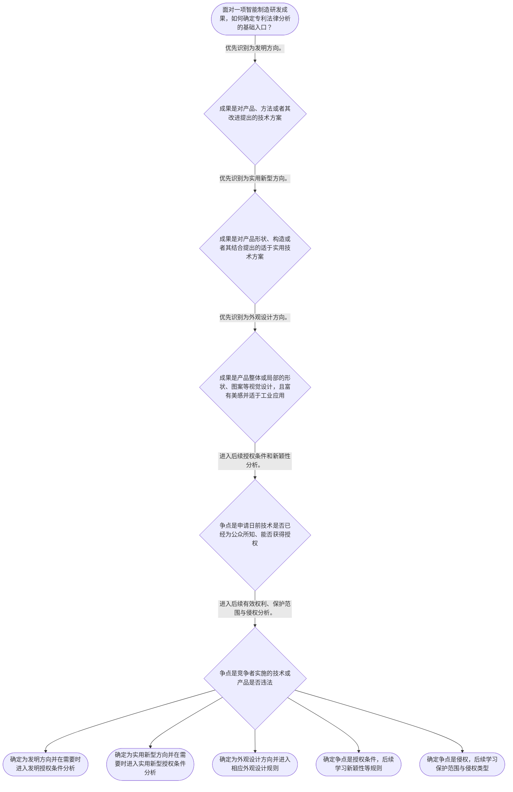

# 整合后的课程完整内容与习题

## 教学模块选择清单

- 当前教学节点：`patent-law-foundation`
- 板块预算：自适应 5/6，总计 9/9

| # | 模块 (block_type) | 类型 | 触发原因 (trigger) | 对应正文段 | 归属 |
|---:|---|:--:|---|---|:--:|
| 1 | `anchor_scenario` | 自适应 | perception=sensing(0.78) / cold_start | 智能产线的分类入口｜某智能制造企业在电机装配线上形成三项研发成果：依据振动数据调整维护周期的控制方案、可快速拆装… | [A+B融合] |
| 2 | `legal_anchor` | 必选 | mandatory | 法条锚定：客体、审查与三性入口｜《中华人民共和国专利法》第二条 | [A] |
| 3 | `worked_example` | 自适应 | cognition.analyze=0.29<0.3 / cold_start | 示范：从技术描述确定制度入口｜某工厂准备为一项“根据设备运行数据调整维护提醒参数”的研发成果整理知识产权材料。研发记录中同… | [A+B融合] |
| 4 | `decision_flow` | 自适应 | input=visual(0.74) | 客体识别与问题分流流程｜面对一项智能制造研发成果，如何确定专利法律分析的基础入口？ | [A] |
| 5 | `mnemonic` | 自适应 | understanding=sequential(0.67) | 分类与分流口诀｜“发实外，授权侵”：发看方法或技术方案，实看产品结构，外看产品视觉设计；授权看三性，侵权看保… | [B] |
| 6 | `reflect_prompt` | 自适应 | processing=reflective(0.61) | 把框架带回研发现场｜回想一项智能制造研发成果：研发人员若只说“这是自动化创新”，你会追问哪些事实，才能判断它更接… | [B] |
| 7 | `assessment` | 必选 | mandatory | 本节三类测评｜识别实用新型所对应的产品结构技术方案。 | [A+B融合] |
| 8 | `knowledge_synthesis` | 必选 | mandatory | 专利法律制度基础总览｜制度特征：独占性、时间性、地域性是观察专利权的基础维度；当前检索上下文未提供具体期限和地域效… | [A+B融合] |
| 9 | `summary_card` | 自适应 | len(knowledge_sub_nodes)=3>=3 | 制度基础速查卡｜智能制造专利分析的起点是：先按法定客体分类，再按授权或权利保护争点分流；真实案例必须有可核验… | [A+B融合] |

## 教学正文

## 一、先建立专利分析入口

面对智能制造研发成果，第一步不是立刻回答“是否新颖”或“是否侵权”，而是先识别要保护的对象。机器人控制方法、设备结构、产品面板视觉设计即使服务于同一条产线，也可能属于不同的法定客体。

关于“智能制造领域真实案例”，本轮检索上下文仅提供专利法条、制度解读和一般侵权分析材料，没有提供可核验的案件名称、案号、裁判文书或公开来源。因此，不能把下文教学情境冒充真实案件，也不能编造案件事实或裁判结论。后续如取得具体裁判文书，应另行补充其案号、法院、事实范围和裁判观点。

## 二、先区分三种发明创造

《专利法》第二条规定，发明创造包括发明、实用新型和外观设计；发明是对产品、方法或者其改进所提出的新的技术方案，实用新型是对产品形状、构造或者其结合所提出的适于实用的新的技术方案，外观设计是对产品整体或者局部的形状、图案或者其结合，以及色彩与形状、图案结合所作出的富有美感并适于工业应用的新设计。〔RAG: 中华人民共和国专利法.txt — 第二条：发明创造是指发明、实用新型和外观设计，并分别规定三者定义〕

在智能制造项目中，可以先观察成果的表达对象：依据数据调整设备运行参数的控制逻辑，通常应沿方法技术方案方向识别；夹具、支架或传感器安装部件的产品结构，通常应沿实用新型方向识别；设备外壳或面板的形状、图案、色彩组合，则应沿外观设计方向识别。这里的“方向”只是初步客体识别，不等于已经满足全部授权条件。

## 三、法源与制度功能

这个分类只解决“成果是什么”，不等于已经取得专利权。国务院专利行政部门统一受理和审查专利申请，并依法授予专利权。〔RAG: 中华人民共和国专利法.txt — 第三条：统一受理和审查专利申请，依法授予专利权〕

中国专利制度的学习框架包括专利法、专利法实施细则和专利审查指南。当前检索上下文直接提供了专利法原文和部分制度解读，未提供实施细则、审查指南的具体原文，因此本节只把后二者作为后续法源与审查学习主题，不虚构具体条款或程序细节。

检索资料将制度功能概括为：鼓励发明创造，推动发明创造的应用，提高创新能力，最终促进科学技术进步和经济社会发展。〔RAG: 专利法律知识详细解读.txt — “鼓励发明创造”—“推动发明创造的应用”—“提高创新能力”，最终实现“促进科学技术进步和经济社会发展”〕专利制度中的公开与保护具有制度上的交换关系，但“公开技术”不等于当然取得专利权，仍须满足相应条件并经过法定程序。

## 四、制度特征与审查特点

专利权可用独占性、时间性、地域性三个维度建立基础印象。独占性提示侵权分析必须回到具体有效专利权；时间性提示授权和权利存续分析需要关注法律规定的时间基准；地域性提示跨境问题不能脱离适用法和授权地域判断。当前检索上下文未提供具体保护期限和地域效力的完整直接条文，本节不作细节断言。

检索资料记载，中国于1984年制定首部专利法并自1985年4月1日起施行；发明专利经过初步审查、实质审查两个阶段，实用新型和外观设计采用初步审查路径。〔RAG: 专利法律知识详细解读.txt — 1984年制定首部专利法；发明专利经过初步审查、实质审查；实用新型和外观设计经初步审查〕关于早期公开、延迟审查的具体制度内容，当前检索上下文未提供足够直接依据，应在后续程序节点核验。

## 五、从制度入口转入后续问题

以研发管理为例，技术团队提交成果时，应先把技术方案、产品结构和产品外观分别描述清楚，再确认咨询问题属于哪一类：如果问题是“能否获得专利权”，就进入相应客体的授权条件和审查程序；如果问题是“他人实施是否落入权利保护范围”，就必须先确认是否存在已经授予且仍有效的专利权，再进入权利要求或外观设计保护范围的分析。仅凭“技术先进”“项目属于智能制造”或“产品看起来相似”，都不能直接得出授权或侵权结论。

需要特别区分的是，新颖性属于授权条件路径。对发明和实用新型，第二十二条规定应具备新颖性、创造性和实用性；现有技术是申请日以前在国内外为公众所知的技术。〔RAG: 专利法律知识详细解读.txt — 第二十二条：授予专利权的发明和实用新型应具备新颖性、创造性和实用性；现有技术是申请日以前在国内外为公众所知的技术〕侵权则属于后续权利保护路径，不能用“是否公开”这一单一问题替代对有效权利和保护范围的判断。

可用“发实外，授权侵”记忆：发看产品、方法或改进的技术方案，实看产品结构，外看产品视觉设计；授权看法定条件，侵权看有效权利及其保护范围。该口诀只用于建立入口，不能替代具体法律判断。

## 六、本节结论

专利法律制度基础的统一入口是：先识别发明、实用新型或外观设计，再区分授权条件、审查程序与权利保护问题。新颖性是发明和实用新型授权条件的一环；侵权是后续已授予且有效专利权保护范围的问题，二者不能混同。

本轮没有可核验的智能制造真实裁判案例来源，因此不将教学情境表述为真实案件；真实案例的补充须待取得具体裁判文书或其他可核验公开材料后完成。

本节设有测评，请到【习题】区作答。

### 智能产线的分类入口（anchor_scenario）

> 某智能制造企业在电机装配线上形成三项研发成果：依据振动数据调整维护周期的控制方案、可快速拆装的协作机器人夹具结构、控制柜局部面板的视觉设计。企业既想申请专利，也担心后续竞争行为。这里仍是教学情境，不是真实案件；本轮检索上下文没有提供可核验的智能制造裁判文书、案号或公开来源。

**锚定**：它把后续分析固定为两个前置动作：先识别法定保护客体，再区分授权条件问题与权利保护问题；真实案例部分必须以取得可核验材料为前提。

**先想一想**：同一条产线上的不同研发成果，为什么要先分别描述其保护对象，再判断应进入哪一类专利规则？

### 法条锚定：客体、审查与三性入口（legal_anchor）

- **《中华人民共和国专利法》第二条**：第二条将发明创造分为发明、实用新型和外观设计：发明可涉及产品、方法或改进；实用新型指向产品形状、构造或其结合；外观设计指向产品整体或局部的视觉设计。
- **《中华人民共和国专利法》第三条**：第三条规定国务院专利行政部门统一受理和审查专利申请，依法授予专利权。
- **《中华人民共和国专利法》第二十二条**：第二十二条规定发明和实用新型应具备新颖性、创造性和实用性；现有技术是申请日以前在国内外为公众所知的技术。

**为何重要**：第二条解决“成果是什么”，第二十二条提供发明和实用新型授权条件的法条入口，第三条说明申请、审查和授权的制度入口。三者不能替代后续侵权保护范围的具体判断。

### 示范：从技术描述确定制度入口（worked_example）

**案情/例题**：某工厂准备为一项“根据设备运行数据调整维护提醒参数”的研发成果整理知识产权材料。研发记录中同时出现算法流程、传感器布置和设备外壳标识图案。项目负责人要求只用“自动化创新”一个名称提交材料。应如何完成第一轮法律整理？
**适用规则**：《中华人民共和国专利法》第二条关于发明、实用新型和外观设计的定义；《中华人民共和国专利法》第三条关于受理、审查和授权的制度入口。
**分步推演**：
1. 先把研发记录拆成不同表达层次：运行参数调整属于方法或技术方案描述，传感器布置可能涉及产品结构，外壳标识图案属于产品视觉要素。不能以项目名称代替法律上的保护对象描述。 → *先拆分技术事实和外观事实。*
2. 依据第二条，方法或改进的技术方案沿发明方向识别；产品形状、构造或其结合沿实用新型方向识别；产品整体或局部的形状、图案等视觉设计沿外观设计方向识别。具体归类仍须结合完整技术事实核验。 → *再把不同事实分别对应到法定客体。*
3. 完成客体初步识别后，才进入相应申请、审查及授权条件；不能把整理出一个专利名称、完成研发或提交申请直接理解为已经取得专利权。 → *最后进入程序和实体条件判断。*
**结论**：“自动化创新”只是项目描述，不是法定专利客体。第一轮应当分别整理方法、产品结构和产品视觉设计事实，再依相应规则继续判断。
**本题要点**：遇到混合型研发记录，先拆事实、再按第二条归类、最后进入程序和授权条件；不要用项目名称替代客体识别。

### 客体识别与问题分流流程（decision_flow）

**决策问题**：面对一项智能制造研发成果，如何确定专利法律分析的基础入口？



### 分类与分流口诀（mnemonic）

**记忆锚**：“发实外，授权侵”：发看方法或技术方案，实看产品结构，外看产品视觉设计；授权看三性，侵权看保护范围。
**映射**：
- 发
- 实
- 外
- 授权
- 侵权
**何时用**：看到算法、设备结构、产品外壳同时出现，或看到“能否申请”“是否侵权”两种提问时，先用该口诀定位入口。该口诀仅帮助分类，不能替代具体法条判断。

### 把框架带回研发现场（reflect_prompt）

**反思问题**：回想一项智能制造研发成果：研发人员若只说“这是自动化创新”，你会追问哪些事实，才能判断它更接近发明、实用新型还是外观设计，并确定它是授权问题还是侵权问题？

**关注要点**：技术先进或研发完成不是专利类型、授权或侵权的直接结论。；先问保护的是方法、产品结构还是产品视觉设计。；申请日前公开的事实提示后续新颖性路径；竞争者实施的事实提示后续保护范围路径。

**连接**：连接到研发评审工作：先把项目拆成方法、产品结构和产品视觉设计，再把法律咨询拆成授权与权利保护两个问题。

### 专利法律制度基础总览（knowledge_synthesis）

**知识框架**：
- 制度特征：独占性、时间性、地域性是观察专利权的基础维度；当前检索上下文未提供具体期限和地域效力条文，不能据此作细节断言。
- 规范体系：专利法提供核心制度规则；实施细则和审查指南是后续法源与审查学习重点，当前检索上下文未提供其直接原文。
- 保护客体：第二条将发明创造区分为发明、实用新型和外观设计，分别对应技术方案、产品结构、产品视觉设计的初步识别。
- 制度作用：检索资料概括为鼓励发明创造、推动应用、提高创新能力，最终促进科学技术进步和经济社会发展。
- 发展与审查特点：检索资料记载中国首部专利法于1984年制定、1985年施行；发明采用初步审查与实质审查，实用新型和外观设计采用初步审查路径。
**概念关系**：客体分类在前：方法、产品结构、产品视觉设计对应不同法定客体入口。；问题分流在后：授权问题进入三性等条件，实施争议进入有效权利与保护范围分析。；时间维度贯穿授权：第二十二条将现有技术界定为申请日以前在国内外为公众所知的技术。；审查制度属于程序入口，不应被误读为任何技术成果提交后当然获得专利权。
**必记**：先依据第二条识别发明、实用新型或外观设计，不能用“技术创新”笼统替代分类。；新颖性属于授权条件路径；侵权属于有效专利权保护范围路径，二者不能混同。；发明和实用新型三性的法条入口是第二十二条。；当前检索上下文未提供可核验的智能制造真实裁判案例，不能将教学情境包装成真实案件。

### 制度基础速查卡（summary_card）

**要点卡**：
- **三种保护客体**：发明看产品、方法或改进的技术方案；实用新型看产品结构；外观设计看产品视觉设计。
- **三项制度特征**：独占性、时间性、地域性是基本观察维度；具体期限与地域效力须以后续法源核验。
- **两类法律问题**：新颖性等属于授权条件路径；是否侵权属于后续权利保护范围路径。
- **制度功能**：鼓励发明创造并推动应用，最终促进科技进步和经济社会发展。
- **审查特点**：检索资料记载发明经过初步审查和实质审查，实用新型与外观设计采用初步审查路径。
- **案例证据边界**：没有案号、裁判文书或公开来源时，智能制造例子只能作为教学情境，不能称为真实案件。
**必背**：《专利法》第二条：发明创造包括发明、实用新型和外观设计。；《专利法》第二十二条：发明和实用新型应具备新颖性、创造性和实用性。；先分类，再分流：先识别保护客体，再区分授权条件与侵权问题。
**一句话总结**：智能制造专利分析的起点是：先按法定客体分类，再按授权或权利保护争点分流；真实案例必须有可核验来源。

### 本节三类测评（assessment）

**三类覆盖**：backward_review、forward_probe、weakness_probe
**题目**：
- q_foundation_backward_l1：识别实用新型所对应的产品结构技术方案。
- q_overview_forward_l1：仅探测下一节点的专利制度功能。
- q_foundation_weakness_l3：辨析智能制造成果的客体分类以及授权、侵权问题分流。


## 结构化数据

## expert

```json
"A+B融合"
```

## style

```json
"fused"
```

## knowledge_points

```json
[
  {
    "node_id": "patent-law-foundation",
    "kc_name": "专利制度的基本概念与特征：独占性、时间性、地域性"
  },
  {
    "node_id": "patent-law-foundation",
    "kc_name": "中国专利制度体系：专利法、专利法实施细则、专利审查指南"
  },
  {
    "node_id": "patent-law-foundation",
    "kc_name": "专利保护的三种客体：发明、实用新型、外观设计"
  },
  {
    "node_id": "patent-law-foundation",
    "kc_name": "专利制度的作用：激励发明创造、促进技术公开、推动技术应用和经济发展"
  },
  {
    "node_id": "patent-law-foundation",
    "kc_name": "中国专利制度发展历程与特点：早期公开延迟审查、初步审查制与实质审查制并存"
  }
]
```

## legal_basis

```json
[
  {
    "article": "《中华人民共和国专利法》第二条",
    "source": "中华人民共和国专利法.txt：第二条关于发明、实用新型和外观设计的定义"
  },
  {
    "article": "《中华人民共和国专利法》第三条",
    "source": "中华人民共和国专利法.txt：第三条关于国务院专利行政部门统一受理、审查和依法授予专利权"
  },
  {
    "article": "《中华人民共和国专利法》第二十二条",
    "source": "中华人民共和国专利法.txt：第二十二条关于发明和实用新型的新颖性、创造性、实用性及现有技术"
  },
  {
    "article": "《中华人民共和国专利法》第十一条",
    "source": "专利法专题讲座.txt：第十一条关于发明、实用新型和外观设计专利权被授予后的实施行为"
  },
  {
    "article": "专利制度发展资料",
    "source": "专利法律知识详细解读.txt：1984年制定、1985年施行；发明实质审查与实用新型、外观设计初步审查并存"
  },
  {
    "article": "现有技术与新颖性资料",
    "source": "专利法律知识详细解读.txt：现有技术是申请日以前在国内外为公众所知的技术"
  }
]
```

## risks

```json
[
  {
    "risk": "本轮检索上下文未提供可核验的智能制造领域真实裁判案例、案号或公开裁判来源；文中智能制造内容仅为教学情境，不应被误认为真实案件或裁判结论。",
    "related_node_id": "patent-law-foundation"
  },
  {
    "risk": "检索上下文未提供专利法实施细则和专利审查指南的直接原文，不能断言其具体条款内容、效力层级或审查细节。",
    "related_node_id": "patent-law-foundation"
  },
  {
    "risk": "“早期公开、延迟审查”的具体制度内容未获充分直接依据，本节仅将其作为后续程序学习时需核验的主题。",
    "related_node_id": "patent-law-foundation"
  },
  {
    "risk": "新颖性、创造性、抵触申请、权利要求解释和等同原则的具体判断规则属于后续节点；本节不以制度概览替代具体规则。",
    "related_node_id": "patent-law-foundation"
  }
]
```

## draft_stage

```json
"integration"
```

## irac

```json
{
  "issue": "智能制造研发成果进入专利分析时，如何先识别法定保护客体、制度法源和后续授权或侵权路径，避免将新颖性与侵权判定混为同一问题？",
  "rule": "《专利法》第二条将发明创造划分为发明、实用新型和外观设计；第三条规定国务院专利行政部门统一受理、审查专利申请并依法授予专利权；第二十二条规定发明和实用新型应具备新颖性、创造性和实用性，现有技术指申请日以前在国内外为公众所知的技术。检索资料还记载发明采用实质审查制，实用新型和外观设计采用初步审查制。",
  "application": "对智能制造研发成果，应先根据其表现形式识别技术方案、产品结构或产品视觉设计，再对应发明、实用新型或外观设计的制度入口。涉及授权时进入相应条件和审查路径；涉及他人实施时，先确认已经授予且有效的专利权及其保护范围，再进行后续侵权分析。",
  "conclusion": "应遵循“客体识别—问题分流—具体规则适用”的顺序。新颖性是授权条件的一环，侵权是权利保护范围的问题，二者不能混同。"
}
```

## interactive_questions

```json
[
  {
    "qid": "q_foundation_backward_l1",
    "category": "remember",
    "difficulty": "L1",
    "source_tag": "backward_review",
    "kc_node_id": "patent-law-foundation",
    "question": "依据《专利法》第二条，下列哪一项最符合实用新型的法定定义？",
    "answer": "B",
    "options": [
      "A. 对机器人维护方法提出的新的技术方案",
      "B. 对机器人夹具的形状、构造或者其结合提出的适于实用的新的技术方案",
      "C. 对工业设备局部视觉设计提出的富有美感并适于工业应用的新设计",
      "D. 对企业研发流程提出的管理建议"
    ]
  },
  {
    "qid": "q_overview_forward_l1",
    "category": "understand",
    "difficulty": "L1",
    "source_tag": "forward_probe",
    "kc_node_id": "patent-system-overview",
    "question": "下列哪一项最能概括专利制度促进创新的基本作用？",
    "answer": "A",
    "options": [
      "A. 鼓励发明创造并推动其应用，最终促进科技进步和经济社会发展",
      "B. 对所有技术信息给予永久且全球自动有效的保护",
      "C. 只保护不向社会公开的技术秘密",
      "D. 只要完成研发就当然禁止他人使用相关技术"
    ]
  },
  {
    "qid": "q_foundation_weakness_l3",
    "category": "analyze",
    "difficulty": "L3",
    "source_tag": "weakness_probe",
    "kc_node_id": "patent-law-foundation",
    "question": "某企业拥有生产线节拍优化方法、可折叠设备支架和包装箱图案，后发现竞争者销售类似支架。下列分析顺序最准确的是哪一项？",
    "answer": "D",
    "options": [
      "A. 三项成果都来自同一条产线，应先统一按一种专利客体处理，并直接判断竞争者侵权",
      "B. 支架已经完成内部试制，因此无需识别其客体，直接按研发完成时间判断能否授权",
      "C. 包装箱图案属于外观设计方向，因此方法和支架也无须分别判断法定客体",
      "D. 应先分别识别方法、支架和图案的成果表现；授权争点再进入相应条件分析，实施争点则进入后续保护范围分析"
    ]
  }
]
```

## knowledge_synthesis

```json
{
  "node": "patent-law-foundation",
  "coverage": [
    {
      "node_id": "patent-law-foundation"
    },
    {
      "node_id": "patent-law-foundation"
    },
    {
      "node_id": "patent-law-foundation"
    },
    {
      "node_id": "patent-law-foundation"
    },
    {
      "node_id": "patent-law-foundation"
    }
  ],
  "confusable_pairs": [
    {
      "pair": "新颖性与侵权判定：前者是授权条件问题，后者是已授予且有效专利权的后续保护范围问题。"
    },
    {
      "pair": "发明与实用新型：发明可涉及产品、方法或改进的技术方案；实用新型限于产品形状、构造或者其结合的适于实用技术方案。"
    },
    {
      "pair": "实质审查与初步审查：检索资料记载发明经过初步审查和实质审查，实用新型和外观设计采用初步审查路径；具体程序范围应在后续节点核验。"
    },
    {
      "pair": "教学情境与真实案例：前者用于理解规则，后者必须有案号、裁判文书或其他可核验公开来源，不能互相替代。"
    }
  ]
}
```
