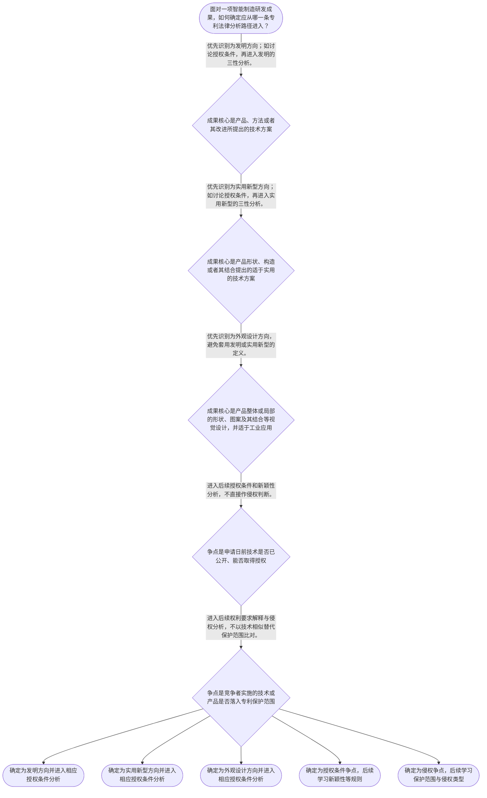

# 专家 A 教学草稿

> 专家：expert_a ｜ 风格：conservative

## 教学模块选择清单

- 当前教学节点：`patent-law-foundation`
- 板块预算：自适应 6/6，总计 9/9

| # | 模块 (block_type) | 类型 | 触发原因 (trigger) | 对应正文段 | 归属 |
|---:|---|:--:|---|---|:--:|
| 1 | `anchor_scenario` | 自适应 | perception=sensing(0.78) / cold_start | 智能工厂研发成果的第一道分类门｜某智能制造企业的研发团队在一条电机装配线上完成三项改进：算法工程师开发了依据振动数据自动调整… | [A] |
| 2 | `legal_anchor` | 必选 | mandatory | 法条锚定：保护客体与授权条件｜《中华人民共和国专利法》第二条 | [A] |
| 3 | `worked_example` | 自适应 | cognition.analyze=0.29<0.3 / cold_start | 示范：为智能制造成果选择正确分析入口｜某制造企业形成三项研发成果：甲为根据设备振动数据自动调整维护周期的方法；乙为用于固定协作机器… | [A] |
| 4 | `decision_flow` | 自适应 | input=visual(0.74) | 专利问题的基础分流流程｜面对一项智能制造研发成果，如何确定应从哪一条专利法律分析路径进入？ | [A] |
| 5 | `mnemonic` | 自适应 | understanding=sequential(0.67) | 分类与分流记忆表｜“三客体、两问题、一步序”记忆表：发—方法或技术方案；实—产品结构；外—产品视觉设计；授—授… | [A] |
| 6 | `reflect_prompt` | 自适应 | processing=reflective(0.61) | 从研发经验回看专利制度入口｜回顾你熟悉的一项智能制造研发成果：其中哪些部分是技术方法、哪些是产品结构、哪些是产品视觉设计… | [A] |
| 7 | `assessment` | 必选 | mandatory | 本节三类测评｜复习三类专利客体中实用新型的法定定义方向。 | [A] |
| 8 | `knowledge_synthesis` | 必选 | mandatory | 专利法律制度基础的结构总览｜制度特征：以独占性、时间性、地域性作为观察专利权法律效果的基础维度；其中具体地域效力规则须在… | [A] |
| 9 | `summary_card` | 自适应 | len(knowledge_sub_nodes)=3>=3 | 制度基础速查卡｜智能制造专利分析的起点是：先按法定客体分类，再按授权或保护争点分流。 | [A] |

## 教学正文

## I — 法律问题

本节先解决进入专利分析前的基础问题：面对智能制造研发成果，应先识别其是否属于法定的发明创造类型，理解专利权具有独占性、时间性、地域性的制度特征，并知道后续应分别进入授权条件、审查程序或侵权保护范围的分析路径。

需要特别区分：**新颖性判断**解决的是“申请时能否获得或维持专利权”的授权条件问题；**侵权判定**解决的是“被诉技术方案是否落入有效专利权保护范围”的实施行为问题。二者都与技术特征有关，但判断对象、时间基准和法律后果不同；本节点只建立进入这两类分析前所需的制度框架，不替代后续节点中的具体判断规则。

## R — 适用规则

### 1. 专利保护客体：先识别技术成果属于哪一类

《专利法》第二条规定，发明创造包括发明、实用新型和外观设计。发明是对产品、方法或者其改进提出的新的技术方案；实用新型是对产品的形状、构造或者其结合提出的适于实用的新的技术方案；外观设计则是对产品整体或者局部的形状、图案或其结合，以及色彩与形状、图案结合所作出的富有美感并适于工业应用的新设计。〔RAG: 中华人民共和国专利法.txt — 第二条：发明创造是指发明、实用新型和外观设计，并分别规定三者定义〕

因此，对智能制造成果可以先作如下分类：

| 成果表现 | 优先识别方向 | 本节中的判断重点 |
|---|---|---|
| 机器人控制方法、设备预测性维护方法、产线调度方法 | 发明 | 是否是产品、方法或者改进所提出的技术方案 |
| 机械臂夹具的特殊构造、传感器安装结构、工装连接结构 | 实用新型 | 是否针对产品形状、构造或者其结合提出技术方案 |
| 工业设备外壳、操作面板局部视觉设计 | 外观设计 | 是否属于产品整体或局部的视觉设计，并适于工业应用 |

### 2. 制度法源：先分清“法律依据”和“操作依据”

本节将中国专利制度的规范体系按功能理解为：专利法提供基本制度和核心规则；专利法实施细则服务于法律规则的具体实施；专利审查指南服务于审查实务中的规则适用。对于实施细则和审查指南的具体条款、效力层级及适用细节，检索上下文未提供直接原文依据，本节不作超出资料的具体断言，后续在“专利法律框架”和“专利审查”节点再作核验学习。

《专利法》第二条直接规定保护客体；第二十二条直接规定发明和实用新型获得专利权应具备新颖性、创造性和实用性。〔RAG: 中华人民共和国专利法.txt — 第二十二条：授予专利权的发明和实用新型，应当具备新颖性、创造性和实用性〕

### 3. 制度特征：独占性、时间性、地域性是三项观察维度

- **独占性**：专利制度以依法授予的专利权为中心，后续分析侵权时必须回到具体有效专利权及其保护范围，不能仅因技术相似就直接得出侵权结论。
- **时间性**：授权条件中的新颖性明确以申请日为关键时间点；现有技术是申请日以前在国内外为公众所知的技术。〔RAG: 中华人民共和国专利法.txt — 第二十二条：现有技术是指申请日以前在国内外为公众所知的技术〕
- **地域性**：专利权的地域效力及跨境实施的具体规则，检索上下文未提供直接条文依据。本节只将其作为后续侵权与国际专利制度学习时应先核验的维度，不作具体法律效果判断。

### 4. 制度功能与发展特点

专利制度的功能链条可以概括为：鼓励发明创造，推动发明创造应用，提高创新能力，最终促进科学技术进步和经济社会发展。〔RAG: 专利法律知识详细解读.txt — “鼓励发明创造”—“推动发明创造的应用”—“提高创新能力”，最终促进科学技术进步和经济社会发展〕

中国于1984年制定首部专利法，自1985年4月1日起施行；该资料记载，同一部法律包含发明、实用新型、外观设计三种专利类型，并确立先申请制，发明专利采用实质审查制，实用新型和外观设计采用初步审查制。〔RAG: 专利法律知识详细解读.txt — 1984年制定首部专利法；发明为实质审查制，实用新型和外观设计为初步审查制〕

关于“早期公开、延迟审查”的具体制度节点和法律后果，检索上下文未提供直接原文依据；本节只确认其属于理解专利申请与审查流程时需要进一步核验的历史与程序主题。

## A — 规则适用

以智能制造研发场景作制度定位示范：某制造企业研发了三项成果——一是根据振动数据动态调整设备维护周期的方法；二是用于固定协作机器人的可快速拆装夹具结构；三是设备控制柜局部面板的视觉设计。

第一步，不直接讨论“是否新颖”或“是否侵权”，而是先按《专利法》第二条识别客体。维护周期调整方案若体现为技术方法，应优先从发明的“方法或者其改进所提出的新的技术方案”方向分析；夹具结构优先从实用新型的“产品的形状、构造或者其结合”方向分析；控制柜局部面板优先从外观设计方向分析。〔RAG: 中华人民共和国专利法.txt — 第二条对发明、实用新型和外观设计的分别定义〕

第二步，识别成果类别后，才进入相应的后续法律路径。对于发明或实用新型，授权阶段将适用第二十二条规定的新颖性、创造性和实用性条件；其中，新颖性会以申请日前是否已为公众所知为关键线索。〔RAG: 中华人民共和国专利法.txt — 第二十二条关于三性和现有技术的规定〕

第三步，如竞争者随后实施类似设备或方法，不能把“自己的成果较早完成”直接等同于“对方侵权”。侵权分析需要在后续节点先确定专利权是否有效、再解释权利要求保护范围、再比对被诉技术方案。本节的作用是让学习者先形成“客体识别—制度路径—具体判断”的顺序意识。

本示范是基于智能制造技术事实构造的教学情境，不是检索上下文中提供的真实裁判案例；检索上下文未提供可核验的智能制造领域真实案例，故不将该情境表述为真实案件或裁判结论。

## C — 结论

专利法律制度基础的核心不是立刻判断某项技术是否具有新颖性或是否构成侵权，而是先建立统一入口：**先识别发明、实用新型或外观设计，再根据问题性质分流至授权条件、审查程序或权利保护范围。**

对发明和实用新型而言，后续新颖性学习的直接法条入口是《专利法》第二十二条；对智能制造中的技术方案、产品结构和产品视觉设计而言，客体分类的直接法条入口是《专利法》第二条。〔RAG: 中华人民共和国专利法.txt — 第二条和第二十二条的规定〕

> 常见误区 / 易混淆点
>
> 1. 把“技术方案已经做出来”误认为当然可以取得专利权。技术成果首先要识别保护客体，发明和实用新型还须接受新颖性、创造性、实用性审查。
> 2. 把“产品与他人产品相似”误认为当然侵权。技术相似只是事实线索，侵权判断仍须以有效专利权及保护范围为起点。
> 3. 把发明、实用新型、外观设计当成同一类保护对象。三者的法定定义不同，后续审查与权利保护分析也不能混同。
> 4. 把“初步审查”理解为完全不审查。检索资料只表明发明经初步审查、实质审查两个阶段，实用新型和外观设计经初步审查未发现驳回理由即可授权；具体审查范围须在后续程序节点依据原始规范继续核验。〔RAG: 专利法律知识详细解读.txt — 发明经初步审查、实质审查；实用新型和外观设计经初步审查〕

本节设有测评，请到【习题】区作答。

### 智能工厂研发成果的第一道分类门（anchor_scenario）

> 某智能制造企业的研发团队在一条电机装配线上完成三项改进：算法工程师开发了依据振动数据自动调整维护周期的方法；机械工程师设计了可快速拆装的机器人夹具；工业设计师重做了控制柜局部面板的视觉布局。企业准备申请专利，同时担心竞争者已在展会上展示过类似设备，并计划对后续出现的仿制品维权。

法务人员不能直接回答“是否新颖”或“是否侵权”，而要先辨认三项成果分别是什么类型的发明创造，再确定应当进入授权条件、审查程序还是权利保护范围的分析路径。

**锚定**：该情境锚定“先识别保护客体，再分流至授权或侵权问题”的专利制度基础框架。

**先想一想**：面对同一条智能产线上的方法、结构和视觉设计，为什么不能用同一套规则直接判断它们能否申请和是否侵权？

### 法条锚定：保护客体与授权条件（legal_anchor）

- **《中华人民共和国专利法》第二条**：第二条先把可受专利法保护的发明创造分为发明、实用新型、外观设计，并分别限定其法定定义。
- **《中华人民共和国专利法》第二十二条**：第二十二条规定发明和实用新型的授权条件包括新颖性、创造性和实用性；其中现有技术以申请日前公众已知的技术为界。

**为何重要**：本节点是后续新颖性和侵权学习的共同入口。先根据第二条确定成果类别，才能在正确的法律路径中适用后续授权规则或权利保护规则。

### 示范：为智能制造成果选择正确分析入口（worked_example）

**案情/例题**：某制造企业形成三项研发成果：甲为根据设备振动数据自动调整维护周期的方法；乙为用于固定协作机器人的快拆夹具结构；丙为控制柜局部面板的图案与形状设计。企业询问：三项成果是否应以同一类型申请专利，并能否直接据此判断日后相似产品构成侵权？
**适用规则**：《中华人民共和国专利法》第二条；涉及发明和实用新型授权条件时，进入《中华人民共和国专利法》第二十二条。
**分步推演**：
1. 先对甲成果识别技术表现形式。甲的核心是依据数据调整维护周期的技术方法，符合第二条中“对产品、方法或者其改进所提出的新的技术方案”这一发明定义方向。 → *甲优先沿发明的技术方法路径分析。*
2. 再对乙成果识别技术表现形式。乙的核心是夹具的产品结构，属于第二条中“对产品的形状、构造或者其结合所提出的适于实用的新的技术方案”的实用新型定义方向。 → *乙优先沿实用新型的产品结构路径分析。*
3. 最后对丙成果识别技术表现形式。丙关注控制柜局部面板的形状、图案等视觉设计，应优先沿第二条外观设计定义方向分析。 → *丙优先沿外观设计的产品视觉设计路径分析。*
4. 客体分类后，不应把授权与侵权混作一步。甲、乙若进入授权条件分析，应进一步考察第二十二条的三性；日后是否侵权，则须在后续节点从有效权利和保护范围出发比较被诉技术方案。 → *分类决定后续规则入口，技术相似不等于当然侵权。*
**结论**：三项成果不应以同一类型机械处理：方法、产品结构和产品视觉设计分别对应不同的法定客体分析方向；新颖性属于授权条件，侵权属于后续权利保护范围判断。
**本题要点**：训练“先分客体、再分问题、后套具体规则”的线性分析能力。

### 专利问题的基础分流流程（decision_flow）

**决策问题**：面对一项智能制造研发成果，如何确定应从哪一条专利法律分析路径进入？



### 分类与分流记忆表（mnemonic）

**记忆锚**：“三客体、两问题、一步序”记忆表：发—方法或技术方案；实—产品结构；外—产品视觉设计；授—授权条件；权—权利保护；先分类，后分流。
**映射**：
- 发
- 实
- 外
- 授
- 权
- 先分类，后分流
**何时用**：看到智能制造项目同时包含算法、设备结构和界面设计，或者看到“能否申请”“是否侵权”两类提问时，先使用该表定位分析入口。

### 从研发经验回看专利制度入口（reflect_prompt）

**反思问题**：回顾你熟悉的一项智能制造研发成果：其中哪些部分是技术方法、哪些是产品结构、哪些是产品视觉设计？如果出现竞争对手的类似方案，你会先收集哪一类事实以决定它属于授权问题还是侵权问题？

**关注要点**：不要把研发完成时间直接当作专利授权或侵权结论。；先分清成果的技术表现形式，再识别争点是授权条件还是权利保护。；涉及申请日前公开的事实时，后续应进入新颖性规则；涉及竞争者实施时，后续应进入保护范围规则。

**连接**：连接到学习者已有的理工研发经验：把技术模块拆分为方法、结构和视觉设计，再把法律问题拆分为授权与保护两类。

### 专利法律制度基础的结构总览（knowledge_synthesis）

**知识框架**：
- 制度特征：以独占性、时间性、地域性作为观察专利权法律效果的基础维度；其中具体地域效力规则须在后续依据原文继续核验。
- 规范体系：专利法提供基本制度与核心规则；实施细则和审查指南的具体内容属于后续法源与审查学习重点，本节不在缺少原文时作具体断言。
- 保护客体：第二条将发明创造分为发明、实用新型、外观设计，三者依据技术方法、产品结构、产品视觉设计进行初步区分。
- 制度作用：专利制度通过鼓励发明创造、推动应用和促进技术进步服务创新与经济社会发展。
- 制度发展与审查特点：检索资料记载中国首部专利法于1984年制定，发明采用实质审查制，实用新型和外观设计采用初步审查制。
**概念关系**：客体分类在前：先判断技术成果属于方法、产品结构还是产品视觉设计。；争点分流在后：申请授权问题进入三性等授权条件；实施争议问题进入保护范围和侵权分析。；时间维度贯穿授权：第二十二条将现有技术界定为申请日以前在国内外为公众所知的技术。；程序特点服务制度运行：检索资料所载发明实质审查与其他两类初步审查的差异，需在后续审查节点展开。
**必记**：先依据《专利法》第二条识别发明、实用新型或外观设计，不能把不同客体混为一类。；新颖性是发明和实用新型的授权条件问题，侵权是有效专利权保护范围问题；两者的判断入口不同。；发明和实用新型的三性法条入口是《专利法》第二十二条。

### 制度基础速查卡（summary_card）

**要点卡**：
- **三种保护客体**：发明看产品、方法或改进的技术方案；实用新型看产品结构；外观设计看产品视觉设计。
- **两类法律问题**：新颖性等问题属于授权条件路径；是否仿制违法属于后续侵权保护路径。
- **三项制度特征**：独占性、时间性、地域性是观察专利权法律效果的基本维度。
- **制度功能**：鼓励发明创造并推动其应用，进而促进技术进步和经济社会发展。
- **审查特点**：检索资料记载发明经过初步审查和实质审查，实用新型与外观设计采用初步审查路径。
**必背**：《专利法》第二条：发明创造包括发明、实用新型和外观设计。；《专利法》第二十二条：发明和实用新型应具备新颖性、创造性和实用性。；先分类，再分流：先识别保护客体，再区分授权条件问题与侵权问题。
**一句话总结**：智能制造专利分析的起点是：先按法定客体分类，再按授权或保护争点分流。

### 本节三类测评（assessment）

**三类覆盖**：backward_review、forward_probe、weakness_probe
**题目**：
- q_foundation_backward_l1：复习三类专利客体中实用新型的法定定义方向。
- q_overview_forward_l1：仅探测下一节点的专利制度核心运行机制。
- q_foundation_weakness_l3：综合辨析智能制造方法、结构、视觉设计的客体分类与授权问题分流。


## 结构化字段

## knowledge_points

```json
[
  {
    "node_id": "patent-law-foundation",
    "kc_name": "专利制度的基本概念与特征：独占性、时间性、地域性"
  },
  {
    "node_id": "patent-law-foundation",
    "kc_name": "中国专利制度体系：专利法、专利法实施细则、专利审查指南"
  },
  {
    "node_id": "patent-law-foundation",
    "kc_name": "专利保护的三种客体：发明、实用新型、外观设计"
  },
  {
    "node_id": "patent-law-foundation",
    "kc_name": "专利制度的作用：激励发明创造、促进技术公开、推动技术应用和经济发展"
  },
  {
    "node_id": "patent-law-foundation",
    "kc_name": "中国专利制度发展历程与特点：早期公开延迟审查、初步审查制与实质审查制并存"
  }
]
```

## legal_basis

```json
[
  {
    "article": "《中华人民共和国专利法》第二条",
    "source": "中华人民共和国专利法.txt：第二条关于发明、实用新型和外观设计的定义"
  },
  {
    "article": "《中华人民共和国专利法》第二十二条",
    "source": "中华人民共和国专利法.txt：第二十二条关于发明和实用新型的新颖性、创造性、实用性及现有技术"
  },
  {
    "article": "中国专利制度发展资料",
    "source": "专利法律知识详细解读.txt：1984年制定、三种专利类型、发明实质审查与实用新型和外观设计初步审查并存"
  }
]
```

## risks

```json
[
  {
    "risk": "检索上下文未提供智能制造领域真实裁判案例，教学中的智能制造事实仅作假设性示范，不应误认为真实案件。",
    "related_node_id": "patent-law-foundation"
  },
  {
    "risk": "检索上下文未提供专利法实施细则和专利审查指南的直接原文，不能据此断言其具体条款内容或效力层级。",
    "related_node_id": "patent-law-foundation"
  },
  {
    "risk": "“早期公开延迟审查”的具体制度内容未获检索原文直接支持，本节仅提示其为后续程序学习主题。",
    "related_node_id": "patent-law-foundation"
  },
  {
    "risk": "新颖性、创造性、抵触申请、权利要求解释和等同原则均属后续节点的具体规则，本节不得以制度概览替代具体判断。",
    "related_node_id": "patent-law-foundation"
  }
]
```

## draft_stage

```json
"debate"
```

## irac

```json
{
  "issue": "智能制造研发成果进入专利分析时，如何先识别法定保护客体、制度法源和后续授权或侵权分析路径，避免将新颖性与侵权判定混为同一问题？",
  "rule": "《专利法》第二条将发明创造划分为发明、实用新型和外观设计，并分别规定其定义；《专利法》第二十二条规定发明和实用新型应具备新颖性、创造性和实用性，现有技术指申请日以前在国内外为公众所知的技术。检索资料还记载中国专利制度包含三类专利，发明采用实质审查制，实用新型和外观设计采用初步审查制。",
  "application": "对智能制造中的控制方法、设备结构和产品视觉设计，应先依第二条进行客体分类；涉及申请授权的发明或实用新型，再进入第二十二条的三性判断；涉及竞争者实施相似技术时，则应在后续侵权节点先确定有效权利及保护范围后再作比对。",
  "conclusion": "专利制度基础要求遵循“客体识别—问题分流—具体规则适用”的顺序。新颖性是授权条件分析的一环，侵权是权利保护范围分析的问题，二者不能混同。"
}
```

## interactive_questions

```json
[
  {
    "qid": "q_foundation_backward_l1",
    "category": "remember",
    "difficulty": "L1",
    "source_tag": "backward_review",
    "kc_node_id": "patent-law-foundation",
    "question": "依据《专利法》第二条，下列哪一项属于实用新型定义所直接指向的对象？",
    "answer": "B",
    "options": [
      "A. 对机器人维护方法提出的新的技术方案",
      "B. 对机器人夹具的形状、构造或者其结合提出的适于实用的新的技术方案",
      "C. 对工业设备整体或局部视觉设计提出的富有美感并适于工业应用的新设计",
      "D. 对企业研发流程提出的管理建议"
    ]
  },
  {
    "qid": "q_overview_forward_l1",
    "category": "understand",
    "difficulty": "L1",
    "source_tag": "forward_probe",
    "kc_node_id": "patent-system-overview",
    "question": "下列哪一项最能概括专利制度的核心运行机制？",
    "answer": "A",
    "options": [
      "A. 以技术信息公开为条件，在法定制度下获得有限保护并促进技术应用",
      "B. 对所有技术信息永久保密，不要求向社会公开",
      "C. 只要完成研发即可当然禁止他人使用相关技术",
      "D. 仅保护产品名称和商业标识，不涉及技术方案"
    ]
  },
  {
    "qid": "q_foundation_weakness_l3",
    "category": "analyze",
    "difficulty": "L3",
    "source_tag": "weakness_probe",
    "kc_node_id": "patent-law-foundation",
    "question": "某企业形成三项成果：设备振动预测维护方法、用于机械臂的快拆夹具结构、控制柜局部面板视觉设计。下列关于制度分析顺序的表述，哪一项最准确？",
    "answer": "C",
    "options": [
      "A. 三项成果均先按发明专利处理，只要技术先进即可直接判断竞争者侵权",
      "B. 三项成果均属于实用新型，先比较竞争产品是否相似，再决定是否申请",
      "C. 应先分别识别方法、产品结构和产品视觉设计所对应的法定保护客体；涉及发明或实用新型授权时，再进入新颖性、创造性和实用性分析",
      "D. 只要控制柜面板已经投入使用，其余两项成果均不可能获得任何专利保护"
    ]
  }
]
```

## knowledge_synthesis

```json
{
  "node": "patent-law-foundation",
  "coverage": [
    {
      "node_id": "patent-law-foundation"
    },
    {
      "node_id": "patent-law-foundation"
    },
    {
      "node_id": "patent-law-foundation"
    },
    {
      "node_id": "patent-law-foundation"
    },
    {
      "node_id": "patent-law-foundation"
    }
  ],
  "confusable_pairs": [
    {
      "pair": "新颖性与侵权判定：前者是授权条件问题，后者是有效专利权保护范围问题。"
    },
    {
      "pair": "发明与实用新型：前者可涉及产品、方法或改进的技术方案，后者限于产品形状、构造或者其结合的适于实用技术方案。"
    },
    {
      "pair": "实质审查与初步审查：检索资料记载发明经过初步审查和实质审查，实用新型和外观设计经初步审查未发现驳回理由可获授权；具体范围应以后续原始规范核验。"
    }
  ]
}
```
