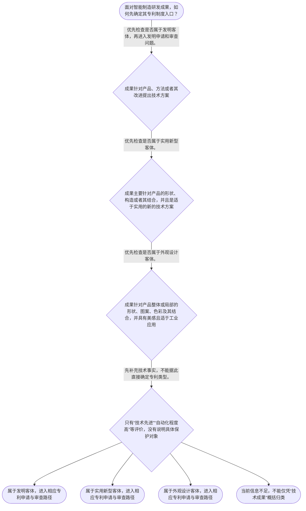

# 专家 B 教学草稿

> 专家：expert_b ｜ 风格：accessible

## 教学模块选择清单

- 当前教学节点：`patent-law-foundation`
- 板块预算：自适应 6/6，总计 9/9

| # | 模块 (block_type) | 类型 | 触发原因 (trigger) | 对应正文段 | 归属 |
|---:|---|:--:|---|---|:--:|
| 1 | `anchor_scenario` | 自适应 | perception=sensing(0.78) / cold_start | 从一条智能产线看专利制度｜某智能制造企业研发了一条自动化装配线：工程师一方面编写机器人根据传感器数据调整动作的控制方法… | [B] |
| 2 | `legal_anchor` | 必选 | mandatory | 先把法条入口钉牢｜《专利法》第二条 | [B] |
| 3 | `worked_example` | 自适应 | cognition.analyze=0.29<0.3 / cold_start | 案例演示：同一产线不等于同一种专利｜某智能制造企业完成一项“基于视觉传感器调整机械臂抓取轨迹”的控制方法，并同时完成一个“具有特… | [B] |
| 4 | `decision_flow` | 自适应 | input=visual(0.74) | 专利客体识别流程｜面对智能制造研发成果，如何先确定其专利制度入口？ | [B] |
| 5 | `mnemonic` | 自适应 | understanding=sequential(0.67) | 五问记忆表｜专利基础四问表：是什么、护多久、护哪里、为何护；遇到具体成果再加“谁审查”。 | [B] |
| 6 | `reflect_prompt` | 自适应 | processing=reflective(0.61) | 把法条框架带回研发现场｜回想一个智能制造项目时，如果团队只说“我们有一项自动化创新”，你会向研发人员追问哪些事实，才… | [B] |
| 7 | `assessment` | 必选 | mandatory | 三类测评入口｜识别《专利法》第二条规定的三种发明创造客体。 | [B] |
| 8 | `knowledge_synthesis` | 必选 | mandatory | 专利制度基础关系网｜专利制度基本概念与特征：专利权是依法授予的排他性权利，并受到时间和地域范围约束，不能理解为永… | [B] |
| 9 | `summary_card` | 自适应 | len(knowledge_sub_nodes)=3>=3 | 专利制度基础速查卡｜先问保护什么，再看由谁审、按什么程序审，最后才进入具体授权与保护范围问题。 | [B] |

## 教学正文

## 1. 场景导入

把自己放进一家智能制造企业的研发评审会：团队完成了机器人视觉控制方法，也完成了末端执行器的特殊外观。大家都说这是“一个机器人创新”，但专利工作不能只看项目名称，而要先问它具体要保护什么。方法、产品形状构造和产品外观，可能进入不同的专利客体分类。另一个常见误区是把专利权想成“全球永久通行证”；实际上，专利权的排他保护受法律规定的时间和地域边界约束。

## 2. 人话解释

专利制度基础可以先用“五问”搭骨架：第一，究竟要保护什么；第二，谁负责受理、审查和授权；第三，保护的边界由哪些申请文件和规则确定；第四，权利为什么不是永久、全球自动有效；第五，制度为什么要要求公开技术。

在智能制造场景中，“让机械臂根据传感器数据调整动作”首先表现为方法技术方案；“末端执行器采用什么形状、构造”更接近产品的技术结构；“外壳采用什么曲面、图案和色彩组合”则是产品外观问题。不要因为它们都服务于同一条产线，就把它们强行归入同一种专利客体。

专利制度的核心不是简单奖励一句“创新”，而是用法律规定的保护换取技术信息公开。企业因此获得一定范围内的排他实施机会，社会也能通过专利文件了解技术信息并继续改进。这里的“排他”要和“永久”“全球”区分开：排他性说明他人受到限制，时间性和地域性说明这种限制有期限、有范围。

## 3. 法条回扣

《专利法》第二条明确规定，发明创造包括发明、实用新型和外观设计；发明是对产品、方法或者其改进提出的新的技术方案，实用新型针对产品的形状、构造或者其结合，外观设计针对产品的整体或局部形状、图案、色彩及其结合，并要求富有美感、适于工业应用。〔RAG: 中华人民共和国专利法.txt — 第二条：发明创造包括发明、实用新型和外观设计；分别规定三类客体的保护对象〕

《专利法》第三条规定，国务院专利行政部门负责管理全国专利工作，统一受理和审查专利申请，依法授予专利权。〔RAG: 中华人民共和国专利法.txt — 第三条：国务院专利行政部门负责管理全国的专利工作；统一受理和审查专利申请，依法授予专利权〕

检索材料还显示，专利法、专利法实施细则和专利审查指南共同构成学习中国专利申请与审查时的重要规范框架；本节先掌握它们的层级和分工，具体条款和程序在后续节点展开。

《专利法》第三十三条规定，申请人可以在被授予专利权之前随时撤回申请，也可以修改申请文件，但发明和实用新型的修改不得超出原说明书和权利要求书记载的范围。〔RAG: 中华人民共和国专利法.txt — 第三十三条：修改不得超出原说明书和权利要求书记载的范围〕

## 4. 类比 / 口诀

可以记“是什么、护多久、护哪里、为何护、谁审查”。“是什么”帮助区分发明、实用新型和外观设计；“护多久、护哪里”提醒专利权不是永久、全球自动有效；“为何护”提醒专利制度要在技术公开与法律保护之间建立交换；“谁审查”把申请事项连接到国务院专利行政部门。

这个记忆表只用于建立制度入口，不能代替具体法律判断。尤其不能把“技术公开”直接等同于“已经获得专利”，也不能把客体分类直接等同于满足全部授权条件。

## 5. 应试提示

看到智能制造题干，按四步走：先圈出技术事实，判断它保护的是方法、产品形状构造还是产品外观；再对应《专利法》第二条的定义；然后确认题目问的是客体分类、申请审查，还是已经授权后的保护问题；最后检查题干有没有把同一项目、同一产品或“技术先进”等表述偷换成“同一种专利”或“必然获得专利权”。

常见陷阱有三个：把发明、实用新型、外观设计混为一谈；把专利权的排他性理解成永久性和全球性；把国务院专利行政部门的统一受理审查职责误读为任何技术成果提交后都当然获得专利权。遇到这些选项，先回到定义和程序入口，不要被“创新”“智能”“先进”等评价词带偏。

## 6. 互动提问

请先在【习题】区完成本节选择题，再把“五问”用于你熟悉的一项智能制造研发成果：先写出它要保护的具体对象，再判断需要查哪一类专利规则。本节设有测评，请到【习题】区作答。

### 从一条智能产线看专利制度（anchor_scenario）

> 某智能制造企业研发了一条自动化装配线：工程师一方面编写机器人根据传感器数据调整动作的控制方法，另一方面设计了机器人末端执行器的特殊外形。企业准备申请专利，但团队成员产生分歧：有人认为只要是技术成果都能申请同一种专利；有人认为专利授权后就可以在全球永久排他使用。现在需要先把“保护什么、保护多久、在哪些地方有效、制度为什么这样设计”这些基础问题理清，后续才能准确学习新颖性和侵权判定。

**锚定**：用智能制造中的控制方法和产品外形，锚定专利客体以及专利权独占性、时间性、地域性的基础框架。

**先想一想**：如果你是企业知识产权负责人，你会先区分技术方案的内容，还是先讨论它是否已经公开？为什么？

### 先把法条入口钉牢（legal_anchor）

- **《专利法》第二条**：专利法保护的发明创造分为发明、实用新型和外观设计：发明可针对产品、方法或其改进；实用新型主要针对产品的形状、构造或其结合；外观设计针对产品的外观设计要素。
- **《专利法》第三条**：国务院专利行政部门负责管理全国专利工作，统一受理和审查专利申请并依法授予专利权，地方主管部门负责本行政区域内的专利管理工作。
- **《专利法》第三十三条**：申请人可以在授予专利权前修改申请文件，但发明和实用新型的修改不能超出原说明书和权利要求书记载的范围。

**为何重要**：这些条文分别回答“保护对象是什么”“谁负责审查授权”“申请文件如何受到边界约束”。先固定这三个入口，后续判断新颖性、保护范围和侵权时才不会把不同问题混在一起。

### 案例演示：同一产线不等于同一种专利（worked_example）

**案情/例题**：某智能制造企业完成一项“基于视觉传感器调整机械臂抓取轨迹”的控制方法，并同时完成一个“具有特定曲面和图案的机器人末端执行器外壳”。企业希望用一个笼统的“机器人创新专利”覆盖二者。应如何先从专利客体和制度入口进行整理？
**适用规则**：适用《专利法》第二条关于发明、实用新型和外观设计的定义，并结合《专利法》第三条理解受理、审查和授权的制度入口。
**分步推演**：
1. 先看技术成果的表达对象：前者解决的是机器人如何运行的控制方法，后者呈现的是产品外部的形状、图案及其组合。 → *先识别成果是方法、产品形状构造，还是产品外观。*
2. 依《专利法》第二条，发明包括对产品、方法或者其改进提出的新的技术方案；外观设计针对产品的整体或局部形状、图案及其结合等外观要素。 → *控制方法与产品外观分别对应不同客体定义。*
3. 再看制度流程：申请提交后，由国务院专利行政部门统一受理和审查，并依法授予专利权；不能把技术成果分类直接等同于已经获得专利权。 → *客体分类只是第一步，不等于已经授权。*
4. 若后续修改发明或实用新型申请文件，还要检查是否超出原说明书和权利要求书记载的范围。 → *申请文件的原始记载会约束后续修改边界。*
**结论**：控制机器人动作的方法属于方法技术方案，应先按发明客体理解；末端执行器的特殊外形属于外观设计客体。两者都不能仅因“来自同一条产线”就自动归为同一种专利。至于能否最终授权，还要在相应审查程序中继续判断其他条件。
**本题要点**：遇到技术成果时按“对象识别—法条归类—程序入口—后续边界”顺序处理，先分清保护客体，再讨论授权和保护范围。

### 专利客体识别流程（decision_flow）

**决策问题**：面对智能制造研发成果，如何先确定其专利制度入口？



### 五问记忆表（mnemonic）

**记忆锚**：专利基础四问表：是什么、护多久、护哪里、为何护；遇到具体成果再加“谁审查”。
**映射**：
- 是什么
- 护多久
- 护哪里
- 为何护
- 谁审查
**何时用**：阅读智能制造研发方案、专利申请题或侵权咨询时，先按这五问建立框架，再进入新颖性、保护范围等后续专题。

### 把法条框架带回研发现场（reflect_prompt）

**反思问题**：回想一个智能制造项目时，如果团队只说“我们有一项自动化创新”，你会向研发人员追问哪些事实，才能判断它更接近发明、实用新型还是外观设计？

**关注要点**：关注成果保护的是方法、产品的形状构造，还是产品外观；关注“技术方案”和“外观设计”描述是否混在一起；关注专利类型判断只是制度入口，不等于已经满足全部授权条件

**连接**：连接到学习者熟悉的研发流程：先定义产品或方法的技术对象，再选择合适的知识产权申请路径。

### 专利制度基础关系网（knowledge_synthesis）

**知识框架**：
- 专利制度基本概念与特征：专利权是依法授予的排他性权利，并受到时间和地域范围约束，不能理解为永久、全球自动有效。
- 中国专利制度体系：专利法提供基本规则，专利法实施细则和专利审查指南共同构成申请、审查和实务操作的重要规范依据。
- 专利保护的三种客体：发明保护产品、方法或其改进提出的技术方案；实用新型保护产品的形状、构造或其结合；外观设计保护产品的形状、图案、色彩及其结合形成的富有美感且适于工业应用的新设计。
- 专利制度的作用：通过授予一定期限和范围的专利保护，激励发明创造，同时促进技术公开、技术应用和经济发展。
- 中国制度发展与审查特点：现行制度中，发明专利实行实质审查，实用新型和外观设计主要实行初步审查；具体程序应以现行法及配套规范为准。
**概念关系**：先识别保护客体，再进入相应申请和审查路径。；专利法确定基本权利与程序框架，实施细则和审查指南进一步细化操作要求。；制度功能解释为什么要在公开与保护之间建立交换，但制度功能不能替代具体授权条件判断。
**必记**：发明、实用新型、外观设计是专利法规定的三类发明创造客体，不能用“技术创新”四个字笼统替代。；专利权具有排他性，但同时受时间性和地域性约束，不是永久、全球自动有效的权利。；专利客体分类只是第一步；是否能够授权以及授权后的保护范围，还要分别依据相应法条和审查、解释规则判断。

### 专利制度基础速查卡（summary_card）

**要点卡**：
- **三种客体**：发明看产品或方法技术方案，实用新型看产品形状构造，外观设计看产品外观要素。
- **三种基本边界**：专利权具有独占性、时间性和地域性，保护不是永久且不是全球自动发生。
- **制度体系**：专利法定基本规则，实施细则和审查指南补充申请审查操作。
- **审查入口**：国务院专利行政部门统一受理和审查专利申请，并依法授予专利权。
**必背**：《专利法》第二条规定发明、实用新型和外观设计三种发明创造。；发明可针对产品、方法或者其改进提出新的技术方案。；专利客体分类不等于已经授权，后续还要经过相应程序和实体判断。
**一句话总结**：先问保护什么，再看由谁审、按什么程序审，最后才进入具体授权与保护范围问题。

### 三类测评入口（assessment）

**三类覆盖**：backward_review、forward_probe、weakness_probe
**题目**：
- q1：识别《专利法》第二条规定的三种发明创造客体。
- q2：初步探测专利制度以公开换保护的基本功能。
- q3：区分智能制造控制方法与产品外观对应的专利客体。


## 结构化字段

## knowledge_points

```json
[
  {
    "node_id": "patent-law-foundation",
    "kc_name": "专利制度的基本概念与特征：独占性、时间性、地域性（详见子节点 patent-rights-nature）"
  },
  {
    "node_id": "patent-law-foundation",
    "kc_name": "中国专利制度体系：专利法、专利法实施细则、专利审查指南（详见子节点 patent-law-framework）"
  },
  {
    "node_id": "patent-law-foundation",
    "kc_name": "专利保护的三种客体：发明、实用新型、外观设计（专利法第2条）"
  },
  {
    "node_id": "patent-law-foundation",
    "kc_name": "专利制度的作用：激励发明创造、促进技术公开、推动技术应用和经济发展（详见子节点 patent-system-overview）"
  },
  {
    "node_id": "patent-law-foundation",
    "kc_name": "中国专利制度发展历程与特点：早期公开延迟审查、初步审查制与实质审查制并存（详见子节点 patent-system-overview）"
  }
]
```

## legal_basis

```json
[
  {
    "article": "《专利法》第二条",
    "source": "中华人民共和国专利法.txt"
  },
  {
    "article": "《专利法》第三条",
    "source": "中华人民共和国专利法.txt"
  },
  {
    "article": "《专利法》第三十三条",
    "source": "中华人民共和国专利法.txt"
  }
]
```

## risks

```json
[
  {
    "risk": "“独占性”容易被误解为永久且全球有效；本节只建立时间性和地域性的基础概念，具体期限和地域规则需在后续节点展开。",
    "related_node_id": "patent-rights-nature"
  },
  {
    "risk": "检索上下文直接提供了专利法及部分解读材料，但未提供实施细则和审查指南的具体条文原文；相关内容仅作制度框架说明，不虚构具体条款。",
    "related_node_id": "patent-law-framework"
  },
  {
    "risk": "初步审查制和实质审查制的概括用于建立基础框架，具体程序、审查范围和法律效果应以现行法律及配套规范为准。",
    "related_node_id": "patent-system-overview"
  }
]
```

## draft_stage

```json
"debate"
```

## interactive_questions

```json
[
  {
    "qid": "q1",
    "category": "remember",
    "difficulty": "L1",
    "source_tag": "backward_review",
    "kc_node_id": "patent-law-foundation",
    "question": "根据《专利法》第二条，下列哪一组完整列出了专利法所称的发明创造？",
    "answer": "B",
    "options": [
      "A. 发明、商标、著作权",
      "B. 发明、实用新型、外观设计",
      "C. 实用新型、商业秘密、外观设计",
      "D. 发明、集成电路布图设计、植物新品种"
    ]
  },
  {
    "qid": "q2",
    "category": "understand",
    "difficulty": "L1",
    "source_tag": "forward_probe",
    "kc_node_id": "patent-system-overview",
    "question": "关于专利制度“以公开换保护”的基本思路，下列哪项理解最准确？",
    "answer": "A",
    "options": [
      "A. 通过公开技术信息换取一定期限和范围的专利保护",
      "B. 只要公开技术就自动获得永久排他权",
      "C. 只保护企业内部不公开的技术秘密",
      "D. 只要技术先进就可以在全球自动获得专利权"
    ]
  },
  {
    "qid": "q3",
    "category": "analyze",
    "difficulty": "L3",
    "source_tag": "weakness_probe",
    "kc_node_id": "patent-law-foundation",
    "question": "某智能制造企业完成“基于视觉传感器调整机械臂抓取轨迹”的控制方法，并完成具有特定曲面和图案的机器人末端执行器外壳。关于专利客体的初步判断，下列哪项最准确？",
    "answer": "C",
    "options": [
      "A. 控制方法和外壳外观都只能申请实用新型专利",
      "B. 控制方法只能申请外观设计专利，外壳外观只能申请发明专利",
      "C. 控制方法应先按发明客体理解，外壳外观应先按外观设计客体理解",
      "D. 同属一个智能制造项目，因此二者必然属于同一种专利客体"
    ]
  }
]
```

## knowledge_synthesis

```json
{
  "node": "patent-law-foundation",
  "coverage": [
    {
      "node_id": "patent-law-foundation"
    },
    {
      "node_id": "patent-law-framework"
    },
    {
      "node_id": "patent-system-overview"
    }
  ],
  "confusable_pairs": []
}
```
