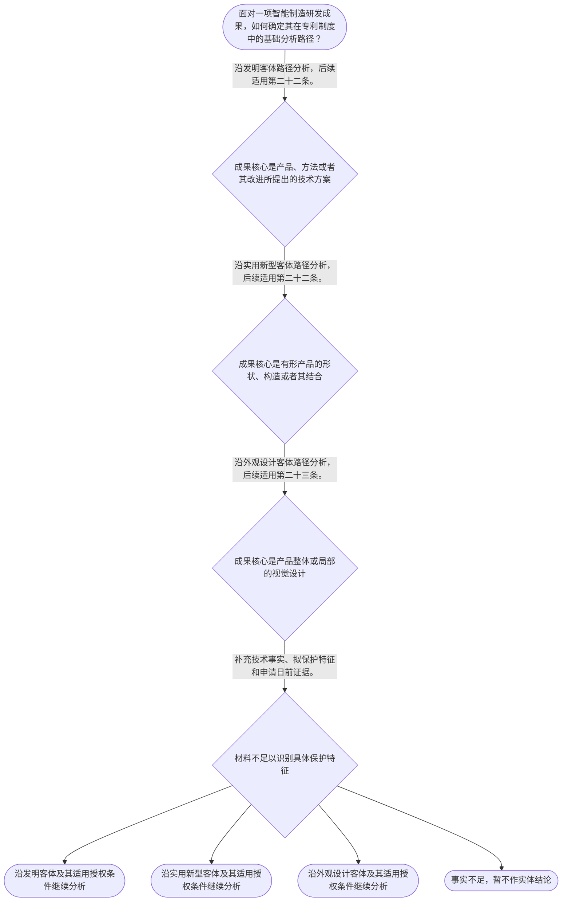

# 整合后的课程完整内容与习题

## 教学模块选择清单

- 当前教学节点：`patent-law-foundation`
- 板块预算：自适应 5/6，总计 9/9

| # | 模块 (block_type) | 类型 | 触发原因 (trigger) | 对应正文段 | 归属 |
|---:|---|:--:|---|---|:--:|
| 1 | `anchor_scenario` | 自适应 | perception=sensing(0.78) / cold_start | 从协作机器人工作站进入专利制度｜某智能制造企业准备为协作机器人工作站申请专利。技术交底材料同时写有控制步骤、夹具连接结构和操… | [A+B融合] |
| 2 | `legal_anchor` | 必选 | mandatory | 法条锚定：客体与授权条件｜《专利法》第二条 | [A+B融合] |
| 3 | `worked_example` | 自适应 | cold_start(low_confidence) | 案例演示：机器人分拣单元的分类链｜某企业提交机器人分拣单元的技术交底，包含控制方法、夹具连接结构和操作面板局部视觉设计。能否仅… | [A+B融合] |
| 4 | `decision_flow` | 自适应 | input=visual(0.74) | 客体与条件的基础决策流程｜面对一项智能制造研发成果，如何确定其在专利制度中的基础分析路径？ | [A+B融合] |
| 5 | `mnemonic` | 自适应 | understanding=sequential(0.68) | 四步分类记忆表｜四步分类表：“对象—类型—条件—证据”。 | [B] |
| 6 | `reflect_prompt` | 自适应 | processing=reflective(0.62) | 把工程资料转化为法律事实｜回看一份智能制造项目技术交底书，你会怎样分别标注控制方法、产品结构、产品外观，以及支持申请日… | [B] |
| 7 | `assessment` | 必选 | mandatory | 本节三类测评｜识别《专利法》第二条规定的三种发明创造。 | [A+B融合] |
| 8 | `knowledge_synthesis` | 必选 | mandatory | 专利法律制度基础知识网络｜专利制度基本特征是独占性、时间性和地域性，具体效力须依相应法源核验。 | [A+B融合] |
| 9 | `summary_card` | 自适应 | len(knowledge_sub_nodes)=3>=3 | 专利法律制度基础速查卡｜先按第二条认清保护对象，再按相应法条匹配授权条件，并以申请日前证据控制结论；专利制度同时通过… | [A+B融合] |

## 教学正文

# 专利法律制度基础

本节的唯一主节点是“专利法律制度基础”。目标是先建立稳定的制度地图：识别智能制造成果的保护对象，匹配正确的授权条件入口，并理解专利权不是无限、永久或当然全球有效的权利。

检索上下文没有提供可核验的智能制造领域真实案件。因此，以下协作机器人工作站仅是教学场景，不主张为真实案例；真实案件的证据、权利要求与裁判理由必须另行核验。

## 一、先从技术事实进入，而不是从行业名称进入

设想一条协作机器人工作站：视觉相机识别工件位置，控制软件据此调整机械臂抓取路径；同时，研发团队设计了夹具导轨与锁扣的连接方式，以及操作面板局部的图案和色彩组合。三项成果都服务于智能制造，但不能因此归为同一种专利。

判断起点是“实际拟保护什么”：控制步骤、产品结构，还是产品整体或局部的视觉设计。行业、市场价值、量产状态都不能替代事实识别。

## 二、法定客体：发明、实用新型和外观设计

《专利法》第二条规定，发明创造包括发明、实用新型和外观设计。发明是对产品、方法或者其改进所提出的新的技术方案；实用新型是对产品的形状、构造或者其结合所提出的适于实用的新的技术方案；外观设计是对产品整体或者局部的形状、图案或者其结合，以及色彩与形状、图案的结合所作出的富有美感并适于工业应用的新设计。〔RAG: 中华人民共和国专利法.txt — 第二条：本法所称的发明创造是指发明、实用新型和外观设计〕

可用一个不替代法条的工作分类法帮助提取事实：控制步骤、制造步骤和设备协同的技术方案，先沿发明客体分析；有形产品的部件如何连接、组合或构成，先沿实用新型客体分析；产品整体或局部的形状、图案、色彩及其结合，先沿外观设计客体分析。一个机器人平台可以同时承载不同客体的创新，但不意味着它们具有相同申请路径或保护范围。

## 三、客体确定后，才进入相应授权条件

对发明和实用新型，《专利法》第二十二条要求同时具备新颖性、创造性和实用性。新颖性是指该发明或者实用新型不属于现有技术，也不存在法定的同样发明或者实用新型在先申请、后公开情形；创造性要求相对于现有技术具有法定的实质性特点和进步；实用性要求能够制造或者使用，并能够产生积极效果。〔RAG: 中华人民共和国专利法.txt — 第二十二条：授予专利权的发明和实用新型，应当具备新颖性、创造性和实用性〕

现有技术是申请日以前在国内外为公众所知的技术；有优先权时需关注优先权日，申请日或优先权日当天公开的技术不属于该时间界限之前的现有技术。〔RAG: 专利法律知识详细解读.txt — 现有技术的时间界限是申请日；享有优先权时指优先权日；不包括申请日当天公开的技术内容〕

外观设计不能直接套用上述“三性”表述。《专利法》第二十三条对外观设计另行规定不属于现有设计、与现有设计相比具有明显区别，并不得与申请日前已取得的合法权利相冲突。〔RAG: 中华人民共和国专利法.txt — 第二十三条：授予专利权的外观设计，应当不属于现有设计〕

## 四、智能制造案例的分步适用

回到机器人分拣单元。视觉识别后调整抓取顺序，重点是技术控制步骤，应先按发明客体分析；夹具导轨与锁扣的特定连接关系，重点是产品结构，应先按实用新型客体分析；操作面板局部的几何图案和色彩组合，重点是视觉呈现，应先按外观设计客体分析。

设备已经试运行，至多可能与“能够制造或者使用并产生积极效果”相关，不能替代新颖性、创造性或外观设计法定条件的核验。案情没有提供申请日前的公开资料，所以不能据此断定任何一项成果具有或不具有新颖性。

## 五、制度体系、作用与基本边界

中国专利制度以《专利法》为核心，并结合《专利法实施细则》《专利审查指南》等材料理解申请、审查和保护规则。本轮检索未提供后二者的具体条文，因此不能在本节扩展其程序细节。《专利法》第三条规定，国务院专利行政部门负责管理全国专利工作，统一受理和审查专利申请并依法授予专利权；地方管理专利工作的部门负责本行政区域内的专利管理工作。〔RAG: 中华人民共和国专利法.txt — 第三条：国务院专利行政部门负责管理全国的专利工作；统一受理和审查专利申请，依法授予专利权〕

专利制度的作用可以理解为一条相互衔接的链条：以鼓励发明创造为起点，通过授予法律保护形成创新激励；以技术公开为重要交换和传播机制，使公众能够在法定公开资料中获得技术知识，减少重复研发并为后续改进提供基础；再推动发明创造应用、提高创新能力，最终促进科学技术进步和经济社会发展。这里的“公开—保护”是帮助理解制度功能的概括，不等于任何申请当然获得授权。〔RAG: 专利法律知识详细解读.txt — “鼓励发明创造”—“推动发明创造的应用”—“提高创新能力”，最终实现“促进科学技术进步和经济社会发展”〕

专利权的独占性、时间性和地域性是本节点的三项基础特征：它们共同提示专利权并非不受期限、法域和授权内容约束的绝对控制权。检索上下文未提供具体期限和地域效力条文，本节不作进一步具体断言。

检索材料还记载，我国首部专利法于1984年制定、1985年施行，确立先申请制；发明专利授权经历初步审查和实质审查，实用新型和外观设计以初步审查为主。关于“早期公开、延迟审查”的具体制度内容，检索上下文未提供直接依据，本节不作进一步断言。〔RAG: 专利法律知识详细解读.txt — 我国1984年制定的首部专利法具有如下特点：专利申请制度确立为先申请制，发明专利为实质审查制，实用新型和外观设计为初步审查制〕

## 六、一个可复用的分析顺序

记住“对象—类型—条件—证据”：先找方案实际保护的对象；再按第二条定类型；随后匹配第二十二条或第二十三条的条件；最后核对申请日前公开等证据。该顺序只是分析工具，不能替代法条、权利要求、技术交底和公开证据本身。

本节设有测评，请到【习题】区作答。

### 从协作机器人工作站进入专利制度（anchor_scenario）

> 某智能制造企业准备为协作机器人工作站申请专利。技术交底材料同时写有控制步骤、夹具连接结构和操作面板局部图案。团队需要区分保护对象、授权条件和权利边界。

**锚定**：该场景把三类法定保护客体、授权条件入口和专利权基本边界锚定到同一条智能制造产线。

**先想一想**：面对控制步骤、产品结构和产品外观，你会先依据哪一类事实区分它们？

### 法条锚定：客体与授权条件（legal_anchor）

- **《专利法》第二条**：第二条规定发明、实用新型和外观设计三类保护客体。
- **《专利法》第二十二条**：第二十二条规定发明和实用新型须具备新颖性、创造性和实用性；现有技术是申请日以前在国内外为公众所知的技术。
- **《专利法》第二十三条**：第二十三条对外观设计另设授权条件。

**为何重要**：客体分类决定后续应进入哪一套授权条件；制度作用中的技术公开不能替代具体法定要件。

### 案例演示：机器人分拣单元的分类链（worked_example）

**案情/例题**：某企业提交机器人分拣单元的技术交底，包含控制方法、夹具连接结构和操作面板局部视觉设计。能否仅因设备已试运行成功就判断可以授权？
**适用规则**：《专利法》第二条用于识别客体；第二十二条用于发明和实用新型授权条件；第二十三条规定外观设计条件。
**分步推演**：
1. 控制步骤属于方法技术方案的事实方向。 → *先进入发明客体分析。*
2. 夹具导轨与锁扣的连接关系属于产品结构事实。 → *先进入实用新型客体分析。*
3. 面板局部图案和色彩组合属于视觉设计事实。 → *先进入外观设计客体分析。*
4. 试运行成功只能提供实用性线索，不能替代其他授权条件。 → *客体、条件和证据必须分层判断。*
**结论**：三部分应分别沿发明、实用新型和外观设计路径分析，不能仅凭运行效果作出授权结论。
**本题要点**：按“事实对象—法定客体—对应授权条件—时间与证据”顺序分析。

### 客体与条件的基础决策流程（decision_flow）

**决策问题**：面对一项智能制造研发成果，如何确定其在专利制度中的基础分析路径？



### 四步分类记忆表（mnemonic）

**记忆锚**：四步分类表：“对象—类型—条件—证据”。
**映射**：
- 对象
- 类型
- 条件
- 证据
**何时用**：遇到智能制造技术交底时，先按四步排序；口诀不能替代法条和事实核验。

### 把工程资料转化为法律事实（reflect_prompt）

**反思问题**：回看一份智能制造项目技术交底书，你会怎样分别标注控制方法、产品结构、产品外观，以及支持申请日前公开判断的资料？

**关注要点**：项目名称、市场价值和技术对象不是同一层次的事实。；同一机器人平台可以同时承载不同类型的创新。；发明和实用新型的三性与外观设计授权条件不能混同。；申请日前公众可知的技术或设计是后续判断的重要证据维度。

**连接**：连接到研发中“先界定对象、再确定评价指标、最后核验数据”的工程工作方式。

### 专利法律制度基础知识网络（knowledge_synthesis）

**知识框架**：
- 专利制度基本特征是独占性、时间性和地域性，具体效力须依相应法源核验。
- 中国专利制度体系以《专利法》为核心，并结合《专利法实施细则》和《专利审查指南》理解申请、审查与保护。
- 三种保护客体由第二条规定，分类依据是具体方法、产品结构或产品整体及局部视觉设计。
- 制度作用包括鼓励发明创造、促进技术公开、推动发明创造应用、提高创新能力，并促进科学技术进步和经济社会发展。技术公开有助于公众获得技术知识、减少重复研发并为后续改进提供基础，但不等于当然授权。〔RAG: 专利法律知识详细解读.txt — “鼓励发明创造”—“推动发明创造的应用”—“提高创新能力”，最终实现“促进科学技术进步和经济社会发展”〕
- 制度发展与审查特点：我国首部专利法于1984年制定、1985年施行，确立先申请制；发明经历初步审查和实质审查，实用新型、外观设计以初步审查为主。关于早期公开、延迟审查的具体制度内容，检索上下文未提供直接依据。
**概念关系**：先识别保护客体，才能匹配相应授权条件。；第二十二条三性适用于发明和实用新型，第二十三条对外观设计另设条件。；制度公开机制有助于技术传播和后续改进，但具体授权仍须依申请日、授权文本和证据判断。；后续讨论新颖性需回到申请日前公开，讨论侵权需回到授权文本和保护范围。
**必记**：第二条是三类保护客体分类的直接依据。；不得因成果属于智能制造、已经量产或具有商业价值就跳过客体分类和法定授权条件。；发明和实用新型应具备新颖性、创造性和实用性，三者判断问题不同。；外观设计依据第二十三条分析，不能直接套用第二十二条三性。；专利制度通过技术公开促进知识传播和后续创新，但制度目的不能替代具体法定要件。

### 专利法律制度基础速查卡（summary_card）

**要点卡**：
- **三种保护客体**：发明看产品、方法或其改进的技术方案；实用新型看产品形状、构造或其结合；外观设计看产品整体或局部视觉设计。
- **授权条件入口**：发明和实用新型适用第二十二条的三性；外观设计适用第二十三条的独立条件。
- **现有技术**：现有技术是申请日以前在国内外为公众所知的技术；有优先权时应核对优先权日。
- **专利权基本边界**：独占性必须与时间性、地域性一并理解，具体权利效力须结合授权内容和法源判断。
- **制度体系与审查**：以专利法为核心，结合实施细则和审查指南；发明实行初步审查与实质审查，实用新型和外观设计以初步审查为主。
- **制度作用**：专利制度通过鼓励发明创造、促进技术公开、推动技术应用和提高创新能力，服务于科技进步和经济社会发展；技术公开也为公众学习和后续改进提供基础。
**必背**：《专利法》第二条规定的发明创造包括发明、实用新型和外观设计。；发明和实用新型应当具备新颖性、创造性和实用性。；外观设计的授权条件依据《专利法》第二十三条，不能直接套用三性。；专利制度通过技术公开促进知识传播和后续创新，但公开不等于当然授权。；客体分类先看具体保护对象，后续实体判断再看法定条件、申请日和证据。
**一句话总结**：先按第二条认清保护对象，再按相应法条匹配授权条件，并以申请日前证据控制结论；专利制度同时通过公开技术促进后续创新。

### 本节三类测评（assessment）

**三类覆盖**：backward_review、forward_probe、weakness_probe
**题目**：
- q-backward-1：识别《专利法》第二条规定的三种发明创造。
- q-forward-1：探测专利权保护的时间、地域和授权内容边界。
- q-weakness-1：区分客体分类、不同授权条件与技术效果之间的关系。


## 结构化数据

## expert

```json
"A+B融合"
```

## style

```json
"fused"
```

## knowledge_points

```json
[
  {
    "node_id": "patent-law-foundation",
    "kc_name": "专利制度的基本概念与特征：独占性、时间性、地域性"
  },
  {
    "node_id": "patent-law-foundation",
    "kc_name": "中国专利制度体系：专利法、专利法实施细则、专利审查指南"
  },
  {
    "node_id": "patent-law-foundation",
    "kc_name": "专利保护的三种客体：发明、实用新型、外观设计"
  },
  {
    "node_id": "patent-law-foundation",
    "kc_name": "专利制度的作用：激励发明创造、促进技术公开、推动技术应用和经济发展"
  },
  {
    "node_id": "patent-law-foundation",
    "kc_name": "中国专利制度发展历程与特点：早期公开延迟审查、初步审查制与实质审查制并存"
  }
]
```

## legal_basis

```json
[
  {
    "article": "《专利法》第二条：发明、实用新型、外观设计的法定定义",
    "source": "中华人民共和国专利法.txt：第二条"
  },
  {
    "article": "《专利法》第三条：国务院专利行政部门与地方管理专利工作的部门职责",
    "source": "中华人民共和国专利法.txt：第三条"
  },
  {
    "article": "《专利法》第二十二条：发明和实用新型的新颖性、创造性、实用性及现有技术定义",
    "source": "中华人民共和国专利法.txt：第二十二条"
  },
  {
    "article": "《专利法》第二十三条：外观设计的授权条件及现有设计定义",
    "source": "中华人民共和国专利法.txt：第二十三条"
  },
  {
    "article": "中国专利制度发展与审查特点：首部专利法、先申请制、初步审查与实质审查",
    "source": "专利法律知识详细解读.txt：制度目标与中国专利法制定部分"
  },
  {
    "article": "专利制度通过公开技术促进发明创造应用、提高创新能力，并促进科学技术进步和经济社会发展",
    "source": "专利法律知识详细解读.txt：chunk_id 1938"
  }
]
```

## risks

```json
[
  {
    "risk": "独占性、时间性和地域性仅用于本节的基础边界理解；具体权利效力、期限与法域必须在后续节点结合相应法条、授权文本和事实核验。",
    "related_node_id": "patent-rights-nature"
  },
  {
    "risk": "检索上下文未提供《专利法实施细则》和《专利审查指南》的具体条文，不能据此扩展具体程序结论。",
    "related_node_id": "patent-law-framework"
  },
  {
    "risk": "关于“早期公开、延迟审查”的具体制度内容，检索上下文未提供直接依据；本节不据此作程序性断言。",
    "related_node_id": "patent-system-overview"
  },
  {
    "risk": "不得把“智能制造”“已经量产”“技术先进”或“具有商业价值”直接等同于法定客体、全部授权条件或专利权保护范围。",
    "related_node_id": "patent-law-foundation"
  },
  {
    "risk": "本节只建立新颖性入口。具体判断还须区分申请日前公众可知的现有技术与第二十二条规定的在先申请、后公开文件情形。",
    "related_node_id": "novelty"
  }
]
```

## draft_stage

```json
"integration"
```

## irac

```json
{
  "issue": "智能制造研发成果如何在中国专利制度中识别保护客体，并如何建立进入新颖性和专利权保护判断前所需的基础框架？",
  "rule": "《专利法》第二条规定发明、实用新型和外观设计的法定定义。〔RAG: 中华人民共和国专利法.txt — 第二条：本法所称的发明创造是指发明、实用新型和外观设计〕《专利法》第二十二条规定，发明和实用新型应具备新颖性、创造性和实用性，并定义现有技术为申请日以前在国内外为公众所知的技术。〔RAG: 中华人民共和国专利法.txt — 第二十二条：授予专利权的发明和实用新型，应当具备新颖性、创造性和实用性〕《专利法》第二十三条对外观设计另行规定授权条件。",
  "application": "在协作机器人工作站中，视觉识别后调整抓取路径的控制步骤，应先按发明客体分析；夹具导轨与锁扣的连接结构，应先按实用新型客体分析；操作面板局部图案和色彩组合，应先按外观设计客体分析。设备试运行成功只能提供实用性相关线索，不能替代其他法定条件。",
  "conclusion": "智能制造成果不能仅按行业、产品名称、技术效果或商业价值分类。应先依据第二条确定保护客体，再分别匹配第二十二条或第二十三条规定的授权条件；专利制度还通过技术公开促进知识传播、后续改进和创新发展，但具体权利效力须依相应法源判断。"
}
```

## interactive_questions

```json
[
  {
    "qid": "q-backward-1",
    "category": "remember",
    "difficulty": "L1",
    "source_tag": "backward_review",
    "kc_node_id": "patent-law-foundation",
    "question": "根据《专利法》第二条，下列哪一组属于专利法所称的发明创造？",
    "answer": "B",
    "options": [
      "A. 商业模式、企业名称和销售渠道",
      "B. 发明、实用新型和外观设计",
      "C. 新颖性、创造性和实用性",
      "D. 专利法、实施细则和审查指南"
    ]
  },
  {
    "qid": "q-forward-1",
    "category": "understand",
    "difficulty": "L1",
    "source_tag": "forward_probe",
    "kc_node_id": "patent-rights-protection",
    "question": "关于专利权保护的基础理解，下列哪项正确？",
    "answer": "C",
    "options": [
      "A. 专利申请提交后当然产生永久且全球有效的排他权",
      "B. 专利权可以脱离具体授权内容覆盖任何相似产品",
      "C. 理解专利权保护时，应结合授权内容及其时间、地域等法定边界",
      "D. 产品属于智能制造领域即可当然取得完整专利权保护"
    ]
  },
  {
    "qid": "q-weakness-1",
    "category": "analyze",
    "difficulty": "L3",
    "source_tag": "weakness_probe",
    "kc_node_id": "patent-law-foundation",
    "question": "某智能制造企业拟保护控制方法、夹具连接结构和操作面板局部图案。甲主张三项成果都直接按发明和实用新型的“三性”判断；乙主张只要方案能提高效率就当然同时具备新颖性和创造性。下列判断正确的是？",
    "answer": "D",
    "options": [
      "A. 甲、乙都正确，因为三项成果都服务于同一生产线",
      "B. 甲正确，乙错误，因为第二十二条的三性适用于所有专利类型",
      "C. 甲错误，乙正确，因为提高效率足以证明新颖性和创造性",
      "D. 甲、乙都不正确：应先区分客体；发明和实用新型的三性彼此不同，外观设计适用第二十三条的独立条件"
    ]
  }
]
```

## knowledge_synthesis

```json
{
  "node": "patent-law-foundation",
  "coverage": [
    {
      "node_id": "patent-rights-nature"
    },
    {
      "node_id": "patent-law-framework"
    },
    {
      "node_id": "patent-law-foundation"
    },
    {
      "node_id": "patent-system-overview"
    }
  ],
  "confusable_pairs": [
    {
      "pair": "发明与实用新型：发明可以涉及产品、方法或者其改进；实用新型限于产品的形状、构造或者其结合。"
    },
    {
      "pair": "发明和实用新型的三性与外观设计授权条件：第二十二条适用于前者，第二十三条对后者另设条件。"
    },
    {
      "pair": "新颖性与创造性：新颖性判断是否落入现有技术及法定抵触申请情形；创造性判断相对现有技术是否具有法定实质性特点和进步。"
    },
    {
      "pair": "现有技术与抵触申请：现有技术是申请日前为公众所知的技术；第二十二条还规定同样发明或者实用新型的在先申请、后公开文件这一不同判断情形。"
    }
  ]
}
```
