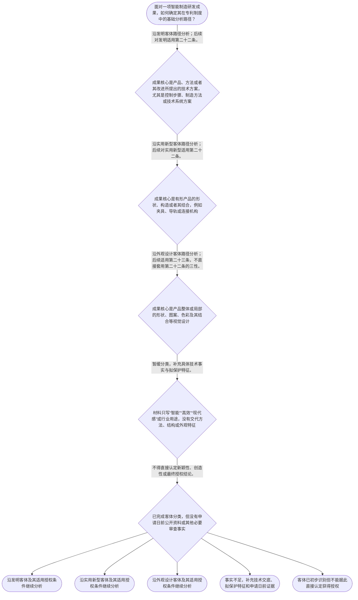

# 整合后的课程完整内容与习题

## 教学模块选择清单

- 当前教学节点：`patent-law-foundation`
- 板块预算：自适应 5/6，总计 9/9

| # | 模块 (block_type) | 类型 | 触发原因 (trigger) | 对应正文段 | 归属 |
|---:|---|:--:|---|---|:--:|
| 1 | `anchor_scenario` | 自适应 | perception=sensing(0.78) / cold_start | 从协作机器人工作站进入专利制度｜某智能制造企业的研发负责人准备为协作机器人工作站申请专利。技术交底材料同时写有：视觉相机识别… | [A+B融合] |
| 2 | `legal_anchor` | 必选 | mandatory | 法条锚定：客体与授权条件｜《专利法》第二条 | [A+B融合] |
| 3 | `worked_example` | 自适应 | cold_start(low_confidence) | 案例演示：机器人分拣单元的分类链｜某企业提交机器人分拣单元的技术交底：第一部分是利用视觉传感器识别工件位置并调整机械臂抓取顺序… | [A+B融合] |
| 4 | `decision_flow` | 自适应 | input=visual(0.74) | 客体与条件的基础决策流程｜面对一项智能制造研发成果，如何确定其在专利制度中的基础分析路径？ | [A+B融合] |
| 5 | `mnemonic` | 自适应 | understanding=sequential(0.68) | 四步分类记忆表｜四步分类表：“对象—类型—条件—证据”。先找保护对象，再定发明、实用新型或外观设计类型；随后… | [B] |
| 6 | `reflect_prompt` | 自适应 | processing=reflective(0.62) | 把工程资料转化为法律事实｜回看一份智能制造项目技术交底书，你会怎样分别标注控制方法、产品结构、产品外观，以及支持申请日… | [B] |
| 7 | `assessment` | 必选 | mandatory | 本节三类测评｜识别《专利法》第二条规定的三种发明创造。 | [A+B融合] |
| 8 | `knowledge_synthesis` | 必选 | mandatory | 专利法律制度基础知识网络｜专利制度基本特征：独占性、时间性、地域性共同说明专利权不是无限、永久或当然全球有效的权利；具… | [A+B融合] |
| 9 | `summary_card` | 自适应 | len(knowledge_sub_nodes)=3>=3 | 专利法律制度基础速查卡｜先按第二条认清保护对象，再按相应法条匹配授权条件，并以申请日前的证据控制结论。 | [A+B融合] |

## 教学正文

# 专利法律制度基础

本节的唯一主节点是“专利法律制度基础”。你的目标不是立刻完成新颖性或侵权结论，而是先建立一张稳定的制度地图：识别智能制造成果保护的对象，匹配正确的授权条件入口，并理解专利权不是无限、永久或当然全球有效的权利。

检索上下文没有提供可核验的智能制造领域真实案件。因此，以下协作机器人工作站仅是教学场景，不主张为真实案例；真实案件的证据、权利要求与裁判理由必须另行核验。

## 一、先从技术事实进入，而不是从行业名称进入

设想一条协作机器人工作站：视觉相机识别工件位置，控制软件据此调整机械臂抓取路径；同时，研发团队设计了夹具导轨与锁扣的连接方式，以及操作面板局部的图案和色彩组合。三项成果都服务于智能制造，但不能因此归为同一种专利。

判断的起点是“实际拟保护什么”：控制步骤、产品结构，还是产品整体或局部的视觉设计。行业、市场价值、量产状态都不能替代这一事实识别。

## 二、法定客体：发明、实用新型和外观设计

《专利法》第二条规定，发明创造包括发明、实用新型和外观设计。发明是对产品、方法或者其改进所提出的新的技术方案；实用新型是对产品的形状、构造或者其结合所提出的适于实用的新的技术方案；外观设计是对产品整体或者局部的形状、图案或者其结合，以及色彩与形状、图案的结合所作出的富有美感并适于工业应用的新设计。〔RAG: 中华人民共和国专利法.txt — 第二条：本法所称的发明创造是指发明、实用新型和外观设计〕

可用一个不替代法条的工作分类法帮助提取事实：

- 控制步骤、制造步骤、算法与设备协同的技术方案，先沿发明客体分析。
- 有形产品的部件如何连接、组合或构成，先沿实用新型客体分析。
- 产品整体或局部看起来是什么样，包括形状、图案、色彩及其结合，先沿外观设计客体分析。

这个分类法的边界是：它只帮助定位，最终必须回到第二条的全部法定定义。一个机器人平台可以同时承载不同客体的创新，并不意味着它们具有相同申请路径或保护范围。

## 三、客体确定后，才进入相应授权条件

对发明和实用新型，《专利法》第二十二条要求同时具备新颖性、创造性和实用性。新颖性是指该发明或者实用新型不属于现有技术，也不存在法定的同样发明或者实用新型在先申请、后公开情形；创造性要求相对于现有技术具有法定的实质性特点和进步；实用性要求能够制造或者使用，并能够产生积极效果。〔RAG: 中华人民共和国专利法.txt — 第二十二条：授予专利权的发明和实用新型，应当具备新颖性、创造性和实用性〕

现有技术是申请日以前在国内外为公众所知的技术。检索材料进一步说明，有优先权时需关注优先权日；申请日或优先权日当天公开的技术不属于该时间界限之前的现有技术。〔RAG: 专利法律知识详细解读.txt — 现有技术的时间界限是申请日；享有优先权时指优先权日；不包括申请日当天公开的技术内容〕

外观设计不能直接套用上述“三性”表述。《专利法》第二十三条规定，授予外观设计专利权，应当不属于现有设计，也不存在法定的同样外观设计在先申请、后公告情形；还应当与现有设计或者现有设计特征的组合相比具有明显区别，并不得与申请日前已取得的合法权利相冲突。〔RAG: 中华人民共和国专利法.txt — 第二十三条：授予专利权的外观设计，应当不属于现有设计〕

因此，机器人控制方法已经实现、夹具提高了稳定性，均不能直接推出“已获得专利权”。它们最多提供某些待核验事实。正确顺序是：先分类，再匹配条件，最后核对申请日前的公开资料和其他证据。

## 四、智能制造案例的分步适用

回到机器人分拣单元。视觉识别后调整抓取顺序，重点是技术控制步骤，应先按发明客体分析。夹具导轨与锁扣的特定连接关系，重点是产品结构，应先按实用新型客体分析。操作面板局部的几何图案和色彩组合，重点是视觉呈现，应先按外观设计客体分析。

接着，不要把“设备已经试运行”当成授权结论。对前两类成果，试运行至多可能与“能够制造或者使用并产生积极效果”相关，但仍须分别核对新颖性、创造性和实用性。对面板设计，应依据第二十三条的外观设计条件继续判断。案情没有提供申请日前的公开资料，所以不能据此断定任何一项成果具有或不具有新颖性。

## 五、制度体系、作用与基本边界

中国专利制度以《专利法》为核心，并在实践中结合《专利法实施细则》《专利审查指南》等材料理解申请、审查和保护规则。本轮检索未提供后二者的具体条文，因此不能在本节扩展其程序细节。

《专利法》第三条规定，国务院专利行政部门负责管理全国专利工作，统一受理和审查专利申请并依法授予专利权；地方管理专利工作的部门负责本行政区域内的专利管理工作。〔RAG: 中华人民共和国专利法.txt — 第三条：国务院专利行政部门负责管理全国的专利工作；统一受理和审查专利申请，依法授予专利权〕

检索材料将专利制度目标概括为鼓励发明创造、推动发明创造应用、提高创新能力，最终促进科学技术进步和经济社会发展。〔RAG: 专利法律知识详细解读.txt — “鼓励发明创造”—“推动发明创造的应用”—“提高创新能力”，最终实现“促进科学技术进步和经济社会发展”〕

专利权的独占性、时间性和地域性是本节点的三项基础特征：它们共同提示专利权并非不受期限、法域和授权内容约束的绝对控制权。具体期限、保护范围、侵权行为与地域效力，须在后续“专利权保护”及相关节点中依具体法源、授权文本和案件事实判断。

检索材料还记载，我国首部专利法于1984年制定、1985年施行，确立先申请制；发明专利的授权经历初步审查和实质审查两个阶段，实用新型和外观设计以初步审查为主。〔RAG: 专利法律知识详细解读.txt — 我国1984年制定的首部专利法具有如下特点：专利申请制度确立为先申请制，发明专利为实质审查制，实用新型和外观设计为初步审查制〕关于“早期公开、延迟审查”的具体制度内容，检索上下文未提供直接依据，本节不作进一步断言。

## 六、一个可复用的分析顺序

记住“对象—类型—条件—证据”：先找方案实际保护的对象；再按第二条定类型；随后匹配第二十二条或第二十三条的条件；最后核对申请日前公开等证据。该顺序只是分析工具，不能替代法条、权利要求、技术交底和公开证据本身。

本节设有测评，请到【习题】区作答。

### 从协作机器人工作站进入专利制度（anchor_scenario）

> 某智能制造企业的研发负责人准备为协作机器人工作站申请专利。技术交底材料同时写有：视觉相机识别工件位置后调整抓取路径的控制步骤、夹具导轨与锁扣的连接结构，以及操作面板局部的几何图案和色彩组合。团队争论不休：三项内容能否放进同一种专利申请？若日后发现相近技术已经公开，是否意味着所有内容都不能获得保护？

负责人还担心，专利一旦授权就可以永久地禁止全球任何竞争者使用。此时应先把“保护什么”“适用什么授权条件”“权利边界如何理解”分开，而不是用行业名称或商业价值替代法律分类。

**锚定**：该场景把三类法定保护客体、授权条件入口和专利权基本边界锚定到同一条智能制造产线。

**先想一想**：面对控制步骤、产品结构和产品外观，你会先依据哪一类事实区分它们？

### 法条锚定：客体与授权条件（legal_anchor）

- **《专利法》第二条**：第二条先回答“保护什么”：发明保护产品、方法或者其改进的技术方案；实用新型聚焦产品的形状、构造或者其结合；外观设计聚焦产品整体或局部的视觉设计。
- **《专利法》第二十二条**：第二十二条规定，发明和实用新型须具备新颖性、创造性和实用性；现有技术是申请日以前在国内外为公众所知的技术。
- **《专利法》第二十三条**：第二十三条对外观设计另设授权条件，包括不属于现有设计、与现有设计相比具有明显区别，以及不与申请日前已取得的合法权利冲突。

**为何重要**：客体分类决定后续应进入哪一套授权条件。新颖性和侵权的完整判定属于后续节点；本节只建立准确的法条入口和概念边界。

### 案例演示：机器人分拣单元的分类链（worked_example）

**案情/例题**：某企业提交机器人分拣单元的技术交底：第一部分是利用视觉传感器识别工件位置并调整机械臂抓取顺序的方法；第二部分是夹具导轨与锁扣的特定连接结构；第三部分是操作面板局部的几何图案和色彩组合。企业问：三部分分别应从哪类专利客体切入，且能否仅因设备已试运行成功就判断可以授权？
**适用规则**：《专利法》第二条用于识别发明、实用新型和外观设计；第二十二条用于判断发明和实用新型的授权条件；第二十三条规定外观设计另有授权条件。
**分步推演**：
1. 先剥离行业标签。“机器人分拣”只是应用场景，不能替代法定客体。第一部分的核心是数据处理和控制步骤，属于对方法或者其改进提出的技术方案这一事实方向。 → *控制步骤先进入发明客体分析。*
2. 第二部分的核心是夹具这一产品中导轨与锁扣怎样连接、组合，应与产品的形状、构造或者其结合的法定定义核对。 → *产品连接结构先进入实用新型客体分析。*
3. 第三部分描述的是操作面板局部的形状、图案和色彩组合，判断重点是视觉设计而非控制功能。 → *局部视觉设计先进入外观设计客体分析。*
4. 试运行成功至多提供与实用性有关的事实线索。发明和实用新型仍须分别核对新颖性、创造性和实用性；外观设计则适用第二十三条的独立条件。没有申请日前公开资料时，不能跳步断定新颖性结论。 → *客体识别、授权条件和证据判断必须分层进行。*
**结论**：控制步骤应沿发明客体路径分析，夹具连接结构应沿实用新型客体路径分析，面板局部视觉设计应沿外观设计客体路径分析。仅凭方案能够运行或提高效率，不能得出已经满足全部授权条件；本案未提供申请日前公开证据，不能作出新颖性或创造性的实体结论。
**本题要点**：处理智能制造成果时，按“事实对象—法定客体—对应授权条件—时间与证据”顺序分析。

### 客体与条件的基础决策流程（decision_flow）

**决策问题**：面对一项智能制造研发成果，如何确定其在专利制度中的基础分析路径？



### 四步分类记忆表（mnemonic）

**记忆锚**：四步分类表：“对象—类型—条件—证据”。先找保护对象，再定发明、实用新型或外观设计类型；随后匹配授权条件；最后核对申请日前公开等证据。
**映射**：
- 对象
- 类型
- 条件
- 证据
**何时用**：看到智能制造技术交底、申请类型或授权条件问题时，先按四步分类表排序；该表只帮助组织分析，不能替代法条和事实核验。

### 把工程资料转化为法律事实（reflect_prompt）

**反思问题**：回看一份智能制造项目技术交底书，你会怎样分别标注控制方法、产品结构、产品外观，以及支持申请日前公开判断的资料？

**关注要点**：项目名称、市场价值和技术对象不是同一层次的事实。；同一机器人平台可以同时承载不同类型的创新，分类应回到具体保护特征。；发明和实用新型的三性与外观设计的授权条件不能混同。；申请日前公众可知的技术或设计，是后续实体判断的重要时间与证据维度。

**连接**：连接到研发中“先界定对象、再确定评价指标、最后核验数据”的工程工作方式，并为后续新颖性和专利权保护学习建立入口。

### 专利法律制度基础知识网络（knowledge_synthesis）

**知识框架**：
- 专利制度基本特征：独占性、时间性、地域性共同说明专利权不是无限、永久或当然全球有效的权利；具体效力、期限和法域须在后续节点依相应法源核验。
- 中国专利制度体系：以《专利法》为核心，并结合《专利法实施细则》和《专利审查指南》理解申请、审查与保护；本轮检索未提供后二者具体条文。
- 三种保护客体：第二条规定发明、实用新型和外观设计；分类依据是具体方法、产品结构或产品整体、局部视觉设计。
- 制度作用：检索材料将制度目标概括为鼓励发明创造、推动发明创造应用、提高创新能力，并促进科学技术进步和经济社会发展。
- 制度发展与审查特点：检索材料记载我国首部专利法于1984年制定、1985年施行，确立先申请制；发明经历初步审查和实质审查，实用新型、外观设计以初步审查为主。关于“早期公开、延迟审查”的具体制度表述，检索上下文未提供直接依据。
**概念关系**：先识别保护客体，才能匹配发明、实用新型或外观设计各自的授权条件。；第二十二条中的新颖性、创造性、实用性是发明和实用新型的条件；第二十三条对外观设计另设条件。；后续讨论新颖性时需回到申请日前公众可知的技术或设计；后续讨论侵权时还需回到授权文本和保护范围。；制度目的有助于理解保护与公开的关系，但不能替代具体法定要件。
**必记**：《专利法》第二条是三类保护客体分类的直接依据。；不得因成果属于智能制造、已经量产或具有商业价值，就跳过客体分类和法定授权条件。；发明和实用新型的三性彼此不同：新颖性看是否落入法定现有技术或抵触申请情形，创造性看相对现有技术的实质性特点和进步，实用性看能否制造或使用并产生积极效果。；外观设计的授权条件应依据第二十三条分析，不能直接套用第二十二条的三性。

### 专利法律制度基础速查卡（summary_card）

**要点卡**：
- **三种保护客体**：发明看产品、方法或其改进的技术方案；实用新型看产品形状、构造或其结合；外观设计看产品整体或局部视觉设计。
- **授权条件入口**：发明和实用新型适用第二十二条的三性；外观设计适用第二十三条的独立条件。
- **现有技术**：现有技术是申请日以前在国内外为公众所知的技术；有优先权时，相关时间基准应核对优先权日。
- **专利权基本边界**：独占性必须与时间性、地域性一并理解，具体权利效力仍须结合授权内容和适用法源。
- **制度体系与审查**：以专利法为核心，结合实施细则和审查指南；检索材料记载发明实行初步审查与实质审查，实用新型和外观设计以初步审查为主。
- **制度作用**：专利制度通过鼓励创造、推动应用和提高创新能力，服务于科技进步和经济社会发展。
**必背**：《专利法》第二条规定的发明创造包括发明、实用新型和外观设计。；发明和实用新型应当具备新颖性、创造性和实用性。；外观设计的授权条件依据《专利法》第二十三条，不能直接套用发明和实用新型的三性。；客体分类先看具体保护对象，后续实体判断再看法定条件、申请日和证据。；关于“早期公开、延迟审查”的具体制度内容，检索上下文未提供直接依据。
**一句话总结**：先按第二条认清保护对象，再按相应法条匹配授权条件，并以申请日前的证据控制结论。

### 本节三类测评（assessment）

**三类覆盖**：backward_review、forward_probe、weakness_probe
**题目**：
- q-backward-1：识别《专利法》第二条规定的三种发明创造。
- q-forward-1：探测专利权保护应结合授权内容理解的基础认识。
- q-weakness-1：区分客体分类、不同授权条件与技术效果之间的关系。


## 结构化数据

## expert

```json
"A+B融合"
```

## style

```json
"fused"
```

## knowledge_points

```json
[
  {
    "node_id": "patent-law-foundation",
    "kc_name": "专利制度的基本概念与特征：独占性、时间性、地域性"
  },
  {
    "node_id": "patent-law-foundation",
    "kc_name": "中国专利制度体系：专利法、专利法实施细则、专利审查指南"
  },
  {
    "node_id": "patent-law-foundation",
    "kc_name": "专利保护的三种客体：发明、实用新型、外观设计"
  },
  {
    "node_id": "patent-law-foundation",
    "kc_name": "专利制度的作用：激励发明创造、促进技术公开、推动技术应用和经济发展"
  },
  {
    "node_id": "patent-law-foundation",
    "kc_name": "中国专利制度发展历程与特点：早期公开延迟审查、初步审查制与实质审查制并存"
  }
]
```

## legal_basis

```json
[
  {
    "article": "《专利法》第二条：发明、实用新型、外观设计的法定定义",
    "source": "中华人民共和国专利法.txt：第二条"
  },
  {
    "article": "《专利法》第三条：国务院专利行政部门与地方管理专利工作的部门职责",
    "source": "中华人民共和国专利法.txt：第三条"
  },
  {
    "article": "《专利法》第二十二条：发明和实用新型的新颖性、创造性、实用性及现有技术定义",
    "source": "中华人民共和国专利法.txt：第二十二条"
  },
  {
    "article": "《专利法》第二十三条：外观设计的授权条件及现有设计定义",
    "source": "中华人民共和国专利法.txt：第二十三条"
  },
  {
    "article": "中国专利制度发展与审查特点：首部专利法、先申请制、初步审查与实质审查",
    "source": "专利法律知识详细解读.txt：制度目标与中国专利法制定部分"
  },
  {
    "article": "“早期公开、延迟审查”的具体制度内容",
    "source": "检索上下文未提供直接依据"
  }
]
```

## risks

```json
[
  {
    "risk": "独占性、时间性和地域性仅用于本节的基础边界理解；具体权利效力、期限与法域必须在后续节点结合相应法条、授权文本和事实核验。",
    "related_node_id": "patent-rights-nature"
  },
  {
    "risk": "检索上下文未提供《专利法实施细则》和《专利审查指南》的具体条文，不能据此扩展具体程序结论。",
    "related_node_id": "patent-law-framework"
  },
  {
    "risk": "“早期公开、延迟审查”的具体制度内容，检索上下文未提供直接依据；本节不据此作程序性断言。",
    "related_node_id": "patent-system-overview"
  },
  {
    "risk": "不得把“智能制造”“已经量产”“技术先进”或“具有商业价值”直接等同于法定客体、全部授权条件或专利权保护范围。",
    "related_node_id": "patent-law-foundation"
  },
  {
    "risk": "本节只建立新颖性入口。具体判断还须区分申请日前公众可知的现有技术与第二十二条规定的在先申请、后公开文件情形。",
    "related_node_id": "novelty"
  }
]
```

## draft_stage

```json
"integration"
```

## irac

```json
{
  "issue": "智能制造研发成果如何在中国专利制度中识别保护客体，并如何建立进入新颖性和专利权保护判断前所需的基础框架？",
  "rule": "《专利法》第二条规定发明、实用新型和外观设计的法定定义。〔RAG: 中华人民共和国专利法.txt — 第二条：本法所称的发明创造是指发明、实用新型和外观设计〕《专利法》第二十二条规定，发明和实用新型应具备新颖性、创造性和实用性，并定义现有技术为申请日以前在国内外为公众所知的技术。〔RAG: 中华人民共和国专利法.txt — 第二十二条：授予专利权的发明和实用新型，应当具备新颖性、创造性和实用性〕《专利法》第二十三条对外观设计另行规定不属于现有设计、明显区别及不与在先合法权利冲突等条件。",
  "application": "在协作机器人工作站中，视觉识别后调整抓取路径的控制步骤，应先按“方法或者其改进提出的技术方案”进入发明客体分析；夹具导轨与锁扣的连接结构，应先按产品形状、构造或者其结合进入实用新型客体分析；操作面板局部图案和色彩组合，应先按产品局部外观进入外观设计客体分析。即使设备已完成试运行，也只可能提供实用性相关线索，不能替代新颖性、创造性或外观设计法定条件的核验。",
  "conclusion": "智能制造成果不能仅按行业、产品名称、技术效果或商业价值分类。应先依据第二条确定保护客体，再分别匹配第二十二条或第二十三条规定的授权条件；专利权的独占性、时间性和地域性仅作为本节点的基本边界框架，具体效力须留待后续专利权保护节点依相应法源判断。"
}
```

## interactive_questions

```json
[
  {
    "qid": "q-backward-1",
    "category": "remember",
    "difficulty": "L1",
    "source_tag": "backward_review",
    "kc_node_id": "patent-law-foundation",
    "question": "根据《专利法》第二条，下列哪一组属于专利法所称的发明创造？",
    "answer": "B",
    "options": [
      "A. 商业模式、企业名称和销售渠道",
      "B. 发明、实用新型和外观设计",
      "C. 新颖性、创造性和实用性",
      "D. 专利法、实施细则和审查指南"
    ]
  },
  {
    "qid": "q-forward-1",
    "category": "understand",
    "difficulty": "L1",
    "source_tag": "forward_probe",
    "kc_node_id": "patent-rights-protection",
    "question": "关于专利权保护的基础理解，下列哪项正确？",
    "answer": "C",
    "options": [
      "A. 专利申请提交后当然产生永久且全球有效的排他权",
      "B. 专利权可以脱离具体授权内容覆盖任何相似产品",
      "C. 理解专利权保护时，应结合授权内容及其时间、地域等法定边界",
      "D. 产品属于智能制造领域即可当然取得完整专利权保护"
    ]
  },
  {
    "qid": "q-weakness-1",
    "category": "analyze",
    "difficulty": "L3",
    "source_tag": "weakness_probe",
    "kc_node_id": "patent-law-foundation",
    "question": "某智能制造企业拟保护控制方法、夹具连接结构和操作面板局部图案。甲主张三项成果都直接按发明和实用新型的“三性”判断；乙主张只要方案能提高效率就当然同时具备新颖性和创造性。下列判断正确的是？",
    "answer": "D",
    "options": [
      "A. 甲、乙都正确，因为三项成果都服务于同一生产线",
      "B. 甲正确，乙错误，因为第二十二条的三性适用于所有专利类型",
      "C. 甲错误，乙正确，因为提高效率足以证明新颖性和创造性",
      "D. 甲、乙都不正确：应先区分客体；发明和实用新型的三性彼此不同，外观设计适用第二十三条的独立条件"
    ]
  }
]
```

## knowledge_synthesis

```json
{
  "node": "patent-law-foundation",
  "coverage": [
    {
      "node_id": "patent-rights-nature"
    },
    {
      "node_id": "patent-law-framework"
    },
    {
      "node_id": "patent-law-foundation"
    },
    {
      "node_id": "patent-system-overview"
    }
  ],
  "confusable_pairs": [
    {
      "pair": "发明与实用新型：发明可以涉及产品、方法或者其改进；实用新型限于产品的形状、构造或者其结合。"
    },
    {
      "pair": "发明和实用新型的三性与外观设计授权条件：第二十二条适用于前者，第二十三条对后者另设条件。"
    },
    {
      "pair": "新颖性与创造性：新颖性判断是否落入现有技术及法定抵触申请情形；创造性判断相对现有技术是否具有法定实质性特点和进步。"
    },
    {
      "pair": "现有技术与抵触申请：现有技术是申请日前为公众所知的技术；第二十二条还规定同样发明或者实用新型的在先申请、后公开文件这一不同判断情形。"
    }
  ]
}
```
