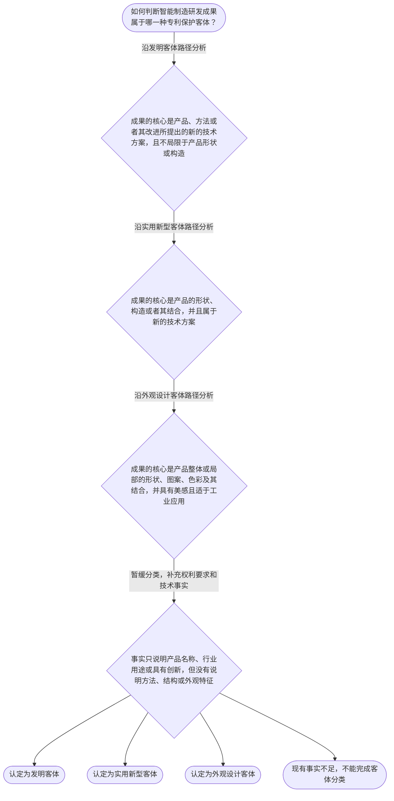

# 专家 A 教学草稿

> 专家：expert_a ｜ 风格：conservative

## 教学模块选择清单

- 当前教学节点：`patent-law-foundation`
- 板块预算：自适应 6/6，总计 8/8

| # | 模块 (block_type) | 类型 | 触发原因 (trigger) | 对应正文段 | 归属 |
|---:|---|:--:|---|---|:--:|
| 1 | `anchor_scenario` | 自适应 | perception=sensing(0.78) / cold_start | 智能制造企业的专利布局冲突｜智能制造企业甲研发了一套协作机器人工作站：机械臂通过传感器采集工件位置，再由控制程序调整抓取… | [A] |
| 2 | `legal_anchor` | 必选 | mandatory | 法条锚定：客体、制度主体与公开行为｜《专利法》第二条 | [A] |
| 3 | `worked_example` | 自适应 | cold_start(low_confidence) | 案例演示：机器人分拣单元的客体分类｜智能制造企业乙研发机器人分拣单元。第一项成果是根据视觉传感器识别结果调整机械臂抓取顺序的控制… | [A] |
| 4 | `decision_flow` | 自适应 | input=visual(0.74) | 客体分类决策流程｜如何判断智能制造研发成果属于哪一种专利保护客体？ | [A] |
| 5 | `mnemonic` | 自适应 | understanding=sequential(0.68) | 专利客体三分记忆表｜客体分类四问表：先问“方法还是产品”，再问“产品的结构还是外观”；方法或一般技术方案记“发”… | [A] |
| 6 | `reflect_prompt` | 自适应 | processing=reflective(0.62) | 从技术交底书反思客体分类｜回看一个智能制造项目的技术交底书，你会如何把功能流程、机械结构和界面外观分别标记，以避免把不… | [A] |
| 7 | `assessment` | 必选 | mandatory | 本节三类测评｜识别《专利法》第二条规定的专利类型。 | [A] |
| 8 | `knowledge_synthesis` | 必选 | mandatory | 专利法律制度基础知识网络｜专利制度基本特征：专利权具有独占性、时间性和地域性，权利效力受授权范围、法定期限和法域限制。 | [A] |
| 9 | `summary_card` | 自适应 | len(knowledge_sub_nodes)=3>=3 | 专利法律制度基础速查卡｜先按法条区分客体，再用独占性、时间性和地域性限定专利权的制度边界。 | [A] |

## 教学正文

## I — 法律问题

本节只处理“专利法律制度基础”这一主节点：第一，智能制造研发成果如何区分发明、实用新型和外观设计三类保护客体；第二，如何理解专利权的独占性、时间性和地域性；第三，中国专利制度由哪些基本规范和审查环节构成。新颖性和侵权判定将在后续节点中单独展开。

## R — 适用规则

### 1. 三类专利保护客体

《专利法》第二条规定，发明是对产品、方法或者其改进所提出的新的技术方案；实用新型是对产品的形状、构造或者其结合所提出的适于实用的新的技术方案；外观设计是对产品整体或局部的形状、图案或者其结合以及色彩与形状、图案的结合所作出的富有美感并适于工业应用的新设计。〔RAG: 中华人民共和国专利法.txt — 第二条：发明、实用新型和外观设计的定义〕

因此，分类的第一步不是看成果属于机器人、机床还是生产线，而是提取权利要求或技术方案实际保护的特征：保护控制步骤或其他技术方案，沿发明路径分析；保护产品形状、构造或其结合，沿实用新型路径分析；保护产品整体或局部的视觉设计，沿外观设计路径分析。

### 2. 中国专利制度的基本结构

国务院专利行政部门负责管理全国的专利工作，统一受理和审查专利申请并依法授予专利权；省、自治区、直辖市人民政府管理专利工作的部门负责本行政区域内的专利管理工作。〔RAG: 中华人民共和国专利法.txt — 第三条：国务院专利行政部门与地方管理专利工作的部门的职责〕

检索材料记载，我国专利制度实行先申请制；发明专利申请需要经过初步审查和实质审查，实用新型和外观设计专利申请主要经过初步审查。〔RAG: 专利法律知识详细解读.txt — “专利申请制度确立为先申请制”“发明专利为实质审查制，实用新型和外观设计为初步审查制”〕

本轮检索未提供《专利法实施细则》和《专利审查指南》的具体条文原文，因此这里只确认其作为制度体系组成部分，不对未检索到的具体程序细节作扩展主张。

### 3. 专利制度的功能与权利边界

专利制度的制度目标可以概括为鼓励发明创造、推动发明创造的应用、提高创新能力，并最终促进科学技术进步和经济社会发展。〔RAG: 专利法律知识详细解读.txt — “鼓励发明创造”—“推动发明创造的应用”—“提高创新能力”并最终“促进科学技术进步和经济社会发展”〕

专利权的独占性、时间性和地域性是三个基础边界：独占性表示授权后在法定范围内具有排他效力；时间性表示排他效力不是永久存在；地域性表示保护效力原则上依赖具体国家或地区的法律授权。具体保护范围、期限和侵权判断仍必须回到相应法条、授权文本和适用法域，不能把这三个概念理解为无限排他权。

## A — 规则适用

以智能制造企业研发的协作机器人工作站为例。若方案核心是“采集视觉传感器数据、识别工件位置并据此调整抓取路径”的控制步骤，事实特征表现为方法或其改进的技术方案，应按发明客体分析。若方案核心是夹具的特定连接结构，事实特征表现为产品的形状、构造或其结合，应按实用新型客体分析。若方案核心是操作面板的局部形状、图案和色彩组合，事实特征表现为产品局部的视觉设计，应按外观设计客体分析。

同一机器人平台可以承载不同类型的创新，但“都用于智能制造”不能推出“属于同一种专利”。同样，存在技术效果也不能自动决定其属于发明或实用新型；必须先识别方案究竟保护方法、产品结构还是产品外观。

在制度运行层面，先申请制意味着申请时间在专利制度中具有基础意义；审查制度的差异则意味着发明专利与实用新型、外观设计的审查路径不同。制度目的可以解释为什么法律通过授予一定排他保护来促进技术公开和应用，但制度目的不能替代对具体客体定义和其他授权条件的审查。

## C — 结论

本节点应形成一个稳定的基础判断框架：先从技术事实中提取保护对象，再依据《专利法》第二条区分发明、实用新型和外观设计；随后用独占性、时间性和地域性限定对专利权的理解；最后认识中国制度的先申请制以及不同专利类型的审查差异。该框架是后续学习专利权保护、新颖性和侵权判定的先修基础。

> 常见误区 / 易混淆点
>
> 1. 把“智能制造领域”当作专利类型。行业只提供应用背景，不能替代客体分类标准。
> 2. 把所有机器人创新都归入发明。应先区分方法、产品结构和产品整体或局部外观。
> 3. 把专利权理解成永久、全球且不受授权内容限制的权利。独占性必须同时受时间、地域和授权内容约束。
> 4. 把专利申请提交等同于专利权已经依法授予。申请、审查和授权是不同制度环节。
>
> 本节设有测评，请到【习题】区作答。

### 智能制造企业的专利布局冲突（anchor_scenario）

> 智能制造企业甲研发了一套协作机器人工作站：机械臂通过传感器采集工件位置，再由控制程序调整抓取路径；同时，研发团队还设计了机器人操作面板的局部外观。企业准备申请专利，但内部出现争议：有人认为所有创新都属于同一种专利，有人认为控制方法和外观设计必须区分；另有人担心专利授权后保护范围可以覆盖任何相似设备。需要先解决的问题是：这些技术成果分别属于什么保护客体，专利权又具有怎样的边界。

**锚定**：用智能制造中的控制方法、产品结构和局部外观，锚定专利客体分类、专利权边界及专利制度基本特征。

**先想一想**：如果你是企业专利负责人，面对控制方法、机械结构和面板外观三类成果，你会先按什么标准区分它们？

### 法条锚定：客体、制度主体与公开行为（legal_anchor）

- **《专利法》第二条**：专利法所称发明创造包括发明、实用新型和外观设计；发明主要是产品、方法或其改进的新的技术方案，实用新型主要针对产品的形状、构造或其结合，外观设计针对产品整体或局部的形状、图案、色彩及其结合。
- **《专利法》第三条**：国务院专利行政部门负责管理全国专利工作，统一受理和审查专利申请并依法授予专利权；地方管理专利工作的部门负责本行政区域内的专利管理工作。
- **《专利法》第二十四条**：申请日前六个月内，在国家紧急状态或非常情况时为公共利益首次公开、在规定展览会首次展出、在规定学术或技术会议首次发表，或他人未经申请人同意泄露内容的，申请专利时不丧失新颖性。

**为何重要**：第二条确立保护客体的分类边界，是理解后续专利申请、授权条件和侵权保护范围的入口。第三条说明制度运行主体。第二十四条虽属于相邻节点，但能提示学习者：公开行为的法律效果必须结合具体法定条件判断，不能把所有公开都作同样处理。

### 案例演示：机器人分拣单元的客体分类（worked_example）

**案情/例题**：智能制造企业乙研发机器人分拣单元。第一项成果是根据视觉传感器识别结果调整机械臂抓取顺序的控制方法；第二项成果是夹具的特定连接结构；第三项成果是操作面板局部的几何图案和色彩组合。企业希望判断三项成果分别对应哪类专利保护客体。
**适用规则**：主要依据《专利法》第二条：发明是产品、方法或者其改进的新的技术方案；实用新型是产品的形状、构造或者其结合的新的技术方案；外观设计是产品整体或局部的形状、图案或者其结合以及色彩与形状、图案的结合所作出的新设计。
**分步推演**：
1. 先识别方案所保护的对象，而不是先看其应用行业。第一项方案的核心是数据处理和控制步骤，表现为方法或其改进提出的技术方案。 → *控制步骤优先按发明客体分析。*
2. 第二项方案的核心是夹具这一产品的连接结构。应继续核对其是否属于产品的形状、构造或者二者结合，而不能因为结构具有技术效果就直接归入方法。 → *产品形状、构造或其结合对应实用新型客体范围。*
3. 第三项方案的核心是操作面板的局部视觉设计，判断重点是产品整体或局部的形状、图案、色彩及其结合，而不是控制功能。 → *产品局部视觉设计对应外观设计客体。*
4. 最后将每项方案的技术特征与第二条的定义逐一对应；同一机器人平台可以承载不同专利客体，行业场景不会改变法定分类。 → *按方案特征分类，不按应用行业或产品名称分类。*
**结论**：该企业的传感器数据处理和抓取路径调整方案，按其技术内容属于方法类发明客体；若另有具体机械臂部件的形状、构造或结合方案，可按实用新型客体分析；面板局部形状和图案属于外观设计客体。仅凭都服务于同一机器人，不能将三者混为一类。
**本题要点**：判断专利客体时依次问“保护的是方法、产品结构，还是产品外观”，再与《专利法》第二条逐项对应。

### 客体分类决策流程（decision_flow）

**决策问题**：如何判断智能制造研发成果属于哪一种专利保护客体？



### 专利客体三分记忆表（mnemonic）

**记忆锚**：客体分类四问表：先问“方法还是产品”，再问“产品的结构还是外观”；方法或一般技术方案记“发”，产品形状构造记“实”，整体或局部视觉设计记“外”。
**映射**：
- 发
- 实
- 外
- 四问表
**何时用**：看到智能制造方案、专利申请类型或权利要求分类问题时，先使用“方法/结构/外观”三分表，再核对《专利法》第二条。

### 从技术交底书反思客体分类（reflect_prompt）

**反思问题**：回看一个智能制造项目的技术交底书，你会如何把功能流程、机械结构和界面外观分别标记，以避免把不同专利客体混在一起？

**关注要点**：判断依据应是方案实际保护的特征，而不是项目名称或产品所属行业；方法步骤、产品结构和视觉设计对应的法律定义不同；一个产品可以承载不同类型的创新，但不能因此推导出同一保护范围

**连接**：连接到研发工作中“功能、结构、外观”三类技术资料的区分，并为后续学习专利权保护范围作准备。

### 专利法律制度基础知识网络（knowledge_synthesis）

**知识框架**：
- 专利制度基本特征：专利权具有独占性、时间性和地域性，权利效力受授权范围、法定期限和法域限制。
- 中国专利制度体系：以《专利法》为核心，并结合《专利法实施细则》和《专利审查指南》理解申请、审查和保护规则；本次检索未提供后两者的具体条文原文。
- 专利保护客体：发明、实用新型和外观设计是《专利法》第二条规定的三类发明创造，分类应依据方案特征。
- 专利制度作用：通过鼓励发明创造、推动发明创造应用和提高创新能力，促进科学技术进步和经济社会发展。
- 中国制度发展特点：我国专利制度自1985年施行首部专利法，实行先申请制；发明专利经过初步审查和实质审查，实用新型和外观设计主要经过初步审查。
**概念关系**：先识别保护客体，再理解相应申请与审查制度，最后才能准确讨论授权和保护范围。；专利权的独占性必须与时间性、地域性同时理解，不能把专利权当作无期限、全球性的绝对控制权。；制度目的解释专利为何以公开换取一定期限和地域内的排他性，但制度目的不能替代具体法条要件。
**必记**：《专利法》第二条是三类专利保护客体分类的直接依据。；发明、实用新型、外观设计的区分应看方法或技术方案、产品结构、产品整体或局部外观等具体特征。；专利权的独占性、时间性和地域性必须结合具体授权内容、期限和法域判断。；中国制度实行先申请制，发明专利与实用新型、外观设计在审查制度上存在区别。

### 专利法律制度基础速查卡（summary_card）

**要点卡**：
- **三类保护客体**：发明看产品、方法或其改进的技术方案，实用新型看产品形状构造，外观设计看产品整体或局部视觉设计。
- **专利权三种特征**：独占性说明排他效力，时间性说明期限限制，地域性说明法域限制。
- **中国审查制度**：发明专利经过初步审查和实质审查，实用新型与外观设计主要实行初步审查。
- **制度功能**：以法律保护促进发明创造公开、应用和创新，最终服务于科技进步和经济社会发展。
**必背**：《专利法》第二条规定发明、实用新型和外观设计三类发明创造。；客体分类先看保护对象，再看方法、结构或外观特征。；专利权具有独占性、时间性和地域性。；发明专利与实用新型、外观设计的审查制度不同。
**一句话总结**：先按法条区分客体，再用独占性、时间性和地域性限定专利权的制度边界。

### 本节三类测评（assessment）

**三类覆盖**：backward_review、forward_probe、weakness_probe
**题目**：
- q-backward-1：识别《专利法》第二条规定的专利类型。
- q-forward-1：初步辨认专利权保护制度的基本效力。
- q-weakness-1：区分智能制造控制方法与产品局部外观的专利客体类型。


## 结构化字段

## knowledge_points

```json
[
  {
    "node_id": "patent-law-foundation",
    "kc_name": "专利制度的基本概念与特征：独占性、时间性、地域性"
  },
  {
    "node_id": "patent-law-foundation",
    "kc_name": "中国专利制度体系：专利法、专利法实施细则、专利审查指南"
  },
  {
    "node_id": "patent-law-foundation",
    "kc_name": "专利保护的三种客体：发明、实用新型、外观设计"
  },
  {
    "node_id": "patent-law-foundation",
    "kc_name": "专利制度的作用：激励发明创造、促进技术公开、推动技术应用和经济发展"
  },
  {
    "node_id": "patent-law-foundation",
    "kc_name": "中国专利制度发展历程与特点：先申请制、初步审查制与实质审查制并存"
  }
]
```

## legal_basis

```json
[
  {
    "article": "《专利法》第二条",
    "source": "中华人民共和国专利法.txt"
  },
  {
    "article": "《专利法》第三条",
    "source": "中华人民共和国专利法.txt"
  },
  {
    "article": "中国专利制度发展历程与审查制度特点",
    "source": "专利法律知识详细解读.txt"
  },
  {
    "article": "中国专利制度体系中《专利法》《专利法实施细则》《专利审查指南》的具体衔接条文",
    "source": "检索上下文未提供直接依据"
  }
]
```

## risks

```json
[
  {
    "risk": "检索上下文未提供专门条文原文，独占性、时间性和地域性的具体法律效果本轮仅作基础概念说明，后续应结合具体保护范围、期限和法域进一步核验。",
    "related_node_id": "patent-rights-nature"
  },
  {
    "risk": "检索上下文未提供《专利法实施细则》和《专利审查指南》的具体原文，不能据此展开具体程序或审查细则。",
    "related_node_id": "patent-law-framework"
  },
  {
    "risk": "不能仅凭产品名称、所属行业或存在创新就完成客体分类，必须核对方法、产品结构或外观设计的具体事实。",
    "related_node_id": "patent-law-foundation"
  }
]
```

## draft_stage

```json
"debate"
```

## irac

```json
{
  "issue": "智能制造研发成果如何依据中国专利法识别保护客体，并如何理解专利制度的基本边界与运行特点？",
  "rule": "《专利法》第二条规定，发明是对产品、方法或者其改进所提出的新的技术方案；实用新型是对产品的形状、构造或者其结合所提出的适于实用的新的技术方案；外观设计是对产品整体或局部的形状、图案或者其结合以及色彩与形状、图案的结合所作出的富有美感并适于工业应用的新设计。检索材料还表明，中国专利制度实行先申请制，发明专利为实质审查制，实用新型和外观设计为初步审查制。专利权的独占性、时间性和地域性是理解制度边界的基础概念；本轮检索未提供专门条文原文，以下作为基础概念说明。",
  "application": "在智能制造场景中，传感器数据处理和抓取路径调整属于方法或其改进的技术方案，应沿发明客体路径分析；夹具连接结构属于产品形状、构造或其结合，应沿实用新型客体路径分析；面板局部形状、图案和色彩组合属于产品局部外观，应沿外观设计客体路径分析。产品同属机器人或同一生产线，并不会消除三类客体之间的定义差异。制度层面，检索材料表明中国专利制度实行先申请制，发明专利经过初步审查和实质审查，实用新型及外观设计主要经过初步审查。",
  "conclusion": "本节点的基础结论是：专利制度以法定客体分类和审查制度为入口，专利权的理解必须同时考虑独占性、时间性和地域性。智能制造成果应依据其具体方法、产品结构或产品外观特征分类，不能仅按行业、产品名称或“是否创新”作判断。"
}
```

## interactive_questions

```json
[
  {
    "qid": "q-backward-1",
    "category": "remember",
    "difficulty": "L1",
    "source_tag": "backward_review",
    "kc_node_id": "patent-law-foundation",
    "question": "根据《专利法》第二条，下列哪一项属于我国专利法规定的专利类型？",
    "answer": "B",
    "options": [
      "A. 商业经营模式",
      "B. 发明、实用新型和外观设计",
      "C. 单纯的科学发现",
      "D. 所有未经审查的技术资料"
    ]
  },
  {
    "qid": "q-forward-1",
    "category": "understand",
    "difficulty": "L1",
    "source_tag": "forward_probe",
    "kc_node_id": "patent-rights-protection",
    "question": "关于专利制度中的专利权保护，下列哪一项表述最符合本节所述制度特点？",
    "answer": "C",
    "options": [
      "A. 所有专利申请一经提交即产生永久排他效力",
      "B. 专利权不受国家或地区范围限制",
      "C. 专利权的保护应以授权内容并结合时间、地域边界理解",
      "D. 专利权可以脱离具体权利要求覆盖任何相似产品"
    ]
  },
  {
    "qid": "q-weakness-1",
    "category": "analyze",
    "difficulty": "L3",
    "source_tag": "weakness_probe",
    "kc_node_id": "patent-law-foundation",
    "question": "某智能制造企业提出两项方案：方案甲是机械臂根据传感器数据调整控制参数的方法；方案乙是机械臂外壳的局部形状和图案设计。根据《专利法》第二条，最准确的分类是？",
    "answer": "A",
    "options": [
      "A. 方案甲按发明客体分析，方案乙按外观设计客体分析",
      "B. 方案甲和方案乙都只能按实用新型客体分析",
      "C. 方案甲按外观设计客体分析，方案乙按发明客体分析",
      "D. 方案甲和方案乙都属于同一种发明客体，因为都用于机器人"
    ]
  }
]
```

## knowledge_synthesis

```json
{
  "node": "patent-law-foundation",
  "coverage": [
    {
      "node_id": "patent-rights-nature"
    },
    {
      "node_id": "patent-law-framework"
    },
    {
      "node_id": "patent-law-foundation"
    },
    {
      "node_id": "patent-system-overview"
    }
  ],
  "confusable_pairs": []
}
```
