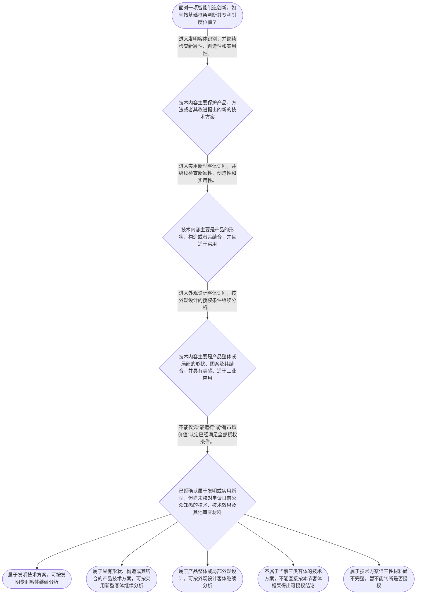

# 专家 B 教学草稿

> 专家：expert_b ｜ 风格：accessible

## 教学模块选择清单

- 当前教学节点：`patent-law-foundation`
- 板块预算：自适应 7/7，总计 9/9

| # | 模块 (block_type) | 类型 | 触发原因 (trigger) | 对应正文段 | 归属 |
|---:|---|:--:|---|---|:--:|
| 1 | `anchor_scenario` | 自适应 | perception=sensing(0.78) / cold_start | 从一条智能装配线看专利制度｜某智能制造企业研发了一条机器人装配线：机械臂负责抓取，视觉相机负责定位，控制软件根据定位结果… | [B] |
| 2 | `legal_anchor` | 必选 | mandatory | 先看法条：保护对象与授权门槛｜《专利法》第二条 | [B] |
| 3 | `worked_example` | 自适应 | cold_start(low_confidence) | 把法条套进智能分拣方案｜某智能工厂设计了一套“视觉定位加机械臂路径控制”的自动分拣方案。方案既包括相机获取位置数据的… | [B] |
| 4 | `decision_flow` | 自适应 | input=visual(0.74) | 专利制度基础判断流程｜面对一项智能制造创新，如何按基础框架判断其专利制度位置？ | [B] |
| 5 | `mnemonic` | 自适应 | understanding=sequential(0.68) | 客体、类型、三性、证据｜基础判断四步表：先看“客体”，再看“类型”，接着看“三性”，最后查“证据”。 | [B] |
| 6 | `reflect_prompt` | 自适应 | processing=reflective(0.62) | 把工程分析迁移到专利判断｜回想你熟悉的一项智能制造技术：如果把它申请专利，你会如何区分“技术方案本身”“拟保护的客体”… | [B] |
| 7 | `assessment` | 必选 | mandatory | 三类测评｜识别专利保护的三种客体。 | [B] |
| 8 | `knowledge_synthesis` | 必选 | mandatory | 专利法律制度基础知识网｜专利制度基本特征：专利权具有独占性、时间性和地域性，权利不是永久且全球自动生效。 | [B] |
| 9 | `summary_card` | 自适应 | len(knowledge_sub_nodes)=3>=3 | 专利制度基础速查卡｜先认清保护什么，再按专利类型检查授权条件，并用申请日前的公开证据验证结论。 | [B] |

## 教学正文

## 1. 场景导入

想象一条智能工厂产线：机械臂抓取零件，视觉相机识别位置，控制软件根据识别结果实时调整路径。研发团队准备申请专利时，至少会遇到三类基础问题：申请的到底是方法、设备结构，还是产品外观？专利授权后是否可以永久、全球禁止他人使用？一项技术能运行、能赚钱，是否就一定能获得专利？这些问题要先用专利制度基础框架定位，之后才能进入新颖性和侵权判定。

## 2. 人话解释

可以把专利制度理解为一套有边界的技术交换机制：研发者公开技术方案，法律在一定时间和地域内给予专利权人排他性保护。排他性不等于永久性，也不等于在全世界自动生效；时间、地域和授权范围都有限制。

先看“保护什么”。发明通常面向产品、方法或者其改进提出的新的技术方案；实用新型面向产品的形状、构造或者其结合；外观设计面向产品整体或局部的形状、图案及其结合等外观。智能产线的控制方法、机械臂结构和设备外观，可能对应不同的保护客体，不能因为它们都出现在同一项目中，就把它们当成同一种专利。

再看“能不能授权”。发明和实用新型要同时经过新颖性、创造性和实用性这三道门。新颖性关注申请日前是否已有公众可知的相关技术；创造性不是简单重复“有没有公开”，还要评价相对于现有技术是否具有相应的实质性特点和进步；实用性关注能否制造或使用并产生积极效果。三者是不同问题，不能用“有市场”代替新颖性，也不能用“没有完全相同方案”直接推出创造性。

## 3. 法条回扣

《专利法》第二条规定，发明是“对产品、方法或者其改进所提出的新的技术方案”，实用新型是“对产品的形状、构造或者其结合所提出的适于实用的新的技术方案”，外观设计则针对产品整体或局部的形状、图案及其结合等外观。〔RAG: 中华人民共和国专利法.txt — 第二条：发明、实用新型和外观设计的定义〕

《专利法》第二十二条规定，授予发明和实用新型应当具备新颖性、创造性和实用性；其中，新颖性要求该发明或者实用新型不属于现有技术，现有技术是申请日前在国内外为公众所知的技术。〔RAG: 中华人民共和国专利法.txt — 第二十二条：新颖性、创造性、实用性及现有技术定义〕

本轮检索材料主要覆盖第二条和第二十二条，足以建立客体、三性和现有技术的基础框架，但不足以支持具体智能制造真实案件的案号、裁判结论或完整侵权分析。因此，下面的产线情境是教学示例，不是真实案例。

## 4. 类比 / 口诀

记忆顺序是“客体—类型—三性—证据”：先问保护的是什么，再区分发明、实用新型或外观设计；接着检查适用的授权条件，最后回到申请日前公开资料等证据。这个口诀只用于安排分析顺序，不是法律条文，也不能代替对权利要求、说明书和具体证据的审查。

还要记住一个边界：新颖性、创造性、实用性不是同义词。可以把它们分别记成“没被现有技术覆盖”“不是相对于现有技术显而易见”“能够制造或使用并产生积极效果”，但具体结论仍须结合适用法条和事实材料。

## 5. 应试提示

看到题干中的“产品结构、控制方法、外观造型”，先做客体分类；看到“申请日前、公众知悉、公开技术”，重点联想到现有技术和新颖性；看到“实质性特点、进步、显而易见”，再分析创造性；看到“能够制造或使用、产生积极效果”，才进入实用性。判断时不要把“技术先进”“已经量产”“有商业价值”直接当成三性全部成立的证明。

处理智能制造案例时，可以按四步写在草稿纸上：第一步圈出技术对象，第二步确定专利类型，第三步列出对应授权条件，第四步核对时间点和证据。新颖性与侵权判定属于后续节点，本节只建立进入这些问题所需的基础坐标。

本节设有测评，请到【习题】区作答。

## 6. 互动提问

回想一项你熟悉的智能制造技术，先不急着判断能否授权，只把其中的产品结构、控制方法、产品外观和能够支持判断的公开资料分别列出来，再按照“客体—类型—三性—证据”的顺序检查。

### 从一条智能装配线看专利制度（anchor_scenario）

> 某智能制造企业研发了一条机器人装配线：机械臂负责抓取，视觉相机负责定位，控制软件根据定位结果调整抓取路径。研发负责人准备申请专利，但团队成员提出了三个不同问题：这套方案属于哪一种专利保护客体？专利权是不是一经授权就能永久、全球禁止他人使用？如果后来发现同类技术已经公开，应该从哪个授权条件开始分析？本节先建立这些问题背后的专利制度基础，不提前展开新颖性或侵权的完整判定。

**锚定**：用智能制造研发场景锚定专利客体、专利权特征、授权条件和制度功能四个基础概念。

**先想一想**：在看到“机器人、相机、控制软件”这些技术事实后，你会先判断保护对象、权利范围，还是技术是否已经公开？请先说出你的判断顺序。

### 先看法条：保护对象与授权门槛（legal_anchor）

- **《专利法》第二条**：发明是对产品、方法或者其改进提出的新的技术方案；实用新型限于产品的形状、构造或者其结合，并且应当适于实用；外观设计针对产品的整体或局部外观，并要求富有美感、适于工业应用。
- **《专利法》第二十二条**：发明和实用新型获得专利权要满足新颖性、创造性和实用性；现有技术是申请日前在国内外为公众所知的技术。

**为何重要**：第二条解决“保护什么”的问题，第二十二条解决“什么条件下可以授权”的问题。后续学习新颖性和侵权判定时，必须先分清保护客体、授权门槛与保护范围。

### 把法条套进智能分拣方案（worked_example）

**案情/例题**：某智能工厂设计了一套“视觉定位加机械臂路径控制”的自动分拣方案。方案既包括相机获取位置数据的方法，也包括机械臂、传送带和控制器之间的协同关系。项目经理想判断：这是不是专利法意义上的发明创造？如果是，是否已经当然能够获得专利权？
**适用规则**：《专利法》第二条、第二十二条：先识别发明创造类型，再检查发明或实用新型的授权三性。
**分步推演**：
1. 先看技术内容是否属于对产品、方法或者其改进提出的技术方案。相机获取位置数据与控制机械臂调整路径，描述的是技术手段及其组合，而不是单纯的经营规则或抽象想法。 → *先确认是否落入技术方案的识别范围。*
2. 再按保护对象区分类型：如果权利要求保护的是控制方法，可以围绕发明进行分析；如果保护的是具有形状、构造或其结合的产品，应考虑实用新型的客体边界；外观设计则关注产品外观而非内部控制逻辑。 → *保护客体不同，后续审查路径也不同。*
3. 即使方案能够制造并改善分拣效率，也只能说明可能与实用性有关。发明和实用新型仍须同时满足新颖性、创造性和实用性，不能用“有效果”替代全部三性判断。 → *实用性不能替代新颖性和创造性。*
4. 本例没有提供申请日以前的公开资料，因此不能据此断言新颖性结论；同样，也没有足够资料评价创造性。应把事实识别和证据审查分开。 → *证据不足时明确结论边界。*
**结论**：该方案首先应按其技术内容判断为涉及产品、方法或其改进的技术方案；至于能否获得专利权，还必须继续分别检查新颖性、创造性和实用性，不能仅因技术已经实现或具有商业价值就直接得出授权结论。
**本题要点**：处理智能制造专利问题时，按“技术方案类型—保护客体—三性条件—证据边界”的顺序推进。

### 专利制度基础判断流程（decision_flow）

**决策问题**：面对一项智能制造创新，如何按基础框架判断其专利制度位置？



### 客体、类型、三性、证据（mnemonic）

**记忆锚**：基础判断四步表：先看“客体”，再看“类型”，接着看“三性”，最后查“证据”。
**映射**：
- 客体
- 类型
- 三性
- 证据
**何时用**：看到智能制造研发方案、专利申请基础题或授权条件题时，按“客体—类型—三性—证据”依次检查；该记忆表只帮助排序，不能替代具体法条和完整审查。

### 把工程分析迁移到专利判断（reflect_prompt）

**反思问题**：回想你熟悉的一项智能制造技术：如果把它申请专利，你会如何区分“技术方案本身”“拟保护的客体”和“证明满足授权条件的证据”？

**关注要点**：技术方案是否具体到产品、方法或产品外观，而不是只停留在功能目标；发明、实用新型和外观设计保护对象的差异；新颖性、创造性、实用性不是同一个判断问题；申请日前公开资料对后续判断的重要性

**连接**：连接到研发中常用的“先定义对象、再设定指标、最后验证数据”的工程分析习惯。

### 专利法律制度基础知识网（knowledge_synthesis）

**知识框架**：
- 专利制度基本特征：专利权具有独占性、时间性和地域性，权利不是永久且全球自动生效。
- 中国专利制度体系：专利法、专利法实施细则和专利审查指南共同构成理解申请、审查和保护问题的规范资料体系。
- 专利保护客体：发明保护产品、方法或者其改进提出的新的技术方案；实用新型保护产品的形状、构造或者其结合；外观设计保护产品整体或局部的外观设计。
- 专利制度作用：通过授予一定期限的权利激励发明创造，同时以公开技术促进技术应用和经济发展。
- 制度运行特点：中国专利制度包含不同类型专利的审查安排，发明专利通常涉及公开和实质审查，实用新型、外观设计等也有相应的初步审查安排；具体程序应以适用法源为准。
**概念关系**：先识别保护客体，再确定专利类型；类型确定后，才能选择相应的授权条件和保护范围分析入口。；专利制度以一定期限和地域内的权利换取技术公开，因此独占性不能脱离时间性、地域性理解。；发明和实用新型的三性判断是后续学习新颖性、创造性和实用性的基础；本节只建立入口，不提前完成这些后续节点。
**必记**：发明、实用新型、外观设计保护的对象不同，不能把产品结构、控制方法和产品外观混为一谈。；专利权具有独占性、时间性和地域性；授权不等于永久、全球自动禁止他人实施。；发明和实用新型应当具备新颖性、创造性和实用性；现有技术以申请日前在国内外为公众所知的技术为判断基础。

### 专利制度基础速查卡（summary_card）

**要点卡**：
- **专利权特征**：独占性、时间性、地域性三者要一起看。
- **制度体系**：专利法、实施细则、审查指南分别提供基础规则、程序细化和审查操作依据。
- **三种客体**：发明看产品或方法技术方案，实用新型看产品形状构造，外观设计看产品整体或局部外观。
- **授权三性**：发明和实用新型要同时满足新颖性、创造性和实用性。
- **现有技术**：原则上看申请日前在国内外为公众所知的技术。
**必背**：专利保护客体分为发明、实用新型和外观设计。；发明和实用新型的授权条件包括新颖性、创造性和实用性。；专利权的基本特征是独占性、时间性和地域性。；判断专利问题先分客体和类型，再看授权条件与证据。
**一句话总结**：先认清保护什么，再按专利类型检查授权条件，并用申请日前的公开证据验证结论。

### 三类测评（assessment）

**三类覆盖**：backward_review、forward_probe、weakness_probe
**题目**：
- q-foundation-1：识别专利保护的三种客体。
- q-forward-1：探测专利授权基础条件与保护框架。
- q-weakness-1：区分新颖性、创造性与实用性的判断标准。


## 结构化字段

## knowledge_points

```json
[
  {
    "node_id": "patent-law-foundation",
    "kc_name": "专利制度的基本概念与特征：独占性、时间性、地域性"
  },
  {
    "node_id": "patent-law-foundation",
    "kc_name": "中国专利制度体系：专利法、专利法实施细则、专利审查指南"
  },
  {
    "node_id": "patent-law-foundation",
    "kc_name": "专利保护的三种客体：发明、实用新型、外观设计"
  },
  {
    "node_id": "patent-law-foundation",
    "kc_name": "专利制度的作用：激励发明创造、促进技术公开、推动技术应用和经济发展"
  },
  {
    "node_id": "patent-law-foundation",
    "kc_name": "中国专利制度发展历程与特点：早期公开延迟审查、初步审查制与实质审查制并存"
  }
]
```

## legal_basis

```json
[
  {
    "article": "《专利法》第二条",
    "source": "中华人民共和国专利法.txt：第二条"
  },
  {
    "article": "《专利法》第二十二条",
    "source": "中华人民共和国专利法.txt：第二十二条"
  }
]
```

## risks

```json
[
  {
    "risk": "可能把专利授权理解为永久、全球有效的绝对垄断，忽略时间性和地域性。",
    "related_node_id": "patent-rights-nature"
  },
  {
    "risk": "可能把智能制造中的控制方法、产品结构和产品外观混同，导致专利客体识别错误。",
    "related_node_id": "patent-law-foundation"
  },
  {
    "risk": "可能把“技术能运行或有商业价值”直接等同于满足新颖性、创造性和实用性。",
    "related_node_id": "patent-law-foundation"
  },
  {
    "risk": "关于制度发展历程和具体审查程序，本轮检索材料不足，不能据此扩展或断言具体年份、程序细节。",
    "related_node_id": "patent-system-overview"
  }
]
```

## draft_stage

```json
"debate"
```

## interactive_questions

```json
[
  {
    "qid": "q-foundation-1",
    "category": "remember",
    "difficulty": "L1",
    "source_tag": "backward_review",
    "kc_node_id": "patent-law-foundation",
    "question": "根据《专利法》第二条，下列哪一组属于专利保护的三种客体？",
    "answer": "B",
    "options": [
      "A. 机器人装配线的商业模式、企业名称和销售渠道",
      "B. 发明、实用新型和外观设计",
      "C. 新颖性、创造性和实用性",
      "D. 专利法、实施细则和审查指南"
    ]
  },
  {
    "qid": "q-forward-1",
    "category": "remember",
    "difficulty": "L1",
    "source_tag": "forward_probe",
    "kc_node_id": "patent-rights-protection",
    "question": "关于专利权保护基础，下列哪项表述正确？",
    "answer": "C",
    "options": [
      "A. 获得授权后即可永久禁止全球任何人实施",
      "B. 只有外观设计需要满足法定授权条件",
      "C. 发明和实用新型的授权基础包括新颖性、创造性和实用性",
      "D. 只要技术能够商业化，就当然取得专利权"
    ]
  },
  {
    "qid": "q-weakness-1",
    "category": "analyze",
    "difficulty": "L3",
    "source_tag": "weakness_probe",
    "kc_node_id": "patent-law-foundation",
    "question": "某智能制造公司提出一种机器人视觉检测方法。甲认为“只要现有技术中没有完全相同的方案，就一定具备创造性”；乙认为“新颖性和创造性都只看技术是否有用”。下列判断正确的是：",
    "answer": "D",
    "options": [
      "A. 甲正确，因为没有完全相同方案就当然具备创造性",
      "B. 乙正确，因为新颖性和创造性都只判断技术是否有用",
      "C. 甲、乙都正确，因为三性是同一个判断标准的不同名称",
      "D. 甲、乙都不正确，新颖性、创造性和实用性分别对应不同判断问题"
    ]
  }
]
```

## knowledge_synthesis

```json
{
  "node": "patent-law-foundation",
  "coverage": [
    {
      "node_id": "patent-rights-nature"
    },
    {
      "node_id": "patent-law-framework"
    },
    {
      "node_id": "patent-law-foundation"
    },
    {
      "node_id": "patent-system-overview"
    },
    {
      "node_id": "patent-system-overview"
    }
  ],
  "confusable_pairs": [
    {
      "pair": "新颖性与创造性：新颖性主要判断是否属于现有技术，创造性还要评价相对于现有技术是否具有相应的实质性特点和进步。"
    },
    {
      "pair": "发明与实用新型：发明可以涉及产品、方法或者其改进，实用新型限于产品的形状、构造或者其结合。"
    },
    {
      "pair": "专利客体与授权条件：先判断保护对象属于哪类客体，再判断是否满足相应授权条件。"
    }
  ]
}
```
