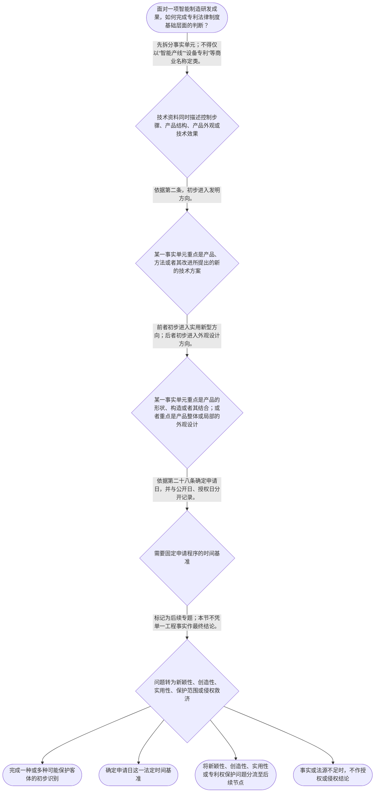

# 整合后的课程完整内容与习题

## 教学模块选择清单

- 当前教学节点：`patent-law-foundation`
- 板块预算：自适应 5/6，总计 9/9

| # | 模块 (block_type) | 类型 | 触发原因 (trigger) | 对应正文段 | 归属 |
|---:|---|:--:|---|---|:--:|
| 1 | `anchor_scenario` | 自适应 | perception=sensing(0.78) / cold_start | 从一条智能产线看专利制度入口｜某智能制造企业的研发负责人准备在行业展会上展示一条电池视觉检测产线。该产线包含：根据图像结果… | [A+B融合] |
| 2 | `legal_anchor` | 必选 | mandatory | 专利制度基础法条锚点｜《专利法》第二条 | [A] |
| 3 | `worked_example` | 自适应 | cold_start(low_confidence) | 智能制造产线的基础判断链｜某企业拟在展会前向国务院专利行政部门提交申请：甲为根据视觉识别结果自动调整机械臂动作顺序的控… | [A+B融合] |
| 4 | `decision_flow` | 自适应 | input=visual(0.74) | 专利制度基础判断流程｜面对一项智能制造研发成果，如何完成专利法律制度基础层面的判断？ | [A+B融合] |
| 5 | `mnemonic` | 自适应 | understanding=sequential(0.68) | “分—识—定—接”基础四步表｜基础判断四步表：“分—识—定—接”。 | [A+B融合] |
| 6 | `reflect_prompt` | 自适应 | processing=reflective(0.62) | 把工程描述改写为法律事实｜回想一个熟悉的智能制造项目：其中哪些描述属于方法、产品结构或产品外观？若项目准备对外展示，你… | [B] |
| 7 | `assessment` | 必选 | mandatory | 专利制度基础测评｜识别发明、实用新型和外观设计三类法定客体。 | [A+B融合] |
| 8 | `knowledge_synthesis` | 必选 | mandatory | 专利法律制度基础知识网络｜基本概念与特征：专利权是依法产生且受边界限制的权利；独占性、时间性、地域性是理解边界的基础标… | [A+B融合] |
| 9 | `summary_card` | 自适应 | len(knowledge_sub_nodes)=3>=3 | 专利制度基础速查卡｜先拆分事实、识别客体、确定申请日，再把实体授权和权利保护问题交给后续规则。 | [A+B融合] |

## 教学正文

# 专利法律制度基础：先把智能制造成果放进正确的法律框

## 一、场景：一条产线，不是一个法律对象

设想研发团队准备展示一条电池视觉检测产线：视觉算法会根据缺陷图像调整机械臂动作；夹具具有可快速更换的连接构造；设备壳体还使用了特定图案、色彩和局部轮廓。团队习惯把它们统称为“产线专利”。但专利制度的第一步不是判断这条产线“先进不先进”，更不是直接判断“是否侵权”，而是把其中不同性质的成果拆开。

本节只建立专利法律制度基础：认识专利制度的三类保护客体、制度体系、申请日和权利边界的基础标签，并为后续的新颖性判断与专利权保护学习搭好入口。检索上下文未提供可核验的智能制造真实裁判文书，因此本节场景均为教学情境，不作真实案件结论。

## 二、三类保护客体：先问“保护的是什么”

《专利法》将“发明创造”分为发明、实用新型和外观设计。发明是对产品、方法或者其改进所提出的新的技术方案；实用新型是对产品的形状、构造或者其结合所提出的适于实用的新的技术方案；外观设计是对产品整体或者局部的形状、图案或者其结合，以及色彩与形状、图案的结合所作出的富有美感并适于工业应用的新设计。〔RAG: 中华人民共和国专利法.txt — 第二条：本法所称的发明创造是指发明、实用新型和外观设计；分别界定三类对象〕

所以，在前述产线中，控制步骤和方法逻辑可先从发明方向分析；夹具的形状、构造或其结合可先从实用新型方向分析；设备壳体的图案、色彩和局部轮廓可先从外观设计方向分析。这是“初步入口识别”，不是最终的授权结论。技术效果良好、设备已经稳定运行、企业投入很多研发成本，都是需要记录的工程事实，但不能替代对法律对象的识别。

一个实用的判断顺序是“分—识—定—接”：先**分**拆事实，再**识**别客体，继而**定**申请日，最后把尚未解决的实体条件或权利保护问题**接**入后续专题。这个记忆表只是整理工具，不是法条，也不能直接得出某项申请必然授权或某行为必然侵权的结论。

## 三、制度体系：谁受理审查，哪些规则分层适用

《专利法》第三条规定，国务院专利行政部门负责管理全国的专利工作，统一受理和审查专利申请，依法授予专利权。〔RAG: 中华人民共和国专利法.txt — 第三条：统一受理和审查专利申请，依法授予专利权〕这说明提交申请、接受审查和最终依法授予专利权，是制度运行中的不同环节；“已经提交”或“已经受理”不等于当然取得专利权。

中国专利制度以《专利法》为基本规则，专利法实施细则提供程序层面的具体规定。已检索的实施细则材料显示，国务院专利行政部门对相关申请进行初步审查后，除驳回外应予公布；发明专利申请人还可以提出延迟审查请求。〔RAG: 中华人民共和国专利法实施细则.txt — 初步审查后公布；第五十六条：发明专利申请人可以提出延迟审查请求〕这有助于理解“初步审查”“公布”“实质审查”和“延迟审查”是程序主题，不能与实体授权条件混为一谈。

本节点知识图还提示早期公开、延迟审查、初步审查制与实质审查制并存等制度发展和程序特点。对其中“初步审查后公布”和“可以提出延迟审查请求”，本节已有上述检索依据；但检索上下文未提供完整的制度沿革材料，不能据此扩展为具体历史断言。专利审查指南也是学习体系中的重要材料，但本轮检索未提供其规范定位的直接原文，不将其说成法律解释。

## 四、申请日：后续判断的重要时间坐标

《专利法》第二十八条规定，国务院专利行政部门收到专利申请文件之日为申请日；申请文件通过邮寄提交的，以寄出邮戳日为申请日。〔RAG: 中华人民共和国专利法.txt — 第二十八条：收到专利申请文件之日为申请日；邮寄的以寄出邮戳日为申请日〕

申请日必须与公开日、授权日分开。对于计划在展会、发布会或技术交流中展示智能制造成果的团队，至少应先把提交方式、提交日期、计划公开日期和实际公开事实分别记录。这样做并非在本节直接判断公开是否破坏新颖性，而是为后续规则提供可靠的时间事实。

后续新颖性专题中，《专利法》第二十二条会成为核心规则：发明和实用新型应具备新颖性、创造性和实用性；现有技术是申请日以前在国内外为公众所知的技术。〔RAG: 中华人民共和国专利法.txt — 第二十二条：授权条件包括新颖性、创造性和实用性；现有技术是申请日以前在国内外为公众所知的技术〕检索材料还说明，使用公开以公众能够得知产品或方法之日为公开日，口头交谈、报告、讨论会发言等能够使公众得知技术内容的方式也可能构成公开。〔RAG: 专利法律知识详细解读.txt — 使用公开以公众能够得知之日为公开日；口头交谈、报告、讨论会发言等可使公众得知技术内容〕这些规则属于后续新颖性节点的具体判断内容；本节只需记住，申请和公开安排具有重要时间意义。

## 五、权利边界与制度作用：不要把专利理解成无限控制权

独占性、时间性和地域性可以作为理解专利权边界的三个基础标签：专利权是在法律规定的范围内形成的权利，不是对“智能产线”这一商业名称的当然垄断；它不应被理解为无限期、在所有国家或地区自动有效。具体期限、地域效力、保护范围和法定例外，必须在后续专利权保护节点依据相应法源和具体专利文本判断。

专利制度的作用可概括为：通过技术公开与法定保护相结合，激励发明创造、促进技术应用并推动经济发展。这里的“公开与保护相结合”是帮助理解制度功能的教学表达，不表示任何公开都会获得保护，也不表示每一项申请都会被授权。检索上下文未提供关于制度作用的完整直接条文原文，因此本段仅作制度性概括。

在后续侵权判定中，不能仅凭“竞争产品很像”或“使用了类似技术效果”下结论。检索材料指出，发明和实用新型专利权的保护范围以权利要求内容为准，说明书及附图可以用于解释权利要求。〔RAG: 专利法律知识详细解读.txt — 发明或者实用新型专利权的保护范围以其权利要求的内容为准，说明书及附图可以用于解释权利要求〕这正是为什么本节先训练客体识别和制度边界，而把具体侵权判定留给后续节点。

## 六、完整示范：从产线事实走到学习分流

回到电池视觉检测产线。第一步，把控制方法、夹具构造、壳体外观分开记录；不能把“整条产线”作为唯一法律对象。第二步，依第二条分别寻找发明、实用新型和外观设计的初步入口。第三步，依第二十八条确定申请日，并把申请日、展会公开日和授权日分别记录。第四步，把“是否具有新颖性、创造性、实用性”“最终能否授权”“权利要求保护到哪里”“竞争对手行为是否侵权”等问题移交给后续专题。

这种分流并不是回避问题，而是防止概念混淆：客体分类回答“先从哪里进入分析”；新颖性等实体条件回答“是否符合授权门槛”；权利要求和实施行为比对回答“是否涉及侵权”。三者有联系，但不是同一个问题。

## 七、本节收束

请记住一句主线：**先拆分事实并识别客体，再确定申请日；实体授权和专利权保护问题进入后续规则。**

本节设有测评，请到【习题】区作答。

### 从一条智能产线看专利制度入口（anchor_scenario）

> 某智能制造企业的研发负责人准备在行业展会上展示一条电池视觉检测产线。该产线包含：根据图像结果调整机械臂动作的控制方法、可快速更换的夹具连接构造，以及带有特定图案和色彩组合的设备壳体。团队把全部成果统称为“产线专利”，并询问展示前是否应申请、三部分是否属于同一种专利、未来是否可以据此直接阻止竞争对手。

这里同时出现了成果分类、申请时间与后续权利保护三个层次的问题。当前没有检索到可核验的智能制造真实裁判文书；本场景仅用于演示制度入口，不能代替对真实项目的授权或侵权结论。

**锚定**：该情境将三种保护客体、申请日、专利权边界和后续新颖性、侵权专题的学习边界连接起来。

**先想一想**：面对同一条产线中的控制方法、夹具构造和壳体外观，你会先按商业名称整体判断，还是先拆分为不同法律对象？为什么？

### 专利制度基础法条锚点（legal_anchor）

- **《专利法》第二条**：发明创造分为发明、实用新型和外观设计；三者分别对应产品或方法技术方案、产品形状构造技术方案和产品外观设计。
- **《专利法》第三条**：国务院专利行政部门负责管理全国专利工作，统一受理、审查专利申请并依法授予专利权。
- **《专利法》第二十二条**：发明和实用新型授权须具备新颖性、创造性和实用性；现有技术是申请日前在国内外为公众所知的技术。
- **《专利法》第二十八条**：申请日原则上是国务院专利行政部门收到申请文件之日；邮寄申请以寄出邮戳日为申请日。
- **《专利法实施细则》第五十六条**：发明专利申请人在法定阶段可以提出延迟审查请求，表明程序安排与实体授权判断应予区分。

**为何重要**：第二条解决“保护什么”的入口问题，第二十八条固定重要时间基准，第二十二条为后续新颖性学习预留实体审查接口。第三条和实施细则材料帮助区分受理审查程序与当然授权。

### 智能制造产线的基础判断链（worked_example）

**案情/例题**：某企业拟在展会前向国务院专利行政部门提交申请：甲为根据视觉识别结果自动调整机械臂动作顺序的控制方法；乙为夹具的特定形状与连接构造；丙为设备壳体的图案、色彩和局部轮廓设计。企业需要完成专利制度基础层面的整理：三项成果各从何种客体入口分析，申请时间应如何记录，哪些问题必须留待后续专题？
**适用规则**：适用《专利法》第二条、第二十二条、第二十八条及第三条；程序补充参照《专利法实施细则》第五十六条。
**分步推演**：
1. 先把“整条产线”这一商业称呼拆开。甲描述控制步骤，乙描述产品的形状和构造，丙描述产品外观；三者的法律对象并不相同。 → *第一步：拆分方法、产品结构和产品外观。*
2. 依第二条对照：产品、方法或者其改进提出的新的技术方案是发明的定义入口；产品形状、构造或者其结合提出的适于实用的新的技术方案是实用新型的定义入口；产品整体或局部外观的形状、图案及色彩结合等新设计是外观设计的定义入口。 → *第二步：按法律对象初步识别可能客体。*
3. 团队应记录国务院专利行政部门收到申请文件的日期；若为邮寄申请，则记录寄出邮戳日。该申请日不同于展会公开日和授权日。 → *第三步：依第二十八条确定申请日。*
4. 第二十二条中的新颖性、创造性和实用性属于发明、实用新型的后续实体条件。受理、审查或提交延迟审查请求均不能替代实体条件审查；保护范围和侵权问题也属于后续节点。 → *第四步：区分客体入口、程序节点、授权条件和权利保护。*
**结论**：该项目的控制方法可先从发明方向分析，夹具连接构造可先从实用新型方向分析，壳体的图案、色彩和局部轮廓可先从外观设计方向分析。申请日应依第二十八条确定；分类和提交并不等于已经满足新颖性等授权条件，也不等于已经形成可直接主张的侵权结论。
**本题要点**：复杂智能制造项目先做“拆事实—识客体—定申请日—分流后续问题”，避免把产品名称、申请行为或工程效果直接当作法律结论。

### 专利制度基础判断流程（decision_flow）

**决策问题**：面对一项智能制造研发成果，如何完成专利法律制度基础层面的判断？



### “分—识—定—接”基础四步表（mnemonic）

**记忆锚**：基础判断四步表：“分—识—定—接”。
**映射**：
- 分
- 识
- 定
- 接
**何时用**：阅读智能制造项目说明、展会计划或专利申请题干时，用该表整理当前能回答的问题。该表是学习整理工具，不是法条，也不能直接推出授权或侵权结论。

### 把工程描述改写为法律事实（reflect_prompt）

**反思问题**：回想一个熟悉的智能制造项目：其中哪些描述属于方法、产品结构或产品外观？若项目准备对外展示，你还需要记录哪些日期和事实，才能在后续节点继续判断？

**关注要点**：商业产品名称不能取代《专利法》第二条的客体识别。；申请日、公开日和授权日不是同一时间概念。；技术效果好、已经试制或投入运行，并不自动回答新颖性、授权或侵权问题。；对外公开可能与后续新颖性判断有关；具体公开效果和例外必须依据后续规则及事实材料核验。

**连接**：连接已有研发经验：工程团队常把“能运行、有效果、外观好看”写在同一项目说明中；法律分析需要先把方法、产品结构、外观设计、时间事实和待解决法律问题拆开。

### 专利法律制度基础知识网络（knowledge_synthesis）

**知识框架**：
- 基本概念与特征：专利权是依法产生且受边界限制的权利；独占性、时间性、地域性是理解边界的基础标签，具体期限、地域效力和保护范围须查相应法源。
- 制度体系：《专利法》提供基本规则；《专利法实施细则》提供程序层面的具体规定；专利审查指南的具体规范定位和适用范围应以可核验正式材料为准。
- 三种保护客体：第二条将发明创造分为发明、实用新型和外观设计，分类依据是成果的法律对象而非商业名称。
- 制度作用：专利制度以公开技术信息与法定保护相结合，旨在激励发明创造、促进技术应用和经济发展；本轮检索未提供关于该制度作用的完整直接条文原文，故该表述为本节点制度性概括。
- 制度发展与程序特点：学习地图包含早期公开、延迟审查、初步审查制与实质审查制并存等主题；已检索实施细则材料可直接核验发明申请的初步审查后公布及延迟审查请求，但未提供完整制度沿革材料，不能扩展为具体历史断言。
**概念关系**：先识别成果的法律对象，才能进入对应专利类型及其后续实体规则。；申请日是后续新颖性等判断的重要时间基准；公开日和授权日须另行区分。；程序上的受理、公布、审查或延迟审查安排，不等于实体条件已经满足，也不等于已经可以作出侵权结论。
**必记**：《专利法》第二条列明发明、实用新型和外观设计三类发明创造。；同一智能制造产品可能同时含有方法、产品结构和外观设计内容，应分别识别。；第二十八条规定申请日的基本规则；申请日不能与公开日、授权日混同。；新颖性、创造性、实用性和专利权保护属于后续专题，不应由本节的单一工程事实直接决定。

### 专利制度基础速查卡（summary_card）

**要点卡**：
- **保护客体**：先看成果是方法、产品结构还是产品外观，再按第二条初步识别发明、实用新型或外观设计。
- **独占性、时间性、地域性**：它们是理解专利权边界的三个标签；具体效力必须依期限、地域和保护范围等法源判断。
- **制度体系**：专利法是基础规则，实施细则补充程序；审查指南的具体定位须以正式可核验材料为准。
- **制度作用**：专利制度以技术公开与法定保护相结合，服务于激励创造、技术应用和经济发展。
- **申请日**：原则上以国务院专利行政部门收到申请文件之日为申请日；邮寄申请以寄出邮戳日为申请日。
- **程序与实体**：受理或审查不是当然授权；新颖性等实体条件和侵权保护均需进入后续专题。
**必背**：《专利法》第二条的三类保护客体：发明、实用新型、外观设计。；《专利法》第二十八条的申请日基本规则。；同一智能制造产品应先拆分方法、产品结构和产品外观。；申请日、公开日、授权日不能混同；客体初步识别不能代替授权或侵权判断。
**一句话总结**：先拆分事实、识别客体、确定申请日，再把实体授权和权利保护问题交给后续规则。

### 专利制度基础测评（assessment）

**三类覆盖**：backward_review、forward_probe、weakness_probe
**题目**：
- foundation-q1：识别发明、实用新型和外观设计三类法定客体。
- foundation-q2：探测下一节点专利权保护的学习边界。
- foundation-q3：综合识别智能制造方案中的客体入口与申请日。


## 结构化数据

## expert

```json
"A+B融合"
```

## style

```json
"fused"
```

## knowledge_points

```json
[
  {
    "node_id": "patent-law-foundation",
    "kc_name": "专利制度的基本概念与特征：独占性、时间性、地域性"
  },
  {
    "node_id": "patent-law-foundation",
    "kc_name": "中国专利制度体系：专利法、专利法实施细则、专利审查指南"
  },
  {
    "node_id": "patent-law-foundation",
    "kc_name": "专利保护的三种客体：发明、实用新型、外观设计"
  },
  {
    "node_id": "patent-law-foundation",
    "kc_name": "专利制度的作用：激励发明创造、促进技术公开、推动技术应用和经济发展"
  },
  {
    "node_id": "patent-law-foundation",
    "kc_name": "中国专利制度发展历程与特点：早期公开延迟审查、初步审查制与实质审查制并存"
  }
]
```

## legal_basis

```json
[
  {
    "article": "《专利法》第二条",
    "source": "中华人民共和国专利法.txt：第二条规定发明、实用新型和外观设计的定义。"
  },
  {
    "article": "《专利法》第三条",
    "source": "中华人民共和国专利法.txt：第三条规定国务院专利行政部门统一受理和审查专利申请，依法授予专利权。"
  },
  {
    "article": "《专利法》第二十二条",
    "source": "中华人民共和国专利法.txt：第二十二条规定发明和实用新型应具备新颖性、创造性和实用性，并界定现有技术。"
  },
  {
    "article": "《专利法》第二十八条",
    "source": "中华人民共和国专利法.txt：第二十八条规定申请日及邮寄申请的申请日规则。"
  },
  {
    "article": "《专利法实施细则》第五十六条",
    "source": "中华人民共和国专利法实施细则.txt：第五十六条规定发明专利申请人可以提出延迟审查请求。"
  }
]
```

## risks

```json
[
  {
    "risk": "检索上下文未提供独占性、时间性、地域性的完整直接法条原文；本节仅将其作为理解权利法定边界的制度特征，具体期限、地域效力和保护范围须在后续节点依据相应法源核验。",
    "related_node_id": "patent-rights-nature"
  },
  {
    "risk": "检索材料可直接核验实施细则中的初步审查后公布和延迟审查请求，但未提供专利审查指南规范定位及完整制度沿革材料；不得将审查指南表述为法律解释，也不得扩展为具体历史断言。",
    "related_node_id": "patent-law-framework"
  },
  {
    "risk": "检索上下文未提供可核验的智能制造领域真实裁判文书；本课程中的智能制造事实均为教学情境，不构成真实案件、授权意见或侵权结论。",
    "related_node_id": "patent-system-overview"
  },
  {
    "risk": "检索上下文包含新颖性规则和公开方式材料，但新颖性是后续待学节点；本节仅提示申请日和公开安排的重要性，不完成具体新颖性判断。",
    "related_node_id": "novelty"
  },
  {
    "risk": "侵权判定需要后续核验有效专利权、权利要求或外观设计保护范围、被诉实施行为及法定例外等材料；本节不得基于产品相似或技术效果直接作出侵权结论。",
    "related_node_id": "patent-rights-protection"
  }
]
```

## draft_stage

```json
"integration"
```

## irac

```json
{
  "issue": "一项智能制造产品同时包含技术方法、产品结构和外观内容时，如何识别可能的专利保护客体，并在不提前作出新颖性或侵权结论的前提下理解专利制度基础？",
  "rule": "《专利法》第二条规定发明、实用新型和外观设计的定义；第三条规定国务院专利行政部门统一受理和审查专利申请并依法授予专利权；第二十八条规定申请日。第二十二条规定发明和实用新型的授权条件包括新颖性、创造性和实用性，并界定现有技术。实施细则第五十六条规定发明申请人可以提出延迟审查请求。",
  "application": "对智能制造产线，应先把控制方法、夹具构造和壳体外观拆成不同事实单元，再依第二条分别确定可能的客体入口。申请时间应依第二十八条记录申请日，并与公开日、授权日区分。第二十二条提示发明和实用新型仍须满足后续实体条件；行政受理、审查或程序安排不能替代该判断。检索上下文未提供可核验的智能制造真实裁判文书，故不能据教学场景作实际授权或侵权结论。",
  "conclusion": "本节的正确起点是拆分事实、识别可能客体并确定申请日，再转入后续的新颖性、其他实体条件和专利权保护专题。专利权的独占性、时间性、地域性用于理解其法定边界，不应被理解为无限期或全球自动有效的抽象控制权。"
}
```

## interactive_questions

```json
[
  {
    "qid": "foundation-q1",
    "category": "remember",
    "difficulty": "L1",
    "source_tag": "backward_review",
    "kc_node_id": "patent-law-foundation",
    "question": "根据《专利法》第二条，下列哪一组属于发明创造的三种法定类型？",
    "answer": "B",
    "options": [
      "A. 发明、商标、著作权",
      "B. 发明、实用新型、外观设计",
      "C. 实用新型、商标、集成电路布图设计",
      "D. 发明、商业秘密、外观设计"
    ]
  },
  {
    "qid": "foundation-q2",
    "category": "understand",
    "difficulty": "L1",
    "source_tag": "forward_probe",
    "kc_node_id": "patent-rights-protection",
    "question": "关于下一节点“专利权保护”的学习定位，下列哪项正确？",
    "answer": "C",
    "options": [
      "A. 本节已经完成专利权保护具体规则的学习",
      "B. 专利申请提交后当然可以对所有竞争产品主张权利保护",
      "C. 专利权保护是下一待学节点，本节仅建立其学习入口",
      "D. 只要产品外观相似，本节即可作出侵权结论"
    ]
  },
  {
    "qid": "foundation-q3",
    "category": "analyze",
    "difficulty": "L3",
    "source_tag": "weakness_probe",
    "kc_node_id": "patent-law-foundation",
    "question": "某企业拟在展会前提交电池视觉检测产线相关申请，成果包括图像检测方法、可更换夹具结构和设备壳体图案。下列基础处理方式最恰当的是？",
    "answer": "D",
    "options": [
      "A. 将整条产线按商业名称认定为唯一客体，并直接判断能否授权",
      "B. 因设备壳体美观，将方法、结构和壳体全部按外观设计处理",
      "C. 先把展会日期作为申请日，再统一处理所有技术内容",
      "D. 分别识别图像检测方法、夹具结构和壳体外观的可能客体，并依第二十八条另行确定申请日"
    ]
  }
]
```

## knowledge_synthesis

```json
{
  "node": "patent-law-foundation",
  "coverage": [
    {
      "node_id": "patent-law-foundation"
    },
    {
      "node_id": "patent-rights-nature"
    },
    {
      "node_id": "patent-law-framework"
    },
    {
      "node_id": "patent-system-overview"
    }
  ],
  "confusable_pairs": []
}
```

## exercises

```json
[
  {
    "question": "根据《专利法》第二条，下列哪一组属于发明创造的三种法定类型？",
    "answer": "B",
    "options": [
      "A. 发明、商标、著作权",
      "B. 发明、实用新型、外观设计",
      "C. 实用新型、商标、集成电路布图设计",
      "D. 发明、商业秘密、外观设计"
    ]
  },
  {
    "question": "关于下一节点“专利权保护”的学习定位，下列哪项正确？",
    "answer": "C",
    "options": [
      "A. 本节已经完成专利权保护具体规则的学习",
      "B. 专利申请提交后当然可以对所有竞争产品主张权利保护",
      "C. 专利权保护是下一待学节点，本节仅建立其学习入口",
      "D. 只要产品外观相似，本节即可作出侵权结论"
    ]
  },
  {
    "question": "某企业拟在展会前提交电池视觉检测产线相关申请，成果包括图像检测方法、可更换夹具结构和设备壳体图案。下列基础处理方式最恰当的是？",
    "answer": "D",
    "options": [
      "A. 将整条产线按商业名称认定为唯一客体，并直接判断能否授权",
      "B. 因设备壳体美观，将方法、结构和壳体全部按外观设计处理",
      "C. 先把展会日期作为申请日，再统一处理所有技术内容",
      "D. 分别识别图像检测方法、夹具结构和壳体外观的可能客体，并依第二十八条另行确定申请日"
    ]
  }
]
```
