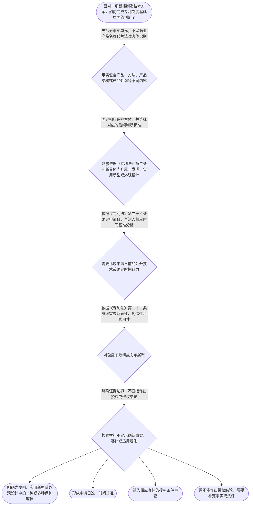

# 专家 A 教学草稿

> 专家：expert_a ｜ 风格：conservative

## 教学模块选择清单

- 当前教学节点：`patent-law-foundation`
- 板块预算：自适应 6/6，总计 9/9

| # | 模块 (block_type) | 类型 | 触发原因 (trigger) | 对应正文段 | 归属 |
|---:|---|:--:|---|---|:--:|
| 1 | `anchor_scenario` | 自适应 | perception=sensing(0.78) / cold_start | 智能制造技术方案的专利边界｜某智能制造企业研发了一套用于汽车焊接产线的机器人控制系统，系统包括机器人本体、控制程序、传感… | [A] |
| 2 | `legal_anchor` | 必选 | mandatory | 专利制度基础法条｜《专利法》第二条 | [A] |
| 3 | `worked_example` | 自适应 | cold_start(low_confidence) | 自动分拣设备的基础判断链｜某智能制造企业开发一套自动分拣设备：设备的机械臂具有特定结构，控制系统采用一种新的分拣方法，… | [A] |
| 4 | `decision_flow` | 自适应 | input=visual(0.74) | 专利基础判断流程｜面对一项智能制造技术方案，如何完成专利制度基础层面的判断？ | [A] |
| 5 | `mnemonic` | 自适应 | understanding=sequential(0.68) | 专利基础四步表｜专利基础四步表：客体“分”、时间“定”、三性“审”、权利“限”。先分保护客体，再定申请日；对… | [A] |
| 6 | `reflect_prompt` | 自适应 | processing=reflective(0.62) | 从研发项目反思保护客体｜在你熟悉的一个智能制造项目中，哪些内容是产品结构，哪些内容是控制方法，哪些内容只是产品外观或… | [A] |
| 7 | `assessment` | 必选 | mandatory | 专利制度基础测评｜判断专利制度基础中三类保护客体的正确对应关系。 | [A] |
| 8 | `knowledge_synthesis` | 必选 | mandatory | 专利制度基础知识网络｜保护客体：专利法第二条将发明创造区分为发明、实用新型和外观设计，智能制造产品可能同时涉及不同… | [A] |
| 9 | `summary_card` | 自适应 | len(knowledge_sub_nodes)=3>=3 | 专利制度基础速查卡｜先按第二条识别客体，再按第二十八条确定时间基准，最后进入相应授权条件和保护边界判断。 | [A] |

## 教学正文

## I — 法律问题

本节的主问题不是直接判断某一项智能制造技术是否侵犯专利权，而是建立后续新颖性和侵权判定所必需的专利制度基础：第一，技术事实属于发明、实用新型还是外观设计；第二，申请日如何确定；第三，识别保护客体后应进入哪些授权条件判断。

对智能制造系统，不能仅以“设备”“产线”或“控制系统”这一商业名称作整体判断。机械结构、控制方法、传感器反馈方案和产品外观可能分别对应不同的法律对象，必须先拆分事实，再逐项适用规则。

## R — 适用规则

《专利法》第二条规定，发明是对产品、方法或者其改进所提出的新的技术方案；实用新型是对产品的形状、构造或者其结合所提出的适于实用的新的技术方案；外观设计是对产品的整体或者局部的形状、图案或者其结合以及色彩与形状、图案的结合所作出的富有美感并适于工业应用的新设计。〔RAG: 中华人民共和国专利法.txt — 第二条：发明、实用新型和外观设计的定义〕

《专利法》第二十二条规定，授予专利权的发明和实用新型应当具备新颖性、创造性和实用性；该条还规定，现有技术是申请日以前在国内外为公众所知的技术。〔RAG: 中华人民共和国专利法.txt — 第二十二条：新颖性、创造性、实用性及现有技术的定义〕

《专利法》第三条规定，国务院专利行政部门负责管理全国的专利工作，统一受理和审查专利申请，依法授予专利权。〔RAG: 中华人民共和国专利法.txt — 第三条：国务院专利行政部门统一受理和审查专利申请并依法授予专利权〕

《专利法》第二十八条规定，国务院专利行政部门收到专利申请文件之日为申请日；申请文件是邮寄的，以寄出的邮戳日为申请日。〔RAG: 中华人民共和国专利法.txt — 第二十八条：收到申请文件之日为申请日，邮寄申请以寄出邮戳日为申请日〕

因此，基础判断应形成四个层次：一是拆分事实，二是识别客体，三是确定申请日，四是适用相应的授权条件。对于发明和实用新型，第二十二条的三性是后续实体审查主线；外观设计不能直接套用发明和实用新型的全部判断表述。

## A — 规则适用

以智能制造自动分拣设备为例，机械臂的特定结构首先应作为产品结构事实分析，控制系统中的新分拣方法应作为方法技术方案分析，外壳的图案和色彩组合则应作为产品外观事实分析。不能因为这些内容共同存在于一台设备中，就把它们自动归并为同一种专利客体。

完成客体拆分后，需要确定申请日。申请日是后续讨论申请日前公开技术的重要时间基准；如果申请文件通过邮寄提交，还要按照第二十八条的邮戳规则确定时间。只有时间基准明确，才能继续进行与现有技术有关的分析。

对于被识别为发明或实用新型的技术方案，还要进入第二十二条的三性判断。新颖性、创造性和实用性是不同的授权条件，不能用“技术效果积极”直接代替新颖性或创造性判断。对外观设计则应围绕其法定保护对象和对应审查标准继续分析。

本节检索上下文未提供具体智能制造领域真实裁判文书，因此不能把上述自动分拣设备情境表述为真实案件，也不能据此作出实际授权或侵权结论。真实案件分析还需要具体专利文本、权利要求、申请日、公开材料和裁判或审查依据。

本节设有测评，请到【习题】区作答。

> 常见误区 / 易混淆点

1. 把商业产品名称当作专利保护客体。正确做法是拆分产品结构、方法和外观等事实内容。
2. 把申请日与公开日、授权日混为一谈。申请日首先是法定的时间基准，需依第二十八条确定。
3. 把新颖性、创造性和实用性当作同一个标准。第二十二条将其列为不同条件，不能相互替代。
4. 把专利申请的受理或审查等同于当然获得专利权。行政机关依法受理和审查，并不意味着每一项申请当然满足授权条件。

### 智能制造技术方案的专利边界（anchor_scenario）

> 某智能制造企业研发了一套用于汽车焊接产线的机器人控制系统，系统包括机器人本体、控制程序、传感器反馈模块和用于调整焊接路径的方法。企业准备申请专利，但团队成员对三个问题存在分歧：这些技术内容分别属于哪一种专利保护客体，专利权是否可以无限期保护，以及一项专利权能否自动在所有国家有效。与此同时，企业还希望了解，申请专利后公开技术究竟如何换取法律保护。

**锚定**：用智能制造技术方案锚定专利保护客体、专利权独占性与专利制度以公开换保护的基本结构。

**先想一想**：面对这套智能制造技术方案，你会先判断其属于哪类保护客体，还是先判断其是否已经公开？请说明你的判断顺序。

### 专利制度基础法条（legal_anchor）

- **《专利法》第二条**：第二条将发明创造分为发明、实用新型和外观设计，并分别界定其保护对象：发明可以是产品、方法或者改进形成的新的技术方案；实用新型针对产品的形状、构造或者其结合；外观设计针对产品的外观设计。
- **《专利法》第二十二条**：第二十二条规定发明和实用新型授权应具备新颖性、创造性和实用性，并将现有技术界定为申请日前在国内外为公众所知的技术。
- **《专利法》第三条**：第三条规定国务院专利行政部门负责管理全国专利工作，统一受理和审查专利申请并依法授予专利权。
- **《专利法》第二十八条**：第二十八条规定国务院专利行政部门收到专利申请文件之日为申请日，邮寄申请以寄出邮戳日为申请日。

**为何重要**：这些条文分别确定保护客体、授权实质条件、制度管理机关和申请日。后续学习新颖性与侵权判定时，保护客体和申请日都是判断的前提。

### 自动分拣设备的基础判断链（worked_example）

**案情/例题**：某智能制造企业开发一套自动分拣设备：设备的机械臂具有特定结构，控制系统采用一种新的分拣方法，设备外壳还具有特定的图案和色彩组合。企业向国务院专利行政部门提交申请。需要依照专利制度基础判断：应先识别哪些法律问题，以及申请日和授权条件分别处于判断链条的什么位置。
**适用规则**：适用《专利法》第二条、第二十二条、第三条和第二十八条。第二条用于识别保护客体，第二十二条用于说明发明和实用新型的授权实质条件，第三条用于确定审查机关，第二十八条用于确定申请日。
**分步推演**：
1. 先把事实拆成机械结构、控制方法和产品外观三个部分。机械结构可能对应产品的形状或构造，控制方法可能对应方法技术方案，外壳图案和色彩组合属于外观表现。是否属于某种专利客体，必须回到第二条的定义，而不能仅按企业内部的产品名称分类。 → *第一步：拆分技术事实并识别可能的专利保护客体。*
2. 再区分申请日与授权条件。申请日解决的是时间基准问题；对于发明和实用新型，第二十二条规定还要审查新颖性、创造性和实用性。申请日确定后，才能准确讨论申请日前公众所知技术等问题。 → *第二步：先固定申请日，再进入授权条件判断。*
3. 国务院专利行政部门负责统一受理和审查专利申请并依法授予专利权，但受理或审查机关的存在不等于具体申请当然满足授权条件。客体识别和三性审查仍需分别完成。 → *第三步：区分行政审查职能与具体授权结论。*
4. 对于同一智能制造产品中并存的机械结构、控制方法和外观设计，应避免把不同客体的判断标准混为一谈。后续讨论新颖性时，必须明确具体权利要求或具体设计所对应的保护客体。 → *第四步：锁定判断对象，避免混合适用标准。*
**结论**：该智能制造方案可能同时包含产品、方法和外观等不同技术或设计内容，不能仅因其属于同一设备就当然作为一个保护客体处理。具体能否获得专利权，还要分别依据相应客体规则和适用的授权条件审查；申请日则以法定方式确定。
**本题要点**：处理复杂技术产品时，按照“拆事实、定客体、定申请日、审授权条件”的顺序建立判断链。

### 专利基础判断流程（decision_flow）

**决策问题**：面对一项智能制造技术方案，如何完成专利制度基础层面的判断？



### 专利基础四步表（mnemonic）

**记忆锚**：专利基础四步表：客体“分”、时间“定”、三性“审”、权利“限”。先分保护客体，再定申请日；对发明和实用新型审三性；最后始终回到法律确定的保护边界。
**映射**：
- 分
- 定
- 审
- 限
**何时用**：分析智能制造设备、控制方法或外观设计时，先按“分—定—审—限”逐格检查，避免直接跳到新颖性或侵权结论。

### 从研发项目反思保护客体（reflect_prompt）

**反思问题**：在你熟悉的一个智能制造项目中，哪些内容是产品结构，哪些内容是控制方法，哪些内容只是产品外观或技术效果描述？

**关注要点**：同一商业产品可以包含不同类型的技术或设计内容；技术效果描述不当然等于独立的专利保护客体；申请日是后续判断申请日前公开技术的重要时间基准；客体识别错误会导致后续新颖性和侵权分析适用标准错误

**连接**：连接到学习者已有的智能制造研发经验，以及后续的专利新颖性和侵权判定节点。

### 专利制度基础知识网络（knowledge_synthesis）

**知识框架**：
- 保护客体：专利法第二条将发明创造区分为发明、实用新型和外观设计，智能制造产品可能同时涉及不同客体。
- 专利制度体系：以专利法为基本法律依据，并结合专利法实施细则和专利审查指南理解申请、审查及具体操作规则。
- 授权实质条件：发明和实用新型应当具备新颖性、创造性和实用性，现有技术以申请日前在国内外为公众所知的技术为时间和公开基准。
- 制度功能：专利制度通过授予法定期限和范围内的专利权，促进发明创造、技术公开、技术应用和经济发展。
- 制度运行特点：国务院专利行政部门统一受理和审查专利申请并依法授予专利权，申请日是后续判断的重要时间基准。
**概念关系**：先识别保护客体，再选择对应的授权和保护规则。；先依据法定方式确定申请日，再讨论申请日前公开技术等时间问题。；发明和实用新型的客体识别完成后，进入新颖性、创造性和实用性审查；新颖性与侵权判定属于后续具体节点，不能在基础节点中混为一谈。
**必记**：发明、实用新型和外观设计的保护对象不同，不能仅按同一商业产品名称判断。；发明和实用新型授权需要同时满足新颖性、创造性和实用性。；申请日是后续判断申请日前公开技术的重要时间基准。

### 专利制度基础速查卡（summary_card）

**要点卡**：
- **保护客体**：发明保护产品、方法或其改进形成的新的技术方案；实用新型主要针对产品形状、构造或其结合；外观设计针对产品外观设计。
- **专利权特征**：专利权具有法定的独占性、时间性和地域性，保护范围和效力不能脱离法律规定。
- **中国专利制度体系**：专利法提供基本规则，实施细则和专利审查指南补充程序与审查操作。
- **授权三性**：发明和实用新型授权要满足新颖性、创造性和实用性，三者不能相互替代。
- **申请日**：原则上以国务院专利行政部门收到申请文件之日为申请日，邮寄申请适用寄出邮戳日规则。
**必背**：《专利法》第二条的三类保护客体及其基本定义；《专利法》第二十二条的三性和现有技术时间基准；《专利法》第二十八条的申请日规则；专利权的独占性、时间性和地域性
**一句话总结**：先按第二条识别客体，再按第二十八条确定时间基准，最后进入相应授权条件和保护边界判断。

### 专利制度基础测评（assessment）

**三类覆盖**：backward_review、forward_probe、weakness_probe
**题目**：
- foundation-q1：判断专利制度基础中三类保护客体的正确对应关系。
- foundation-q2：探测专利权保护的基本效力对象及其判断入口。
- foundation-q3：综合判断智能制造设备中不同内容的客体分类、申请日和授权条件顺序。


## 结构化字段

## knowledge_points

```json
[
  {
    "node_id": "patent-law-foundation",
    "kc_name": "专利制度的基本概念与特征：独占性、时间性、地域性"
  },
  {
    "node_id": "patent-law-foundation",
    "kc_name": "中国专利制度体系：专利法、专利法实施细则、专利审查指南"
  },
  {
    "node_id": "patent-law-foundation",
    "kc_name": "专利保护的三种客体：发明、实用新型、外观设计"
  },
  {
    "node_id": "patent-law-foundation",
    "kc_name": "专利制度的作用：激励发明创造、促进技术公开、推动技术应用和经济发展"
  },
  {
    "node_id": "patent-law-foundation",
    "kc_name": "中国专利制度发展历程与特点：早期公开延迟审查、初步审查制与实质审查制并存"
  }
]
```

## legal_basis

```json
[
  {
    "article": "《专利法》第二条",
    "source": "中华人民共和国专利法.txt：第二条规定发明、实用新型和外观设计的定义"
  },
  {
    "article": "《专利法》第二十二条",
    "source": "中华人民共和国专利法.txt：第二十二条规定三性及现有技术定义"
  },
  {
    "article": "《专利法》第三条",
    "source": "中华人民共和国专利法.txt：第三条规定国务院专利行政部门的职责"
  },
  {
    "article": "《专利法》第二十八条",
    "source": "中华人民共和国专利法.txt：第二十八条规定申请日"
  }
]
```

## risks

```json
[
  {
    "risk": "检索上下文未提供专利权独占性、时间性和地域性的直接法条原文，相关说明属于本节点框架要求，正式引用时应补充对应法源。",
    "related_node_id": "patent-rights-nature"
  },
  {
    "risk": "检索上下文仅提供专利法实施细则关于公开和修改的片段，未完整提供中国专利制度发展历程及早期公开、延迟审查的直接依据，不应将其扩展为具体历史断言。",
    "related_node_id": "patent-law-framework"
  },
  {
    "risk": "未检索到可核验的智能制造领域真实裁判案例，本稿使用的智能制造案情均明确作为教学情境，不作为真实案例或裁判结论。",
    "related_node_id": "patent-system-overview"
  }
]
```

## draft_stage

```json
"debate"
```

## irac

```json
{
  "issue": "智能制造领域的一项复杂技术产品同时包含机械结构、控制方法和外观设计时，如何识别专利保护客体，并确定后续授权判断的基本顺序？",
  "rule": "《专利法》第二条规定发明、实用新型和外观设计的基本定义；第二十二条规定发明和实用新型应具备新颖性、创造性和实用性，并将现有技术界定为申请日前在国内外为公众所知的技术；第三条规定国务院专利行政部门负责统一受理和审查专利申请并依法授予专利权；第二十八条规定国务院专利行政部门收到专利申请文件之日为申请日，邮寄申请以寄出邮戳日为申请日。",
  "application": "对于智能制造设备，应先把机械结构、控制方法和外观设计分别作为事实单元分析。机械结构和控制方法可能对应不同的发明或实用新型技术方案，外观内容则需依据第二条判断是否属于外观设计。确定申请日后，若对象是发明或实用新型，再依据第二十二条判断三性。现有检索材料没有提供该具体企业或案件的真实裁判文书，因此不能据此作出真实案件的授权或侵权结论。",
  "conclusion": "专利制度基础判断的正确顺序是先识别保护客体，再确定申请日，随后针对相应客体适用授权条件。发明、实用新型和外观设计不能混用判断标准；新颖性和侵权判定应在明确具体保护对象及法源后另行分析。"
}
```

## interactive_questions

```json
[
  {
    "qid": "foundation-q1",
    "category": "remember",
    "difficulty": "L1",
    "source_tag": "backward_review",
    "kc_node_id": "patent-law-foundation",
    "question": "根据《专利法》第二条，发明创造包括下列哪三类？",
    "answer": "B",
    "options": [
      "A. 发明、实用新型、商标",
      "B. 发明、实用新型、外观设计",
      "C. 发明、外观设计、著作权",
      "D. 实用新型、商标、外观设计"
    ]
  },
  {
    "qid": "foundation-q2",
    "category": "understand",
    "difficulty": "L1",
    "source_tag": "forward_probe",
    "kc_node_id": "patent-rights-protection",
    "question": "关于下一节点“专利权保护”的基础探测，下列哪项表述正确？",
    "answer": "A",
    "options": [
      "A. 专利权的效力和保护范围需要以具体法律规定及其保护对象为判断入口",
      "B. 只要产品属于智能制造设备，就自动受到全部专利权保护",
      "C. 专利申请提交后即可无期限排他使用全部相关技术",
      "D. 专利制度只保护设备外观，不保护产品或方法技术方案"
    ]
  },
  {
    "qid": "foundation-q3",
    "category": "analyze",
    "difficulty": "L3",
    "source_tag": "weakness_probe",
    "kc_node_id": "patent-law-foundation",
    "question": "某智能制造设备同时包含特定机械结构、新的控制方法以及特殊外观设计。按照专利制度基础的判断顺序，哪项最恰当？",
    "answer": "C",
    "options": [
      "A. 先认定整套设备天然属于一种专利客体，再直接判断是否侵权",
      "B. 只要技术能够产生积极效果，就无需区分保护客体或确定申请日",
      "C. 先拆分机械结构、控制方法和外观内容，依据第二条识别客体，再依第二十八条确定申请日，并对发明和实用新型进入第二十二条的三性审查",
      "D. 先判断企业是否已经获得专利权，再决定申请日和保护客体"
    ]
  }
]
```

## knowledge_synthesis

```json
{
  "node": "patent-law-foundation",
  "coverage": [
    {
      "node_id": "patent-rights-nature"
    },
    {
      "node_id": "patent-law-framework"
    },
    {
      "node_id": "patent-law-foundation"
    },
    {
      "node_id": "patent-system-overview"
    }
  ],
  "confusable_pairs": []
}
```
