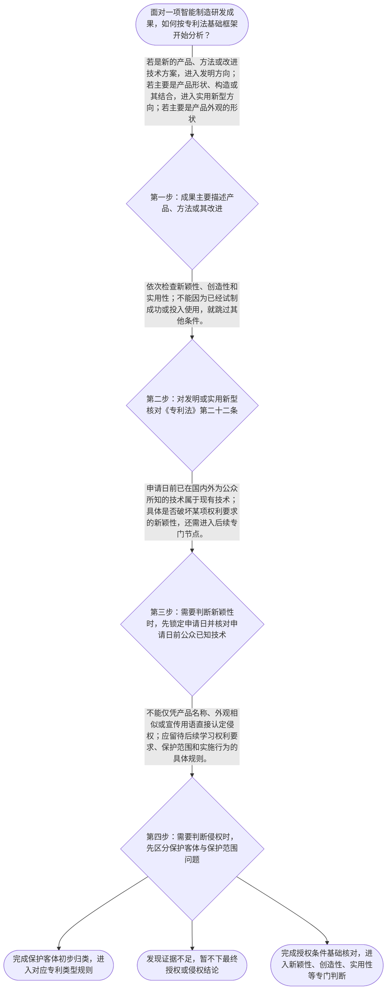

# 专家 B 教学草稿

> 专家：expert_b ｜ 风格：accessible

## 教学模块选择清单

- 当前教学节点：`patent-law-foundation`
- 板块预算：自适应 6/6，总计 8/8

| # | 模块 (block_type) | 类型 | 触发原因 (trigger) | 对应正文段 | 归属 |
|---:|---|:--:|---|---|:--:|
| 1 | `anchor_scenario` | 自适应 | perception=sensing(0.78) / cold_start | 先看见一条智能产线的专利问题｜某智能制造企业研发了一条柔性装配线：机械臂负责抓取，视觉系统负责识别零件，控制程序根据识别结… | [B] |
| 2 | `legal_anchor` | 必选 | mandatory | 先用法条搭底座｜《中华人民共和国专利法》第二条 | [B] |
| 3 | `worked_example` | 自适应 | cold_start(low_confidence) | 把一项产线成果拆成三种法律对象｜某智能制造企业形成三项成果：甲是“根据视觉识别结果自动调整机械臂动作顺序”的控制方法；乙是机… | [B] |
| 4 | `decision_flow` | 自适应 | input=visual(0.74) | 四步专利基础判断流程｜面对一项智能制造研发成果，如何按专利法基础框架开始分析？ | [B] |
| 5 | `mnemonic` | 自适应 | understanding=sequential(0.68) | 对—类—三—范速记表｜基础判断四格表：先看“对象”，再看“类型”，接着看“三性”，最后留“范围”。简称“对—类—三… | [B] |
| 6 | `reflect_prompt` | 自适应 | processing=reflective(0.62) | 把工程描述改写成法律问题｜回想一个你熟悉的智能制造技术方案：如果把它写成专利分析记录，你会先记录哪些事实，才能避免把技… | [B] |
| 7 | `assessment` | 必选 | mandatory | 三类入口测评｜识别专利保护的三种客体 | [B] |
| 8 | `knowledge_synthesis` | 必选 | mandatory | 专利法律制度基础关系网｜专利制度基本概念与特征：专利权是以法律授权为基础的排他性权利，通常具有独占性、时间性和地域性… | [B] |
| 9 | `summary_card` | 自适应 | len(knowledge_sub_nodes)=3>=3 | 专利基础一页速查卡｜先把智能制造成果放进正确的专利客体框，再沿法条分别判断授权条件与后续保护边界。 | [B] |

## 教学正文

## 1. 场景导入

先把自己放进一条智能制造产线：企业研发了视觉识别、机械臂控制和夹具结构，并希望用专利保护成果。此时最容易出现的误区是把所有成果都叫“技术专利”，再用“产品很先进”直接推断可以授权或已经侵权。更稳妥的做法是先拆问题：保护的对象是什么？应进入哪一种专利类型？授权条件是否满足？未来判断侵权时，保护边界又在哪里？

本节只搭建“专利法律制度基础”这张地图；关于新颖性和侵权判定的专门方法，将在相应后续节点展开。本节设有测评，请到【习题】区作答。

## 2. 人话解释

第一，专利制度不是给“所有好点子”发奖，而是把符合条件的技术成果放进法律保护框架。专利权通常可以理解为在一定时间、一定地域内，对特定保护客体享有排他性控制的权利；但这只是制度特征的入门理解，具体期限、地域效力和例外必须继续查对应法源。

第二，专利法先问“你保护的是什么”。如果成果是产品、方法或其改进提出的新的技术方案，通常从发明方向理解；如果重点是产品的形状、构造或其结合，通常从实用新型方向理解；如果重点是产品整体或局部的形状、图案、色彩等外观表达，通常从外观设计方向理解。比如，机器人控制步骤与夹具的连接构造，法律分析入口并不相同。

第三，专利制度的作用可以用一笔交换来理解：研发者公开技术并接受法律条件检验，制度在符合条件时提供一定范围的权利保护，从而鼓励发明创造、促进技术传播和应用。这里的“公开换保护”是制度功能的概括，不意味着公开后必然授权。

## 3. 法条回扣

《专利法》第二条给出三类客体的基本定义：发明是对产品、方法或者其改进所提出的新的技术方案；实用新型是对产品的形状、构造或者其结合所提出的适于实用的新的技术方案；外观设计是对产品的整体或者局部的形状、图案、色彩等作出的富有美感并适于工业应用的新设计。〔RAG: 中华人民共和国专利法.txt — 第二条：发明创造包括发明、实用新型和外观设计，并分别规定三者定义〕

《专利法》第二十二条规定，授予发明和实用新型应当具备新颖性、创造性和实用性；该条还规定，现有技术是申请日以前在国内外为公众所知的技术。〔RAG: 中华人民共和国专利法.txt — 第二十二条：发明和实用新型应具备新颖性、创造性和实用性；现有技术是申请日前在国内外为公众所知的技术〕

把这两条放在一起，就得到基础顺序：先识别保护客体，再核对适用的授权条件。已经在工厂运行，可能帮助说明技术具有可实施性，但不能自动替代新颖性和创造性判断。至于早期公开、延迟审查、初步审查和实质审查等制度历史与程序细节，本次检索上下文没有提供足以逐项核验的原文，因此这里只作学习地图提示，不把它们冒充为本节已核实的具体规则。

## 4. 类比 / 口诀

可以使用“对—类—三—范”四格表：先看保护“对象”，再分专利“类型”，接着核对“三性”，最后进入保护“范围”。“对象”和“类型”帮助处理第二条的分类；“三性”对应第二十二条对发明和实用新型的基础门槛；“范围”只是提醒我们，侵权判断不能停留在“看起来相似”，必须进入后续的权利要求、图片或照片等具体规则。

这个口诀的边界要记清：它是检索和答题顺序，不是法律条文，也不能据此直接得出某项专利一定授权或某个竞争产品一定侵权。

## 5. 应试提示

看到题干中的智能制造技术，按四步处理：一看描述的是方法、产品结构还是产品外观；二按第二条作专利客体初步归类；三对发明和实用新型检查新颖性、创造性、实用性；四遇到“是否侵权”时，先停下来区分它与“能否授权”的问题，等待进入保护范围和实施行为的专门判断。

常见陷阱有三个：把“已经投入使用”当成三性全部满足；把“技术效果好”当成新颖性成立；把“产品外观相似”直接等同于发明专利侵权。题干若问新颖性，还要特别留意申请日和申请日前公众已知技术；若问侵权，则不能只看产品名称或宣传语。

## 6. 互动提问

请先不查资料，任选一个你熟悉的智能制造成果，在纸上画四格：“对象—类型—三性—范围”，分别写下你认为需要核对的事实；然后再回看第二条和第二十二条，比较哪些判断得到了法条支持，哪些仍需后续学习和检索。

### 先看见一条智能产线的专利问题（anchor_scenario）

> 某智能制造企业研发了一条柔性装配线：机械臂负责抓取，视觉系统负责识别零件，控制程序根据识别结果调整装配顺序。研发负责人准备把成果申请专利，同时发现团队讨论过三个问题：这项成果究竟属于发明、实用新型还是外观设计？专利授权后保护的边界在哪里？如果竞争对手采用相似方案，未来又该怎样判断是否侵权？这些问题看似都叫“专利保护”，其实分别对应保护客体、制度效力和后续判断标准。

**锚定**：用同一智能制造研发情境锚定保护客体、专利制度特征及后续新颖性与侵权判断的入口。

**先想一想**：在听规则前，请先想一想：机器人结构、控制方法和设备外观，是否应当用同一种专利类型来保护？

### 先用法条搭底座（legal_anchor）

- **《中华人民共和国专利法》第二条**：专利法把发明创造分为发明、实用新型和外观设计：发明面向产品、方法或改进提出新的技术方案；实用新型主要面向产品的形状、构造或其结合；外观设计面向产品或局部的形状、图案、色彩等形成的富有美感并适于工业应用的新设计。
- **《中华人民共和国专利法》第二十二条**：发明和实用新型要获得专利权，必须具备新颖性、创造性和实用性；其中现有技术是申请日前已经在国内外为公众所知的技术。

**为何重要**：第二条先回答“保护什么”，第二十二条再回答“什么条件下值得授权”。后续学习新颖性和侵权判定时，必须先分清专利类型、申请日前公开事实以及授权条件，不能把不同问题混成一个“像不像”的判断。

### 把一项产线成果拆成三种法律对象（worked_example）

**案情/例题**：某智能制造企业形成三项成果：甲是“根据视觉识别结果自动调整机械臂动作顺序”的控制方法；乙是机械臂末端夹具的特定形状与连接构造；丙是设备面板及外壳的图案、色彩和局部轮廓设计。现在要为三项成果选择基础分析入口，并判断是否可以仅因技术已经投入生产就直接获得专利权。
**适用规则**：《中华人民共和国专利法》第二条规定三类保护客体；《中华人民共和国专利法》第二十二条规定发明和实用新型授权应具备新颖性、创造性和实用性。
**分步推演**：
1. 先看成果的技术表达对象：甲描述的是控制步骤和方法逻辑，乙描述产品的形状、构造及其结合，丙描述产品外观的形状、图案和色彩组合。 → *先按技术事实区分方法、产品结构和产品外观。*
2. 将三项成果分别与第二条的定义对照：甲更接近发明，乙更接近实用新型，丙更接近外观设计；这是保护客体的初步归类，不等于最终授权结论。 → *专利类型取决于成果的法律对象，而不只取决于企业称呼。*
3. 再检查第二十二条的授权门槛。发明和实用新型不能只因为已经在工厂使用就当然满足三性；还要分别核查是否属于现有技术、是否具有创造性以及能否制造或使用并产生积极效果。 → *“已经能用”最多触及实用性，不能替代新颖性和创造性判断。*
4. 丙属于外观设计方向，不能把发明和实用新型的三性表述机械套用到外观设计；外观设计还应沿其专门授权条件继续核查。当前检索材料没有提供完整的外观设计审查规则，因此这里只作入口识别。 → *不同专利客体要进入相应规则，证据不足时不越界下结论。*
**结论**：在这个教学案例中，核心控制方法首先应按“发明”方向识别；但仅凭它属于发明，不能直接推出一定能授权，还要继续核查第二十二条要求的三性。结构方案和外观方案则应分别沿实用新型或外观设计方向进一步审查。
**本题要点**：遇到智能制造成果时，按“先识别客体、再核对法条门槛、最后进入具体判断”三步走。

### 四步专利基础判断流程（decision_flow）

**决策问题**：面对一项智能制造研发成果，如何按专利法基础框架开始分析？



### 对—类—三—范速记表（mnemonic）

**记忆锚**：基础判断四格表：先看“对象”，再看“类型”，接着看“三性”，最后留“范围”。简称“对—类—三—范”。
**映射**：
- 对
- 类
- 三
- 范
**何时用**：看到智能制造项目、专利申请或“是否侵权”的题干时，先在草稿边上写“对—类—三—范”，按顺序定位问题。

### 把工程描述改写成法律问题（reflect_prompt）

**反思问题**：回想一个你熟悉的智能制造技术方案：如果把它写成专利分析记录，你会先记录哪些事实，才能避免把技术效果、专利类型和侵权结论混为一谈？

**关注要点**：技术事实究竟描述方法步骤、产品结构还是外观特征；哪些结论有法条直接支持，哪些只是需要后续检索的推论；“已经投入使用”是否只说明可实施，而不当然解决新颖性和创造性

**连接**：连接到已有的理工研发经验：工程上常把“能运行”“有价值”“结构改进”放在一起描述，法律分析则要求把对象、授权条件和保护范围拆开。

### 专利法律制度基础关系网（knowledge_synthesis）

**知识框架**：
- 专利制度基本概念与特征：专利权是以法律授权为基础的排他性权利，通常具有独占性、时间性和地域性；本次检索上下文未提供三项特征的完整法条原文，具体期限和地域规则需后续核验。
- 中国专利制度体系：以《专利法》为基础，并由专利法实施细则和专利审查指南等规范、解释材料共同支撑；当前检索上下文直接提供了《专利法》原文，未提供后二者的具体条文。
- 三种保护客体：发明、实用新型和外观设计是《专利法》第二条列明的三类发明创造。
- 专利制度作用：通过授予一定范围和期限的法律保护，交换技术公开与应用，服务于发明创造激励和经济发展；这是制度功能概括，当前检索上下文未提供对应原文段落。
- 中国制度程序特点：发明专利通常涉及初步审查与实质审查，实用新型、外观设计适用不同审查安排；本次检索上下文未提供足以逐字核验制度沿革和程序细节的材料。
**概念关系**：先用“对象”识别三类保护客体，再进入相应专利类型的授权条件。；对发明和实用新型，第二十二条提供新颖性、创造性、实用性的基础门槛；其中新颖性判断会进一步连接申请日与现有技术。；授权条件与侵权判断不是同一问题：前者关注能否获得或维持专利权，后者还要比较被控行为与有效保护范围。
**必记**：《专利法》第二条是三类保护客体的入口：发明、实用新型、外观设计。；发明和实用新型的基础授权门槛包括新颖性、创造性和实用性，三者不能用其中一项替代另一项。；“已投入生产”“技术效果明显”或“产品看起来相似”都不能单独推出授权成立或侵权成立。

### 专利基础一页速查卡（summary_card）

**要点卡**：
- **三类保护客体**：发明、实用新型、外观设计对应不同的法律对象，先看技术事实再归类。
- **专利权三项特征**：独占性、时间性、地域性是理解专利权边界的基础标签，具体期限和适用范围要以相应法源为准。
- **授权三性**：发明和实用新型要同时核查新颖性、创造性和实用性，不能只看能否制造或使用。
- **基础判断顺序**：对—类—三—范：先辨对象，再定类型，核对三性，最后进入保护范围。
**必背**：《专利法》第二条列明发明、实用新型和外观设计三类保护客体。；《专利法》第二十二条规定发明和实用新型应具备新颖性、创造性和实用性。；现有技术是申请日前在国内外为公众所知的技术。；授权条件判断与侵权判断属于不同问题，不能仅凭“相似”下结论。
**一句话总结**：先把智能制造成果放进正确的专利客体框，再沿法条分别判断授权条件与后续保护边界。

### 三类入口测评（assessment）

**三类覆盖**：backward_review、forward_probe、weakness_probe
**题目**：
- q-foundation-1：识别专利保护的三种客体
- q-forward-1：对专利权保护效力进行L1前向探测
- q-weakness-1：综合区分保护客体与授权条件


## 结构化字段

## knowledge_points

```json
[
  {
    "node_id": "patent-law-foundation",
    "kc_name": "专利制度的基本概念与特征：独占性、时间性、地域性"
  },
  {
    "node_id": "patent-law-foundation",
    "kc_name": "中国专利制度体系：专利法、专利法实施细则、专利审查指南"
  },
  {
    "node_id": "patent-law-foundation",
    "kc_name": "专利保护的三种客体：发明、实用新型、外观设计"
  },
  {
    "node_id": "patent-law-foundation",
    "kc_name": "专利制度的作用：激励发明创造、促进技术公开、推动技术应用和经济发展"
  },
  {
    "node_id": "patent-law-foundation",
    "kc_name": "中国专利制度发展历程与特点：早期公开延迟审查、初步审查制与实质审查制并存"
  }
]
```

## legal_basis

```json
[
  {
    "article": "《中华人民共和国专利法》第二条",
    "source": "中华人民共和国专利法.txt：第二条规定发明、实用新型和外观设计的定义"
  },
  {
    "article": "《中华人民共和国专利法》第二十二条",
    "source": "中华人民共和国专利法.txt：第二十二条规定新颖性、创造性、实用性及现有技术"
  }
]
```

## risks

```json
[
  {
    "risk": "当前检索上下文未提供专利制度独占性、时间性、地域性以及制度沿革的完整直接法源，相关内容只能作为框架提示，不能替代具体条文核验。",
    "related_node_id": "patent-law-foundation"
  },
  {
    "risk": "用户同时关注侵权判定，但本节当前主教学节点是专利法律制度基础，不能在本节直接完成权利要求比对或侵权结论。",
    "related_node_id": "patent-rights-protection"
  },
  {
    "risk": "第二十二条提供新颖性与现有技术的基础定义，但本节不展开单一文献、整体技术方案等专门判断方法。",
    "related_node_id": "novelty"
  }
]
```

## draft_stage

```json
"debate"
```

## interactive_questions

```json
[
  {
    "qid": "q-foundation-1",
    "category": "remember",
    "difficulty": "L1",
    "source_tag": "backward_review",
    "kc_node_id": "patent-law-foundation",
    "question": "根据我国专利法，专利保护的三种客体是下列哪一组？",
    "answer": "B",
    "options": [
      "A.发明、商标、著作权",
      "B.发明、实用新型、外观设计",
      "C.实用新型、商标、集成电路布图设计",
      "D.发明、商业秘密、外观设计"
    ]
  },
  {
    "qid": "q-forward-1",
    "category": "remember",
    "difficulty": "L1",
    "source_tag": "forward_probe",
    "kc_node_id": "patent-rights-protection",
    "question": "关于专利权保护的效力，下列哪项最符合本节后续学习的基本方向？",
    "answer": "C",
    "options": [
      "A.授权后任何相似产品都当然不得生产",
      "B.只要产品已经投入生产，就自动获得专利权保护",
      "C.专利权保护需要以有效专利权及相应法律保护范围为基础，未经许可的实施行为是否受禁止还要结合具体规则判断",
      "D.专利申请提交后即可对所有竞争产品主张侵权责任"
    ]
  },
  {
    "qid": "q-weakness-1",
    "category": "analyze",
    "difficulty": "L3",
    "source_tag": "weakness_probe",
    "kc_node_id": "patent-law-foundation",
    "question": "某智能制造企业将一项机器人控制方法申请发明专利。下列判断方式最符合专利法基础框架的是哪一项？",
    "answer": "D",
    "options": [
      "A.只要技术已经在工厂稳定运行，就同时具备新颖性、创造性和实用性",
      "B.只要申请文件写得很长，就可以不区分发明、实用新型和外观设计",
      "C.只要竞争产品外观相似，就可以直接认定侵犯发明专利权",
      "D.应先按技术事实识别保护客体，再对发明或实用新型核查新颖性、创造性和实用性；涉及侵权则另行进入保护范围判断"
    ]
  }
]
```

## knowledge_synthesis

```json
{
  "node": "patent-law-foundation",
  "coverage": [
    {
      "node_id": "patent-rights-nature"
    },
    {
      "node_id": "patent-law-framework"
    },
    {
      "node_id": "patent-law-foundation"
    },
    {
      "node_id": "patent-system-overview"
    }
  ],
  "confusable_pairs": []
}
```
