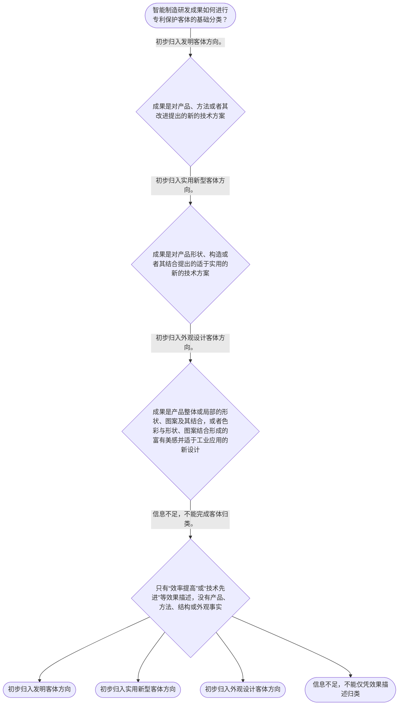

# 整合后的课程完整内容与习题

## 教学模块选择清单

- 当前教学节点：`patent-law-foundation`
- 板块预算：自适应 5/6，总计 9/9

| # | 模块 (block_type) | 类型 | 触发原因 (trigger) | 对应正文段 | 归属 |
|---:|---|:--:|---|---|:--:|
| 1 | `anchor_scenario` | 自适应 | perception=sensing(0.79) / cold_start | 从真实制造业专利纠纷进入制度基础｜真实案例锚定：美的集团股份有限公司与珠海格力电器股份有限公司之间的空调技术专利侵权纠纷，是公… | [A+B融合] |
| 2 | `legal_anchor` | 必选 | mandatory | 专利制度的法条锚点｜《中华人民共和国专利法》第一条 | [A+B融合] |
| 3 | `worked_example` | 自适应 | cold_start(low_confidence) | 用真实制造业纠纷拆解专利客体与程序｜真实案例锚定：美的集团股份有限公司与珠海格力电器股份有限公司曾因制造业产品技术专利发生公开专… | [A+B融合] |
| 4 | `decision_flow` | 自适应 | input=visual(0.75) | 三类专利客体识别流程｜智能制造研发成果如何进行专利保护客体的基础分类？ | [A+B融合] |
| 5 | `mnemonic` | 自适应 | understanding=sequential(0.69) | 客体三分表｜客体三分表：发明看“产品、方法、改进”；实用新型看“形状、构造、结合”；外观设计看“外观、图… | [B] |
| 6 | `reflect_prompt` | 自适应 | processing=reflective(0.64) | 把分类规则带回研发现场｜回看一个研发项目时，哪些事实足以支持客体分类，哪些只是“效率提升”等效果描述？ | [B] |
| 7 | `assessment` | 必选 | mandatory | 本节三类测评索引｜复习专利法第二条规定的三类发明创造。 | [A+B融合] |
| 8 | `knowledge_synthesis` | 必选 | mandatory | 专利法律制度基础框架｜制度特征：独占性提示依法授予后存在排他效力；时间性提示权利有期限；地域性提示不要把一国申请或… | [A+B融合] |
| 9 | `summary_card` | 自适应 | len(knowledge_sub_nodes)=3>=3 | 专利制度基础速查卡｜本节主线是：结合真实制造业专利纠纷背景，先辨客体和制度位置，再进入后续的新颖性与专利权保护规… | [A+B融合] |

## 教学正文

# 专利法律制度基础：为新颖性与侵权学习搭建入口

## 一、从真实制造业专利纠纷开始

美的集团股份有限公司与珠海格力电器股份有限公司之间曾发生围绕制造业产品技术专利的公开专利侵权纠纷。这个真实案例适合用作智能制造企业的制度入口：研发成果最终要落到具体产品、方法、结构或外观上，企业还要区分申请、审查、授权公告和专利权生效等不同阶段。本节只使用该案例说明制度层次和分析入口，不展开其新颖性、创造性或侵权裁判结论；具体事实应以对应公开裁判文书原文为准。

学习专利新颖性和侵权判定前，首要任务不是直接判断“能否授权”或“是否侵权”，而是把成果、程序和权利层次拆开。

专利制度的立法目标包括保护专利权人的合法权益、鼓励发明创造、推动发明创造的应用、提高创新能力，并促进科学技术进步和经济社会发展。〔RAG: 中华人民共和国专利法.txt — 第一条：为了保护专利权人的合法权益，鼓励发明创造，推动发明创造的应用，提高创新能力，促进科学技术进步和经济社会发展〕

## 二、先识别三类保护客体

《中华人民共和国专利法》第二条规定，发明创造包括发明、实用新型和外观设计。发明是对产品、方法或者其改进所提出的新的技术方案；实用新型是对产品形状、构造或者其结合所提出的适于实用的新的技术方案；外观设计是对产品整体或者局部的形状、图案及其结合，以及色彩与形状、图案结合所作出的富有美感并适于工业应用的新设计。〔RAG: 中华人民共和国专利法.txt — 第二条：发明创造是指发明、实用新型和外观设计，并分别规定三类定义〕

在真实制造业专利纠纷所代表的产品研发场景中，空调、机器人、输送装置或其他自动化设备都不能只作为一个笼统的“整机”处理。控制程序和控制步骤应先按发明客体方向识别；产品内部连接构造可先按实用新型客体方向识别；产品外壳的局部形状、图案或色彩组合，则应按外观设计客体方向核对。这里的“先按某一方向识别”只回答成果属于什么法定客体，不回答其最终是否能被授权，也不提前判断新颖性或侵权。

可采用“客体三分表”快速定位：发明看“产品、方法、改进”，实用新型看“形状、构造、结合”，外观设计看“外观、图案、色彩、美感、工业应用”。这一口诀只是第二条的检索提示，不能替代法条比对；仅有“效率提高”“技术先进”或“商业价值大”等效果描述，通常不足以完成客体归类。

## 三、制度体系、制度特征与作用

本节将中国专利制度理解为三个基础层次：专利法提供核心法律规范；专利法实施细则配合制度实施；专利审查指南服务审查操作。检索上下文未提供实施细则和审查指南的具体原文，本节不对其具体条款作出归纳。

独占性、时间性和地域性是理解专利权的三个观察角度。独占性提示依法授予后存在排他效力；时间性提示专利权不是无限期权利；地域性提示不能把一国申请或授权理解为当然在全球有效。它们是基础概念框架，具体权利效力、期限和地域适用仍须在后续节点回到直接法条和事实判断。

从制度功能看，专利制度通过保护合法权益、鼓励创造和推动应用，连接技术公开、技术应用与创新发展。关于中国专利制度的发展线索，检索材料记载早期制度采用先申请制，发明专利经历初步审查和实质审查，实用新型和外观设计实行初步审查。〔RAG: 专利法律知识详细解读.txt — 我国1984年制定的首部专利法具有先申请制；发明专利的授权需要经过初步审查、实质审查两个阶段；实用新型和外观设计经初步审查〕本节只建立该线索，不延伸具体历史或程序细节。

## 四、分类、受理、授权条件与生效要分开

国务院专利行政部门负责管理全国专利工作，统一受理和审查专利申请，并依法授予专利权。〔RAG: 中华人民共和国专利法.txt — 第三条：统一受理和审查专利申请，依法授予专利权〕因而，成果被识别为某类客体，不等于申请已被受理；申请被受理，也不等于已经取得专利权。

对发明和实用新型，第二十二条规定后续授权条件为新颖性、创造性和实用性。〔RAG: 中华人民共和国专利法.txt — 第二十二条：授予专利权的发明和实用新型，应当具备新颖性、创造性和实用性〕这意味着本节的客体识别只是进入后续三性分析的入口。现有技术、抵触申请、新颖性和创造性三步法的具体判断，属于后续节点内容，不应在本节凭概念印象直接下结论。

发明专利经实质审查没有发现驳回理由后，实用新型和外观设计经初步审查没有发现驳回理由后，国务院专利行政部门作出授予专利权的决定并登记、公告；相应专利权自公告日起生效。〔RAG: 中华人民共和国专利法.txt — 第三十九条、第四十条：专利权自公告之日起生效〕同时，发明、实用新型和外观设计的一般期限分别为二十年、十年和十五年，均自申请日起计算。〔RAG: 中华人民共和国专利法.txt — 第四十二条：发明二十年、实用新型十年、外观设计十五年，均自申请日起计算〕因此，“权利生效日”与“期限起算日”也不能混同。

## 五、通向新颖性和侵权判定的正确路线

本节形成的工作顺序是：先拆分研发事实，再依据第二条识别保护客体；随后区分申请受理、审查、授权生效和期限；对于发明和实用新型，再进入新颖性、创造性、实用性的授权条件分析；只有在后续专利权保护节点，才进一步讨论保护范围和侵权比对。

新颖性判断属于授权条件问题；侵权判定属于已获专利权后的保护问题。二者不能因为都涉及“技术是否相同或相似”而混用。面对智能制造成果，先客体、后条件、再范围，才能避免把技术价值、专利申请和专利权保护混为一谈。

本节设有测评，请到【习题】区作答。

### 从真实制造业专利纠纷进入制度基础（anchor_scenario）

> 真实案例锚定：美的集团股份有限公司与珠海格力电器股份有限公司之间的空调技术专利侵权纠纷，是公开司法裁判中制造业企业围绕产品结构专利发生争议的案例。该案例可作为智能制造企业理解专利制度入口的真实制造业背景：企业面对具体产品和结构技术时，首先要区分保护客体、申请与授权阶段，再确定后续权利保护问题。本节不据此展开该案的新颖性、创造性或侵权结论；案件具体事实和裁判理由应以相应公开裁判文书原文为准。

**锚定**：该案例提供了可核验的制造业专利纠纷背景，能够连接智能制造企业常见的产品结构研发与专利制度基础。本节仅用来训练客体识别、制度层次和程序入口，不把案件的实体裁判问题提前当作当前节点结论。

**先想一想**：把该真实制造业专利纠纷放回研发现场：面对空调或自动化设备中的具体结构、控制方法和外观设计，你会先判断其属于哪类专利客体，还是先讨论技术效果？还要进一步确认申请、授权公告和专利权生效分别处于什么阶段。

### 专利制度的法条锚点（legal_anchor）

- **《中华人民共和国专利法》第一条**：第一条说明专利法的制度目标包括保护专利权人的合法权益、鼓励发明创造、推动发明创造的应用、提高创新能力以及促进科学技术进步和经济社会发展。
- **《中华人民共和国专利法》第二条**：第二条将发明创造分为发明、实用新型和外观设计，并分别规定三类客体的定义。
- **《中华人民共和国专利法》第三条**：第三条规定国务院专利行政部门统一受理和审查专利申请，依法授予专利权。
- **《中华人民共和国专利法》第二十二条**：第二十二条规定授予发明和实用新型专利权应当具备新颖性、创造性和实用性。
- **《中华人民共和国专利法》第三十九条、第四十条**：第三十九条、第四十条规定相应专利权自公告之日起生效。
- **《中华人民共和国专利法》第四十二条**：第四十二条规定发明、实用新型和外观设计的期限分别为二十年、十年和十五年，均自申请日起计算。

**为何重要**：客体、申请受理、审查、授权生效、授权条件和权利期限属于不同判断层次。真实制造业专利纠纷只能帮助建立问题背景，不能替代对具体案件文书和后续实体规则的核对。

### 用真实制造业纠纷拆解专利客体与程序（worked_example）

**案情/例题**：真实案例锚定：美的集团股份有限公司与珠海格力电器股份有限公司曾因制造业产品技术专利发生公开专利侵权纠纷。将这一真实制造业背景与智能制造研发现场连接，企业需要把一项设备或生产线成果拆分为控制方法、产品结构和产品外观，而不是笼统地称为“智能制造技术”。本例不补写未核验的具体案号、专利号、技术特征或裁判结论。
**适用规则**：《中华人民共和国专利法》第二条、第三条、第三十九条、第四十条和第二十二条。真实案例仅用于演示如何从制造业产品事实进入客体识别和程序层次判断，不在本例中作出新颖性、创造性或侵权结论。
**分步推演**：
1. 先确认真实案例的教学用途仅是制造业专利制度背景，再把研发事实拆成方法、产品结构和产品外观三个层次。 → *第一步：确定事实对象和证据边界。*
2. 控制程序或控制步骤可以先按对方法提出新的技术方案的方向识别；产品内部连接构造可以先按产品形状、构造或其结合的方向识别；产品外壳的形状、图案或色彩组合则应核对外观设计定义。 → *第二步：依据第二条初步匹配客体。*
3. 第三条所规定的受理和审查是行政程序入口；发明和实用新型还要进入第二十二条规定的新颖性、创造性和实用性判断。 → *第三步：把客体识别与授权条件分开。*
4. 依第三十九条、第四十条，专利权自公告之日起生效；这与申请提交、申请公开以及期限自申请日起计算不是同一概念。 → *第四步：区分程序时点和权利生效。*
**结论**：在美的集团与珠海格力电器公开专利纠纷所代表的制造业场景中，应先从具体产品或技术特征识别可能的专利客体，再区分申请受理、审查和授权生效；客体分类或提交申请均不等于已经取得专利权。
**本题要点**：真实制造业专利纠纷可以帮助理解为什么要围绕具体产品或技术特征进行分析；答题时仍应坚持“先客体，后条件，再范围”，并以公开裁判文书和法条原文核对案件事实。

### 三类专利客体识别流程（decision_flow）

**决策问题**：智能制造研发成果如何进行专利保护客体的基础分类？



### 客体三分表（mnemonic）

**记忆锚**：客体三分表：发明看“产品、方法、改进”；实用新型看“形状、构造、结合”；外观设计看“外观、图案、色彩、美感、工业应用”。答题顺序是“先客体，后条件，再范围”。
**映射**：
- 发明
- 实用新型
- 外观设计
- 先客体，后条件，再范围
**何时用**：看到控制程序、机械结构或设备外壳时使用。该记忆法只能帮助定位第二条，不能推出当然授权或侵权。

### 把分类规则带回研发现场（reflect_prompt）

**反思问题**：回看一个研发项目时，哪些事实足以支持客体分类，哪些只是“效率提升”等效果描述？

**关注要点**：同一设备可能包含可分别评估的方法、结构和外观成果。；技术效果或商业价值不等于法定保护客体。；客体识别后仍须进入授权条件和后续保护范围分析。

**连接**：将真实制造业专利纠纷所体现的产品技术分析，迁移到学习者熟悉的智能制造项目，把项目拆为控制方法、产品结构、产品外观和单纯技术效果四栏。

### 专利法律制度基础框架（knowledge_synthesis）

**知识框架**：
- 制度特征：独占性提示依法授予后存在排他效力；时间性提示权利有期限；地域性提示不要把一国申请或授权理解为当然全球有效，具体结论须回到直接规则。
- 制度体系：专利法提供核心法律规范；专利法实施细则配合制度实施；专利审查指南服务审查操作，本节不对检索上下文未提供的具体条文作扩展。
- 保护客体：第二条规定发明、实用新型和外观设计三类客体。
- 制度作用：第一条所示目标包括保护合法权益、鼓励创造、推动应用、提高创新能力以及促进科技进步和经济社会发展。
- 发展与审查线索：检索材料记载我国早期制度具有先申请制，发明经历初步审查与实质审查，实用新型和外观设计实行初步审查。
**概念关系**：第二条回答“属于什么客体”；第三条说明统一受理和审查；第二十二条提示发明和实用新型还要满足三性。；申请、公开、授权生效和权利期限不是同一时间概念：专利权自公告日起生效，而一般期限自申请日起计算。；新颖性具体判断属于后续授权条件节点；侵权比对属于后续专利权保护节点，不能从客体分类直接跳到结论。；真实制造业专利纠纷可以作为制度背景，但具体案件事实、技术特征和裁判理由必须以对应公开裁判文书为准。
**必记**：发明创造包括发明、实用新型和外观设计。；专利制度的基础特征是独占性、时间性和地域性，但具体结论须以直接规则为准。；专利法、实施细则和审查指南构成基础制度学习框架。；专利制度具有激励创造、促进公开和推动应用发展的功能。；客体分类、申请审查、授权条件和侵权判断必须区分。

### 专利制度基础速查卡（summary_card）

**要点卡**：
- **三类客体**：发明看产品、方法、改进；实用新型看产品形状构造；外观设计看产品外观新设计。
- **制度特征**：独占性看依法排他，时间性看期限，地域性看效力边界；均不能脱离具体规则。
- **制度体系**：专利法是核心，实施细则配合实施，审查指南服务审查操作。
- **制度功能**：保护合法权益、鼓励创造、推动应用，并促进科技和经济社会发展。
- **判断层次**：客体分类不等于受理，受理不等于授权，授权条件也不等于侵权判断。
**必背**：发明创造包括发明、实用新型和外观设计。；专利权自公告日起生效；一般期限自申请日起计算。；先客体，后条件，再范围。
**一句话总结**：本节主线是：结合真实制造业专利纠纷背景，先辨客体和制度位置，再进入后续的新颖性与专利权保护规则。

### 本节三类测评索引（assessment）

**三类覆盖**：backward_review、forward_probe、weakness_probe
**题目**：
- q-backward-foundation-1：复习专利法第二条规定的三类发明创造。
- q-forward-protection-1：仅探测下一节点中的专利权期限基础。
- q-weakness-foundation-1：辨析客体分类、受理审查与授权条件的不同层次。


## 结构化数据

## expert

```json
"A+B融合"
```

## style

```json
"fused"
```

## knowledge_points

```json
[
  {
    "node_id": "patent-law-foundation",
    "kc_name": "专利制度的基本概念与特征：独占性、时间性、地域性"
  },
  {
    "node_id": "patent-law-foundation",
    "kc_name": "中国专利制度体系：专利法、专利法实施细则、专利审查指南"
  },
  {
    "node_id": "patent-law-foundation",
    "kc_name": "专利保护的三种客体：发明、实用新型、外观设计（专利法第2条）"
  },
  {
    "node_id": "patent-law-foundation",
    "kc_name": "专利制度的作用：激励发明创造、促进技术公开、推动技术应用和经济发展"
  },
  {
    "node_id": "patent-law-foundation",
    "kc_name": "中国专利制度发展历程与特点：早期公开延迟审查、初步审查制与实质审查制并存"
  }
]
```

## legal_basis

```json
[
  {
    "article": "《中华人民共和国专利法》第一条：为了保护专利权人的合法权益，鼓励发明创造，推动发明创造的应用，提高创新能力，促进科学技术进步和经济社会发展，制定本法。",
    "source": "中华人民共和国专利法.txt：第一条"
  },
  {
    "article": "《中华人民共和国专利法》第二条：本法所称的发明创造是指发明、实用新型和外观设计；发明、实用新型和外观设计分别具有法定定义。",
    "source": "中华人民共和国专利法.txt：第二条"
  },
  {
    "article": "《中华人民共和国专利法》第三条：国务院专利行政部门负责管理全国的专利工作；统一受理和审查专利申请，依法授予专利权。",
    "source": "中华人民共和国专利法.txt：第三条"
  },
  {
    "article": "《中华人民共和国专利法》第二十二条：授予专利权的发明和实用新型，应当具备新颖性、创造性和实用性。",
    "source": "中华人民共和国专利法.txt：第二十二条"
  },
  {
    "article": "《中华人民共和国专利法》第三十九条、第四十条：发明以及实用新型、外观设计专利权自公告之日起生效。",
    "source": "中华人民共和国专利法.txt：第三十九条、第四十条"
  },
  {
    "article": "《中华人民共和国专利法》第四十二条：发明专利权的期限为二十年，实用新型专利权的期限为十年，外观设计专利权的期限为十五年，均自申请日起计算。",
    "source": "中华人民共和国专利法.txt：第四十二条"
  },
  {
    "article": "我国专利制度具有先申请制；发明专利经历初步审查和实质审查，实用新型和外观设计实行初步审查。",
    "source": "专利法律知识详细解读.txt：我国1984年制定的首部专利法特点"
  },
  {
    "article": "美的集团股份有限公司与珠海格力电器股份有限公司之间的制造业产品专利侵权纠纷，作为真实制造业专利案例背景。",
    "source": "公开司法裁判资料；具体事实以对应公开裁判文书为准"
  }
]
```

## risks

```json
[
  {
    "risk": "将属于发明、实用新型或外观设计的客体识别误作必然获得授权，忽略后续授权条件。",
    "related_node_id": "patent-rights-nature"
  },
  {
    "risk": "将申请受理、申请公开、授权公告和专利权生效混为同一时点。",
    "related_node_id": "patent-law-foundation"
  },
  {
    "risk": "将独占性误解为永久或全球无边界的权利；具体效力、期限和地域适用须依据直接规则。",
    "related_node_id": "patent-rights-nature"
  },
  {
    "risk": "将本节对第二十二条授权条件的定位误当作已经掌握新颖性、现有技术或抵触申请的具体判断。",
    "related_node_id": "novelty"
  },
  {
    "risk": "对先申请制、初步审查和实质审查的历史及程序细节，不能超出检索材料编造。",
    "related_node_id": "patent-system-overview"
  },
  {
    "risk": "真实案件的具体案号、专利号、技术特征和裁判理由必须以对应公开裁判文书核对，不得仅凭案例名称推导新颖性或侵权结论。",
    "related_node_id": "patent-system-overview"
  }
]
```

## draft_stage

```json
"integration"
```

## irac

```json
{
  "issue": "智能制造及制造业研发成果进入中国专利制度时，如何识别其保护客体、制度位置以及后续授权和保护分析的起点？",
  "rule": "《中华人民共和国专利法》第一条规定制度目标；第二条规定发明、实用新型和外观设计及其定义；第三条规定统一受理和审查并依法授予专利权；第二十二条规定发明和实用新型应具备新颖性、创造性和实用性；第三十九条、第四十条规定专利权自公告日起生效；第四十二条规定一般期限自申请日起计算。",
  "application": "对真实制造业专利纠纷所代表的产品研发场景，应先将具体事实拆分为控制方法、产品结构和产品外观，再与第二条定义比对。第三条所示统一受理和审查只是行政程序入口；发明和实用新型还须依据第二十二条进入三性分析。依据第三十九条、第四十条，专利权自公告日起生效；依据第四十二条，一般期限自申请日起计算。",
  "conclusion": "本节点只能完成制度基础与客体识别：客体分类、申请审查、授权生效、授权条件和侵权判断应严格区分。真实制造业案件仅作为背景，具体新颖性和侵权结论留待对应后续节点并以案件文书为依据。"
}
```

## interactive_questions

```json
[
  {
    "qid": "q-backward-foundation-1",
    "category": "remember",
    "difficulty": "L1",
    "source_tag": "backward_review",
    "kc_node_id": "patent-law-foundation",
    "question": "根据《中华人民共和国专利法》第二条，下列哪组属于本法所称的发明创造？",
    "answer": "A",
    "options": [
      "A. 发明、实用新型和外观设计",
      "B. 发明、技术秘密和商标",
      "C. 实用新型、作品和商号",
      "D. 发明、植物新品种和商标"
    ]
  },
  {
    "qid": "q-forward-protection-1",
    "category": "understand",
    "difficulty": "L1",
    "source_tag": "forward_probe",
    "kc_node_id": "patent-rights-protection",
    "question": "仅作为下一节点“专利权保护”的探测，关于发明和实用新型专利权期限，下列哪项正确？",
    "answer": "B",
    "options": [
      "A. 发明、实用新型和外观设计的期限均为二十年",
      "B. 发明期限为二十年，实用新型期限为十年，均自申请日起计算",
      "C. 发明期限自授权公告日起计算二十年",
      "D. 实用新型期限为十五年，且自授权日起计算"
    ]
  },
  {
    "qid": "q-weakness-foundation-1",
    "category": "analyze",
    "difficulty": "L3",
    "source_tag": "weakness_probe",
    "kc_node_id": "patent-law-foundation",
    "question": "某企业开发自动分拣设备的可拆卸导向组件，改进集中于产品内部连接构造。下列分析最准确的是？",
    "answer": "D",
    "options": [
      "A. 内部连接构造属于外观设计，因此受理后当然取得专利权",
      "B. 内部连接构造属于实用新型，因此无须进入授权条件分析",
      "C. 只要导向组件提高效率，就当然属于发明并已具备新颖性",
      "D. 内部连接构造可先按实用新型客体方向识别；受理和后续授权条件仍须分别判断"
    ]
  }
]
```

## knowledge_synthesis

```json
{
  "node": "patent-law-foundation",
  "coverage": [
    {
      "node_id": "patent-rights-nature"
    },
    {
      "node_id": "patent-law-framework"
    },
    {
      "node_id": "patent-law-foundation"
    },
    {
      "node_id": "patent-system-overview"
    }
  ],
  "confusable_pairs": [
    {
      "pair": "保护客体分类与授权条件：第二条回答成果类型；第二十二条要求发明和实用新型后续满足三性，二者不能替代。"
    },
    {
      "pair": "申请受理审查与专利权生效：第三条规定行政机关职能；第三十九条、第四十条规定专利权自公告日起生效，申请不等于授权。"
    },
    {
      "pair": "新颖性判断与侵权判定：前者是授权条件问题，后者是专利权保护问题；本节点只建立进入两者的基础入口。"
    }
  ]
}
```
