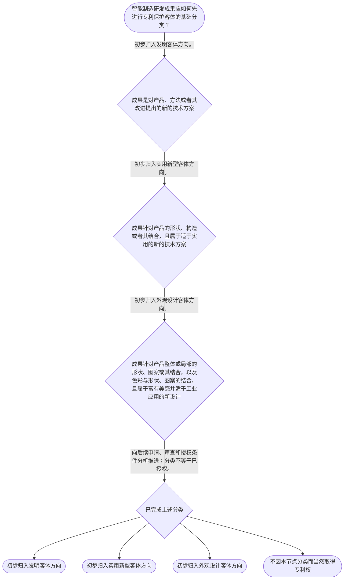

# 专家 A 教学草稿

> 专家：expert_a ｜ 风格：conservative

## 教学模块选择清单

- 当前教学节点：`patent-law-foundation`
- 板块预算：自适应 6/6，总计 9/9

| # | 模块 (block_type) | 类型 | 触发原因 (trigger) | 对应正文段 | 归属 |
|---:|---|:--:|---|---|:--:|
| 1 | `anchor_scenario` | 自适应 | perception=sensing(0.79) / cold_start | 智能制造研发成果的专利分类｜某智能制造企业开发了一套用于协作机器人的视觉定位装置：装置包含工业相机、边缘计算单元和用于校… | [A] |
| 2 | `legal_anchor` | 必选 | mandatory | 专利制度的法条锚点｜《中华人民共和国专利法》第二条 | [A] |
| 3 | `worked_example` | 自适应 | cold_start(low_confidence) | 机器人视觉定位方案的客体识别｜智能制造企业拟保护三项研发成果：其一，利用传感器数据实时修正机械臂抓取轨迹的控制方法；其二，… | [A] |
| 4 | `decision_flow` | 自适应 | input=visual(0.75) | 三类专利客体的分类流程｜智能制造研发成果应如何先进行专利保护客体的基础分类？ | [A] |
| 5 | `mnemonic` | 自适应 | understanding=sequential(0.69) | 三类保护客体速记表｜客体三分表：发明看“产品、方法、改进的技术方案”；实用新型看“产品形状、构造”；外观设计看“… | [A] |
| 6 | `reflect_prompt` | 自适应 | processing=reflective(0.64) | 从研发成果回看保护客体｜回顾一个你参与过的智能制造项目：其中哪些成果属于方法技术方案，哪些属于产品形状构造，哪些仅涉… | [A] |
| 7 | `assessment` | 必选 | mandatory | 本节三类测评索引｜复习专利法第二条规定的三类发明创造。 | [A] |
| 8 | `knowledge_synthesis` | 必选 | mandatory | 专利法律制度基础框架｜专利制度特征：专利权具有独占性、时间性和地域性；本节仅建立概念框架，具体权利效力与期限规则留… | [A] |
| 9 | `summary_card` | 自适应 | len(knowledge_sub_nodes)=3>=3 | 专利制度基础速查卡｜专利制度基础的判断顺序是：先辨客体，再辨规范与程序位置，最后进入相应的授权或保护规则。 | [A] |

## 教学正文

## I — 法律问题

在智能制造研发场景中，机器人控制方法、设备支架结构和操作面板外观分别可能对应哪类专利保护客体？中国专利制度由何种核心规范与行政机制支撑？在完成客体识别后，为什么仍不能直接断言技术方案具有新颖性或已经取得专利权？

## R — 适用规则

《中华人民共和国专利法》第二条规定，本法所称的发明创造包括发明、实用新型和外观设计；发明是对产品、方法或者其改进提出的新的技术方案，实用新型是对产品形状、构造或者其结合提出的适于实用的新的技术方案，外观设计是对产品整体或者局部的形状、图案或者其结合以及色彩与形状、图案的结合所作出的富有美感并适于工业应用的新设计。〔RAG: 中华人民共和国专利法.txt — 第二条：发明创造是指发明、实用新型和外观设计，并分别规定三类定义〕

《中华人民共和国专利法》第三条规定，国务院专利行政部门负责管理全国专利工作，统一受理和审查专利申请，并依法授予专利权。〔RAG: 中华人民共和国专利法.txt — 第三条：统一受理和审查专利申请，依法授予专利权〕

对于发明和实用新型，第二十二条规定授权条件为新颖性、创造性和实用性。新颖性要求该发明或者实用新型不属于现有技术，并且不存在法条规定的在申请日前提出、在申请日后公布或公告的同样主题申请；现有技术是申请日以前在国内外为公众所知的技术。〔RAG: 中华人民共和国专利法.txt — 第二十二条：授予专利权的发明和实用新型应当具备新颖性、创造性和实用性；现有技术是申请日以前在国内外为公众所知的技术〕

本节所称中国专利制度体系，以专利法为核心，并涉及专利法实施细则、专利审查指南等规范层次。检索上下文未提供实施细则和审查指南的具体原文，因此本节不对其具体条款作出展开或归纳。专利制度具有独占性、时间性、地域性这一基础特征；其具体权利效力和期限规则须在后续专利权保护节点依直接法条学习。

## A — 规则适用

以机器人视觉定位装置为例，先做成果拆分，而不是直接讨论侵权或授权。

第一步，识别控制方法。若研发成果是依据传感器数据实时修正机械臂抓取轨迹的方法，它属于对“方法或者其改进”提出的技术方案，应先按发明客体方向评估。〔RAG: 中华人民共和国专利法.txt — 第二条：发明，是指对产品、方法或者其改进所提出的新的技术方案〕

第二步，识别硬件结构。若成果是相机定位支架的连接方式、形状或构造改进，它属于产品形状、构造或者其结合的技术方案，应先按实用新型客体方向评估。〔RAG: 中华人民共和国专利法.txt — 第二条：实用新型，是指对产品的形状、构造或者其结合所提出的适于实用的新的技术方案〕

第三步，识别产品外观。若成果是操作面板外壳的局部形状、图案及其组合，并且属于富有美感、适于工业应用的新设计，应先按外观设计客体方向评估。〔RAG: 中华人民共和国专利法.txt — 第二条：外观设计，是指对产品的整体或者局部的形状、图案或者其结合以及色彩与形状、图案的结合所作出的富有美感并适于工业应用的新设计〕

第四步，区分“分类”“申请受理”“授权”三个层次。第二条的分类结论仅回答成果属于何种法定客体；第三条说明申请由国务院专利行政部门统一受理和审查；二者均不替代具体授权条件判断。对于发明和实用新型，后续还要以第二十二条进入新颖性、创造性和实用性的审查。〔RAG: 中华人民共和国专利法.txt — 第三条：统一受理和审查专利申请，并依法授予专利权〕〔RAG: 中华人民共和国专利法.txt — 第二十二条：应当具备新颖性、创造性和实用性〕

可以按以下线性框架处理研发成果：

1. 先问成果是方法技术方案、产品形状构造技术方案，还是产品外观新设计。
2. 再按第二条完成发明、实用新型或外观设计的初步客体识别。
3. 随后进入申请受理、审查和相应授权条件的分析，不把分类结论当作授权结论。
4. 学习新颖性时，单独核对申请日前公众可得的技术及法定抵触申请情形；学习侵权时，单独进入保护范围和实施行为的规则体系。本节不以客体分类代替后二者的判断。

关于专利制度促进发明创造、技术公开、技术应用和经济发展的功能，以及中国专利制度发展中早期公开延迟审查、初步审查制与实质审查制并存等内容，检索上下文未提供直接原文依据。本节仅将其作为后续制度学习的框架提示，不据此增加未经检索支持的具体规则。

## C — 结论

专利法律制度基础的核心不是立即判断一项机器人技术“能否授权”或“是否侵权”，而是建立正确入口：依据第二条识别发明、实用新型和外观设计三类客体；依据第三条理解统一受理和审查的行政机制；对发明和实用新型，再依据第二十二条进入新颖性、创造性和实用性的授权条件分析。〔RAG: 中华人民共和国专利法.txt — 第二条、第三条、第二十二条〕

本节设有测评，请到【习题】区作答。

> 常见误区 / 易混淆点
>
> 1. “技术方案属于发明”不等于“该技术方案具有新颖性”。前者是保护客体识别，后者是授权条件判断。
> 2. “专利申请已被受理”不等于“已取得专利权”。受理、审查、授权属于不同程序阶段。
> 3. “新颖性”与“侵权”不是同一问题。新颖性针对授权条件；侵权判定须在后续专利权保护规则下进行。
> 4. 对制度历史、审查方式等未获检索原文支持的内容，应标注证据边界，不得以概念印象替代可核验依据。

### 智能制造研发成果的专利分类（anchor_scenario）

> 某智能制造企业开发了一套用于协作机器人的视觉定位装置：装置包含工业相机、边缘计算单元和用于校正抓取偏差的软件控制方法。研发团队计划把装置外壳的造型、硬件结构和控制方法分别纳入专利布局，但尚不清楚三类技术成果是否属于同一种专利保护客体。

企业还希望尽快向全国提交申请，并担心在申请公开前技术资料的保密安排、申请受理与审查主体等制度问题会影响后续布局。当前要先解决的不是某项技术是否必然授权，而是识别专利制度保护什么、由哪些规范构成、以及三类专利客体的边界。

**锚定**：该情境锚定专利制度的保护客体、制度体系和技术公开之间的基础关系。

**先想一想**：面对同一套机器人视觉定位方案，硬件结构、控制方法和产品外观能否用同一种专利类型保护？

### 专利制度的法条锚点（legal_anchor）

- **《中华人民共和国专利法》第二条**：发明创造包括发明、实用新型和外观设计；三者分别对应技术方案、产品形状构造的技术方案和产品外观的新设计。
- **《中华人民共和国专利法》第三条**：国务院专利行政部门负责管理全国专利工作，统一受理和审查专利申请，并依法授予专利权。
- **《中华人民共和国专利法》第二十二条**：发明和实用新型授权须具备新颖性、创造性和实用性；现有技术以申请日前国内外为公众所知的技术为界。

**为何重要**：本节点先建立专利制度的规范来源、保护客体和行政运行基础。第二十二条同时说明，后续学习新颖性、创造性和实用性时必须回到法定授权条件。

### 机器人视觉定位方案的客体识别（worked_example）

**案情/例题**：智能制造企业拟保护三项研发成果：其一，利用传感器数据实时修正机械臂抓取轨迹的控制方法；其二，带有特定连接构造的相机定位支架；其三，操作面板外壳的局部图案和形状设计。企业拟向国务院专利行政部门提交申请。应当如何先按本节点规则识别三项成果的保护客体和制度位置？
**适用规则**：《中华人民共和国专利法》第二条、第三条；本例仅用于说明保护客体分类和申请受理审查制度，不对授权前景作出判断。
**分步推演**：
1. 先区分成果所解决的问题。控制方法属于对方法或其改进提出的技术方案；第二条将这类技术方案定义为发明。 → *控制方法先按发明客体方向识别。*
2. 定位支架是有形产品，其可识别的改进在于形状、构造或者二者结合；第二条将此类适于实用的新的技术方案定义为实用新型。 → *产品的形状、构造改进先按实用新型客体方向识别。*
3. 面板外壳的局部图案和形状属于产品整体或局部的形状、图案及其结合所形成的新设计；第二条将其界定为外观设计。 → *产品外观的新设计先按外观设计客体方向识别。*
4. 分类后再定位行政程序：第三条规定国务院专利行政部门统一受理和审查专利申请，并依法授予专利权。分类本身不等于已获授权。 → *客体识别与授权结论必须分开。*
**结论**：机器人抓取轨迹的控制方法可作为发明专利客体方向进行评估；定位支架的形状、构造改进可作为实用新型客体方向进行评估；产品外壳的整体或局部外观新设计可作为外观设计客体方向进行评估。具体能否取得专利权，仍须依相应法定条件审查。
**本题要点**：面对智能制造成果，先按“方法技术方案、产品形状构造、产品外观设计”分类，再进入对应的申请与审查分析。

### 三类专利客体的分类流程（decision_flow）

**决策问题**：智能制造研发成果应如何先进行专利保护客体的基础分类？



### 三类保护客体速记表（mnemonic）

**记忆锚**：客体三分表：发明看“产品、方法、改进的技术方案”；实用新型看“产品形状、构造”；外观设计看“产品整体或局部外观”。
**映射**：
- 发明
- 实用新型
- 外观设计
**何时用**：看到研发成果清单、专利布局表或客体分类题时，先按三分表判断保护对象。

### 从研发成果回看保护客体（reflect_prompt）

**反思问题**：回顾一个你参与过的智能制造项目：其中哪些成果属于方法技术方案，哪些属于产品形状构造，哪些仅涉及产品外观？

**关注要点**：同一产品可能同时含有可分别评估的技术方案、结构改进和外观设计。；保护客体分类只是起点，不能替代后续授权条件和权利保护范围分析。；检索上下文未提供中国专利制度历史沿革以及初步审查制与实质审查制并存的直接原文依据；对此应在后续有权威资料时再作具体展开。

**连接**：连接到学习者已有的智能制造研发经验：把研发任务书中的方法、硬件结构和产品外观分别标注。

### 专利法律制度基础框架（knowledge_synthesis）

**知识框架**：
- 专利制度特征：专利权具有独占性、时间性和地域性；本节仅建立概念框架，具体权利效力与期限规则留待后续节点依据直接法条学习。
- 制度规范体系：中国专利制度以专利法为核心，并由专利法实施细则、专利审查指南等共同支撑；检索上下文未提供后二者的具体原文，不在本节展开其内容。
- 三类保护客体：第二条将发明创造分为发明、实用新型和外观设计，并对每类对象给出不同定义。
- 制度功能：专利制度围绕技术成果的公开、审查和依法授予专利权运行；关于激励创新、促进技术公开和经济发展的具体规范依据，本次检索上下文未提供直接原文。
- 制度程序轮廓：第三条明确国务院专利行政部门统一受理和审查专利申请、依法授予专利权；关于早期公开延迟审查、初步审查制与实质审查制并存的具体制度内容，本次检索上下文未提供直接依据。
**概念关系**：先识别成果是否以及属于何种法定保护客体，再进入申请、审查和授权条件分析。；第二十二条的三性是发明和实用新型的授权条件；它不同于第二条的客体定义。；国务院专利行政部门的受理审查职能说明制度运行入口，但不意味着任何申请都会被授予专利权。
**必记**：发明创造法定类型为发明、实用新型和外观设计。；发明和实用新型的授权条件包括新颖性、创造性和实用性。；客体分类、申请受理审查与授权结论是三个不同层次，不能混同。

### 专利制度基础速查卡（summary_card）

**要点卡**：
- **专利制度特征**：独占性、时间性、地域性是理解专利权制度的基础标签；具体规则应回到相应法条。
- **制度规范体系**：专利法是核心规范，实施细则和审查指南共同支撑制度运行；本节不超出已检索材料展开细则内容。
- **保护客体**：发明保护技术方案，实用新型保护产品形状构造的技术方案，外观设计保护产品外观的新设计。
- **行政运行**：国务院专利行政部门统一受理和审查专利申请，并依法授予专利权。
- **授权条件入口**：发明和实用新型后续须经新颖性、创造性、实用性判断。
**必背**：《中华人民共和国专利法》第二条规定：发明创造包括发明、实用新型和外观设计。；《中华人民共和国专利法》第三条规定：国务院专利行政部门统一受理和审查专利申请，并依法授予专利权。；客体分类不等于授权结论；授权条件分析不等于侵权判定。
**一句话总结**：专利制度基础的判断顺序是：先辨客体，再辨规范与程序位置，最后进入相应的授权或保护规则。

### 本节三类测评索引（assessment）

**三类覆盖**：backward_review、forward_probe、weakness_probe
**题目**：
- q-backward-foundation-1：复习专利法第二条规定的三类发明创造。
- q-forward-protection-1：仅探测下一节点中发明和实用新型专利权的保护期限。
- q-weakness-foundation-1：辨析制度基础、授权条件与程序结论的边界。


## 结构化字段

## knowledge_points

```json
[
  {
    "node_id": "patent-law-foundation",
    "kc_name": "专利制度的基本概念与特征：独占性、时间性、地域性"
  },
  {
    "node_id": "patent-law-foundation",
    "kc_name": "中国专利制度体系：专利法、专利法实施细则、专利审查指南"
  },
  {
    "node_id": "patent-law-foundation",
    "kc_name": "专利保护的三种客体：发明、实用新型、外观设计"
  },
  {
    "node_id": "patent-law-foundation",
    "kc_name": "专利制度的作用：激励发明创造、促进技术公开、推动技术应用和经济发展"
  },
  {
    "node_id": "patent-law-foundation",
    "kc_name": "中国专利制度发展历程与特点：早期公开延迟审查、初步审查制与实质审查制并存"
  }
]
```

## legal_basis

```json
[
  {
    "article": "《中华人民共和国专利法》第二条：发明创造包括发明、实用新型和外观设计，并分别规定其定义。",
    "source": "中华人民共和国专利法.txt：第二条"
  },
  {
    "article": "《中华人民共和国专利法》第三条：国务院专利行政部门统一受理和审查专利申请，依法授予专利权。",
    "source": "中华人民共和国专利法.txt：第三条"
  },
  {
    "article": "《中华人民共和国专利法》第二十二条：发明和实用新型应具备新颖性、创造性和实用性，并规定现有技术的定义。",
    "source": "中华人民共和国专利法.txt：第二十二条"
  }
]
```

## risks

```json
[
  {
    "risk": "将“属于发明、实用新型或外观设计”的客体判断误当作“必然获得授权”的结论，忽略后续法定条件审查。",
    "related_node_id": "patent-law-foundation"
  },
  {
    "risk": "将国务院专利行政部门受理申请与依法授予专利权混同。",
    "related_node_id": "patent-law-foundation"
  },
  {
    "risk": "检索上下文未提供中国专利制度历史沿革、早期公开延迟审查、初步审查制与实质审查制并存的直接原文依据；不得据此编造具体制度细节。",
    "related_node_id": "patent-system-overview"
  },
  {
    "risk": "将第二十二条的授权条件预习内容直接当作本节点已完成的新颖性判断能力，或与后续侵权判定混同。",
    "related_node_id": "novelty"
  }
]
```

## draft_stage

```json
"debate"
```

## irac

```json
{
  "issue": "智能制造研发成果进入中国专利制度时，应如何识别其保护客体、制度规范位置和后续授权分析的起点？",
  "rule": "《中华人民共和国专利法》第二条规定，发明创造包括发明、实用新型和外观设计，并分别界定其对象。第三条规定，国务院专利行政部门统一受理和审查专利申请，依法授予专利权。第二十二条规定，授予专利权的发明和实用新型应具备新颖性、创造性和实用性，并界定现有技术。",
  "application": "对智能制造企业的机器人视觉定位方案，应先按照第二条识别成果性质：控制方法属于“方法或者其改进”的技术方案方向；产品支架的形状、构造改进属于实用新型客体方向；产品外壳的形状、图案等外观新设计属于外观设计客体方向。随后，第三条所规定的统一受理和审查制度提供申请的行政入口，但客体分类或申请受理均不当然等于授权。对于发明和实用新型，后续还须按第二十二条审查新颖性、创造性和实用性。",
  "conclusion": "本节点的可执行结论是：先区分发明、实用新型和外观设计三类客体，继而区分申请受理审查与授权条件；新颖性判断和侵权判定属于后续节点，不能仅凭本节点的客体分类直接得出结论。"
}
```

## interactive_questions

```json
[
  {
    "qid": "q-backward-foundation-1",
    "category": "remember",
    "difficulty": "L1",
    "source_tag": "backward_review",
    "kc_node_id": "patent-law-foundation",
    "question": "根据《中华人民共和国专利法》第二条，下列哪组属于本法所称的发明创造？",
    "answer": "A",
    "options": [
      "A. 发明、实用新型和外观设计",
      "B. 发明、技术秘密和商标",
      "C. 实用新型、作品和商号",
      "D. 发明、集成电路布图设计和植物新品种"
    ]
  },
  {
    "qid": "q-forward-protection-1",
    "category": "understand",
    "difficulty": "L1",
    "source_tag": "forward_probe",
    "kc_node_id": "patent-rights-protection",
    "question": "仅作为下一节点“专利权保护”的探测：关于发明和实用新型专利权期限，下列哪项表述符合教学上下文提供的规则？",
    "answer": "B",
    "options": [
      "A. 发明、实用新型和外观设计的保护期限均为二十年",
      "B. 发明专利权期限为二十年，实用新型专利权期限为十年，均自申请日起计算",
      "C. 发明专利权期限自授权公告日起计算二十年",
      "D. 实用新型专利权期限为十五年，且自授权日起计算"
    ]
  },
  {
    "qid": "q-weakness-foundation-1",
    "category": "analyze",
    "difficulty": "L3",
    "source_tag": "weakness_probe",
    "kc_node_id": "patent-law-foundation",
    "question": "某企业的机器人控制方法属于对方法提出的技术方案。关于该事实的法律分析，下列哪项最准确？",
    "answer": "C",
    "options": [
      "A. 研发成果属于发明客体，因此当然具备新颖性、创造性和实用性",
      "B. 国务院专利行政部门受理申请后，因此申请人当然取得专利权",
      "C. 控制方法可先按发明客体方向识别，但是否授权仍须依相应法定条件审查",
      "D. 产品外观具有美感，因此必然应按发明专利获得保护"
    ]
  }
]
```

## knowledge_synthesis

```json
{
  "node": "patent-law-foundation",
  "coverage": [
    {
      "node_id": "patent-rights-nature"
    },
    {
      "node_id": "patent-law-framework"
    },
    {
      "node_id": "patent-law-foundation"
    },
    {
      "node_id": "patent-system-overview"
    }
  ],
  "confusable_pairs": [
    {
      "pair": "保护客体分类与授权条件：第二条回答“属于哪类发明创造”，第二十二条回答发明、实用新型能否满足授权条件；二者不能互相替代。"
    },
    {
      "pair": "申请受理审查与专利权取得：第三条说明行政机关职能，受理申请不等于已经依法授予专利权。"
    },
    {
      "pair": "新颖性判断与侵权判定：新颖性属于授权条件分析；侵权判定属于专利权保护问题，须在后续节点依保护范围和实施行为等规则分析。"
    }
  ]
}
```
