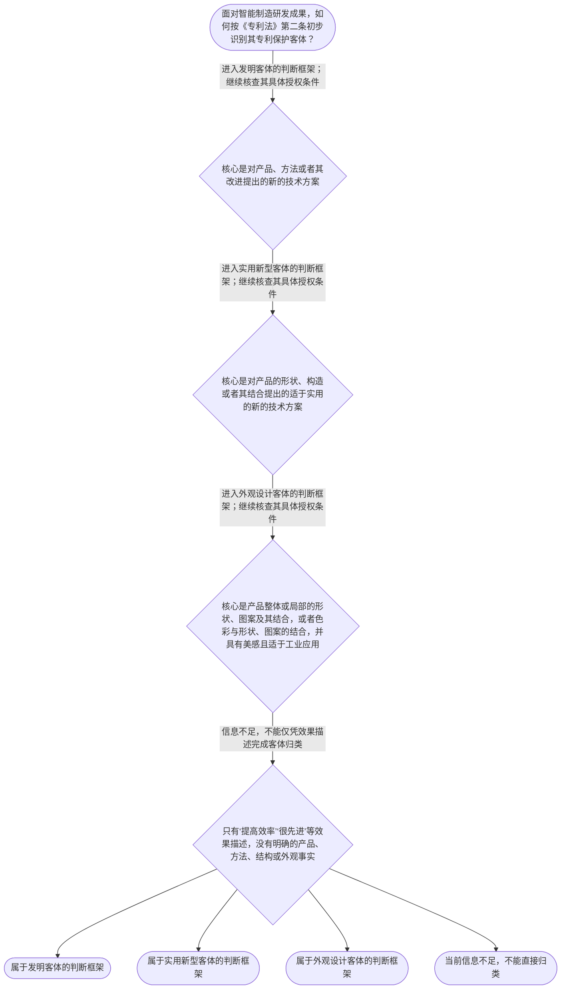

# 专家 B 教学草稿

> 专家：expert_b ｜ 风格：accessible

## 教学模块选择清单

- 当前教学节点：`patent-law-foundation`
- 板块预算：自适应 None/None，总计 9/9

| # | 模块 (block_type) | 类型 | 触发原因 (trigger) | 对应正文段 | 归属 |
|---:|---|:--:|---|---|:--:|
| 1 | `anchor_scenario` | 自适应 | perception=sensing(0.79) / cold_start | 智能制造研发团队的专利选择｜某智能制造企业研发了一条柔性装配线：机械臂负责抓取，视觉系统识别零件位置，控制程序根据识别结… | [B] |
| 2 | `legal_anchor` | 必选 | mandatory | 从法条确认专利制度边界｜《专利法》第一条 | — |
| 3 | `worked_example` | 自适应 | cold_start(low_confidence) | 把一项智能设备拆成三类专利客体｜某智能仓储企业开发了一套分拣设备。方案一是根据摄像头采集的货物图像调整机械臂路径的控制方法；… | [B] |
| 4 | `decision_flow` | 自适应 | input=visual(0.75) | 专利客体识别四步流程｜面对智能制造研发成果，如何按《专利法》第二条初步识别其专利保护客体？ | [B] |
| 5 | `mnemonic` | 自适应 | understanding=sequential(0.69) | 专利客体三分记忆表｜客体三分表：发明看‘产品、方法、改进’；实用新型看‘形状、构造、结合’；外观设计看‘形状、图… | [B] |
| 6 | `reflect_prompt` | 自适应 | processing=reflective(0.64) | 把法条分类映射回研发现场｜回想一个你熟悉的智能制造项目：其中哪些内容是方法步骤，哪些内容是产品结构，哪些内容只是性能效… | [B] |
| 7 | `assessment` | 必选 | mandatory | 本节三类测评｜识别《专利法》第二条规定的专利保护客体 | — |
| 8 | `knowledge_synthesis` | 必选 | mandatory | 专利法律制度基础知识网｜专利制度的基本概念与特征：专利权具有独占性、时间性和地域性，权利效力不是无限期、无限地域地延… | — |
| 9 | `summary_card` | 自适应 | len(knowledge_sub_nodes)=3>=3 | 专利法基础速查卡｜先认清专利制度保护什么、为何保护以及边界在哪里，再进入新颖性和侵权判定。 | [B] |

## 教学正文

## 1. 场景导入

某智能制造企业研发了一条柔性装配线：机械臂负责抓取，视觉系统识别零件位置，控制程序根据识别结果调整抓取路径。研发负责人准备申请专利，但团队成员出现了三个不同意见：有人认为只要能提高生产效率就都能申请；有人认为专利制度只保护整机；还有人认为申请后就能在任何国家阻止别人使用。

学习专利新颖性和侵权判定前，先把三个基础问题分开：专利制度为什么存在，专利法保护哪些客体，以及专利权的保护边界是什么。今天先完成这一步，后续再进入具体的新颖性和侵权分析。

## 2. 人话解释

可以把专利制度理解为一种有边界的法律交换：创新者公开技术方案，法律在一定期限和地域内给予相应的专利权保护。这里的‘有边界’很重要：专利权不是对所有相似想法的永久控制，也不是拿到授权后就在全世界自动生效。

面对一项智能制造成果，先不要被‘智能’‘高效’‘商业价值大’这些词带着走，而要把事实拆开：它是在描述一种产品、一个控制方法、一种产品结构，还是一种产品外观。不同事实对应不同的客体判断框架。发明通常围绕产品、方法或其改进的技术方案；实用新型聚焦产品的形状、构造或者其结合；外观设计关注产品整体或局部的形状、图案、色彩及其结合所形成的设计。

还要区分三个层次：第一步是‘它是不是专利法所说的客体’，第二步是‘它是否满足相应授权条件’，第三步是‘授权后权利要求或外观设计的保护边界在哪里’。因此，技术确实有用，不等于当然能授权；尚未公开，也不等于所有法律条件都已满足。

## 3. 法条回扣

《专利法》第一条把制度目标写成一条链：保护专利权人的合法权益，鼓励发明创造，推动发明创造的应用，提高创新能力，促进科学技术进步和经济社会发展。〔RAG: 中华人民共和国专利法.txt — 第一条：为了保护专利权人的合法权益，鼓励发明创造，推动发明创造的应用，提高创新能力，促进科学技术进步和经济社会发展〕

《专利法》第二条明确，本法所称的发明创造包括发明、实用新型和外观设计；其中，发明是对产品、方法或者其改进所提出的新的技术方案，实用新型是对产品的形状、构造或者其结合所提出的适于实用的新的技术方案，外观设计是对产品整体或局部的形状、图案及其结合以及色彩与形状、图案的结合所作出的富有美感并适于工业应用的新设计。〔RAG: 中华人民共和国专利法.txt — 第二条：发明、实用新型和外观设计的定义〕

现有资料还显示，中国专利制度采用先申请制；发明专利实行初步审查和实质审查，实用新型和外观设计主要实行初步审查。〔RAG: 专利法律知识详细解读.txt — 同一部法律包含发明、实用新型和外观设计；先申请制；发明专利为实质审查制，实用新型和外观设计为初步审查制〕

这些依据能支持本节的基础判断。至于新颖性中现有技术与抵触申请如何区分、创造性如何适用三步法、侵权如何进行权利要求比对，需要在对应后续节点结合具体法条和检索材料进一步学习，本节不提前展开。

## 4. 类比 / 口诀

使用‘客体三分表’快速定位：发明看‘产品、方法、改进’；实用新型看‘形状、构造、结合’；外观设计看‘形状、图案、色彩、美感、工业应用’。答题顺序固定为：先客体，后条件，再范围。

这个记忆表的边界是：它只帮助你检索《专利法》第二条的分类，不能单独推出某项成果一定具备新颖性、创造性，也不能单独决定是否构成侵权。遇到‘提高效率’‘很先进’等效果描述时，仍要回到具体产品、方法、结构或外观事实。

## 5. 应试提示

看到智能设备题干，按四步走：第一，圈出具体对象，是产品、方法、产品结构还是外观；第二，对照《专利法》第二条确定初步客体类型；第三，把客体识别与授权条件分开，不因‘有用’或‘创新’直接下结论；第四，若题目转向侵权，再单独寻找有效专利权和相应保护范围，不能把‘申请了专利’直接等同于‘已经可以阻止所有使用’。

常见陷阱有三个：把发明、实用新型、外观设计混为一类；把制度目的当成授权条件；把专利权的独占性误读成没有时间、地域限制的绝对权利。中国专利制度体系也不要只记专利法一个文件，还要知道专利法实施细则和专利审查指南承担补充程序和审查操作说明的作用。

本节设有测评，请到【习题】区作答。

## 6. 互动提问

请先在心里选一个你熟悉的智能制造项目，把其中的产品、方法步骤、结构特征和外观特征分别列出来，再用《专利法》第二条逐项核对。核对时特别观察：你是在描述技术效果，还是已经指出了可以进行客体归类的具体事实？

### 智能制造研发团队的专利选择（anchor_scenario）

> 某智能制造企业研发了一条柔性装配线：机械臂负责抓取，视觉系统识别零件位置，控制程序根据识别结果调整抓取路径。研发负责人准备申请专利，但团队成员出现了三个不同意见：有人认为只要能提高生产效率就都能申请；有人认为专利制度只保护整机；还有人认为申请后就能在任何国家阻止别人使用。现在需要先厘清：专利法保护哪些客体，专利权到底保护什么，以及这种保护受到哪些范围限制。

**锚定**：用同一条智能制造技术链锚定保护客体、专利权特征、制度体系和制度功能四个基础概念。

**先想一想**：如果你是这家企业的技术负责人，你会先问‘技术有多先进’，还是先问‘它属于哪种专利客体、保护边界在哪里’？为什么？

### 从法条确认专利制度边界（legal_anchor）

- **《专利法》第一条**：第一条说明专利法的制度目标：保护专利权人的合法权益，鼓励发明创造，推动发明创造的应用，提高创新能力，促进科学技术进步和经济社会发展。
- **《专利法》第二条**：第二条明确三类保护客体：发明是产品、方法或者其改进提出的新的技术方案；实用新型是产品的形状、构造或者其结合提出的适于实用的新的技术方案；外观设计是产品的整体或局部形状、图案及其结合，或者色彩与形状、图案的结合所作出的富有美感并适于工业应用的新设计。

**为何重要**：这些条文分别回答‘专利制度为什么存在’和‘专利法保护什么’。后续学习新颖性、侵权判定时，必须先确定保护客体及专利制度的基本边界。

### 把一项智能设备拆成三类专利客体（worked_example）

**案情/例题**：某智能仓储企业开发了一套分拣设备。方案一是根据摄像头采集的货物图像调整机械臂路径的控制方法；方案二是输送装置中具有特定连接关系的导向结构；方案三是设备外壳的局部纹理和色彩组合。团队希望判断这些内容是否都可以直接作为同一种专利申请。
**适用规则**：《专利法》第一条、第二条；本例仅演示如何识别专利客体和制度功能，不替代具体授权审查结论。
**分步推演**：
1. 先把技术事实拆成控制步骤、产品结构和产品外观三个层次，而不是笼统地称为‘智能分拣设备’。 → *第一步：从整体项目中识别具体技术对象。*
2. 控制方法属于对方法提出的新的技术方案，导向结构属于对产品形状、构造或者其结合提出的新的技术方案，分别对应发明或实用新型的客体描述。 → *第二步：用《专利法》第二条匹配技术方案客体。*
3. 设备外壳的局部纹理和色彩组合，若是对产品外观所作的富有美感并适于工业应用的新设计，则进入外观设计客体的判断框架。 → *第三步：识别外观设计客体，注意其关注的是产品外观设计。*
4. 客体识别只解决‘属于哪类保护对象’这一层问题，并不自动证明具备新颖性、创造性或其他授权条件。 → *第四步：把客体资格与后续授权条件分开。*
**结论**：该研发成果至少可以分别拆分为方法或控制系统相关技术方案、产品结构相关技术方案，以及设备外观设计进行客体识别；但是否最终获得专利权，还需要结合相应类型的具体授权条件审查。
**本题要点**：处理研发成果时先拆分事实、再匹配客体、最后进入授权条件判断，避免把‘有技术价值’当成‘当然能获专利’。

### 专利客体识别四步流程（decision_flow）

**决策问题**：面对智能制造研发成果，如何按《专利法》第二条初步识别其专利保护客体？



### 专利客体三分记忆表（mnemonic）

**记忆锚**：客体三分表：发明看‘产品、方法、改进’；实用新型看‘形状、构造、结合’；外观设计看‘形状、图案、色彩、美感、工业应用’。答题顺序固定为‘先客体，后条件，再保护范围’。
**映射**：
- 产品、方法、改进
- 形状、构造、结合
- 形状、图案、色彩、美感、工业应用
- 先客体，后条件，再范围
**何时用**：看到智能设备、控制程序、结构改进或产品外观的题干时，先用三分表定位客体，再进入新颖性或侵权等后续节点。

### 把法条分类映射回研发现场（reflect_prompt）

**反思问题**：回想一个你熟悉的智能制造项目：其中哪些内容是方法步骤，哪些内容是产品结构，哪些内容只是性能效果或外观表现？如果只写‘效率提升’，为什么还不足以完成专利客体识别？

**关注要点**：是否能把项目事实拆成产品、方法、结构或外观，而不是只描述项目名称；是否能区分‘技术效果很好’与‘符合某类专利客体定义’；是否意识到客体识别完成后，还要分别进入授权条件和保护范围判断

**连接**：连接到学习者已有的智能制造研发经验，并连接‘技术效果’与‘法律保护客体’的区分。

### 专利法律制度基础知识网（knowledge_synthesis）

**知识框架**：
- 专利制度的基本概念与特征：专利权具有独占性、时间性和地域性，权利效力不是无限期、无限地域地延伸。
- 中国专利制度体系：专利法提供基本规则，专利法实施细则补充程序和具体制度，专利审查指南提供审查中的操作性说明。
- 专利保护的三种客体：发明、实用新型和外观设计分别对应不同类型的技术方案或产品外观设计。
- 专利制度的作用：通过保护专利权人的合法权益，鼓励发明创造并推动其应用，进而提高创新能力、促进科学技术进步和经济社会发展。
- 中国专利制度的发展特点：我国专利制度采用先申请制；发明专利通常经历初步审查和实质审查，实用新型和外观设计主要实行初步审查。
**概念关系**：先确定制度目标和权利边界，再识别发明、实用新型、外观设计三类客体。；客体识别是进入授权条件判断的前置步骤；不能因为技术效果好就跳过客体分类。；申请与审查程序承接客体分类：发明专利与实用新型、外观设计的审查路径存在差异。；专利公开与权利保护共同构成制度运行逻辑：以法定保护换取技术公开，并在期限和地域范围内形成权利边界。
**必记**：专利制度基础要先分清三个层次：制度为什么存在、保护什么客体、权利如何受到时间和地域限制。；《专利法》第二条规定的三类客体不能混为一谈：发明偏向产品或方法技术方案，实用新型偏向产品形状和构造，外观设计偏向产品外观。；技术效果、创新价值和专利客体不是同一概念；客体识别完成后仍需进入相应授权条件判断。；中国专利制度体系不仅包括专利法，还包括专利法实施细则和专利审查指南。

### 专利法基础速查卡（summary_card）

**要点卡**：
- **制度目标**：保护合法权益、鼓励创造、推动应用，并促进科技进步和经济社会发展。
- **三类客体**：发明看产品或方法技术方案，实用新型看产品形状构造，外观设计看产品外观设计。
- **权利特征**：专利权的效力具有独占性、时间性和地域性，不能理解成永久且全球有效。
- **制度体系**：专利法定基本规则，实施细则补程序，审查指南提供审查操作说明。
- **审查路径**：发明专利通常经过初步审查和实质审查，实用新型和外观设计主要进行初步审查。
**必背**：《专利法》第一条的制度目标；《专利法》第二条规定的发明、实用新型和外观设计定义；客体识别、授权条件、保护范围属于三个不同判断层次；发明专利与实用新型、外观设计的审查路径不同
**一句话总结**：先认清专利制度保护什么、为何保护以及边界在哪里，再进入新颖性和侵权判定。

### 本节三类测评（assessment）

**三类覆盖**：backward_review、forward_probe、weakness_probe
**题目**：
- q-backward-1：识别《专利法》第二条规定的专利保护客体
- q-forward-1：初步识别未经许可实施已授权专利所涉及的保护问题
- q-weakness-1：辨析技术创新价值、专利客体与授权条件之间的关系


## 结构化字段

## knowledge_points

```json
[
  {
    "node_id": "patent-law-foundation",
    "kc_name": "专利制度的基本概念与特征：独占性、时间性、地域性（详见子节点 patent-rights-nature）"
  },
  {
    "node_id": "patent-law-foundation",
    "kc_name": "中国专利制度体系：专利法、专利法实施细则、专利审查指南（详见子节点 patent-law-framework）"
  },
  {
    "node_id": "patent-law-foundation",
    "kc_name": "专利保护的三种客体：发明、实用新型、外观设计（专利法第2条）"
  },
  {
    "node_id": "patent-law-foundation",
    "kc_name": "专利制度的作用：激励发明创造、促进技术公开、推动技术应用和经济发展（详见子节点 patent-system-overview）"
  },
  {
    "node_id": "patent-law-foundation",
    "kc_name": "中国专利制度发展历程与特点：早期公开延迟审查、初步审查制与实质审查制并存（详见子节点 patent-system-overview）"
  }
]
```

## legal_basis

```json
[
  {
    "article": "《专利法》第一条",
    "source": "中华人民共和国专利法.txt"
  },
  {
    "article": "《专利法》第二条",
    "source": "中华人民共和国专利法.txt"
  }
]
```

## risks

```json
[
  {
    "risk": "将专利权的独占性误解为永久性或全球性权利，忽略时间和地域边界。",
    "related_node_id": "patent-rights-nature"
  },
  {
    "risk": "只记住专利法，忽略专利法实施细则和专利审查指南在程序与审查操作中的作用。",
    "related_node_id": "patent-law-framework"
  },
  {
    "risk": "把技术效果、商业价值或创新评价直接等同于专利保护客体或当然授权。",
    "related_node_id": "patent-law-foundation"
  }
]
```

## draft_stage

```json
"debate"
```

## interactive_questions

```json
[
  {
    "qid": "q-backward-1",
    "category": "remember",
    "difficulty": "L1",
    "source_tag": "backward_review",
    "kc_node_id": "patent-law-foundation",
    "question": "根据《专利法》第二条，下列哪一项属于专利保护客体？",
    "answer": "B",
    "options": [
      "A. 只有能够提高生产效率的技术效果",
      "B. 发明、实用新型和外观设计",
      "C. 任何尚未公开的商业创意",
      "D. 任何具有市场价值的产品名称"
    ]
  },
  {
    "qid": "q-forward-1",
    "category": "understand",
    "difficulty": "L1",
    "source_tag": "forward_probe",
    "kc_node_id": "patent-rights-protection",
    "question": "某制造企业未经许可，将他人已授权的发明专利技术用于生产并销售自动化设备。该行为首先涉及哪一问题？",
    "answer": "A",
    "options": [
      "A. 未经许可为生产经营目的实施已授权专利的保护问题",
      "B. 研发人员是否具有本单位劳动关系",
      "C. 产品是否具有外观美感的唯一问题",
      "D. 专利申请文件是否已经完成排版"
    ]
  },
  {
    "qid": "q-weakness-1",
    "category": "analyze",
    "difficulty": "L3",
    "source_tag": "weakness_probe",
    "kc_node_id": "patent-law-foundation",
    "question": "某研发团队认为，只要一项技术具有创新价值，就当然属于专利保护客体。下列判断最准确的是：",
    "answer": "C",
    "options": [
      "A. 只要技术能提高效率，就当然属于发明专利客体",
      "B. 只要技术具有商业价值，就无需区分发明、实用新型和外观设计",
      "C. 应先根据具体产品、方法、结构或外观事实识别客体，再判断相应授权条件",
      "D. 只要研发成果尚未公开，就必然能够获得专利权"
    ]
  }
]
```

## knowledge_synthesis

```json
{
  "node": "patent-law-foundation",
  "coverage": [
    {
      "node_id": "patent-law-foundation"
    },
    {
      "node_id": "patent-rights-nature"
    },
    {
      "node_id": "patent-law-framework"
    },
    {
      "node_id": "patent-system-overview"
    }
  ],
  "confusable_pairs": []
}
```
