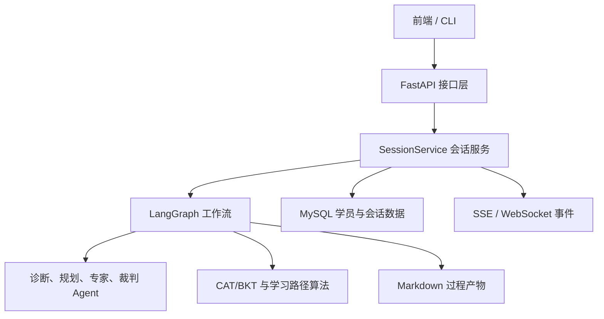
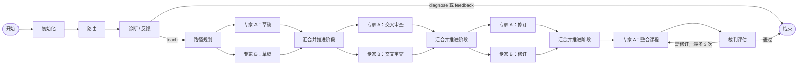
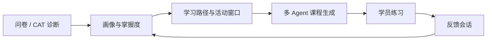

# 专利导学系统后端设计说明（不含 RAG）

## 1. 设计目标与范围

系统的后端目标是构建一名“懂学生、会教课、过程可控”的专利导学教师：先理解学习者的
基础与薄弱点，再生成受学习路径约束的课程，并通过多 Agent 协作提高课程质量，最终将练习
结果回流为下一次教学的依据。

本文只说明实现这一目标的核心后端技术与工作流，不包括领域知识库、文档处理、向量化、
召回、重排及检索上下文构造等内容。

## 2. 核心技术选型

### 2.1 为什么选择 FastAPI

后端需要面向前端提供会话创建、诊断作答、练习提交、状态查询和实时进度等接口，并且 Agent
生成过程耗时较长。FastAPI 提供了异步 Web 能力、自动 OpenAPI 文档和基于 Pydantic 的请求响应
校验，适合作为清晰的服务边界。

实现上，路由只负责协议转换和参数校验，业务处理统一进入 `SessionService`；课程工作流在后台
执行，客户端通过 REST 查询结果，并可用 SSE 或 WebSocket 订阅过程事件。这样可以避免把 Agent
编排逻辑写进 HTTP 处理函数，也不会因一次课程生成阻塞接口。

### 2.2 为什么选择 LangGraph

本系统不是单轮提示词调用，而是包含分支、并行、汇合和修订循环的长流程：不同意图走不同
路径；双专家必须并行但又要在同一阶段全部完成后才能继续；裁判要求修订时需要回到整合节点。
这类流程若用普通函数链或脚本变量控制，状态和异常边界会很快失控。

因此使用 LangGraph 的 `StateGraph` 显式描述节点、边和条件路由。每一步只读取共享状态并返回
状态更新，图负责决定下一步；并行汇合与循环都成为可检查、可测试的图结构，而不是隐含在
业务代码中的控制流。

### 2.3 为什么选择 Pydantic 合同与结构化输出

多 Agent 协作的主要风险是上游模型输出缺字段、字段类型错误或使用不约定的名称。一旦这类结果
直接进入后续节点，错误会沿着工作流放大。

系统为路由、诊断、规划、专家、裁判和反馈定义独立的 Pydantic 输出模型，并将 JSON Schema
传给模型。模型输出回到后端后仍需 Pydantic 校验；不合格时仅允许一次带错误信息的修复重试。
因此，模型只负责产生候选业务对象，是否能进入共享状态由后端合同决定。

### 2.4 为什么选择 MySQL 与 Markdown 过程产物分离

学习画像、掌握度、学习计划和会话状态是需要跨会话延续的业务事实，必须可以事务化查询和更新；
而专家草稿、审查意见和课程包更适合供人查看与复盘。二者不能混为一种存储形式。

生产环境以 MySQL 保存结构化的学员、会话、画像、掌握度、计划、作答和产物索引；每次工作流
同时生成会话级 Markdown 过程产物。数据库是业务真相，Markdown 是可读审计面，这样既支持
稳定查询，也保留课程生成过程的可解释性。

## 3. 总体架构

整体分工如下：

- FastAPI 是对外入口，提供稳定的学习、会话和事件接口。
- `SessionService` 管理会话生命周期，协调工作流执行、状态持久化和事件发布。
- LangGraph 是编排核心，负责多 Agent 的顺序、并行和回路。
- CAT/BKT 与课程路径模块负责确定性的个性化决策；模型不能绕过这些规则直接决定教学顺序。
- MySQL 记录跨会话的学习事实，Markdown 记录本次流程的可读过程。

## 4. 核心工作流设计

### 4.1 需要达成什么

教学流程既要利用不同专家的独立视角，又要保证课程有正确的先后顺序和统一的质量出口；
诊断、课程生成和练习反馈还必须能形成长期闭环。

### 4.2 工作流结构

默认教学主路径是“诊断 → 规划 → 双专家并行生成 → 交叉审查 → 修订 → 整合 → 裁判”。部署级
`PATENT_TUTOR_DEBATE_ENABLED=false` 时，后端构建单专家路径“诊断 → 规划 → Expert A draft → 裁判”；
该 draft 同时作为 `course_package`，不执行 Expert B、交叉审查、修订或整合。学员完成练习后，系统另外创建
feedback 会话更新学习证据，而不是让课程生成工作流一直等待学员答题。

### 4.3 节点职责

| 节点 | 主要作用 | 为什么这样设计 |
|---|---|---|
| `_init` | 初始化会话 ID、流程模式、专家阶段和运行状态 | 所有分支从一致的初始状态开始，避免节点自行补全关键字段 |
| `route` | 将用户请求识别为教学、诊断或问答意图 | 将不同目标分流，避免所有请求都触发完整课程生成 |
| `diagnosis_feedback` | 在诊断阶段形成学习者画像；在反馈阶段生成学习建议与画像更新 | 同一能力按阶段复用，诊断与练习反馈都能服务于个性化学习 |
| `planner` | 根据画像、掌握度、知识先修关系和混淆风险提出学习路径 | 将“教什么、先教什么”置于课程生成之前，并由确定性规则约束 |
| `expert_a` | 分阶段完成草稿、审查 B、修订和最终整合 | 保留主专家的连贯课程组织能力，最终负责整合而非简单拼接 |
| `expert_b` | 独立草稿、审查 A、修订 | 在初稿阶段不读取 A 的完整内容，保留独立视角以增加互补性 |
| `_experts_barrier` | 等待 A/B 同阶段完成后，唯一地推进专家阶段 | 防止一方先完成就使另一方跳过审查或修订，保证并行协作的顺序正确 |
| `expert_a_integration` | 以整合阶段调用既有专家 A | 复用专家 A 的能力，不增加一个职责重叠的 Agent |
| `judge` | 只评估整合课程并提出修订要求，不改写课程 | 避免“自己生成、自己审核”的职责冲突；修订次数上限防止无限循环 |

### 4.4 并行协作与质量控制

专家 A 与 B 在草稿、交叉审查和修订三个阶段并行执行。它们的输出不会直接互相覆盖，而是先由
汇合屏障确认双方完成，再将 `expert_phase` 推入下一阶段。整合阶段只由 A 处理双方已经结构化的
成果，随后由独立 Judge 给出接受、轻微修订或继续修订的结论。

这一设计将“多 Agent 协作”从简单的多次模型调用，变为具有阶段边界和质量出口的协同过程：
独立生成保证多样性，交叉审查暴露问题，裁判负责最终门控，有限修订保证流程能够收敛。

## 5. 个性化学习闭环

### 5.1 学情如何进入工作流

系统通过入学问卷和 CAT 诊断收集初始证据。CAT 根据当前答题情况选择下一题；BKT 为每个知识点
维护掌握概率和不确定性。诊断 Agent 将这些结构化证据与学习目标结合，生成五维学习者画像。

规划阶段同时考虑两类约束：

- 知识轴：静态知识 DAG 决定先修关系，防止课程跳过必要基础。
- 风险轴：当前掌握度、弱点和易混淆关系决定复习与强化的优先级。

模型可以提出学习路径，但后端负责拓扑校验、复用已存在的学习计划、推进学习游标以及计算本次
活动窗口。因此个性化并不依赖模型自由判断，而是建立在可验证的学习证据上。

### 5.2 反馈如何形成长期闭环

课程中的练习由学员在之后提交。服务端记录题目、作答和评分证据，feedback 会话据此更新画像与
掌握度，并给出继续、复习或再教学建议。下一次课程规划会读取最新的计划游标和 BKT 证据。

最终效果是，系统不会把每次课程看成孤立的内容生成任务，而是围绕同一位学习者持续积累证据、
调整路径并更新教学重点。

## 6. 状态与数据设计

`StateDict` 是工作流中唯一的共享状态合同，保存会话身份、流程模式、画像、路径、专家阶段
成果、裁判报告、反馈结果和运行状态。事件与过程产物采用追加式合并，避免并行节点覆盖已有
记录；每个 Agent 的最终输出都必须通过 Pydantic 校验后才能写入状态。

跨会话数据由 MySQL 保存，重点包括：学员画像与历史、知识点掌握度、学习计划与游标、会话状态、
诊断与练习作答、产物索引。过程中的草稿、审查意见和课程包以 Markdown 按会话归档，便于回看。

这种设计的核心效果是把“模型输出”“当前流程状态”和“长期学习事实”分开管理：模型输出必须
先满足合同，状态只服务于当前编排，长期数据则可在下次学习时被可靠复用。

## 7. 最终技术效果

通过以上设计，后端实现了以下核心能力：

- 将复杂的多 Agent 协作固化为可视、可测试的状态图，而不是脆弱的脚本流程。
- 将学习路径和阶段推进保留在确定性后端中，避免模型跳过先修知识或绕过质量门控。
- 用双专家、交叉审查、独立裁判和有限修订，实现多视角生成与可收敛的质量控制。
- 用 CAT、BKT、学习计划和练习反馈构成跨会话的个性化学习闭环。
- 用严格输出合同、结构化持久化和过程产物，使每次课程的输入、过程和结果都可追溯。

主要实现位置为：`backend/app/graph/workflow.py`（图与节点调度）、
`backend/app/schemas/state.py`（状态与输出合同）、`backend/app/services/session_service.py`
（会话服务）、`backend/app/learner_memory/` 与 `backend/app/curriculum/`（个性化学习）、
`backend/app/persistence/`（长期数据）。
