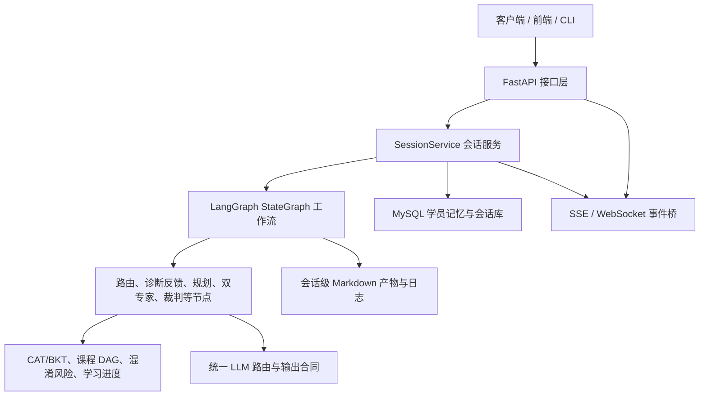
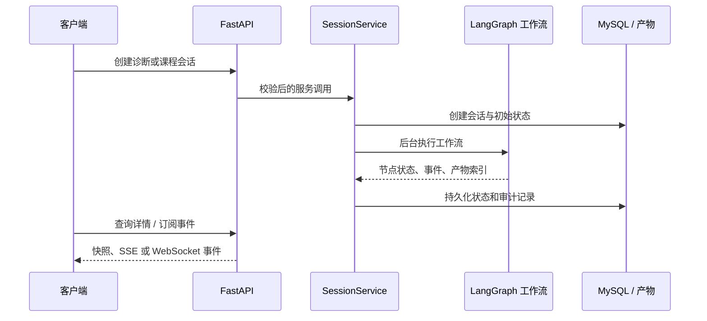
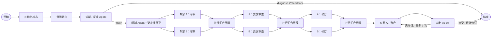

# 专利导学系统后端系统设计说明（不含 RAG）

## 1. 文档目的与范围

本文说明专利导学系统**已经落地的后端设计**，按“需要达成什么 → 做了什么设计 →
采用什么技术方法 → 最终技术效果”的顺序，从整体架构逐步展开。运行时行为以
`backend/app/graph/workflow.py`、`backend/app/schemas/state.py` 和 FastAPI 路由为准。

本文的边界如下：

- 覆盖：会话与 API、学情诊断、个性化路径、多 Agent 编排、模型适配、练习反馈、
  MySQL 持久化、事件推送、过程产物、可靠性与安全边界。
- 不覆盖：领域知识库建设、文档处理、向量化、召回、重排、检索上下文构造及其基础设施。
- 不描述前端界面、图表或部署编排；它们仅作为后端接口的消费者或运行环境存在。

## 2. 总体设计

### 2.1 需要达成什么

系统面向知识产权管理与专利代理实务学习，目标不是一次性生成一份通用教程，而是形成
“懂学生、会教课、过程可控、结果可追溯”的个性化导学闭环：

1. 用问卷、诊断与作答证据了解学习者；
2. 基于掌握度、先修关系和易混淆点制定可执行的学习路径；
3. 让不同角色的 Agent 独立产出、交叉审查并由独立裁判评估；
4. 将课程、练习、反馈和学习状态沉淀为可恢复、可审计的数据；
5. 通过稳定 API 和实时事件，让外部客户端能创建、观察、取消和回看学习会话。

### 2.2 做了什么设计

后端采用“接口层—会话服务层—工作流编排层—领域能力层—持久化与产物层”的分层。
FastAPI 只处理 HTTP 协议和请求校验；`SessionService` 管理一次会话的生命周期；
LangGraph 负责状态驱动的多 Agent 编排；课程、学情和记忆模块提供确定性领域能力；
MySQL 与会话目录分别保存结构化事实和可读过程产物。

### 2.3 实现使用的技术方法

- Python 3.11+ 与 FastAPI 承担 Web 服务、Pydantic 承担输入输出模型校验。
- LangGraph 的 `StateGraph` 将节点、条件路由、并行汇合和循环显式表达为有向图。
- `StateDict` 是节点间唯一共享状态合同；事件、产物等字段通过追加归约器合并。
- MySQL 8.0+/InnoDB 保存业务事实，Markdown 文件保存面向人工审阅的过程快照。
- 统一 LLM Client/Router 隔离提供商差异，避免业务节点直接依赖某一家模型接口。

### 2.4 最终技术效果

业务流程不再依赖某个脚本中的隐式顺序或临时变量。每个学习会话都有明确状态、可见阶段、
可查询结果和审计轨迹；模型负责需要语义判断或生成的部分，关键边界、状态推进和持久化由
确定性程序控制，兼顾个性化能力与工程可控性。

## 3. 总体能力与设计映射

| 需要达成什么 | 做了什么设计 | 技术方法 | 最终技术效果 |
|---|---|---|---|
| 千人千面的学习起点 | 问卷、CAT 诊断、五维画像与 BKT 掌握度共同建模 | 自适应选题、贝叶斯知识追踪、Pydantic 画像合同 | 新学员可冷启动，已有学员可依据历史继续学习 |
| 课程有先后且能针对薄弱点 | 双轴路径与活动窗口设计 | 知识 DAG 拓扑约束、混淆风险、确定性候选筛选 | 学习内容受先修关系约束，单次课程聚焦当前最需要的节点 |
| 生成内容多视角且可收敛 | 双专家并行、交叉审查、整合、独立裁判 | LangGraph 并行扇出、汇合屏障、有限次修订循环 | 避免单 Agent 自产自审，保留差异化观点并控制生成成本 |
| 各 Agent 的数据可安全互通 | 统一运行时状态和严格输出合同 | `TypedDict`、追加归约器、JSON Schema、Pydantic 二次校验 | 节点可替换、可测试，异常输出不会直接污染状态 |
| 多模型能够平滑切换 | Provider 与 Agent 解耦 | OpenAI 兼容调用适配、按 Agent 选模型、重试、参数能力过滤 | 配置可复用；不支持的请求参数会在发送前忽略而不是使会话失败 |
| 学习结果可沉淀和恢复 | 结构化业务库与过程产物分离 | MySQL 事务、版本化学习计划、会话级 Markdown manifest | 可按学员、会话和时间回看学习证据，不把文件当作业务真相 |
| 客户端可实时观察且可安全操作 | REST、SSE、WebSocket 与取消机制 | 薄路由、后台会话线程、事件桥、请求 ID、状态机 | 创建后可异步查看进度，失败和取消状态对外可见 |

## 4. 接口与会话层

### 4.1 需要达成什么

后端需要同时支持入学问卷、诊断、课程生成、练习提交、会话查询、实时进度和产物回看，
并防止 HTTP 处理逻辑绕过工作流或直接操作 Agent。

### 4.2 做了什么设计

`backend/main.py` 创建应用并注入 `SessionService`；API 路由按资源拆分为健康检查、
问卷与学习流程、会话、学员、事件、产物等模块。路由层只完成认证/参数解析/响应映射，
领域动作统一交由服务层。

典型调用链如下：

### 4.3 实现使用的技术方法

- FastAPI 路由使用请求/响应模型约束外部数据；`GET /sessions` 只返回轻量摘要，完整状态
  由单会话详情接口提供。
- 会话在守护线程中运行，HTTP 创建请求无需等待整个 Agent 流程完成；服务层通过
  `anyio.run()` 执行异步工作流入口。
- 服务维护 `running`、`completed`、`failed`、`canceled` 状态，并提供等待、取消、过期清理
  和服务就绪检查。
- `SessionEventBridge` 将节点进度转换为 SSE/WebSocket 可消费事件；全局请求 ID 中间件用于
  关联一次请求的日志与排障线索。

### 4.4 最终技术效果

接口消费者只需要面对稳定的资源接口和事件流，不需要理解 Agent 内部调用。耗时生成不会
阻塞请求线程，系统可在会话执行过程中查询状态、取消任务或读取已完成的中间产物。

## 5. 工作流与多 Agent 协同

### 5.1 需要达成什么

课程生成既要利用多角色的专业视角，又要避免并发结果乱序、不同阶段互相覆盖，且裁判必须
只评估、不直接替代专家生成内容。

### 5.2 做了什么设计

后端把工作流定义为显式状态图。教学主路径为“诊断 → 规划 → 双专家草稿 → 双向交叉审查
→ 双专家修订 → 专家 A 整合 → 裁判评估”。练习提交则创建独立反馈会话，避免把学习期间的
长等待塞进课程生成图。

### 5.3 实现使用的技术方法

- `StateGraph(StateDict, context_schema=WorkflowContext)` 声明节点和边；条件函数仅根据已校验
  状态选择下一跳。
- 专家 A、B 不是多个复制节点，而是以 `expert_phase` 重入同一 Agent 工厂，依次执行
  `draft`、`cross_review`、`revision`、`integration` 阶段。
- `_experts_barrier` 是确定性汇合点，只有 A/B 都完成同一阶段时才能推进阶段；整合阶段仅由
  A 执行。
- Judge 输出裁决和修订请求；`revise` 回到整合阶段。当前实现把修订上限设为 3 次，超过后
  结束会话并保留裁判报告，防止无限循环。
- Agent 节点通过依赖注入接收 `LLMClient`，不在节点内读取提供商全局状态，也不直接写数据库
  或文件。

### 5.4 最终技术效果

并发带来独立草稿和审查视角，汇合屏障保证阶段顺序；裁判与生成职责分离，修订过程可回放。
工作流的每个跳转都有代码可读的状态依据，便于单元测试、故障定位和后续增加节点。

## 6. 状态合同与生成可信边界

### 6.1 需要达成什么

LLM 输出具有不确定性，多个节点同时更新状态时也容易发生字段覆盖。因此需要让“模型生成”
只在严格合同内生效，并让状态演进可验证。

### 6.2 做了什么设计

`StateDict` 定义整个运行期的共享字段，包含会话身份、模式、学员画像、路径决策、各阶段
专家输出、裁判报告、反馈结果、状态和事件。所有最终 Agent 输出分别对应 Pydantic
`ContractModel`，其默认禁止未知字段。

### 6.3 实现使用的技术方法

- `events`、`artifacts` 等字段采用 `operator.add` 归约器，节点只能追加而不会覆盖既有审计
  信息。
- 模型输出先使用完整 JSON Schema 约束；回到本地后仍执行 Pydantic 校验。
- 对字段别名做提供商无关的归一化；校验失败时附带精确错误信息进行一次修复重试，第二次仍
  失败则中止该次生成而不是写入不合格状态。
- 对不接受严格 Schema 的兼容接口，运行时会记录能力并回退到 JSON 对象模式；本地模型校验
  始终保留为最终信任边界。

### 6.4 最终技术效果

节点之间传递的是可验证的业务对象，而不是自由文本。并行流程中的事件和产物不会互相丢失；
提供商兼容性问题可降级处理，但不会削弱服务端的状态合同。

## 7. 多模型访问与参数兼容

### 7.1 需要达成什么

不同 Agent 可以选择不同 Provider 和模型，但调用方式、超时、重试、结构化输出和参数能力
必须一致，且共享配置不应因少数模型不支持某参数而失效。

### 7.2 做了什么设计

`AgentLLMRouter` 根据全局默认、每 Agent 配置和环境变量覆盖选择 Provider/模型；
`LLMClient` 暴露普通 JSON、严格结构化 JSON、原生工具调用三类统一能力。模型能力判断放在
请求适配边界，而不把限制扩散到业务配置和 Agent 提示词中。

### 7.3 实现使用的技术方法

- 使用 OpenAI 兼容的 Chat Completions 请求适配多个 Provider，集中管理 base URL、密钥、
  超时和重试策略。
- 为每个 Provider 配置并发信号量，限制同时在飞的请求，降低上游排队与限流导致的超时。
- 根据 Provider/模型名决定是否发送 `temperature`。例如 GPT-5.6 系列及 `luna`、`terra`
  别名不发送该字段；YAML 中的共享温度配置仍允许存在，运行时直接忽略不支持的参数。
- 提供 `AGENT_PROVIDER` 等环境变量覆盖，便于某一上游故障时进行定向切换，而无需改动 Agent
  业务代码。

### 7.4 最终技术效果

模型切换从业务节点中抽离。配置可以表达期望参数，最终请求只携带目标模型支持的字段；既能
避免不兼容参数导致 4xx 错误，也避免为不同模型维护多份 Agent 配置。

## 8. 个性化学习与进度闭环

### 8.1 需要达成什么

系统需要依据学习证据决定“从哪里开始、接下来学什么、一次讲多少、何时复习”，而不是让
语言模型自由编造整个学习顺序。

### 8.2 做了什么设计

学员进入课程前可先完成问卷与 CAT 诊断；系统生成五维画像并维护知识点掌握度。规划阶段
同时考虑静态知识先修轴和随学员变化的混淆风险轴，LLM 只提出候选路径，后端保留最终校验、
学习计划复用、游标推进和活动窗口选择权。练习提交会启动独立 feedback 会话，将评价结果
反馈到画像与掌握度。

### 8.3 实现使用的技术方法

- `CATEngine` 从题库中选择下一题，并依据答题过程与先修阈值推进诊断。
- `BKTTracker` 以先验、猜测率、失误率和学习转移等参数更新每个知识点的掌握概率，同时保留
  不确定性与作答证据。
- `curriculum` 模块从运行时知识 DAG 与混淆对数据构造双轴快照；路径必须通过拓扑关系检查。
- 匹配相同学习目标和知识版本的活跃计划时，复用完整节点序列与游标；每次教学会话仍依据最新
  掌握度、弱点和风险重新计算活动窗口。历史复习最多选择两个已完成节点，并可为高风险先修点
  预留一个位置。
- 服务端登记练习、作答、评分和掌握度事件，再按反馈结果决定继续、复习或再教学。

### 8.4 最终技术效果

学习路径既能因人而异，又不会违反领域知识的先修顺序。模型生成内容被限制在当前活动窗口内，
诊断、练习和后续课程共享同一份学习证据，形成可持续更新而非一次性生成的学习闭环。

## 9. 持久化、产物与审计

### 9.1 需要达成什么

用户需要跨会话保留画像、计划、进度和历史；研发与教学人员也需要看到每次生成经历了哪些
阶段，但不能把展示文件当作可修改的业务真相。

### 9.2 做了什么设计

生产环境以 `MySQLLearnerStore` 作为统一学习者存储，实现 Store 兼容接口和规范化业务写入。
结构化状态保存在关系表中，Markdown 过程文件按会话写入 `artifacts/sessions/{session_id}/`；
数据库只保存产物索引、归属、路径和哈希等元数据。

### 9.3 实现使用的技术方法

- MySQL/InnoDB 通过事务保存学员、会话、会话状态、画像快照与历史、节点掌握度、学习计划及
  节点、问卷、诊断题与作答、练习尝试、掌握度事件和产物索引等事实。
- 学习计划与其节点独立版本化保存：会话内的路径记录用于审计，跨会话的计划与游标才是连续
  学习的事实来源。
- 图运行时副作用包装层统一渲染 Markdown、更新 manifest、写入 JSONL 工作流日志；Agent 节点
  不拥有文件 I/O 权限。
- 产物读取限定在会话目录并校验路径，避免目录穿越；学员侧题目读取不返回答案或内部评分依据。
- SQLite 实现仅用于单元测试替身，生产入口默认注入 MySQL 存储。

### 9.4 最终技术效果

业务数据可事务化恢复和查询，过程文件则方便人类审阅。两者分离后，文件删除、重渲染或展示
格式调整不会篡改学员主数据；每个结果也能关联到产生它的会话和阶段。

## 10. 可靠性、可观测性与安全边界

### 10.1 需要达成什么

后端要能应对上游模型抖动、格式错误、并发冲突、长期任务中断和敏感答案泄露，并让问题有
可定位的证据。

### 10.2 做了什么设计

可靠性机制分布在调用、工作流、服务和数据四层：模型调用有超时/重试/并发控制，工作流有
严格合同与有限循环，服务有状态与取消控制，数据层有事务与审计记录。

### 10.3 实现使用的技术方法

- 对可重试上游错误执行重试；对严格 Schema 不兼容执行能力降级；对格式错误执行一次受控修复。
- 会话服务在节点更新时合并状态、持久化快照并发布事件；异常会转换为失败状态，而不是静默
  结束。
- 取消请求通过取消感知的 LLM 客户端和会话状态检查传递到运行过程。
- 健康检查与就绪检查区分服务存活和依赖可用性；请求 ID、工作流日志、事件流、manifest 和
  数据库审计共同构成排障链路。
- API 与产物读取遵守最小暴露原则，内部答案、评分依据和运行时私有字段不作为普通学员数据
  返回。

### 10.4 最终技术效果

系统在模型或网络异常时能够给出可见失败而非不一致结果，在并发流程中保留完整证据，并能
通过会话 ID 追踪请求、状态、日志和产物。安全边界集中在 API、存储和文件读取入口，降低
业务节点各自实现防护造成的不一致。

## 11. 实现映射与技术效果总结

| 设计区域 | 主要实现位置 | 形成的效果 |
|---|---|---|
| 应用与 API | `backend/main.py`、`backend/app/api/` | 统一 HTTP 边界、会话资源和实时事件接口 |
| 会话生命周期 | `backend/app/services/session_service.py` | 异步执行、取消、状态快照、事件发布与持久化协调 |
| 工作流 | `backend/app/graph/workflow.py` | 显式路由、双专家并行、确定性屏障和有限修订循环 |
| 状态与合同 | `backend/app/schemas/state.py`、`backend/app/agents/common.py` | 严格结构化输出、Pydantic 校验、可组合状态 |
| 模型适配 | `backend/app/core/llm.py`、`backend/app/core/model_capabilities.py` | 多 Provider 调用、重试、并发约束与参数兼容 |
| 个性化学习 | `backend/app/learner_memory/`、`backend/app/curriculum/` | CAT/BKT、双轴路径、活动窗口与学习闭环 |
| 业务存储 | `backend/app/persistence/` | MySQL 事务化持久化、版本化计划、审计记录 |
| 运行产物 | `backend/app/runtime_outputs/` | 会话级 Markdown、manifest、工作流日志和安全读取 |

综上，后端把“个性化教学”和“多 Agent 协同”拆解为可验证的状态机、可替换的模型适配层、
可复用的学习领域算法和可追溯的数据边界。它既保留模型在诊断、规划建议、课程生成和评估中的
语义能力，又将阶段推进、路径约束、输出校验、数据落库和审计责任收回到确定性后端，从而获得
可控、可观测、可演进的工程实现。
