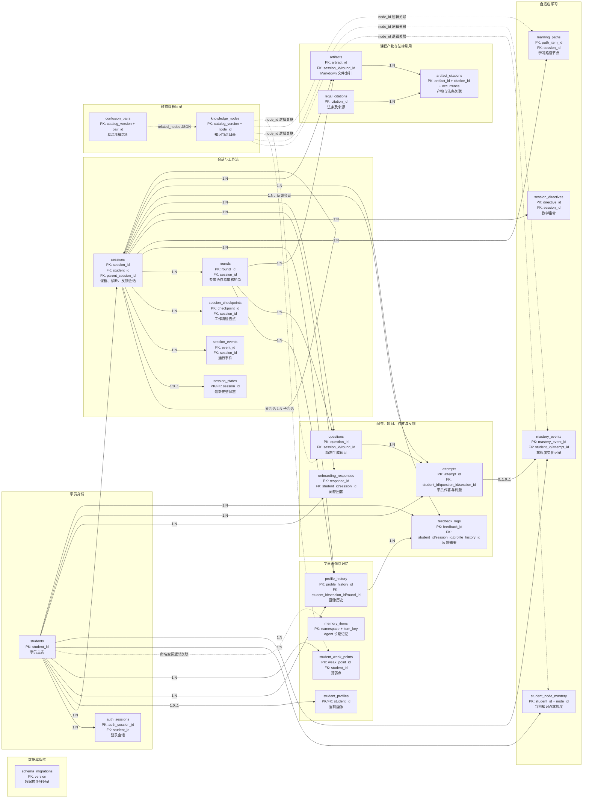

# 专利导学系统数据库实体关系图

图中实线表示数据库外键，虚线表示通过 `node_id`、命名空间或 JSON 字段形成的逻辑关联。



## 业务主线

学员提交问卷后，系统创建课程会话并建立画像，再根据画像和掌握度规划学习路径。课程生成阶段
产生题目和 Markdown 产物。学员提交答案后，系统记录作答、更新知识点掌握度、生成反馈，并
形成新的画像版本。

```text
学员 → 问卷 → 课程会话 → 画像 → 学习路径 → 课程和题目
                                              ↓
更新画像 ← 反馈 ← 更新掌握度 ← 学员作答 ←─────────┘
```

## 关系说明

- `students` 是学员数据的根表。
- `sessions` 是课程生成、诊断、聊天和反馈流程的中心表。
- 反馈会话通过 `parent_session_id` 指向原课程会话。
- `questions → attempts → mastery_events` 构成学习效果更新链。
- `student_profiles` 和 `student_node_mastery` 保存当前结果。
- `profile_history` 和 `mastery_events` 保存变化历史。
- `artifacts` 保存 Markdown 文件的路径、哈希和归属，不保存完整正文。
- `artifact_citations` 连接课程产物和法条，表达多对多关系。
- `schema_migrations`、`memory_items` 和静态课程目录不直接处于业务主链中。
