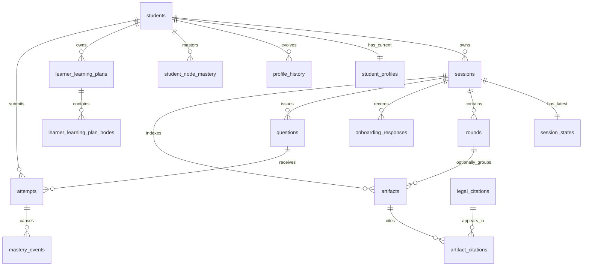

# 专利导学系统精简关系数据库设计（审查草案）

> 状态：**待审查，不改变现有运行时、迁移或 API**
> 版本：vNext-draft-1（2026-07-28）
> 目标：以 MySQL 8.0+ 为唯一业务关系库，将当前约 30 张表收敛为 **18 张物理表**（16 张业务表 + 2 张运行支撑表）。

## 1. 审查结论

这份草案综合了两份设计的有效部分：

- 保留预期设计中的学员、画像演进、BKT、课程会话、题目/作答、产物文件索引和法条溯源；
- 保留当前实现中已经验证必要的会话状态快照、幂等作答、BKT 事件审计、跨会话学习计划游标、父子反馈会话和 Artifact 哈希；
- 舍弃 SQLite/独立业务库并存、静态知识图镜像、未接入认证会话、未接入 LangGraph checkpoint，以及同一事实的多套过程表。

核心判断是：**MySQL 保存业务事实、当前投影和最小审计链；`StateDict` 保存工作流协作状态；Markdown 保存在 Artifact 文件；知识 DAG/混淆对仍由后端 JSON 运行时资产负责。** 数据库不是 Agent 间的共享黑板，Agent 也不直接写库。

### 1.1 本草案的物理表数量

| 分组 | 表数 | 表 |
|---|---:|---|
| 运行支撑 | 2 | `schema_migrations`、`memory_items` |
| 学员与画像 | 4 | `students`、`student_profiles`、`profile_history`、`student_node_mastery` |
| 会话与课程过程 | 5 | `sessions`、`session_states`、`rounds`、`learner_learning_plans`、`learner_learning_plan_nodes` |
| 学习闭环 | 4 | `onboarding_responses`、`questions`、`attempts`、`mastery_events` |
| 产物与引用 | 3 | `artifacts`、`legal_citations`、`artifact_citations` |
| **合计** | **18** | **16 张业务表 + 2 张运行支撑表** |

`memory_items` 只为现有 Store 兼容层保留，不是画像、掌握度、学习计划或会话状态的权威来源；若未来 LangGraph Store 有稳定的独立持久化方案，可作为单独的运维迁移移出本库，不会影响 16 张业务表。

## 2. 数据边界与权威来源

| 数据 | 权威位置 | 原因 |
|---|---|---|
| 账号、会话、画像、学习计划、题目、作答、BKT、Artifact 索引、引用 | MySQL | 需要事务、关系查询、幂等和审计 |
| 完整课程包、专家草稿、评审报告、反馈报告 | `artifacts/sessions/{session_id}/` Markdown | 正文面向人阅读，数据库只保存安全索引与哈希 |
| 知识 DAG、易混淆对 | `backend/app/curriculum/data/` | 当前运行时静态资产；不复制为易失真的数据库镜像 |
| 法律语料及向量 | Milvus | 需要向量检索，不属于关系业务事实 |
| 单次图执行中的协作上下文 | `StateDict` | 节点之间通过图状态传递，而不是直接读写数据库 |
| 兼容性 episodic memory | `memory_items` | 仅适配现有 Store API，不能覆盖结构化业务事实 |

### 2.1 必须保持的唯一数据源

- 当前画像：`student_profiles`；历史画像：`profile_history`。
- 当前掌握度：`student_node_mastery`；每次变化的依据：`mastery_events`。
- 当前完整学习路线及游标：当前 `active` 的 `learner_learning_plans` 和其节点表。
- 单次会话的完整结构化结果：`session_states.state_json`；它含有该次的 `learning_path`、活动窗口和事件列表。
- 课程/反馈正文：磁盘上的 Markdown；`artifacts` 只做可验证索引。
- 静态知识定义：后端 JSON，不能由数据库行反向覆盖。

## 3. 关键取舍

### 3.1 统一初始诊断与课程作答

不再单独维护 `diagnostic_sessions`、`diagnostic_attempts`、`diagnostic_mastery_events` 三张表。

初始 CAT 诊断也是一种 `sessions.workflow_mode='diagnose'` 的会话：

1. 向学员出示固定诊断题时，在 `questions` 写入该题的**题目快照**，并标记 `origin='diagnostic_catalog'`；
2. 学员答题写入统一的 `attempts`，以 `(student_id, idempotency_key)` 防重；
3. 对直接观测和 DAG 推断分别在统一的 `mastery_events` 写事件，使用 `event_kind='observed'/'inferred'` 区分；
4. CAT 当前进度、候选题和课程衔接信息保存在该诊断会话的 `session_states.state_json`；诊断完成后创建或关联课程会话。

这样仍可审计每道诊断题、每次直接观测和每次推断，却避免三组与课程闭环平行的主键、幂等和 BKT 表。

### 3.2 只保留一套会话持久化事实

保留 `sessions`（生命周期）和 `session_states`（最新完整 `StateDict` 快照）。删除独立的 `session_events`：当前 StateDict 的 `events` 已是追加字段，并会随状态快照落库；SSE/WebSocket 仍是实时传输机制，不需要再存一份逐事件 JSON。

这不等同于支持中断续跑。当前 LangGraph checkpointer 是内存实现；在真正采用官方兼容的 MySQL checkpointer 前，设计不保留空置的 `session_checkpoints` 表，也不宣称可从任意节点恢复执行。

### 3.3 路线只保留“跨会话计划”和“会话快照”各一份

- `learner_learning_plans` + `learner_learning_plan_nodes`：跨课程、跨反馈的权威完整路线、游标和节点状态；
- `session_states.state_json`：本会话实际采用的路径、0～2 个复习节点、题目范围及 planner 决策审计。

因此删除 `learning_paths` 和 `session_directives`。它们分别与上述两类数据重复，且现有查询可从计划表或会话状态取得。不同会话即使复用同一计划，也会在自己的状态快照中留下活动窗口，满足审计需要。

### 3.4 画像和反馈不做重复投影

`student_profiles.profile_json` 保存完整当前画像，包含薄弱点；`profile_history` 保存不可变快照。删除 `student_weak_points` 和 `feedback_logs`：前者是画像 JSON 的重复投影，后者与反馈会话状态、画像历史和 mastery 事件重复。若后续产品证明需要按“薄弱点标签”进行高频筛选，再以 JSON 生成列/函数索引补充，而不是先维护双写表。

## 4. 逻辑 ER 图

`sessions.parent_session_id` 是自关联：反馈会话指向其课程会话。`rounds` 只用于课程生成中的专家协作和 Judge 整合尝试，不用于初始诊断或普通聊天。

## 5. 表设计

### 5.1 运行支撑（2 张）

| 表 | 核心字段 | 约束和说明 |
|---|---|---|
| `schema_migrations` | `version`, `applied_at` | 仅记录 DDL 版本；生产环境部署阶段显式应用。 |
| `memory_items` | `namespace`, `item_key`, `value_json`, timestamps | 联合主键 `(namespace, item_key)`；兼容 Agent memory API，禁止作为业务权威来源。 |

### 5.2 学员与画像（4 张）

| 表 | 核心字段 | 约束和说明 |
|---|---|---|
| `students` | `student_id`, `login_id`, `password_hash`, `display_name`, `email`, `status`, timestamps | `login_id` 唯一；邮箱非空时唯一；保留身份根实体，但本期不创建未实现的登录令牌表。 |
| `student_profiles` | `student_id`, `profile_json`, `knowledge_level`, `profile_version`, `updated_at` | 每学员一行当前投影；`profile_json` 包含五维画像和弱点。 |
| `profile_history` | `profile_history_id`, `student_id`, `session_id?`, `round_id?`, `source`, `profile_version`, `profile_json`, `mastery_snapshot`, `snapshot_at` | 只追加；保存诊断或反馈后的可解释快照。 |
| `student_node_mastery` | `student_id`, `node_id`, `pl`, `observations`, `inferred`, `correct_count`, `incorrect_count`, `last_attempt_id?`, `model_version`, `updated_at` | 联合主键 `(student_id, node_id)`；`pl` 在 `[0,1]`；这是 Planner 的当前 BKT 来源。 |

### 5.3 会话与课程过程（5 张）

| 表 | 核心字段 | 约束和说明 |
|---|---|---|
| `sessions` | `session_id`, `student_id?`, `parent_session_id?`, `workflow_mode`, `status`, `learning_goal`, `input_payload`, `error_message`, `workflow_version`, timestamps | 覆盖 `auto/teach/chat/diagnose/feedback`；反馈使用父会话；按 `(student_id, created_at)` 和 `(status, updated_at)` 索引。 |
| `session_states` | `session_id`, `state_json`, `revision`, `updated_at` | 每会话一条最新完整 StateDict；乐观修订防止旧更新覆盖新更新。`events`、会话路径及活动窗口随 StateDict 保存。 |
| `rounds` | `round_id`, `session_id`, `round_number`, `integration_attempt`, `stage`, `status`, `judge_decision`, timestamps | 唯一 `(session_id, round_number, integration_attempt)`；Judge `revise` 增加整合尝试，不覆盖既有产物。 |
| `learner_learning_plans` | `plan_id`, `student_id`, `source_session_id?`, `last_session_id?`, `learning_goal`, `learning_goal_hash`, `knowledge_graph_version`, `plan_version`, `status`, `current_node_id?`, `current_order_idx?`, `progress_json`, `replan_reason`, `last_progress_decision`, timestamps | 每位学员通过事务和锁保证最多一条 `active`；目标或图版本变化时保留旧版本并新建。 |
| `learner_learning_plan_nodes` | `plan_node_id`, `plan_id`, `node_id`, `node_name`, `prerequisites`, `difficulty_cap`, `strategy`, `node_json`, `order_idx`, `node_status`, timestamps | 唯一 `(plan_id,node_id)`、`(plan_id,order_idx)`；节点状态为 `pending/current/completed`。 |

### 5.4 学习闭环（4 张）

| 表 | 核心字段 | 约束和说明 |
|---|---|---|
| `onboarding_responses` | `response_id`, `student_id`, `session_id?`, `questionnaire_version`, `responses_json`, `submitted_at` | 保留原始问卷，课程会话也在 `input_payload` 留下必要上下文。 |
| `questions` | `question_id`, `session_id`, `round_id?`, `origin`, `qid`, `kind`, `category`, `difficulty`, `question_key`, `source_tag`, `kc_node_id`, `skills_json`, `question_text`, `answer_json`, `options_json`, `evidence_json`, `question_version`, `status`, `created_at` | `origin` 为 `generated_course` 或 `diagnostic_catalog`；诊断题在发题时快照化，课程题由最终课程包登记。内部答案绝不出现在学员接口。 |
| `attempts` | `attempt_id`, `student_id`, `question_id`, `session_id`, `raw_answer_json`, `selected_option`, `is_correct?`, `grading_status`, `grading_source`, `response_ms?`, `idempotency_key`, timestamps | 唯一 `(student_id,idempotency_key)`；服务端判题，不信任客户端 `observed_correct`。 |
| `mastery_events` | `mastery_event_id`, `student_id`, `node_id`, `attempt_id?`, `event_kind`, `observed_correct?`, `prior_pl`, `predicted_pl?`, `posterior_pl`, `updated_pl`, BKT 参数、`model_version`, `created_at` | `event_kind` 为 `observed/inferred`；直接观测唯一 `(attempt_id,node_id,event_kind)`；推断事件同样关联触发作答。 |

### 5.5 产物与引用（3 张）

| 表 | 核心字段 | 约束和说明 |
|---|---|---|
| `artifacts` | `artifact_id`, `session_id`, `round_id?`, `artifact_kind`, `source_field`, `content_path`, `content_sha256`, `created_by`, `title`, `created_at` | 正文不入库；读取时校验会话归属、Markdown 路径和 SHA-256。 |
| `legal_citations` | `citation_id`, `article`, `source_name?`, `source_uri?`, `chunk_ref?`, `retrieval_method?`, `quote_text?`, `verification_status`, `created_at` | 引文本体可被多个 Artifact 复用，支持检索来源和人工核验。 |
| `artifact_citations` | `artifact_id`, `citation_id`, `field_name?`, `occurrence` | 多对多关系；联合主键 `(artifact_id,citation_id,occurrence)`。 |

## 6. 关键事务与写入路径

| 业务动作 | 同一事务内必须完成 | 不在本事务内 |
|---|---|---|
| 创建会话 | `students` 确保存在（如需要）、`sessions`、初始 `session_states` | Markdown manifest 写入；失败需补偿状态 |
| 问卷提交 | `onboarding_responses`、课程会话输入/状态更新 | 问卷 Markdown 写入与索引由 Artifact Writer 处理 |
| CAT/课程作答 | `attempts`、所有对应 `mastery_events`、`student_node_mastery` | 反馈会话或下一次课程生成 |
| 保存画像 | `student_profiles`、`profile_history` | `memory_items` 可作为兼容投影，但不能反向覆盖业务表 |
| 新建/推进计划 | 锁定 `students` 行；旧计划状态变更或新计划、节点、游标更新 | 会话状态中的活动窗口快照 |
| 图更新持久化 | `session_states` 修订、`rounds`、最终题目登记、Artifact 索引和引用关系 | Markdown 文件由图副作用包装层先/后写入，并需校验索引一致性 |

标准路径仍是：**Agent 合同校验 → StateDict 更新 → 图/服务层持久化适配器 → MySQL 与 Artifact Writer**。专家 A/B 并行时，依赖主键、唯一约束与事务，不依赖“谁先写入”。

## 7. 从当前 30 表到新模型的处置

| 当前表 | 新草案处置 | 理由 |
|---|---|---|
| `schema_migrations`、`memory_items`、`students`、`sessions`、`session_states`、`rounds`、`student_profiles`、`profile_history`、`student_node_mastery`、`learner_learning_plans`、`learner_learning_plan_nodes`、`onboarding_responses`、`questions`、`attempts`、`mastery_events`、`artifacts`、`legal_citations`、`artifact_citations` | 保留 | 已接入主链路或是最小可查询、可审计模型的必要事实。 |
| `auth_sessions` | 移出首期 | 当前无注册/登录/刷新/撤销 API；账户表足够支撑现阶段 learner ID。认证落地时以完整认证设计单独新增。 |
| `session_events` | 并入 `session_states.state_json.events` | 与 StateDict 追加事件重复；SSE/WebSocket 是实时通道。 |
| `session_checkpoints` | 移出首期 | 当前未接入，且并不提供真正图恢复。采用正式 checkpointer 时再按其协议设计。 |
| `student_weak_points` | 并入 `student_profiles.profile_json` 与 `profile_history` | 当前是可从画像得到的双写投影，缺少实际高频查询需求。 |
| `learning_paths` | 并入活动计划节点与会话状态 | 会话路径与跨会话路线重复；本次活动窗口由状态快照保留。 |
| `session_directives` | 并入 `session_states.path_decision` | 题目范围/迭代指令是单次工作流决策，不需版本化平行表。 |
| `feedback_logs` | 并入反馈会话状态、画像历史、BKT 事件和反馈 Artifact | 不引入新的独立业务事实。 |
| `knowledge_nodes`、`confusion_pairs` | 不入库 | 后端 JSON 已是当前运行时权威资产，数据库 seed 还未接入。 |
| `diagnostic_sessions` | 并入 `sessions` | 诊断本身是 `workflow_mode='diagnose'` 的会话。 |
| `diagnostic_attempts` | 并入 `questions` + `attempts` | 诊断题以题目快照统一建模，复用答案安全和幂等机制。 |
| `diagnostic_mastery_events` | 并入 `mastery_events` | 以 `event_kind` 区分直接观测与 DAG 推断，保留完整审计。 |

## 8. MySQL 约定

- MySQL 8.0+、InnoDB、`utf8mb4`、UTC `DATETIME(6)`；JSON 使用 MySQL 原生 `JSON`。
- 业务主键沿用字符串 ID；`plan_node_id` 可使用自增 `BIGINT UNSIGNED`。
- 核心关系使用外键；只对确有生命周期依赖的关系使用级联删除，默认优先保留历史而非级联清理。
- 关键约束：BKT 概率范围、会话/计划/轮次状态枚举、作答幂等键、计划节点顺序、轮次整合尝试、BKT 事件去重。
- 关键索引：会话的学员/时间和状态/时间，画像历史的学员/时间，掌握度的学员，题目的会话/轮次和概念键，作答的学员/时间与题目，计划的学员/状态/版本，Artifact 的会话/类型。

## 9. 明确不做的事情

- 不恢复“SQLite 记忆库 + 独立 SQLite/业务库”双权威架构；生产业务数据统一进入 MySQL。
- 不把完整 Markdown、LangGraph checkpoint 二进制或向量语料塞进关系库。
- 不让 Agent 节点直接写数据库、直接写文件或绕过 `StateDict` 合同。
- 不为了凑关系模型而把知识 DAG、混淆对、薄弱点或会话指令做成缺乏实际查询需求的镜像表。
- 不在本次设计中声称支持登录令牌、主观题评分、真正工作流断点恢复或数据库驱动的静态课程配置；这些都需要独立的产品/API 合同后再扩展。

## 10. 审查时需要确认的决策

1. 是否接受“诊断与课程作答统一”为一条题目—作答—BKT 链，而非保留三张诊断专用表？
2. 是否接受以 `session_states` 承担历史事件与会话活动窗口快照，从而移除 `session_events`、`learning_paths` 和 `session_directives`？
3. 是否接受薄弱点只保存于当前/历史画像 JSON，等出现明确检索场景再增加生成列或投影表？
4. 是否接受在认证 API 真正落地前不保留 `auth_sessions`？
5. 是否接受知识 DAG 和混淆对继续由后端 JSON 维护，而非在 MySQL 再建镜像目录？

确认后，下一步才应编写迁移方案：新增统一字段和适配器、双读验证、迁移现有数据、切换读写、最后删除冗余表。该迁移方案需单独审查，不能在本草案确认前实施。
